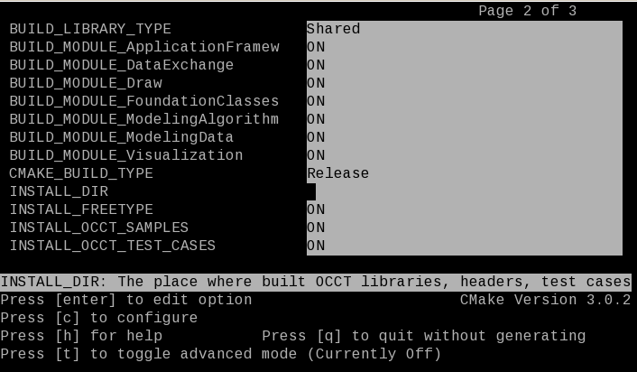
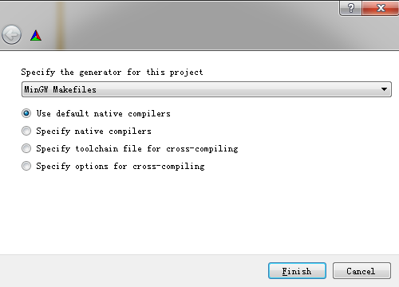

[TOC]


# Building OCCT from sources

在编译OCCT之前，请确保已安装所有必需的第三方库。 所需库的列表取决于将使用哪些OCCT模块以及个人需求。 典型的最小版本是Freetype（可视化所必需）和Tcl / Tk（对于DRAW Test Harness）。 有关完整列表，请参见概述中的[“第三方库”](https://old.opencascade.com/doc/occt-7.4.0/overview/html/index.html#OCCT_OVW_SECTION_5)部分。

在Windows上，安装第三方库的最简单方法是下载已经预编译的库，在https://www.opencascade.com/content/3rd-party-components上下载。

# Building with CMake （cross-platform）

 *OCCT 需要 CMake 版本 2.8.12 以上*.

## Start CMake

使用CMake-gui来进行编译，

需要配置三个目录：源代码，构建目录和安装目录。

- 源代码目录是OCCT源代码路径
- 构建目录是CMake配置和生成过程中创建的所有文件所在的位置。

- 在安装目录下，将构建由CMake生成过程创建的* INSTALL *项目，以及在应用程序中使用OCCT所需的头文件和资源后，将在其中安装二进制文件。

推荐的做法是不要将源目录用作构建目录。 应在不同的构建目录中构建不同的配置，以避免冲突。 但是，可以为OCCT的多种配置选择一个安装目录（根据平台，位数，编译器和构建类型来区分），例如：

```
d:/occt/                   -- the source directory
d:/tmp/occt-build-vc10-x64 -- the build directory with the generated
                              solution and other intermediate files created during a CMake tool working
d:/occt-install            -- the installation directory that is
                              able to contain several OCCT configurations
```

# Configuration process

如果使用命令行工具，请从构建目录运行该工具，并使用单个参数指示源（相对或绝对路径）目录：

```
cd d:/tmp/occt-build-vc10-x64
ccmake d:/occt
```



按c开始配置。

上面所有的配置过程，下面都将使用GUI工具进行配置。

使用GUI工具，请在不使用其他参数的情况下运行该工具，然后单击“浏览源”来指定源目录，然后单击“浏览构建”来指定一个（二进制）目录。


注意：项目的每个配置都应建立在其自己的目录中。 当构建多个配置时，建议在构建目录的名称中指出系统，位数和编译器（例如d：/ occt / build / win32-vc10）。

点击Configure按钮，选择编译器。




按下“Finish”按钮后，将执行配置过程的第一遍。 在该过程结束时，CMake将输出环境变量列表，必须正确指定这些变量才能成功进行配置。


出现缺少第三方库的错误：

```
CMake Error at CMakeLists.txt:746 (message):
  Could not find headers of used third-party products:
  3RDPARTY_TCL_INCLUDE_DIR 3RDPARTY_TK_INCLUDE_DIR
  3RDPARTY_FREETYPE_INCLUDE_DIR_ft2build
  3RDPARTY_FREETYPE_INCLUDE_DIR_freetype2
```

错误消息提供了有关这些变量的一些信息。 该消息将在该过程的每次通过之后出现，直到正确指定了所有必需的变量为止。

某些变量状态的变化可能导致出现新变量。 在配置过程结束后出现的新变量将由CMake GUI工具用红色突出显示。

注意：存在“分组”选项，该选项将具有公共前缀的变量分组。

下表列出了配置阶段使用的环境变量的完整列表：

| Variable                        | Type         | Purpose                                                      |
| ------------------------------- | ------------ | ------------------------------------------------------------ |
| CMAKE_BUILD_TYPE                | String       | 指定单配置生成器（例如make）上的构建类型。 可能的值为Debug，Release和RelWithDebInfo |
| USE_FREEIMAGE                   | Boolean flag | 指示是否应在OCCT可视化模块中使用FreeImage产品以支持流行的图形图像格式（PNG，BMP等）。 |
| USE_RAPIDJSON                   | Boolean flag | 指示是否应在OCCT数据交换模块中使用RapidJSON产品以支持glTF网格文件格式 |
| USE_TBB                         | Boolean flag | 指示是否使用TBB 3rd party。 TBB代表Intel Corp.的技术Threading Building Blocks，它具有用于将并行性注入您的应用程序的不同机制和模式。 即使没有TBB产品，OCCT仍然保持平行 |
| USE_VTK                         | Boolean flag | 指示是否使用VTK第三方。 VTK代表Visualization ToolKit，这是Kitware Inc.旨在用于通用科学可视化的技术。 OCCT通过专用的VIS组件（VTK集成服务）在CAD数据表示和VTK之间架起了一座桥梁。 除非您打算将VTK可视化用于OCCT几何，否则您可以跳过第三方。 有关VIS的详细信息，请参见官方文档[VTK集成服务（VIS）](https://old.opencascade.com/doc/occt-7.4.0/overview/html/occt_user_guides__vis.html) |
| 3RDPARTY_DIR                    | Path         | 定义将在其中搜索所有必需的第三方产品的根目录。 定义此路径后，单击“配置”按钮非常方便，以便让CMake自动检测所有必需的产品 |
| 3RDPARTY_FREETYPE_*             | Path         | Freetype的二进制库路径                                       |
| 3RDPARTY_TCL_* 3RDPARTY_TK_*    | Path         | Tcl/Tk 的二进制库路径                                        |
| 3RDPARTY_FREEIMAGE*             | Path         | Freeimage的二进制库路径                                      |
| 3RDPARTY_TBB*                   | Path         | TBB binaries的二进制库路径                                   |
| 3RDPARTY_VTK_*                  | Path         | VTK binaries的二进制库路径                                   |
| BUILD_MODULE_<MODULE>           | Boolean flag | 指示是否应构建相应的OCCT模块。 应该注意的是，即使不检查该模块，也可以构建该模块的某些工具箱（如果某些其他模块依赖于这些工具箱，也会检查该模块）。 主要模块及其说明可在 [用户指南](https://old.opencascade.com/doc/occt-7.4.0/overview/html/user_guides.html)中找到 |
| BUILD_LIBRARY_TYPE              | String       | 指定要创建的库的类型。 动态链接“共享”库在运行时加载。 “静态”库在链接阶段，会将汇编生成的目标文件.o与引用到的库一起链接打包到可执行文件中。请注意，[Draw](https://old.opencascade.com/doc/occt-7.4.0/refman/html/class_draw.html)Harness插件系统与“静态”版本不兼容，因此对于这些版本禁用。 |
| BUILD_ADDITIONAL_TOOLKITS       | String       | 以分号分隔的单个工具包，可包含在构建过程中。 如果只想构建某些特定的库（工具箱），则可以取消选中相应的* BUILD_MODUE_ <MODULE> *选项中的所有模块，并在此处提供必需库的列表。所有依赖关系都会自动解决 |
| BUILD_YACCLEX                   | Boolean flag | 启用Flex/Bison词法分析器。与STEP Reader和[ExprIntrp](https://old.opencascade.com/doc/occt-7.4.0/refman/html/class_expr_intrp.html)功能相关的OCCT源文件是使用Flex/Bison自动生成的。 选中此选项将导致自动搜索Flex/Bison二进制文件并重新生成上面提到的的文件 |
| BUILD_SAMPLES_MFC               | Boolean flag | 指示是否应将MFC样例与OCCT一起构建。 此选项仅与Windows平台有关 |
| BUILD_SAMPLES_QT                | Boolean flag | 指示是否应与OCCT一起构建QT样例。                             |
| BUILD_Inspector                 | Boolean flag | 指示是否应与OCCT一起构建Inspector。                          |
| BUILD_DOC_Overview              | Boolean flag | 指示是否应与OCCT一起创建OCCT概述文档项目。 它不是与OCCT一起构建的。 选中此选项将导致自动搜索Doxygen二进制文件。 它的构建调用Doxygen命令以生成HTML格式的文档 |
| BUILD_PATCH                     | Path         | 指向被识别为OCCT“patch”的目录。 如果指定，则此目录中的文件优先于相应的本机OCCT源。 这样，就可以将补丁引入Open CASCADE Technology，而不会影响原始的源分发 |
| BUILD_WITH_DEBUG                | Boolean flag | 启用许多OCCT算法的扩展消息，通常会打印到cout。 这些消息包括有关内部错误和遇到的特殊情况，时间安排等的消息。 |
| BUILD_ENABLE_FPE_SIGNAL_HANDLER | Boolean flag | 仅在DRAW执行期间启用/禁用浮点异常（FPE）。 可以在custom.bat/sh脚本中手动更改相应的环境变量（CSF_FPE），而无需通过CMake重新生成。 |
| CMAKE_CONFIGURATION_TYPES       | String       | 以分号分隔的CMake配置                                        |
| INSTALL_DIR                     | Path         | 指向安装目录。 * INSTALL_DIR *是* CMAKE_INSTALL_PREFIX *的同义词。 用户可以指定* INSTALL_DIR *或* CMAKE_INSTALL_PREFIX * |
| INSTALL_DIR_BIN                 | Path         | 二进制安装目录的相对路径（绝对路径为\${INSTALL_DIR}/${INSTALL_DIR_BIN}） |
| INSTALL_DIR_SCRIPT              | Path         | 脚本安装目录的相对路径（绝对路径为\${INSTALL_DIR}/${INSTALL_DIR_SCRIPT}） |
| INSTALL_DIR_LIB                 | Path         | 库安装目录的相对路径（绝对路径为\${INSTALL_DIR}/${INSTALL_DIR_LIB}） |
| INSTALL_DIR_INCLUDE             | Path         | 包含安装目录的相对路径（绝对路径为\${INSTALL_DIR}/${INSTALL_DIR_INCLUDE}） |
| INSTALL_DIR_RESOURCE            | Path         | 资源安装目录的相对路径（绝对路径为\${INSTALL_DIR}/${INSTALL_DIR_RESOURCE}） |
| INSTALL_DIR_LAYOUT              | String       | 定义安装目录的OCCT文件的结构（二进制文件，资源，头文件等）。 预定义了两个变体：用于Windows（标准OCCT布局）和用于Unix操作系统（标准Linux布局）。 如果需要，可以使用INSTALL_DIR_ *变量自定义布局 |
| INSTALL_DIR_DATA                | Path         | 数据文件安装目录的相对路径（绝对路径为\${INSTALL_DIR}/${INSTALL_DIR_DATA}） |
| INSTALL_DIR_SAMPLES             | Path         | 样例安装目录的相对路径。 请注意，将仅安装“samples/tcl”文件夹。（绝对路径为\${INSTALL_DIR}/${INSTALL_DIR_SAMPLES}） |
| INSTALL_DIR_TESTS               | Path         | 测试安装目录的相对路径（绝对路径为\${INSTALL_DIR}/${INSTALL_DIR_TESTS}） |
| INSTALL_DIR_DOC                 | Path         | 文档安装目录的相对路径（绝对路径为\${INSTALL_DIR}/${INSTALL_DIR_DOC}） |
| INSTALL_FREETYPE                | Boolean flag | 指定是否应将Freetype二进制文件安装到安装目录中               |
| INSTALL_FREEIMAGE*              | Boolean flag | 指定Freeimage二进制文件是否应安装到安装目录中                |
| INSTALL_TBB                     | Boolean flag | 指定是否应将TBB二进制文件安装到安装目录中                    |
| INSTALL_VTK                     | Boolean flag | 指定是否将VTK二进制文件安装到安装目录中                      |
| INSTALL_TCL                     | Boolean flag | 指定是否应将TCL二进制文件安装到安装目录中                    |
| INSTALL_TEST_CASES              | Boolean flag | 指定是否应将non-regressionOCCT测试脚本安装到安装目录中       |
| INSTALL_DOC_Overview            | Boolean flag | 指定OCCT概述文档是否应安装到安装目录中                       |

注意：在定义路径的CMake选项中，仅接受正斜杠（“ /”）。

Before building OCCT, make sure to have all the required third-party libraries installed. The list of required libraries depends on what OCCT modules will be used, and your preferences. The typical minimum is **Freetype** (necessary for Visualization) and **Tcl/Tk** (for DRAW Test Harness). See "Third-party libraries" section in [Overview](https://old.opencascade.com/doc/occt-7.4.0/overview/html/index.html#OCCT_OVW_SECTION_5) for a full list.

On Windows, the easiest way to install third-party libraries is to download archive with pre-built binaries from https://www.opencascade.com/content/3rd-party-components. On Linux and OS X, it is recommended to use the version installed in the system natively.

下载windows下的第三方mingw库文件，如下图所示


在cmake-gui配置如下：

1.配置需要使用的第三方库


2.配置画黄线位置的参数


3.配置INSTALL下的INSTALL_DIR变量，是occ编译完成之后的安装路径。

配置和生成完成之后，打开cmd进入build目录，输入mingw32-make进行编译，编译完成之后，输入mingw32-make install 安装occ。

# 第一个程序

使用官方例子opencascade-7.5.0\samples\qt\Tutorial，将Tutorial拷贝到你的工程目录，修改Tutorial.pro如下所示

```
TEMPLATE = app
CONFIG += debug_and_release qt

TARGET = Tutorial


SAMPLESROOT = D:/OCCT/opencascade-7.5.0/samples/qt

HEADERS   = src/ApplicationTut.h \
            src/DocumentTut.h \
            $${SAMPLESROOT}/Common/src/*.h \
            $${SAMPLESROOT}/Interface/src/*.h

SOURCES   = src/Main.cxx \
            src/ApplicationTut.cxx  \
            src/DocumentTut.cxx \
            src/MakeBottle.cxx   \
            $${SAMPLESROOT}/Common/src/*.cxx \
            $${SAMPLESROOT}/Interface/src/*.cxx

TS_FILES  = $${SAMPLESROOT}/Common/src/Common-icon.ts \
            $${SAMPLESROOT}/Common/src/Common-string.ts \
            ./src/Tutorial-icon.ts \
            ./src/Tutorial-string.ts

RES_FILES = $${SAMPLESROOT}/Common/res/* \
            ./res/Bottle.png    \
            ./res/SampleImportExport.png

RES_DIR   = $$quote($$(RES_DIR))

INCLUDEPATH += $$quote($${SAMPLESROOT}/Common/src)
INCLUDEPATH += $$quote($${SAMPLESROOT}/Interface/src)
INCLUDEPATH += $$quote($$(CSF_OCCTIncludePath))
INCLUDEPATH += $$quote(D:/OCCT/occ/inc)

OCCT_DEFINES = $$(CSF_DEFINES)

DEFINES = $$split(OCCT_DEFINES, ;)

unix {
    UNAME = $$system(uname -s)
    LIBLIST = $$(LD_LIBRARY_PATH)
    LIBPATHS = $$split(LIBLIST,":")
    for(lib, LIBPATHS):LIBS += -L$${lib}

    CONFIG(debug, debug|release) {
        DESTDIR = ./$$UNAME/bind
        OBJECTS_DIR = ./$$UNAME/objd
        MOC_DIR = ./$$UNAME/mocd
    } else {
        DESTDIR = ./$$UNAME/bin
        OBJECTS_DIR = ./$$UNAME/obj
        MOC_DIR = ./$$UNAME/moc
    }

    MACOSX_USE_GLX = $$(MACOSX_USE_GLX)

    !macx | equals(MACOSX_USE_GLX, true): INCLUDEPATH += $$QMAKE_INCDIR_X11 $$QMAKE_INCDIR_OPENGL $$QMAKE_INCDIR_THREAD
    equals(MACOSX_USE_GLX, true): DEFINES += MACOSX_USE_GLX
    DEFINES += OCC_CONVERT_SIGNALS QT_NO_STL
    !macx | equals(MACOSX_USE_GLX, true): LIBS += -L$$QMAKE_LIBDIR_X11 $$QMAKE_LIBS_X11 -L$$QMAKE_LIBDIR_OPENGL $$QMAKE_LIBS_OPENGL $$QMAKE_LIBS_THREAD
    QMAKE_CXXFLAGS += -std=gnu++11
}

win32 {
    CONFIG(debug, debug|release) {
        DEFINES += _DEBUG
        DESTDIR = ./win$$(ARCH)/$$(VCVER)/bind
        OBJECTS_DIR = ./win$$(ARCH)/$$(VCVER)/objd
        MOC_DIR = ./win$$(ARCH)/$$(VCVER)/mocd
    } else {
        DEFINES += NDEBUG
        DESTDIR = ./win$$(ARCH)/$$(VCVER)/bin
        OBJECTS_DIR = ./win$$(ARCH)/$$(VCVER)/obj
        MOC_DIR = ./win$$(ARCH)/$$(VCVER)/moc
    }
    LIBS = -L$$(QTDIR)/lib;$$(CSF_OCCTLibPath)
    DEFINES += NO_COMMONSAMPLE_EXPORTS NO_IESAMPLE_EXPORTS
}

LIBS += -LD:/OCCT/occ/win64/gcc/lib \
        -lTKernel -lTKMath -lTKService -lTKV3d -lTKOpenGl \
        -lTKBRep -lTKIGES -lTKSTL -lTKVRML -lTKSTEP -lTKSTEPAttr -lTKSTEP209 \
        -lTKSTEPBase -lTKGeomBase -lTKGeomAlgo -lTKG3d -lTKG2d \
        -lTKXSBase -lTKShHealing -lTKHLR -lTKTopAlgo -lTKMesh -lTKPrim \
        -lTKCDF -lTKBool -lTKBO -lTKFillet -lTKOffset -lTKLCAF \

!exists($${RES_DIR}) {
    win32 {
        system(mkdir $${RES_DIR})
    } else {
        system(mkdir -p $${RES_DIR})
    }
}

lrelease.name = LRELEASE ${QMAKE_FILE_IN}
lrelease.commands = lrelease ${QMAKE_FILE_IN} -qm $${RES_DIR}/${QMAKE_FILE_BASE}.qm
lrelease.output = ${QMAKE_FILE_BASE}.qm
lrelease.input = TS_FILES
lrelease.clean = $${RES_DIR}/${QMAKE_FILE_BASE}.qm
lrelease.CONFIG += no_link target_predeps
QMAKE_EXTRA_COMPILERS += lrelease

copy_res.name = Copy resource ${QMAKE_FILE_IN}
copy_res.output = ${QMAKE_FILE_BASE}${QMAKE_FILE_EXT}
copy_res.clean = $${RES_DIR}/${QMAKE_FILE_BASE}${QMAKE_FILE_EXT}
copy_res.input = RES_FILES
copy_res.CONFIG += no_link target_predeps
win32: copy_res.commands = type ${QMAKE_FILE_IN} > $${RES_DIR}/${QMAKE_FILE_BASE}${QMAKE_FILE_EXT}
unix:  copy_res.commands = cp -f ${QMAKE_FILE_IN} $${RES_DIR}
QMAKE_EXTRA_COMPILERS += copy_res
#QMAKE_CXXFLAGS += /wd4996

greaterThan(QT_MAJOR_VERSION, 4) {
    QT += widgets
} 

```

主要修改如下：

```
SAMPLESROOT = D:/OCCT/opencascade-7.5.0/samples/qt
```

```
HEADERS   = src/ApplicationTut.h \
            src/DocumentTut.h \
            $${SAMPLESROOT}/Common/src/*.h \
            $${SAMPLESROOT}/Interface/src/*.h

SOURCES   = src/Main.cxx \
            src/ApplicationTut.cxx  \
            src/DocumentTut.cxx \
            src/MakeBottle.cxx   \
            $${SAMPLESROOT}/Common/src/*.cxx \
            $${SAMPLESROOT}/Interface/src/*.cxx

TS_FILES  = $${SAMPLESROOT}/Common/src/Common-icon.ts \
            $${SAMPLESROOT}/Common/src/Common-string.ts \
            ./src/Tutorial-icon.ts \
            ./src/Tutorial-string.ts

RES_FILES = $${SAMPLESROOT}/Common/res/* \
            ./res/Bottle.png    \
            ./res/SampleImportExport.png

```

```
INCLUDEPATH += $$quote(D:/OCCT/occ/inc)
```

```
LIBS += -LD:/OCCT/occ/win64/gcc/lib \
```


# 编译错误

## 错误1

```
Info: Freetype is used by OCCT
CMake Error at C:/VTK/VTK_INSTALL/lib/cmake/vtk-8.2/vtkModuleAPI.cmake:140 (message):
  Requested modules not available:

    vtkGUISupportQtWebkit
Call Stack (most recent call first):
  C:/VTK/VTK_INSTALL/lib/cmake/vtk-8.2/VTKConfig.cmake:143 (vtk_module_config)
  adm/cmake/vtk.cmake:63 (find_package)
  CMakeLists.txt:14 (include)
  CMakeLists.txt:523 (OCCT_INCLUDE_CMAKE_FILE)
```

查看源代码VTK-8.2.0\GUISupport\QtWebkit路径下module.cmake得知

```
vtk_module(vtkGUISupportQtWebkit
  LEGACY 8.1 "The module is no longer supported."
```

编译VTK8.1以后的版本已经不支持vtkGUISupportQtWebkit，所以编译vtk的时候，去掉选项vtkGUISupportQtWebkit。


