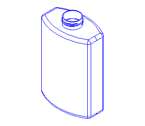
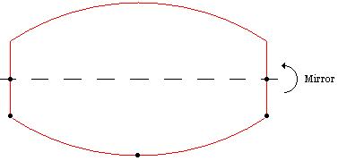
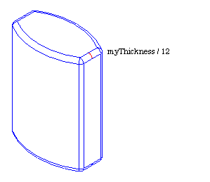
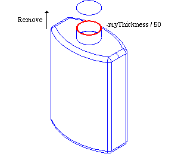
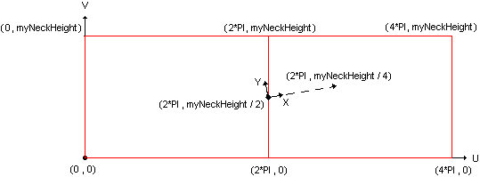
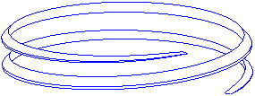
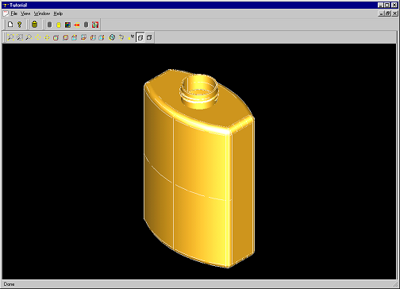

[TOC]

To illustrate the use of classes provided in the 3D geometric modeling toolkits, you will create a bottle as shown:



# Model Specifications

We first define the bottle specifications as follows:

| Object Parameter | Parameter Name | Parameter Value |
| ---------------- | -------------- | --------------- |
| Bottle height    | MyHeight       | 70mm            |
| Bottle width     | MyWidth        | 50mm            |
| Bottle thickness | MyThickness    | 30mm            |

In addition, we decide that the bottle's profile (base) will be centered on the origin of the global Cartesian coordinate system.

coordinate system: 坐标系


This modeling requires four steps:

- build the bottle's Profile
- build the bottle's Body
- build the Threading on the bottle's neck
- build the result compound

# Building the Profile

## Defining Support Points

To create the bottle's profile, you first create characteristic points with their coordinates as shown below in the (XOY) plane. These points will be the supports that define the geometry of the profile.

要创建瓶子的轮廓，首先在 (XOY) 平面中创建特征点及其坐标，如下所示。 这些点将是定义轮廓几何形状的支撑。


There are two classes to describe a 3D Cartesian point from its X, Y and Z coordinates in Open CASCADE Technology:

在 Open CASCADE 技术中，有两个类可以从 X、Y 和 Z 坐标描述 3D 笛卡尔点：

- the primitive geometric *[gp_Pnt](https://old.opencascade.com/doc/occt-7.4.0/refman/html/classgp___pnt.html)* class
- 原始几何 *[gp_Pnt](https://old.opencascade.com/doc/occt-7.4.0/refman/html/classgp___pnt.html)* 类
- the transient *[Geom_CartesianPoint](https://old.opencascade.com/doc/occt-7.4.0/refman/html/class_geom___cartesian_point.html)* class manipulated by handle
- 瞬态 *[Geom_CartesianPoint](https://old.opencascade.com/doc/occt-7.4.0/refman/html/class_geom___cartesian_point.html)* 由句柄操作的类

A handle is a type of smart pointer that provides automatic memory management. To choose the best class for this application, consider the following:

句柄是一种提供自动内存管理的智能指针。要为此应用程序选择最佳类，请考虑以下事项：

- *[gp_Pnt](https://old.opencascade.com/doc/occt-7.4.0/refman/html/classgp___pnt.html)* is manipulated by value. Like all objects of its kind, it will have a limited lifetime.
- *[gp_Pnt](https://old.opencascade.com/doc/occt-7.4.0/refman/html/classgp___pnt.html)* 由值操作。像所有同类对象一样，它的生命周期是有限的。
- *[Geom_CartesianPoint](https://old.opencascade.com/doc/occt-7.4.0/refman/html/class_geom___cartesian_point.html)* is manipulated by handle and may have multiple references and a long lifetime.
- *[Geom_CartesianPoint](https://old.opencascade.com/doc/occt-7.4.0/refman/html/class_geom___cartesian_point.html)* 由句柄操作，可能有多个引用和很长的生命周期。

Since all the points you will define are only used to create the profile's curves, an object with a limited lifetime will do. Choose the *[gp_Pnt](https://old.opencascade.com/doc/occt-7.4.0/refman/html/classgp___pnt.html)* class. To instantiate a *[gp_Pnt](https://old.opencascade.com/doc/occt-7.4.0/refman/html/classgp___pnt.html)* object, just specify the X, Y, and Z coordinates of the points in the global Cartesian coordinate system:

由于将定义的所有点仅用于创建轮廓曲线，因此具有有限生命周期的对象就可以了。选择 *[gp_Pnt](https://old.opencascade.com/doc/occt-7.4.0/refman/html/classgp___pnt.html)* 类。要实例化 *[gp_Pnt](https://old.opencascade.com/doc/occt-7.4.0/refman/html/classgp___pnt.html)* 对象，只需指定点的 X、Y 和 Z 坐标在全局笛卡尔坐标系中：

```
gp_Pnt aPnt1(-myWidth / 2., 0, 0);
gp_Pnt aPnt2(-myWidth / 2., -myThickness / 4., 0);
gp_Pnt aPnt3(0, -myThickness / 2., 0);
gp_Pnt aPnt4(myWidth / 2., -myThickness / 4., 0);
gp_Pnt aPnt5(myWidth / 2., 0, 0);
```

Once your objects are instantiated, you can use methods provided by the class to access and modify its data. For example, to get the X coordinate of a point:

一旦你的对象被实例化，你就可以使用类提供的方法来访问和修改它的数据。 例如，要获取一个点的 X 坐标：

```
Standard_Real xValue1 = aPnt1.X();
```

## Profile: Defining the Geometry

With the help of the previously defined points, you can compute a part of the bottle's profile geometry. As shown in the figure below, it will consist of two segments and one arc.

借助先前定义的点，您可以计算瓶子轮廓几何形状的一部分。 如下图所示，它将由两条线段和一条弧线组成。


To create such entities, you need a specific data structure, which implements 3D geometric objects. This can be found in the Geom package of Open CASCADE Technology. In Open CASCADE Technology a package is a group of classes providing related functionality. The classes have names that start with the name of a package they belong to. For example, *[Geom_Line](https://old.opencascade.com/doc/occt-7.4.0/refman/html/class_geom___line.html)* and *[Geom_Circle](https://old.opencascade.com/doc/occt-7.4.0/refman/html/class_geom___circle.html)* classes belong to the *Geom* package. The *Geom* package implements 3D geometric objects: elementary curves and surfaces are provided as well as more complex ones (such as *Bezier* and *BSpline*). However, the *Geom* package provides only the data structure of geometric entities. You can directly instantiate classes belonging to *Geom*, but it is easier to compute elementary curves and surfaces by using the *GC* package. This is because the *GC* provides two algorithm classes which are exactly what is required for our profile:

要创建这样的实体，您需要一个实现 3D 几何对象的特定数据结构。这可以在 Open CASCADE Technology 的 Geom 包中找到。在 Open CASCADE Technology 中，包是一组提供相关功能的类。类的名称以它们所属的包的名称开头。例如，*[Geom_Line](https://old.opencascade.com/doc/occt-7.4.0/refman/html/class_geom___line.html)* 和 *[Geom_Circle](https://old.opencascade.com /doc/occt-7.4.0/refman/html/class_geom___circle.html)* 类属于 *Geom* 包。 *Geom* 包实现了 3D 几何对象：提供了基本曲线和曲面以及更复杂的曲线和曲面（例如 *Bezier* 和 *BSpline*）。但是，*Geom* 包仅提供几何实体的数据结构。您可以直接实例化属于 *Geom* 的类，但使用 *GC* 包更容易计算基本曲线和曲面。这是因为 *GC* 提供了两个算法类，它们正是我们的配置文件所需要的：

- Class *[GC_MakeSegment](https://old.opencascade.com/doc/occt-7.4.0/refman/html/class_g_c___make_segment.html)* to create a segment. One of its constructors allows you to define a segment by two end points P1 and P2
- 类 *[GC_MakeSegment](https://old.opencascade.com/doc/occt-7.4.0/refman/html/class_g_c___make_segment.html)* 创建一个段。 它的构造函数之一允许通过两个端点 P1 和 P2 定义一个段
- Class *[GC_MakeArcOfCircle](https://old.opencascade.com/doc/occt-7.4.0/refman/html/class_g_c___make_arc_of_circle.html)* to create an arc of a circle. A useful constructor creates an arc from two end points P1 and P3 and going through P2.
- 类 *[GC_MakeArcOfCircle](https://old.opencascade.com/doc/occt-7.4.0/refman/html/class_g_c___make_arc_of_circle.html)* 以创建圆弧。 一个有用的构造函数从两个端点 P1 和 P3 并通过 P2 创建一个弧。

Both of these classes return a *[Geom_TrimmedCurve](https://old.opencascade.com/doc/occt-7.4.0/refman/html/class_geom___trimmed_curve.html)* manipulated by handle. This entity represents a base curve (line or circle, in our case), limited between two of its parameter values. For example, circle C is parameterized between 0 and 2PI. If you need to create a quarter of a circle, you create a *[Geom_TrimmedCurve](https://old.opencascade.com/doc/occt-7.4.0/refman/html/class_geom___trimmed_curve.html)* on C limited between 0 and M_PI/2.

这两个类都返回由句柄操作的 *[Geom_TrimmedCurve](https://old.opencascade.com/doc/occt-7.4.0/refman/html/class_geom___trimmed_curve.html)*。 这个实体代表一条基本曲线（在我们的例子中是直线或圆），限制在它的两个参数值之间。 例如，圆 C 参数化在 0 和 2PI 之间。 如果需要创建四分之一圆，则在 C 上创建一个 *[Geom_TrimmedCurve](https://old.opencascade.com/doc/occt-7.4.0/refman/html/class_geom___trimmed_curve.html)* 0 和 M_PI/2。

```
Handle(Geom_TrimmedCurve) aArcOfCircle = GC_MakeArcOfCircle(aPnt2,aPnt3,aPnt4);
Handle(Geom_TrimmedCurve) aSegment1    = GC_MakeSegment(aPnt1, aPnt2);
Handle(Geom_TrimmedCurve) aSegment2    = GC_MakeSegment(aPnt4, aPnt5);
```

All *GC* classes provide a casting method to obtain a result automatically with a function-like call. Note that this method will raise an exception if construction has failed. To handle possible errors more explicitly, you may use the *IsDone* and *Value* methods. For example:

所有 *GC* 类都提供了一种强制转换方法，可以通过类似函数的调用自动获取结果。 请注意，如果构造失败，此方法将引发异常。 为了更明确地处理可能的错误，您可以使用 *IsDone* 和 *Value* 方法。 例如：

```
GC_MakeSegment mkSeg (aPnt1, aPnt2);
Handle(Geom_TrimmedCurve) aSegment1;
if(mkSegment.IsDone()){
    aSegment1 = mkSeg.Value();
}
else {
// handle error
}
```

## Profile: Defining the Topology

You have created the support geometry of one part of the profile but these curves are independent with no relations between each other. To simplify the modeling, it would be right to manipulate these three curves as a single entity. This can be done by using the topological data structure of Open CASCADE Technology defined in the *[TopoDS](https://old.opencascade.com/doc/occt-7.4.0/refman/html/class_topo_d_s.html)* package: it defines relationships between geometric entities which can be linked together to represent complex shapes. Each object of the *[TopoDS](https://old.opencascade.com/doc/occt-7.4.0/refman/html/class_topo_d_s.html)* package, inheriting from the *[TopoDS_Shape](https://old.opencascade.com/doc/occt-7.4.0/refman/html/class_topo_d_s___shape.html)* class, describes a topological shape as described below:

您已经创建了轮廓的一部分的支撑几何体，但这些曲线是相互独立的，彼此之间没有关系。 为了简化建模，将这三条曲线作为单个实体进行操作是正确的。 这可以通过使用*[TopoDS](https://old.opencascade.com/doc/occt-7.4.0/refman/html/class_topo_d_s.html)*包中定义的Open CASCADE Technology的拓扑数据结构来完成 ：它定义了可以链接在一起以表示复杂形状的几何实体之间的关系。 *[TopoDS](https://old.opencascade.com/doc/occt-7.4.0/refman/html/class_topo_d_s.html)*包的每个对象，继承自*[TopoDS_Shape](https:// old.opencascade.com/doc/occt-7.4.0/refman/html/class_topo_d_s___shape.html)* 类，描述了如下所述的拓扑形状：

| Shape     | Open CASCADE Technology Class                                | Description                                                  |
| --------- | ------------------------------------------------------------ | ------------------------------------------------------------ |
| Vertex    | [TopoDS_Vertex](https://old.opencascade.com/doc/occt-7.4.0/refman/html/class_topo_d_s___vertex.html) | Zero dimensional shape corresponding to a point in geometry.对应于几何中的一个点的零维形状。 |
| Edge      | [TopoDS_Edge](https://old.opencascade.com/doc/occt-7.4.0/refman/html/class_topo_d_s___edge.html) | One-dimensional shape corresponding to a curve and bounded by a vertex at each extremity.与曲线相对应的一维形状，并以每个端点的顶点为界。 |
| Wire      | [TopoDS_Wire](https://old.opencascade.com/doc/occt-7.4.0/refman/html/class_topo_d_s___wire.html) | Sequence of edges connected by vertices.由顶点连接的边序列。 |
| Face      | [TopoDS_Face](https://old.opencascade.com/doc/occt-7.4.0/refman/html/class_topo_d_s___face.html) | Part of a surface bounded by a closed wire(s).由闭合线包围的表面的一部分。 |
| Shell     | [TopoDS_Shell](https://old.opencascade.com/doc/occt-7.4.0/refman/html/class_topo_d_s___shell.html) | Set of faces connected by edges.由边连接的一组面。           |
| Solid     | [TopoDS_Solid](https://old.opencascade.com/doc/occt-7.4.0/refman/html/class_topo_d_s___solid.html) | Part of 3D space bounded by Shells.由壳包围的 3D 空间的一部分。 |
| CompSolid | [TopoDS_CompSolid](https://old.opencascade.com/doc/occt-7.4.0/refman/html/class_topo_d_s___comp_solid.html) | Set of solids connected by their faces.由它们的面连接的一组实体。 |
| Compound  | [TopoDS_Compound](https://old.opencascade.com/doc/occt-7.4.0/refman/html/class_topo_d_s___compound.html) | Set of any other shapes described above.一组上述任何其他形状。 |

Referring to the previous table, to build the profile, you will create:

参考上表，要构建配置文件，您将创建：

- Three edges out of the previously computed curves.
- 先前计算的曲线中的三个边。
- One wire with these edges.
- 一根带有这些边缘的线。


However, the *[TopoDS](https://old.opencascade.com/doc/occt-7.4.0/refman/html/class_topo_d_s.html)* package provides only the data structure of the topological entities. Algorithm classes available to compute standard topological objects can be found in the *[BRepBuilderAPI](https://old.opencascade.com/doc/occt-7.4.0/refman/html/class_b_rep_builder_a_p_i.html)* package. To create an edge, you use the [BRepBuilderAPI_MakeEdge](https://old.opencascade.com/doc/occt-7.4.0/refman/html/class_b_rep_builder_a_p_i___make_edge.html) class with the previously computed curves:

但是，*[TopoDS](https://old.opencascade.com/doc/occt-7.4.0/refman/html/class_topo_d_s.html)* 包仅提供拓扑实体的数据结构。 可用于计算标准拓扑对象的算法类可以在 *[BRepBuilderAPI](https://old.opencascade.com/doc/occt-7.4.0/refman/html/class_b_rep_builder_a_p_i.html)* 包中找到。 要创建边，请使用 [BRepBuilderAPI_MakeEdge](https://old.opencascade.com/doc/occt-7.4.0/refman/html/class_b_rep_builder_a_p_i___make_edge.html) 类和先前计算的曲线：

```
TopoDS_Edge aEdge1 = BRepBuilderAPI_MakeEdge(aSegment1);
TopoDS_Edge aEdge2 = BRepBuilderAPI_MakeEdge(aArcOfCircle);
TopoDS_Edge aEdge3 = BRepBuilderAPI_MakeEdge(aSegment2);
```

In Open CASCADE Technology, you can create edges in several ways. One possibility is to create an edge directly from two points, in which case the underlying geometry of this edge is a line, bounded by two vertices being automatically computed from the two input points. For example, aEdge1 and aEdge3 could have been computed in a simpler way:

在 Open CASCADE Technology 中，您可以通过多种方式创建边。 一种可能性是直接从两个点创建一条边，在这种情况下，这条边的基础几何图形是一条线，由两个输入点自动计算出的两个顶点为界。 例如，aEdge1 和 aEdge3 可以用更简单的方式计算：

```
TopoDS_Edge aEdge1 = BRepBuilderAPI_MakeEdge(aPnt1, aPnt3);
TopoDS_Edge aEdge2 = BRepBuilderAPI_MakeEdge(aPnt4, aPnt5);
```

To connect the edges, you need to create a wire with the *[BRepBuilderAPI_MakeWire](https://old.opencascade.com/doc/occt-7.4.0/refman/html/class_b_rep_builder_a_p_i___make_wire.html)* class. There are two ways of building a wire with this class:

要连接边，您需要使用 *[BRepBuilderAPI_MakeWire](https://old.opencascade.com/doc/occt-7.4.0/refman/html/class_b_rep_builder_a_p_i___make_wire.html)* 类创建连线。 使用此类构建线有两种方法：

- directly from one to four edges
- 直接从一到四边
- by adding other wire(s) or edge(s) to an existing wire (this is explained later in this tutorial)
- 通过将其他线或边添加到现有线（本教程稍后将对此进行解释）

When building a wire from less than four edges, as in the present case, you can use the constructor directly as follows:

当从少于四个边构建连线时，如在本例中，您可以直接使用构造函数，如下所示：

```
TopoDS_Wire aWire = BRepBuilderAPI_MakeWire(aEdge1, aEdge2, aEdge3);
```

## Profile: Completing the Profile

Once the first part of your wire is created you need to compute the complete profile. A simple way to do this is to:

创建线的第一部分后，需要计算完整的轮廓。 一个简单的方法是：

- compute a new wire by reflecting the existing one.
- 通过反映现有线来计算新线。
- add the reflected wire to the initial one.
- 将反射线添加到初始线。



To apply a transformation on shapes (including wires), you first need to define the properties of a 3D geometric transformation by using the [gp_Trsf](https://old.opencascade.com/doc/occt-7.4.0/refman/html/classgp___trsf.html) class. This transformation can be a translation, a rotation, a scale, a reflection, or a combination of these. In our case, we need to define a reflection with respect to the X axis of the global coordinate system. An axis, defined with the [gp_Ax1](https://old.opencascade.com/doc/occt-7.4.0/refman/html/classgp___ax1.html) class, is built out of a point and has a direction (3D unitary vector). There are two ways to define this axis. The first way is to define it from scratch, using its geometric definition:

要对形状（包括线）应用变换，首先需要使用 [gp_Trsf](https://old.opencascade.com/doc/occt-7.4.0/refman/ html/classgp___trsf.html) 类。 这种变换可以是平移、旋转、缩放、反射或这些的组合。 在我们的例子中，我们需要定义一个关于全局坐标系 X 轴的反射。 使用 [gp_Ax1](https://old.opencascade.com/doc/occt-7.4.0/refman/html/classgp___ax1.html) 类定义的轴由一个点构建并具有方向（3D 酉向量）。 有两种方法可以定义此轴。 第一种方法是从头开始定义它，使用其几何定义：

- X axis is located at (0, 0, 0) - use the *[gp_Pnt](https://old.opencascade.com/doc/occt-7.4.0/refman/html/classgp___pnt.html)* class.
- X axis direction is (1, 0, 0) - use the *[gp_Dir](https://old.opencascade.com/doc/occt-7.4.0/refman/html/classgp___dir.html)* class. A *[gp_Dir](https://old.opencascade.com/doc/occt-7.4.0/refman/html/classgp___dir.html)* instance is created out of its X, Y and Z coordinates.

```
gp_Pnt aOrigin(0, 0, 0);
gp_Dir xDir(1, 0, 0);
gp_Ax1 xAxis(aOrigin, xDir);
```

The second and simplest way is to use the geometric constants defined in the gp package (origin, main directions and axis of the global coordinate system). To get the X axis, just call the *[gp::OX](https://old.opencascade.com/doc/occt-7.4.0/refman/html/classgp.html#a7460fa9ba665fb36af8e235dd628e999)* method:

第二种也是最简单的方法是使用 gp 包中定义的几何常数（全局坐标系的原点、主要方向和轴）。 要获取 X 轴，只需调用 *[gp::OX](https://old.opencascade.com/doc/occt-7.4.0/refman/html/classgp.html#a7460fa9ba665fb36af8e235dd628e999)* 方法：

```
gp_Ax1 xAxis = gp::OX();
```

As previously explained, the 3D geometric transformation is defined with the *[gp_Trsf](https://old.opencascade.com/doc/occt-7.4.0/refman/html/classgp___trsf.html)* class. There are two different ways to use this class:

如前所述，3D 几何变换是用 *[gp_Trsf](https://old.opencascade.com/doc/occt-7.4.0/refman/html/classgp___trsf.html)* 类定义的。 有两种不同的方式来使用这个类：

- by defining a transformation matrix by all its values
- 通过所有值定义一个变换矩阵
- by using the appropriate methods corresponding to the required transformation (SetTranslation for a translation, SetMirror for a reflection, etc.): the matrix is automatically computed.
- 通过使用与所需变换相对应的适当方法（用于平移的 SetTranslation、用于反射的 SetMirror 等）：自动计算矩阵。

Since the simplest approach is always the best one, you should use the SetMirror method with the axis as the center of symmetry.

由于最简单的方法总是最好的方法，因此您应该使用以轴为对称中心的 SetMirror 方法。

```
gp_Trsf aTrsf;
aTrsf.SetMirror(xAxis);
```

You now have all necessary data to apply the transformation with the [BRepBuilderAPI_Transform](https://old.opencascade.com/doc/occt-7.4.0/refman/html/class_b_rep_builder_a_p_i___transform.html) class by specifying:

通过指定，您现在拥有使用 [BRepBuilderAPI_Transform](https://old.opencascade.com/doc/occt-7.4.0/refman/html/class_b_rep_builder_a_p_i___transform.html) 类应用转换所需的所有数据：

- the shape on which the transformation must be applied.
- 必须对其应用变换的形状。
- the geometric transformation
- 几何变换

```
BRepBuilderAPI_Transform aBRepTrsf(aWire, aTrsf);
```

*[BRepBuilderAPI_Transform](https://old.opencascade.com/doc/occt-7.4.0/refman/html/class_b_rep_builder_a_p_i___transform.html)* does not modify the nature of the shape: the result of the reflected wire remains a wire. But the function-like call or the *[BRepBuilderAPI_Transform::Shape](https://old.opencascade.com/doc/occt-7.4.0/refman/html/class_b_rep_builder_a_p_i___make_shape.html#a5b5b6e22f99b84ee579f163ce4ffd9a9)* method returns a *[TopoDS_Shape](https://old.opencascade.com/doc/occt-7.4.0/refman/html/class_topo_d_s___shape.html)* object:

*BRepBuilderAPI_Transform* 不会修改形状的性质：反射线的结果仍然是线。 但是类似函数的调用或 *BRepBuilderAPI_Transform::Shape* 方法返回一个 *TopoDS_Shape* 对象：

```
TopoDS_Shape aMirroredShape = aBRepTrsf.Shape();
```

What you need is a method to consider the resulting reflected shape as a wire. The *[TopoDS](https://old.opencascade.com/doc/occt-7.4.0/refman/html/class_topo_d_s.html)* global functions provide this kind of service by casting a shape into its real type. To cast the transformed wire, use the *[TopoDS::Wire](https://old.opencascade.com/doc/occt-7.4.0/refman/html/class_topo_d_s.html#af3690329259b707d59081598d253fac8)* method.

您需要的是一种将生成的反射形状视为线的方法。 *[TopoDS](https://old.opencascade.com/doc/occt-7.4.0/refman/html/class_topo_d_s.html)* 全局函数通过将形状转换为其真实类型来提供此类服务。 要投射转换后的电线，请使用 *[TopoDS::Wire](https://old.opencascade.com/doc/occt-7.4.0/refman/html/class_topo_d_s.html#af3690329259b707d59081598d253fac8)* 方法。

```
TopoDS_Wire aMirroredWire = TopoDS::Wire(aMirroredShape);
```

The bottle's profile is almost finished. You have created two wires: *aWire* and *aMirroredWire*. You need to concatenate them to compute a single shape. To do this, you use the *[BRepBuilderAPI_MakeWire](https://old.opencascade.com/doc/occt-7.4.0/refman/html/class_b_rep_builder_a_p_i___make_wire.html)* class as follows:

瓶子的轮廓几乎完成了。 您已经创建了两条线：*aWire* 和 *aMirroredWire*。 您需要连接它们以计算单个形状。 为此，您可以使用 *[BRepBuilderAPI_MakeWire](https://old.opencascade.com/doc/occt-7.4.0/refman/html/class_b_rep_builder_a_p_i___make_wire.html)* 类，如下所示：

- create an instance of *[BRepBuilderAPI_MakeWire](https://old.opencascade.com/doc/occt-7.4.0/refman/html/class_b_rep_builder_a_p_i___make_wire.html)*.
- 创建一个 *[BRepBuilderAPI_MakeWire](https://old.opencascade.com/doc/occt-7.4.0/refman/html/class_b_rep_builder_a_p_i___make_wire.html)* 的实例。
- add all edges of the two wires by using the *Add* method on this object.
- 通过在此对象上使用 *Add* 方法添加两条线的所有边缘。

```
BRepBuilderAPI_MakeWire mkWire;
mkWire.Add(aWire);
mkWire.Add(aMirroredWire);
TopoDS_Wire myWireProfile = mkWire.Wire();
```

# Building the Body

## Prism the Profile

To compute the main body of the bottle, you need to create a solid shape. The simplest way is to use the previously created profile and to sweep it along a direction. The *Prism* functionality of Open CASCADE Technology is the most appropriate for that task. It accepts a shape and a direction as input and generates a new shape according to the following rules:

要计算瓶子的主体，您需要创建一个实体形状。 最简单的方法是使用先前创建的轮廓并沿一个方向扫描它。 Open CASCADE Technology 的 *Prism* 功能最适合该任务。 它接受一个形状和一个方向作为输入，并根据以下规则生成一个新的形状：

| Shape  | Generates          |
| ------ | ------------------ |
| Vertex | Edge               |
| Edge   | Face               |
| Wire   | Shell              |
| Face   | Solid              |
| Shell  | Compound of Solids |


Your current profile is a wire. Referring to the Shape/Generates table, you need to compute a face out of its wire to generate a solid. To create a face, use the *[BRepBuilderAPI_MakeFace](https://old.opencascade.com/doc/occt-7.4.0/refman/html/class_b_rep_builder_a_p_i___make_face.html)* class. As previously explained, a face is a part of a surface bounded by a closed wire. Generally, *[BRepBuilderAPI_MakeFace](https://old.opencascade.com/doc/occt-7.4.0/refman/html/class_b_rep_builder_a_p_i___make_face.html)* computes a face out of a surface and one or more wires. When the wire lies on a plane, the surface is automatically computed.

当前的profile是一条线。 参考 Shape/Generates 表，需要根据其线计算面以生成实体。 要创建面，请使用 *[BRepBuilderAPI_MakeFace](https://old.opencascade.com/doc/occt-7.4.0/refman/html/class_b_rep_builder_a_p_i___make_face.html)* 类。 如前所述，面是由闭合线包围的表面的一部分。 通常，*[BRepBuilderAPI_MakeFace](https://old.opencascade.com/doc/occt-7.4.0/refman/html/class_b_rep_builder_a_p_i___make_face.html)* 计算一个面和一个或多个线。 当线位于平面上时，会自动计算表面。

```
TopoDS_Face myFaceProfile = BRepBuilderAPI_MakeFace(myWireProfile);
```

The *BRepPrimAPI* package provides all the classes to create topological primitive constructions: boxes, cones, cylinders, spheres, etc. Among them is the *[BRepPrimAPI_MakePrism](https://old.opencascade.com/doc/occt-7.4.0/refman/html/class_b_rep_prim_a_p_i___make_prism.html)* class. As specified above, the prism is defined by:

*BRepPrimAPI* 包提供了创建拓扑图元结构的所有类：长方体、圆锥体、圆柱体、球体等。其中包括 *[BRepPrimAPI_MakePrism](https://old.opencascade.com/doc/occt-7.4. 0/refman/html/class_b_rep_prim_a_p_i___make_prism.html)* 类。 如上所述，棱镜定义为：

- the basis shape to sweep;
- 要扫过的基础形状；
- a vector for a finite prism or a direction for finite and infinite prisms.
- 有限棱柱的矢量或有限和无限棱柱的方向。

You want the solid to be finite, swept along the Z axis and to be myHeight height. The vector, defined with the *[gp_Vec](https://old.opencascade.com/doc/occt-7.4.0/refman/html/classgp___vec.html)* class on its X, Y and Z coordinates, is:

您希望实体是有限的，沿 Z 轴扫掠并成为 myHeight 高度。 在 X、Y 和 Z 坐标上用 *[gp_Vec](https://old.opencascade.com/doc/occt-7.4.0/refman/html/classgp___vec.html)* 类定义的向量是：

```
gp_Vec aPrismVec(0, 0, myHeight);
```

All the necessary data to create the main body of your bottle is now available. Just apply the *[BRepPrimAPI_MakePrism](https://old.opencascade.com/doc/occt-7.4.0/refman/html/class_b_rep_prim_a_p_i___make_prism.html)* class to compute the solid:

现在可以使用创建瓶子主体的所有必要数据。 只需应用 *[BRepPrimAPI_MakePrism](https://old.opencascade.com/doc/occt-7.4.0/refman/html/class_b_rep_prim_a_p_i___make_prism.html)* 类来计算实体：

```
TopoDS_Shape myBody = BRepPrimAPI_MakePrism(myFaceProfile, aPrismVec);
```

## Applying Fillets

The edges of the bottle's body are very sharp. To replace them by rounded faces, you use the *Fillet* functionality of Open CASCADE Technology. For our purposes, we will specify that fillets must be:

瓶身的边缘非常锋利。 要将它们替换为圆面，您可以使用 Open CASCADE 技术的 *圆角* 功能。 出于我们的目的，我们将指定圆角必须是：

- applied on all edges of the shape
- 应用于形状的所有边缘
- have a radius of *myThickness* / 12
- 半径为 *myThickness* / 12



To apply fillets on the edges of a shape, you use the *[BRepFilletAPI_MakeFillet](https://old.opencascade.com/doc/occt-7.4.0/refman/html/class_b_rep_fillet_a_p_i___make_fillet.html)* class. This class is normally used as follows:

要在形状的边缘应用圆角，请使用 *[BRepFilletAPI_MakeFillet](https://old.opencascade.com/doc/occt-7.4.0/refman/html/class_b_rep_fillet_a_p_i___make_fillet.html)* 类。 这个类通常如下使用：

- Specify the shape to be filleted in the *[BRepFilletAPI_MakeFillet](https://old.opencascade.com/doc/occt-7.4.0/refman/html/class_b_rep_fillet_a_p_i___make_fillet.html)* constructor.
- 在 *[BRepFilletAPI_MakeFillet](https://old.opencascade.com/doc/occt-7.4.0/refman/html/class_b_rep_fillet_a_p_i___make_fillet.html)* 构造函数中指定要圆角的形状。
- Add the fillet descriptions (an edge and a radius) using the *Add* method (you can add as many edges as you need).
- 使用 *Add* 方法添加圆角描述（边和半径）（您可以根据需要添加任意数量的边）。
- Ask for the resulting filleted shape with the *Shape* method.
- 使用 *Shape* 方法请求生成的圆角形状。

```
BRepFilletAPI_MakeFillet mkFillet(myBody);
```

To add the fillet description, you need to know the edges belonging to your shape. The best solution is to explore your solid to retrieve its edges. This kind of functionality is provided with the *[TopExp_Explorer](https://old.opencascade.com/doc/occt-7.4.0/refman/html/class_top_exp___explorer.html)* class, which explores the data structure described in a *[TopoDS_Shape](https://old.opencascade.com/doc/occt-7.4.0/refman/html/class_topo_d_s___shape.html)* and extracts the sub-shapes you specifically need. Generally, this explorer is created by providing the following information:

要添加圆角描述，您需要知道属于您的形状的边。 最好的解决方案是探索您的实体以检索其边缘。 这种功能由 *[TopExp_Explorer](https://old.opencascade.com/doc/occt-7.4.0/refman/html/class_top_exp___explorer.html)* 类提供，该类探索了 *[TopoDS_Shape](https://old.opencascade.com/doc/occt-7.4.0/refman/html/class_topo_d_s___shape.html)* 并提取您特别需要的子形状。 通常，此资源管理器是通过提供以下信息来创建的：

- the shape to explore
- 探索的形状
- the type of sub-shapes to be found. This information is given with the *TopAbs_ShapeEnum* enumeration.
- 要找到的子形状的类型。 此信息由 *TopAbs_ShapeEnum* 枚举提供。

```
TopExp_Explorer anEdgeExplorer(myBody, TopAbs_EDGE);
```

An explorer is usually applied in a loop by using its three main methods:

资源管理器通常通过使用其三种主要方法在循环中应用：

- *More()* to know if there are more sub-shapes to explore.
- *More()* 以了解是否还有更多子形状需要探索。
- *Current()* to know which is the currently explored sub-shape (used only if the *More()* method returns true).
- *Current()* 知道哪个是当前探索的子形状（仅在 *More()* 方法返回 true 时使用）。
- *Next()* to move onto the next sub-shape to explore.
- *Next()* 移动到下一个要探索的子形状。

```
while(anEdgeExplorer.More()){
    TopoDS_Edge anEdge = TopoDS::Edge(anEdgeExplorer.Current());
    //Add edge to fillet algorithm
    ...
    anEdgeExplorer.Next();
}
```

In the explorer loop, you have found all the edges of the bottle shape. Each one must then be added in the *[BRepFilletAPI_MakeFillet](https://old.opencascade.com/doc/occt-7.4.0/refman/html/class_b_rep_fillet_a_p_i___make_fillet.html)* instance with the *Add()* method. Do not forget to specify the radius of the fillet along with it.

在资源管理器循环中，已找到瓶子形状的所有边缘。 然后必须使用 *Add()* 方法将每个添加到 *[BRepFilletAPI_MakeFillet](https://old.opencascade.com/doc/occt-7.4.0/refman/html/class_b_rep_fillet_a_p_i___make_fillet.html)* 实例中。 不要忘记同时指定圆角的半径。

```
mkFillet.Add(myThickness / 12., anEdge);
```

Once this is done, you perform the last step of the procedure by asking for the filleted shape.

完成此操作后，您可以通过要求圆角形状来执行该过程的最后一步。

```
myBody = mkFillet.Shape();
```

## Adding the Neck

To add a neck to the bottle, you will create a cylinder and fuse it to the body. The cylinder is to be positioned on the top face of the body with a radius of *myThickness* / 4. and a height of *myHeight* / 10.

要为瓶子添加瓶颈，您将创建一个圆柱体并将其融合到瓶体上。 圆柱体位于主体的顶面上，半径为 *myThickness* / 4.，高度为 *myHeight* / 10。


To position the cylinder, you need to define a coordinate system with the *[gp_Ax2](https://old.opencascade.com/doc/occt-7.4.0/refman/html/classgp___ax2.html)* class defining a right-handed coordinate system from a point and two directions - the main (Z) axis direction and the X direction (the Y direction is computed from these two). To align the neck with the center of the top face, being in the global coordinate system (0, 0, *myHeight*), with its normal on the global Z axis, your local coordinate system can be defined as follows:

要定位圆柱体，您需要使用 *[gp_Ax2](https://old.opencascade.com/doc/occt-7.4.0/refman/html/classgp___ax2.html)* 类定义坐标系 来自一个点和两个方向的手坐标系 - 主（Z）轴方向和 X 方向（Y 方向是从这两个方向计算出来的）。 要将颈部与顶面的中心对齐，在全局坐标系 (0, 0, *myHeight*) 中，其法线在全局 Z 轴上，您的局部坐标系可以定义如下：

```
gp_Pnt neckLocation(0, 0, myHeight);
gp_Dir neckAxis = gp::DZ();
gp_Ax2 neckAx2(neckLocation, neckAxis);
```

To create a cylinder, use another class from the primitives construction package: the *[BRepPrimAPI_MakeCylinder](https://old.opencascade.com/doc/occt-7.4.0/refman/html/class_b_rep_prim_a_p_i___make_cylinder.html)* class. The information you must provide is:

要创建圆柱体，请使用图元构造包中的另一个类：*[BRepPrimAPI_MakeCylinder](https://old.opencascade.com/doc/occt-7.4.0/refman/html/class_b_rep_prim_a_p_i___make_ cylinder.html)* 类。 必须提供的信息是：

- the coordinate system where the cylinder will be located;
- 圆柱体所在的坐标系；
- the radius and height.
- 半径和高度。

```
Standard_Real myNeckRadius = myThickness / 4.;
Standard_Real myNeckHeight = myHeight / 10;
BRepPrimAPI_MakeCylinder MKCylinder(neckAx2, myNeckRadius, myNeckHeight);
TopoDS_Shape myNeck = MKCylinder.Shape();
```

You now have two separate parts: a main body and a neck that you need to fuse together. The *BRepAlgoAPI* package provides services to perform Boolean operations between shapes, and especially: *common* (Boolean intersection), *cut* (Boolean subtraction) and *fuse* (Boolean union). Use *[BRepAlgoAPI_Fuse](https://old.opencascade.com/doc/occt-7.4.0/refman/html/class_b_rep_algo_a_p_i___fuse.html)* to fuse the two shapes:

现在有两个独立的部分：需要融合在一起的主体和颈部。 *BRepAlgoAPI* 包提供了在形状之间执行布尔运算的服务，尤其是：*common*（布尔交集）、*cut*（布尔减法）和 *fuse*（布尔联合）。 使用 *[BRepAlgoAPI_Fuse](https://old.opencascade.com/doc/occt-7.4.0/refman/html/class_b_rep_algo_a_p_i___fuse.html)* 融合两个形状：

```
myBody = BRepAlgoAPI_Fuse(myBody, myNeck);
```

## Creating a Hollowed Solid

Since a real bottle is used to contain liquid material, you should now create a hollowed solid from the bottle's top face. In Open CASCADE Technology, a hollowed solid is called a *Thick* *Solid* and is internally computed as follows:

由于使用真正的瓶子来盛装液体材料，您现在应该从瓶子的顶面创建一个中空的实体。 在 Open CASCADE Technology 中，空心实体称为 *Thick* *Solid*，内部计算如下：

- Remove one or more faces from the initial solid to obtain the first wall W1 of the hollowed solid.
- 从初始实体中移除一个或多个面以获得空心实体的第一壁 W1。
- Create a parallel wall W2 from W1 at a distance D. If D is positive, W2 will be outside the initial solid, otherwise it will be inside.
- 在距离 D 处从 W1 创建平行墙 W2。如果 D 为正，则 W2 将在初始实体的外部，否则它将在内部。
- Compute a solid from the two walls W1 and W2.
- 从两面墙 W1 和 W2 计算实体。

hollow:空心的



To compute a thick solid, you create an instance of the *[BRepOffsetAPI_MakeThickSolid](https://old.opencascade.com/doc/occt-7.4.0/refman/html/class_b_rep_offset_a_p_i___make_thick_solid.html)* class by giving the following information:

要计算厚实体，请通过提供以下信息创建 *[BRepOffsetAPI_MakeThickSolid](https://old.opencascade.com/doc/occt-7.4.0/refman/html/class_b_rep_offset_a_p_i___make_thick_solid.html)* 类的实例 ：

- The shape, which must be hollowed.
- 必须挖空的形状。
- The tolerance used for the computation (tolerance criterion for coincidence in generated shapes).
- 用于计算的容差（生成形状重合的容差标准）。
- The thickness between the two walls W1 and W2 (distance D).
- 两壁 W1 和 W2 之间的厚度（距离 D）。
- The face(s) to be removed from the original solid to compute the first wall W1.
- 要从原始实体中移除以计算第一面墙 W1 的面。

The challenging part in this procedure is to find the face to remove from your shape - the top face of the neck, which:

此过程中具有挑战性的部分是找到要从形状中移除的面 - 颈部的顶面，它：

- has a plane (planar surface) as underlying geometry;
- 有一个平面（平面）作为底层几何体；
- is the highest face (in Z coordinates) of the bottle.
- 是瓶子的最高面（在 Z 坐标中）。

To find the face with such characteristics, you will once again use an explorer to iterate on all the bottle's faces to find the appropriate one.

要找到具有此类特征的面，您将再次使用资源管理器遍历瓶子的所有面以找到合适的面。

```
for(TopExp_Explorer aFaceExplorer(myBody, TopAbs_FACE) ; aFaceExplorer.More() ; aFaceExplorer.Next()){
    TopoDS_Face aFace = TopoDS::Face(aFaceExplorer.Current());
}
```

For each detected face, you need to access the geometric properties of the shape: use the *[BRep_Tool](https://old.opencascade.com/doc/occt-7.4.0/refman/html/class_b_rep___tool.html)* class for that. The most commonly used methods of this class are:

对于每个检测到的面，您需要访问形状的几何属性：使用 *[BRep_Tool](https://old.opencascade.com/doc/occt-7.4.0/refman/html/class_b_rep___tool.html)* 类。 这个类最常用的方法是：

- *Surface* to access the surface of a face;
- *Surface* 访问面的表面；
- *Curve* to access the 3D curve of an edge;
- *Curve* 访问边缘的 3D 曲线；
- *Point* to access the 3D point of a vertex.
- *Point* 访问顶点的 3D 点。

```
Handle(Geom_Surface) aSurface = BRep_Tool::Surface(aFace);
```

As you can see, the *[BRep_Tool::Surface](https://old.opencascade.com/doc/occt-7.4.0/refman/html/class_b_rep___tool.html#a891da3edaee90474b559f9aa49fb0c95)* method returns an instance of the *[Geom_Surface](https://old.opencascade.com/doc/occt-7.4.0/refman/html/class_geom___surface.html)* class manipulated by handle. However, the *[Geom_Surface](https://old.opencascade.com/doc/occt-7.4.0/refman/html/class_geom___surface.html)* class does not provide information about the real type of the object *aSurface*, which could be an instance of *[Geom_Plane](https://old.opencascade.com/doc/occt-7.4.0/refman/html/class_geom___plane.html)*, *[Geom_CylindricalSurface](https://old.opencascade.com/doc/occt-7.4.0/refman/html/class_geom___cylindrical_surface.html)*, etc. All objects manipulated by handle, like *[Geom_Surface](https://old.opencascade.com/doc/occt-7.4.0/refman/html/class_geom___surface.html)*, inherit from the *[Standard_Transient](https://old.opencascade.com/doc/occt-7.4.0/refman/html/class_standard___transient.html)* class which provides two very useful methods concerning types:

*[BRep_Tool::Surface](https://old.opencascade.com/doc/occt-7.4.0/refman/html/class_b_rep___tool.html#a891da3edaee90474b559f9aa49fb0c95)* 方法返回 * 的一个实例[Geom_Surface](https://old.opencascade.com/doc/occt-7.4.0/refman/html/class_geom___surface.html)* 由句柄操作的类。但是，*[Geom_Surface](https://old.opencascade.com/doc/occt-7.4.0/refman/html/class_geom___surface.html)* 类不提供有关对象 *aSurface* 的真实类型的信息, 可能是 *[Geom_Plane](https://old.opencascade.com/doc/occt-7.4.0/refman/html/class_geom___plane.html)*, *[Geom_CylindricalSurface](https://old .opencascade.com/doc/occt-7.4.0/refman/html/class_geom___cylindrical_surface.html)* 等所有由句柄操作的对象，如*[Geom_Surface](https://old.opencascade.com/doc/occt -7.4.0/refman/html/class_geom___surface.html)*，继承自*[Standard_Transient](https://old.opencascade.com/doc/occt-7.4.0/refman/html/class_standard___transient.html)*类，它提供了两个关于类型的非常有用的方法：

- *DynamicType* to know the real type of the object
- *DynamicType* 知道对象的真实类型
- *IsKind* to know if the object inherits from one particular type
- *IsKind* 了解对象是否继承自一种特定类型

DynamicType returns the real type of the object, but you need to compare it with the existing known types to determine whether *aSurface* is a plane, a cylindrical surface or some other type. To compare a given type with the type you seek, use the *STANDARD_TYPE* macro, which returns the type of a class:

DynamicType 返回对象的真实类型，但您需要将其与现有已知类型进行比较，以确定 *aSurface* 是平面、圆柱表面还是其他类型。要将给定类型与您寻求的类型进行比较，请使用 *STANDARD_TYPE* 宏，该宏返回类的类型：

```
if(aSurface->DynamicType() == STANDARD_TYPE(Geom_Plane)){
//
}
```

If this comparison is true, you know that the *aSurface* real type is *[Geom_Plane](https://old.opencascade.com/doc/occt-7.4.0/refman/html/class_geom___plane.html)*. You can then convert it from *[Geom_Surface](https://old.opencascade.com/doc/occt-7.4.0/refman/html/class_geom___surface.html)* to *[Geom_Plane](https://old.opencascade.com/doc/occt-7.4.0/refman/html/class_geom___plane.html)* by using the *DownCast()* method provided by each class inheriting *[Standard_Transient](https://old.opencascade.com/doc/occt-7.4.0/refman/html/class_standard___transient.html)*. As its name implies, this static method is used to downcast objects to a given type with the following syntax:

如果此比较为真，您就知道 *aSurface* 实数类型是 *[Geom_Plane](https://old.opencascade.com/doc/occt-7.4.0/refman/html/class_geom___plane.html)*。 然后您可以将其从 *[Geom_Surface](https://old.opencascade.com/doc/occt-7.4.0/refman/html/class_geom___surface.html)* 转换为 *[Geom_Plane](https://old. opencascade.com/doc/occt-7.4.0/refman/html/class_geom___plane.html)* 通过使用每个继承 *[Standard_Transient] 的类提供的 *DownCast()* 方法（https://old.opencascade.com/ doc/occt-7.4.0/refman/html/class_standard___transient.html)*。 顾名思义，此静态方法用于使用以下语法将对象向下转换为给定类型：

```
Handle(Geom_Plane) aPlane = Handle(Geom_Plane)::DownCast(aSurface);
```

Remember that the goal of all these conversions is to find the highest face of the bottle lying on a plane. Suppose that you have these two global variables:

请记住，所有这些转换的目标是找到位于平面上的瓶子的最高面。 假设你有这两个全局变量：

```
TopoDS_Face faceToRemove;
Standard_Real zMax = -1;
```

You can easily find the plane whose origin is the biggest in Z knowing that the location of the plane is given with the *[Geom_Plane::Location](https://old.opencascade.com/doc/occt-7.4.0/refman/html/class_geom___elementary_surface.html#a5fdbdc33b7b6e00d3a5ae5cb86a30feb)* method. For example:

你可以很容易地找到原点在 Z 中最大的平面，知道平面的位置是用 *[Geom_Plane::Location](https://old.opencascade.com/doc/occt-7.4.0/ refman/html/class_geom___elementary_surface.html#a5fdbdc33b7b6e00d3a5ae5cb86a30feb)* 方法。 例如：

```
gp_Pnt aPnt = aPlane->Location();
Standard_Real aZ = aPnt.Z();
if(aZ > zMax){
    zMax = aZ;
    faceToRemove = aFace;
}
```

You have now found the top face of the neck. Your final step before creating the hollowed solid is to put this face in a list. Since more than one face can be removed from the initial solid, the *[BRepOffsetAPI_MakeThickSolid](https://old.opencascade.com/doc/occt-7.4.0/refman/html/class_b_rep_offset_a_p_i___make_thick_solid.html)* constructor takes a list of faces as arguments. Open CASCADE Technology provides many collections for different kinds of objects: see *TColGeom* package for collections of objects from *Geom* package, *TColgp* package for collections of objects from gp package, etc. The collection for shapes can be found in the *[TopTools](https://old.opencascade.com/doc/occt-7.4.0/refman/html/class_top_tools.html)* package. As *[BRepOffsetAPI_MakeThickSolid](https://old.opencascade.com/doc/occt-7.4.0/refman/html/class_b_rep_offset_a_p_i___make_thick_solid.html)* requires a list, use the *TopTools_ListOfShape* class.

现在已经找到了颈部的顶面。 创建空心实体之前的最后一步是将此面放入列表中。 由于可以从初始实体中移除多个面，*[BRepOffsetAPI_MakeThickSolid](https://old.opencascade.com/doc/occt-7.4.0/refman/html/class_b_rep_offset_a_p_i___make_thick_solid.html)* 构造函数接受一个列表 的面孔作为论据。 Open CASCADE 技术为不同类型的对象提供了许多集合：请参阅 *TColGeom* 包以了解 *Geom* 包中的对象集合、*TColgp* 包中的 gp 包中的对象集合等。形状的集合可在 *[TopTools](https://old.opencascade.com/doc/occt-7.4.0/refman/html/class_top_tools.html)* 包。 由于 *[BRepOffsetAPI_MakeThickSolid](https://old.opencascade.com/doc/occt-7.4.0/refman/html/class_b_rep_offset_a_p_i___make_thick_solid.html)* 需要列表，请使用 *TopTools_ListOfShape* 类。

```
TopTools_ListOfShape facesToRemove;
facesToRemove.Append(faceToRemove);
```

All the necessary data are now available so you can create your hollowed solid by calling the *[BRepOffsetAPI_MakeThickSolid](https://old.opencascade.com/doc/occt-7.4.0/refman/html/class_b_rep_offset_a_p_i___make_thick_solid.html)* MakeThickSolidByJoin method:

现在所有必要的数据都可用，因此您可以通过调用 *[BRepOffsetAPI_MakeThickSolid](https://old.opencascade.com/doc/occt-7.4.0/refman/html/class_b_rep_offset_a_p_i___make_thick_solid.html)* MakeThickSolidByJoin 创建空心实体 方法：

```
BRepOffsetAPI_MakeThickSolid BodyMaker;
BodyMaker.MakeThickSolidByJoin(myBody, facesToRemove, -myThickness / 50, 1.e-3);
myBody = BodyMaker.Shape();
```

# Building the Threading

## Creating Surfaces

Up to now, you have learned how to create edges out of 3D curves. You will now learn how to create an edge out of a 2D curve and a surface. To learn this aspect of Open CASCADE Technology, you will build helicoidal profiles out of 2D curves on cylindrical surfaces. The theory is more complex than in previous steps, but applying it is very simple. As a first step, you compute these cylindrical surfaces. You are already familiar with curves of the *Geom* package. Now you can create a cylindrical surface (*[Geom_CylindricalSurface](https://old.opencascade.com/doc/occt-7.4.0/refman/html/class_geom___cylindrical_surface.html)*) using:

到目前为止，已经学习了如何从 3D 曲线中创建边缘。 现在将学习如何从 2D 曲线和曲面创建边。 要了解 Open CASCADE 技术的这一方面，将使用圆柱表面上的 2D 曲线构建螺旋轮廓。 该理论比前面的步骤更复杂，但应用它非常简单。 作为第一步，计算这些圆柱面。 已经熟悉 *Geom* 包的曲线。 现在可以使用以下方法创建圆柱面 (*[Geom_CylindricalSurface](https://old.opencascade.com/doc/occt-7.4.0/refman/html/class_geom___cylindrical_surface.html)*)：

- a coordinate system;
- 坐标系；
- a radius.
- 一个半径。

Using the same coordinate system *neckAx2* used to position the neck, you create two cylindrical surfaces *[Geom_CylindricalSurface](https://old.opencascade.com/doc/occt-7.4.0/refman/html/class_geom___cylindrical_surface.html)* with the following radii:

使用用于定位颈部的相同坐标系 *neckAx2*，创建两个圆柱面 *[Geom_CylindricalSurface](https://old.opencascade.com/doc/occt-7.4.0/refman/html/class_geom___cylindrical_surface.html) * 具有以下半径：


Notice that one of the cylindrical surfaces is smaller than the neck. There is a good reason for this: after the thread creation, you will fuse it with the neck. So, we must make sure that the two shapes remain in contact.

请注意，其中一个圆柱面小于颈部。 这有一个很好的理由：创建线程后，将其与颈部融合。 因此，必须确保两个形状保持接触。

```
Handle(Geom_CylindricalSurface) aCyl1 = new Geom_CylindricalSurface(neckAx2, myNeckRadius * 0.99);
Handle(Geom_CylindricalSurface) aCyl2 = new Geom_CylindricalSurface(neckAx2, myNeckRadius * 1.05);
```

## Defining 2D Curves

To create the neck of the bottle, you made a solid cylinder based on a cylindrical surface. You will create the profile of threading by creating 2D curves on such a surface. All geometries defined in the *Geom* package are parameterized. This means that each curve or surface from Geom is computed with a parametric equation. A *[Geom_CylindricalSurface](https://old.opencascade.com/doc/occt-7.4.0/refman/html/class_geom___cylindrical_surface.html)* surface is defined with the following parametric equation:

为了创建瓶颈，基于圆柱表面制作了一个实心圆柱体。 您将通过在此类曲面上创建 2D 曲线来创建螺纹轮廓。 *Geom* 包中定义的所有几何图形都被参数化。 这意味着 Geom 的每条曲线或曲面都是用参数方程计算的。 *[Geom_CylindricalSurface](https://old.opencascade.com/doc/occt-7.4.0/refman/html/class_geom___cylindrical_surface.html)* 表面由以下参数方程定义：

P(U, V) = O + R * (cos(U) * xDir + sin(U) * yDir) + V * zDir, where :

- P is the point defined by parameters (U, V).

- P 是由参数 (U, V) 定义的点。

- O, *Dir, yDir and zDir are respectively the origin, the X direction, Y direction and Z direction of the cylindrical surface local coordinate system.

- O、*Dir、yDir 和zDir 分别为圆柱面局部坐标系的原点、X 方向、Y 方向和Z 方向。

- R is the radius of the cylindrical surface.

- R 是圆柱面的半径。

- U range is [0, 2PI] and V is infinite.

- U 范围为 [0, 2PI]，V 为无穷大。

  

The advantage of having such parameterized geometries is that you can compute, for any (U, V) parameters of the surface:

拥有此类参数化几何的优势在于您可以计算表面的任何 (U, V) 参数：

- the 3D point;
- the derivative vectors of order 1, 2 to N at this point.
- 此时的 1、2 到 N 阶导数向量。

There is another advantage of these parametric equations: you can consider a surface as a 2D parametric space defined with a (U, V) coordinate system. For example, consider the parametric ranges of the neck's surface:

这些参数方程还有另一个优点：您可以将表面视为使用 (U, V) 坐标系定义的 2D 参数空间。 例如，考虑颈部表面的参数范围：


Suppose that you create a 2D line on this parametric (U, V) space and compute its 3D parametric curve. Depending on the line definition, results are as follows:

假设您在此参数化 (U, V) 空间上创建一条 2D 线并计算其 3D 参数化曲线。 根据线定义，结果如下：

| Case          | Parametric Equation                                          | Parametric Curve                                             |
| ------------- | ------------------------------------------------------------ | ------------------------------------------------------------ |
| U = 0         | P(V) = O + V * zDir                                          | Line parallel to the Z direction                             |
| V = 0         | P(U) = O + R * (cos(U) * xDir + sin(U) * yDir)               | Circle parallel to the (O, X, Y) plane平行于 (O, X, Y) 平面的圆 |
| U != 0 V != 0 | P(U, V) = O + R * (cos(U) * xDir + sin(U) * yDir) + V * zDir | Helicoidal curve describing the evolution of height and angle on the cylinder 描述圆柱体高度和角度演变的螺旋曲线 |

The helicoidal curve type is exactly what you need. On the neck's surface, the evolution laws of this curve will be:

螺旋曲线类型正是您所需要的。 在颈部表面，这条曲线的演化规律为：

- In V parameter: between 0 and myHeighNeck for the height description
- 在 V 参数中：在 0 和 myHeighNeck 之间用于高度描述
- In U parameter: between 0 and 2PI for the angle description. But, since a cylindrical surface is U periodic, you can decide to extend this angle evolution to 4PI as shown in the following drawing:
- 在 U 参数中：介于 0 和 2PI 之间，用于角度描述。 但是，由于圆柱面是 U 周期的，您可以决定将此角度演化扩展到 4PI，如下图所示：


In this (U, V) parametric space, you will create a local (X, Y) coordinate system to position the curves to be created. This coordinate system will be defined with:

在这个 (U, V) 参数化空间中，您将创建一个局部 (X, Y) 坐标系来定位要创建的曲线。 该坐标系将定义为：

- A center located in the middle of the neck's cylinder parametric space at (2*PI, myNeckHeight / 2) in U, V coordinates.
- 位于颈部圆柱参数空间中间的中心，位于 U、V 坐标中 (2*PI, myNeckHeight / 2)。
- A X direction defined with the (2*PI, myNeckHeight/4) vector in U, V coordinates, so that the curves occupy half of the neck's surfaces.
- 使用 U、V 坐标中的 (2*PI, myNeckHeight/4) 向量定义的 X 方向，以便曲线占据颈部表面的一半。



To use 2D primitive geometry types of Open CASCADE Technology for defining a point and a coordinate system, you will once again instantiate classes from gp:

要使用 Open CASCADE 技术的 2D 原始几何类型来定义点和坐标系，您将再次从 gp 实例化类：

- To define a 2D point from its X and Y coordinates, use the *[gp_Pnt2d](https://old.opencascade.com/doc/occt-7.4.0/refman/html/classgp___pnt2d.html)* class.
- 要从 X 和 Y 坐标定义 2D 点，请使用 *[gp_Pnt2d](https://old.opencascade.com/doc/occt-7.4.0/refman/html/classgp___pnt2d.html)* 类。
- To define a 2D direction (unit vector) from its X and Y coordinates, use the [gp_Dir2d](https://old.opencascade.com/doc/occt-7.4.0/refman/html/classgp___dir2d.html) class. The coordinates will automatically be normalized.
- 要从其 X 和 Y 坐标定义 2D 方向（单位向量），请使用 [gp_Dir2d](https://old.opencascade.com/doc/occt-7.4.0/refman/html/classgp___dir2d.html) 类 . 坐标将自动标准化。
- To define a 2D right-handed coordinate system, use the *[gp_Ax2d](https://old.opencascade.com/doc/occt-7.4.0/refman/html/classgp___ax2d.html)* class, which is computed from a point (origin of the coordinate system) and a direction - the X direction of the coordinate system. The Y direction will be automatically computed.
- 要定义 2D 右手坐标系，请使用 *[gp_Ax2d](https://old.opencascade.com/doc/occt-7.4.0/refman/html/classgp___ax2d.html)* 类，这是计算 从一个点（坐标系的原点）和一个方向 - 坐标系的 X 方向。 Y 方向将自动计算。

```
gp_Pnt2d aPnt(2. * M_PI, myNeckHeight / 2.);
gp_Dir2d aDir(2. * M_PI, myNeckHeight / 4.);
gp_Ax2d anAx2d(aPnt, aDir);
```

You will now define the curves. As previously mentioned, these thread profiles are computed on two cylindrical surfaces. In the following figure, curves on the left define the base (on *aCyl1* surface) and the curves on the right define the top of the thread's shape (on *aCyl2* surface).

您现在将定义曲线。 如前所述，这些螺纹轮廓是在两个圆柱面上计算的。 在下图中，左侧的曲线定义了底部（在 *aCyl1* 表面上），右侧的曲线定义了螺纹形状的顶部（在 *aCyl2* 表面上）。


You have already used the *Geom* package to define 3D geometric entities. For 2D, you will use the *Geom2d* package. As for *Geom*, all geometries are parameterized. For example, a *[Geom2d_Ellipse](https://old.opencascade.com/doc/occt-7.4.0/refman/html/class_geom2d___ellipse.html)* ellipse is defined from:

您已经使用 *Geom* 包来定义 3D 几何实体。 对于 2D，您将使用 *Geom2d* 包。 至于*Geom*，所有几何图形都被参数化。 例如，*[Geom2d_Ellipse](https://old.opencascade.com/doc/occt-7.4.0/refman/html/class_geom2d___ellipse.html)* 椭圆定义为：

- a coordinate system whose origin is the ellipse center;
- 以椭圆中心为原点的坐标系；
- a major radius on the major axis defined by the X direction of the coordinate system;
- 由坐标系的 X 方向定义的长轴上的长半径；
- a minor radius on the minor axis defined by the Y direction of the coordinate system.
- 由坐标系的 Y 方向定义的短轴上的短半径。

Supposing that:

- Both ellipses have the same major radius of 2*PI,
- 两个椭圆具有相同的主半径 2*PI，
- Minor radius of the first ellipse is myNeckHeight / 10,
- 第一个椭圆的小半径是 myNeckHeight / 10，
- And the minor radius value of the second ellipse is a fourth of the first one,
- 第二个椭圆的小半径值是第一个椭圆的四分之一，

Your ellipses are defined as follows:

```
Standard_Real aMajor = 2. * M_PI;
Standard_Real aMinor = myNeckHeight / 10;
Handle(Geom2d_Ellipse) anEllipse1 = new Geom2d_Ellipse(anAx2d, aMajor, aMinor);
Handle(Geom2d_Ellipse) anEllipse2 = new Geom2d_Ellipse(anAx2d, aMajor, aMinor / 4);
```

To describe portions of curves for the arcs drawn above, you define *[Geom2d_TrimmedCurve](https://old.opencascade.com/doc/occt-7.4.0/refman/html/class_geom2d___trimmed_curve.html)* trimmed curves out of the created ellipses and two parameters to limit them. As the parametric equation of an ellipse is P(U) = O + (MajorRadius * cos(U) * XDirection) + (MinorRadius * sin(U) * YDirection), the ellipses need to be limited between 0 and M_PI.

为了描述上面绘制的弧的曲线部分，您定义 *[Geom2d_TrimmedCurve](https://old.opencascade.com/doc/occt-7.4.0/refman/html/class_geom2d___trimmed_curve.html)* 从 创建椭圆和两个参数来限制它们。 由于椭圆的参数方程为 P(U) = O + (MajorRadius * cos(U) * XDirection) + (MinorRadius * sin(U) * YDirection)，椭圆需要限制在 0 和 M_PI 之间。

```
Handle(Geom2d_TrimmedCurve) anArc1 = new Geom2d_TrimmedCurve(anEllipse1, 0, M_PI);
Handle(Geom2d_TrimmedCurve) anArc2 = new Geom2d_TrimmedCurve(anEllipse2, 0, M_PI);
```

The last step consists in defining the segment, which is the same for the two profiles: a line limited by the first and the last point of one of the arcs. To access the point corresponding to the parameter of a curve or a surface, you use the Value or D0 method (meaning 0th derivative), D1 method is for first derivative, D2 for the second one.

最后一步是定义线段，这对于两个轮廓是相同的：一条由其中一个圆弧的第一个点和最后一个点限制的线。 要访问与曲线或曲面的参数对应的点，请使用 Value 或 D0 方法（即 0 阶导数），D1 方法用于一阶导数，D2 方法用于二阶导数。

```
gp_Pnt2d anEllipsePnt1 = anEllipse1->Value(0);
gp_Pnt2d anEllipsePnt2;
anEllipse1->D0(M_PI, anEllipsePnt2);
```

When creating the bottle's profile, you used classes from the *GC* package, providing algorithms to create elementary geometries. In 2D geometry, this kind of algorithms is found in the *GCE2d* package. Class names and behaviors are similar to those in *GC*. For example, to create a 2D segment out of two points:

创建瓶子的轮廓时，您使用了 *GC* 包中的类，提供了创建基本几何图形的算法。 在 2D 几何中，这种算法可以在 *GCE2d* 包中找到。 类名和行为与 *GC* 中的相似。 例如，要从两个点创建一个 2D 线段：

```
Handle(Geom2d_TrimmedCurve) aSegment = GCE2d_MakeSegment(anEllipsePnt1, anEllipsePnt2);
```

## Building Edges and Wires

As you did when creating the base profile of the bottle, you can now:

正如您在创建瓶子的基本轮廓时所做的那样，您现在可以：

- compute the edges of the neck's threading.
- 计算颈部螺纹的边缘。
- compute two wires out of these edges.
- 从这些边中计算出两条线。


Previously, you have built:

之前，您已经构建了：

- two cylindrical surfaces of the threading
- 螺纹的两个圆柱面
- three 2D curves defining the base geometry of the threading
- 定义螺纹基本几何形状的三个 2D 曲线

To compute the edges out of these curves, once again use the *[BRepBuilderAPI_MakeEdge](https://old.opencascade.com/doc/occt-7.4.0/refman/html/class_b_rep_builder_a_p_i___make_edge.html)* class. One of its constructors allows you to build an edge out of a curve described in the 2D parametric space of a surface.

要计算这些曲线的边缘，再次使用 *[BRepBuilderAPI_MakeEdge](https://old.opencascade.com/doc/occt-7.4.0/refman/html/class_b_rep_builder_a_p_i___make_edge.html)* 类。 它的构造函数之一允许您从曲面的 2D 参数空间中描述的曲线构建边。

```
TopoDS_Edge anEdge1OnSurf1 = BRepBuilderAPI_MakeEdge(anArc1, aCyl1);
TopoDS_Edge anEdge2OnSurf1 = BRepBuilderAPI_MakeEdge(aSegment, aCyl1);
TopoDS_Edge anEdge1OnSurf2 = BRepBuilderAPI_MakeEdge(anArc2, aCyl2);
TopoDS_Edge anEdge2OnSurf2 = BRepBuilderAPI_MakeEdge(aSegment, aCyl2);
```

Now, you can create the two profiles of the threading, lying on each surface.

现在，您可以创建螺纹的两个轮廓，位于每个表面上。

```
TopoDS_Wire threadingWire1 = BRepBuilderAPI_MakeWire(anEdge1OnSurf1, anEdge2OnSurf1);
TopoDS_Wire threadingWire2 = BRepBuilderAPI_MakeWire(anEdge1OnSurf2, anEdge2OnSurf2);
```

Remember that these wires were built out of a surface and 2D curves. One important data item is missing as far as these wires are concerned: there is no information on the 3D curves. Fortunately, you do not need to compute this yourself, which can be a difficult task since the mathematics can be quite complex. When a shape contains all the necessary information except 3D curves, Open CASCADE Technology provides a tool to build them automatically. In the [BRepLib](https://old.opencascade.com/doc/occt-7.4.0/refman/html/class_b_rep_lib.html) tool package, you can use the *BuildCurves3d* method to compute 3D curves for all the edges of a shape.

请记住，这些线是由曲面和 2D 曲线构建的。 就这些线而言，缺少一个重要的数据项：没有关于 3D 曲线的信息。 幸运的是，不需要自己计算，这可能是一项艰巨的任务，因为数学可能非常复杂。 当一个形状包含除 3D 曲线之外的所有必要信息时，Open CASCADE 技术提供了一种自动构建它们的工具。 在 [BRepLib](https://old.opencascade.com/doc/occt-7.4.0/refman/html/class_b_rep_lib.html) 工具包中，可以使用 *BuildCurves3d* 方法为所有 形状的边缘。

```
BRepLib::BuildCurves3d(threadingWire1);
BRepLib::BuildCurves3d(threadingWire2);
```

## Creating Threading

You have computed the wires of the threading. The threading will be a solid shape, so you must now compute the faces of the wires, the faces allowing you to join the wires, the shell out of these faces and then the solid itself. This can be a lengthy operation. There are always faster ways to build a solid when the base topology is defined. You would like to create a solid out of two wires. Open CASCADE Technology provides a quick way to do this by building a loft: a shell or a solid passing through a set of wires in a given sequence. The loft function is implemented in the *[BRepOffsetAPI_ThruSections](https://old.opencascade.com/doc/occt-7.4.0/refman/html/class_b_rep_offset_a_p_i___thru_sections.html)* class, which you use as follows:

已经计算了螺纹的线。 螺纹将是一个实体形状，因此现在必须计算线的面、允许连接线的面、这些面中的壳，然后是实体本身。 这可能是一个漫长的操作。 定义基本拓扑后，总会有更快的方法来构建实体。 想用两根线创建一个实体。 Open CASCADE Technology 提供了一种通过构建放样来实现此目的的快速方法：壳或实体以给定的顺序穿过一组电线。 loft 函数在 *[BRepOffsetAPI_ThruSections](https://old.opencascade.com/doc/occt-7.4.0/refman/html/class_b_rep_offset_a_p_i___thru_sections.html)* 类中实现，使用如下：



- Initialize the algorithm by creating an instance of the class. The first parameter of this constructor must be specified if you want to create a solid. By default, *[BRepOffsetAPI_ThruSections](https://old.opencascade.com/doc/occt-7.4.0/refman/html/class_b_rep_offset_a_p_i___thru_sections.html)* builds a shell.
- 通过创建类的实例来初始化算法。 如果要创建实体，则必须指定此构造函数的第一个参数。 默认情况下，*[BRepOffsetAPI_ThruSections](https://old.opencascade.com/doc/occt-7.4.0/refman/html/class_b_rep_offset_a_p_i___thru_sections.html)* 构建一个外壳。
- Add the successive wires using the AddWire method.
- 使用 AddWire 方法添加连续的线。
- Use the *CheckCompatibility* method to activate (or deactivate) the option that checks whether the wires have the same number of edges. In this case, wires have two edges each, so you can deactivate this option.
- 使用 *CheckCompatibility* 方法激活（或停用）检查导线是否具有相同边数的选项。 在这种情况下，导线每条都有两条边，因此可以取消激活此选项。
- Ask for the resulting loft shape with the Shape method.
- 使用 Shape 方法请求生成的放样形状。

```
BRepOffsetAPI_ThruSections aTool(Standard_True);
aTool.AddWire(threadingWire1); 
aTool.AddWire(threadingWire2);
aTool.CheckCompatibility(Standard_False);
TopoDS_Shape myThreading = aTool.Shape();
```

# Building the Resulting Compound

You are almost done building the bottle. Use the *[TopoDS_Compound](https://old.opencascade.com/doc/occt-7.4.0/refman/html/class_topo_d_s___compound.html)* and *[BRep_Builder](https://old.opencascade.com/doc/occt-7.4.0/refman/html/class_b_rep___builder.html)* classes to build single shape from *myBody* and *myThreading*:

几乎完成了构建瓶子。 使用 *[TopoDS_Compound](https://old.opencascade.com/doc/occt-7.4.0/refman/html/class_topo_d_s___compound.html)* 和 *[BRep_Builder](https://old.opencascade.com/ doc/occt-7.4.0/refman/html/class_b_rep___builder.html)* 类从 *myBody* 和 *myThreading* 构建单个形状：

```
TopoDS_Compound aRes;
BRep_Builder aBuilder;
aBuilder.MakeCompound (aRes);
aBuilder.Add (aRes, myBody);
aBuilder.Add (aRes, myThreading);
```

Congratulations! Your bottle is complete. Here is the result snapshot of the Tutorial application:



We hope that this tutorial has provided you with a feel for the industrial strength power of Open CASCADE Technology. If you want to know more and develop major projects using Open CASCADE Technology, we invite you to study our training, support, and consulting services on our site at https://www.opencascade.com/content/technology-support. Our professional services can maximize the power of your Open CASCADE Technology applications.

# Appendix

Complete definition of MakeBottle function (defined in the file src/MakeBottle.cxx of the Tutorial):

```
TopoDS_Shape MakeBottle(const Standard_Real myWidth, const Standard_Real myHeight,
                        const Standard_Real myThickness)
{
    // Profile : Define Support Points
    gp_Pnt aPnt1(-myWidth / 2., 0, 0);        
    gp_Pnt aPnt2(-myWidth / 2., -myThickness / 4., 0);
    gp_Pnt aPnt3(0, -myThickness / 2., 0);
    gp_Pnt aPnt4(myWidth / 2., -myThickness / 4., 0);
    gp_Pnt aPnt5(myWidth / 2., 0, 0);
    // Profile : Define the Geometry
    Handle(Geom_TrimmedCurve) anArcOfCircle = GC_MakeArcOfCircle(aPnt2,aPnt3,aPnt4);
    Handle(Geom_TrimmedCurve) aSegment1 = GC_MakeSegment(aPnt1, aPnt2);
    Handle(Geom_TrimmedCurve) aSegment2 = GC_MakeSegment(aPnt4, aPnt5);
    // Profile : Define the Topology
    TopoDS_Edge anEdge1 = BRepBuilderAPI_MakeEdge(aSegment1);
    TopoDS_Edge anEdge2 = BRepBuilderAPI_MakeEdge(anArcOfCircle);
    TopoDS_Edge anEdge3 = BRepBuilderAPI_MakeEdge(aSegment2);
    TopoDS_Wire aWire  = BRepBuilderAPI_MakeWire(anEdge1, anEdge2, anEdge3);
    // Complete Profile
    gp_Ax1 xAxis = gp::OX();
    gp_Trsf aTrsf;
    aTrsf.SetMirror(xAxis);
    BRepBuilderAPI_Transform aBRepTrsf(aWire, aTrsf);
    TopoDS_Shape aMirroredShape = aBRepTrsf.Shape();
    TopoDS_Wire aMirroredWire = TopoDS::Wire(aMirroredShape);
    BRepBuilderAPI_MakeWire mkWire;
    mkWire.Add(aWire);
    mkWire.Add(aMirroredWire);
    TopoDS_Wire myWireProfile = mkWire.Wire();
    // Body : Prism the Profile
    TopoDS_Face myFaceProfile = BRepBuilderAPI_MakeFace(myWireProfile);
    gp_Vec aPrismVec(0, 0, myHeight);
    TopoDS_Shape myBody = BRepPrimAPI_MakePrism(myFaceProfile, aPrismVec);
    // Body : Apply Fillets
    BRepFilletAPI_MakeFillet mkFillet(myBody);
    TopExp_Explorer anEdgeExplorer(myBody, TopAbs_EDGE);
    while(anEdgeExplorer.More()){
        TopoDS_Edge anEdge = TopoDS::Edge(anEdgeExplorer.Current());
        //Add edge to fillet algorithm
        mkFillet.Add(myThickness / 12., anEdge);
        anEdgeExplorer.Next();
    }
    myBody = mkFillet.Shape();
    // Body : Add the Neck
    gp_Pnt neckLocation(0, 0, myHeight);
    gp_Dir neckAxis = gp::DZ();
    gp_Ax2 neckAx2(neckLocation, neckAxis);
    Standard_Real myNeckRadius = myThickness / 4.;
    Standard_Real myNeckHeight = myHeight / 10.;
    BRepPrimAPI_MakeCylinder MKCylinder(neckAx2, myNeckRadius, myNeckHeight);
    TopoDS_Shape myNeck = MKCylinder.Shape();
    myBody = BRepAlgoAPI_Fuse(myBody, myNeck);
    // Body : Create a Hollowed Solid
    TopoDS_Face   faceToRemove;
    Standard_Real zMax = -1;
    for(TopExp_Explorer aFaceExplorer(myBody, TopAbs_FACE); aFaceExplorer.More(); aFaceExplorer.Next()){
        TopoDS_Face aFace = TopoDS::Face(aFaceExplorer.Current());
        // Check if <aFace> is the top face of the bottle's neck 
        Handle(Geom_Surface) aSurface = BRep_Tool::Surface(aFace);
        if(aSurface->DynamicType() == STANDARD_TYPE(Geom_Plane)){
            Handle(Geom_Plane) aPlane = Handle(Geom_Plane)::DownCast(aSurface);
            gp_Pnt aPnt = aPlane->Location();
            Standard_Real aZ   = aPnt.Z();
            if(aZ > zMax){
                zMax = aZ;
                faceToRemove = aFace;
            }
        }
    }
    TopTools_ListOfShape facesToRemove;
    facesToRemove.Append(faceToRemove);
    BRepOffsetAPI_MakeThickSolid BodyMaker;
    BodyMaker.MakeThickSolidByJoin(myBody, facesToRemove, -myThickness / 50, 1.e-3);
    myBody = BodyMaker.Shape();
    // Threading : Create Surfaces
    Handle(Geom_CylindricalSurface) aCyl1 = new Geom_CylindricalSurface(neckAx2, myNeckRadius * 0.99);
    Handle(Geom_CylindricalSurface) aCyl2 = new Geom_CylindricalSurface(neckAx2, myNeckRadius * 1.05);
    // Threading : Define 2D Curves
    gp_Pnt2d aPnt(2. * M_PI, myNeckHeight / 2.);
    gp_Dir2d aDir(2. * M_PI, myNeckHeight / 4.);
    gp_Ax2d anAx2d(aPnt, aDir);
    Standard_Real aMajor = 2. * M_PI;
    Standard_Real aMinor = myNeckHeight / 10;
    Handle(Geom2d_Ellipse) anEllipse1 = new Geom2d_Ellipse(anAx2d, aMajor, aMinor);
    Handle(Geom2d_Ellipse) anEllipse2 = new Geom2d_Ellipse(anAx2d, aMajor, aMinor / 4);
    Handle(Geom2d_TrimmedCurve) anArc1 = new Geom2d_TrimmedCurve(anEllipse1, 0, M_PI);
    Handle(Geom2d_TrimmedCurve) anArc2 = new Geom2d_TrimmedCurve(anEllipse2, 0, M_PI);
    gp_Pnt2d anEllipsePnt1 = anEllipse1->Value(0);
    gp_Pnt2d anEllipsePnt2 = anEllipse1->Value(M_PI);
    Handle(Geom2d_TrimmedCurve) aSegment = GCE2d_MakeSegment(anEllipsePnt1, anEllipsePnt2);
    // Threading : Build Edges and Wires
    TopoDS_Edge anEdge1OnSurf1 = BRepBuilderAPI_MakeEdge(anArc1, aCyl1);
    TopoDS_Edge anEdge2OnSurf1 = BRepBuilderAPI_MakeEdge(aSegment, aCyl1);
    TopoDS_Edge anEdge1OnSurf2 = BRepBuilderAPI_MakeEdge(anArc2, aCyl2);
    TopoDS_Edge anEdge2OnSurf2 = BRepBuilderAPI_MakeEdge(aSegment, aCyl2);
    TopoDS_Wire threadingWire1 = BRepBuilderAPI_MakeWire(anEdge1OnSurf1, anEdge2OnSurf1);
    TopoDS_Wire threadingWire2 = BRepBuilderAPI_MakeWire(anEdge1OnSurf2, anEdge2OnSurf2);
    BRepLib::BuildCurves3d(threadingWire1);
    BRepLib::BuildCurves3d(threadingWire2);
    // Create Threading 
    BRepOffsetAPI_ThruSections aTool(Standard_True);
    aTool.AddWire(threadingWire1);
    aTool.AddWire(threadingWire2);
    aTool.CheckCompatibility(Standard_False);
    TopoDS_Shape myThreading = aTool.Shape();
    // Building the Resulting Compound 
    TopoDS_Compound aRes;
    BRep_Builder aBuilder;
    aBuilder.MakeCompound (aRes);
    aBuilder.Add (aRes, myBody);
    aBuilder.Add (aRes, myThreading);
    return aRes;
}
```


