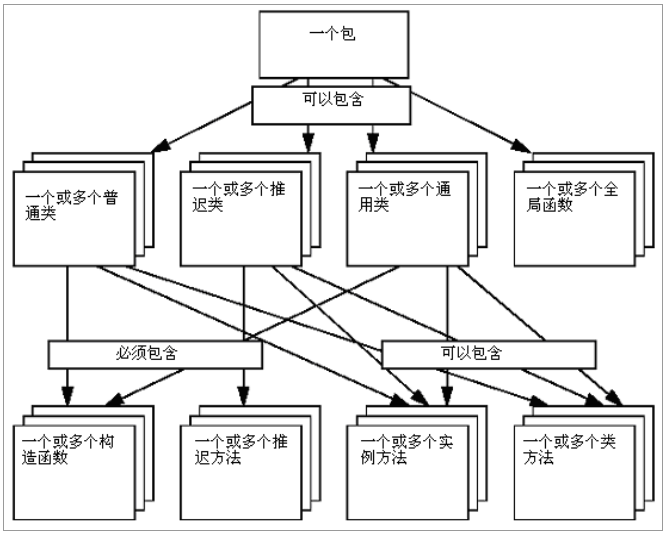

[TOC]

# 基本概念

整个 OCC 由五个模块组成，分别是基础类模块、建模数据模块、建模算法模块、可视化模块、数据交换模块和应用程序模块。其中，建模数据模块主要提供二维和三维几何模型的数据结构，也称数据结构模块。

一个模块主要由一个或几个工具箱构成。当然它也可以包含一些执行体和资源体等。就结构上看，一个工具箱就是一个共享库（如.so 或.dll 类型的文件）。每个工具箱由一个或几个包组成。而每个包则由许多类组成。

一个几何包包含点类、线类和圆类等。在同一个包中，不能含有相同名字的两个类。使用类的时候，类名要以包名作前缀，如 Geom_Circle。 



**OCC 中所有数据类型可分为两大类：**
通过句柄（或引用）处理的数据类型和通过值处理的数据类型。一个通过值处理的类型变量包含自己的实例；而一个通过句柄处理的类型变量包含一个实例的引
用。


通过值处理的类型首先有基本类型，如布尔类型、字符型、整型、实型等。通过句柄处理的类型变量，如果它不指向任何对象，那我们就说它是空的。要引用一个对象，我们就得用它的一个构造函数实例化该对象。

在 OCC 中，句柄是一些特殊类，它们以引用的方式对动态存储对象进行安全处理。句柄提供了一种引用计算机制，通过这种机制，当对象不被引用时，可以自动析构对象。

## 持久化和数据模式

数据模式是应用程序用来存储数据的一种结构，由一些持久类构成。一个对象若可以被永久存储，则是持久的。持久对象可以被它的创建程序或
其它程序在以后的时间里再次使用。
要 想 使 一 个 对 象 在 CDL 中 是 持 久 的 ， 必 须 声 明 它 的 类 型 继 承 自Standard_Persistent 类或其派生类。所有继承自 Standard_Persistent 类的类都是通
过引用处理的。
对于由 Standard_Storable 类派生出的所有类，它们的实例（对象）是不能被单独存储的，但是可以作为持久对象的区域被存储。所有继承自 Standard_Storable
类的类，其对象都是通过值处理的。

# 基础类分析

基础类是 OCC 的基石。它提供了大量的通用服务，如自动动态内存管理（通过句柄对对象进行处理）、集合容器、异常处理、通过向下抛掷和创建插件程序而获得的泛化等。

## 基础类概述

基础类包括根类组件、串类组件、集合容器组件、标准对象的集合容器组件、向量和矩阵类组件、基本几何类型组件、常用数学算法组件、异常类组件、数量类组件和应用程序服务组件。

**1.根类组件**

根类是基本的数据类型和类，其它所有类都是依此而建立的。它提供以下类型和类：

- （1）基本类型，如 Boolean（布尔类型）、Character（字符型）、Integer（整型）或者 Real（实型）等。
- （2）动态对象的安全处理，以确保那些不再被引用的对象能被及时删除（详见 Standard_Transient 类）。 
- （3）可设置的内存优化管理器。它能改善那些经常使用动态对象的程序性能。
- （4）run-time 类型信息扩展机制。它使得复杂程序的创建变得更为简易。
- （5）异常管理。
- （6）C++各种流的封装。

根类主要在 Standard 和 MMgt 两个包中实现。

**2.串类组件**

串类用来处理动态大小的 ASCII 和 Unicode 字符序列，可以通过句柄处理，因此也可以被共享。串类在 TCollection 包中实现。

**3.集合容器组件**

集合容器是处理动态大小的数据集合的类。集合容器是通用的，即每一种集合容器定义了一种结构和一些算法，可持有许多对象——通常这些对象不必从根类继承。这与 C++模板相似。如果需要使用一个给定对象类型的集合容器，则必须对这个元素的指定类型进行实例化。一旦这个实例声明被编译，所有基于这个通用集合容器的函数都可以在集合容器对象中实现。

集合容器包含许多通用类，如 run-time 大小的数组、列表、栈、队列、集（Set）和散列图（hash map）。

集合容器在 TCollection 和 NCollection 包中实现。

**4.标准对象的集合容器组件**

TColStd 包为 TCollection 包中通用类的一些经常使用的实例化提供对象（来 自 Standard 包）或者串（来自 TCollection 包）。

**5.向量和矩阵类组件**

向量和矩阵类提供了有关向量和矩阵的常用数学算法和基本运算（加、乘、转置、求逆等）。

**6.基本几何类型组件**

基本几何类型提供了基本几何实体和代数实体的实现。这些实现符合 STEP （Standard Exchange of Product data model,即产品数据模型的交换标准）。它们提供基本几何 Shape 的描述（点、向量、直线、圆与圆锥、平面与基本曲面、通过坐标轴或坐标系使 Shape 在平面上或空间中定位）和 Shape 几何变换的定义与应用（平移、旋转、对称、缩放、复合变换、代数计算工具）。

**7.常用数学算法组件**

常用数学算法为那些经常使用的数学算法提供 C++实现。这些算法有：
- （1）求解线性代数方程组的算法 ； 
- （2）求一元或多元函数最小值的算法；
- （3）求解非线性方程或非线性方程组的算法；
- （4）求矩阵特征值和特征向量的算法。

**8.异常类组件**

OCC 提供了一套异常类。所有异常类都是基于它们的根类—— Failure 类 的。异常类描述了函数运行期间可能发生的异常情况。发生异常时，程序将不能正常运行。对这种情况的响应称为异常处理。

**9.数量类组件**

数量类为日期和时间信息提供支持，同时也为表示常用物理量的基本类型（如长度、面积、体积、质量、密度、重量、温度和压力等）提供支持。

**10.应用服务组件**

应用服务组件包括几种低级服务的实现。借助 OCC 平台，这些服务可以使那些允许用户自定义和用户友好的应用程序的创建变得更容易。以下是该组件提供的四种服务：

- （1）单位转换工具。它们为各种量和相应物理单位的处理提供统一机制。这种机制能够检查单位的兼容性，以及在两种不同的单位间进行数值转换等（详 见 UnitsAPI 包）。 
- （2）有关表达的基本解释器。它使得用户脚本工具的建立和表达的通用定义等变得更容易（详见 ExprIntrp 包）。 
- （3）用于处理配置资源文件（见 Resource 包）和用户定制信息文件（见Message 包）的工具。有了这些工具，为应用程序提供多语言支持就很容易了。 
- （4）进程提示和用户中断接口。它们甚至可能为低级算法提供一种综合便利的用户交流方式。

## 数据类型、句柄、内存管理器和异常类

一个软件首先要规定能处理的数据类型，其次要实现三项最基本的功能——引用管理、内存管理和异常管理。在 OCC 中，这三项功能分别对应基础类中的句柄、内存管理器和异常类。

### 数据类型

原始类型是在语言中预定义的，它们通过值进行操作。

- Boolean 用于表示逻辑数据。 它可能只有两个值：Standard_True 和 Standard_False。字符指定任何 ASCII 字符。
- ExtCharacter 是一个扩展字符。
- Integer 是一个整数。
- Real 表示实数（即具有整数部分和小数部分的数字，其中任何一个都可以为空）。
- ShortReal 是一个具有较小值和内存大小选择的实数。
- CString 用于文字常量。
- ExtString 是一个扩展字符串。
- 地址表示大小未定的字节地址。

标准包中描述了每种类型提供的服务。 下表显示了 C++ 基本类型和 OCCT 基本类型之间存在的等效性。

**1、基本类型**
所有基本类型都是用 CDL 预定义的，并且只能通过值处理。依据不同的出自，或者依据各自的存储性能，它们可分为耐存的和非耐存的。耐存的基本类型由 Standard_Storable 类派生，能应用于持久对象的实现（要么包含于持久对象方法声明的实体中，要么作为持久对象内部结构的一部分）。

| C++ Types | OCCT Types            |
| --------- | --------------------- |
| int       | Standard_Integer      |
| double    | Standard_Real         |
| float     | Standard_ShortReal    |
| bool      | Standard_Boolean      |
| char      | Standard_Character    |
| char16_t  | Standard_ExtCharacter |
| char*     | Standard_CString      |
| void*     | Standard_Address      |
| char16_t* | Standard_ExtString    |

 （1）Standard_Integer（整型）。它是由 32 位二进制数表示的基本类型，包括正数、负数和零。Integer 类型与 C++ int 类型一样。因此，可以对 Integer 类型进行+、 -、 \*、/四种代数运算，也可以对其进行<、<=、 ==、 !=、 >=、>六种关系运算。
（2）Standard_Real（实型）。它表示具有确定精度和确定范围的实数的基本类型。Real 类型与 C++ 中 double（双精度）类型一样。因此，+、 -、 \*、/四种代数运算、-取反运算和<、<=、 ==、 !=、 >=、>六种关系运算同样适用于Real 类型。
（3） Standard_ShortReal （短实型）。它表示具有确定精度和确定范围的实数。ShortReal 类型与 C++中 float 类型一样。因此，+、 -、 \*、/四种代数运算、-取反运算和<、<=、 ==、 !=、 >=、>六种关系运算同样适用于 ShortReal 类型。
（4）Standard_Boolean（布尔类型）。 它是描述逻辑值的基本类型。它有两种值：false 和 true。Boolean 类型与 C++中 unsigned int 类型一样。因此，与、或、异或、非四种代数运算和==、!=两种关系运算同样适用于 Boolean 类型。
（5）Standard_Character（字符类型）。它是用来表示 ASCII 字符集的一种基本类型。它能被赋予的值有 128 个，对应 128 个 ASCII 字符。Character 类型与C++ 中 char 类型一样。因此，<、<=、 ==、 !=、 >=、>六种关系运算同样适用于 Character 类型（如：A<B）。
（6）Standard_ExtCharacter（扩展字符类型）。它是用来表示 Unicode 字符集的一种基本类型。由它表示的字符得用 16 位二进制数进行编码。ExtCharacter类型与 C++ 中 short 类型一样。因此，<、<=、 ==、 !=、 >=、>六种关系运算同样适用于 ExtCharacter 类型（如：A<B）。
（7）Standard_CString（C 串类型）。它用来表示文字串。一个文字串就是由双引号括起来的一个 ASCII 字符序列。 CString 类型与 C++中 char\*类型是一样的。
（8）Standard_Address（地址类型）。它用来表示一个通用指针。Address 类型与 C++中 void\*类型一样。
（9）Standard_ExtString（扩展串类型）。 它用来表示由 Unicode 字符序列构成的文字串。ExtString 类型与 C++中 short\*类型一样。

**2、值处理类型**
值处理类型可分三大类：
（1）基本类型；
（2）枚举类型；
（3）由 这 样 一 些 类 （ 既 不 是 由 Standard_Persistent 类 派 生 ， 也 不 是 由Standard_Transient 类派生，无论是直接派生还是间接派生）定义的类型。

值处理类型的表现形式比句柄处理类型的表现形式更直接。因此，对值处理类型的操作也会更快。但是值处理类型对象不能单独存于文件中。下图表示了
对一个值处理类型对象的处理过程。


需要注意的是：那些能被数据模式识别（包括基本类型和从 Storable 类继承过来的类型）的值处理类型可以作为持久对象的部分结构而存储在持久对象内部。这是值处理类型对象能够存进文件的唯一方式。

**3、句柄处理类型**
句柄处理类型可以分为两大类：
（1）由 Persistent 类的派生类定义的类型。这些类型可以被长久地存在文件中。
（2）由 Transient 类的派生类定义的类型。
下图表示了对一个句柄处理类型对象的处理过程。


**4、特征总结**
什么时候需要使用手柄？

- 如果对象在应用程序中可能有很长的生命周期，并且想对其进行多次引用，则最好使用句柄操作此对象。对象的内存将在堆上分配。指向该内存的句柄是一个轻量级的对象，可以在参数中快速传递。这避免了复制大对象的开销。
- 如果对象的生命周期有限，例如，在单个算法中使用，则最好按值操作此对象，而不考虑其大小，因为此对象是在堆栈上分配的，并且分配和取消分配内存的分配非常快，避免了在堆上分配引起的对new和delete的隐式调用。
- 最后，如果一个对象在应用程序的整个生命周期中只创建一次，但在应用程序的整个生命周期中都存在，那么最好的选择可能是由句柄操作的类或声明为全局变量的值。


### 句柄

**1、句柄的定义**

OCC 的引用管理采用的是一种句柄机制。这种机制的基本元素是句柄。在 OCC 中，句柄是通过类实现的。句柄含有多个接口成员，其中一个包含一个引用。一般情况下，仅需要使用它的引用。正因为这样，习惯将句柄比作C++指针。与 C++指针一样，几个句柄可以引用同一个对象；一个句柄也可以引用多个对象，但是每次只能引用一个；在句柄访问对象前，句柄必须被声明。

**2、句柄处理类的组织**

一般情况下，真正需要的是句柄引用的对象而非引用本身。在此，有必要介绍一下句柄处理类的组织。句柄处理类要么是持久的，要么是短暂的。如果由Standard_Transient 类派生，则是短暂的；如果由 Standard _Persistent 类派生，则是持久的。不论短暂还是持久，它们的组织情况是一样的。故，下面一段文字将仅介绍短暂句柄处理类及其相关句柄的组织情况。

Standard_Transient 类是 OCC 中所有句柄处理类的一个根类（另一个根类是Standard_Persistent 类）。它提供了一个引用计数器（被其所有后裔类继承）。该计数器被 Handle()类（也就是所谓的句柄）使用，用于计算指向对象实例的句柄数。对于每一个继承（直接或间接）自 Transient 类的类，CDL 提取器都创建了相应的 Handle()类（句柄）。该 Handle()类（句柄）的参数名字和由“Handle_”作前缀修饰的名字一样。 OCC 专门提供了一个宏预处理函数 Handle()。它能够将一个 Handle()类（句柄）的参数名字提取出来作为指定短暂类的名字。

这里提三个注意事项：
（1）Transient 类和 Persistent 类不完全是通过句柄处理的，它们也可以通过值处理；
（2）持久对象不能含有非耐存句柄（那些引用非持久对象的句柄）；
（3）使用句柄的目的是共享对象（对于所有局部操作，建议使用值处理类）。

**3、句柄的使用**
句柄通过它引用的对象被特征化。在对一个短暂对象进行任何操作之前，必须对句柄进行声明。比如， Point 和 Line 是来自 Geom 包的两个短暂类，声明得像下例这样写。

```
Handle(Geom_Point) p1, p2;
Handle(Geom_Line) aLine;
```

对一个句柄进行声明，只是创建了一个空句柄，该句柄不指向任何对象。要初始化句柄，要么得创建一个新的对象，要么得将其它句柄值赋予该句柄（假定两种句柄类型是兼容的）。

类 Standard_Transient 是一个大层次的 OCCT 类的根，据说可以通过句柄操作。它提供了一个由其所有后代类继承的引用计数器字段，关联的 Handle() 类使用该字段来跟踪指向该对象实例的多个句柄。

从 Transient 派生（直接或间接）的类的对象通常使用运算符 new 在动态内存中分配，并通过句柄进行操作。句柄定义为模板类 opencascade::handle<>。 Open CASCADE Technology 提供了预处理器宏 Handle()，历史上在整个 OCCT 代码中使用它来命名句柄：

```
Handle(Geom_Line) aLine; // "Handle(Geom_Line)" is expanded to "opencascade::handle<Geom_Line>"
```

此外，对于标准 OCCT 类，为句柄定义了额外的 typedef，作为以 Handle_ 为前缀的类的名称。例如，上面的例子也可以编码为：

```
Handle_Geom_Line aLine; // "Handle_Geom_Line" 是 "opencascade::handle<Geom_Line>" 的 typedef
```

句柄的特征在于它引用的对象。

在对瞬态对象执行任何操作之前，您必须声明句柄。 例如，如果 Point 和 Line 是 Geom 包中的两个瞬态类，您将编写：

```
Handle(Geom_Point)  p1, p2; 
```

声明句柄会创建一个不引用任何对象的空句柄。 可以通过其方法 IsNull() 检查句柄是否为空。 要使句柄无效，请使用方法 Nullify()。

要初始化一个句柄，要么应该创建一个新对象，要么可以将另一个句柄的值分配给它，条件是它们的类型是兼容的。

请注意，句柄只能用于对象共享。 对于所有本地操作，建议使用由值操作的类。

**4、句柄的类型管理**
首先介绍句柄的通用管理。

OCC 能以通用方式对数据类型进行描述。这样，可以在程序运行时才去严格核对给定对象的类型。这与 C++ RTTI（运行时类型信息机制）类似。对于每一种由 Standard_Transient 类派生的类类型， CDL 提取器都创建了相应的代码段，用于对 Standard_Type 类进行实例化。通常 Standard _Type 类（也称类型描述器）持有类型信息：类型名和其祖先类型列表。

类型的实例（实际上是指向该类型的句柄）由虚函数 DynamicType()（该虚函数在 Standard_Transient 类的派生类中）返回。检查给定对象是否具有给定类型或给定类型的后裔类型，需调用另一个虚函数 IsKind()。

为给定类类型寻找相关的类型描述器，得用相关的宏 STANDARD_TYPE()。其中的宏参数就是给定类的名字。

Open CASCADE 技术提供了一种以通用方式描述数据类型层次结构的方法，可以在运行时检查给定对象的确切类型（类似于 C++ RTTI）。

要启用此功能，类声明应包括 OCCT RTTI 的声明。 标头 Standard_Type.hxx 提供了两种预处理宏的变体，以促进这一点：

- 内联变体，它通过一行代码声明和定义 RTTI 方法：

```C++
#include <Geom_Surface.hxx>
class Appli_ExtSurface : public Geom_Surface
{
. . .
public:
  DEFINE_STANDARD_RTTIEXT(Appli_ExtSurface,Geom_Surface)
};
```

- 行外变体，在声明中使用一个宏（通常在头文件中），在实现中使用另一个宏（在 C++ 源中）：

  - 在 Appli_ExtSurface.hxx 文件中：

```C++
#include <Geom_Surface.hxx>
class Appli_ExtSurface : public Geom_Surface
{
. . .
public:
  DEFINE_STANDARD_RTTIEXT(Appli_ExtSurface,Geom_Surface)
};
```
-  - 在 Appli_ExtSurface.cxx 文件中：
```C++
#include <Appli_ExtSurface.hxx>
IMPLEMENT_STANDARD_RTTIEXT(Appli_ExtSurface,Geom_Surface)
```

这些宏定义了返回类型描述符的方法 DynamicType() - 处理描述类的类 Standard_Type 的单例实例。 类型描述符存储类的名称及其父类的描述符。

请注意，虽然内联版本更易于使用，但对于广泛使用的类，由于内联方法的多次实例化，此方法可能会导致依赖库的二进制代码膨胀。

要获取给定类类型的类型描述符，请使用宏 STANDARD_TYPE() 并将类的名称作为参数。

用法示例：

```C++
if (aCurve->IsKind(STANDARD_TYPE(Geom_Line))) // equivalent to "if (dynamic_cast<Geom_Line>(aCurve.get()) != 0)"
{
...
}
```

接着介绍句柄的类型一致原则。

句柄声明中的对象类型是对象的静态类型，它能被编译器识别。句柄能够引用静态类型的子类对象。因此，对象的动态类型（也称对象的实际类型）可以是
静态类型的后裔类型。这就是句柄的类型一致原则。考虑到持久类 CartesianPoint 是 Point 类的一个子类，所以，类型一致原则可以用下例表示

```C++
Handle (Geom_Point) p1;
Handle (Geom_CartesianPoint) p2;
p2 = new Geom_CartesianPoint;
p1 = p2; //可以，类型是兼容的。
```

例中 ， 编译器将p1看做是指向 Point 类的句柄 ， 尽管 p1实际指向CartesianPoint 类型对象。

最后介绍句柄的直接类型转换。显式类型转换

依据类型一致原则，我们总可以将低层句柄向上赋值给高层句柄。但是，反过来则不行。因此，我们需要一种直接类型转换机制。
如果一个句柄所指对象的实际类型是抛掷者（抛掷句柄的对象）的后裔类型，那么，该句柄可以直接向其子类型转换。这就是句柄的直接类型转换（见下例）。

```C++
Handle (Geom_Point) p1;
Handle (Geom_CartesianPoint) p2, p3;
p2 = new Geom_CartesianPoint;
p1 = p2; //可以，标准的赋值。
p3 = Handle (Geom_CartesianPoint) : : DownCast (p1);
// 可以，p1 的实际类型是 CartesianPoint 句柄，尽管它的静态类型是 Point 句柄。
```

如果直接转换与句柄所指对象的实际类型不兼容，那么被抛掷的句柄会被清空，并且不会产生任何异常。因此，如果需要一些能在静态类型的子类型中实现的可靠服务，如下例编写程序：

```C++
void MyFunction (const Handle(A) & a)
{
	Handle (B) b = Handle (B):: Downcast(a);
	if (! b.IsNull())
	{
		//如果 B 类由 A 类派生，我们就可以使用“b”。
	}
	else
	{
		// 类型不兼容。
	}
}
```

向下抛掷尤其被用于处理由不同类型对象组成的集合容器，但是有一个限制条件——这些对象必须继承自同一个根类。例如，有一个由多个短暂对象构成的SequenceOfTransient 序列，同时还有两个继承自 Standard_T- ransient 类的类，那么下例的构造语句是有效的。

```
Handle (A) a;
Handle (B) b;
Handle (Standard_Transient) t;
SequenceOfTransient s;
a = new A;
s.Append (a);
b = new B;
s.Append (b);
t = s.Value (1);
//这里我们不能这样写：
a = t;
//这是错误的。
// 因此我们向下抛掷：
a = Handle (A) :: Downcast (t)
if (! a.IsNull())
{
	//类型兼容的话，我们就可以使用 “a”。
}
else
{
	// 类型不兼容。
}
```

**5、用句柄创建对象**
要创建由句柄操作的对象，请声明句柄并使用标准 C++ new 运算符对其进行初始化，然后立即调用构造函数。 构造函数可以是在实例化对象的类的源中指定的任何构造函数。如下例：

```
Handle (Geom_CartesianPoint) p;
p = new Geom_CartesianPoint (0, 0, 0);
```

与 C++指针不同，句柄并不支持 delete 函数。当句柄所指对象不再被使用时，该对象会被自动析构。

**6、通过句柄调用对象方法**
对于指向持久对象或短暂对象的句柄，可以像使用 C++指针那样使用它。通过句柄，可以调用对象方法。
调用对象方法有两种方式：一是使用操作符“->”；二是使用函数调用语句。但是当需要调用方法来测试或者修改句柄状态时，则必须用操作符“.”。

下例说明了怎样获取点的坐标。

```c++
Handle (Geom_CartesianPoint) centre;
Standard_Real x, y, z;
if (centre.IsNull())
{
	centre = new PGeom_CartesianPoint (0, 0, 0);
}
centre->Coord(x, y, z);
```

下例说明了怎样获取一个笛卡尔点的类型。

```C++
Handle(Standard_Transient) p = new Geom_CartesianPoint(0.,0.,0.);
if ( p->DynamicType() == STANDARD_TYPE(Geom_CartesianPoint) )
	cout << "Type check OK" << endl;
else
	cout << "Type check FAILED" << endl;
```

需要注意的是：如果指向对象方法或对象定义域的句柄是空的，那么将产生NullObject 异常。

**调用类方法**
类方法的调用类似于静态 C++ 函数，即通过其所属类的名称，后跟“::”运算符和方法名称来调用它。

例如，我们可以找到贝塞尔曲线的最大次数：

```C++
Standard_Integer  n; 
n = Geom_BezierCurve::MaxDegree();
```

**7、句柄的存储分配**
在删除对象前，必须确保对象没有被引用。

为了减少与对象生存管理有关的编程，在每个句柄处理类里都含有一个删除函数。句柄能使引用计数管理自动进行，并且当对象不再被引用时，自动析构对象。通常，不能对 Standard_Transient 类的子类实例直接调用 delete 函数。

当对象有一个新句柄时，引用计数器的值加 1。当一个句柄被删除，或被清空，或被重新赋值而指向另一对象时，计数器的值减 1。一旦引用计数器的值为0 时，对象将被自动析构。

句柄的分配规则可以通过下例体现出来。

```
{
	Handle (TColStd_HSequenceOfInteger) H1 = new TColStd_HSequenceOfInteger;
	// H1 有一个引用，对应的内存空间是 48 字节。
	{
		Handle (TColStd_HSequenceOfInteger) H2;
		H2 = H1;
		// H1 有两个引用。
		if (argc == 3)
		{
			Handle (TColStd_HSequenceOfInteger) H3;
			H3 = H1;
			// H1 有三个引用。
			...
		}
		// H1 有两个引用。
	}
	// H1 有一个引用。
}
// H1 没有引用。
// TColStd_HSequenceOfInteger 对象被析构。
```

通过定义以下内容，您可以轻松地将句柄对象的引用转换为 void*：

```C++
void *pointer;
Handle(Some_class) aHandle;
// Here only a pointer will be copied
Pointer = &aHandle;
// Here the Handle object will be copied
aHandle = * (Handle(Some_Class) *)pointer;
```

**循环**

如果两个或多个对象通过句柄（作为定义域）互相引用，就会出现循环。在这种情况下，对象不会被自动析构。

以图表（graph）为例，它的元素对象得知道它们所属的图表对象，也就是说，元素得有一个对图表对象的引用。如果元素和图表都是通过句柄处理的，并且都以句柄作为自己的定义域，则将出现循环。当最后一个句柄被删除时，图标对象不会被删除。这是因为图表里面还有许多指向该图表的句柄——这些句柄作为图表的数据结构（元素）被存储。

有两种方式可以避免循环的出现：
（1）用 C++指针代替每一个引用（比如由元素对图表的引用）。
（2）当图表对象需要被删除时，将整套句柄（如元素中指向图表的句柄）清空。

### 内存管理器

1、使用内存管理器的原因

标准的内存分配有三种方式：静态分配、栈分配和堆分配。静态分配是最简单的内存分配策略。程序中的所有名字在编译时绑定在某个存储位置上；这些绑定不会在运行时改变。块结构语言通过在栈上分配内存,克服了静态分配的一些限制。每次过程调用时,一个活动记录或是帧被压入系统栈,并在返回时弹出。堆分配与栈所遵循的后进先出的规律不同,堆中的数据结构能够以任意次序分配与释放 。

建模程序在运行期间，需要构造和析构大量的动态对象。在这种情况下，标准的内存分配函数可能无法胜任工作。因此， OCC 采用了特殊的内存管理器（在Standard 包中实现）。

要使用 Open CASCADE Technology 内存管理器在 C 代码中分配内存，只需使用方法 Standard::Allocate() 代替 malloc() 和方法 Standard::Free() 代替 free()。此外，提供了方法 Standard::Reallocate() 来替代 C 函数 realloc()。

在 C++ 中，可以定义类的运算符 new() 和 delete() 以便使用 Standard::Allocate() 分配内存并使用 Standard::Free() 释放它。在这种情况下，该类的所有对象和所有继承的类都将使用 OCCT 内存管理器进行分配。

因为 new()函数和 delete()函数是被继承的，所以对于所有 OCC 类的派生类（比如，Standard_Transient 类的派生类），new()函数和 delete()函数同样适用。

3、内存管理器的配置

OCC 内存管理器可以适用于不同的内存优化技术（不同的内存块采用不同的优化技术，这主要依据内存块的大小而定）。或者，用 OCC 内存管理器，甚至可以不采用任何优化技术而直接使用 C 函数 malloc() 和 free()。内存管理器的配置由下面几个环境变量值定义：

（1）MMGT_OPT。如果值设为 1（默认值），则内存管理器将如下面的描述那样对内存进行优化。如果值设为 0，则每个内存块将直接分配（通过 malloc()和 free()函数）在 C 内存堆里。在第二种情况下，所有异常（不包括 MMGT_CLEAR异常）都将被忽略。

（2）MMGT_CLEAR。如果值设为 1（默认值），则每一个已分配的内存块都将被清零。如果值设为 0，则内存块正常返回。

（3）MMGT_CELLSIZE。它定义了大内存池中内存块的最大空间。默认值是 200 字节。

（4）MMGT_NBPAGES。它定义了页面中由小内存块构成的内存组件（内存池的大小（由操作系统决定）。默认值是 1000 字节。

（5）MMGT_THRESHOLD。它定义了内存块（能直接在 OCC 内部被循环使用）的最大空间。默认值是 40000 字节。

（6）MMGT_MMAP。当值设为 1（默认值）时，使用操作系统的映射函数对大内存块进行分配。当值设为 0 时，大内存块将被 malloc()分配在 C 内存堆里。

（7）MMGT_REENTRANT。当值设为 1 时，所有对内存优化管理器的调用都将被响应，以保证不同的线程能同时访问内存管理器。在多线程程序中，这个变量值应该设置为 1。这里所说的多线程程序是指那些使用 OCC 内存管理器，并且可能有不止一个调用 OCC 函数的线程的程序。默认值是 0。在此提一个注意事项：当多线程程序使用 OCC 以达到最佳内存优化性能时，需要检查两组变量。其中一组是 MMGT_OPT=0；另一组则是 MMGT_OPT=1 和MMGT_REENTRANT=1。

4、内存管理器的实现。

当且仅当 MMGT_OPT=1 时，才用到 OCC 的特殊的内存优化技术。这些技术有：

（1）小内存块（空间比由 MMGT_CELLSIZE 设定的值小）不能单独分配，而是分配在大内存池（大小由变量 MMGT_NBPAGES 决定）中。每一个内存块分配在当前内存池的空闲部分。若内存池被完全占据，则使用下一个内存池。在当前版本中，在进程结束前，内存池不能返回操作系统。然而，那些由 Standard::Free()释放的内存块被记忆在释放列表中。当需要下一个内存块（与列表中某个块大小相同）时，相应的被释放的那个内存块所占空间可以被新的内存块占用，这也叫内存块的循环使用。

（2）对于中等大小的内存块（比 MMGT_CELLSIZE 大，但比 MMGT_THRESHOLD 小），它们是被直接分配（通过使用 malloc() 和 free()）在Ｃ内存堆里。这些块要是被 Standard::Free()方法释放的话，可以像小内存块那样被循环使用。然而，与小内存块不同，那些被记录在释放列表中的可循环使用的中内存块（由持有内存管理器的程序释放）可以被 Standard::Purge()方法返回到 C 内存堆中。

（3）大内存块（大小比 MMGT_THRESHOLD 大，包括用来分配小内存块的内存池）的分配取决于 MMGT_MMAP 的值。如果该值是 0，则这些大块被分配在 C 堆里。否则，它们被操作系统映射函数分配在内存映射文件中。 当Standard::Free()被调用时，大块立即被返回到操作系统中去。

5、内存管理器的优缺点。

OCC 内存管理器的优点主要体现在小块和中块的循环使用上。当程序需要连续分配和释放大小差不多的内存块时，这个优点能加速程序的执行。实际应用中，这种提升幅度可以高达 50%。

相应的，OCC 内存管理器的主要缺点是：程序运行时，被循环使用的内存块不能返回到操作系统中。这可能导致严重的内存消耗，甚至会被操作系统误认为内存泄露。为了减少这种影响，在频繁地对内存进行操作后，OCC 系统将调用 Standard::Purge()方法。

另外， OCC 内存管理器会带来额外的开销，它们有：
（1）舍入后，每个被分配的内存块的大小高达 8 字节。当 MMGT_OPT=0时，舍入值由 CRT 决定；对 32 位平台而言，典型值是 4 字节。

（2）在每个内存块的开端需要额外的 4 字节以记录该内存块的大小（或者，当内存块被记录在释放列表时，这 4 字节用来记录下一个内存块的地址）。注意：只有在 MMGT_OPT=1 时，才需要这 4字节。

需要注意的是：由 OCC 内存管理器带来的额外开销可能比由 C 内存堆管理器带来的额外开销大，或者小。因此，整体而言，很难说到底是优化模式的内存消耗大还是标准模式的内存消耗大——这得视情况而定。

通常，编程人员自己也会采用一种优化技术——在内存里面划出一些重要的块。这样就可以将一些连续的数据存于这些块中，使内存页面管理器对这些块的处理变得更容易。

在多线程模式（MMGT_REENTRANT=1）中，OCC 内存管理器使用互斥机制以锁定程序对释放列表的访问。因此，当不同的线程经常同时调用内存管理器时，优化模式的性能不如标准模式的性能好。原因是：malloc() 函数和 free()函数在实现的过程中开辟了几个分配空间——这样就避免了由互斥机制带来的延迟。

### 异常类

1、异常类的定义
异常处理机制实现了正常程序逻辑与错误处理的分离，提高了程序的可阅读性和执行效率。为了转移程序运行的控制流,异常处理的模式通常有无条件转移模式、重试模式、恢复模式和终止模式 。与 C++一样， OCC 采用的是终止模式。为了实现这种异常处理机制，OCC 提供了一套异常类。所有异常类都是基于它们的根类——Failure 类的。异常类描述了函数运行期间可能发生的异常情况。发生异常时，程序将不能正常运行。对这种情况的响应被称为异常处理。

2、异常类的使用
OCC 使用异常的语法与 C++使用异常的语法相似。要产生一个确定类型的异常，需用到相应异常类的 Raise()方法，如例 所示。

```
DomainError::Raise(“Cannot cope with this condition”);
```

这样就产生了一个 DomainError 类型的异常，同时伴有相应的提示信息“Cannot cope with this condition”。这信息可以是任意的。

该异常可以被某种 DomainError 类型（DomainError 类型派生了好些类型）的句柄器捕获，如下例所示。

```
try{
	OCC_CATCH_SIGNALS
	// try 块。
}
catch (DomainError)
{
	// 处理 DomainError 异常。
}
```

不能把异常类的使用当作一种编程技巧，例如用异常类代替“goto”。应该把异常类的使用作为方法的一种保护方式（防止被错误使用），即保证方法调用者遇到的问题是方法能处理的。故，在程序正常运行期间，不该产生任何异常。

在使用异常类的时候，需要用一个方法来保护另外一个可能出现异常的方法。这样能通过外层方法来检查内层方法的调用是否有效。例如需要用三个方法（用于检查元素的 Value 函数、用于检查数组下边界的 Lower 函数和用于检查数组上边界的 Upper 函数）使用 TCollection_ Array1 类，那么，Value 函数可以如下例那样被实现：

```
Item TCollection_Array1::Value (const Standard_Integer&index) const
{
	// 下面的 r1 和 r2 是数组的上下边界。
	if(index < r1 || index > r2)
	{
		OutOfRange::Raise(“Index out of range in Array1::Value”);
	}
	return contents[index];
}
```

在此，OutOfRange::Raise(“Index out of range in Array1::Value”)异常用 Lower函数和 Upper 函数检查索引是否有效，以保护 Value 函数的调用。一般地，在 Value()函数调用前，程序员已确定索引在有效区间内了。这样，上面 Value()函数的实现就不是最优的了，因为检查既费时又冗余。在软件开发中有这样一种广泛的应用方式，即将一些保护措施置于反汇编构件而非优化构件中。为了支持这种应用，OCC 为每一个异常类提供了相应的宏Raise_if()：
`<ErrorTypeName>_Raise_if(condition, “Error message”)`
这里 ErrorTypeName 是异常类型，condition 是产生异常的逻辑表达式，而 Error message 则是相关的错误信息。

可以在编译的时候，通过 No_Exception 或者 No_<ErrorTypeName>两种预处理声明之一解除异常的调用，如下例 所示：

```
#define No_Exception /*解除所有的异常调用*/
```

使用这构造语句，Value 函数变为：

```
Item TCollection_Array1::Value (const Standard_Integer&index) const
{
	OutOfRange_Raise_if(index < r1 || index > r2,
					“index out of range in Array1::Value”);
	return contents[index];
}
```

3、异常处理
异常发生时，控制点将转移到调用堆栈中离当前执行点最近的指定类型的句柄器上。该句柄器具有如下特征：
（1）它的 try 块刚刚被进入还没有被退出；
（2）它的类型与异常类型匹配。
（3）T 类型异常句柄器与 E 类型异常匹配，即 T 类型和 E 类型相同，或者 T 类型是 E 类型的超类型。

OCC 的异常处理机制还可以将系统信号当作异常处理。为此，需要在相关代码的开端嵌入宏 OCC_CATCH_SIGNALS。建议将这个宏放在 try {}块中的第一位置。例如，有这样四个异常： NumericError 类型异常、Overflow 类型异常、Underflow 类型异常和 ZeroDivide 类型异常，其中 NumericError 类型是其它三种类型的超类型，那么，异常处理过程如下例 所示。

```
void f(1)
{
	try
	{
		OCC_CATCH_SIGNALS
		// try 块
	}
	catch(Standard_Overflow)
	{ 	// 第一个句柄器
		// ...
	}
	catch(Standard_NumericError){
		//第二个句柄器
		// ...
	}
}
```

在这个例子中，第一个句柄器将捕获 Overflow 类型异常；第二个句柄器将捕 获 NumericError 类 型 异 常 及 其 派 生 异 常 ， 包 括 Underflow 类 型 异 常 和Zerodivide 类型异常。异常发生时，系统将从最近的 try 块到最远的 try 块逐一检查句柄器，直到找到一个在形式上与产生的异常相匹配的为止。

在 try 块中，如果将基类异常的句柄器置于派生类异常的句柄器之前，则将发生错误。因为那样会导致后者永远不会被调用，如下例所示。

```
void f(1)
{
	int i = 0;
	try
	{
		OCC_CATCH_SIGNALS
		g(i);
		// i 是可接受的。
	}
	// 在这放执行语句会导致编译错误！
	catch(Standard_NumericError)
	{
		// 依据 i 值处理异常。
	}
	// 在这放执行语句可能导致不可预料的影响。
}
```

由异常类形成的树状体系与用户定义的类完全无关。该体系的根类是 Failure异常。因此，Failure 异常句柄器可以捕获任何 OCC 异常。建议将 Failure 异常句柄器设置在主路径中，如下例所示。

```
#include <Standard_ErrorHandler.hxx>
#include <Standard_Failure.hxx>
#include <iostream.h>
int main (int argc, char* argv[ ])
{
	try
	{
		OCC_CATCH_SIGNALS//主块
		return 0;
	}
	catch(Standard_Failure)
	{
		Handle(Standard_Failure) error = Failure::Caught ();
		cout << error << end1;
		return 1;
	}
}
```

这里的 Caught 函数是 Failure 类的一个静态成员，能返回一个含有异常错误信息的异常对象。这种接收对象的方法(通过 catch 的参数接收异常)代替了通常的 C++语句。尽管标准的 C++处理法则和语法在 try 块和句柄器中同样适用，但在一些平台上，OCC 能以一种兼容模式被编译（此时异常支持长转移）。在这种模式中，要求句柄器前后没有执行语句。因此，强烈建议将 try 块置于{}中。此外，这种模式也要求 Standard_ErrorHandler.hxx 头文件包含在程序中（置于 try 块前），否则将不能处理 OCC 异常。再有，catch()语句不允许将一个异常对象作为参数来传递。

为了使程序能够像捕获其它异常那样捕获系统信号（如除零），在程序运行时要使用 OSD::SetSignal()方法安装相应的信号句柄器。通常，该方法在主函数开端处被调用。为了能真正的将系统信号转换成 OCC 异常，OCC_CATCH_ SIGNALS 宏应该被嵌入到源代码中。典型的，将该宏置于捕获异常的 try{}块的开端处。OCC 的异常处理机制依据不同的宏预处理 NO_CXX_EXCE- PTIONS 和OCC_CONVERT_SIGNALS 有不同的实现。这些预处理将被 OCC 或者用户程序的编译程序连贯定义。在 Windows 和 DEC 平台上，这些宏不是以默认值被定义的，并且所有类都支持 C++异常，包括从句柄器中抛掷异常。因此，异常的处理与 C++异常处理一样。

### 插件管理

按插件分发
插件是可以动态加载到客户端应用程序中的组件，不需要直接链接到它。插件不绑定到它的客户端，即插件只知道它的连接机制是如何定义的，以及如何调用相应的服务。

插件可用于：

实现驱动程序的机制，即根据当前事务动态更改驱动程序实现（例如，检索存储在另一个版本的应用程序中的文档），
将处理资源限制在所需的最低限度（例如，只要用户不需要，它就不会在运行时加载任何应用程序服务），
促进模块化开发（应用程序可以提供基本功能，而一些高级功能将在可用时作为插件添加）。
插件在全局通用标识符 (GUID) 的帮助下进行标识。 GUID 包含小写字符且不能以空格结尾。

加载后，对插件提供的服务的调用是直接的（客户端以与插件相同的语言实现）。

#### C++ 插件实现

C++ 插件使用抽象类中定义的函数将服务实现为对象（此抽象类及其带有 GUID 的父类是有关在客户端应用程序中实现的插件的唯一信息）。该插件由一个可共享的库组成，该库包括一个名为 Factory 的方法，该方法创建 C++ 对象（客户端无法实例化该对象，因为插件实现不可见）。基础类在包 Plugin 中提供了一个名为 Load() 的方法，该方法使客户端能够通过库访问所需的服务。

该方法从环境变量 CSF_PluginDefaults 找到的资源文件 Plugin 中读取有关可用插件及其位置的信息：

```
$CSF_PluginDefaults/Plugin 
```

Load 方法通过其 GUID 在资源文件或注册表中查找库名称，例如，在 UNIX 上：

```
! METADATADRIVER whose value must be OS or DM.
! FW
a148e300-5740-11d1-a904-080036aaa103.Location: libFWOSPlugin.so
```

然后Load方法根据宿主机操作系统的规则加载库（例如，使用环境变量，如Unix下的LD_LIBRARY_PATH和Windows下的PATH）。 之后，它调用 PLUGINFACTORY 方法返回支持所需服务的对象。 然后客户端可以调用该对象支持的函数。	

**C++ 客户端插件实现**
要调用插件提供的服务之一，您可以使用所请求服务的 Standard_GUID 调用 Plugin::Load() 全局函数，如下所示：

```
Handle(FADriver_PartStorer)::DownCast(PlugIn::Load (yourStandardGUID));
```

以 FAFactory.hxx 和 FAFactory.cxx 为例：

```
#include <Standard_Macro.hxx>
#include <Standard_GUID.hxx>
#include <Standard_Transient.hxx>
class FAFactory
{
public:
  Standard_EXPORT static Handle(Standard_Transient) Factory (const Standard_GUID& theGUID);
};
```

```
#include <FAFactory.hxx>
#include <FADriver_PartRetriever.hxx>
#include <FADriver_PartStorer.hxx>
#include <FirstAppSchema.hxx>
#include <Standard_Failure.hxx>
#include <FACDM_Application.hxx>
#include <Plugin_Macro.hxx>
static Standard_GUID StorageDriver  ("45b3c690-22f3-11d2-b09e-0000f8791463");
static Standard_GUID RetrievalDriver("45b3c69c-22f3-11d2-b09e-0000f8791463");
static Standard_GUID Schema         ("45b3c6a2-22f3-11d2-b09e-0000f8791463");
//======================================================
// function : Factory
// purpose :
//======================================================
Handle(Standard_Transient) FAFactory::Factory (const Standard_GUID& theGUID)
{
  if (theGUID == StorageDriver)
  {
    std::cout << "FAFactory : Create store driver\n";
    static Handle(FADriver_PartStorer) sd = new FADriver_PartStorer();
    return sd;
  }
  if (theGUID == RetrievalDriver)
  {
    std::cout << "FAFactory : Create retrieve driver\n";
    static Handle(FADriver_PartRetriever) rd = new FADriver_PartRetriever();
    return rd;
  }
  if (theGUID == Schema)
  {
    std::cout << "FAFactory : Create schema\n";
    static Handle(FirstAppSchema) s = new FirstAppSchema();
    return s;
  }
  Standard_Failure::Raise ("FAFactory: unknown GUID");
  return Handle(Standard_Transient)();
}
// export plugin function "PLUGINFACTORY"
PLUGIN(FAFactory)
```

应用程序还可以通过链接到库并直接调用 FAFactory::Factory() 来实例化factory。

## 集合容器和标准对象的集合容器

**1、概述**
集合容器组件包含一些具有动态大小的数据集合类，如数组类、列表类和图（map）类等。集合容器类是通用的，即它们可以持有许多不必从根类继承的对象。当需要使用一个给定对象类型的集合容器时，必须指定集合容器的元素类型。一旦这个声明被编译，所有适用于这个通用集合容器的函数，同样适用于这个集合容器实例。

然而，需要注意两点：
（1）在 OCC public 构造语句中，被当作参数直接使用的集合容器是在一个OCC 组件中实例化的。
（2） TColStd 包为这些通用集合容器提供许多实例化；实例对象来 自Standard 包或者串类组件。

集合容器组件提供了一些通用集合容器：
（1）数组。通常用于快速访问项目。但是数组的大小是固定的（大小一旦被声明，将不能更改）。
（2）序列。其大小可变。使用序列可以避免使用大数组和类空数组。但是序列的项目通常比数组的项目长，故只能采用特殊的方法访问序列。另外，许多访问方法不适用于序列。数组和序列通常被用作复杂对象的一种结构。
（3）图（Map）。与序列不同，图的大小可变，而且对图的访问也快。图结构通常可以有多种访问方法。图通常作为复杂算法中的内部数据结构。集（Set）具有同样的用途，但是访问时间要长的多。
（4）列表、队列和栈。它们的结构与序列的结构相似。但是它们的算法却与序列的算法不同。

大部分集合容器遵循语意值，即一个集合容器实例就是实际的集合容器，而不是指向某个集合容器的句柄集合。只有数组和序列才可以通过句柄处理并被共享。OCC 的集合容器有通用集合、通用图和迭代器。它们都在 TCollection 包中。

**2、通用集合**
通用集合有 Array1 、 Array2 、 HArray1 、 HArray2 、 Sequence 、 HSequence 、List 、Queue 、Stack、Set 和 HSet。TCollection_Array1 数组与 C 数组相似，即大小可以由用户在构造时指定，构造后不能更改。与 C 数组一样，访问 Array1 成员的时间是一个常量，而与数组的大小无关。Array1 数组通常被用作复杂对象的基本结构。Array1 数组是一个通用类，它的实际类型取决于它的项目，即数组元素的类型。Array1 的下标区域由用户定义。因此，要访问 Array1 项目，必须保证下标在规定的区域内。

TCollection_Array2 是二维数组，它的情况与 TCollection_Array1 的类似。TCollection_HArray1 数 组 与 TCollection_Array1 数 组 相 似 ， 不 同 的 是HArray1 的对象是指向数组的句柄数组。HArray1 数组可以被几个对象共享；可以用 TCollection_Array1 数组结构作为 HArray1 的实际结构。HArray1 是一个通用类，它的实际类型取决于两个参数：项目（数组的元素类型）和数组（通过HArray1 处理的数组的实际类型，具有 TCollection_Array1 项目类型的一个实例）。

TCollection_HArray2 数组与 TCollection_HArray1 数组类似，只不过是二维的。TCollection_Sequence 是通过整数来索引的序列。序列的用途与一维数组(TCollection_Array1)的一样，都是作为复杂对象的基本结构。但是序列的大小是可变的。使用序列可以避免使用大数组和类空数组。访问序列项目需要专门的方法，否则会比访问数组项目慢。另外也要注意，当需要支持多种访问方法时（图会更适合），序列不是一种有效的结构。序列是一个通用类，它的实际类型取决于项目，即它的元素类型。

TCollection_HSequence 序 列 TCollection_Sequence 序 列 类 似 ， 不 同 的 是HSequence 对象是指向序列的句柄序列。HSequence 序列可以被几个对象共享；可以用 TCollection_Sequence 结构作为 HSequence 的实际结构。HSequence 是一个通用类，它的实际类型取决于两个参数：项目（序列元素的类型）和序列（通过 HSequence 处理的序列的实际类型，一个具有 TCollection_Sequence 项目类型的实例）。

TCollection_List 是 允 许 项 目 重 复 的 有 序 列 表 。 列 表 可 以 使 用 迭 代 器（ListIterator 迭代器）进行线性迭代。可以快速地将一个项目插入列表的任何位置。但是，如果列表很长，那么通过值查找项目将会很慢，因为那样需要逐一查找。故当项目需要通过值来查找时，用序列结构会更好些。列表是一个通用类，它的实际类型取决于它的项目，即列表元素的类型。在列表被实例化时，系统将自动产生一个 TCollection_ListIterator 类的实例（迭代器）。

队列和栈也是列表的一种，但两者的数据访问方式不同。对于队列（TCollection_Queue ），只能在其尾部插入元素，在其头部删除元素。这样，最先进入队列的元素将最先被清除。所以队列也叫先进先出列表。队列是一个通用类，它的实际类型取决于它的项目，即队列元素的类型。对于栈（TCollection_Stack ），只允许在其顶部插入或删除项目。最后进栈
的项目将最先出栈。所以栈也叫后进先出列表。栈是一个通用类，它的实际类型取决于它的项目，即它的元素类型。访问栈需要使用 StackIterator 迭代器。

TCollection_Set 集是一个项目无序且相异的集合容器。对集进行操作时，系统会检查其中是否含有相同的项目。集的效果和图的一样，但是图结构更有效。所以建议使用图来代替集。集是一个通用类，它的实际类型取决于它的项目，即它的元素类型。访问集，需要 SetIterator 迭代器。

TCollection_HSet 与 TCollection_Set 类似，不过 HSet 对象是指向集的句柄集合。HSet 是一个通用类，它的实际类型取决于两个参数：项目（Set 中元素的类型）和 Set（通过 HSet 处理的集的实际类型，一个具有 TCollection_Set 项目类型的实例）。

**3、通用图**

通 用 图 有 ： TCollection_Map 、 TCollection_DataMap 、 TCollection_D-oubleMap、 TCollection_IndexedMap 和 TCollection_IndexedDataMap。这些图可以自动管理桶的数目：当键数超过桶数时，能重置桶数。如果知道图中项目的确切数目，就可以在构造的时候直接将这个值定义为图的初始大小，或者通过重设函数来设定。这是一种很好的内存优化方式。通用图有三个参数：键、项目和散列器。每一个实例自集合容器组件的图都要用到一个散列器对象。散列器对象所需函数来自 TCollection_MapHasher 散列器。如果一个图是通过迭代器来访问的，那么在图被实例化的同时，系统自动产生一个迭代器实例。注意：系统提供的通用图中，有些不是通过迭代器而是通过索引来访问的。

TCollection_Map 图是一个基本的散列图，用来线性存储和线性查找键。它的入口仅由键组成。它没有与键对应的数据。 Map 通常被某个算法用来判断某个复杂结构的某个动作是否依然进行着。 Map 是一个通用类，其实际类型取决于两个参数：键（键的类型）和散列器（基于这些键的散列器类型）。对 Map 进行访问，需要使用 MapIterator 迭代器。

TCollection_DataMap 图用来存储键和相应的项目。它的入口由键和项目组成。它可以看作是一种扩展数组，其中的键就是索引。它是一种通用类，实际类型取决于三个参数：键（入口键的类型）、项目（与键对应的元素的类型）和散列 器 （ 基 于 键 的 散 列 器 类 型 ）。 其 中 散 列 器 对 象 需 要 的 函 数 由 TColl-ection_MapHasher 类描述。访问 DataMap 图需要使用 DataMapIterator 迭代器。该迭代（TCollection_DataMapIterator 通用类的一个实例）由系统在 DataMap图的实例化过程中自动产生。

TCollection_DoubleMap 图用来将两组键进行绑定，并且可以对键进行线性访问。Key1 作为它的第一组键，而 Key2 作为第二组键。它的每一个入口由一对键组成，即第一个键和第二个键。它是一个通用类，实际类型取决于四个参数：Key1（每一个入口中第一个键的类型）、Key2（每一个入口中第二个键的类型）、Hasher1 （基于第一组键的散列器类型）和 Hasher2 （基于第二组键的散列器类型）。其中 Hasher1 和 Hasher2 需要的函数由 TCollection_ MapHasher 类描述。访问DoubleMap图 需 要 使 用 DoubleMapIterator 迭 代 器 。 该 迭 代 器（TCollection_DoubleMapIterator 通用类的一个实例）由系统在 DoubleMap 图的实例化过程中自动产生。

TCollection_IndexedMap 图用来存储键，并将每一个键和一个索引进行绑定。每存入一个新键，都会给这个新建分配一个索引。索引随着键的增加而增加。键可以通过索引找到，而索引也可以通过键查找。只有最后一个键可以被删除。因此，索引在 1 到 Upper（map 中键的数目）之间取值。IndexedMap 图的每个入口都由键和索引组成。IndexedMap 图是有序的，允许线性迭代。但是它没有与键对应的数据。它通常被某个算法用来判断某个复杂结构上的动作是否依然进行着。IndexedMap 图是一个通用类，其实际类型取决于两个参数：键（每个入口的键的类型）和散列器（基于这些键的散列器类型）。

TCollection_IndexedDataMap 图用来存储键和相应的项目，并且将它们（键值对）与一个索引绑定。它的每一个键都赋有一个索引。随着键和项目的增加，索引也相应地增加。键可以通过索引来访问，而索引也可以通过键来访问。只有最后的键可以被删除。因此，索引在 1 到 Upper（IndexedDataMap 中键的数目）之间取值。每个项目与一个键存在一起。它的每一个入口都由一个键、一个项目和一个索引组成。IndexedDataMap 图是有序的，故允许线性迭代。它具有数组特点和图特点。 IndexedDataMap 图是一个通用类， 其实际类型取决于三个参数：键（每个入口的键的类型）、项目（与键相应的元素类型）和散列器（基于键的散列器类型）。

**4、迭代器**
迭代器有：TCollection_ListIterator、TCollection_StackIterator、TCollection_SetIterator、TCollection_BasicMapIterator、TCollection_MapIterator、TCollection_DataMapIterator 和TCollection_DoubleMapIterator。

TCollection_ListIterator 迭 代 器 是 用 来 对 列 表 进 行 迭 代 函 数 。 一 个 List-Iterator 对象可以顺次遍历一个列表，并当作书签（不是索引）使用以记录列表的当前位置。每次迭代都给出了迭代器的当前位置（指向列表的当前项目）。如果列表为空，或者迭代已完成，则当前位置是未定义的。在列表被实例化的同时，系统自动产生一个 ListIterator 实例。

TCollection_StackIterator 迭代器是用来对一个栈进行迭代的函数。在栈被实例化的同时，系统自动产生一个实例自 StackIterator 通用类的迭代器。

TCollection_SetIterator 迭代器是用来对一个集进行迭代的函数。在一个集的实例化过程中，系统自动产生一个实例自 SetIterator 通用类的迭代器。

TCollection_BasicMapIterator 迭代器是其它所有图迭代器的根类。一个图迭代器可以对图的所有入口进行遍历。

TCollection_MapIterator 迭代器是用来对一个 Map 图进行迭代的函数。当一个 Map 图被实例化时，系统自动产生一个实例自 MapIterator 通用类的迭代器。

TCollection_DataMapIterator 迭代器是用来对 DataMap 图进行迭代的函数。因为 DataMap 图是无序的，故 TCollection_DataMapIterator 迭代器的迭代顺序也是不确定的，它取决于图的内容以及图的变化（当图被编辑时）。建议不要在迭代期间修改 DataMap 图的内容，因为那样会导致不可预料的结果。

TCollection_DoubleMapIterator 迭代器是用来对 DoubleMap 进行迭代的函数。

### 标准对象的集合容器

虽然描述通用集合容器的根类来自 TCollection 包，但是集合容器对象则来自 TColStd 包。TColStd 包 和 TShort 包为那些经常使用的通用类的实例化提供对象（来自 Standard 包）和串（来自 TCollection 包）。

这些实例化有：
（1）对于一维数组，使用标准对象和 TCollection 串对 TCollection_Array1通用类进行实例化。
（2）对于二维数组，使用标准对象对 TCollection_Array2 通用类进行实例化。
（3）对于通过句柄处理的一维数组，使用标准对象和 TCollection 串对TCollection_HArray1 通用类进行实例化。
（4）对于通过句柄处理的二维数组，使用标准对象对 TCollection _H- Array2通用类进行实例化。
（5）对于序列，使用标准对象和 TCollection 串对 TCollection _Sequence 通用类进行实例化。
（6）对于通过句柄处理的序列，使用标准对象和 TCollection 串对 TCo-llection_HSequence 通用类进行实例化。
（7）对于列表，使用标准对象对 TCollection_List 通用类进行实例化。
（8）对于队列，使用标准对象对 TCollection_Queue 通用类进行实例化。
（9）对于集，使用标准对象对 TCollection_Set 通用类进行实例化。
（10）对于通过句柄处理的集，使用标准对象对 TCollection_HSet 通用类进行实例化。
（11）对于栈，使用标准对象对 TCollection_Stack 通用类进行实例化。
（12）对于基于图键的散列器，使用标准对象对 TCollection_MapHasher 通用类进行实例化。
（13）对于基本散列图：使用标准对象对 TCollection_Map 通用类进行实例化。
（14）对于有一组项目的散列图，使用标准对象对 TCollection_DataMap 通用类进行实例化。
（15）对于基本索引图，使用标准对象对 TCollection_IndexedMap 通用类进行实例化。
（16）对于有一组项目的索引图，使用标准对象对 TCollection_Indexed-DataMap 通用类进行实例化。
（17）对于整数图，使用 TColStd_PackedMapOfInteger 类进行实例化。这种实例化在性能和内存使用上都得到了优化（它使用位标记对整数编码；这样的优化结果是每 32 个整数只需 24 个字节空间）。就像对整数集一样，这个类也为整数图提供了布尔操作（求并运算、求交运算、求补运算、求异运算、相等和包含检查）。

### NCollections

NCollection 包提供了一组在整个 OCCT 中使用的模板集合类。这些类的宏定义存储在 NCollection_Define*.hxx 文件中。 这些定义现在已经过时了，但仍然可以使用，特别是为了与现有代码兼容。

集合类的实例化
现在我们将在代码中实现 NCollection 的定义，以点序列（类似于 TColgp_SequenceOfPnt）为例。

定义一个新的集合类
让头文件为 MyPackage_SequenceOfPnt.hxx ：

模板类实例化
```
#include <NCollection_Sequence.hxx>
#include <gp_Pnt.hxx>
typedef NCollection_Sequence<gp_Pnt> MyPackage_SequenceOfPnt;
```

宏实例化

```
#include <NCollection_DefineSequence.hxx>
#include <gp_Pnt.hxx>
```

以下行定义了“点的基本集合”类

```
DEFINE_BASECOLLECTION(MyPackage_BaseCollPnt, gp_Pnt)
```

以下行定义了类 MyPackage_SequenceOfPnt

```
DEFINE_SEQUENCE (MyPackage_SequenceOfPnt, MyPackage_BaseCollPnt , gp_Pnt)  
```

**由 Handle 管理的新集合类的定义**
有必要在头文件（.hxx 文件）和 C++ 源文件（.cxx 文件）中提供相关语句。

头文件 MyPackage_HSequenceOfPnt.hxx：

```
#include <NCollection_DefineHSequence.hxx>
#include <gp_Pnt.hxx>
```

以下行定义了“点的基本集合”类

```
DEFINE_BASECOLLECTION(MyPackage_BaseCollPnt, gp_Pnt)
```

以下行定义了类 MyPackage_SequenceOfPnt

```
DEFINE_SEQUENCE (MyPackage_SequenceOfPnt, MyPackage_BaseCollPnt, gp_Pnt)
```

以下行定义了类 MyPackage_HSequenceOfPnt 和 Handle(MyPackage_HSequenceOfPnt)

```
DEFINE_HSEQUENCE (MyPackage_HSequenceOfPnt, MyPackage_SequenceOfPnt)
```

源代码文件将是 MyPackage_HSequenceOfPnt.cxx 或任何其他 .cxx 文件（在整个项目中一次）：

```
IMPLEMENT_HSEQUENCE (MyPackage_HSequenceOfPnt)
```

**数组和序列**
OCCT 提供的标准集合是：

NCollection_Array1 – 固定大小（初始化时）一维数组； 请注意，索引可以从任何值开始，通常为 1；
NCollection_Array2 – 固定大小（初始化时）二维数组； 请注意，索引可以从任何值开始，通常为 1；
NCollection_List – 普通列表；
NCollection_Sequence – 通过索引访问的双连接列表； 请注意，索引从 1 开始。

这些类提供 STL 样式的迭代器（方法 begin() 和 end()），因此可以在 STL 算法中使用。

**Maps**

NCollection 提供了几个按值存储对象的类，由于使用了哈希提供了快速搜索：

NCollection_Map – 哈希集；
NCollection_IndexedMap – 使用元素的前缀顺序设置，允许按索引或按值（基于哈希）快速访问；
NCollection_DataMap – 哈希映射；
NCollection_IndexedDataMap – 使用元素的前缀顺序映射，允许按索引或按值（基于哈希）快速访问；
NCollection_DoubleMap – 两侧散列映射（有两个键）。

其他Collection类型
有 4 种集合类型作为模板类提供：

NCollection_Vector
NCollection_UBTree
NCollection_SparseArray
NCollection_CellFilter

**Vector**

此类型在内部实现为相同大小的数组列表。它的属性：

直接（恒定时间）访问成员，如 Array1 类型；数据在紧凑块中分配，这提供了更快的迭代。
可以无限制地增长，例如列表、堆栈或队列类型。
一旦拥有 LEN 大小，就不能将其缩小到任何小于 LEN 的大小——没有删除项目的操作。
在 Vector 类型类中的插入是通过两种方法进行的：

SetValue(ind, theValue) – 数组类型插入，其中 ind 是插入项的索引，可以是任何非负数。如果它大于或等于 Length()，则向量扩大（其 Length() 增长）。
Append(theValue) – 相当于 myVec.SetValue(myVec.Length(), theValue) 的列表类型插入，增加集合的大小。
来自 List 和 Array1 类型集合的其他基本属性：

与 List 一样，Clear() 方法销毁所有包含的对象并释放分配的内存。
与 Array1 中一样，方法 Value() 和 ChangeValue() 通过索引返回一个包含的对象。此外，这些方法具有重载运算符 () 的形式。

**UBTree**

这种类型的名称代表“不平衡二叉树”。它将成员存储在重叠边界对象（框或其他）的二叉树中。一旦构造了几何对象的框树，该算法就能够快速选择对象的几何。可以通过向树添加带有边界框的新对象来轻松更新树。添加一个对象的树的时间是O(log(N))，其中N是对象的总数，所以构建N个对象的树的时间是O(N(log(N))。一个对象的搜索时间是 O(log(N))。

定义继承 NCollection_UBTree::Selector 的各种类，我们可以对同一个 b-tree 对象执行各种选择。

对象可以是任何允许复制的类型。在最合适的解决方案中，可以有一个指向某个对象、处理对象或某个集合内对象的整数索引的指针。边界对象可以具有任何尺寸和几何形状。 UBTree 算法中使用的 TheBndType 的最小接口（除了公共空和复制构造函数和运算符 =）如下：

```
class MyBndType
{
 public:
  inline void                   Add (const MyBndType& other);
  // Updates me with other bounding type instance
  inline Standard_Boolean       IsOut (const MyBndType& other) const;
  // Classifies other bounding type instance relatively me
  inline Standard_Real          SquareExtent() const;
  // Computes the squared maximal linear extent of me (for a box it is the squared diagonal of the box).
};
```

该接口以 Bnd 包的类型实现：Bnd_Box、Bnd_Box2d、Bnd_B2x、Bnd_B3x。

要选择对象，您需要定义一个派生自 UBTree::Selector 的类，该类应该重新定义必要的虚拟方法来维护选择条件。 通常这个类实例也用于在搜索后检索选定的对象。 UBTreeFiller 类用于随机填充 UBTree 实例。 如果对象以随机顺序添加到树中，试图避免添加一个接一个的附近对象链，则树的质量会更好（考虑到搜索速度）。 UBTreeFiller 的实例化收集要添加的对象，然后使用 Fisher-Yates 算法以随机顺序将它们立即添加到给定的 UBTree 实例。 下面是创建由 2D 框 (Bnd_B2f) 索引的 NCollection_UBTree 实例的示例代码，然后执行选择返回其边界框包含给定 2D 点的对象。

```
typedef NCollection_UBTree<MyData, Bnd_B2f> UBTree;
typedef NCollection_List<MyData> ListOfSelected;
//! Tree Selector type
class MyTreeSelector : public UBTree::Selector
{
public:
  // This constructor initializes the selection criterion (e.g., a point)
  MyTreeSelector (const gp_XY& thePnt) : myPnt(thePnt) {}
  // Get the list of selected objects
  const ListOfSelected& ListAccepted () const
  { return myList; }
  // Bounding box rejection - definition of virtual method.  @return True if theBox is outside the selection criterion.
  Standard_Boolean Reject  (const Bnd_B2f& theBox) const
  { return theBox.IsOut(myPnt); }
  // Redefined from the base class. Called when the bounding of theData conforms to the selection criterion. This method updates myList.
  Standard_Boolean Accept  (const MyData& theData)
  { myList.Append(theData); }
  private:
  gp_XY          myPnt;
  ListOfSelected myList;
};
. . .
// Create a UBTree instance and fill it with data, each data item having the corresponding 2D box.
UBTree aTree;
NCollection_UBTreeFiller <MyData, Bnd_B2f> aTreeFiller(aTree);
for(;;) {
  const MyData& aData = …;
  const Bnd_B2d& aBox = aData.GetBox();
  aTreeFiller.Add(aData, aBox);
}
aTreeFiller.Fill();
. . .
// Perform selection based on ‘aPoint2d’
MyTreeSelector aSel(aPoint2d);
aTree.Select(aSel);
const ListOfSelected = aSel.ListAccepted();
```

**SparseArray**

这种类型具有与 Vector 几乎相同的功能，但它允许存储具有分散索引的项目。 在 Vector 中，如果您设置索引为 1000000 的项目，则容器将为索引在 0-1000000 范围内的所有项目分配内存。 在 SparseArray 中，只会保留一小块项目，其中包含索引为 1000000 的项目。

这个类也可以看作是 DataMap<int,TheItemType> 的等价物，只有一个实际区别：如果项目很小（例如 Integer 或 Handle），它的内存开销会小得多。

该类型具有 DataMap 和 Vector 两个接口来访问项目。

**CellFilter**

此类表示用于将 n 维空间中的几何对象排序为单元格的数据结构，以及用于快速检查与其他对象的重合（重叠、交叉等）的相关算法。 它可以被认为是 UBTree 的功能替代品，因为在最好的情况下，它提供对对象的直接访问，就像在 n 维数组中一样，而使用 UBTree 搜索提供对数定律访问时间。

**Features**

除了从 TCollection 类继承的公共 API 之外，NCollection 还定义了一些特定的功能。

**Iterators**

每个集合都定义了它的 Iterator 类，能够以某种预定义的顺序迭代成员。 每个迭代器都被定义为特定集合类型的子类型（例如， MyPackage_StackOfPnt::Iterator ）。 迭代顺序由特定的集合类型定义。 Iterator 的方法有：

void Init (const MyCollection&) – 在集合对象上初始化迭代器；
Standard_Boolean More () const – 查询是否有另一个非迭代成员；
void Next()——增加迭代器；
const ItemType& Value () const – 返回当前成员；
ItemType&ChangeValue() const – 返回可变的当前成员

```
typedef Ncollection_Sequence<gp_Pnt>
MyPackage_SequenceOfPnt
void Perform (const MyPackage_SequenceOfPnt& theSequence)
{
    MyPackage_SequenceOfPnt::Iterator anIter (theSequence);
    for (; anIter.More(); anIter.Next()) {
        const gp_Pnt aPnt& = anIter.Value();
....
    }
}
```

此功能仅适用于 TCollection 中的某些类（Stack、List、Set、Map、DataMap、DoubleMap）。 在 NCollection 中，它被概括了。

**Class BaseCollection**

对于给定项目类型（例如，gp_Pnt）的所有集合都有一个公共抽象基类。 开发人员 X 可以任意命名这个基类，如上面示例中的 MyPackage_BaseCollPnt。 此名称进一步用于任何（非抽象）集合类的声明中，以指定 C++ 继承。

此基类具有以下公共 API：

抽象类 Iterator 作为上述所有 Iterator 的基类；
Iterator& CreateIterator() const——在这个集合上创建并返回Iterator；
Standard_Integer Size () const – 返回此集合中的项目数；
void Assign(const NCollection_BaseCollection& theOther)——将Other的内容复制到这个集合对象；
这些成员允许在不知道其确切类型的情况下访问任何集合。 特别是，它可以实现接收抽象集合类型对象的方法：

```
#include <NColection_Map.hxx>
typedef NCollection_Map<gp_Pnt> MyPackage_MapOfPnt;
typedef NCollection_BaseCollection<gp_Pnt> MyPackage_BaseCollPnt;
MyPackage_MapOfPnt aMapPnt;
....
gp_Pnt aResult = COG (aMapPnt);
....
gp_Pnt COG(const MyPackage_BaseCollPnt& theColl)
{
  gp_XYZ aCentreOfGravity(0., 0., 0.);
// create type-independent iterator (it is abstract type instance)
  MyPackage_BaseCollString::Iterator& anIter = theColl.CreateIterator();
  for (; anIter.More(); anIter.Next()) {
    aCentreOfGravity += anIter.Value().XYZ();
  }
  return aCentreOfGravity / theColl.Size();
}

```

请注意，显示的类型无关迭代器和属于特定非抽象集合的迭代器之间存在根本区别：类型无关的迭代器只能通过调用 CreateIterator() 获得； 类型化迭代器——仅通过显式构造。与类型无关的迭代器是一个抽象类，因此无法复制它或将其分配给另一个集合对象； 可以使用方法 Init() 复制和重新分配类型化迭代器。类型无关的迭代器实际上是在其集合对象销毁时销毁； 类型化迭代器会像相应 C++ 作用域中的任何其他 C++ 对象一样被销毁。它们之间的共同点是可以在同一个集合对象上创建任意数量的两种类型的迭代器。

**Heterogeneous Assign**

与 TCollection 相比，方法 Assign() 的语义已更改。 在 NCollection 类中，方法 Assign() 是虚拟的，它接收抽象 BaseCollection 类的对象（参见上一节）。 因此，如果只有这些集合在同一 ItemType 上实例化，则此方法可用于将任何集合类型分配给任何其他集合。例如，Map 到 Array1 的转换是这样执行的：

```
#include <NCollection_Map.hxx>
#include <NCollection_Array1.hxx>
typedef NCollection_Map<gp_Pnt> MyPackage_MapOfPnt;
typedef NCollection_Array1<gp_Pnt> MyPackage_Array1OfPnt;
....
MyPackage_MapOfPnt aMapPnt;
....
MyPackage_Array1OfPnt anArr1Pnt (1, aMapPnt.Size());
anArr1Pnt.Assign (aMapPnt); // heterogeneous assignment
```

有几个方面值得一提：与 TCollection 不同，在 NCollection 中，方法 Assign 和 operator= 不重合。 前者是在 BaseCollection 类中定义的虚方法。 后者总是在实例类中定义为非虚拟内联方法，它与 TCollection 类中的方法 Assign 完全对应。 因此，在赋值两边的类型已知的情况下，使用 operator= 而不是 Assign 总是有利的。
如果方法 Assign 复制到 Array1 或 Array2 结构，它首先检查数组的大小是否等于复制的集合对象中的项数。 如果大小不同，则会引发异常，如 TCollection_Array1.gxx。
复制到 Map、IndexedMap、DataMap 和 IndexedDataMap 会带来数据丢失：当两个或多个复制的数据项具有相同的键值时，仅复制一项，其他项被丢弃。 它可能会导致代码中出现如下错误：

```
MyPackage_Array1OfPnt anArr1Pnt (1, 100); 
MyPackage_MapOfPnt aMapPnt;
....
aMapPnt.Assign(anArr1Pnt);
anArr1Pnt.Assign(aMapPnt);
```

不能分配使用两种类型（DoubleMap、DataMap 和 IndexedDataMap）参数化的类的对象。 他们的方法Assign抛出异常Standard_TypeMismatch（因为无法检查传递的BaseCollection参数是否属于相同的集合类型）。

**Allocator**

NCollection 类的所有构造函数都接收分配器对象作为最后一个参数。 这是一个由 Handle 管理的类型的对象，继承了 NCollection_BaseAllocator，重新定义了以下（强制）方法：

```
Standard_EXPORT virtual void* Allocate (const size_t size); 
Standard_EXPORT virtual void Free (void * anAddress);
```

每次当集合为其项目分配内存并释放此内存时，它都会在内部使用。此参数的默认值（空句柄）指定使用 NCollection_BaseAllocator X，其中调用函数 Standard::Allocate 和 Standard::Free。因此，如果 NCollection 的用户没有指定任何分配器作为其集合构造函数的参数，则内存管理将与 TCollection 和其他 Open CASCADE Technology 类中的相同。

然而，可以定义自定义分配器类型以对其算法以最优化或最方便的方式管理内存。

作为一种可能的选择，包含类 NCollection_IncAllocator。与 BaseAllocator 不同，它拥有从系统分配的所有内存。内存以大块（约 20kB）分配，分配器会跟踪占用的内存量。 Allocate 方法只是增加指向未占用内存的指针并返回其先前的值。内存只在IncAllocator的析构函数中释放，Free方法为空。如果有效地使用，这个分配器可以大大提高 OCCT 集合的性能。

### Strings

字符串是基于 ASCII/Unicode UTF-8（普通 8 位字符类型）和 UTF-16/UCS-2（16 位字符类型）处理动态大小的字符序列的类。 它们提供带有内置内存管理的编辑操作，这使得相关对象比普通字符数组更易于使用。

字符串类提供以下服务来操作字符串：

使用内置字符串管理器对字符串对象进行编辑操作
处理动态大小的字符序列
从/到 ASCII 和 UTF-8 字符串的转换。
字符串也可以由句柄操作，因此是共享的。

**Examples**

[TCollection_AsciiString](https://old.opencascade.com/doc/occt-7.4.0/refman/html/class_t_collection___ascii_string.html)

ASCII 字符的可变长度序列（正常的 8 位字符类型）。 它提供了带有内置内存管理的编辑操作，使 AsciiString 对象比普通字符数组更易于使用。 AsciiString 对象遵循值语义；也就是说，它们是实际的字符串，而不是字符串的句柄，并通过赋值进行复制。 您可以使用 HAsciiString 对象来获取字符串的句柄。

[TCollection_ExtendedString](https://old.opencascade.com/doc/occt-7.4.0/refman/html/class_t_collection___extended_string.html)

“扩展”(UNICODE) 字符（16 位字符类型）的可变长度序列。 它提供带有内置内存管理的编辑操作，使 ExtendedString 对象比普通的扩展字符数组更易于使用。

ExtendedString 对象遵循值语义；也就是说，它们是实际的字符串，而不是字符串的句柄，并通过赋值进行复制。 您可以使用 HExtendedString 对象来获取字符串的句柄。

[TCollection_HAsciiString](https://old.opencascade.com/doc/occt-7.4.0/refman/html/class_t_collection___h_ascii_string.html)

ASCII 字符的可变长度序列（正常的 8 位字符类型）。 它提供具有内置内存管理的编辑操作，使 HAsciiString 对象比普通字符数组更易于使用。 HAsciiString 对象是字符串的句柄。

HAsciiString 字符串可以被多个对象共享。
您可以使用 AsciiString 对象来获取实际字符串。 HAsciiString 对象使用 AsciiString 字符串作为字段。

[TCollection_HExtendedString](https://old.opencascade.com/doc/occt-7.4.0/refman/html/class_t_collection___h_extended_string.html)

一个变长的扩展序列； (UNICODE) 个字符（16 位字符类型）。 它提供带有内置内存管理的编辑操作，使 ExtendedString 对象比普通的扩展字符数组更易于使用。 HExtendedString 对象是字符串的句柄。

HExtendedString 字符串可以由多个对象共享。
您可以使用 ExtendedString 对象来获取实际字符串。 HExtendedString 对象使用 ExtendedString 字符串作为字段。

转换
Resource_Unicode 提供了将 ANSI、EUC、GB 或 SJIS 格式的非 ASCII C 字符串转换为扩展字符的 Unicode 字符串的函数，反之亦然。

### Quantities

数量是支持日期和时间信息的各种类别，以及代表大多数物理量（如长度、面积、体积、质量、密度、重量、温度、压力等）的基本类型。

数量类提供以下服务：

表示大部分数学和物理量的原始类型的定义；
单位转换工具提供了处理数量和相关物理单位的统一机制：检查单位兼容性，执行不同单位之间的值转换等（请参阅包 UnitsAPI）
用于管理时间信息（例如日期和时间段）的资源
管理颜色定义的资源
数学量的特征在于名称和值（实数）。

物理量的特征在于名称、值（实数）和单位。单位可以是符合国际单位制 (SI) 的国际单位，也可以是用户定义的单位。单位由实物量用户管理。

物理量和数学量都被当作实数值来处理这一事实意味着：

它们被定义为实数值的别名，因此 Standard_Real 类提供的所有函数可用于每个数量。
可以在涉及实数值的数学或物理公式中混合多个物理量。
量包包括所有常用的基本物理量。

### Unit Conversion

UnitsAPI 全局函数用于将值从任何单位转换为另一个单位。转换在三个单位系统之间执行：

SI系统，
用户的本地系统，
用户的当前系统。 SI 系统是标准的国际单位系统。它在 UnitsAPI 函数的签名中由 SI 指示。
OCCT（前 MDTV）系统对应于 SI 国际标准，但长度单位及其所有派生词使用毫米而不是米。

两种系统均由 Open CASCADE Technology 提出； SI 系统是标准选项。通过选择这两个系统之一，您可以通过 SetLocalSystem 函数定义您的本地系统。本地系统在 UnitsAPI 函数的签名中由 LS 指示。本地系统单位可以在工作环境中修改。您可以通过 SetCurrentUnit 函数修改当前系统的单位来定义当前系统。当前系统由 UnitsAPI 函数签名中的 Current 指示。物理量由字符串定义（例如：LENGTH）。


## 数学基本类型和数学算法

在处理现实问题时，经常将问题抽象成一个数学模型，接着对模型求解，然后将解提取出来以解决现实问题。其实在 CAD 软件中，主要解决的就是数学模型。因此，本节将描述 OCC 的数学基本类型和数学算法。它们包括向量和矩阵类、基本几何类型和常用数学算法。Open CASCADE Technology 中可用的数学原语和算法包括：向量和矩阵、几何图元、数学算法。

### 向量和矩阵类

Vectors and Matrices 组件提供了基本类型 Vector 和 Matrix 的 C++ 实现，它们经常用于定义更复杂的数据结构。

Vector 和 Matrix 类提供了常用的数学算法，其中包括：

- 涉及向量和矩阵的基本计算；
- 计算方阵的特征值和特征向量；
- 一组线性代数方程的求解器；
- 求一组非线性方程的根的算法；
- 寻找一个或多个自变量的最小函数的算法。

这些类还提供了一种数据结构来表示数学中使用的任何表达式、关系或函数，包括变量的赋值。

向量和矩阵具有任意范围，必须在声明时定义，声明后不能更改。

```
math_Vector  v(1, 3); 
//  a vector of dimension 3 with range (1..3) 
math_Matrix  m(0, 2, 0, 2); 
//  a matrix of dimension 3x3 with range (0..2, 0..2) 
math_Vector  v(N1, N2); 
//  a vector of dimension N2-N1+1 with range (N1..N2)
```

Vector 和 Matrix 对象使用值语义。 换句话说，它们不能共享，而是通过赋值复制。

```
math_Vector  v1(1, 3), v2(0, 2); 
v2  = v1; 
//  v1 is copied into v2. a modification of v1 does not affect  v2 
```

向量和矩阵值可以使用必须位于向量或矩阵的范围定义内的索引来初始化和获得。

```
math_Vector v(1, 3);
math_Matrix m(1, 3, 1, 3);
Standard_Real value;
v(2) = 1.0;
value = v(1);
m(1, 3) = 1.0;
value = m(2, 2);
```

Vector 和 Matrix 对象上的某些操作可能不合法。 在这种情况下，会引发异常。 使用了两个标准异常：

- 当操作中涉及的两个矩阵或向量的维度不兼容时，会引发 Standard_DimensionError 异常。
- 如果尝试在向量或矩阵的范围定义之外进行访问，则会引发 Standard_RangeError 异常。

```
math_Vector v1(1, 3), v2(1, 2), v3(0, 2);
v1 = v2;
// error: Standard_DimensionError is raised
v1 = v3;
// OK: ranges are not equal but dimensions are
// compatible
v1(0) = 2.0;
// error: Standard_RangeError is raised
```

### 基本几何类型

在创建一个几何对象前，必须知道这个对象是 2D 的还是 3D 的，以及将如何使用这个对象。

gp 包为二维和三维对象提供了一些通过值处理的类。它定义了一些基本的非持久几何实体；这些实体在二维和三维的代数计算和基本几何结构分析中用到。它也提供一些基本的几何转换，如等价、旋转、平移、镜像、缩放、复合变换等。注意：gp 包中的实体是通过值处理的。

gp 包中可实现的几何实体有：二维和三维直角坐标(x, y, z)、矩阵、笛卡尔点、向量、方向、轴、直线、圆、椭圆、双曲线、抛物线、平面、无穷圆柱曲面、球面、螺旋面和圆锥面。

在创建一个几何对象前，必须知道它是二维的还是三维的，以及将如何使用它。如果需要的不是某种基本几何类型的单个实例，而是某种几何类型的一系列实例，那么 TColgp 包能够处理这样的集合容器，并且提供一些必要的功能。特别地，这个包为通用类中那些标准的和经常使用的实例化提供几何对象。 TColgp包为 TCollection 类的实例化提供类（来自 gp 包，如 XY、 XYZ、 Pnt、 Pnt2d、Vec、Vec2d、 Lin、Lin2d、 Circ、 Circ2d 等； 这些类是非持久的）。

Open CASCADE Technology 原始几何类型是基本几何和代数实体的 STEP 兼容实现。他们提供：

- 原始几何形状的描述，例如：
  - 积分；
  - 向量；
  - 线；
  - 圆和圆锥；
  - 平面和基本曲面；
- 通过轴或坐标系在空间或平面中定位这些形状；
- 几何变换对这些形状的定义和应用：
  - 翻译；
  - 轮换；
  - 对称性；
  - 缩放变换；
  - 组合变换；
- 代数计算的工具（坐标和矩阵）。

所有这些功能都由几何处理器包 gp 提供。它的 2d 和 3d 对象类是按值而不是按引用处理的。当这种对象被复制时，它被完全复制。一个实例中的更改不会反映在另一个实例中。

gp 包定义了用于 2d 和 3d 空间中的代数计算和基本解析几何的基本几何实体。它还提供基本的变换，如恒等、旋转、平移、镜像、缩放变换、变换组合等。实体按值处理。

请注意，gp 曲线和曲面是解析的：gp 实体没有参数化和方向，即这些实体不提供使用这些属性的函数。

如果需要，您可以使用由 Geom（在 3D 空间中）和 Geom2d（在平面中）提供的更进化的数据结构。但是，gp 实体的定义与等效的 Geom 和 Geom2d 实体之一相同，它们位于平面或空间中，具有相同的定位系统。它们隐含地包含它们在 Geom 和 Geom2d 实体上表达的方向，并且它们引入了它们的参数化的定义。

因此，很容易给 gp 曲线和曲面一个隐式参数化，即等效 Geom 或 Geom2d 实体的参数化。这个属性在计算投影或交集时特别有用，或者对于涉及复杂算法的操作特别重要，因为操作最简单的数据结构，即 gp 的数据结构。因此，ElCLib 和 ElSLib 包提供了计算函数：

- 参数 u 在 2D 或 3D gp 曲线上的点，
- gp 基本面上的参数 (u,v) 点，和
- 此时的任何导数向量。

注意：gp 实体在更复杂的数据结构中时不能共享。

### 原始几何类型的集合

在创建几何对象之前，您必须决定您是在 2d 环境中还是在 3d 环境中，以及您希望如何处理该对象。 如果您不需要几何图元的单个实例而是一组它们，那么处理此类对象集合的包 TColgp 将提供必要的功能。 特别是，这个包提供了具有几何对象的通用类的标准和常用实例，即 XY、XYZ、Pnt、Pnt2d、Vec、Vec2d、Lin、Lin2d、Circ、Circ2d。

### 基本几何库

 有各种可用的库包，它们提供了一系列曲线和曲面的基本计算。 如果您正在处理从 gp 包创建的对象，有用的算法位于基本曲线和曲面库中——ElCLib 和 ElSLib 包。

- EICLib 提供了分析曲线的方法。 这是一个对来自 gp 包（直线、圆和圆锥）的曲线进行简单计算的库。 可以使用给定参数计算点或计算点的参数。
- EISLib 提供了分析曲面的方法。 这是一个对来自包 gp（平面、圆柱体、球体、圆锥体、花托）的表面进行简单计算的库。 可以使用给定的参数对计算点或计算点的参数。 有一个用于计算曲线和曲面法线的库。

此外，Bnd 包提供了一组类和工具来操作 2d 和 3d 空间中几何对象的边界框。

### 常用数学算法

通用数学算法库提供了最常用数学算法的 C++ 实现。这些包括：

- 求解一组线性代数方程的算法，
- 找到一个或多个自变量的函数的最小值的算法，
- 找到一个或一组非线性方程的根的算法，
- 一种求方阵特征值和特征向量的算法。

所有数学算法都是使用相同的原理实现的。它们包含： 一个构造函数，执行全部或大部分计算，给定适当的参数。所有相关信息都存储在结果对象中，以便以最有效的方式解决所有后续计算或询问。

如果计算成功，函数 IsDone 返回布尔值 true。一组特定于每个算法的函数，能够获得所有不同的结果。只有当函数 IsDone 回答为 true 时，调用这些函数才是合法的，否则会引发异常 StdFail_NotDone。

下面的例子演示了 Gauss 类的使用，它实现了一组线性方程组的高斯解。 下面的定义是从 math_Gauss 类的头文件中摘录的：

```
class Gauss {
public:
  Gauss (const math_Matrix& A);
  Standard_Boolean IsDone() const;
  void Solve (const math_Vector& B,
  math_Vector& X) const;
};
```

现在主程序使用 Gauss 类来求解方程 a\*x1=b1 和 a\*x2=b2：

```
#include <math_Vector.hxx> 
#include <math_Matrix.hxx>
main ()
{
  math_Vector a(1, 3, 1, 3);
  math_Vector b1(1, 3), b2(1, 3);
  math_Vector x1(1, 3), x2(1, 3);
  // a, b1 and b2 are set here to the appropriate values
  math_Gauss sol(a);              // computation of the
  // LU decomposition of A
  if(sol.IsDone()) {              // is it OK ?
    sol.Solve(b1, x1);      // yes, so compute x1
    sol.Solve(b2, x2);      // then x2
    ...
  }
  else {                    // it is not OK:
    // fix up
    sol.Solve(b1, x1);            // error:
    // StdFail_NotDone is raised
  }
}
```

下一个示例演示了 BissecNewton 类的使用，该类实现了 Newton 和 Bissection 算法的组合，以查找已知位于两个边界之间的函数的根。 该定义是从类 math_BissecNewton 的头文件中摘录的：

```
class  BissecNewton { 
    public: 
        BissecNewton  (math_FunctionWithDerivative& f, 
            const Standard_Real bound1, 
            const Standard_Real bound2, 
            const Standard_Real tolx); 
    Standard_Boolean IsDone() const; 
    Standard_Real Root(); 
}; 
```

抽象类 math_FunctionWithDerivative 描述了必须为 BissecNewton 算法使用的函数 f 实现的服务。 以下定义对应于抽象类 math_FunctionWithDerivative 的头文件：

```
class  math_FunctionWithDerivative { 
    public: 
        virtual Standard_Boolean Value 
            (const Standard_Real x, Standard_Real&  f) = 0; 
        virtual Standard_Boolean Derivative 
            (const Standard_Real x, Standard_Real&  d) = 0; 
        virtual Standard_Boolean Values 
            (const Standard_Real x, 
            Standard_Real& f, 
            Standard_Real& d) = 0; 
};
```

现在测试样本使用 BissecNewton 类在区间 [1.5, 2.5] 中求方程 f(x)=x\*\*2-4 的根：要求解的函数在继承自该类的 myFunction 类中实现 math_FunctionWithDerivative，然后主程序找到所需的根。

```
#include <math_BissecNewton.hxx> 
#include <math_FunctionWithDerivative.hxx>
class myFunction : public math_FunctionWithDerivative 
{
  Standard_Real coefa, coefb, coefc;
  public:
    myFunction (const  Standard_Real a, const Standard_Real b,
                const Standard_Real c) :
      coefa(a), coefb(b), coefc(c)
    {}
    virtual  Standard_Boolean Value (const Standard_Real x, 
                                    Standard_Real& f)
    {
      f = coefa * x * x + coefb * x + coefc;
    }
    virtual  Standard_Boolean Derivative (const Standard_Real x,
                                         Standard_Real&  d)
    {
      d = coefa * x * 2.0 + coefb;
    }
    virtual  Standard_Boolean Values (const Standard_Real x,
                                     Standard_Real& f, Standard_Real& d)
    {
      f = coefa * x * x + coefb * x + coefc;
      d = coefa * x *  2.0 + coefb;
    }
};
main()
{
  myFunction f(1.0, 0.0, 4.0);
  math_BissecNewton sol(F, 1.5, 2.5, 0.000001);
  if(Sol.IsDone()) { // is it OK ?
    Standard_Real x = sol.Root(); // yes.
  }
  else { // no
  }
```

### Precision

在 OCCT 平台上，存储在数据库中的每个对象都应该带有自己的精度值。这在处理从其他系统导入对象以及各种相关精度值的系统时很重要。

Precision 包解决了几何算法开发人员的日常问题：使用什么精度设置来比较两个数字。实数等价显然是一个糟糕的选择。数字之间的差异应与给定的精度设置进行比较。

不要写 if (X1 == X2)，而是写 if (Abs(X1-X2) < Precision)。

此外，要订购实数，请记住 if (X1 < X2 - Precision) 是不正确的。如果 (X2 - X1 > Precision) 当 X1 和 X2 是高数字时要好得多。

该软件包提出了一组为最常见的情况提供精确设置的方法。

在 Open CASCADE 技术中，精度通常不是隐含的；低级几何算法接受精度设置作为参数。通常这些不应该直接引用这个包。

高级建模算法必须为它们调用的低级几何算法提供精确设置。一种方法是使用此包提供的设置。高级建模算法也可以有自己的精度管理策略。例如，拓扑数据结构存储了算法稍后使用的精度值。创建新拓扑时，它采用存储的值。该软件包提供的不同精度设置涵盖了几何算法的最常见需求，例如交集和逼近。精度值的选择取决于算法和几何空间。几何空间可以是：

- 真实空间，3d 或 2d，其中长度以米、微米、英寸等为单位。
- 参数空间，曲线上的 1d 或数字无量纲的曲面上的 2d。参数空间精度值的选择不仅取决于机器的精度，还取决于曲线或曲面的尺寸。这是因为希望将参数精度和实际精度联系起来。如果您在由方程 P(t) 定义的曲线上，您会希望在以下内容之间具有等价性：

```
Abs(t1-t2)  < ParametricPrecision 
Distance  (P(t1),P(t2)) < RealPrecision. 
```

**The Precision package**

Precision 包提供了许多用于处理角度、距离、交点、近似值和参数空间的包方法和默认精度。 它提供了用于比较以测试实数相等性的值。

- 角度精度比较角度。
- 混淆精度比较距离。
- 相交算法使用相交精度。
- 逼近算法使用逼近精度。
- 参数精度从 3D 精度获得参数空间精度。
- Infinite 返回一个可以被认为是无限的高数。 使用 -Infinite 表示高负数。

**Standard Precision values**

这个包为算法提供了一组真实空间精度值。实际空间精度设计为 0.1 纳米。唯一可用的单位是毫米。参数精度是通过参数函数从实际精度中推导出来的。这将应用一个比例因子，它是曲线或曲面的切线长度。您，用户，提供此长度。对于参数空间为 [0,1] 且长度小于 100 米的曲线，有一个默认值。几何包为不同类型的曲线提供参数精度。 Precision 包提供了测试实数是否可以被认为是无穷大的方法。

**精度::角度**
此方法用于比较两个角度。它的当前值是 Epsilon(2 \* PI)，即最小的数 x 使得 2\*PI + x 不同于 2\*PI。

它可用于检查两个角度的混淆，如下所示： Abs(Angle1 - Angle2) < Precision::Angular()

也可以检查两个向量的并行性（来自 gp 的 Vec）如下 V1.IsParallel(V2,Precision::Angular())

请注意，Precision::Angular() 可用于点积和叉积，因为对于小角度，正弦和角度是等效的。所以要测试 gp_Dir 类型的两个方向是否垂直，使用以下代码是合法的： Abs(D1 * D2) < Precision::Angular()

**精度::混乱**
此方法用于测试 3D 距离。当前值为 1.e-7，换言之，如果使用的单位是毫米，则为 1/10 微米。

它可用于检查两点的混淆（来自 gp 的 Pnt），如下所示： P1.IsEqual(P2,Precision::Confusion())

也可以找到一个空长度的向量（来自 gp 的 Vec）： V.Magnitude() < Precision::Confusion()

**精度::交集**
这是传递到交点过程的合理精度，作为交点细化的限制。交点高到足以让过程快速收敛。 Intersection 低于 Confusion，因此您仍然可以在相交的几何图形上获得一个点。当前值为 Confusion() / 100。

**精度::近似**
这是传递到近似过程的合理精度，作为拟合细化的限制。该近似值大于其他精度，因为它旨在在时间紧迫时使用。近似算法的设计者已将其作为合理的折衷方案提供。当前值为Confusion() * 10。注意Approximation大于Confusion，所以在逼近过程中使用Confusion时一定要注意。


