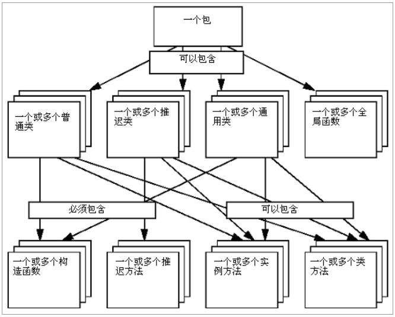

[TOC]

# 基础类介绍

整个 OCC 由五个模块组成，分别是基础类模块、建模数据模块、建模算法模块、可视化模块、数据交换模块和应用程序模块。其中，建模数据模块主要提供二维和三维几何模型的数据结构，也称数据结构模块。

一个模块主要由一个或几个工具箱构成。当然它也可以包含一些执行体和资源体等。就结构上看，一个工具箱就是一个共享库（如.so 或.dll 类型的文件）。每个工具箱由一个或几个包组成。而每个包则由许多类组成。

一个几何包包含点类、线类和圆类等。在同一个包中，不能含有相同名字的两个类。使用类的时候，类名要以包名作前缀，如 Geom_Circle。 

基础类包括根类组件、串类组件、集合容器组件、标准对象的集合容器组件、向量和矩阵类组件、基本几何类型组件、常用数学算法组件、异常类组件、数量类组件和应用程序服务组件。

## 根类组件

根类是基本的数据类型和类，其它所有类都是依此而建立的。它提供以下类型和类：

- （1）基本类型，如 Boolean（布尔类型）、Character（字符型）、Integer（整型）或者 Real（实型）等。
- （2）动态对象的安全处理，以确保那些不再被引用的对象能被及时删除（详见 Standard_Transient 类）。 
- （3）可设置的内存优化管理器。它能改善那些经常使用动态对象的程序性能。
- （4）run-time 类型信息扩展机制。它使得复杂程序的创建变得更为简易。
- （5）异常管理。
- （6）C++各种流的封装。

根类主要在 Standard 和 MMgt 两个包中实现。

## 串类组件

串类用来处理动态大小的 ASCII 和 Unicode 字符序列，可以通过句柄处理，因此也可以被共享。串类在 TCollection 包中实现。

## 集合容器组件

集合容器是处理动态大小的数据集合的类。集合容器是通用的，即每一种集合容器定义了一种结构和一些算法，可持有许多对象——通常这些对象不必从根类继承。这与 C++模板相似。如果需要使用一个给定对象类型的集合容器，则必须对这个元素的指定类型进行实例化。一旦这个实例声明被编译，所有基于这个通用集合容器的函数都可以在集合容器对象中实现。

集合容器包含许多通用类，如 run-time 大小的数组、列表、栈、队列、集（Set）和散列图（hash map）。

集合容器在 TCollection 和 NCollection 包中实现。

## 标准对象的集合容器组件
TColStd 包为 TCollection 包中通用类的一些经常使用的实例化提供对象（来 自 Standard 包）或者串（来自 TCollection 包）。

## 向量和矩阵类组件
向量和矩阵类提供了有关向量和矩阵的常用数学算法和基本运算（加、乘、转置、求逆等）。

## 基本几何类型组件
基本几何类型提供了基本几何实体和代数实体的实现。这些实现符合 STEP （Standard Exchange of Product data model,即产品数据模型的交换标准）。它们提供基本几何 Shape 的描述（点、向量、直线、圆与圆锥、平面与基本曲面、通过坐标轴或坐标系使 Shape 在平面上或空间中定位）和 Shape 几何变换的定义与应用（平移、旋转、对称、缩放、复合变换、代数计算工具）。

## 常用数学算法组件

常用数学算法为那些经常使用的数学算法提供 C++实现。这些算法有：
- （1）求解线性代数方程组的算法 ； 
- （2）求一元或多元函数最小值的算法；
- （3）求解非线性方程或非线性方程组的算法；
- （4）求矩阵特征值和特征向量的算法。

## 异常类组件
OCC 提供了一套异常类。所有异常类都是基于它们的根类—— Failure 类 的。异常类描述了函数运行期间可能发生的异常情况。发生异常时，程序将不能正常运行。对这种情况的响应称为异常处理。

## 数量类组件
数量类为日期和时间信息提供支持，同时也为表示常用物理量的基本类型（如长度、面积、体积、质量、密度、重量、温度和压力等）提供支持。

## 应用服务组件
应用服务组件包括几种低级服务的实现。借助 OCC 平台，这些服务可以使那些允许用户自定义和用户友好的应用程序的创建变得更容易。以下是该组件提供的四种服务：

- （1）单位转换工具。它们为各种量和相应物理单位的处理提供统一机制。这种机制能够检查单位的兼容性，以及在两种不同的单位间进行数值转换等（详 见 UnitsAPI 包）。 
- （2）有关表达的基本解释器。它使得用户脚本工具的建立和表达的通用定义等变得更容易（详见 ExprIntrp 包）。 
- （3）用于处理配置资源文件（见 Resource 包）和用户定制信息文件（见Message 包）的工具。有了这些工具，为应用程序提供多语言支持就很容易了。 
- （4）进程提示和用户中断接口。它们甚至可能为低级算法提供一种综合便利的用户交流方式。

