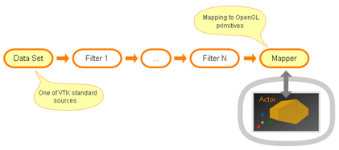
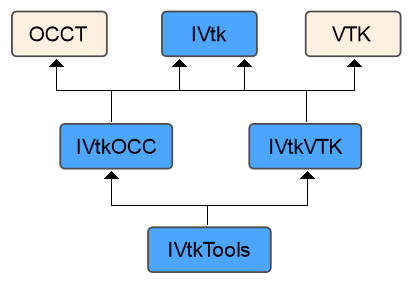
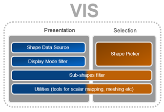

[TOC]

使用VIS有两个方法：

- Use a **high-level API**. It is a simple scenario to use VTK viewer with displayed OCCT shapes. It considers usage of tools provided with VIS component such as a specific VTK data source, a picker class and specific VTK filters. Basically, in this scenario you enrich your custom VTK pipeline with extensions coming from VIS.
- 使用带有显示 OCCT 形状的 VTK 查看器是一个简单的场景。 它考虑了 VIS 组件提供的工具的使用，例如特定的 VTK 数据源、选择器类和特定的 VTK 过滤器。 基本上，在这种情况下，可以使用来自 VIS 的扩展来丰富您的自定义 VTK 管道。
- Use a **low-level API**. It is an advanced scenario for the users with specific needs, which are not addressed by the higher-level utilities of VIS. It presumes implementation of custom VTK algorithms (such as filters) with help of low-level API of VIS component. This document describes both scenarios of VIS integration into application. To understand this document, it is necessary to be familiar with VTK and OCCT libraries.
- 对于具有特定需求的用户来说，这是一个高级场景，VIS 的更高级别的实用程序没有解决这些需求。 它假定在 VIS 组件的低级 API 的帮助下实现自定义 VTK 算法（例如过滤器）。 本文档描述了 VIS 集成到应用程序的两种场景。 要理解本文档，有必要熟悉 VTK 和 OCCT 库。

# Component Architecture

## Common structure

VIS component consists of the following packages:

- **IVtk** – common interfaces which define the principal objects playing as foundation of VIS.

- **IVtkOCC** – implementation of interfaces related to CAD domain. The classes from this package deal with topological shapes, faceting and interactive selection facilities of OCCT;
- **IVtkVTK** – implementation of interfaces related to VTK visualization toolkit;
- **IVtkTools** – high-level tools designed for integration into VTK visualization pipelines.

The idea behind the mentioned organization of packages is separation of interfaces from their actual implementations by their dependencies from a particular library (OCCT, VTK). Besides providing of semantic separation, such splitting helps to avoid excessive dependencies on other OCCT toolkits and VTK.

所提到的包组织背后的想法是通过它们与特定库（OCCT、VTK）的依赖关系将接口与其实际实现分离。 除了提供语义分离之外，这种拆分有助于避免对其他 OCCT 工具包和 VTK 的过度依赖。

- **IVtk** package does not depend on VTK libraries at all and needs OCCT libraries only because of collections usage (*TKernel* library);

- Implementation classes from **IVtkOCC** package depend on OCCT libraries only and do not need VTK;

- **IVtkVTK** package depends on VTK libraries only and does not need any OCCT functionality except collections.

## IVtk package

**IVtk** package contains the following classes:

- *IVtk_Interface* – Base class for all interfaces of the component. Provides inheritance for *Handle* (OCCT “smart pointer”) functionality.
- 组件所有接口的基类。 为*Handle*（OCCT“智能指针”）功能提供继承。
- *IVtk_IShape* – Represents a 3D shape of arbitrary nature. Provides its ID property. Implementation of this interface should maintain unique IDs for all visualized shapes. These IDs can be easily converted into original shape objects at the application level.
- 代表任意性质的 3D 形状。 提供其 ID 属性。 此接口的实现应为所有可视化形状维护唯一 ID。 这些 ID 可以在应用程序级别轻松转换为原始形状对象。
- *IVtk_IShapeData* – Represents faceted data. Provides methods for adding coordinates and cells (vertices, lines, triangles).
- 表示分面数据。 提供添加坐标和单元格（顶点、线、三角形）的方法。
- *IVtk_IShapeMesher* – Interface for faceting, i.e. constructing *IVtk_IShapeData* from *IVtk_IShape* input shape.
- 分面接口，即从 *IVtk_IShape* 输入形状构建 *IVtk_IShapeData*。 
- *IVtk_IShapePickerAlgo* – Algorithmic interface for interactive picking of shapes in a scene. Provides methods for finding shapes and their parts (sub-shapes) at a given location according to the chosen selection mode.
- 用于在场景中交互式选取形状的算法界面。 提供根据所选选择模式在给定位置查找形状及其部分（子形状）的方法。
- *IVtk_IView* – Interface for obtaining view transformation parameters. It is used by *IVtk_IShapePickerAlgo*.
- 获取视图转换参数的接口。 *IVtk_IShapePickerAlgo* 使用它。

## IVtkOCC package

**IVtkOCC** package contains the implementation of classes depending on OCCT:

**IVtkOCC** 包包含依赖于 OCCT 的类的实现：

- *IVtkOCC_Shape* – Implementation of *IVtk_IShape* interface as a wrapper for *[TopoDS_Shape](https://old.opencascade.com/doc/occt-7.4.0/refman/html/class_topo_d_s___shape.html)*.
- 将 IVtk_IShape 接口实现为 TopoDS_Shape 的包装器
- *IVtkOCC_ShapeMesher* – Implementation of *IVtk_IShapeMesher* interface for construction of facets from *[TopoDS](https://old.opencascade.com/doc/occt-7.4.0/refman/html/class_topo_d_s.html)* shapes.
- 用于从 TopoDSshapes 构建面的 IVtk_IShapeMesher 接口的实现。
- *IVtkOCC_ShapePickerAlgo* – Implementation of interactive picking algorithm. It provides enabling/disabling of selection modes for shapes (*IVtk_IShape* instances) and picking facilities for a given position of cursor.
- 交互式拣选算法的实现。 它提供启用/禁用形状（IVtk_IShape 实例）的选择模式和光标给定位置的选择功能。
- *IVtkOCC_ViewerSelector* – Interactive selector, which implements *Pick()* methods for the picking algorithm *IVtkOCC_ShapePickerAlgo* and connects to the visualization layer with help of abstract *IView* interface.
- 交互式选择器，它为拣选算法 IVtkOCC_ShapePickerAlgo 实现 Pick() 方法，并在抽象 IView 接口的帮助下连接到可视化层。

*IVtkOCC_ViewerSelector* is a descendant of OCCT native *[SelectMgr_ViewerSelector](https://old.opencascade.com/doc/occt-7.4.0/refman/html/class_select_mgr___viewer_selector.html)*, so it implements OCCT selection mechanism for *IVtkVTK_View* (similarly to *StdSelect_ViewerSelector3D* which implements *[SelectMgr_ViewerSelector](https://old.opencascade.com/doc/occt-7.4.0/refman/html/class_select_mgr___viewer_selector.html)* for OCCT native *[V3d_View](https://old.opencascade.com/doc/occt-7.4.0/refman/html/class_v3d___view.html)*). *IVtkOCC_ViewerSelector* encapsulates all projection transformations for the picking mechanism. These transformations are extracted from *vtkCamera* instance available via VTK Renderer. *IVtkOCC_ViewerSelector* operates with native OCCT *[SelectMgr_Selection](https://old.opencascade.com/doc/occt-7.4.0/refman/html/class_select_mgr___selection.html)* entities. Each entity represents one selection mode of an OCCT selectable object. *ViewerSelector* is an internal class, so it is not a part of the public API.

IVtkOCC_ViewerSelector 是 OCCT 原生 SelectMgr_ViewerSelector 的后代，因此它为 IVtkVTK_View 实现了 OCCT 选择机制（类似于 StdSelect_ViewerSelector3D，它为 OCCT 原生 V3d_View() 实现了 SelectMgr_ViewerSelector。 VTK Renderer.IVtkOCC_ViewerSelector与原生OCCT SelectMgr_Selection实体一起操作，每个实体代表一个OCCT可选对象的一种选择模式，ViewerSelector是一个内部类，所以它不是公共API的一部分。

- *IVtkOCC_SelectableObject* – OCCT shape wrapper used in the picking algorithm for computation of selection primitives of a shape for a chosen selection mode.
- OCCT 形状包装器用于拾取算法，用于计算所选选择模式的形状的选择基元。

