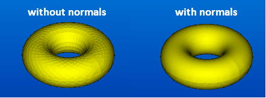
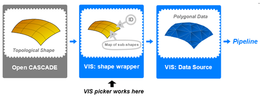

[TOC]


使用VIS有两个方法：

- Use a **high-level API**. It is a simple scenario to use VTK viewer with displayed OCCT shapes. It considers usage of tools provided with VIS component such as a specific VTK data source, a picker class and specific VTK filters. Basically, in this scenario you enrich your custom VTK pipeline with extensions coming from VIS.
- 使用带有显示 OCCT 形状的 VTK 查看器是一个简单的场景。 它考虑了 VIS 组件提供的工具的使用，例如特定的 VTK 数据源、选择器类和特定的 VTK 过滤器。 基本上，在这种情况下，可以使用来自 VIS 的扩展来丰富您的自定义 VTK 管道。
- Use a **low-level API**. It is an advanced scenario for the users with specific needs, which are not addressed by the higher-level utilities of VIS. It presumes implementation of custom VTK algorithms (such as filters) with help of low-level API of VIS component. This document describes both scenarios of VIS integration into application. To understand this document, it is necessary to be familiar with VTK and OCCT libraries.
- 对于具有特定需求的用户来说，这是一个高级场景，VIS 的更高级别的实用程序没有解决这些需求。 它假定在 VIS 组件的低级 API 的帮助下实现自定义 VTK 算法（例如过滤器）。 本文档描述了 VIS 集成到应用程序的两种场景。 要理解本文档，有必要熟悉 VTK 和 OCCT 库。

# Component Architecture

## Common structure

VIS component consists of the following packages:

- **IVtk** – common interfaces which define the principal objects playing as foundation of VIS.

- **IVtkOCC** – implementation of interfaces related to CAD domain. The classes from this package deal with topological shapes, faceting and interactive selection facilities of OCCT;
- **IVtkVTK** – implementation of interfaces related to VTK visualization toolkit;
- **IVtkTools** – high-level tools designed for integration into VTK visualization pipelines.


The idea behind the mentioned organization of packages is separation of interfaces from their actual implementations by their dependencies from a particular library (OCCT, VTK). Besides providing of semantic separation, such splitting helps to avoid excessive dependencies on other OCCT toolkits and VTK.

所提到的包组织背后的想法是通过它们与特定库（OCCT、VTK）的依赖关系将接口与其实际实现分离。 除了提供语义分离之外，这种拆分有助于避免对其他 OCCT 工具包和 VTK 的过度依赖。

- **IVtk** package does not depend on VTK libraries at all and needs OCCT libraries only because of collections usage (*TKernel* library);

- Implementation classes from **IVtkOCC** package depend on OCCT libraries only and do not need VTK;

- **IVtkVTK** package depends on VTK libraries only and does not need any OCCT functionality except collections.


## IVtk package

**IVtk** package contains the following classes:

- *IVtk_Interface* – Base class for all interfaces of the component. Provides inheritance for *Handle* (OCCT “smart pointer”) functionality.
- 组件所有接口的基类。 为*Handle*（OCCT“智能指针”）功能提供继承。
- *IVtk_IShape* – Represents a 3D shape of arbitrary nature. Provides its ID property. Implementation of this interface should maintain unique IDs for all visualized shapes. These IDs can be easily converted into original shape objects at the application level.
- 代表任意性质的 3D 形状。 提供其 ID 属性。 此接口的实现应为所有可视化形状维护唯一 ID。 这些 ID 可以在应用程序级别轻松转换为原始形状对象。
- *IVtk_IShapeData* – Represents faceted data. Provides methods for adding coordinates and cells (vertices, lines, triangles).
- 表示分面数据。 提供添加坐标和单元格（顶点、线、三角形）的方法。
- *IVtk_IShapeMesher* – Interface for faceting, i.e. constructing *IVtk_IShapeData* from *IVtk_IShape* input shape.
- 分面接口，即从 *IVtk_IShape* 输入形状构建 *IVtk_IShapeData*。 
- *IVtk_IShapePickerAlgo* – Algorithmic interface for interactive picking of shapes in a scene. Provides methods for finding shapes and their parts (sub-shapes) at a given location according to the chosen selection mode.
- 用于在场景中交互式选取形状的算法界面。 提供根据所选选择模式在给定位置查找形状及其部分（子形状）的方法。
- *IVtk_IView* – Interface for obtaining view transformation parameters. It is used by *IVtk_IShapePickerAlgo*.
- 获取视图转换参数的接口。 *IVtk_IShapePickerAlgo* 使用它。

## IVtkOCC package

**IVtkOCC** package contains the implementation of classes depending on OCCT:

**IVtkOCC** 包包含依赖于 OCCT 的类的实现：

- *IVtkOCC_Shape* – Implementation of *IVtk_IShape* interface as a wrapper for *[TopoDS_Shape](https://old.opencascade.com/doc/occt-7.4.0/refman/html/class_topo_d_s___shape.html)*.
- 将 IVtk_IShape 接口实现为 TopoDS_Shape 的包装器
- *IVtkOCC_ShapeMesher* – Implementation of *IVtk_IShapeMesher* interface for construction of facets from *[TopoDS](https://old.opencascade.com/doc/occt-7.4.0/refman/html/class_topo_d_s.html)* shapes.
- 用于从 TopoDSshapes 构建面的 IVtk_IShapeMesher 接口的实现。
- *IVtkOCC_ShapePickerAlgo* – Implementation of interactive picking algorithm. It provides enabling/disabling of selection modes for shapes (*IVtk_IShape* instances) and picking facilities for a given position of cursor.
- 交互式拣选算法的实现。 它提供启用/禁用形状（IVtk_IShape 实例）的选择模式和光标给定位置的选择功能。
- *IVtkOCC_ViewerSelector* – Interactive selector, which implements *Pick()* methods for the picking algorithm *IVtkOCC_ShapePickerAlgo* and connects to the visualization layer with help of abstract *IView* interface.
- 交互式选择器，它为拣选算法 IVtkOCC_ShapePickerAlgo 实现 Pick() 方法，并在抽象 IView 接口的帮助下连接到可视化层。

*IVtkOCC_ViewerSelector* is a descendant of OCCT native *[SelectMgr_ViewerSelector](https://old.opencascade.com/doc/occt-7.4.0/refman/html/class_select_mgr___viewer_selector.html)*, so it implements OCCT selection mechanism for *IVtkVTK_View* (similarly to *StdSelect_ViewerSelector3D* which implements *[SelectMgr_ViewerSelector](https://old.opencascade.com/doc/occt-7.4.0/refman/html/class_select_mgr___viewer_selector.html)* for OCCT native *[V3d_View](https://old.opencascade.com/doc/occt-7.4.0/refman/html/class_v3d___view.html)*). *IVtkOCC_ViewerSelector* encapsulates all projection transformations for the picking mechanism. These transformations are extracted from *vtkCamera* instance available via VTK Renderer. *IVtkOCC_ViewerSelector* operates with native OCCT *[SelectMgr_Selection](https://old.opencascade.com/doc/occt-7.4.0/refman/html/class_select_mgr___selection.html)* entities. Each entity represents one selection mode of an OCCT selectable object. *ViewerSelector* is an internal class, so it is not a part of the public API.

IVtkOCC_ViewerSelector 是 OCCT 原生 SelectMgr_ViewerSelector 的后代，因此它为 IVtkVTK_View 实现了 OCCT 选择机制（类似于 StdSelect_ViewerSelector3D，它为 OCCT 原生 V3d_View() 实现了 SelectMgr_ViewerSelector。 VTK Renderer.IVtkOCC_ViewerSelector与原生OCCT SelectMgr_Selection实体一起操作，每个实体代表一个OCCT可选对象的一种选择模式，ViewerSelector是一个内部类，所以它不是公共API的一部分。

- *IVtkOCC_SelectableObject* – OCCT shape wrapper used in the picking algorithm for computation of selection primitives of a shape for a chosen selection mode.
- OCCT 形状包装器用于拾取算法，用于计算所选选择模式的形状的选择基元。

## IVtkVtk package

**IVtkVTK** package contains implementation of classes depending on VTK:

IVtkVTK包包含依赖于 VTK 的类的实现：

- *IVtkVTK_ShapeData* – Implementation of *IVtk_IShapeData* interface for VTK polydata. This class also stores information related to sub-shape IDs and sub-shape mesh type *IVtk_MeshType* (free vertex, shared vertex, free edge, boundary edge, shared edge, wireframe face or shaded face). This information is stored in VTK data arrays for cells.
- IVtk_IShapeData 是VTK polydata的接口实现。此类还存储与子形状 ID 和子形状网格类型 *IVtk_MeshType*（自由顶点、共享顶点、自由边、边界边、共享边、线框面或阴影面）相关的信息。这些cells信息存储在VTK 数据数组中。
- *IVtkVTK_View* – Implementation of *IVtk_IView* interface for VTK viewer. This implementation class is used to connect *IVtkOCC_ViewerSelector* to VTK renderer.
- IVtk_IView 是VTK viewer的接口的实现。该实现类用于将 *IVtkOCC_ViewerSelector* 连接到 VTK 渲染器。

## IVtkTools package

**IVtkTools** package gives you a ready-to-use toolbox of algorithms facilitating the integration of OCCT shapes into visualization pipeline of VTK. This package contains the following classes:

**IVtkTools** 包为您提供了一个随时可用的算法工具箱，有助于将 OCCT 形状集成到 VTK 的可视化管道中。 这个包包含以下类：

- *IVtkTools_ShapeDataSource* – VTK polygonal data source for OCCT shapes. It inherits *vtkPolyDataAlgorithm* class and provides a faceted representation of OCCT shape for visualization pipelines.
- *IVtkTools_ShapeDataSource* – OCCT 形状的 VTK 多边形数据源。 它继承了 *vtkPolyDataAlgorithm* 类，并为可视化管道提供了 OCCT 形状的分面表示。
- *IVtkTools_ShapeObject* – Auxiliary wrapper class for OCCT shapes to pass them through pipelines by means of VTK information keys.
- *IVtkTools_ShapeObject* – OCCT 形状的辅助包装类，通过 VTK 信息密钥将它们传递到管道。
- *IVtkTools_ShapePicker* – VTK picker for shape actors. Uses OCCT selection algorithm internally.
- *IVtkTools_ShapePicker* – shape actors的 VTK 选择器。 内部使用 OCCT 选择算法。
- *IVtkTools_DisplayModeFilter* – VTK filter for extracting cells of a particular mesh type according to a given display mode *IVtk_DisplayMode* (Wireframe or Shading).
- *IVtkTools_DisplayModeFilter* – VTK 过滤器，用于根据给定的显示模式 *IVtk_DisplayMode*（线框或阴影）提取特定网格类型的单元格。
- *IVtkTools_SubPolyDataFilter* – VTK filter for extracting the cells corresponding to a given set of sub-shape IDs.
- *IVtkTools_SubPolyDataFilter* – VTK 过滤器，用于提取与一组给定的子形状 ID 对应的单元格。

Additionally, *IVtkTools* package contains auxiliary methods in *IVtkTools* namespace. E.g. there is a convenience function populating *vtkLookupTable* instances to set up a color scheme for better visualization of sub-shapes.

此外，*IVtkTools* 包在 *IVtkTools* 命名空间中包含辅助方法。 例如。 有一个方便的函数填充 *vtkLookupTable* 实例来设置颜色方案，以便更好地可视化子形状。

# Using high-level API (simple scenario)

## OCCT shape presentation in VTK viewer

To visualize an OCCT topological shape in VTK viewer, it is necessary to perform the following steps:

 要在 VTK 查看器中可视化 OCCT 拓扑形状，需要执行以下步骤：

1.Create *IVtkOCC_Shape* instance (VIS wrapper for OCCT shape) and initialize it with *[TopoDS_Shape](https://old.opencascade.com/doc/occt-7.4.0/refman/html/class_topo_d_s___shape.html)* object containing the actual geometry:

创建 IVtkOCC_Shape 实例（OCCT 形状的 VIS 包装器）并使用包含实际几何图形的 TopoDS_Shape 对象对其进行初始化：

```
TopoDS_Shape aShape;
// Initialize aShape variable: e.g. load it from BREP file
IVtkOCC_Shape::Handle aShapeImpl = new IVtkOCC_Shape(aShape);
```

2.Create VTK polygonal data source for the target OCCT topological shape and initialize it with created *IVtkOCC_Shape* instance. At this stage the faceter is implicitly plugged:

为目标 OCCT 拓扑形状创建 VTK 多边形数据源，并使用创建的 IVtkOCC_Shape 实例对其进行初始化。 在这个阶段，faceter 被隐式插入：

```
vtkSmartPointer<IVtkTools_ShapeDataSource> DS = vtkSmartPointer<IVtkTools_ShapeDataSource>::New();
DS->SetShape(aShapeImpl);
```

3.Visualize the loaded shape in usual VTK way starting a pipeline from the newly created specific source:

从新创建的特定源开始管道，以通常的 VTK 方式可视化加载的形状：

```
vtkSmartPointer<vtkPolyDataMapper> Mapper = vtkSmartPointer<vtkPolyDataMapper>::New();
Mapper->SetInputConnection(aDS->GetOutputPort());
vtkSmartPointer<vtkActor> Actor = vtkSmartPointer<vtkActor>::New();
Actor->SetMapper(Mapper);
```

It is always possible to access the shape data source from VTK actor by means of dedicated methods from *IVtkTools_ShapeObject* class:

始终可以通过来自 IVtkTools_ShapeObject 类的专用方法从 VTK actor 访问形状数据源：

```
IVtkTools_ShapeDataSource* DS = IVtkTools_ShapeObject::GetShapeSource(Actor);
IVtkOCC_Shape::Handle occShape = IVtkTools_ShapeObject::GetOccShape(Actor);
```

It is also possible to get a shape wrapper from the shape data source:

也可以从形状数据源获取形状包装器：

```
IVtkOCC_Shape::Handle occShape = DS->GetShape();
```

## Color schemes

### Default OCCT color scheme

To colorize different parts of a shape according to the default OCCT color scheme, it is possible to configure the corresponding VTK mapper using a dedicated auxiliary function of *IVtkTools* namespace:

要根据默认的 OCCT 配色方案为形状的不同部分着色，可以使用 *IVtkTools* 命名空间的专用辅助功能配置相应的 VTK 映射器：

```
IVtkTools::InitShapeMapper(Mapper);
```

It is possible to get an instance of *vtkLookupTable class* with a default OCCT color scheme by means of the following method:

可以通过以下方法获取具有默认 OCCT 配色方案的 *vtkLookupTable 类* 的实例：

```
vtkSmartPointer<vtkLookupTable> Table = IVtkTools::InitLookupTable();
```

### Custom color scheme

To set up application-specific colors for a shape presentation, use *InitShapeMapper* function with an additional argument passing a custom lookup table:

要为形状演示设置特定于应用程序的颜色，请使用 *InitShapeMapper* 函数和传递自定义查找表的附加参数：

```
IVtkTools::InitShapeMapper(Mapper, Table);
```

### Setting custom colors for sub-shapes

It is also possible to bind custom colors to any sub-shape type listed in *IVtk_MeshType* enumeration. For example, to access the color bound to *free edge* entities, the following calls are available in *IVtkTools* namespace:

还可以将自定义颜色绑定到 *IVtk_MeshType* 枚举中列出的任何子形状类型。 例如，要访问绑定到 *free edge* 实体的颜色，可以在 *IVtkTools* 命名空间中使用以下调用：

```
SetLookupTableColor(aLookupTable, MT_FreeEdge, R, G, B);

SetLookupTableColor(aLookupTable, MT_FreeEdge, R, G, B, A);

GetLookupTableColor(aLookupTable, MT_FreeEdge, R, G, B);

GetLookupTableColor(aLookupTable, MT_FreeEdge, R, G, B, A);
```

Here *R, G, B* are double values of red, green and blue components of a color from the range [0, 1]. The optional parameter *A* stands for the alpha value (the opacity) as a double from the same range [0, 1]. By default alpha value is 1, i.e. a color is not transparent.

这里 *R, G, B* 是 [0, 1] 范围内颜色的红色、绿色和蓝色分量的双值。 可选参数 *A* 代表 alpha 值（不透明度）作为来自相同范围 [0, 1] 的双精度值。 默认 alpha 值为 1，即颜色不透明。

### Using color scheme of mapper

As VTK color mapping approach is based on associating scalar data arrays to VTK cells, the coloring of shape components can be turned on/off in the following way:

由于 VTK 颜色映射方法基于将标量数据数组关联到 VTK 单元格，因此可以通过以下方式打开/关闭形状组件的着色：

```
Mapper->ScalarVisibilityOn();  // use colors from lookup table

Mapper->ScalarVisibilityOff(); // use a color of actor’s property
```

For example, the scalar-based coloring can be disabled to bind a single color to the entire VTK actor representing the shape.

例如，可以禁用基于标量的着色以将单一颜色绑定到代表该形状的整个 VTK actor。

## Display modes

The output of the shape data source can be presented in wireframe or shading display mode. A specific filter from class *IVtkTools_DisplayModeFilter* can be applied to select the display mode. The filter passes only the cells corresponding to the given mode. The set of available modes is defined by *IVtk_DisplayMode* enumeration.

形状数据源的输出可以以线框或阴影显示模式呈现。 可以应用类 *IVtkTools_DisplayModeFilter* 中的特定过滤器来选择显示模式。 过滤器仅通过与给定模式对应的单元格。 可用模式集由 *IVtk_DisplayMode* 枚举定义。


For example, the shading representation can be obtained in the following way:

例如，可以通过以下方式获得阴影表示：

```
vtkSmartPointer<IVtkTools_ShapeDataSource> DS = vtkSmartPointer<IVtkTools_ShapeDataSource>::New();
vtkSmartPointer<IVtkTools_DisplayModeFilter> DMFilter = vtkSmartPointer<IVtkTools_DisplayModeFilter>::New();
DMFilter->AddInputConnection(DS->GetOutputPort());
DMFilter->SetDisplayMode(DM_Shading);
vtkSmartPointer<vtkDataSetMapper> M = vtkSmartPointer<vtkDataSetMapper>::New();
M->SetInputConnection(DMFilter->GetOutputPort());
```

By default, the display mode filter works in a wireframe mode.

默认情况下，显示模式过滤器以线框模式工作。

TIP: to make the shading representation smooth, use additional *vtkPolyDataNormals* filter. This filter must be applied after the display mode filter.

提示：要使阴影表示平滑，请使用额外的 *vtkPolyDataNormals* 过滤器。 此过滤器必须在显示模式过滤器之后应用。



## Interactive selection

*IVtkTools* package provides *IVtkTools_ShapePicker* class to perform selection of OCCT shapes and sub-shapes in VTK viewer and access the picking results. The typical usage of *IVtkTools_ShapePicker* tool consists in the following sequence of actions:

*IVtkTools* 包提供了 *IVtkTools_ShapePicker* 类以在 VTK 查看器中执行 OCCT 形状和子形状的选择并访问拾取结果。 *IVtkTools_ShapePicker* 工具的典型用法包括以下操作序列：

1.Create a picker and set its renderer to your active VTK renderer:

创建一个选择器并将其渲染器设置为活动的 VTK 渲染器：

```
vtkSmartPointer<IVtkTools_ShapePicker> aPicker = vtkSmartPointer<IVtkTools_ShapePicker>::New();
aPicker->SetRenderer(aRenderer);
```

2.Activate the desired selection mode by choosing the corresponding sub-shape types from *IVtk_SelectionMode* enumeration. For example, the following call allows selection of edges on all selectable shape actors of the renderer:

通过从 IVtk_SelectionMode 枚举中选择相应的子形状类型来激活所需的选择模式。 例如，以下调用允许在渲染器的所有可选形状 actor 上选择边：

```
aPicker->SetSelectionMode(SM_Edge);
```

If it is necessary to limit selection by a particular shape actor, one can use the mentioned *SetSelectionMode* method with *IVtk_IShape* handle or *vtkActor* pointer as the first argument:

如果需要限制特定形状 actor 的选择，可以使用提到的 *SetSelectionMode* 方法，将 *IVtk_IShape* 句柄或 *vtkActor* 指针作为第一个参数：

```
IVtk_IShape::Handle aShape = new IVtkOCC_Shape(occShape);
aPicker->SetSelectionMode(aShape, SM_Edge); // If shape handle is available
aPicker->SetSelectionMode(anActor, SM_Edge); // If shape actor is available
```

Different selection modes can be turned on/off for a picker at the same time independently from each other.

可以同时为一个选择器单独打开/关闭不同的选择模式。

```
aPicker->SetSelectionMode(SM_Edge);
aPicker->SetSelectionMode(SM_Face);
```

To turn off a selection mode, the additional optional Boolean parameter is used with *false* value, for example:

要关闭选择模式，附加的可选布尔参数与 false 值一起使用，例如：

```
aPicker->SetSelectionMode(aShape, SM_Edge, false);
```

3.Call *Pick* method passing the mouse display coordinates:

调用传递鼠标显示坐标的 Pick 方法：

```
aPicker->Pick(x, y, 0);
```

By default, the renderer passed in the step 1 is used. In order to perform pick operation for another renderer an additional optional parameter can be specified:

默认情况下，使用步骤 1 中传递的渲染器。 为了对另一个渲染器执行拾取操作，可以指定一个额外的可选参数：

```
aPicker->Pick(x, y, 0, aRenderer);
```

4.Obtain the top-level picking results as a collection of picked VTK actors:

获取顶级选择结果作为选择的 VTK 演员的集合：

```
vtkActorCollection* anActorCollection = aPicker->GetPickedActors();
```

or as a collection of picked shape IDs:

或作为选取的形状 ID 的集合：

```
IVtk_ShapeIdList ids = aPicker->GetPickedShapesIds();
```

These methods return a single top picked actor or a shape by default. To get all the picked actors or shapes it is necessary to send “true” value in the optional Boolean parameter:

默认情况下，这些方法返回单个顶部选择的 actor 或形状。 要获得所有选择的演员或形状，必须在可选的布尔参数中发送“真”值：

```
anActorCollection = aPicker->GetPickedActors(true);
ids = aPicker->GetPickedShapesIds(true);
```

5.Obtain the picked sub-shape IDs:

获取选取的子形状 ID：

```
IVtk_ShapeIdList subShapeIds = aPicker->GetPickedSubShapesIds(shapeId);
```

This method also returns a single ID of a top-level picked sub-shape and has the same optional Boolean parameter to get all the picked sub-shapes of a shape:

此方法还返回一个顶级选取的子形状的单个 ID，并具有相同的可选布尔参数来获取形状的所有选取的子形状：

```
subShapeIds = aPicker->GetPickedSubShapesIds(shapeId, true);
```

It should be noted that it is more efficient to create a sole picker instance and feed it with the renderer only once. The matter is that the picking algorithm performs internal calculations each time the renderer or some of its parameters are changed. Therefore, it makes sense to minimize the number of such updates.

应该注意的是，创建一个唯一的选择器实例并只将它提供给渲染器一次会更有效。 问题是每次更改渲染器或其某些参数时，拾取算法都会执行内部计算。 因此，尽量减少此类更新的数量是有意义的。

OCCT picking algorithm *IVtkTools_ShapePicker* calculates a new transformation matrix for building of projection each time some parameters of a view are changed. Likewise, the shape selection primitives for each selection mode are built once an appropriate selection mode is turned on for this shape in *SetSelectionMode* method.

OCCT 拾取算法 IVtkTools_ShapePicker 会在每次更改视图的某些参数时计算用于构建投影的新变换矩阵。 同样，一旦在 SetSelectionMode 方法中为此形状打开了适当的选择模式，就会构建每个选择模式的形状选择基元。

WARNING: VIS picker essentially works on the initial topological data structures rather than on the actually visualized actors. This peculiarity allows VIS to take advantage of standard OCCT selection mechanism, but puts strict limitations on the corresponding visualization pipelines. Once constructed, the faceted shape representation should not be morphed or translated anyhow. Otherwise, the picking results will lose their associativity with the source geometry. E.g. you should never use *vtkTransform* filter, but rather apply OCCT isometric transformation on the initial model in order to work on already relocated facet. These limitations are often acceptable for CAD visualization. If not, consider usage of a custom VTK-style picker working on the actually visualized actors.

警告：VIS 选择器本质上是在初始拓扑数据结构上工作，而不是在实际可视化的角色上工作。 这种特性允许 VIS 利用标准的 OCCT 选择机制，但对相应的可视化管道进行了严格的限制。 一旦构建，多面形状表示无论如何都不应该变形或转换。 否则，拾取结果将失去与源几何体的关联性。 例如。 你不应该使用 *vtkTransform* 过滤器，而是应该在初始模型上应用 OCCT 等距变换，以便处理已经重新定位的方面。 这些限制对于 CAD 可视化通常是可以接受的。 如果没有，请考虑使用自定义的 VTK 样式选择器处理实际可视化的 actor。



### Selection of sub-shapes

*IVtkTools_SubPolyDataFilter* is a handy VTK filter class which allows extraction of polygonal cells corresponding to the sub-shapes of the initial shape. It can be used to produce a *vtkPolyData* object from the input *vtkPolyData* object, using selection results from *IVTkTools_ShapePicker* tool.

IVtkTools_SubPolyDataFilter 是一个方便的 VTK 过滤器类，它允许提取与初始形状的子形状相对应的多边形单元。 它可用于从输入 vtkPolyData 对象生成 vtkPolyData 对象，使用来自 IVTkTools_ShapePicker 工具的选择结果。

For example, sub-shapes can be represented in VTK viewer in the following way:

例如，子形状可以通过以下方式在 VTK 查看器中表示：

```
// Load a shape into data source (see 3.1)
...
vtkSmartPointer<IVtkTools_ShapeDataSource> DS = vtkSmartPointer<IVtkTools_ShapeDataSource>::New();
DS->SetShape(shapeImpl);
...
// Create a new sub-polydata filter for sub-shapes filtering
vtkSmartPointer<IVtkTools_SubPolyDataFilter> subShapesFilter = IVtkTools_SubPolyDataFilter::New();
// Set a shape source as an input of the sub-polydata filter
subShapesFilter->SetInputConnection(DS->GetOutputPort());
// Get all picked sub-shapes ids of the shape from a picker (see 3.4)
IVtk_ShapeIdList subShapeIds = aPicker->GetPickedSubShapesIds(ds->GetId(), true);
// Set ids to the filter to pass only picked sub-shapes
subShapesFilter->SetData(subShapeIds);
subShapesFilter->Modified();
// Output the result into a mapper
vtkSmartPointer<vtkPolyDataMapper> aMapper = vtkPolyDataMapper::New();
aMapper->AddInputConnection(subShapesFilter->GetOutputPort());
...
```

# Using of low-level API (advanced scenario)

## Shape presentation

The usage of low-level tools is justified in cases when the utilities from *IVtkTools* are not enough.

在 *IVtkTools* 中的实用程序不够用的情况下，使用低级工具是合理的。

The low-level scenario of VIS usage in VTK pipeline is shown in the figure below. The Mesher component produces shape facet (VTK polygonal data) using implementation of *IShapeData* interface. Then result can be retrieved from this implementation as a *vtkPolyData* instance.

VTK管道中VIS使用的底层场景如下图所示。 Mesher 组件使用 IShapeData 接口的实现生成形状面（VTK 多边形数据）。 然后可以从这个实现中检索结果作为 vtkPolyData 实例。


The visualization pipeline for OCCT shape presentation can be initialized as follows:

OCCT 形状表示的可视化管道可以初始化如下：

1.Create an instance of *IShape* class initialized by OCCT topological shape:

创建一个由 OCCT 拓扑形状初始化的 IShape 类的实例：

```
TopoDS_Shape aShape;
// Load or create a TopoDS_Shape in the variable a Shape
...
IVtkOCC_Shape::Handle aShapeImpl = new IVtkOCC_Shape(aShape);
```

2.Create an empty instance of IShapeData implementation for VTK:

为 VTK 创建一个 IShapeData 实现的空实例：

```
IVtk_IShapeData::Handle aDataImpl = new IVtkVTK_ShapeData();
```

3.Create an instance of *IShapeMesher* implementation for OCCT (any faceter can be used at this stage):

为 OCCT 创建一个 IShapeMesher 实现实例（在此阶段可以使用任何 faceter）：

```
IVtk_IShapeMesher::Handle aMesher = new IVtkOCC_ShapeMesher();
```

4.Triangulate the OCCT topological shape by means of the Mesher and access the result:

```
aMesher->Build (aShapeImpl, aDataImpl);
vtkPolyData* aPolyData = aDataImpl->GetVtkPolyData();
```

The resulting *vtkPolyData* instance can be used for initialization of VTK pipelines. *IVtkVTK_ShapeData* object is used to keep and pass the mapping between sub-shapes, their mesh types and the resulting mesh cells through a pipeline. It stores sub-shape IDs and mesh type in VTK data arrays for each generated cell. As a result, the generated VTK cells get the following data arrays populated:

 生成的 vtkPolyData 实例可用于初始化 VTK 管道。 IVtkVTK_ShapeData 对象用于通过管道保持和传递子形状、它们的网格类型和生成的网格单元之间的映射。 它为每个生成的单元在 VTK 数据数组中存储子形状 ID 和网格类型。 因此，生成的 VTK 单元会填充以下数据数组：

- *SUBSHAPE_IDS* - array of *vtkIdTypeArray* type. It contains the shape IDs the corresponding cells were generated for. The name of this array is defined in *ARRNAME_SUBSHAPE_IDS* constant of *IVtkVTK_ShapeData* class.
- *SUBSHAPE_IDS* - *vtkIdTypeArray* 类型的数组。 它包含生成相应单元格的形状 ID。 该数组的名称在 *IVtkVTK_ShapeData* 类的 *ARRNAME_SUBSHAPE_IDS* 常量中定义。
- *MESH_TYPES* - array of *vtkShortArray type*. It contains the type tags of the shape parts the corresponding cells were generated for. The name of this array is defined in *ARRNAME_MESH_TYPES* constant of *IVtkVTK_ShapeData* class.
- *MESH_TYPES* - *vtkShortArray 类型* 的数组。 它包含生成相应单元格的形状部分的类型标签。 该数组的名称在 *IVtkVTK_ShapeData* 类的 *ARRNAME_MESH_TYPES* 常量中定义。

## Usage of OCCT picking algorithm

It is possible to create a custom VTK picker for interactive selection of OCCT 3D shapes using an instance of the picking algorithm *IVtk_IShapePickerAlgo*.

可以使用拾取算法 IVtk_IShapePickerAlgo 的实例创建自定义 VTK 拾取器，用于交互式选择 OCCT 3D 形状。

Picking algorithm uses an instance of viewer selector (OCCT term), which manages picking along with activation and deactivation of selection modes. VIS component implements OCCT selection principle in *IVtkOCC_ShapePickerAlgo* and *IVtkOCC_ViewerSelector* classes. *IVtkOCC_ViewerSelector* is an internal class that implements OCCT selection mechanism applied in *IVtkVTK_View*.

拣选算法使用查看器选择器（OCCT 术语）的一个实例，它管理拣选以及选择模式的激活和停用。 VIS 组件在 IVtkOCC_ShapePickerAlgo 和 IVtkOCC_ViewerSelector 类中实现了 OCCT 选择原则。 IVtkOCC_ViewerSelector 是一个内部类，它实现了应用在 IVtkVTK_View 中的 OCCT 选择机制。

*IVtkOCC_ShapePickerAlgo* has to be used to activate/deactivate selection modes for shapes *IVtk_IShape*. *IVtkOCC_ShapePickerAlgo* is the implementation of *IVtk_IShapePickerAlgo* interface.

IVtkOCC_ShapePickerAlgo 必须用于激活/停用形状 IVtk_IShape 的选择模式。 IVtkOCC_ShapePickerAlgo 是 IVtk_IShapePickerAlgo 接口的实现。

The typical usage of *IVtk_IShapePickerAlgo* consists in the following sequence of actions:

IVtk_IShapePickerAlgo 的典型用法包括以下操作序列：

1.Create an instance of the picker class:

创建一个picker类的实例：

```
IVtkOCC_ShapePickerAlgo::Handle Picker = new IVtkOCC_ShapePickerAlgo();
```

2.Set an instance of *IVtk_IView* class to the algorithm in order to define the viewer parameters:

将 IVtk_IView 类的实例设置为算法以定义查看器参数：

```
IVtkVTK_View::Handle View = new IVtkVTK_View(Renderer);
Picker->SetView(View);
```

3.Activate the desired selection modes using values from *IVtk_SelectionMode* enumeration. For example, the following call allows selection of edges:

使用来自 IVtk_SelectionMode 枚举的值激活所需的选择模式。 例如，以下调用允许选择边：

```
TopoDS_Shape aShape;
// Load or create a TopoDS_Shape in the variable a Shape
...
IVtk_IShape::Handle shapeImpl = new IVtkOCC_Shape(aShape);
...
myOccPickerAlgo->SetSelectionMode(occShape, SM_Edge);
```

Different selection modes can be turned on/off for a picker at the same time independently from each other. To turn off a selection mode the additional optional Boolean parameter is used with *false* value, for example:

可以同时为一个选择器单独打开/关闭不同的选择模式。 要关闭选择模式，附加的可选布尔参数与 false 值一起使用，例如：

```
myOccPickerAlgo->SetSelectionMode(occShape, SM_Edge, false);
```

4.Call *Pick* method passing the mouse coordinates:

调用传递鼠标坐标的 Pick 方法：

```
myOccPickerAlgo->Pick(x, y);
```

5.Obtain top-level picking results as IDs of the picked top-level shapes:

获取顶级拾取结果作为拾取的顶级形状的 ID：

```
IVtk_ShapeIdList ids = myOccPickerAlgo->ShapesPicked();
```

6.Obtain IDs of the picked sub-shapes:

获取选取的子形状的 ID：

```
IVtk_ShapeIdList subShapeIds
  = myOccPickerAlgo->SubShapesPicked(shapeId);
```


# DRAW Test Harness

*TKIVtkDraw* toolkit contains classes for embedding VIS functionality into DRAW Test Harness with possibility of simple interactions, including detection and highlighting.

TKIVtkDraw 工具包包含用于将 VIS 功能嵌入 DRAW Test Harness 的类，并具有简单交互的可能性，包括检测和突出显示。

- *IVtkDraw_HighlightAndSelectionPipeline* – Creates VTK pipeline with OCCT shape data source and properly initialized VIS filters.
- IVtkDraw_HighlightAndSelectionPipeline – 使用 OCCT 形状数据源和正确初始化的 VIS 过滤器创建 VTK 管道。
- *IVtkDraw_Interactor* – Controls simple interactive actions, such as detection and selection of the displayed shapes.
- IVtkDraw_Interactor – 控制简单的交互操作，例如检测和选择显示的形状。


