[TOC]

# 几何实用程序(Geometry Utilities)

**Geometry Utilities 提供以下服务**：

- 通过插值和近似创建形状
- 直接构造形状
- 将曲线和曲面转换为 BSpline 曲线和曲面
- 计算 2D 和 3D 曲线上的点坐标
- 计算形状之间的极值。

## 插值和近似(Interpolations and Approximations)

在建模中，经常需要将点近似或插入到曲线和曲面中。在插值中，当曲线或曲面通过所有点时，过程完成；近似地，当它尽可能接近这些点时。

曲线和曲面的近似将 2D 和 3D 几何中使用的各种函数组合在一起，用于：

- 使用 2D BSpline 或 Bezier 曲线对一组 2D 点进行插值；
- 使用 2D BSpline 或 Bezier 曲线逼近一组 2D 点；
- 使用 3D BSpline 或 Bezier 曲线或 BSpline 曲面对一组 3D 点进行插值；
- 使用 3D BSpline 或 Bezier 曲线或 BSpline 曲面逼近一组 3D 点。

可以通过两种方式对近似值进行编程：

- 使用高级函数，旨在提供一种以最少的编程获得近似值的简单方法，
- 使用低级函数，专为需要对近似值进行更多控制的用户而设计。

### 一组点的分析

GProp 包中的 PEquation 类允许分析点的集合或云，并验证它们在给定精度内是否重合、共线或共面。如果是，则算法计算点的平均点、平均线或平均平面。如果不是，则算法计算包含所有点的最小框。

### 基本插值和近似

包 Geom2dAPI 和 GeomAPI 以最少的编程提供了用于近似和插值的简单方法

**二维插值**
Geom2dAPI 包中的 Interpolate 类允许构建受约束的 2D BSpline 曲线，该曲线由曲线通过的点表定义。如果需要，可以为表中的每个点给出参数值和切线向量。

**3D 插值**
GeomAPI 包中的 Interpolate 类允许构建受约束的 3D BSpline 曲线，该曲线由曲线通过的点表定义。如果需要，可以为表中的每个点给出参数值和切线向量。

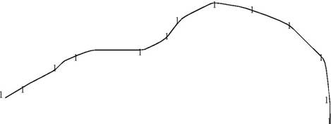

这个类可以实例化如下：

```
GeomAPI_Interpolate Interp(Points); 
```

从此对象中，可以按如下方式请求 BSpline 曲线：

```
Handle(Geom_BSplineCurve) C = Interp.Curve(); 
```

**二维近似**
Geom2dAPI 包中的 PointsToBSpline 类允许构建 2DBSpline 曲线，该曲线近似一组点。您必须定义曲线的最低和最高阶数、它的连续性和它的容差值。容差值用于检查点彼此之间是否太近，或切向向量是否太小。生成的 BSpline 曲线将是 C2 或二次连续的，除非在曲线通过的点上定义了相切约束。在这种情况下，它只会是 C1 连续的。

**3D 近似**
GeomAPI 包中的 PointsToBSpline 类允许构建一个 3D BSplinecurve，它近似于一组点。必须定义曲线的最低和最高阶数、连续性和公差。公差值用于检查点彼此之间是否太近，或者切向向量是否太小。

生成的 BSpline 曲线将是 C2 或二次连续的，除非在曲线通过的点上定义了相切约束。在这种情况下，它只会是 C1 连续的。这个类的实例化如下：

```
GeomAPI_PointsToBSpline 
Approx(Points,DegMin,DegMax,Continuity, Tol); 
```

从此对象中，可以按如下方式请求 BSpline 曲线：

```
Handle(Geom_BSplineCurve) K = Approx.Curve(); 
```

**表面近似**
GeomAPI 包中的 PointsToBSplineSurface 类允许构建一个 BSpline 表面，它近似或插入一组点。

### 高级逼近

包 AppDef 和 AppParCurves 提供低级函数，允许对近似值进行更多控制。

低级函数提供了具有以下功能的第二个 API：

- 定义逼近的强制切线。这些切线有起点和终点。
- 平行地近似一组曲线以尊重相同的参数化。
- 平滑近似。这是为了产生一个流线型的曲线。

还可以找到要计算的函数：

- 包含一组点的最小框
- 一组共面、共线或重合点的平均平面、线或点。

**通过多点约束逼近**
AppDef 包提供了低级工具，允许使用多点约束将点组并行逼近为 Bezier 或 B-Spline 曲线。

提供以下低级服务：

- 点约束数组的定义：MultiLine 类允许定义给定数量的多点约束，以构建多线，多条线通过有序的多点约束。

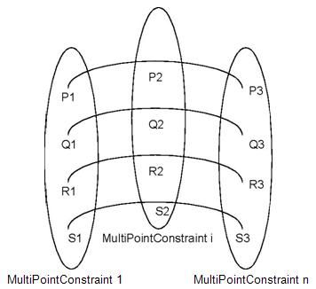

在这张图片中：

- - Pi、Qi、Ri ... Si 可以是 2D 或 3D 点。
  - 定义为一组：Pn、Qn、Rn、...Sn 形成一个 MultipointConstraint。 它们具有相同的通道、相切和曲率约束。
  - P1、P2、... Pn 或 Q、R、... 或 S 系列表示要近似的线。

- 一组点约束的定义：MultiPointConstraint 类允许定义多点约束并计算多条曲线的点集的近似值。
- 从一组点计算贝塞尔曲线的近似值：Compute 类允许将一组点逼近贝塞尔曲线
- 从一组点计算 BSpline 曲线的近似值：BSplineCompute 类允许将一组点逼近 BSpline 曲线。
- 变分标准的定义：TheVariational 类允许使用最小二乘法结合变分标准（通常是每个约束点的权重）将近似曲线平滑为给定数量的点。

**通过参数或几何约束逼近**
AppParCurves 包提供了低级工具，允许将点组并行逼近为具有参数或几何约束的 Bezier 或 B-Spline 曲线，例如要求曲线通过给定的点，或具有给定的切线或曲率一个特定的点。

使用的算法包括：
- 最小二乘法
- 在给定容差值内寻找最佳近似值。

提供以下低级服务：

- 索引与对象的关联：ConstraintCouple 类允许您将索引与对象相关联，以使用 AppDef_TheVariational 计算流线型曲线。

- 一组贝塞尔曲线近似值的定义：MultiCurve 类允许定义由多个贝塞尔曲线组成的多线的近似值。
- BSpline 曲线的一组近似的定义：MultiBSpCurve 类允许定义由多个 BSpline 曲线组成的多线的近似值。
- 构成一组点约束的点的定义：MultiPoint 类允许定义组成多线的 2D 或 3D 点组。

**示例：如何根据相切来近似曲线**
要相对于切线近似曲线，请执行以下步骤：

- 1.从一组要近似的点创建 AppDef_MultiPointConstraints 类型的对象，并使用 SetTang 方法设置相切向量。
- 2.从 AppDef_MultiPointConstraint 创建一个 AppDef_MultiLine 类型的对象。
- 3.使用 AppDef_BSplineCompute，它实例化 Approx_BSplineComputeLine 以执行近似。

## 直接构建

来自 gce、GC 和 GCE2d 包的直接构造方法提供了简化算法来构建基本几何实体，例如直线、圆和曲线。它们补充了 gp、Geom 和 Geom2d 包提供的参考定义。

gce、GCE2d 和 GC 包实现的算法很简单：没有创建由高级位置约束定义的对象（有关此主题的更多信息，请参阅 Geom2dGcc 和 GccAna，它们通过约束描述几何）。

例如，要使用 gp 包从一个点和一个半径构造一个圆，需要在创建圆之前构造轴 Ax2d。如果使用gce包，以Ox为轴，则可以直接从一个点和一个半径创建一个圆。

另一个例子是 gce_MakeCirc 类提供了一个框架，用于定义圆的几何构造中遇到的八个问题，并实现八种相关的构造算法。

创建（或实现）的对象是一种算法，可以参考它来找出，特别是：

- 它的结果是一个 gp_Circ，并且
- 它的状态。这里，状态表示构建是否成功。

如果不成功，状态会给出失败的原因。

```
gp_Pnt P1 (0.,0.,0.);
gp_Pnt P2 (0.,10.,0.);
gp_Pnt P3 (10.,0.,0.);
gce_MakeCirc MC (P1,P2,P3);
if (MC.IsDone()) {
    const gp_Circ& C = MC.Value();
}
```

此外，gce、GCE2d 和 GC 各有一个 Root 类。这个类是包中所有类的根，它返回一个状态。返回的状态（构造成功或构造错误）由枚举 gce_ErrorType 描述。

请注意，构造几何变换的类不会返回状态，因此不会从 Root 继承。

### 简单几何实体

以下用于从 gp 包构建实体的算法由 gce 包提供。

- 平行于另一条距离的二维线，
- 平行于另一个穿过一个点的二维线，
- 通过两点的二维圆，
- 平行于另一个距离的二维圆，
- 平行于另一个通过一个点的二维圆，
- 通过三个点的二维圆，
- 从中心和半径的二维圆，
- 来自五点的二维双曲线，
- 中心和两个顶点的二维双曲线，
- 五点的二维椭圆，
- 一个中心和两个顶点的二维椭圆，
- 三点的二维抛物线，
- 中心和顶点的二维抛物线，
- 通过一点的平行于另一条线，
- 通过两点的线，
- 通过一个点与另一个同轴的圆，
- 以给定距离与另一个同轴的圆，
- 通过三个点的圆，
- 圆心、半径和平面法线，
- 圆及其轴（中心 + 法线），
- 双曲线及其中心和两个顶点，
- 椭圆及其中心和两个顶点，
- 平面通过三个点，
- 从其正常平面，
- 平面平行于给定距离的另一个平面，
- 平行于另一个通过一点的平面，
- 来自一组点的平面，
- 圆柱体从给定的轴和给定的半径，
- 圆柱体从圆形底座，
- 圆柱体从三个点，
- 圆柱体以给定距离平行于另一个圆柱体，
- 圆柱平行于通过一点的另一个圆柱，
- 圆锥从四个点，
- 来自给定轴和两个通过点的锥体，
- 两个点（一个轴）和两个半径的锥体，
- 在给定距离处平行于另一个锥体，
- 圆锥平行于另一个通过一点，
- 所有变换（旋转、平移、镜像、缩放变换等）。

gp 包中的每个类，如Circ、Circ2d、Mirror、Mirror2d 等，都有相应的MakeCirc、MakeCirc2d、MakeMirror、MakeMirror2d 等来自gce 包的类。可以使用gce包类创建一个点，然后询问它以恢复相应的gp对象。

```
gp_Pnt2d Point1,Point2; 
...
//Initialization of Point1 and Point2 
gce_MakeLin2d L = gce_MakeLin2d(Point1,Point2); 
if (L.Status() == gce_Done() ){ 
  gp_Lin2d l = L.Value(); 
}
```

如果您不确定参数是否可以在不引发异常的情况下创建 gp 对象，这将很有用。 在上述情况下，如果 Point1 和 Point2 比 MakeLin2d 所需的容差值更接近，则函数 Status 将返回枚举 gce_ConfusedPoint。 这会告诉您为什么无法创建 gp 对象。 如果你知道点Point1和Point2之间的距离超过了容差值，那么你可以直接创建gp对象，如下：

```
gp_Lin2d l = gce_MakeLin2d(Point1,Point2); 
```

### 由句柄操纵的几何实体

GC 和 GCE2d 包提供了用于从 Geom 和 Geom2D 包构建实体的算法的实现。它们实现与 gce 包相同的算法，并且还包含用于修剪曲面和曲线的算法。以下算法可用：

- 由两点修剪的圆弧，
- 由两个参数修剪的圆弧，
- 一个点和一个参数修剪的圆弧，
- 由两点修剪的椭圆得到的椭圆弧，
- 由两个参数修剪的椭圆的椭圆弧，
- 一个椭圆从一个点和一个参数修剪的椭圆的弧，
- 由两点修剪的抛物线得到的抛物线弧，
- 由两个参数修剪的抛物线的抛物线弧，
- 从一个点和一个参数修剪的抛物线得到的抛物线弧，
- 由两点修剪的双曲线得到的双曲线弧，
- 由两个参数修剪的双曲线得到的双曲线弧，
- 由一个点和一个参数修剪的双曲线的双曲线弧，
- 从两点开始的线段，
- 来自两个参数的线段，
- 从一个点和一个参数开始的一条线段，
  从圆形底座和高度修剪圆柱体，
- 从三个点修剪圆柱体，
- 从轴、半径和高度修剪圆柱体，
- 从四个点修剪锥体，
- 从两点（轴）和半径修剪锥体，
- 从两个同轴圆修剪锥体。

GCE2d 包中的每个类，如 Circle、Ellipse、Mirror 等，都有相应的 Geom2d 包中的 MakeCircle、MakeEllipse、MakeMirror 等类。此外，类 MakeArcOfCircle 从 Geom2d 返回一个 TrimmedCurve 类型的对象。

GC包中的每个类，如Circle、Ellipse、Mirror等，都有对应的来自Geom包的MakeCircle、MakeEllipse、MakeMirror等类。以下类从 Geom 返回 TrimmedCurve 类型的对象：

- 制作圆弧
- 制作椭圆弧
- 制作双曲线弧
- 抛物线弧
- 制作段

## 与 BSplines 之间的转换

与 BSplines 之间的转换组件有两个不同的目的：

- 首先，它提供了可用于描述任何曲线或曲面的均质公式。这对于为单个数据结构模型编写算法很有用。 BSpline 公式可用于表示由描述几何数据结构的组件（“基本几何类型”、“2D 几何类型”和“3D 几何类型”组件）提供的最基本的几何对象。
- 其次，它可以用来将一个 BSpline 曲线或曲面分割成一系列曲线或曲面，从而提供更高程度的连续性。这对于编写需要应用它们的对象具有特定程度连续性的算法很有用。不连续性仅位于对象的边界上。

“与 BSplines 的转换”组件由三个包组成。

Convert 包提供了将以下内容转换为 BSpline 曲线或曲面的算法：

- 基于来自 gp 包的基本 2D 曲线（线、圆或圆锥）的有界曲线，
- 基于来自 gp 包的基本曲面（圆柱体、圆锥体、球体或环面）的有界曲面，
- 一系列由极点定义的相邻 2D 或 3D 贝塞尔曲线。

这些算法计算定义生成的 BSpline 曲线或曲面所需的数据。这些基本数据（度数、周期特征、极点和权重、节点和多重性）然后可以直接用于算法中，或者可以通过调用类 Geom2d_BSplineCurve、Geom_BSplineCurve 或 Geom_BSplineCurve 提供的适当构造函数来构造曲线或曲面Geom_BSplineSurface。

Geom2dConvert 包提供以下内容：

- 一个全局函数，用于从基于 Geom2d 包中的 2D 曲线的有界曲线构建 BSpline 曲线，
- 一种分裂算法，它计算应切割 2D BSpline 曲线的点，以获得具有相同连续性程度的弧，
- 用于构造由该分割算法或其他类型的 BSpline 曲线分割创建的 BSpline 曲线的全局函数，
- 一种将 2D BSpline 曲线转换为一系列相邻 Bezier 曲线的算法。

GeomConvert 包还提供以下内容：

- 一个全局函数，用于从基于 Geom 包中的曲线的有界曲线构建 BSpline 曲线，
- 一种分裂算法，它计算应该切割 BSpline 曲线的点，以获得具有相同连续性程度的弧，
- 用于构建由该分割算法或其他类型的 BSpline 曲线分割创建的 BSpline 曲线的全局函数，
- 一种算法，将 BSpline 曲线转换为一系列相邻的 Bezier 曲线，
- 一个全局函数，用于从基于 Geom 包中的表面的有界表面构造 BSpline 表面，
- 一种分裂算法，它确定应该沿着哪些曲线切割 BSpline 曲面以获得具有相同连续性程度的补丁，
- 构造由该分割算法或其他类型的 BSpline 曲面分割创建的 BSpline 曲面的全局函数，
- 一种将 BSpline 曲面转换为一系列相邻 Bezier 曲面的算法，
- 一种算法，将相邻 Bezier 曲面的网格转换为 BSpline 曲面。

## 曲线上的点

曲线上的点组件包含高级函数，为计算 2D 或 3D 曲线上的点的复杂算法提供 API。

在 3d 空间中的参数化曲线上存在以下特征点：

- 曲线上等距的点，
- 沿着具有相等弦的曲线分布的点，
- 与曲线上的另一点相距给定距离的点。

GCPnts 包提供了计算这些点的算法：

- AbscissaPoint 计算曲线上与曲线上另一点相距给定距离的点。
- UniformAbscissa 计算曲线上给定横坐标处的一组点。
- UniformDeflection 计算曲线和多边形之间最大恒定挠度处的一组点，该点由计算点产生。

**示例：可视化曲线。**
采用适配曲线 C，即一个对象，它是由 Geom2d 包中的 2D 曲线（在 Adaptor_Curve2d 曲线的情况下）或 Geom 包中的 3D 曲线（在 Adaptor_Curve 的情况下）提供的服务之间的接口曲线），以及计算算法在曲线上所需的服务。自适应曲线的创建方式如下：

2D case：

```
Handle(Geom2d_Curve) mycurve = ... ; 
Geom2dAdaptor_Curve C (mycurve) ; 
```

3D case :

```
Handle(Geom_Curve) mycurve = ... ; 
GeomAdaptor_Curve C (mycurve) ; 
```

然后用这个对象构造算法：

```
GCPnts_UniformDeflection myAlgo () ; 
Standard_Real Deflection = ... ; 
myAlgo.Initialize ( C , Deflection ) ; 
if ( myAlgo.IsDone() ) 
{
  Standard_Integer nbr = myAlgo.NbPoints() ; 
  Standard_Real param ; 
   for ( Standard_Integer i = 1 ; i <= nbr ; i++ ) 
  { 
    param = myAlgo.Parameter (i) ; 
    ...
  } 
}
```

## 极值

计算 2d 和 3d 中点、曲线和曲面之间的最小距离的类由 GeomAPI 和 Geom2dAPI 包提供。

这些包计算以下距离的极值：

- 点和曲线，
- 点和面，
- 两条曲线，
- 曲线和曲面，
- 两个表面。

**点和曲线/曲面之间的极值**
GeomAPI_ProjectPointOnCurve 类允许计算点和曲线之间的所有极值。极值是与曲线正交的线段的长度。 GeomAPI_ProjectPointOnSurface 类允许计算点和表面之间的所有极值。极值是与表面正交的线段的长度。这些类使用“投影”标准进行优化。

**曲线之间的极值**
Geom2dAPI_ExtremaCurveCurve 类允许计算两条二维几何曲线之间的所有最小距离。 GeomAPI_ExtremaCurveCurve 类允许计算两条 3D 几何曲线之间的所有最小距离。这些类使用欧几里得距离作为优化标准。

**曲线和曲面之间的极值**
GeomAPI_ExtremaCurveSurface 类允许计算 3D 曲线和曲面之间的一个极值。极值是与曲线和曲面正交的线段的长度。此类使用“投影”标准进行优化。

**曲面之间的极值**
GeomAPI_ExtremaSurfaceSurface 类允许计算两个表面之间的一个最小距离和一个最大距离。此类使用欧几里得距离来计算最小值，并使用“投影”标准来计算最大值。

# 二维几何(2D Geometry)

Geom2d 包定义了 2dspace 中的几何对象。所有几何实体都经过 STEP 处理。对象通过引用处理。

特别是，Geom2d 包提供了以下类：

- 点、向量和曲线的描述，
- 它们使用坐标系在平面中的定位，
- 它们的几何变换，通过应用平移、旋转、对称、缩放变换及其组合。

以下对象可用：

- 点，
- 笛卡尔点，
- 向量，
- 方向，
- 具有大小的向量，
- 轴，
- 曲线，
- 线，
- 圆锥：圆、椭圆、双曲线、抛物线、
- 圆角曲线：修剪曲线、NURBS 曲线、贝塞尔曲线、
- 偏移曲线。

在创建几何对象之前，有必要决定如何处理该对象。 Geom2d 包提供的对象是通过引用而不是通过值来处理的。复制实例会复制句柄，而不是对象，因此对一个实例的更改会反映在每次出现时。如果需要一组对象实例而不是单个对象实例，则可以使用 TColGeom2d 包。该包为来自 Geom2d 包的曲线提供标准和常用的一维数组和序列实例化。所有对象都有两个版本：

- 通过引用处理和
- 按值处理。

Geom2d 曲线的关键特征是它们是参数化的。每个类都提供函数来处理曲线的参数方程，特别是计算曲线上参数 u 的点和在该点处的 1、2..、N 阶导数向量。

作为参数化的结果，Geom2d 曲线是自然定向的。

参数化和方向将基本 Geom2dcurves 与 gp 包提供的等效项区分开来。 Geom2d 包提供了转换函数来将 Geom2d 对象转换为 gp 对象，反之亦然，如果可能的话。

此外，Geom2d 包提供了更复杂的曲线，包括贝塞尔曲线、BSpline 曲线、修剪曲线和偏移曲线。

Geom2d 对象根据多个级别的继承结构进行组织。

因此，椭圆（具体类Geom2d_Ellipse）也是圆锥曲线，继承自抽象类Geom2d_Conic，而贝塞尔曲线（具体类Geom2d_BezierCurve）也是有界曲线，继承自抽象类Geom2d_BoundedCurve；这两个例子也是曲线（抽象类 Geom2d_Curve）。曲线、点和向量继承自抽象类 Geom2d_Geometry，它描述了 Geom2d 包中任何几何对象的共同属性。

这种继承结构是开放的，并且可以描述从 Geom2d 包中提供的对象继承的新对象，前提是它们尊重要继承的类的行为。

最后，Geom2d 对象可以在更复杂的数据结构中共享。例如，这就是在拓扑数据结构中使用它们的原因。

Geom2dpackage 使用 gp 包的服务来：

- 实施基本代数微积分和基本解析几何，
- 描述可应用于 Geom2d 对象的几何变换，
- 描述 Geom2d 对象的基本数据结构。

然而，Geom2d 包本质上提供了数据结构而不是算法。你可以参考 GCE2d 包来找到更进化的 Geom2d 对象构造算法。

# 3D 几何

Geom 包定义了 3d 空间中的几何对象，包含所有基本的几何变换，如恒等、旋转、平移、镜像、缩放变换、变换组合等，以及取决于几何对象的参考定义的特殊功能（例如，在 B 样条曲线上添加控制点、修改曲线等）。所有几何实体都经过 STEP 处理。

特别是，它提供了以下类：

- 点、向量、曲线和曲面的描述，
- 使用轴或坐标系在 3D 空间中定位，以及
- 它们的几何变换，通过应用平移、旋转、对称、缩放变换及其组合。

以下对象可用：

- 观点
- 笛卡尔点
- 向量
- 方向
- 带大小的向量
- 轴
- 曲线
- 线
- 圆锥：圆、椭圆、双曲线、抛物线
- 偏移曲线
- 基本曲面：平面、圆柱、圆锥、球体、圆环
- 有界曲线：修剪曲线、NURBS曲线、贝塞尔曲线
- 有界曲面：矩形修剪曲面、NURBS 曲面、贝塞尔曲面
- 扫掠面：线性挤压面、旋转面
- 偏移曲面。

Geom 曲线和曲面的关键特征是它们是参数化的。每个类都提供函数来处理曲线或曲面的参数方程，特别是计算：

- 曲线上参数 u 的点，或
- 表面上参数 (u, v) 的点。连同此时的 1、2、...N 阶导数向量。

作为这种参数化的结果，几何曲线或曲面是自然定向的。

参数化和方向将基本几何曲线和曲面与 gp 包中具有相同（或相似）名称的类区分开来。 Geom 包还提供了转换函数来将 Geom 对象转换为 gp 对象，反之亦然，当这种转换可能时。

此外，Geom 包提供了更复杂的曲线和曲面，包括：

- Bezier 和 BSpline 曲线和曲面，
- 扫掠面，例如旋转面和线性挤压面，
- 修剪的曲线和曲面，以及
- 偏移曲线和曲面。

Geom 对象根据多个级别的继承结构进行组织。因此，球体（具体类 Geom_SphericalSurface）也是一个基本曲面，继承自抽象类 Geom_ElementarySurface，而贝塞尔曲面（具体类 Geom_BezierSurface）也是有界曲面，继承自抽象类 Geom_BoundedSurface；这两个例子也是表面（抽象类 Geom_Surface）。曲线、点和向量继承自抽象类 Geom_Geometry，它描述了 Geom 包中任何几何对象的共同属性。

这种继承结构是开放的，并且可以描述从 Geom 包中提供的对象继承的新对象，条件是它们尊重要继承的类的行为。

最后，Geom 对象可以在更复杂的数据结构中共享。例如，这就是在拓扑数据结构中使用它们的原因。

如果需要一组对象实例而不是单个对象实例，可以使用 TColGeom 包。该包提供了 Geom 包中曲线的一维和二维数组和序列的实例化。所有对象都有两个版本：

- 通过引用处理和
- 按值处理。

Geom 包使用 gp 包的服务来：

- 实施基本代数微积分和基本解析几何，
- 描述可应用于 Geom 对象的几何变换，
- 描述 Geom 对象的基本数据结构。

然而，Geom 包本质上提供了数据结构，而不是算法。你可以参考 GC 包来找到更进化的 Geom 对象构造算法。

# 形状的属性
## 形状的局部特性

BRepLProp 包提供了形状组件的局部属性，其中包含计算 BRep 模型中边和面的各种局部属性的算法。

可以查询的本地属性有：

- 对于支持边的曲线上的参数 u 点：
  - 点，
  - 导数向量，直到三次，
  - 切线向量，
  - 正常的，
  - 曲率和曲率中心；
- 对于支持面的表面上的参数 (u, v) 点：
  - 点，
  - 导数向量，直到二阶，
  - u 和 v 等参曲线的切向量，
  - 法向量，
  - 最小或最大曲率，以及相应的曲率方向；
- 支持一条边的曲线的连续性程度，该边由其他两条边在其连接点连接而成。

分析的边和面被描述为 BRepAdaptor 曲线和曲面，它们为形状提供了一个用于描述其几何支持的界面。局部属性的基点由曲线上的 u 参数值或曲面上的 (u, v) 参数值定义。

## 曲线和曲面的局部特性

“曲线和曲面的局部属性”组件提供了计算几何曲线（在 2D 或 3D 空间中）或表面上的各种局部属性的算法。它由以下组成：

- Geom2dLProp 包，它允许计算二维曲线上参数点的导数和切线向量（法线和曲率）；
- GeomLProp 包，提供 3D 曲线和曲面的局部属性
- LProp 包，提供用于表征二维曲线上特定点的枚举。

曲线是 Geom_Curve 曲线（在 3D 空间中）或 Geom2d_Curve 曲线（在平面中）。表面是 Geom_Surface 表面。计算局部属性的点由曲线上的 u 参数值和曲面上的 (u,v) 参数值定义。

可以查询上述点的相同局部属性，此外还可以查询 2D 曲线：

- 对应于最小或最大曲率的点；
- 拐点。

**示例：如何检查表面凹度**
要检查曲面的凹度，请执行以下操作：

- 1.对表面进行采样并计算每个点的高斯曲率。
- 2.如果曲率值的符号发生变化，则表面是凹面还是凸面，这取决于视点。
- 3.要计算高斯曲率，请使用 GeomLProp 中的类 SLprops，该类实例化 LProp 中的泛型类 SLProps 并使用 GaussianCurvature 方法。

## 曲线和曲面的连续性

GeomAbs_Shape 枚举中描述了曲线和曲面支持的连续性类型。

对于曲线，支持以下类型的连续性（见下图）：

- C0 (GeomAbs_C0) - 参数连续性。它与G0（几何连续性）相同，因此最后一个不由单独的变量表示。
- G1 (GeomAbs_G1) - 左边和右边的切向量是平行的。
- C1 (GeomAbs_C1) - 表示一阶导数的连续性。
- G2 (GeomAbs_G2) - 除了 G1 连续性之外，左右曲率中心是相同的。
- C2 (GeomAbs_C2) - 直到二阶的所有导数的连续性。
- C3 (GeomAbs_C3) - 所有导数的连续性直到三阶。
- CN (GeomAbs_CN) - 所有导数的连续性，直到 N 阶（连续性的无限阶）。

注意：几何连续性 (G1, G2) 表示曲线可以重新参数化以具有参数 (C1, C2) 连续性。

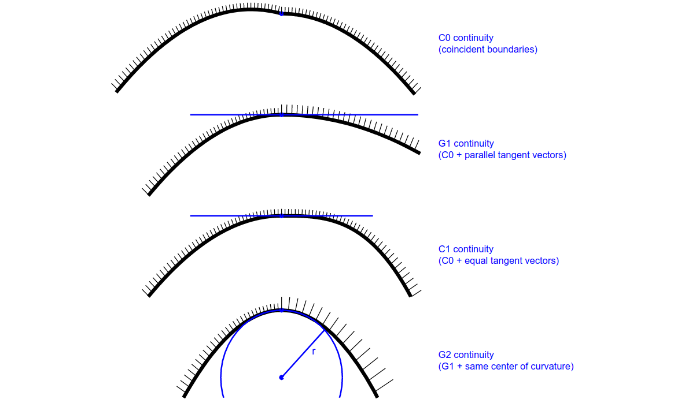

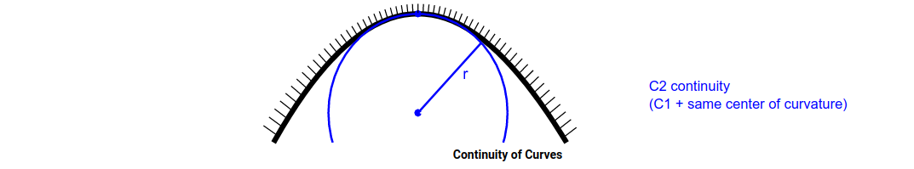

支持以下类型的表面连续性：

- C0 (GeomAbs_C0) - 参数连续性（表面没有不连续点或曲线）。
- G1 (GeomAbs_G1) - 表面的每个点都有一个切平面。
- C1 (GeomAbs_C1) - 表示一阶导数的连续性。
- G2 (GeomAbs_G2) - 除了 G1 连续性之外，主曲率和方向也是连续的。
- C2 (GeomAbs_C2) - 直到二阶的所有导数的连续性。
- C3 (GeomAbs_C3) - 所有导数的连续性直到三阶。
- CN (GeomAbs_CN) - 所有导数的连续性，直到 N 阶（连续性的无限阶）。

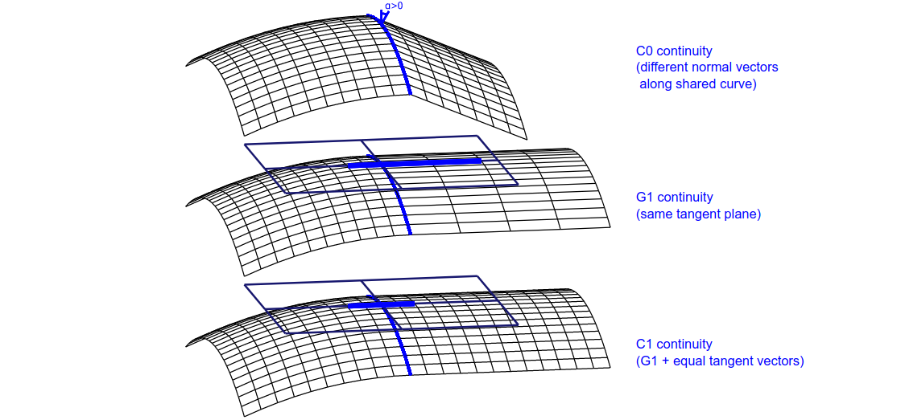

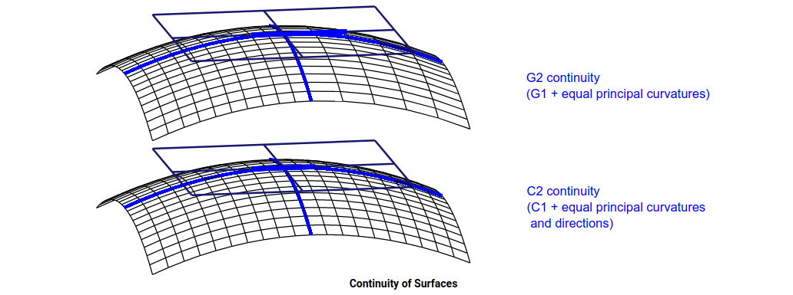

对于单个曲面，两个曲面的连接（参见上图）仅在每个交点处定义其连续性。 连接的平滑度是相交曲线上连续性的最小值。

## 共享边的规律

边的规则性是共享这条边的两个面的连接的平滑度。 换句话说，规则性是边缘上每个点的连接面之间的最小连续性。

Edge 的正则性可以通过 BRep_Builder::Continuity 方法设置。 要获得规律性，请使用 BRep_Tool::Continuity 方法。

一些算法（如 Fillet）通过自己的算法设置生成边缘的规则性。 另一方面，其他一些算法（如布尔运算、形状修复等）没有设置规律性。 如果需要在形状上正确设置正则性，可以使用 BRepLib::EncodeRegularity 方法。 它为形状的所有边缘计算并设置正确的值。

规则标志被以下高级算法广泛使用：倒角、拔模角、隐藏线去除、胶合。

## 形状的全局属性
形状的全局属性组件提供了计算 3D 空间中复合几何系统的全局属性的算法，以及查询计算结果的框架。

为系统计算的全局属性是：

- 大量的，
- 质心，
- 惯性矩阵，
- 绕轴的力矩，
- 绕轴的回转半径，
- 惯性的主要属性，例如主轴、主要力矩和主要回转半径。

几何系统通常定义为形状。根据分析它们的方式，这些形状将提供以下属性：

- 从形状的边缘诱导的线条，
- 从形状的面诱导的曲面，或
- 从以形状为边界的实体产生的体积。

几个系统的全局属性可以组合在一起，给出由所有单独系统的总和组成的系统的全局属性。

形状组件的全局属性由以下部分组成：

- 用于计算形状全局属性的七个函数：一个用于线的函数，两个用于曲面的函数和四个用于体积的函数。函数的选
- 择取决于用于计算的输入参数和算法（BRepGProp 全局函数），
- 用于计算一组点的全局属性的框架（GProp_PGProps），
- 一个通用框架将几个更基本的框架保留的全局属性集合在一起，并提供一个通用的编程接口来查询计算的全局属性。

包 GeomLProp 和 Geom2dLProp 提供计算曲线和曲面局部特性的算法

曲线（对于一个参数）具有以下局部属性：

- 点
- 衍生物
- 切线
- 普通的
- 曲率
- 曲率中心。

表面（对于两个参数 U 和 V）具有以下局部属性：

- 点
- U 和 V 的导数）
- 切线（对于 U 和 V）
- 普通的
- 最大曲率
- 最小曲率
- 主要曲率方向
- 平均曲率
- 高斯曲率

可以使用以下方法：

- CLProps – 计算曲线的局部属性（切线、曲率、法线）；
- CurAndInf2d – 计算二维曲线的最大和最小曲率和拐点；
- SLProps – 计算表面的局部属性（相切、法线和曲率）。
- 连续性——计算两条曲线交汇处的规律性。

请注意，接受 B 样条曲线和曲面，但不会将它们切成所需连续性的部分。这是全局的连续性，这是可见的。

## 曲线和曲面适配器
一些 Open CASCADE Technology 的通用算法理论上可能适用于多种类型的曲线或曲面。

为此，他们只需通过一个接口即可获得分析曲线或曲面所需的服务，从而获得单个 API，无论曲线或曲面的类型如何。这些接口称为适配器。

例如，Adaptor3d_Curve 是一个抽象类，它通过使用任何 3d 曲线的算法提供所需的服务。

GeomAdaptor 包提供了接口：

- 在几何曲线上；
- 在几何曲面上的曲线上；
- 在几何表面上；

Geom2dAdaptor 包提供了接口：

- 在 Geom2d 曲线上。

BRepAdaptor 包提供了接口：

- 在面上
- 在边上

当编写对几何对象进行操作的算法时，请使用 Adaptor3d（或 Adaptor2d）对象。因此，如果为此对象提供从 Adaptor3d 或 Adaptor2d 派生的接口，则可以将该算法用于任何类型的对象。这些接口很容易使用：简单地从 Geom2d 曲线创建一个适配的曲线或曲面，然后使用这个适配的曲线作为算法的参数？这需要它。

# 拓扑

OCCT 拓扑允许访问和操作对象的数据，而无需处理它们的 2D 或 3D 表示。 OCCT 几何根据坐标或参数值提供对象的描述，而拓扑则描述参数空间中对象的数据结构。这些描述使用了该空间部分的位置和限制。

拓扑库允许您构建纯拓扑数据结构。拓扑定义了简单几何实体之间的关系。通过这种方式，您可以将复杂形状建模为更简单实体的组件。由于内置的非流形（或混合维度）功能，您可以构建混合模型：

- 0D 实体，例如点；
- 一维实体，如曲线；
- 2D 实体，例如曲面；
- 3D 实体，例如体积。

例如，您可以表示由多个不同实体组成的单个对象，其中包含连接或不连接到外部边界的嵌入曲线和曲面。

抽象拓扑数据结构描述了一个基本实体——形状，它可以分为以下组件拓扑：

- 顶点——对应于几何中一个点的零维形状；
- Edge – 与曲线对应的形状，并在每个末端由一个顶点约束；
- Wire – 由顶点连接的一系列边；
- 面 – 由闭合线包围的平面（在 2D 几何中）或表面（在 3D 几何中）的一部分；
- 壳 - 由其线边界的某些边缘连接的面的集合；
- 实体——由壳包围的 3D 空间的一部分；
- 复合固体——固体的集合。

线和实体可以是无限的或封闭的。

具有 3D 底层几何图形的面也可以指近似于底层表面的连接三角形的集合。表面可以是未定义的，只留下三角形表示的面。如果是这样，模型就是纯粹的多面体。

拓扑定义了简单几何实体之间的关系，因此可以将它们链接在一起以表示复杂的形状。

Abstract Topology 由六个包提供。前三个包描述了 Open CASCADE 技术中使用的拓扑数据结构：

- TopAbs 包为拓扑驱动的应用程序提供通用资源。它包含用于描述基本拓扑概念的枚举：拓扑形状、方向和状态。它还提供了管理这些枚举的方法。
- TopLoc 包提供了处理 3D 局部坐标系的资源：Datum3D 和位置。 Datum3D 描述了一个基本坐标系，而 Location 包含一系列基本坐标系。
- TopoDS 包描述了用于建模和构建纯拓扑数据结构的类。

三个额外的包提供了访问和操作这个抽象拓扑的工具：

- TopTools 包提供了用于拓扑数据结构的基本工具。
- TopExp 包提供了用于探索和操作 TopoDS 包中描述的拓扑数据结构的类。
- BRepTools 包提供了用于探索、操作、读取和写入 BRep 数据结构的类。这些更复杂的数据结构将拓扑描述与附加几何信息相结合，并包括用于评估同一对象（例如，一个点）的不同可能表示的等效性的规则。

## 形状位置

局部坐标系可以被视为以下任一种：

- 具有原点和三个正交向量的右手三面体。 gp_Ax2 包对应于这个定义。
- +1 行列式的变换，允许在局部和全局参考系之间变换坐标。 这对应于 gp_Trsf。

TopLoc 包区分了两个概念：

- TopLoc_Datum3D 类提供基本参考坐标，由右手坐标轴正交系统或右手酉变换表示。
- TopLoc_Location 类提供由基本坐标构成的复合参考坐标。 它是一个由一系列对基本标记的引用组成的标记。 存储产生的累积变换以避免重新计算整个列表的变换总和。

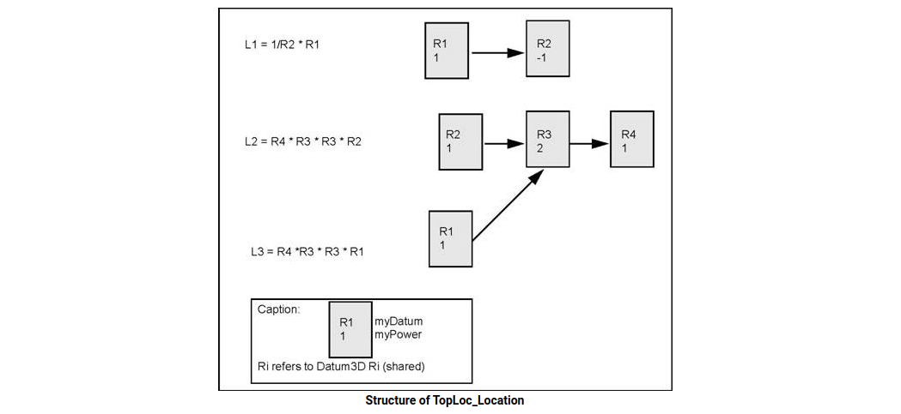

如果两个参考坐标由相同的基本坐标以相同的顺序组成，则它们相等。 没有数字比较。 因此，如果两个坐标不是从相同的基本坐标构建的，则它们可以对应于相同的变换而不相等。

例如，考虑三个基本坐标：R1、R2、R3 复合坐标为：C1 = R1 \* R2，C2 = R2 \* R3 C3 = C1 \* R3 C4 = R1 \* C2

注意 C3 和 C4 相等，因为它们都是 R1 \* R2 \* R3。

TopLoc 包主要针对拓扑数据结构，但也可以用于其他目的。

**坐标变化**
TopLoc_Datum3D 类表示基本坐标的变化。 必须共享此类更改，以便此类从 Standard_Transient 继承。 坐标由转换 gp_Trsfpackage 表示。 这种转换没有比例因子。

## 命名形状、子形状、它们的方向和状态
TopAbs 包提供了描述拓扑的基本概念和处理这些枚举的方法的一般枚举。它不包含任何类。这个包已经与拓扑的其余部分分开，因为它包含的概念足够通用，可以被所有拓扑工具使用。这通过保持独立于建模资源来避免重新定义枚举。 TopAbs 包定义了三个概念：

- 类型 TopAbs_ShapeEnum;
- 方向 TopAbs_Orientation ;
- 状态 StateTopAbs_State

### 拓扑类型

TopAbs 包含 TopAbs_ShapeEnum 枚举，它列出了不同的拓扑类型：

- COMPOUND – 一组任何类型的拓扑对象。
- COMPSOLID – 复合实体是一组由它们的面连接的实体。它将 WIRE 和 SHELL 的概念扩展到实体。
- SOLID – 受壳限制的空间的一部分。它是三维的。
- SHELL – 一组由边缘连接的面。外壳可以是打开的或关闭的。
- FACE – 在 2D 中，它是平面的一部分；在 3D 中，它是表面的一部分。其几何形状受轮廓约束（修剪）。它是二维的。
- WIRE – 一组由它们的顶点连接的边。根据边缘是否链接，它可以是开放或封闭的轮廓。
- EDGE – 对应于约束曲线的拓扑元素。边通常受顶点限制。它有一个维度。
- VERTEX – 对应于一个点的拓扑元素。它的维度为零。
- 形状 – 涵盖上述所有内容的通用术语。

拓扑模型可以被视为具有邻接关系的对象图。在 2D 或 3D 空间中对零件建模时，它必须属于 ShapeEnum 枚举中列出的类别之一。 TopAbs 包列出了可以在任何模型中找到的所有对象。它不能扩展，但可以使用子集。例如，实体的概念在 2D 中是无用的。

枚举项按从最复杂到最简单的顺序出现，因为对象可以在其描述中包含更简单的对象。例如，面参考其线、边和顶点。

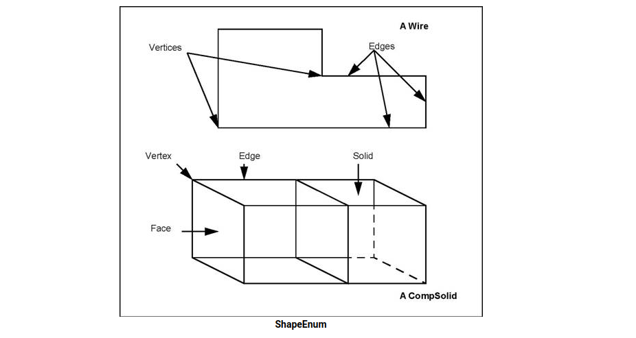

### 方向

方向的概念由 TopAbs_Orientation 枚举表示。方向是在各种建模者中发现的方向感的广义概念。这在形状限制几何域时使用；并且与边界的概念密切相关。这三种情况如下：

- 由顶点限制的曲线。
- 由边限制的表面。
- 一张脸限制了空间。

在每种情况下，用作更高维度几何域边界的拓扑形式定义了两个局部区域，其中一个被任意视为默认区域。

对于由顶点限制的曲线，默认区域是参数大于顶点的点集。也就是说它是沿着曲线的自然方向在顶点之后的曲线部分。

对于受边限制的表面，默认区域位于边沿其自然方向的左侧。更准确地说，它是曲面的法向量与曲线的切线向量的向量乘积所指向的区域。

对于受面限制的空间，默认区域位于表面法线的负侧。

基于此默认区域，方向允许定义要保留的区域，称为内部或材料。有四个方向定义了内部。

| Orientation | Description                                                  |
| ----------- | ------------------------------------------------------------ |
| FORWARD     | The interior is the default region.内部是默认区域。          |
| REVERSED    | The interior is the region complementary to the default.内部是与默认值互补的区域。 |
| INTERNAL    | The interior includes both regions. The boundary lies inside the material. For example a surface inside a solid.内部包括两个区域。 边界位于材料内部。 例如，固体内的表面。 |
| EXTERNAL    | The interior includes neither region. The boundary lies outside the material. For example an edge in a wire-frame model.内部不包括任何区域。 边界位于材料之外。 例如，线框模型中的边。 |

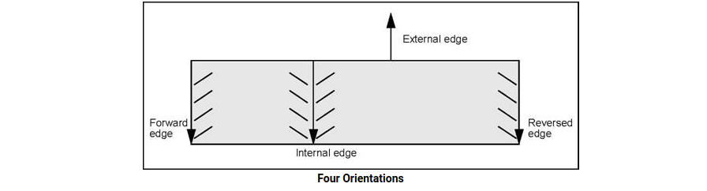

方向的概念是一个非常普遍的概念，它可以用于出现区域或边界的任何上下文。 因此，例如，在描述边缘和轮廓的交点时，不仅可以描述交点的顶点，还可以描述边缘如何与将其视为边界的轮廓相交。 因此，边缘将分为两个区域：外部和内部，相交顶点将是边界。 因此，方向可以与相交顶点相关联，如下图所示：

| Orientation | Association           |
| ----------- | --------------------- |
| FORWARD     | Entering              |
| REVERSED    | Exiting               |
| INTERNAL    | Touching from inside  |
| EXTERNAL    | Touching from outside |

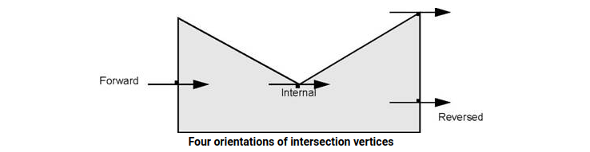

与 Orientation 枚举一起，TopAbs 包定义了四种方法：

### 状态
TopAbs_State 枚举描述了一个顶点或一组顶点相对于区域的位置。 有四个术语：

| Position | Description                                     |
| -------- | ----------------------------------------------- |
| IN       | The point is interior.                          |
| OUT      | The point is exterior.                          |
| ON       | The point is on the boundary(within tolerance). |
| UNKNOWN  | The state of the point is indeterminate.        |

引入了 UNKNOWN 术语是因为此枚举通常用于表示可能失败的计算结果。 当无法知道一个点是在里面还是外面时，可以使用这个术语，比如一个开放的线或面。

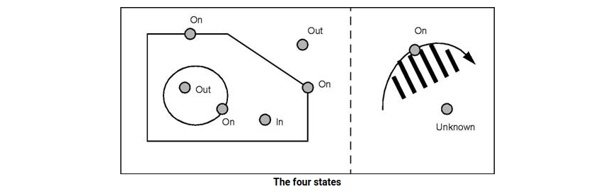

State 枚举还可用于指定对象的各个部分。 下图显示了与面相交的边的部分。

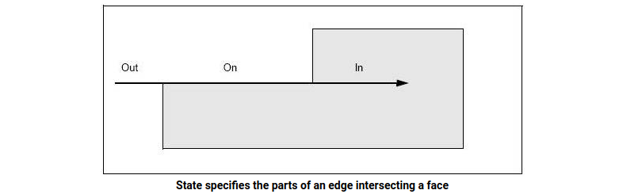

State specifies the parts of an edge intersecting a face : 状态指定与面相交的边的部分

## 操作形状和子形状

TopoDS 包描述了具有以下特征的拓扑数据结构：

- 对既没有方向也没有位置的抽象形状的引用。
- 通过工具类访问数据结构。

如上所述，OCCT 拓扑描述了参数空间中对象的数据结构。这些描述使用了该空间部分的本地化和限制。可以用这些术语来描述的形状类型是顶点、面和形状。顶点是根据参数空间中的定位来定义的，而脸和形状则是根据该空间的限制来定义的。

OCCT 拓扑描述还允许将这些术语中定义的简单形状组合成集合。例如，一组边形成一条线；一组面形成一个壳，一组实体形成一个复合实体（Open CASCADE Technology 中的 CompSolid）。还可以将任一类型的形状组合成化合物。最后，可以为形状指定方向和位置。

按照从顶点到复合实体的复杂性顺序列出形状，我们将数据结构的概念理解为如何将形状分解为一组更简单的形状的知识。这实际上就是 TopoDS 包的目的。

形状的模型是一种可共享的数据结构，因为它可以被其他形状使用。 （一条边可以被实体的多个面使用）。通过引用处理可共享的数据结构。当简单参考不足时，添加两条信息：方向和局部坐标参考。

- 方向说明如何在边界中使用参考形状（TopAbs 的方向）。
- 局部参考坐标（来自 TopLoc 的位置）允许在与其定义不同的位置引用形状。

TopoDS_TShape 类是所有形状描述的根。它包含一个形状列表。如有必要，继承 TopoDS_TShape 的类可以携带几何域的描述（例如，与 TVertex 关联的几何点）。 TopoDS_TShape 是对其定义参考系中的形状的描述。这个类是通过引用来操作的。

TopoDS_Shape 类描述了对形状的引用。它包含对底层抽象形状、方向和局部参考坐标的引用。这个类是由值操作的，因此不能共享。

表示底层抽象形状的类永远不会被直接引用。 TopoDS_Shape 类始终用于引用它。

特定于每个形状的信息（几何支持）总是通过继承添加到从 TopoDS_TShape 派生的类中。下图显示了由边连接的两个面形成的壳的示例。

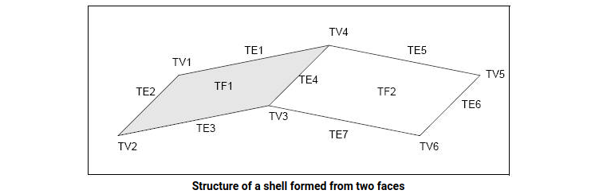

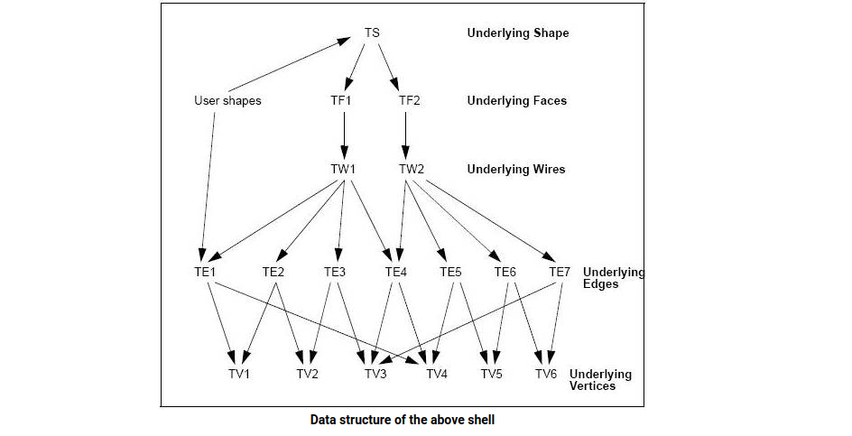

在上图中，壳由底层形状 TS 描述，面由 TF1 和 TF2 描述。从 TE1 到 TE7 有七个边，从 TV1 到 TV6 有六个顶点。

导线 TW1 参考从 TE1 到 TE4 的边； TW2 参考从 TE4 到 TE7。

顶点由边参考如下：TE1(TV1,TV4), TE2(TV1,TV2), TE3(TV2,TV3), TE4(TV3,TV4), TE5(TV4,TV5), TE6(T5,TV6) ),TE7(TV3,TV6)。

请注意，此数据结构不包含任何反向引用。所有参考都从更复杂的底层形状到不太复杂的形状。用于访问信息的技术将在后面描述。数据结构尽可能紧凑。子对象可以在不同对象之间共享。

两个非常相似的对象，可能是同一对象的两个版本，可能共享相同的子对象。在数据结构中使用局部坐标允许共享重复子结构的描述。

紧凑的数据结构避免了与复制操作相关的信息丢失，复制操作通常用于创建对象的新版本或应用坐标更改。

下图显示了包含两个版本的实体的数据结构。第二个版本展示了一系列在不同位置钻孔的相同孔。数据结构紧凑，但保留了子元素的所有信息。

从 TSh2 到下伏面 TFcyl 的三个参考具有相关的局部坐标系，它们对应于孔的连续位置。

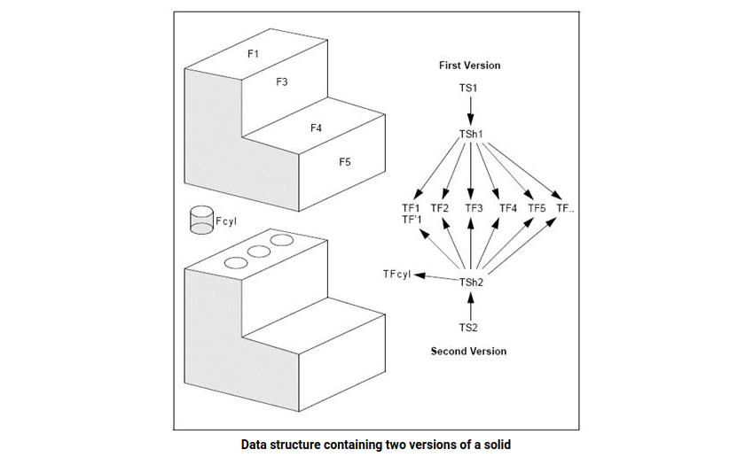

### 继承 TopoDS_Shape 的类
TopoDS 基于类 TopoDS_Shape 和定义其基础形状的类。这有一定的优点，但主要的缺点是这些类太通用了。它们可以表示的不同形状不会输入它们（顶点、边等），因此不可能引入检查以避免不连贯，例如在边中插入面。

TopoDS 包提供两组类，一组继承没有方向和位置的底层形状，另一组继承 TopoDS_Shape，代表 TopAbs 包中列举的标准拓扑形状。

以下类继承 Shape ：TopoDS_Vertex、TopoDS_Edge、TopoDS_Wire、TopoDS_Face、TopoDS_Shell、TopoDS_Solid、TopoDS_CompSolid 和 TopoDS_Compound。尽管名称与从 TopoDS_TShape 继承的名称相似，但它们的使用方式却有很大不同。

TopoDS_Shape 类和从它继承的类是操作拓扑对象的自然方法。 TopoDS_TShape 类是隐藏的。 TopoDS_TShape 在其原始局部坐标系中描述了一个没有方向的类。 TopoDS_Shape 是对具有方向和局部参考的 TopoDS_TShape 的参考。

TopoDS_TShape 类被推迟； TopoDS_Shape 类不是。使用 TopoDS_Shape 类允许在不知道其类型的情况下操作拓扑对象。它是一种通用形式。纯拓扑算法通常使用 TopoDS_Shape 类。

TopoDS_TShape 类通过引用进行操作； TopoDS_Shape 类按值。 TopoDS_Shape 只不过是通过方向和局部坐标增强的参考。 TopoDS_Shapes 的共享是没有意义的。重要的是底层 TopoDS_TShapes 的共享。参数中的赋值或传递不会复制数据结构：这只会创建引用相同 TopoDS_TShape 的新 TopoDS_Shape。

尽管继承 TopoDS_TShape 的类用于添加额外信息，但不应在继承自 TopoDS_Shape 的类中添加额外字段。从 TopoDS_Shape 继承的类仅用于专门化引用，以便从静态类型控制（由编译器执行）中受益。例如，对于编译器来说，接收 TopoDS_Face 参数的例程比接收 TopoDS_Shape 的例程更精确。派生其他类而不是在 TopoDS 中找到的类是没有意义的。对拓扑数据结构的所有引用都是通过在 TopoDS 中定义的 Shape 类及其继承者进行的。

从 TopoDS_Shape 类继承的类没有构造函数，否则类型控制将通过隐式转换消失（C++ 的一个特性）。 TopoDS 包提供了用于在这些子类之一中转换 TopoDS_Shape 类的对象的包方法，并带有类型验证。

以下示例显示了接收 TopoDS_Shape 类型参数的例程，然后将其放入变量 V（如果它是顶点）或调用 ProcessEdge 方法（如果它是边）。

```c++
#include <TopoDS_Vertex.hxx> 
#include <TopoDS_Edge.hxx> 
#include <TopoDS_Shape.hxx> 
void ProcessEdge(const TopoDS_Edge&); 
void Process(const TopoDS_Shape& aShape) { 
  if (aShape.Shapetype() == TopAbs_VERTEX) { 
    TopoDS_Vertex V; 
    V = TopoDS::Vertex(aShape); // Also correct 
    TopoDS_Vertex V2 = aShape; // Rejected by the compiler 
    TopoDS_Vertex V3 = TopoDS::Vertex(aShape); // Correct 
  } 
  else if (aShape.ShapeType() == TopAbs_EDGE){ 
    ProcessEdge(aShape) ; // This is rejected 
    ProcessEdge(TopoDS::Edge(aShape)) ; // Correct 
  } 
  else { 
    cout <<"Neither a vertex nor an edge ?"; 
    ProcessEdge(TopoDS::Edge(aShape)) ; 
    // OK for compiler but an exception will be raised at run-time 
  }
} 
```

## 拓扑数据结构探索
TopExp 包提供了用于探索由 TopoDS 包描述的数据结构的工具。 探索拓扑结构意味着找到给定类型的所有子对象，例如，找到实体的所有面。

TopExp 包提供了类 TopExp_Explorer 来查找给定类型的所有子对象。 资源管理器构建于：

- 要探索的形状。
- 要找到的形状类型，例如 VERTEX、EDGE，但 SHAPE 除外，这是不允许的。
- 要避免的形状类型。 例如 壳，边缘。 默认情况下，此类型为 SHAPE。 此默认值意味着对探索没有限制。

资源管理器访问整个结构，以找到未包含在要避免的类型中的请求类型的形状。 下面的例子展示了如何找到形状 S 中的所有面：

```C++
void test() { 
  TopoDS_Shape S; 
  TopExp_Explorer Ex; 
  for (Ex.Init(S,TopAbs_FACE); Ex.More(); Ex.Next()) { 
    ProcessFace(Ex.Current()); 
  } 
} 
```

找出所有不在边上的顶点

```C++
for (Ex.Init(S,TopAbs_VERTEX,TopAbs_EDGE); ...) 
```

查找 SHELL 中的所有面，然后查找不在 SHELL 中的所有面：

```C++
void test() { 
  TopExp_Explorer Ex1, Ex2; 
  TopoDS_Shape S; 
  for (Ex1.Init(S,TopAbs_SHELL);Ex1.More(); Ex1.Next()){ 
    // visit all shells 
    for (Ex2.Init(Ex1.Current(),TopAbs_FACE);Ex2.More(); 
      Ex2.Next()){ 
      //visit all the faces of the current shell 
      ProcessFaceinAshell(Ex2.Current()); 
      ... 
    } 
  } 
  for(Ex1.Init(S,TopAbs_FACE,TopAbs_SHELL);Ex1.More(); Ex1.Next()){ 
    // visit all faces not ina shell. 
    ProcessFace(Ex1.Current()); 
  }
}
```

Explorer 假定对象仅包含相同或次等类型的对象。 例如，如果搜索面，它不会查看线、边或顶点以查看它们是否包含面。

TopExp 包中的 MapShapes 方法允许填充地图。 如果一个对象被多次引用，则使用 Explorer 类的探索可以多次访问该对象。 例如，实体的边通常由两个面参考。 要仅处理对象一次，必须将它们放置在 Map 中。

**例子**

```C++
void TopExp::MapShapes (const TopoDS_Shape& S, 
            const TopAbs_ShapeEnum T, 
            TopTools_IndexedMapOfShape& M) 
{ 
  TopExp_Explorer Ex(S,T); 
  while (Ex.More()) { 
    M.Add(Ex.Current()); 
    Ex.Next(); 
  }
}
```

在以下示例中，对象的所有面和所有边都根据以下规则绘制：

- 面由具有 FaceIsoColor 颜色的 NbIso 等参线网络表示。
- 边以一种颜色绘制，表示共享边的面数：
  - FreeEdgeColor 用于不属于面的边缘（即线框元素）。
  - BorderEdgeColor 用于属于单个面的边缘。
  - SharedEdgeColor 用于属于多个面的边。
- 方法 DrawEdge 和 DrawFaceIso 也可用于显示单独的边和面。

执行以下步骤：

- 1.将边存储在地图中并并行创建一个整数数组来计算共享边的面数。 这个数组被初始化为零。
- 2.探索面孔。 每张脸都是画出来的。
- 3.探索边缘并为每个边缘增加阵列中面的计数器。
- 4.从边的地图中，用与面数对应的颜色绘制每条边。

```C++
void DrawShape ( const TopoDS_Shape& aShape, 
const Standard_Integer nbIsos, 
const Color FaceIsocolor, 
const Color FreeEdgeColor, 
const Color BorderEdgeColor, 
const Color SharedEdgeColor) 
{ 
  // Store the edges in aMap. 
  TopTools_IndexedMapOfShape edgemap; 
  TopExp::MapShapes(aShape,TopAbs_EDGE,edgeMap); 
  // Create an array set to zero. 
  TColStd_Array1OfInteger faceCount(1,edgeMap.Extent()); 
  faceCount.Init (0); 
  // Explore the faces. 
  TopExp_Explorer expFace(aShape,TopAbs_FACE); 
  while (expFace.More()) { 
    //Draw the current face. 
    DrawFaceIsos(TopoDS::Face(expFace.Current()),nbIsos,FaceIsoColor); 
    // Explore the edges ofthe face. 
    TopExp_Explorer expEdge(expFace.Current(),TopAbs_EDGE); 
    while (expEdge.More()) { 
      //Increment the face count for this edge. 
      faceCount(edgemap.FindIndex(expEdge.Current()))++; 
      expEdge.Next(); 
    } 
    expFace.Next(); 
  } 
  //Draw the edges of theMap 
  Standard_Integer i; 
  for (i=1;i<=edgemap.Extent();i++) { 
    switch (faceCount(i)) { 
      case 0 : 
      DrawEdge(TopoDS::Edge(edgemap(i)),FreeEdgeColor); 
      break; 
      case 1 : 
      DrawEdge(TopoDS::Edge(edgemap(i)),BorderEdgeColor); 
      break; 
      default : 
      DrawEdge(TopoDS::Edge(edgemap(i)),SharedEdgeColor); 
      break; 
    }
  } 
} 
```

## 形状列表和地图

TopTools 包包含用于利用 TopoDS 数据结构的工具。 它是 TCollection 包中的工具与 TopoDS 的 Shape 类的实例化。

- TopTools_Array1OfShape、HArray1OfShape – 使用 TopoDS_Shape 实例化 TCollection_Array1 和 
- TCollection_HArray1。
- TopTools_SequenceOfShape – 使用 TopoDS_Shape 实例化 TCollection_Sequence。
- TopTools_MapOfShape - TCollection_Map 的实例化。 允许构建多组形状。
- TopTools_IndexedMapOfShape - TCollection_IndexedMap 的实例化。 允许构建形状表和其他数据结构。

使用 TopTools_Map，可以保留一组对形状的引用而不会重复。 以下示例将数据结构的大小计算为 TShape 的数量。

```C++
#include <TopoDS_Iterator.hxx> 
Standard_Integer Size(const TopoDS_Shape& aShape) 
{ 
  // This is a recursive method. 
  // The size of a shape is1 + the sizes of the subshapes. 
  TopoDS_Iterator It; 
  Standard_Integer size = 1; 
  for (It.Initialize(aShape);It.More();It.Next()) { 
    size += Size(It.Value()); 
  } 
  return size; 
} 
```

如果数据结构中存在共享，则该程序是不正确的。

因此，对于四边的轮廓，它应该计算 1 条线 + 4 条边 + 4 个顶点，结果为 9，但由于每个顶点由两条边共享，该程序将返回 13。一种解决方案是将所有形状放在地图中 以避免将它们计算两次，如下例所示：

```C++
#include <TopoDS_Iterator.hxx> 
#include <TopTools_MapOfShape.hxx> 
void MapShapes(const TopoDS_Shape& aShape, 
TopTools_MapOfShape& aMap)
{ 
  //This is a recursive auxiliary method. It stores all subShapes of aShape in a Map.
  if (aMap.Add(aShape)) { 
    //Add returns True if aShape was not already in the Map. 
    TopoDS_Iterator It; 
    for (It.Initialize(aShape);It.More();It.Next()){ 
      MapShapes(It.Value(),aMap); 
    } 
  } 
}
Standard_Integer Size(const TopoDS_Shape& aShape) 
{ 
  // Store Shapes in a Mapand return the size. 
  TopTools_MapOfShape M; 
  MapShapes(aShape,M); 
  return M.Extent();
}
```

注意 有关 Maps 的更多详细信息，请参阅 TCollection 文档（基础类参考手册）。

下面的示例编写了一个使用 IndexedMap 复制数据结构的程序。 副本是一个相同的结构，但它与原件没有任何共享。 主要算法如下：

- 结构中的所有形状都放入一个 IndexedMap。
- 与地图并行创建形状表以接收副本。
- 使用辅助递归函数复制结构，该函数从映射复制到数组。

```C++
#include <TopoDS_Shape.hxx> 
#include <TopoDS_Iterator.hxx> 
#include <TopTools_IndexedMapOfShape.hxx> 
#include <TopTools_Array1OfShape.hxx> 
#include <TopoDS_Location.hxx> 
TopoDS_Shape Copy(const TopoDS_Shape& aShape, 
const TopoDS_Builder& aBuilder) 
{ 
  // Copies the wholestructure of aShape using aBuilder. 
  // Stores all thesub-Shapes in an IndexedMap. 
  TopTools_IndexedMapOfShape theMap; 
  TopoDS_Iterator It; 
  Standard_Integer i; 
  TopoDS_Shape S; 
  TopLoc_Location Identity; 
  S = aShape; 
  S.Location(Identity); 
  S.Orientation(TopAbs_FORWARD); 
  theMap.Add(S); 
  for (i=1; i<= theMap.Extent(); i++) { 
    for(It.Initialize(theMap(i)); It.More(); It.Next()) { 
      S=It.Value(); 
      S.Location(Identity); 
      S.Orientation(TopAbs_FORWARD); 
      theMap.Add(S); 
    }
  } 
} 
```

在上面的示例中，索引 i 是 Map 中未处理的第一个对象的索引。 当我达到与地图相同的大小时，这意味着一切都已得到处理。 处理包括在 Map 中插入所有子对象，如果它们尚未在 Map 中，则将它们插入一个大于 i 的索引。

请注意，对象插入时带有设置为标识的本地参考和 FORWARD 方向。 只有底层的 TShape 是非常有趣的。

```C++
//Create an array to store the copies. 
TopTools_Array1OfShapetheCopies(1,theMap.Extent());
// Use a recursivefunction to copy the first element. 
void AuxiliaryCopy (Standard_Integer, 
const TopTools_IndexedMapOfShape &, 
TopTools_Array1OfShape &, 
const TopoDS_Builder&); 
AuxiliaryCopy(1,theMap,theCopies,aBuilder); 
// Get the result with thecorrect local reference and orientation. 
S = theCopies(1); 
S.Location(aShape.Location()); 
S.Orientation(aShape.Orientation()); 
return S; 
```

下面是辅助函数，它将秩为 i 的元素从映射复制到表中。 此方法检查对象是否已被复制； 如果未复制，则在表中执行空复制，并通过在映射中查找它们的等级来插入所有子元素的副本。

```C++
void AuxiliaryCopy(Standard_Integer index, 
const TopTools_IndexedMapOfShapes& sources, 
TopTools_Array1OfShape& copies, 
const TopoDS_Builder& aBuilder) 
{ 
  //If the copy is a null Shape the copy is not done. 
  if (copies(index).IsNull()) { 
    copies(index) =sources(index).EmptyCopied(); 
    //Insert copies of the sub-shapes. 
    TopoDS_Iterator It; 
    TopoDS_Shape S; 
    TopLoc_Location Identity; 
    for(It.Initialize(sources(index)),It.More(), It.Next ()) {
      S = It.Value(); 
      S.Location(Identity); 
      S.Orientation(TopAbs_FORWARD); 
      AuxiliaryCopy(sources.FindIndex(S),sources,copies,aBuilder); 
      S.Location(It.Value().Location());S.Orientation(It.Value().Orientation()); aBuilder.Add(copies(index),S);
    }
  }
}
```

### Wire Explorer

BRepTools_WireExplorer 类可以按连接顺序访问连线的边缘。

例如，在图像中的电线中，我们希望按照 {e1, e2, e3,e4, e5} 的顺序恢复边缘：

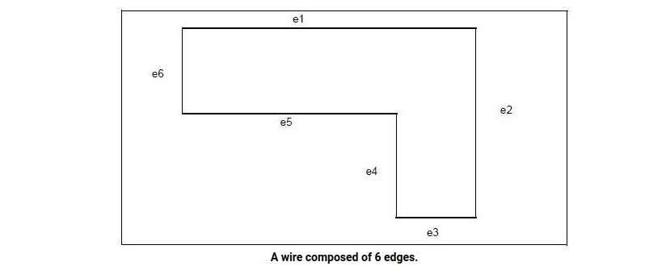

然而，TopExp_Explorer 以任何顺序恢复线条。

```C++
TopoDS_Wire W = ...; 
BRepTools_WireExplorer Ex; 
for(Ex.Init(W); Ex.More(); Ex.Next()) { 
  ProcessTheCurrentEdge(Ex.Current()); 
  ProcessTheVertexConnectingTheCurrentEdgeToThePrevious 
  One(Ex.CurrentVertex()); 
} 
```

## 形状的存储

BRepTools 和 BinTools 包包含 Read 和 Write 方法，允许从流或文件读取和写入形状。 BRepTools 包提供的方法使用 ASCII 存储格式； BinTools 包使用二进制格式。 这些方法中的每一个都有两个参数：

- 要读取/写入的 TopoDS_Shape 对象；
- 要读取/写入的流对象或文件名。

以下示例代码从 ASCII 文件中读取形状并将其写入二进制文件：

```C++
TopoDS_Shape aShape;
if (BRepTools::Read (aShape, "source_file.txt")) {
  BinTools::Write (aShape, "result_file.bin");
}
```

# 边界框
许多 OCCT 算法中都使用了边界框。 最常见的用途是作为一个过滤器，避免检查形状对之间的过度干扰（检查边界框之间的干扰比形状之间简单得多，如果它们不干扰，那么搜索相应形状之间的干扰就没有意义）。 通常，边界框可以分为两种主要类型：

- 轴对齐边界框 (AABB) 是边缘平行于世界坐标系 (WCS) 轴的框；
- 定向 BndBox (OBB) 在其自己的坐标系中定义，可以相对于 WCS 旋转。 事实上，AABB 是 OBB 的一个特例。

下图说明了使用 OBB 优于 AABB 时的示例。

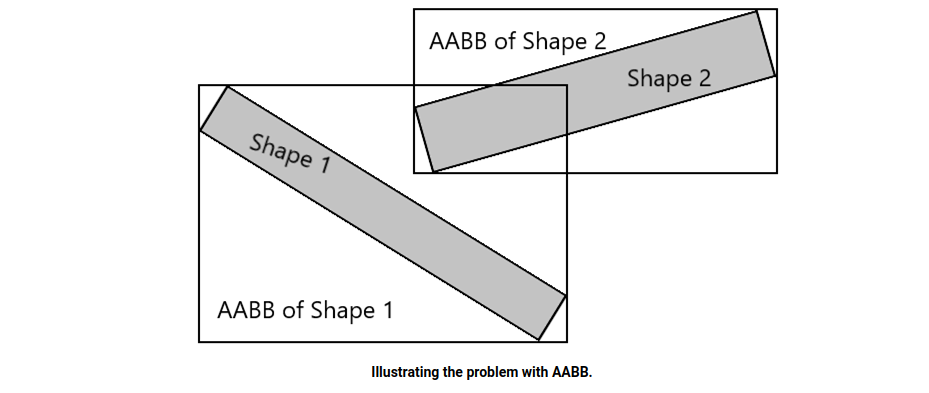

## 一些与 OBB 配合使用的算法的简要说明

### 从一组点创建 OBB
该算法在 Thomas Larsson 和 Linus Källberg (FastOBBs.pdf) 的“紧配合定向边界框的快速计算”中有所描述。 它包括以下步骤：

- 1.选择 $N_a(N_a \geq 3)$​ 初始化轴。
- 2.将每个给定点投影到每个选择的（在第 1 项中）轴。那时，选择每个轴的“最小”和“最大”点（i.e.即具有投影到该轴的最小和最大参数（相应地）的点）。I.e. $2∗N_a$ 点将被保留，并且该集合可以包含相等的点。稍后（除非另有说明）在此算法中，我们将仅使用这些 $2∗N_a$​ 点。
- 3.在每个轴的所有“最小”和“最大”点对中选择一对点（从第 1 项开始），最远的两个点。让 $p_0$​​ 和 $p_1$​​​ 成为这一对的“最小”和“最大”点。
- 4.创建轴$e_0 \{\overrightarrow{p_0p_1} \}$（即具有方向$\overrightarrow{p_0p_1}$​）。
- 5.选择点 $p_2$​​（从第 2 项中定义的集合中），它与沿 $e_0$​0 轴指向的无穷大直线距离最大。此外，让我们考虑三角形 $T_0⟨p_0,p_1,p_2⟩$​（i.e.即具有顶点 $p_0,p_1$​ 和 $p_2$​​）。即：
- 6.创建新轴 ：$e_1\{\overrightarrow{p_1p_2}\},e_2\{\overrightarrow{p_2p_0}\}, n\{\overrightarrow{e_0} \times \overrightarrow{e_1}\}, m_0\{\overrightarrow{e_0} \times \overrightarrow{n}\}, m_1\{\overrightarrow{e_1} \times \overrightarrow{n}\}, m_2\{\overrightarrow{e_2} \times \overrightarrow{n}\}$​。
- 7.基于以下轴创建 OBB：$\{e_0 \vdots m_0 \vdots n \}, \{e_1 \vdots m_1 \vdots n \},\{e_2 \vdots m_2 \vdots n \}$​。选择最佳 OBB。
- 8.选择点 $q_0$​_ 和 $q_1$​（从第 2 项中定义的集合中），它们与三角形 $T_0$​ 的平面（从该平面的两侧）的距离最大。此时，$q_0$​ 沿 $n$​ 轴具有最小坐标，$q_1$​ 具有最大坐标。
- 9.对三角形 $T_1⟨p_0,p_1,q_0⟩, T_2⟨p_1,p_2,q_0⟩, T_3⟨p_0,p_2,q_0⟩, T_4⟨p_0,p_1,q_1⟩, T_5⟨p_1,p_2,q_1⟩,T_6⟨p_0,p_2,q_1⟩$​​ 重复步骤 6...7。。
- 10.计算 OBB 的中心及其半尺寸。
- 11.使用中心、轴和半尺寸创建 OBB。

### 从一组点创建最佳 OBB

为了从一组点创建最佳 OBB，使用与上述相同的算法，但在逻辑上进行了一些简化并增加了计算时间。 对于最佳 OBB，有必要检查可由极值点创建的所有可能的轴。 由于极值点仅对初始轴有效，因此有必要在每个轴上投影整个点集。 这种方法通常提供更紧密的 OBB，但性能较低。 该算法的复杂度仍然是线性的，并且对于点集使用 BVH，它是 $O(N + C*log(N))$。

以下是使用 125K 节点集的模型的最佳和非最佳 OBB 示例：

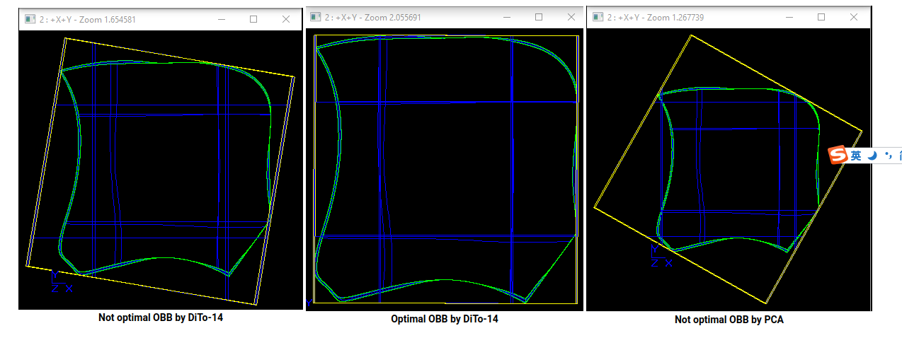

在这种情况下，非最优 OBB 的计算需要 0.007 秒，最优 - 0.1 秒，大约慢 14 倍。 这种性能与通过 PCA 方法（见下文）为这种形状创建 OBB 相当，大约需要 0.17 秒。

最佳 OBB 的计算由与 PCA 算法相同的 BRepBndLib::AddOBB 方法中的 theIsOptimal 标志控制。

这些算法在 Bnd_OBB::ReBuild(...) 方法中实现。

### 基于惯性轴的 OBB 创建

该算法包含以下步骤：

- 1.计算三个惯性轴，这将是 OBB 的轴。
- 2.根据项目 1 中的轴将源对象 *(TopoDS_Shape)* 转换为局部坐标系。
- 3.为第 2 项中获得的形状创建一个 AABB。
- 4.计算 AABB 的中心及其半维。
- 5.将中心转变为 WCS。
- 6.使用中心、轴和半尺寸创建 OBB。

### 点的方法 IsOut

- 1.将点投影到每个轴。
- 2.检查投影参数的绝对值是否大于对应的半维。 在这种情况下，IsOut 方法将返回 TRUE。

### 另一个 OBB 的方法 IsOut

根据“定向包围盒的分离轴定理”，需要检查15个分离轴：盒子的6个轴和9个是它们的叉积。
分析l轴的算法如下：

- 1.根据公式计算“长度”：$L_j = \sum_{i=0}^2H_i\cdot |\overrightarrow{a_i} \cdot \overrightarrow{1}|$。这里，$a_i$ 是第 j 个 BndBox (j=1...2) 的第 i 个轴（X 轴、Y 轴、Z 轴）。 $H_i$ 是沿第 i 个轴的半维
- 2.如果 $|\overrightarrow{C_1 C_2} \cdot \overrightarrow{1}| > L_1 + L_2$​（其中 $C_j$ 是第 j 个 OBB 的中心），则考虑的 OBB 不会在轴 l 方面受到干扰。

如果 OBB 在至少一个轴（15 个）方面没有受到干扰，那么它们根本不会受到干扰。

### 为点或其他边界框添加方法
基于源点和给定边界框的所有顶点创建一个新的 OBB（请参阅从一组点创建 OBB 部分）。

## 添加形状

方法 BRepBndLib::AddOBB(...) 允许从复杂对象 *(TopoDS_Shape)* 创建边界框。该方法使用在从点集创建 OBB 部分和基于惯性轴创建 OBB 部分中描述的两种算法。

如果形状的外壳可以由其中包含的一组点表示，则使用第一种算法。即，只有以下元素是点集的来源：

- 三角剖分节点；
- Poly_Polygon3D 的节点；
- 具有线性 3D 曲线的边的顶点位于平面中；
- 如果源形状不包含更复杂的拓扑结构（例如源形状是边的复合），则具有线性 3D 曲线的边的顶点；
- 如果源形状不包含更复杂的拓扑结构（例如，源形状是顶点的复合），则为顶点。

如果无法提取所需的点集，则使用基于惯性轴创建 OBB 部分的算法来创建 OBB。

包 BRepBndLib 包含用于创建形状 AABB 的方法 BRepBndLib::Add(...)、BRepBndLib::AddClose(...) 和 BRepBndLib::AddOptimal(...)。有关详细信息，请参阅参考手册。

## OBB 创建算法的局限性。

- 1.从一组点创建 OBB 部分中描述的算法比基于惯性轴创建 OBB 部分中的算法效果更好（找到具有较小表面积的结果 OBB）并且速度更快。然而，（通常）两种算法返回的结果并不总是最佳的（即有时存在另一个具有较小表面积的 OBB）。此外，第一种方法不允许计算具有复杂几何形状的 OBB。
- 2.目前，OBB 创建算法仅针对 3D 空间中的对象实现。

