[TOC]

# Geometric Tools

Open CASCADE Technology 几何工具提供的算法可以：

- 计算两条2D曲线、曲面或一条3D曲线与一个曲面的交点；
- 将点投影到 2D 和 3D 曲线上，将点投影到曲面上，将 3D 曲线投影到曲面上；
- 从约束构造线和圆；
- 从约束构造曲线和曲面；
- 通过插值构建曲线和曲面。

## Intersections

Intersections 组件用于计算 2D 或 3D 几何对象之间的交集：

- 两条二维曲线之间的交点；
- 二维曲线的自交点；
- 3D 曲线和曲面之间的交点；
- 两个曲面之间的交点。

Geom2dAPI_InterCurveCurve 类允许评估两条几何曲线 (Geom2d_Curve) 之间的交点 (gp_Pnt2d) 和评估曲线的自交点。

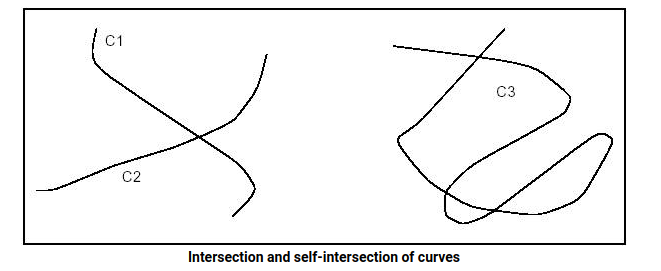

在这两种情况下，算法都需要一个容差值 (Standard_Real)，用于两点之间的混淆。 所有构造函数中使用的默认容差值为 1.0e-6。

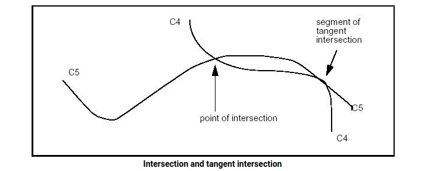

该算法在相交的情况下返回一个点，在切线相交的情况下返回一个线段。

### Intersection of two curves

Geom2dAPI_InterCurveCurve 类可以为曲线 C1 和 C2 的交点实例化。

```
Geom2dAPI_InterCurveCurve Intersector(C1,C2,tolerance); 
```

或用于曲线 C3 的自交。

```
Geom2dAPI_InterCurveCurve Intersector(C3,tolerance); 
Standard_Integer N = Intersector.NbPoints(); 
```

调用交点数

要选择所需的交点，请在参数中传递整数索引值。

```
gp_Pnt2d P = Intersector.Point(Index); 
```

要调用相交线段的数量，请使用

```
Standard_Integer M = Intersector.NbSegments(); 
```

要选择所需的交叉段，请在参数中传递整数索引值。

```
Handle(Geom2d_Curve) Seg1, Seg2; 
Intersector.Segment(Index,Seg1,Seg2); 
// if intersection of 2 curves 
Intersector.Segment(Index,Seg1); 
// if self-intersection of a curve 
```

如果您需要访问更广泛的功能，以下方法将返回用于计算交点的算法对象：

```
Geom2dInt_GInter& TheIntersector = Intersector.Intersector(); 
```

### Intersection of Curves and Surfaces

GeomAPI_IntCS 类用于计算曲线和曲面之间的交点。

这个类的实例化如下：

```
GeomAPI_IntCS Intersector(C, S); 
```

要调用交叉点的数量，请使用：

```
Standard_Integer nb = Intersector.NbPoints(); 
gp_Pnt& P = Intersector.Point(Index); 
```

其中Index是1到nb之间的整数，称为交点。

### Intersection of two Surfaces

GeomAPI_IntSS 类用于计算来自 Geom_Surface 的两个表面相对于给定容差的交集。

这个类的实例化如下：

```
GeomAPI_IntSS Intersector(S1, S2, Tolerance); 
```

一旦创建了 GeomAPI_IntSS 对象，就可以对其进行解释。

```
Standard_Integer nb = Intersector. NbLines(); 
```

调用相交曲线的数量。

```
Handle(Geom_Curve) C = Intersector.Line(Index) 
```

其中 Index 是 1 到 nb 之间的整数，称为相交曲线。

## Interpolations

Interpolation Laws 组件提供函数的定义： y=f(x) 。

特别是，它提供了以下定义：

- 一个线性函数，
- S 函数，和
- 一系列值的插值函数。

例如，此类函数可用于定义沿形状边缘的圆角演变规律。

永远不会检查所构建函数的有效性：Law 包不知道该函数将用于什么应用程序或用于什么目的。 特别是，如果将该函数用作圆角的演化规律，则该函数始终为正很重要。 用户必须检查这一点。

### Geom2dAPI_Interpolate

此类用于插入通过点数组的 BSplineCurve。 如果在插值点不要求相切，则连续性将为 C2。 如果在该点请求相切，则连续性将为 C1。 如果要求周期性，则曲线将闭合，交汇点将是给定的第一个点。 然后曲线将仅具有 C1 的连续性。 这个类可以实例化如下：

```
Geom2dAPI_Interpolate 
(const  Handle_TColgp_HArray1OfPnt2d& Points, 
const  Standard_Boolean PeriodicFlag, 
const Standard_Real  Tolerance); 
Geom2dAPI_Interpolate Interp(Points, Standard_False, 
                                    Precision::Confusion()); 
```

可以从上面定义的对象调用 BSpline 曲线。

```
Handle(Geom2d_BSplineCurve) C = Interp.Curve(); 
```

请注意， Handle(Geom2d_BSplineCurve) 运算符已由方法 Curve() 重新定义。 因此，不需要通过构建 Geom2dAPI_Interpolate 类型的中间对象，并且以下语法是正确的。

```
Handle(Geom2d_BSplineCurve) C = 
Geom2dAPI_Interpolate(Points, 
    Standard_False, 
    Precision::Confusion()); 
```

### GeomAPI_Interpolate

这个类可以实例化如下：

```
GeomAPI_Interpolate 
(const  Handle_TColgp_HArray1OfPnt& Points, 
const  Standard_Boolean PeriodicFlag, 
const Standard_Real  Tolerance); 
GeomAPI_Interpolate Interp(Points, Standard_False, 
                                    Precision::Confusion());
```

可以从上面定义的对象调用 BSpline 曲线。

```
Handle(Geom_BSplineCurve) C = Interp.Curve(); 
```

请注意， Handle(Geom_BSplineCurve) 运算符已由方法 Curve() 重新定义。 因此，不需要通过构建 GeomAPI_Interpolate 类型的中间对象，并且以下语法是正确的。

```
Handle(Geom_BSplineCurve) C = GeomAPI_Interpolate(Points, Standard_False, 1.0e-7);
```

可以使用 Load 方法施加边界条件。

```
GeomAPI_Interpolate AnInterpolator 
(Points, Standard_False, 1.0e-5); 
AnInterpolator.Load (StartingTangent, EndingTangent); 
```

## Lines and Circles from Constraints

### Types of constraints

可以使用与其他曲线相关的数字或几何约束来描述用于构建 2D 圆或线的算法。

这些约束可以强加以下内容：

- 圆的半径，
- 一条直线与另一条直线所成的角度，
- 直线或圆与曲线的相切，
- 一条直线或圆通过一个点，
- 以点或曲线为中心的圆。

例如，这些算法能够轻松构建一个给定半径的圆，以直线为中心并与另一个圆相切。

实现的算法比用于构建 2D 圆或线的 Direct Constructions 组件提供的算法更复杂。

根据解的相对位置以及与表达相切约束的圆或直线的相对位置，相切问题的表达通常会导致多个结果。例如，考虑以下给定半径（小半径）的圆与两个割圆 C1 和 C2 相切的情况：

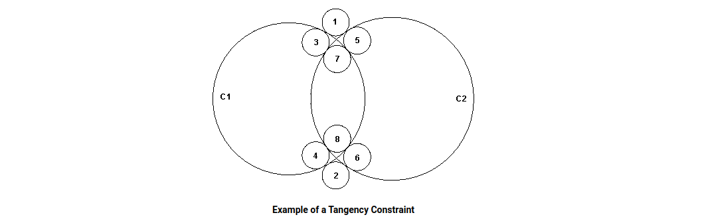

该图清楚地表明有 8 种可能的解决方案。

为了限制解的数量，我们可以尝试表达所需解相对于它相切的圆的相对位置。例如，如果我们指定解决方案在圆 C1 内和圆 C2 外，则只有图中标有 3 和 4 的两个解决方案可以解决所提出的问题。

这些定义在圆上很容易解释，很容易识别内侧和外侧。事实上，对于任何类型的曲线，内部都被定义为曲线相对于其方向的左侧。

这种与它相切的曲线有关的解决方案限定技术可用于通过几何约束构造圆或直线的所有算法。使用了四个限定符：

- 封闭 - 解决方案必须包含参数；
- 封闭 - 解决方案必须包含在参数中；
- 外部——解决方案和论点必须相互独立；
- 不合格 - 相对位置不合格，即所有解决方案都适用。

可以使用限定符创建表达式，例如：

```
GccAna_Circ2d2TanRad 
    Solver(GccEnt::Outside(C1), 
        GccEnt::Enclosing(C2),  Rad, Tolerance); 
```

此表达式查找半径为 Rad 的所有圆，它们与圆 C1 和 C2 都相切，而 C1 在外面，C2 在里面。

### Available types of lines and circles

The following analytic algorithms using value-handled entities for creation of 2D lines or circles with geometric constraints are available:

以下分析算法使用值处理实体来创建具有几何约束的二维线或圆：

- circle tangent to three elements (lines, circles, curves, points),
- 与三个元素（直线、圆、曲线、点）相切的圆，
- circle tangent to two elements and having a radius,
- 与两个元素相切并具有半径的圆，
- circle tangent to two elements and centered on a third element,
- 与两个元素相切并以第三个元素为中心的圆，
- circle tangent to two elements and centered on a point,
- 与两个元素相切并以一点为中心的圆，
- circle tangent to one element and centered on a second,
- 与一个元素相切并以第二个元素为中心的圆，
- bisector of two points,
- 两点的平分线，
- bisector of two lines,
- 两条线的平分线，
- bisector of two circles,
- 两个圆的平分线，
- bisector of a line and a point,
- 线和点的平分线，
- bisector of a circle and a point,
- 一个圆和一个点的平分线，
- bisector of a line and a circle,
- 线和圆的平分线，
- line tangent to two elements (points, circles, curves),
- 与两个元素（点、圆、曲线）相切的线，
- line tangent to one element and parallel to a line,
- 与一个元素相切并平行于一条线的线，
- line tangent to one element and perpendicular to a line,
- 与一个元素相切并垂直于一条线的线，
- line tangent to one element and forming angle with a line.
- 线与一个元素相切并与线形成角度。

**Exterior/Interior**

It is not hard to define the interior and exterior of a circle. As is shown in the following diagram, the exterior is indicated by the sense of the binormal, that is to say the right side according to the sense of traversing the circle. The left side is therefore the interior (or "material").

定义圆的内部和外部并不难。 如下图所示，外部以副法线的意义表示，即根据遍历圆的意义表示右侧。 因此，左侧是内部（或“材料”）。

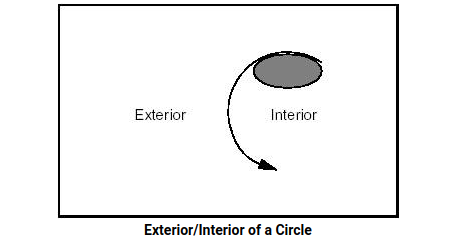

By extension, the interior of a line or any open curve is defined as the left side according to the passing direction, as shown in the following diagram:

推而广之，一条直线或任何开放曲线的内部都被定义为根据通过方向的左侧，如下图所示：

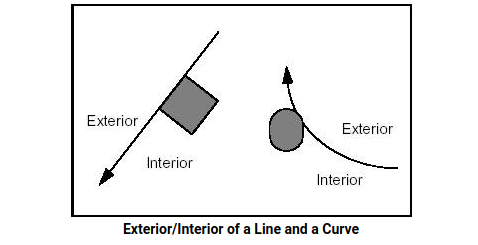

**Orientation of a Line**

It is sometimes necessary to define in advance the sense of travel along a line to be created. This sense will be from first to second argument.

有时需要预先定义沿着要创建的线的旅行感。 这种意义将是从第一个到第二个参数。

The following figure shows a line, which is first tangent to circle C1 which is interior to the line, and then passes through point P1.

下图显示了一条直线，它首先与直线内部的圆 C1 相切，然后通过点 P1。

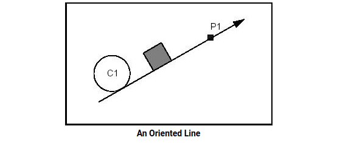

**Line tangent to two circles**

The following four diagrams illustrate four cases of using qualifiers in the creation of a line. The fifth shows the solution if no qualifiers are given.

以下四张图说明了在创建行时使用限定符的四种情况。 如果没有给出限定符，第五个显示了解决方案。

**Example 1 Case 1**

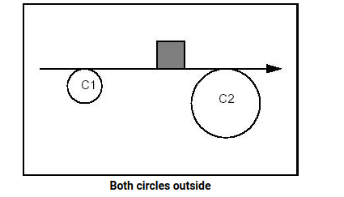

Constraints: Tangent and Exterior to C1. Tangent and Exterior to C2.

约束：C1 的切线和外部。 C2 的切线和外部。

Syntax:

```
GccAna_Lin2d2Tan 
    Solver(GccEnt::Outside(C1), 
        GccEnt::Outside(C2), 
        Tolerance); 
```

**Example 1 Case 2**

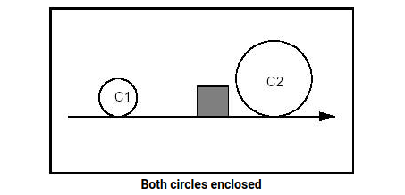

Constraints: Tangent and Including C1. Tangent and Including C2.

约束：切线并包括 C1。 切线并包括 C2。

Syntax:

```
GccAna_Lin2d2Tan 
    Solver(GccEnt::Enclosing(C1), 
        GccEnt::Enclosing(C2), 
        Tolerance); 
```

**Example 1 Case 3**

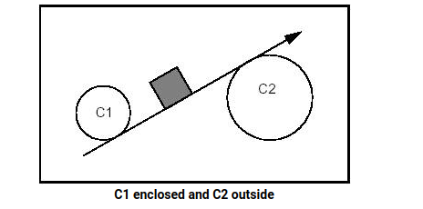

Constraints: Tangent and Including C1. Tangent and Exterior to C2.

约束：切线并包括 C1。 C2 的切线和外部。

Syntax:

```
GccAna_Lin2d2Tan 
    Solver(GccEnt::Enclosing(C1), 
        GccEnt::Outside(C2), 
        Tolerance); 
```

**Example 1 Case 4**

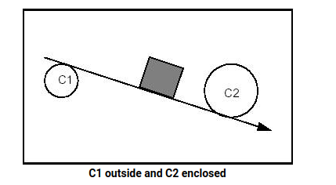

Constraints: Tangent and Exterior to C1. Tangent and Including C2.

约束：C1 的切线和外部。 切线并包括 C2。

Syntax:

```
GccAna_Lin2d2Tan 
    Solver(GccEnt::Outside(C1), 
        GccEnt::Enclosing(C2), 
        Tolerance); 
```

**Example 1 Case 5**

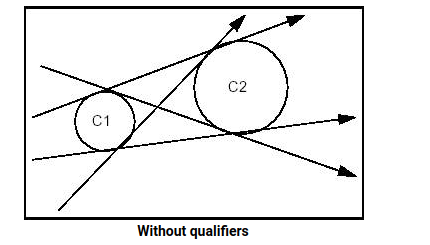


Constraints: Tangent and Undefined with respect to C1. Tangent and Undefined with respect to C2.

约束：关于 C1 的切线和未定义。 关于 C2 的切线和未定义。

Syntax:

```
GccAna_Lin2d2Tan 
    Solver(GccEnt::Unqualified(C1), 
        GccEnt::Unqualified(C2), 
        Tolerance); 
```

**Circle of given radius tangent to two circles**(给定半径的圆与两个圆相切)

The following four diagrams show the four cases in using qualifiers in the creation of a circle.
以下四张图展示了在创建圆时使用限定符的四种情况。

**Example 2 Case 1**

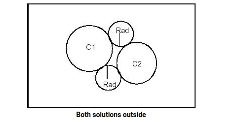

Constraints: Tangent and Exterior to C1. Tangent and Exterior to C2.

约束：C1 的切线和外部。 C2 的切线和外部。

Syntax:

```
GccAna_Circ2d2TanRad 
    Solver(GccEnt::Outside(C1), 
    GccEnt::Outside(C2),  Rad, Tolerance); 
```

**Example 2 Case 2**

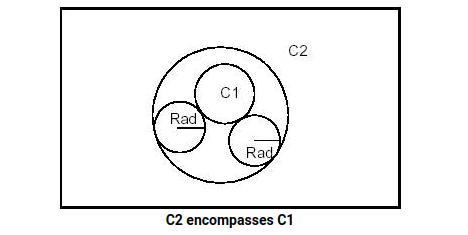

Constraints: Tangent and Exterior to C1. Tangent and Included by C2.

约束：C1 的切线和外部。 切线并包含在 C2 中。

Syntax:

```
GccAna_Circ2d2TanRad 
    Solver(GccEnt::Outside(C1), 
        GccEnt::Enclosed(C2),  Rad, Tolerance); 
```

**Example 2 Case 3**

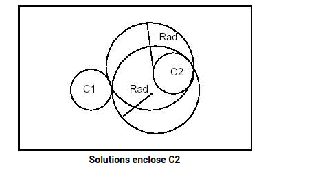

Constraints: Tangent and Exterior to C1. Tangent and Including C2.

约束：C1 的切线和外部。 切线并包括 C2。

Syntax:

```
GccAna_Circ2d2TanRad 
    Solver(GccEnt::Outside(C1), 
        GccEnt::Enclosing(C2),  Rad, Tolerance); 
```

**Example 2 Case 4**

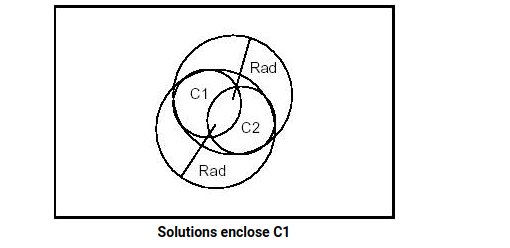

Constraints: Tangent and Enclosing C1. Tangent and Enclosing C2.

约束：切线和封闭 C1。 切线和封闭 C2。

Syntax:

```
GccAna_Circ2d2TanRad 
    Solver(GccEnt::Enclosing(C1), 
        GccEnt::Enclosing(C2),  Rad, Tolerance); 
```

**Example 2 Case 5**

The following syntax will give all the circles of radius *Rad*, which are tangent to *C1* and *C2* without discrimination of relative position:

以下语法将给出所有半径为 *Rad* 的圆，它们与 *C1* 和 *C2* 相切，不区分相对位置：

```
GccAna_Circ2d2TanRad  Solver(GccEnt::Unqualified(C1), 
                            GccEnt::Unqualified(C2), 
                            Rad,Tolerance); 
```

### Types of algorithms

OCCT implements several categories of algorithms:

OCCT 实现了几类算法：

- **Analytic** algorithms, where solutions are obtained by the resolution of an equation, such algorithms are used when the geometries which are worked on (tangency arguments, position of the center, etc.) are points, lines or circles;
- 解析算法，通过求解方程获得解，当处理的几何图形（相切参数、中心位置等）是点、线或圆时，使用这种算法；
- **Geometric** algorithms, where the solution is generally obtained by calculating the intersection of parallel or bisecting curves built from geometric arguments;
- 几何算法，其中解决方案通常通过计算由几何参数构建的平行或二等分曲线的交点来获得；
- **Iterative** algorithms, where the solution is obtained by a process of iteration.
- 迭代算法，其中解决方案是通过迭代过程获得的。

For each kind of geometric construction of a constrained line or circle, OCCT provides two types of access:

对于受约束的线或圆的每种几何构造，OCCT 提供两种类型的访问：

- algorithms from the package *[Geom2dGcc](https://old.opencascade.com/doc/occt-7.4.0/refman/html/class_geom2d_gcc.html)* automatically select the algorithm best suited to the problem, both in the general case and in all types of specific cases; the used arguments are *Geom2d* objects, while the computed solutions are *gp* objects;
- Geom2dGcc 包中的算法自动选择最适合问题的算法，无论是在一般情况下还是在所有类型的特定情况下；使用的参数是 Geom2d 对象，而计算的解决方案是 gp 对象；
- algorithms from the package *GccAna* resolve the problem analytically, and can only be used when the geometries to be worked on are lines or circles; both the used arguments and the computed solutions are *gp* objects.
- GccAna 包中的算法以解析方式解决了该问题，并且只能在要处理的几何图形是直线或圆时使用；使用的参数和计算的解决方案都是 gp 对象。

The provided algorithms compute all solutions, which correspond to the stated geometric problem, unless the solution is found by an iterative algorithm.

所提供的算法计算对应于所述几何问题的所有解，除非该解是通过迭代算法找到的。

Iterative algorithms compute only one solution, closest to an initial position. They can be used in the following cases:

迭代算法只计算一个最接近初始位置的解。它们可用于以下情况：

- to build a circle, when an argument is more complex than a line or a circle, and where the radius is not known or difficult to determine: this is the case for a circle tangential to three geometric elements, or tangential to two geometric elements and centered on a curve;
- 构建一个圆，当参数比直线或圆更复杂，并且半径未知或难以确定时：这是与三个几何元素相切的圆，或与两个几何元素相切的情况，并且以曲线为中心；
- to build a line, when a tangency argument is more complex than a line or a circle.
- 当相切参数比直线或圆更复杂时，构建一条直线。

Qualified curves (for tangency arguments) are provided either by:

限定曲线（用于相切参数）由以下任一方式提供：

- the *[GccEnt](https://old.opencascade.com/doc/occt-7.4.0/refman/html/class_gcc_ent.html)* package, for direct use by *GccAna* algorithms, or
- GccEnt 包，供 GccAna 算法直接使用，或
- the *[Geom2dGcc](https://old.opencascade.com/doc/occt-7.4.0/refman/html/class_geom2d_gcc.html)* package, for general use by *[Geom2dGcc](https://old.opencascade.com/doc/occt-7.4.0/refman/html/class_geom2d_gcc.html)* algorithms.
- Geom2dGcc 包，供 Geom2dGcc 算法一般使用。

The *[GccEnt](https://old.opencascade.com/doc/occt-7.4.0/refman/html/class_gcc_ent.html)* and *[Geom2dGcc](https://old.opencascade.com/doc/occt-7.4.0/refman/html/class_geom2d_gcc.html)* packages also provide simple functions for building qualified curves in a very efficient way.

GccEnt 和 Geom2dGcc 包还提供了以非常有效的方式构建合格曲线的简单函数。

The *GccAna* package also provides algorithms for constructing bisecting loci between circles, lines or points. Bisecting loci between two geometric objects are such that each of their points is at the same distance from the two geometric objects. They are typically curves, such as circles, lines or conics for *GccAna* algorithms. Each elementary solution is given as an elementary bisecting locus object (line, circle, ellipse, hyperbola, parabola), described by the *GccInt* package.

GccAna 包还提供了在圆、线或点之间构建二等分轨迹的算法。两个几何对象之间的平分轨迹使得它们的每个点与两个几何对象的距离相同。它们通常是曲线，例如 GccAna 算法的圆、线或圆锥曲线。每个基本解都作为基本平分轨迹对象（线、圆、椭圆、双曲线、抛物线）给出，由 GccInt 包描述。

Note: Curves used by *GccAna* algorithms to define the geometric problem to be solved, are 2D lines or circles from the *gp* package: they are not explicitly parameterized. However, these lines or circles retain an implicit parameterization, corresponding to that which they induce on equivalent Geom2d objects. This induced parameterization is the one used when returning parameter values on such curves, for instance with the functions *Tangency1, Tangency2, Tangency3, Intersection2* and *CenterOn3* provided by construction algorithms from the *GccAna* or *[Geom2dGcc](https://old.opencascade.com/doc/occt-7.4.0/refman/html/class_geom2d_gcc.html)* packages.

注意：GccAna 算法用来定义要解决的几何问题的曲线是来自 gp 包的 2D 线或圆：它们没有明确参数化。然而，这些线或圆保留了隐式参数化，对应于它们在等效的 Geom2d 对象上引入的参数化。这种诱导参数化是在此类曲线上返回参数值时使用的参数化，例如使用由 GccAna 或 Geom2dGcc 包的构造算法提供的函数 Tangency1、Tangency2、Tangency3、Intersection2 和 CenterOn3。

## Curves and Surfaces from Constraints


