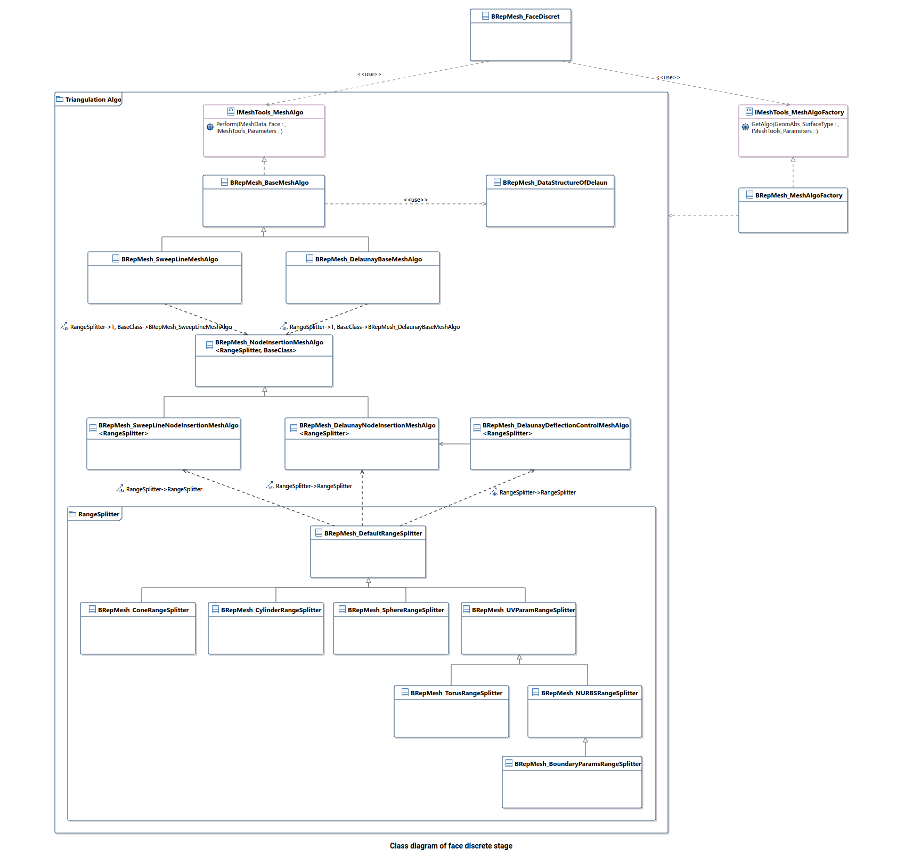

[TOC]

## Mesh presentations

In addition to support of exact geometrical representation of 3D objects Open CASCADE Technology provides functionality to work with tessellated representations of objects in form of meshes.

除了支持 3D 对象的精确几何表示之外，Open CASCADE 技术还提供了以网格形式处理对象的细分表示的功能。

Open CASCADE Technology mesh functionality provides:

- data structures to store surface mesh data associated to shapes, and some basic algorithms to handle these data
- 存储与形状相关的表面网格数据的数据结构，以及处理这些数据的一些基本算法
- data structures and algorithms to build surface triangular mesh from *BRep* objects (shapes).
- 从 BRep 对象（形状）构建表面三角形网格的数据结构和算法。
- tools to extend 3D visualization capabilities of Open CASCADE Technology with displaying meshes along with associated pre- and post-processor data.
- 通过显示网格以及相关的预处理器和后处理器数据来扩展 Open CASCADE 技术的 3D 可视化功能的工具。

Open CASCADE Technology includes two mesh converters:

- VRML converter translates Open CASCADE shapes to VRML 1.0 files (Virtual Reality Modeling Language). Open CASCADE shapes may be translated in two representations: shaded or wireframe. A shaded representation present shapes as sets of triangles computed by a mesh algorithm while a wireframe representation present shapes as sets of curves.
- VRML 转换器将 Open CASCADE 形状转换为 VRML 1.0 文件（虚拟现实建模语言）。Open CASCADE形状可以转换为两种表示形式：阴影或线框。阴影表示将形状呈现为由网格算法计算的三角形集，而线框表示将形状呈现为曲线集。
- STL converter translates Open CASCADE shapes to STL files. STL (STtereoLithography) format is widely used for rapid prototyping.
- STL 转换器将 Open CASCADE 形状转换为 STL 文件。 STL（STtereoLithography）格式广泛用于快速原型制作。

Open CASCADE SAS also offers Advanced Mesh Products:

- [Open CASCADE Mesh Framework (OMF)](https://www.opencascade.com/content/mesh-framework)
- [Express Mesh](https://www.opencascade.com/content/express-mesh)

The projects dealing with numerical simulation can benefit from using SALOME - an Open Source Framework for CAE with CAD data interfaces, generic Pre- and Post- F.E. processors and API for integrating F.E. solvers.

处理数值模拟的项目可以受益于使用 SALOME - CAE 的开源框架，具有 CAD 数据接口、通用前和后 F.E. 处理器以及用于集成 F.E. 求解器的 API。

Learn more about SALOME platform on [https://www.salome-platform.org](https://www.salome-platform.org/)

## Meshing algorithm

The algorithm of shape triangulation is provided by the functionality of *[BRepMesh_IncrementalMesh](https://dev.opencascade.org/doc/refman/html/class_b_rep_mesh___incremental_mesh.html)* class, which adds a triangulation of the shape to its topological data structure. This triangulation is used to visualize the shape in shaded mode.

形状三角剖分算法由 *[BRepMesh_IncrementalMesh](https://dev.opencascade.org/doc/refman/html/class_b_rep_mesh___incremental_mesh.html)* 类的功能提供，该类为其拓扑数据添加了形状三角剖分 结构体。 此三角测量用于在着色模式下可视化形状。

```C++
#include <IMeshData_Status.hxx>
#include <IMeshTools_Parameters.hxx>
#include <BRepMesh_IncrementalMesh.hxx>
 
Standard_Boolean meshing_explicit_parameters()
{
  const Standard_Real aRadius = 10.0; 
  const Standard_Real aHeight = 25.0; 
  BRepPrimAPI_MakeCylinder aCylinder(aRadius, aHeight); 
  TopoDS_Shape aShape = aCylinder.Shape();
 
  const Standard_Real aLinearDeflection   = 0.01;
  const Standard_Real anAngularDeflection = 0.5;
  BRepMesh_IncrementalMesh aMesher (aShape, aLinearDeflection, Standard_False, anAngularDeflection, Standard_True);
  const Standard_Integer aStatus = aMesher.GetStatusFlags();
  return !aStatus;
}
 
Standard_Boolean meshing_imeshtools_parameters()
{
  const Standard_Real aRadius = 10.0; 
  const Standard_Real aHeight = 25.0; 
  BRepPrimAPI_MakeCylinder aCylinder(aRadius, aHeight); 
  TopoDS_Shape aShape = aCylinder.Shape();
  
  IMeshTools_Parameters aMeshParams;
  aMeshParams.Deflection               = 0.01;
  aMeshParams.Angle                    = 0.5;
  aMeshParams.Relative                 = Standard_False;
  aMeshParams.InParallel               = Standard_True;
  aMeshParams.MinSize                  = Precision::Confusion();
  aMeshParams.InternalVerticesMode     = Standard_True;
  aMeshParams.ControlSurfaceDeflection = Standard_True;
 
  BRepMesh_IncrementalMesh aMesher (aShape, aMeshParams);
  const Standard_Integer aStatus = aMesher.GetStatusFlags();
  return !aStatus;
}
```

The default meshing algorithm *[BRepMesh_IncrementalMesh](https://dev.opencascade.org/doc/refman/html/class_b_rep_mesh___incremental_mesh.html)* has two major options to define triangulation – linear and angular deflections.

默认的网格划分算法 BRepMesh_IncrementalMesh 有两个主要选项来定义三角剖分——线性和角度偏转。

At the first step all edges from a face are discretized according to the specified parameters.

在第一步中，根据指定的参数对来自面的所有边进行离散化。

At the second step, the faces are tessellated. Linear deflection limits the distance between a curve and its tessellation, whereas angular deflection limits the angle between subsequent segments in a polyline.

在第二步，面被细分。 线性偏转限制曲线与其细分之间的距离，而角度偏转限制多段线中后续线段之间的角度。


There are additional options to control behavior of the meshing of face interior: *DeflectionInterior* and *AngleInterior*. *DeflectionInterior* limits the distance between triangles and the face interior. *AngleInterior* (used for tessellation of B-spline faces only) limits the angle between normals (N1, N2 and N3 in the picture) in the nodes of every link of the triangle. There is an exception for the links along the face boundary edges, "Angular Deflection" is used for them during edges discretization.

还有其他选项可以控制面内部网格划分的行为：DeflectionInterior 和 AngleInterior。 DeflectionInterior 限制三角形和面内部之间的距离。 AngleInterior（仅用于 B 样条面的细分）限制了三角形每个链接节点中法线（图中 N1、N2 和 N3）之间的角度。 沿面边界边缘的链接有一个例外，在边缘离散化期间对它们使用“角度偏转”。


Note that if a given value of linear deflection is less than shape tolerance then the algorithm will skip this value and will take into account the shape tolerance.

请注意，如果给定的线性偏转值小于形状公差，则算法将跳过该值并考虑形状公差。

The application should provide deflection parameters to compute a satisfactory mesh. Angular deflection is relatively simple and allows using a default value (12-20 degrees). Linear deflection has an absolute meaning and the application should provide the correct value for its models. Giving small values may result in a too huge mesh (consuming a lot of memory, which results in a long computation time and slow rendering) while big values result in an ugly mesh.

应用程序应提供偏转参数以计算令人满意的网格。角偏转相对简单，允许使用默认值（12-20 度）。线性偏转具有绝对意义，应用程序应为其模型提供正确的值。给出较小的值可能会导致网格过大（消耗大量内存，从而导致计算时间长和渲染缓慢），而较大的值会导致网格难看。

For an application working in dimensions known in advance it can be reasonable to use the absolute linear deflection for all models. This provides meshes according to metrics and precision used in the application (for example, it it is known that the model will be stored in meters, 0.004 m is enough for most tasks).

对于以预先已知的尺寸工作的应用程序，对所有模型使用绝对线性偏转是合理的。这根据应用程序中使用的度量和精度提供网格（例如，已知模型将以米为单位存储，对于大多数任务而言，0.004 m 就足够了）。

However, an application that imports models created in other applications may not use the same deflection for all models. Note that actually this is an abnormal situation and this application is probably just a viewer for CAD models with dimensions varying by an order of magnitude. This problem can be solved by introducing the concept of a relative linear deflection with some LOD (level of detail). The level of detail is a scale factor for absolute deflection, which is applied to model dimensions.

但是，导入在其他应用程序中创建的模型的应用程序可能不会对所有模型使用相同的偏转。请注意，实际上这是一种异常情况，此应用程序可能只是尺寸变化一个数量级的 CAD 模型的查看器。这个问题可以通过引入具有一些 LOD（细节层次）的相对线性偏转的概念来解决。详细程度是绝对偏转的比例因子，适用于模型尺寸。

Meshing covers a shape with a triangular mesh. Other than hidden line removal, you can use meshing to transfer the shape to another tool: a manufacturing tool, a shading algorithm, a finite element algorithm, or a collision algorithm.

网格覆盖具有三角形网格的形状。除了隐藏线去除之外，您还可以使用网格划分将形状转移到另一个工具：制造工具、着色算法、有限元算法或碰撞算法。

You can obtain information on the shape by first exploring it. To access triangulation of a face in the shape later, use *BRepTool::Triangulation*. To access a polygon, which is the approximation of an edge of the face, use *BRepTool::PolygonOnTriangulation*.

可以通过首先探索形状来获取有关形状的信息。要稍后访问形状中的面部三角测量，请使用 BRepTool::Triangulation。要访问多边形（面的边缘的近似值），请使用 BRepTool::PolygonOnTriangulation。

## BRepMesh Architecture

### Goals

The main goals of the chosen architecture are:

- Remove tight connections between data structures, auxiliary tools and algorithms to create an extensible solution, easy for maintenance and improvements;
- 去除数据结构、辅助工具和算法之间的紧密联系，创建可扩展的解决方案，便于维护和改进；
- Separate the code among several functional units responsible for specific operation for the sake of simplification of debugging and readability;
- 将代码分离到几个负责具体操作的功能单元之间，以方便调试和可读性；
- Introduce new data structures enabling the possibility to manipulate a discrete model of a particular entity (edge, wire, face) in order to perform computations locally instead of processing the entire model;
- 引入新的数据结构，可以操作特定实体（边、线、面）的离散模型，以便在本地执行计算而不是处理整个模型；
- Implement a new triangulation algorithm replacing the existing functionality that contains overcomplicated solutions that need to be moved to the upper level. In addition, provide the possibility to change the algorithm depending on surface type (initially to speed up meshing of planes).
- 实施新的三角剖分算法，替换现有功能，这些功能包含需要移至上层的过于复杂的解决方案。 此外，提供根据表面类型更改算法的可能性（最初是为了加快平面的网格划分）。

### General workflow


Generally, the workflow of the component can be divided into six parts:

- **Creation of model data structure**: source *[TopoDS_Shape](https://dev.opencascade.org/doc/refman/html/class_topo_d_s___shape.html)* passed to algorithm is analyzed and exploded into faces and edges. The reflection corresponding to each topological entity is created in the data model. Note that underlying algorithms use the data model as input and access it via a common interface which allows creating a custom data model with necessary dependencies between particular entities (see the paragraph "Data model interface");
- 创建模型数据结构：源 TopoDS_Shape 传递给算法被分析并分解为面和边。每个拓扑实体对应的反射是在数据模型中创建的。请注意，底层算法使用数据模型作为输入并通过公共接口访问它，该接口允许创建具有特定实体之间必要依赖关系的自定义数据模型（请参阅“数据模型接口”段落）；
- **Discretize edges 3D & 2D curves**: 3D curve as well as an associated set of 2D curves of each model edge is discretized in order to create a coherent skeleton used as a base in face meshing process. If an edge of the source shape already contains polygonal data which suits the specified parameters, it is extracted from the shape and stored in the model as is. Each edge is processed separately, the adjacency is not taken into account;
- 离散化边 3D 和 2D 曲线：离散化 3D 曲线以及每个模型边的相关 2D 曲线集，以创建连贯的骨架，用作面网格过程中的基础。如果源形状的边已经包含适合指定参数的多边形数据，则从形状中提取它并按原样存储在模型中。每条边单独处理，不考虑邻接；
- **Heal discrete model**: the source *[TopoDS_Shape](https://dev.opencascade.org/doc/refman/html/class_topo_d_s___shape.html)* can contain problems, such as open wires or self-intersections, introduced during design, exchange or modification of model. In addition, some problems like self-intersections can be introduced by roughly discretized edges. This stage is responsible for analysis of a discrete model in order to detect and repair problems or to refuse further processing of a model part in case if a problem cannot be solved;
- 修复离散模型：源 TopoDS_Shape 可能包含在设计、交换或修改模型期间引入的问题，例如开路或自相交。此外，粗略离散的边会引入一些问题，例如自相交。此阶段负责对离散模型进行分析，以便发现和修复问题，或者在无法解决问题时拒绝对模型部分进行进一步处理；
- **Preprocess discrete model**: defines actions specific to the implemented approach to be performed before meshing of faces. By default, this operation iterates over model faces, checks the consistency of existing triangulations and cleans topological faces and adjacent edges from polygonal data in case of inconsistency or marks a face of the discrete model as not required for the computation;
- 预处理离散模型：定义特定于要在面网格划分之前执行的实施方法的操作。默认情况下，此操作迭代模型面，检查现有三角剖分的一致性，并在不一致的情况下从多边形数据中清除拓扑面和相邻边，或将离散模型的面标记为不需要计算；
- **Discretize faces**: represents the core part performing mesh generation for a particular face based on 2D discrete data. This operation caches polygonal data associated with face edges in the data model for further processing and stores the generated mesh to *[TopoDS_Face](https://dev.opencascade.org/doc/refman/html/class_topo_d_s___face.html)*;
- Discretize faces：表示基于二维离散数据对特定面进行网格生成的核心部分。该操作将与面边缘关联的多边形数据缓存在数据模型中以供进一步处理，并将生成的网格存储到 TopoDS_Face；
- **Postprocess discrete model**: defines actions specific for the implemented approach to be performed after meshing of faces. By default, this operation stores polygonal data obtained at the previous stage to *[TopoDS_Edge](https://dev.opencascade.org/doc/refman/html/class_topo_d_s___edge.html)* objects of the source model.
- 后处理离散模型：定义特定于在面网格划分后要执行的实施方法的操作。默认情况下，该操作将前一阶段获得的多边形数据存储到源模型的 TopoDS_Edge 对象中。

### Common interfaces

The component structure contains two units: *[IMeshData](https://dev.opencascade.org/doc/refman/html/namespace_i_mesh_data.html)* (see Data model interface) and *IMeshTools*, defining common interfaces for the data model and algorithmic tools correspondingly. Class *[IMeshTools_Context](https://dev.opencascade.org/doc/refman/html/class_i_mesh_tools___context.html)* represents a connector between these units. The context class caches the data model as well as the tools corresponding to each of six stages of the workflow mentioned above and provides methods to call the corresponding tool safely (designed similarly to *[IntTools_Context](https://dev.opencascade.org/doc/refman/html/class_int_tools___context.html)* in order to keep consistency with OCCT core tools). All stages, except for the first one, use the data model as input and perform a specific action on the entire structure. Thus, API class *[IMeshTools_ModelAlgo](https://dev.opencascade.org/doc/refman/html/class_i_mesh_tools___model_algo.html)* is defined in order to unify the interface of tools manipulating the data model. Each tool supposed to process the data model should inherit this interface enabling the possibility to cache it in context. In contrast to others, the model builder interface is defined by another class *[IMeshTools_ModelBuilder](https://dev.opencascade.org/doc/refman/html/class_i_mesh_tools___model_builder.html)* due to a different meaning of the stage. The entry point starting the entire workflow is represented by *[IMeshTools_MeshBuilder](https://dev.opencascade.org/doc/refman/html/class_i_mesh_tools___mesh_builder.html)*.

组件结构包含两个单元：IMeshData（见数据模型接口）和IMeshTools，分别定义了数据模型和算法工具的通用接口。 IMeshTools_Context 类表示这些单元之间的连接器。上下文类缓存数据模型以及与上述工作流的六个阶段中的每个阶段对应的工具，并提供安全调用相应工具的方法（与 IntTools_Context 设计类似，以保持与 OCCT 核心工具的一致性）。除第一个阶段外，所有阶段都使用数据模型作为输入并对整个结构执行特定操作。因此，定义了 API 类 IMeshTools_ModelAlgo 以统一操作数据模型的工具的接口。每个应该处理数据模型的工具都应该继承这个接口，从而可以在上下文中缓存它。与其他的不同，由于阶段的含义不同，模型构建器接口由另一个类 IMeshTools_ModelBuilder 定义。启动整个工作流程的入口点由 IMeshTools_MeshBuilder 表示。

The default implementation of *[IMeshTools_Context](https://dev.opencascade.org/doc/refman/html/class_i_mesh_tools___context.html)* is given in *[BRepMesh_Context](https://dev.opencascade.org/doc/refman/html/class_b_rep_mesh___context.html)* class initializing the context by instances of default algorithmic tools.

IMeshTools_Context 的默认实现在 BRepMesh_Context 类中给出，通过默认算法工具的实例初始化上下文。

The factory interface *[IMeshTools_MeshAlgoFactory](https://dev.opencascade.org/doc/refman/html/class_i_mesh_tools___mesh_algo_factory.html)* gives the possibility to change the triangulation algorithm for a specific surface. The factory returns an instance of the triangulation algorithm via *[IMeshTools_MeshAlgo](https://dev.opencascade.org/doc/refman/html/class_i_mesh_tools___mesh_algo.html)* interface depending on the type of surface passed as parameter. It is supposed to be used at the face discretization stage.

工厂接口 IMeshTools_MeshAlgoFactory 提供了更改特定表面的三角剖分算法的可能性。工厂通过 IMeshTools_MeshAlgo 接口返回三角剖分算法的实例，具体取决于作为参数传递的表面类型。它应该用于人脸离散化阶段。

The default implementation of AlgoFactory is given in *[BRepMesh_MeshAlgoFactory](https://dev.opencascade.org/doc/refman/html/class_b_rep_mesh___mesh_algo_factory.html)* returning algorithms of different complexity chosen according to the passed surface type. In its turn, it is used as the initializer of *[BRepMesh_FaceDiscret](https://dev.opencascade.org/doc/refman/html/class_b_rep_mesh___face_discret.html)* algorithm representing the starter of face discretization stage.

AlgoFactory 的默认实现在 BRepMesh_MeshAlgoFactory 中给出，返回算法根据传递的表面类型选择不同的复杂度。反过来，它用作 BRepMesh_FaceDiscret 算法的初始化器，代表人脸离散化阶段的启动器。


Remaining interfaces describe auxiliary tools:

- *[IMeshTools_CurveTessellator](https://dev.opencascade.org/doc/refman/html/class_i_mesh_tools___curve_tessellator.html)*: provides a common interface to the algorithms responsible for creation of discrete polygons on 3D and 2D curves as well as tools for extraction of existing polygons from *[TopoDS_Edge](https://dev.opencascade.org/doc/refman/html/class_topo_d_s___edge.html)* allowing to obtain discrete points and the corresponding parameters on curve regardless of the implementation details (see examples of usage of derived classes *[BRepMesh_CurveTessellator](https://dev.opencascade.org/doc/refman/html/class_b_rep_mesh___curve_tessellator.html)*, *[BRepMesh_EdgeTessellationExtractor](https://dev.opencascade.org/doc/refman/html/class_b_rep_mesh___edge_tessellation_extractor.html)* in *[BRepMesh_EdgeDiscret](https://dev.opencascade.org/doc/refman/html/class_b_rep_mesh___edge_discret.html)*);
- IMeshTools_CurveTessellator：为负责在 3D 和 2D 曲线上创建离散多边形的算法提供通用接口，以及从 TopoDS_Edge 中提取现有多边形的工具，允许获取离散点和曲线上的相应参数，而不管实现细节（参见示例） BRepMesh_EdgeDiscret 中派生类 BRepMesh_CurveTessellator、BRepMesh_EdgeTessellationExtractor 的使用）；
- *[IMeshTools_ShapeExplorer](https://dev.opencascade.org/doc/refman/html/class_i_mesh_tools___shape_explorer.html)*: the last two interfaces represent visitor design pattern and are intended to separate iteration over elements of topological shape (edges and faces) from the operations performed on a particular element;
- IMeshTools_ShapeExplorer：最后两个接口代表访问者设计模式，旨在将拓扑形状（边和面）元素的迭代与对特定元素执行的操作分开；
- *[IMeshTools_ShapeVisitor](https://dev.opencascade.org/doc/refman/html/class_i_mesh_tools___shape_visitor.html)*: provides a common interface for operations on edges and faces of the target topological shape. It can be used in couple with *[IMeshTools_ShapeExplorer](https://dev.opencascade.org/doc/refman/html/class_i_mesh_tools___shape_explorer.html)*. The default implementation available in *[BRepMesh_ShapeVisitor](https://dev.opencascade.org/doc/refman/html/class_b_rep_mesh___shape_visitor.html)* performs initialization of the data model. The advantage of such approach is that the implementation of *[IMeshTools_ShapeVisitor](https://dev.opencascade.org/doc/refman/html/class_i_mesh_tools___shape_visitor.html)* can be changed according to the specific data model whereas the shape explorer implementation remains the same.
- IMeshTools_ShapeVisitor：提供对目标拓扑形状的边和面进行操作的通用接口。它可以与 IMeshTools_ShapeExplorer 结合使用。BRepMesh_ShapeVisitor 中可用的默认实现执行数据模型的初始化。这种方法的优点是可以根据特定的数据模型更改 IMeshTools_ShapeVisitor 的实现，而形状浏览器的实现保持不变。

### Create model data structure

The data structures intended to keep discrete and temporary data required by underlying algorithms are created at the first stage of the meshing procedure. Generally, the model represents dependencies between entities of the source topological shape suitable for the target task.

用于保存底层算法所需的离散和临时数据的数据结构是在网格划分过程的第一阶段创建的。通常，模型表示适合目标任务的源拓扑形状的实体之间的依赖关系。

#### Data model interface

Unit *[IMeshData](https://dev.opencascade.org/doc/refman/html/namespace_i_mesh_data.html)* provides common interfaces specifying the data model API used on different stages of the entire workflow. Dependencies and references of the designed interfaces are given in the figure below. A specific interface implementation depends on the target application which allows the developer to implement different models and use custom low-level data structures, e.g. different collections, either *NCollection* or STL. *[IMeshData_Shape](https://dev.opencascade.org/doc/refman/html/class_i_mesh_data___shape.html)* is used as the base class for all data structures and tools keeping the topological shape in order to avoid possible copy-paste.

Unit IMeshData 提供通用接口，指定在整个工作流的不同阶段使用的数据模型 API。设计接口的依赖关系和引用如下图所示。特定的接口实现取决于目标应用程序，它允许开发人员实现不同的模型并使用自定义的低级数据结构，例如不同的集合，无论是 NCollection 还是 STL。 IMeshData_Shape 用作所有数据结构和工具的基类，保持拓扑形状以避免可能的复制粘贴。

The default implementation of interfaces is given in *BRepMeshData* unit. The main aim of the default data model is to provide features performing discretization of edges in a parallel mode. Thus, curve, pcurve and other classes are based on STL containers and smart-pointers as far as *NCollection* does not provide thread-safety for some cases (e.g. *[NCollection_Sequence](https://dev.opencascade.org/doc/refman/html/class_n_collection___sequence.html)*). In addition, it closely reflects topology of the source shape, i.e. the number of edges in the data model is equal to the number of edges in the source model; each edge contains a set of pcurves associated with its adjacent faces which allows creation of discrete polygons for all pcurves or the 3D curve of a particular edge in a separate thread.

接口的默认实现在 BRepMeshData 单元中给出。默认数据模型的主要目的是提供以并行模式执行边缘离散化的特征。因此，只要 NCollection 在某些情况下（例如 NCollection_Sequence）不提供线程安全，curve、pcurve 和其他类都基于 STL 容器和智能指针。此外，它紧密地反映了源形状的拓扑结构，即数据模型中的边数等于源模型中的边数；每条边都包含一组与其相邻面相关联的 pcurve，这允许为所有 pcurve 创建离散多边形或在单独的线程中创建特定边的 3D 曲线。

**Advantages**: In case of necessity, the data model (probably with algorithms for its processing) can be easily substituted by another implementation supporting another kind of dependencies between elements.

优点：在必要的情况下，数据模型（可能带有用于其处理的算法）可以很容易地被另一个支持元素之间的另一种依赖关系的实现替代。

An additional example of a different data model is the case when it is not required to create a mesh with discrete polygons synchronized between adjacent faces, i.e. in case of necessity to speed up creation of a rough per-face tessellation used for visualization or quick computation only (the approach used in *[XDEDRAW_Props](https://dev.opencascade.org/doc/refman/html/class_x_d_e_d_r_a_w___props.html)*).

另一个不同数据模型的示例是不需要创建具有在相邻面之间同步的离散多边形的网格的情况，即在需要加快创建用于可视化或快速计算的粗略每面细分的情况下仅（在 XDEDRAW_Props 中使用的方法）。


#### Collecting data model

At this stage the data model is filled by entities according to the topological structure of the source shape. A default implementation of the data model is given in *BRepMeshData* unit and represents the model as two sets: a set of edges and a set of faces. Each face consists of one or several wires, the first of which always represents the outer wire, while others are internal. In its turn, each wire depicts the ordered sequence of oriented edges. Each edge is characterized by a single 3D curve and zero (in case of free edge) or more 2D curves associated with faces adjacent to this edge. Both 3D and 2D curves represent a set of pairs point-parameter defined in 3D and 2D space of the reference face correspondingly. An additional difference between a curve and a pcurve is that the latter has a reference to the face it is defined for.

在这个阶段，数据模型根据源形状的拓扑结构由实体填充。数据模型的默认实现在 BRepMeshData 单元中给出，并将模型表示为两组：一组边和一组面。每个面由一根或多根线组成，第一根总是代表外线，而其他线代表内线。反过来，每条线描绘了定向边缘的有序序列。每条边的特点是一条 3D 曲线和零条（在自由边的情况下）或更多条与该边相邻的面相关联的 2D 曲线。 3D 和 2D 曲线都表示相应地在参考面的 3D 和 2D 空间中定义的一组点参数对。曲线和 pcurve 之间的另一个区别是后者具有对其定义的面的引用。

Model filler algorithm is represented by *[BRepMesh_ShapeVisitor](https://dev.opencascade.org/doc/refman/html/class_b_rep_mesh___shape_visitor.html)* class creating the model as a reflection to topological shape with help of *BRepMesh_ShapeExplorer* performing iteration over edges and faces of the target shape. Note that the algorithm operates on a common interface of the data model and creates a structure without any knowledge about the implementation details and underlying data structures. The entry point to collecting functionality is *[BRepMesh_ModelBuilder](https://dev.opencascade.org/doc/refman/html/class_b_rep_mesh___model_builder.html)* class.

模型填充算法由 BRepMesh_ShapeVisitor 类表示，在 BRepMesh_ShapeExplorer 对目标形状的边和面执行迭代的帮助下，将模型创建为拓扑形状的反射。请注意，该算法在数据模型的公共接口上运行，并在不了解实现细节和底层数据结构的情况下创建结构。收集功能的入口点是 BRepMesh_ModelBuilder 类。

### Discretize edges 3D & 2D curves

At this stage only the edges of the data model are considered. Each edge is processed separately (with the possibility to run processing in multiple threads). The edge is checked for existing polygonal data. In case if at least one representation exists and suits the meshing parameters, it is recuperated and used as reference data for tessellation of the whole set of pcurves as well as 3D curve assigned to the edge (see *[BRepMesh_EdgeTessellationExtractor](https://dev.opencascade.org/doc/refman/html/class_b_rep_mesh___edge_tessellation_extractor.html)*). Otherwise, a new tessellation algorithm is created and used to generate the initial polygon (see *[BRepMesh_CurveTessellator](https://dev.opencascade.org/doc/refman/html/class_b_rep_mesh___curve_tessellator.html)*) and the edge is marked as outdated. In addition, the model edge is updated by deflection as well as recomputed same range, same parameter and degeneracy parameters. See *[BRepMesh_EdgeDiscret](https://dev.opencascade.org/doc/refman/html/class_b_rep_mesh___edge_discret.html)* for implementation details.

在这个阶段只考虑数据模型的边缘。每条边都单独处理（可以在多个线程中运行处理）。检查边缘是否存在现有的多边形数据。如果至少存在一个表示并且适合网格参数，则将其恢复并用作整个一组 pcurves 以及分配给边缘的 3D 曲线的细分的参考数据（请参阅 BRepMesh_EdgeTessellationExtractor）。否则，将创建新的曲面细分算法并用于生成初始多边形（请参阅 BRepMesh_CurveTessellator），并将边缘标记为过时。此外，通过偏转更新模型边缘以及重新计算相同的范围、相同的参数和退化参数。有关实现细节，请参阅 BRepMesh_EdgeDiscret。

*[IMeshData](https://dev.opencascade.org/doc/refman/html/namespace_i_mesh_data.html)* unit defines interface *[IMeshData_ParametersListArrayAdaptor](https://dev.opencascade.org/doc/refman/html/class_i_mesh_data___parameters_list_array_adaptor.html)*, which is intended to adapt arbitrary data structures to the *[NCollection_Array1](https://dev.opencascade.org/doc/refman/html/class_n_collection___array1.html)* container API. This solution is made to use both *[NCollection_Array1](https://dev.opencascade.org/doc/refman/html/class_n_collection___array1.html)* and *[IMeshData_Curve](https://dev.opencascade.org/doc/refman/html/class_i_mesh_data___curve.html)* as the source for *[BRepMesh_EdgeParameterProvider](https://dev.opencascade.org/doc/refman/html/class_b_rep_mesh___edge_parameter_provider.html)* tool intended to generate a consistent parametrization taking into account the same parameter property.

IMeshData 单元定义了接口 IMeshData_ParametersListArrayAdaptor，该接口旨在将任意数据结构适配到 NCollection_Array1 容器 API。该解决方案使用 NCollection_Array1 和 IMeshData_Curve 作为 BRepMesh_EdgeParameterProvider 工具的源，旨在考虑相同的参数属性生成一致的参数化。

### Heal discrete model

In general, this stage represents a set of operations performed on the entire discrete model in order to resolve inconsistencies due to the problems caused by design, translation or rough discretization. A different sequence of operations can be performed depending on the target triangulation algorithm, e.g. there are different approaches to process self-intersections – either to amplify edges discretization by decreasing the target precision or to split links at the intersection points. At this stage the whole set of edges is considered in aggregate and their adjacency is taken into account. A default implementation of the model healer is given in *[BRepMesh_ModelHealer](https://dev.opencascade.org/doc/refman/html/class_b_rep_mesh___model_healer.html)* which performs the following actions:

一般来说，这个阶段代表对整个离散模型执行的一组操作，以解决由于设计、转换或粗略离散化引起的问题而导致的不一致。可以根据目标三角测量算法执行不同的操作序列，例如有不同的方法来处理自相交——要么通过降低目标精度来放大边缘离散化，要么在交点处分割链接。在这个阶段，整组边被综合考虑并考虑它们的邻接。 BRepMesh_ModelHealer 中给出了模型治疗器的默认实现，它执行以下操作：

- Iterates over model faces and checks their wires for consistency, i.e. whether the wires are closed and do not contain self-intersections. The data structures are designed free of collisions, thus it is possible to run processing in a parallel mode;
- 迭代模型面并检查其连线的一致性，即连线是否闭合且不包含自相交。数据结构设计为无冲突，因此可以以并行方式运行处理；
- Forcibly connects the ends of adjacent edges in the parametric space, closing gaps between possible disconnected parts. The aim of this operation is to create a correct discrete model defined relatively to the parametric space of the target face taking into account connectivity and tolerances of 3D space only. This means that no specific computations are made to determine U and V tolerance;
- 强制连接参数空间中相邻边的末端，关闭可能断开的部分之间的间隙。此操作的目的是创建相对于目标面的参数空间定义的正确离散模型，仅考虑 3D 空间的连通性和容差。这意味着没有进行特定的计算来确定 U 和 V 容差；
- Registers intersections on edges forming the face shape. Two solutions are possible in order to resolve self-intersection:
- 在形成面形状的边上注册交点。为了解决自相交，有两种可能的解决方案：
  - Decrease deflection of a particular edge and update its discrete model. After that the workflow "intersection check – amplification" is repeated up to 5 times. As the result, target edges contain a finer tessellation and meshing continues or the face is marked by *IMeshData_SelfIntersectingWire* status and refused from further processing;
  - 减少特定边缘的偏转并更新其离散模型。之后，“交叉检查 - 放大”工作流程最多重复 5 次。结果，目标边包含更精细的细分和网格划分继续或面被 IMeshData_SelfIntersectingWire 状态标记并拒绝进一步处理；
  - Split target edges by intersection point and synchronize the updated polygon with curve and remaining pcurves associated to each edge. This operation presents a more robust solution comparing to the amplification procedure with a guaranteed result, but it is more difficult for implementation from the point of view of synchronization functionality.
  - 通过交点分割目标边，并将更新的多边形与曲线和与每条边关联的剩余 pcurve 同步。与具有保证结果的放大过程相比，此操作提供了更稳健的解决方案，但从同步功能的角度来看，实现起来更加困难。

### Preprocess discrete model

This stage implements actions to be performed before meshing of faces. Depending on target goals it can be changed or omitted. By default, *[BRepMesh_ModelPreProcessor](https://dev.opencascade.org/doc/refman/html/class_b_rep_mesh___model_pre_processor.html)* implements the functionality checking topological faces for consistency of existing triangulation, i.e.: consistency with the target deflection parameter; indices of nodes referenced by triangles do not exceed the number of nodes stored in a triangulation. If the face fails some checks, it is cleaned from triangulation and its adjacent edges are cleaned from existing polygons. This does not affect a discrete model and does not require any recomputation as the model keeps tessellations for the whole set of edges despite consistency of their polygons.

此阶段执行要在面网格划分之前执行的操作。根据目标目标，它可以更改或省略。默认情况下，BRepMesh_ModelPreProcessor 实现了检查拓扑面是否与现有三角剖分的一致性的功能，即：与目标偏转参数的一致性；三角形引用的节点索引不超过存储在三角剖分中的节点数。如果面未通过某些检查，则将其从三角剖分中清除，并将其相邻边从现有多边形中清除。这不会影响离散模型并且不需要任何重新计算，因为尽管多边形的一致性，模型仍会保留整个边集的细分。

### Discretize faces

Discretization of faces is the general part of meshing algorithm. At this stage edges tessellation data obtained and processed on previous steps is used to form contours of target faces and passed as input to the triangulation algorithm. Default implementation is provided by *[BRepMesh_FaceDiscret](https://dev.opencascade.org/doc/refman/html/class_b_rep_mesh___face_discret.html)* class which represents a starter for triangulation algorithm. It iterates over faces available in the data model, creates an instance of the triangulation algorithm according to the type of surface associated with each face via *[IMeshTools_MeshAlgoFactory](https://dev.opencascade.org/doc/refman/html/class_i_mesh_tools___mesh_algo_factory.html)* and executes it. Each face is processed separately, thus it is possible to process faces in a parallel mode. The class diagram of face discretization is given in the figure below.

面的离散化是网格划分算法的一般部分。在这个阶段，在前面的步骤中获得和处理的边缘细分数据用于形成目标面的轮廓，并作为输入传递给三角剖分算法。默认实现由 BRepMesh_FaceDiscret 类提供，它代表三角剖分算法的启动器。它迭代数据模型中可用的面，根据与每个面相关联的表面类型通过 IMeshTools_MeshAlgoFactory 创建三角剖分算法的实例并执行它。每个面都是单独处理的，因此可以并行处理面。面离散化的类图如下图所示。



In general, face meshing algorithms have the following structure:

- *[BRepMesh_BaseMeshAlgo](https://dev.opencascade.org/doc/refman/html/class_b_rep_mesh___base_mesh_algo.html)* implements *[IMeshTools_MeshAlgo](https://dev.opencascade.org/doc/refman/html/class_i_mesh_tools___mesh_algo.html)* interface and the base functionality for inherited algorithms. The main goal of this class is to initialize an instance of *[BRepMesh_DataStructureOfDelaun](https://dev.opencascade.org/doc/refman/html/class_b_rep_mesh___data_structure_of_delaun.html)* as well as auxiliary data structures suitable for nested algorithms using face model data passed as input parameter. Despite implementation of triangulation algorithm this structure is currently supposed as common for OCCT. However, the user is free to implement a custom algorithm and supporting data structure accessible via *[IMeshTools_MeshAlgo](https://dev.opencascade.org/doc/refman/html/class_i_mesh_tools___mesh_algo.html)* interface, e.g. to connect a 3-rd party meshing tool that does not support *[TopoDS_Shape](https://dev.opencascade.org/doc/refman/html/class_topo_d_s___shape.html)* out of box. For this, such structure provides the possibility to distribute connectors to various algorithms in the form of plugins;
- BRepMesh_BaseMeshAlgo 实现了 IMeshTools_MeshAlgo 接口和继承算法的基本功能。此类的主要目标是初始化 BRepMesh_DataStructureOfDelaun 的实例以及适用于使用作为输入参数传递的面部模型数据的嵌套算法的辅助数据结构。尽管实现了三角测量算法，但这种结构目前被认为是 OCCT 的通用结构。但是，用户可以自由实现自定义算法并支持可通过 IMeshTools_MeshAlgo 接口访问的数据结构，例如连接不支持 TopoDS_Shape 开箱即用的第 3 方网格划分工具。为此，这种结构提供了以插件的形式将连接器分发到各种算法的可能性；
- *[BRepMesh_DelaunayBaseMeshAlgo](https://dev.opencascade.org/doc/refman/html/class_b_rep_mesh___delaunay_base_mesh_algo.html)* and *BRepMesh_SweepLineMeshAlgo* classes implement core meshing functionality operating directly on an instance of *[BRepMesh_DataStructureOfDelaun](https://dev.opencascade.org/doc/refman/html/class_b_rep_mesh___data_structure_of_delaun.html)*. The algorithms represent mesh generation tools adding new points from the data structure to the final mesh;
- BRepMesh_DelaunayBaseMeshAlgo 和 BRepMesh_SweepLineMeshAlgo 类实现了直接在 BRepMesh_DataStructureOfDelaun 实例上运行的核心网格划分功能。算法代表网格生成工具，将数据结构中的新点添加到最终网格；
- *[BRepMesh_NodeInsertionMeshAlgo](https://dev.opencascade.org/doc/refman/html/class_b_rep_mesh___node_insertion_mesh_algo.html)* class represents a wrapper intended to extend the algorithm inherited from *[BRepMesh_BaseMeshAlgo](https://dev.opencascade.org/doc/refman/html/class_b_rep_mesh___base_mesh_algo.html)* to enable the functionality generating surface nodes and inserting them into the structure. On this level, an instance of the classification tool is created and can be used to accept-reject internal nodes. In addition, computations necessary for scaling UV coordinates of points relatively to the range specified for the corresponding direction are performed. As far as both triangulation algorithms work on static data provided by the structure, new nodes are added at the initialization stage. Surface nodes are generated by an auxiliary tool called range splitter and passed as template parameter (see Range splitter);
- BRepMesh_NodeInsertionMeshAlgo 类表示一个包装器，旨在扩展从 BRepMesh_BaseMeshAlgo 继承的算法，以启用生成表面节点并将它们插入到结构中的功能。在这个级别上，创建了一个分类工具的实例，可用于接受-拒绝内部节点。此外，还执行了相对于为相应方向指定的范围缩放点的 UV 坐标所需的计算。就两种三角剖分算法都适用于结构提供的静态数据而言，在初始化阶段添加新节点。表面节点由名为 range splitter 的辅助工具生成并作为模板参数传递（请参阅 Range splitter）；
- Classes *[BRepMesh_DelaunayNodeInsertionMeshAlgo](https://dev.opencascade.org/doc/refman/html/class_b_rep_mesh___delaunay_node_insertion_mesh_algo.html)* and *BRepMesh_SweepLineNodeInsertionMeshAlgo* implement algorithm-specific functionality related to addition of internal nodes supplementing functionality provided by *[BRepMesh_NodeInsertionMeshAlgo](https://dev.opencascade.org/doc/refman/html/class_b_rep_mesh___node_insertion_mesh_algo.html)*;
- 类 BRepMesh_DelaunayNodeInsertionMeshAlgo 和 BRepMesh_SweepLineNodeInsertionMeshAlgo 实现了与添加内部节点相关的算法特定功能，以补充 BRepMesh_NodeInsertionMeshAlgo 提供的功能；
- *[BRepMesh_DelaunayDeflectionControlMeshAlgo](https://dev.opencascade.org/doc/refman/html/class_b_rep_mesh___delaunay_deflection_control_mesh_algo.html)* extends functionality of *[BRepMesh_DelaunayNodeInsertionMeshAlgo](https://dev.opencascade.org/doc/refman/html/class_b_rep_mesh___delaunay_node_insertion_mesh_algo.html)* by additional procedure controlling deflection of generated triangles.
- BRepMesh_DelaunayDeflectionControlMeshAlgo 通过控制生成的三角形的偏转的附加程序扩展了 BRepMesh_DelaunayNodeInsertionMeshAlgo 的功能。

BRepMesh provides user a way to switch default triangulation algorithm to a custom one, either implemented by user or available worldwide. There are three base classes that can be currently used to integrate 3rd-party algorithms:

BRepMesh 为用户提供了一种将默认三角测量算法切换为自定义算法的方法，可由用户实现或在全球范围内可用。目前可以使用三个基类来集成第 3 方算法：

- *[BRepMesh_ConstrainedBaseMeshAlgo](https://dev.opencascade.org/doc/refman/html/class_b_rep_mesh___constrained_base_mesh_algo.html)* base class for tools providing generation of triangulations with constraints requiring no common processing by BRepMesh;
- BRepMesh_ConstrainedBaseMeshAlgo 工具的基类，用于生成带有约束的三角剖分，不需要 BRepMesh 进行共同处理；
- *[BRepMesh_CustomBaseMeshAlgo](https://dev.opencascade.org/doc/refman/html/class_b_rep_mesh___custom_base_mesh_algo.html)* provides the entry point for generic algorithms without support of constraints and supposed for generation of base mesh only. Constraint edges are processed using standard functionality provided by the component itself upon background mesh produced by 3rd-party solver;
- BRepMesh_CustomBaseMeshAlgo 提供通用算法的入口点，不支持约束，仅用于生成基础网格。约束边是使用组件本身提供的标准功能在 3rd-party 求解器生成的背景网格上进行处理的；
- *[BRepMesh_CustomDelaunayBaseMeshAlgo](https://dev.opencascade.org/doc/refman/html/class_b_rep_mesh___custom_delaunay_base_mesh_algo.html)* contains initialization part for tools used by BRepMesh for checks or optimizations using results of 3rd-party algorithm.
- BRepMesh_CustomDelaunayBaseMeshAlgo 包含 BRepMesh 使用的工具的初始化部分，用于使用第三方算法的结果进行检查或优化。

Meshing algorithms could be provided by implementing *[IMeshTools_MeshAlgoFactory](https://dev.opencascade.org/doc/refman/html/class_i_mesh_tools___mesh_algo_factory.html)* with related interfaces and passing it to *[BRepMesh_Context::SetFaceDiscret()](https://dev.opencascade.org/doc/refman/html/class_i_mesh_tools___context.html#a11d7432e89dce16f09373853333a3b33)*. OCCT comes with two base 2D meshing algorithms: *[BRepMesh_MeshAlgoFactory](https://dev.opencascade.org/doc/refman/html/class_b_rep_mesh___mesh_algo_factory.html)* (used by default) and *[BRepMesh_DelabellaMeshAlgoFactory](https://dev.opencascade.org/doc/refman/html/class_b_rep_mesh___delabella_mesh_algo_factory.html)*.

可以通过使用相关接口实现 IMeshTools_MeshAlgoFactory 并将其传递给 BRepMesh_Context::SetFaceDiscret() 来提供网格算法。 OCCT 带有两个基本的 2D 网格划分算法：BRepMesh_MeshAlgoFactory（默认使用）和 BRepMesh_DelabellaMeshAlgoFactory。

The following example demonstrates how it could be done from *[Draw](https://dev.opencascade.org/doc/refman/html/class_draw.html)* environment:

以下示例演示了如何在 Draw 环境中完成此操作：

```
psphere s 10
 
### Default Algo ###
incmesh s 0.0001 -algo default
 
### Delabella Algo ###
incmesh s 0.0001 -algo delabella
```

The code snippet below shows passing a custom mesh factory to [BRepMesh_IncrementalMesh](https://dev.opencascade.org/doc/refman/html/class_b_rep_mesh___incremental_mesh.html):

下面的代码片段显示将自定义网格工厂传递给 BRepMesh_IncrementalMesh：

```C++
IMeshTools_Parameters aMeshParams;
Handle(IMeshTools_Context) aContext = new BRepMesh_Context();
aContext->SetFaceDiscret (new BRepMesh_FaceDiscret (new BRepMesh_DelabellaMeshAlgoFactory()));
 
BRepMesh_IncrementalMesh aMesher;
aMesher.SetShape (aShape);
aMesher.ChangeParameters() = aMeshParams;
 
aMesher.Perform (aContext);
```

#### Range splitter

Range splitter tools provide functionality to generate internal surface nodes defined within the range computed using discrete model data. The base functionality is provided by *[BRepMesh_DefaultRangeSplitter](https://dev.opencascade.org/doc/refman/html/class_b_rep_mesh___default_range_splitter.html)* which can be used without modifications in case of planar surface. The default splitter does not generate any internal node.

范围分割器工具提供的功能可以生成在使用离散模型数据计算的范围内定义的内部表面节点。基本功能由 BRepMesh_DefaultRangeSplitter 提供，在平面情况下无需修改即可使用。默认拆分器不会生成任何内部节点。

*[BRepMesh_ConeRangeSplitter](https://dev.opencascade.org/doc/refman/html/class_b_rep_mesh___cone_range_splitter.html)*, *[BRepMesh_CylinderRangeSplitter](https://dev.opencascade.org/doc/refman/html/class_b_rep_mesh___cylinder_range_splitter.html)* and *[BRepMesh_SphereRangeSplitter](https://dev.opencascade.org/doc/refman/html/class_b_rep_mesh___sphere_range_splitter.html)* are specializations of the default splitter intended for quick generation of internal nodes for the corresponding type of analytical surface.

BRepMesh_ConeRangeSplitter、BRepMesh_CylinderRangeSplitter 和 BRepMesh_SphereRangeSplitter 是默认拆分器的特化，旨在为相应类型的分析表面快速生成内部节点。

*[BRepMesh_UVParamRangeSplitter](https://dev.opencascade.org/doc/refman/html/class_b_rep_mesh___u_v_param_range_splitter.html)* implements base functionality taking discretization points of face border into account for node generation. Its successors [BRepMesh_TorusRangeSplitter](https://dev.opencascade.org/doc/refman/html/class_b_rep_mesh___torus_range_splitter.html) and *[BRepMesh_NURBSRangeSplitter](https://dev.opencascade.org/doc/refman/html/class_b_rep_mesh___n_u_r_b_s_range_splitter.html)* extend the base functionality for toroidal and NURBS surfaces correspondingly.

BRepMesh_UVParamRangeSplitter 实现了基本功能，将面部边界的离散点考虑在内以生成节点。它的继任者 BRepMesh_TorusRangeSplitter 和 BRepMesh_NURBSRangeSplitter 相应地扩展了环形和 NURBS 曲面的基本功能。

### Postprocess discrete model

This stage implements actions to be performed after meshing of faces. Depending on target goals it can be changed or omitted. By default, *[BRepMesh_ModelPostProcessor](https://dev.opencascade.org/doc/refman/html/class_b_rep_mesh___model_post_processor.html)* commits polygonal data stored in the data model to *[TopoDS_Edge](https://dev.opencascade.org/doc/refman/html/class_topo_d_s___edge.html)*.

此阶段执行要在面网格划分后执行的操作。根据目标目标，它可以更改或省略。默认情况下，BRepMesh_ModelPostProcessor 将存储在数据模型中的多边形数据提交到 TopoDS_Edge。


