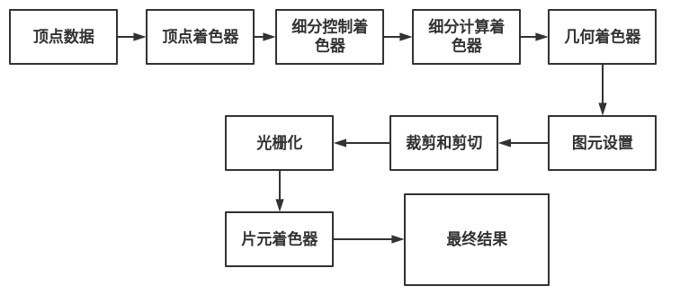

[TOC]

一个用来渲染图像的OpenGL程序需要执行的主要操作如下：
- 从OpenGL的几何图元中设置数据，用于构建形状。
- 使用不同的着色器（shader）对输入的图元数据执行计算操作，判断它们的位置、颜色，以及其他渲染属性。
- 将输入图元的数学描述转换为与屏幕位置对应的像素片元（fragment）。这一步也称作光栅化（rasterization）。（OpenGL中的片元若最终渲染为图像，那它就是像素。）
- 最后，针对光栅化过程产生的每个片元，执行片元着色器（fragment shader），从而决定这个片元的最终颜色和位置。
- 如果有必要，还需要对每个片元执行一些额外的操作，例如判断片元对应的对象是否可见，或者将片元的颜色与当前屏幕位置的颜色进行融合。

所有OpenGL程序的基本结构通常都是类似的：
- 1.初始化物体渲染所对应的状态。
- 2.设置需要渲染的物体。

渲染（render）：表示计算机从模型创建最终图像的过程。图像和顶点坐标有着密切的关系。这个关系通过绘制模式给出。常用到得绘制模式有GL_POINTS、GL_LINE_STRIP、GL_LINE_LOOP、GL_LINES、GL_TRIANGLES、GL_TRIANGLE_STRIP、GL_TRIANGLE_FAN。

-  GL_POINTS：把每一个顶点作为一个点进行处理，顶点n即定义了点n，共绘制n个点。
- GL_LINES：把每一个顶点作为一个独立的线段，顶点2n-1和2n之间共定义了n个线段，总共绘制N/2条线段。，如果N为奇数，则忽略最后一个顶点。
- GL_LINE_STRIP：绘制从第一个顶点到最后一个顶点依次相连的一组线段，第n和n+1个顶点定义了线段n，总共绘制N-1条线段。
- GL_LINE_LOOP：绘制从定义第一个顶点到最后一个顶点依次相连的一组线段，然后最后一个顶点与第一个顶点相连。第n和n+1个顶点定义了线段n，然后最后一个线段是由顶点N和1之间定义，总共绘制N条线段。
- GL_TRIANGLES：把每三个顶点作为一个独立的三角形。顶点3n-2，3n-1和3n定义了第n个三角形，总共绘制N/3个三角形。
- GL_TRIANGLE_STRIP：绘制一组相连的三角形。对于奇数点n，顶点n，n+1和n+2定义了第n个三角形；对于偶数n，顶点n+1，n和n+2定义了第n个三角形，总共绘制N-2个三角形。这是最常使用的渲染方式，第一个三角形条是由前三个顶点构成(索引0,1, 2)。第二个三角形条是由前一个三角形的两个顶点加上数组中的下一个顶点构成，继续直到整个数组结束。
- GL_TRIANGLE_FAN：绘制一组相连的三角形。三角形是由第一个顶点及其后给定的顶点所确定。顶点1，n+1和n+2定义了第n个三角形，总共绘制N-2个三角形。

OpenGL是基于光栅化的系统。还有其他渲染系统，如光线跟踪（ray tracing）。

光子映射（photon mapping）,路径跟踪（path tracing）

模型（model）   


顶点（vertex）    
3D图像的最小单位称为点（point）或者顶点vertex。它们代表三维空间中的一个点并用来建造更复杂的物体。多边形就是由点构成，而物体是由多个多边形组成。尽管通常OpenGL支持多种多边形，但OpenGLEs只支持三边形（即三角形）所以即使我们要绘制一个正方形也要把它拆分为两个三角形绘制。

坐标（coordinate）  
默认情况下，以屏幕中心为坐标轴原点。原点左方x为负值，右边为正值。原点上方y为正，原点下方为负。垂直屏幕向外为z正，垂直屏幕向里为z负。默认情况下，从原点到屏幕边缘为1.0f,沿各轴增加或减小的数值是以任意刻度进行的–它们不代表任何真实单位，如英尺，像素或米等。你可以选择任何对你的程序有意义的刻度（全局必须保持单位一致，不能一部分使用米，一部分使用像素）。OpenGL只是将它作为一个参照单位处理，保证它们具有相同的距离。

多边形（三角形）    
多边形是由点和边构成的单闭合环。 绘制多边形时需要特别注意顶点的绘制顺序，可以分为顺时针和逆时针。因为方向决定了多边形的朝向， 即正面和背面。避免渲染那些被遮挡的部分可以了有效提高程序性能。默认以逆时针次序绘制顶点的构成的面是正面。

纹理与纹理贴图    
将图像数据应用到一个几何图元时，图像称之为纹理，这种技术或者方法称为纹理贴图。或者说通过一幅图像一个多边形提供细节的技术。纹理有规格，也就是分辨率，在使用的时候需要放大或者缩小使用。这个时候会带来纹理颜色失真，所以需要使用纹理采样滤波器（texture sample filter）或者映像（Mipmap）。另外纹理作为图像数据存储会占用较大空间，使用纹理压缩来（Texture compression）存储纹理数据。

纹理映射（texture mapping）

着色管线装配（shader plumbing）

渲染管线（rendering pipeline），它是一系列数据处理过程，并且将应用程序的数据转换到最终渲染的图像。

OpenGL首先接收用户提供的几何数据（顶点和几何图元），并且将它输入到一系列着色器阶段中进行处理，这些阶段包括顶点着色、细分着色（它本身包含两个着色器）以及最后的几何着色，然后它将被送入光栅化单元（rasterizer）。光栅化单元负责对所有剪切区域（clipping region）内的图元生成片元数据，然后对每个生成的片元都执行一个片元着色器。



传递着色器（pass-through shader）， 变换矩阵（transformation matrix）

```
int main(int argc, char *argv[])
{
    glfwInit();
    GLFWwindow* window = glfwCreateWindow(640, 480, "Triangles", NULL, NULL);
    glfwMakeContextCurrent(window);
    gl3wInit();

    init();

    while (!glfwWindowShouldClose(window))
    {
        display();
        glfwSwapBuffers(window);
        glfwPollEvents();
    }

    glfwDestroyWindow(window);
    glfwTerminate();
    return 0;
}
```

 	第一个函数glfwtlnito 负责初始化GLFW库。它会处理向程序输入的命令行参数，并且移除其中与控制GLFW如何操作相关的部分（例如设置窗口的大小）。glfwInit必须是应用程序调用的第一个 GLFW 函数，它会负责设置其他 GLFW 例程所必需的数据结构。

​	glfwCreateWindow设置了程序所使用的窗口类型以及期望的窗口尺寸。如果我们不想在这里设置一个固定值的话，也可以先查询显示设备的尺寸，然后根据计算机的屏幕大小动态设置窗口的大小。

​	glfwCreateWindow还创建了一个与窗口关联的OpenGL设备环境。在使用环境之前，我们必须设置它为当前环境。在一个程序中，我们可以设置多个设备环境以及多个窗口，而用户指令只会传递到当前设备环境中。

 	继续讨论这个例子，接下来会调用gl3wlnit函数，它属于我们用到的另一个辅助库GL3W。 GL3W可以简化获取函数地址的过程，并且包含了可以跨平台使用的其他一OpenGL 编程方法。如果没有GL3W，我们可能还需要执行相当多的工作才能够运行程序。

​	main函数中调用的最后一个指令是一个无限执行的循环、窗口和操作系统的用户输入等操作。在循环中我们会判断是否需要关闭窗口（通过调用glfwWindowShouldClose），重绘它的内容，并且展现给最终用户（通过调用glfwSwapBtuffer）然后检查操作系统返回的任何信息（通过调用glfwPollEvents）。如果我们认为需要关闭窗口，应用程序需要退出的话，会调阿glfwDestroyWindow来清理窗口，然后调用glfwTerminate关闭GLFw 库。

```
void init (void)
{
    static const GLfloat vertices[NumVertices][2] =
    {
      {-0.90, -0.90},
      { 0.85, -0.90},
      {-0.90,  0.85},
      { 0.90, -0.85},
      { 0.90,  0.90},
      {-0.85,  0.90}
    };
    glCreateBuffers(NumBuffers, Buffers);
    glNamedBufferStorage(Buffers[ArrayBuffer], sizeof(vertices), vertices, 0);

    ShaderInfo shaders[] = {
        { GL_VERTEX_SHADER, "triangles.vert"},
        { GL_FRAGMENT_SHADER, "triangles.frag"},
        { GL_NONE, NULL}
    };

    GLuint program = LoadShaders(shaders);
    glUseProgram(program);

    glGenVertexArrays(NumVAOs, VAOs);
    glBindVertexArray(VAOs[Triangles]);
    glBindBuffer(GL_ARRAY_BUFFER, Buffers[ArrayBuffer]);
    glVertexAttribPointer(vPosition, 2, GL_FLOAT, GL_FALSE, 0, BUFFER_OFFSET(0));
    glEnableVertexAttribArray(vPosition);
}
```

## OpenGL的初始化过程

**初始化顶点数组对象**

​	在init中使用了不少函数和数据。在函数的起始部分，我们调用glCreateVertexArrays分配了顶点数组对象（vertex-array object）。OpenGL会因此分配一部分顶点数组对象的名称供我们使用，在这里共有NumVAOs个对象，即这个全局变量所指代的数值。glCreateVertexArrays的第二个参教返回的是对象名的数组，也就是这里的 VAOs。

​	我们对glCreatevertexArrays 函数的完整解释如下：

```
void glCreateVertexArrays(GLsizei n, GLuint* arrays);
返回n个未使用的对象名到数组arrays中，用作顶点数组对象。返回的名字可以用来分配更多的缓存对象，并且它们已经使用未初始化的顶点数组集合的默认状态进行了数值的初始化。如果n是负数，产生GL_INVALID_VALUE错误。 
```

 我们会发现很多OpenGL 命令都是glCreate*的形式，它们负责分配不同类型的OpenGL对象的名称。这里的名称类似 C 语言中的一个指针变量，我们可以分配内存对象并且用名称引用它。当我们得到对象之后，可以将它绑定（bind）到OpenGL 环境以便使用。在这个例子中，我们通过glBindVertexArray 函数创建并且绑定了一个顶点数组对象。

```
void glBindVertexArray(GLuint array);
	glBindVertexArray完成了两项工作。如果输入的变量array非O，并且是glCreateVertexArrays所返回的，那么会激活这个顶点数组对象，并且直接影响对象中所保存的顶点数组状态。如果输入的变量array为O，那么OpenGL将不再使用之前绑定的顶点数组。
	 如果arrat不是glCreateVertexArrays所返回的数值，或者它已经被glDeleteVertexArrays函数释放了，那么这里将产生一个GL_INVALID_OPERATION错误。
```

 	总体上来说，在两种情况下我们需要绑建一个对象：创建对象并初始化它所对应的数据时；以及每次我们准备使用这个对象，而它并不是当前绑定的对象时。

​	由于示例程序需要尽量短小，因此我们不打算做任何多余的操作。举例来说，在较大的程序里当我们完成对顶点数组对象的操作之后，是可以调用glDeleteVertexArrays将它释放的。

```
void glDeleteVertexArrays(GLsizei n, const GLuint* arrays);
	删除n个在arrays中定义的顶点数组对象，这样所有的名称可以再次用作顶点数组。如果绑定的顶点数组已经被删除，那么当前绑定的顶点数组对象被重设为 0（类似执行了glBindBuffer函数，并且输人参数为0），并且不再存在一个当前对象。在arrays当中未使用的名称都会被释放，但是当前顶点数组的状态不会发生任何变化。
```

​	最后，为了确保程序的完整性，我们可口调用gllsVertexArray检查某个名称是否已经被保留为一个顶点数组对象了。

```
GLboolean gllsVertexArray(GLuint array);
	如果array是一个已经用glCreateVertexArrays创建且没有被删除的顶点数组对象的名称，那么返回GL_TRUE。如果array为0或者不是任何顶点数组对象的名称，那么返回GL_FALSE。
```


