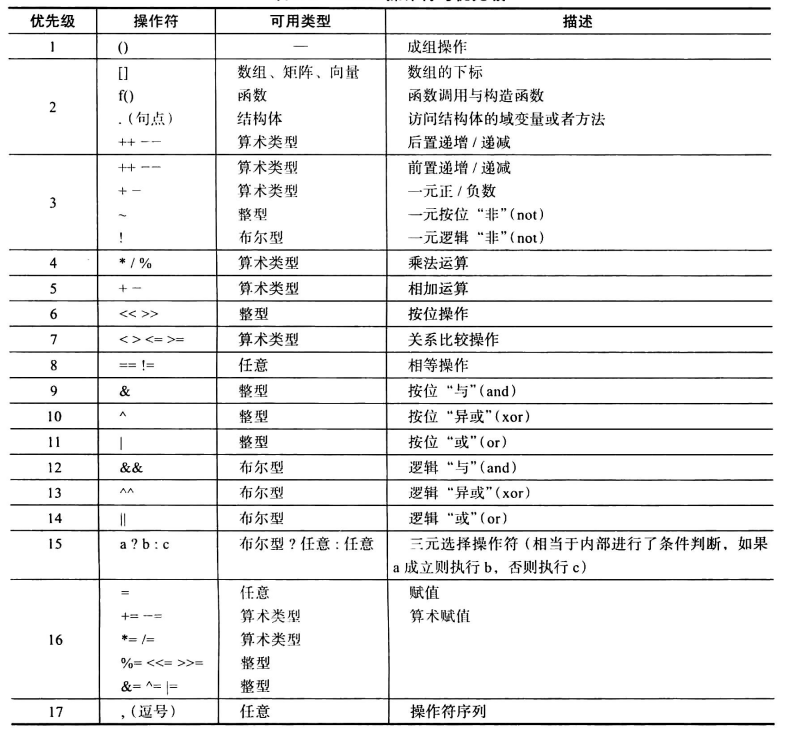
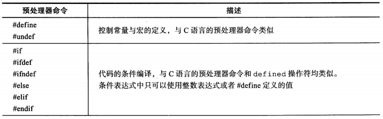

[TOC]

兼容模式(compatibility profile) 环境

GLSL,也就是OpenGL Shading Language

​	任何一种OpenGL程序本质上都可以被分为两个部分：CPU端运行的部分， 釆用C++之类的语言进行编写；以及GPU端运行的部分，使用GLSL语言编写。


# OpenGL的可编程管线

4.5版本的图形管线有4个处理阶段， 还有1个通用计算阶段，每个阶段都需要由一个专门的着色器进行控制。

- 1）顶点着色阶段(vertex shading stage)将接收你在顶点缓存对象中给出的顶点数据， 独立处理每个顶点。这个阶段对于所有的OpenGL程序都是唯一且必需的，并且OpenGL 程序在绘制时必须绑定一个着色器。
- 2）细分着色阶段(tessellation shading stage)是一个可选的阶段，与应用程序中显式地指定几何图元的方法不同，它会在OpenGL管线内部生成新的几何体。这个阶段启用之后， 会收到来自顶点着色阶段的输出数据，并且对收到的顶点进行进一步的处理。细分阶段实际上是通过两个着色器来完成的，分别叫做细分控制着色器(tessellation control shader)和细分赋值着色器(tessellation evaluation shader) 。我们使用“细分着色器”来表达这两个着色阶段中的任意一个，或者它们全部。有的时候也会用控制着色器(control shader)和赋值着色器(evaluation shader)来简短地表达这两个阶段。
- 3）几何着色阶段(geometry shading stage)也是一个可选的阶段，它会在OpenGL管 线内部对所有几何图元进行修改。这个阶段会作用于每个独立的几何图元。此时你可以选择从输入图元生成更多的几何体，改变几何图元的类型(例如将三角形转化为线段)，或者 放弃所有的几何体。如果这个阶段被启用，那么几何着色阶段的输入可能会来自顶点着色 阶段完成几何图元的顶点处理之后，也可能来自细分着色阶段生成的图元数据(如果它也被 启用)。
- 4）OpenGL着色管线的最后一个部分是片元着色阶段(fragment shading stage)o这个阶段会处理OpenGL光栅化之后生成的独立片元(如果启用了采样着色的模式，就是釆样数据)，并且这个阶段也必须绑定一个着色器。在这个阶段中，计算一个片元的颜色和深度值，然后传递到管线的片元测试和混合的模块。
- 5）计算着色阶段(compute shading stage)和上述阶段不同，它并不是图形管线的一部分，而是在程序中相对独立的一个阶段。计算着色阶段处理的并不是顶点和片元这类图形数据，而是应用程序给定范围的内容。计算着色器在应用程序中可以处理其他着色器程序所创建和使用的缓存数据。这其中也包括帧缓存的后处理效果，或者我们所期望的任何事物。

一个重要的概念，就是着色阶段之间数据传输的方式。

GLSL 每个着色器看起来都像是一个完整的C程序，它的输入点就是一个名为 main()的函数。但与C不同的是，GLSL的main()函数没有任何参数，在某个着色阶段中输入和输出的所有数据都是通过着色器中的特殊全局变量来传递的(请不要将它们与应用程序中的全局变量相混淆——着色器变量与你在应用程序代码中声明的变量是完全不相干的)。

一个简单的顶点着色器：

```
#version 450 core

in vec4 vPosition；
in vec4 vColor；
out vec4 color；

uniform mat4 ModelViewProjectionMatrix;

void
main()
{
	color = vColor；
	gl__Position = ModelViewProjectionMatrix * vPosition；
}
```

​	OpenGL还定 义了 in变量将数据拷贝到着色器中，以及out变量将着色器的内容拷贝出去。这些变量的值会在OpenGL每次执行着色器的时候更新(如果OpenGL处理的是顶点，那么这里会为每个顶点传递新的值；如果是处理片元，那么将为每个片元传递新值)。另一类变量是直接 从OpenGL应用程序中接收数据的，称作uniform变量。uniform变量不会随着顶点或者 片元的变化而变化，它对于所有的几何体图元的值都是一样的，除非应用程序对它进行了更新。

# OpenGL着色语言概述

## 使用GLSL构建着色器

一个着色器程序和一个C程序类似，都是从main()函数开始执行的。每个GLSL着色器程序一开始都如下所示：

```
#version 330 core

void
main()
{
	//在这里编写代码
}
```

​	这里的//是注释符号，它到当前行的末尾结束，这一点与c语言一致。此外，着色器程序也支持C语言形式的多行注释符号/\*和\*/。但是，与ANSIC语言不同，这里的 main()函数不需要返回一个整数值，它被声明为void。此外，着色器程序与C语言以及衍生的各种语言相同，每一行的结尾都必须有一个分号。


**变量的声明**

​	GLSL是一种强类型语言，所有变量都必须事先声明，并且要给出变量的类型。变量名称的命名规范与C语言相同：可以使用字母、数字，以及下划线字符（_）来组成变量的名字。但是数字不能作为变量名称的第一个字符。 此外，变量名称也不能包含连续的下划线（这些名称是GLSL保留使用的）。

| 类型   | 描述                       |
| ------ | -------------------------- |
| float  | IEEE 32位浮点数            |
| double | IEEE 64位浮点数            |
| int    | 有符号二进制补码的32位整数 |
| uint   | 无符号的32位整数           |
| bool   | 布尔值                     |

​	这些类型（以及后文中它们的聚合类型）都是透明的。也就是说，它们的内部形式都是暴露出来的，因此着色器代码中可以假设其内部的构成方式。与之对应的一部分类型，称作不透明类型，它们的内部形式没有暴露出来。这些类型包括釆样器（sampler）、图像（image），以及原子计数器（atomic counter）。它们所声明的变量相 当于一个不透明的句柄，可以用来读取纹理贴图、图像，以及原子计数器数据。

**变量的作用域**

虽然所有的变量都需要声明，但是我们可以在使用它们之前的任何时候声明这些变量 （这一点与C++一致）。我们可以对照C++的语法来了解GLSL变量的作用域规则，如下 所示：

- 在任何函数定义之外声明的变量拥有全局作用域，因此对着色器程序中的所有函数都是可见的。

- 在一组大括号之内（例如函数定义、循环或者“if”引领的代码块等）声明的变量， 只能在大括号的范围内存在。

- 循环的迭代自变量，例如，下面的循环中的i：

```
for （int i = 0; i < 10； ++i） （
	//循环体
}
```

只能在循环体内起作用。


**变量的初始化**

所有变量都必须在声明的同时进行初始化。例如：

```
int i, numParticles = 1500；
float force, **g =** -9.8；
bool falling = true；
double pi = 3.1415926535897932384626LF;
```

​	整型字面量常数可以表示为八进制、十进制或者十六进制的值。我们也可以在数字之前加上一个符号来表示负数，或者在末尾添加“u”或者“U”来表示一个无符号的整数。

​	浮点字面量必须包含一个小数点，除非我们用科学计数法来表示它，例如3E-7 (不过， 很多时候我们也可以将一个整数隐式地转换为一个浮点数)。此外，浮点数也可以选择在末尾添加一个“f”或者“F”后缀，这一点与C语言中浮点数的表示法相同。如果要表达一 个double精度的浮点数，必须在末尾添加后缀“1F”或者“LF”。

​	布尔变量可以是true或者false,对它进行初始化的时候，可以直接指定这两个值之一，也可以对一个布尔表达式进行解析并且将结果赋予变量。

**构造函数**

正如前面提到的，GLSL比C++更注重类型安全，因此它支持的数值隐式转换更少一 些。例如，

`int f = false；`

这样的写法会返回一个编译错误，因为布尔值不能赋予整型变量。可以进行隐式转换的类型如表所示：

所需的类型 | 可以从这些类型隐式转换
--- | ---
uint | int
float | int 、uint
double | int、uint、float

​	上面的类型转换适用于这些类型的标量、向量以及矩阵。转换不会改变向量或者矩阵本身的形式，也不会改变它们的组成元素数量。类型转换不能应用于数组或者 结构体之上。所有其他的数值转换都需要提供显式的转换构造函数。这里构造函数的意义与C++等语言类似，它是一个名字与类型名称相同的函数，返回值就是对应类型的值。例如：

`float f = 10.0;`

`int ten = i nt (f)；`

​	这里用到了一个int转换构造函数来完成转换。此外，其他一些类型也有转换构造函 数，包括float、double、uint、bool，以及这些类型的向量和矩阵。每种构造函数都可以传入多个其他类型的值并且进行显式转换。这些函数也体现了 GLSL的另一个特性： 函数重载，即每个函数都可以接受不同类型的输入，但是它们都使用了同一个基函数名称。 

**聚合类型**

​	GLSL的基本类型可以进行合并，从而与核心OpenGL的数据类型相匹配，以及简化计算过程的操作。首先，GLSL支持2个、3个以及4个分量的向量，每个分量都可以使用bool、int、uint、f loat和double这些基本类型。此外，GLSL也支持f loat和double类型的 矩阵。下表给出了所有可用的向量和矩阵类型。

| 基本类型 | 2D向量 | 3D向量 | 4D向量 | 矩阵类型  |           |              |
| -------- | ------ | ------ | ------ | --------- | --------- | ------------ |
| float    | vec2   | vec3   | vec4   | mat2      | mat3      | mat4         |
|          |        |        |        | mat2 x 2  | mat2 x 3  | mat2 **x** 4 |
|          |        |        |        | mat3 x 2  | mat3 x 3  | mat3 x 4     |
|          |        |        |        | mat4 x 2  | mat4 x 3  | mat4 x 4     |
| double   | dvec2  | dvec3  | dvec4  | dmat2     | dmat3     | dmat4        |
|          |        |        |        | dmat2 x 2 | dmat2 x 3 | dmat2 x 4    |
|          |        |        |        | dmat3 x 2 | dmat3 x 3 | dmat3 x 4    |
|          |        |        |        | dmat4 x 2 | dmat4 x 3 | dmat4 x 4    |
| int      | ivec2  | ivec3  | ivec4  | 一        | 一        | 一           |
| uint     | uvec2  | uvec3  | uvec4  | 一        | 一        | 一           |
| bool     | bvec2  | bvec3  | bvec4  | 一        | 一        | 一           |

​	矩阵类型需要给出两个维度的信息，例如mat4x3，其中第一个值表示列数，第二个值表示行数。使用这些类型声明的变量的初始化过程与它们的标量部分是类似的：

`vec3 velocity = vec3(0.0, 2.0, 3.0);`

类型之间也可以进行等价转换：

`ivec3 steps = ivec3(velocity);`

​	向量的构造函数还可以用来截短或者加长一个向量。如果将一个较长的向量传递给一个较短向量的构造函数，那么向量将被自动取短到对应的长度。

```
vec4 color；
vec3 RGB = vec3 (color) ; //现在RGB只有前三个分量了
```

​	类似地，也可以使用同样的方式来加长一个向量。这也是唯一的一类构造函数，它的 输入参数比变量的实际分量数更少。

```
vec3 white = vec3(1.0) **；**	// white = (1.0, 1.0 z 1.0)
vec4 translucent = vec4(white, 0.5)；
```

​	矩阵的构建方式与此相同，并且可以将它初始化为一个对角矩阵或者完全填充的矩阵。 对于对角矩阵，只需要向构造函数传递一个值，矩阵的对角线元素就设置为这个值，其他元素全部设置为0,例如：
$$
m = mat3(4.0) = 

\begin{pmatrix}
 4.0 & 0.0  & 0.0 \\ 
 0.0&  4.0& 0.0\\ 
 0.0& 0.0 &4.0 
\end{pmatrix}
$$


​	矩阵也可以通过在构造函数中指定每一个元素的值来构建。传入元素可以是标量和向量的集合，只要给定足够数量的数据即可，每一列的设置方式也遵循这样的原则。此外, 矩阵的指定需要遵循列主序的原则，也就是说，传入的数据将首先填充列，然后填充行(这 一点与C语言中二维数组的初始化是相反的)。

例如，可以通过下面几种形式之一来初始化一个3 x 3的矩阵:

```
mat3 M = mat3(1.0, 2.0, 3.0,
			  4.0, 5.0, 6.0,
			  7.0, 8.0, 9.0);
vec3 column1 = vec3(1.0, 2.0, 3.0);
vec3 column2 = vec3(4.0, 5.0, 6.0);
vec3 column3 = vec3(7.0, 8.0, 9.0);

mat3 M = mat3(columnl, column2, column3);
```
甚至是
```
vec2 columnl = vec2(1.0, 2.0);
vec2 column2 = vec2(4.0, 5.0);
vec2 column3 = vec2(7.0, 8.0);

mat3 M = mat3(columnl, 3.0, 
column2, 6.0,
column3, 9.0);
```

得到的结果都是一样的。


**访问向量和矩阵中的元素**

​	向量与矩阵中的元素是可以单独访问和设置的。向量支持两种类型的元素访问方式: 使用分量的名称，或者数组访问的形式。矩阵可以以二维数组的形式进行访问。向量中的各个分量是可以通过名称进行访问的，例如：

```
float red = color.r；
float v_y = velocity.y;
```

​	或者通过一个从0开始的索引。下面的代码与上面的结果是完全等价的:
```
float red = color[0];
float v_y = velocity[1];
```
​	事实上，正如下表所示，分量的名称总共有三种形式的集合，它们实现的工作是一样的。不同的名称集合只是为了在使用时便于区分不同的操作。

| 分量访问符   | 符号描述             |
| ------------ | -------------------- |
| (x, y, z, w) | 与位置相关的分量     |
| (r, g, b, a) | 与颜色相关的分量     |
| (s, t, p, q) | 与纹理坐标相关的分量 |

​	这种分量访问符的一个常见应用叫做swizzle，对于颜色的处理，比如颜色空间的转换时 可能会用到它。例如，可以通过下面的代码，基于输入颜色的红色分量来设置一个亮度值：

`vec3 luminance = color.rrr;`

类似地，如果需要改变向量中分量各自的位置，可以这样做:

`color = color .abgr； // 反转 color 的每个分量`

唯一的限制是，在一条语句的一个变量中，只能使用一种类型的访问符。也就是说， 下面的代码是错误的：

`vac 4 color = otherColor. rgz ； //错误："z”来自不同的访问符集合`

此外，如果我们访问的元素超出了变量类型的范围，也会引发编译时错误。例如：

```
vec2 pos;
float zPos = pos. z ； //错误：2D向量不存在“z"分量
```

矩阵元素的访问可以使用数组标记方式。或者从矩阵中直接得到一个标量值，或者一 组元素：

```
mat4 m = mat4(2.0);
vec4 zVec = m[2];	//获取矩阵的第2列
float yScale = m[l][1] ;	// 也可以使用 m[1] .y
```


**结构体**

​	你也可以从逻辑上将不同类型的数据组合到一个结构体当中，结构体可以简化多组数据传入函数的过程。如果定义了一个结构体，那么它会自动创建一个新类型，并且隐式定义一个构造函数，将各种类型的结构体元素作为输入参数。

```
struct Particle {
	float lifetime；
	vec3 position;
	vec3 velocity；
}；
Particle p = Particle(10.0, pos, vel); //pos、vel均为vec3s 类型
```
	与C语言中的用法类似，如果我们需要引用结构体的某个元素，可以直接使用“点”(.)符号。


**数组**

​	GLSL还支持任意类型的数组，包括结构体数组。和C语言相同，数组的索引可以通过方括号来完成([])。一个大小为n的数组的元素范围是`0`到`n-1` 。但是与C语言中不同的是，负数形式的数组索引，或者超出范围的索引值都是不允许的。GLSL4.3中，数组的组成元素也可以是另一个数组，因此可以处理多维度的数据。不过，GLSL4.2和更早的版本不允许建立数组类型的数组(因此无法创建多维度的数组)。

​	数组可以定义为有大小的，或者没有大小的。我们可以使用没有大小的数组作为一个 数组变量的前置声明，然后重新用一个合适的大小来声明它。数组的声明需要用到方括号 的形式，例如：

```
float coeff[3]; // 有 3 个 float 元素的数蛆
float[3] coeff; // 与上面相同
int indices[]; //未定义维数，稍后可以重新声明它的维数
```

​	数组属于GLSL中的第一等(first-class)类型，也就是说它有构造函数，并且可以用作函数的参数和返回类型。如果我们要静态初始化一个数组的值，那么可以按照下面的形式来使用构造函数:

`float. coeff [3 ] = float[3](2.38, 3.14, 42.0);`

这里构造函数的维数值可以不填。

​	此外，GLSL的数组与Java类似，它有一个隐式的方法可以返回元素的个数：即取长 度的方法length()。如果我们需要操作一个数组中所有的值，可以根据下面的例子来使用 length()方法：

```
for (int i = 0; i < coeff.length(); ++i){
	coeff[i] *= 2.0;
}
```


​	向量和矩阵类型也可以使用length()方法。向量的长度也就是它包含的分量的个数， 矩阵的长度是它包含的列的个数。事实上，当我们使用数组的形式来索引向量和矩阵的值的时候(例如，m[2]是矩阵m的第三列)，这个方法返回的就是我们需要的数据。

```
mat3x4 m;
int c = m.length();        //m包含的列数为3
int r = m[0].length();     //第0个列向量中分量的个数为4
```

​	因为长度值在编译时就是已知的，所以length()方法会返回一个编译时常量，我们可 以在需要使用常量的场合直接使用它，例如：

```
mat4 m;
float diagonal[m.length()];     //设置数组的大小与矩阵大小相等
float x[gl_in.length()];        //设置数组的大小与几何着色器的输入顶点数相等
```

​	对于所有向量和矩阵，以及大部分的数组来说，length()都是一个编译时就已知的常量。 但是对于某些数组来说，length()的值在链接之前可能都是未知的。如果使用链接器来减少同一阶段中多个着色器的大小，那么可能发生这种情况。对于着色器中保存的缓存对象 (使用buffer来进行声明，后文将会介绍)，length()的值直到渲染时才可能得到。如果我们需要length()返回一个编译时常量，那么我们需要保证着色器中的数组大小在使用它的 length()方法之前就已经确定了。

​	多维数组相当于从数组中再创建数组，它的语法与C语言当中类似：

```
float coeff[3][5];  //一个大小为3的数组，其中包含了大小为5的多个数组 
coeff[2][1] *= 2.0;  //内层索引设置为1,外层设置为2
coeff.length();      //这个方法会返回常量3
coeff[2];           //这是一个大小为5的一维数组
coeff[2].length();  //这个方法会返回常量5
```

​	多维数组可以使用任何类型或者形式来构成。如果需要与应用程序共享，那么最内层 (最右侧)维度的数据在内存布局中的变化是最快的。

## 存储限制符

​	数据类型也可以通过一些修饰符来改变自己的行为。GLSL中一共定义了几种全局范围内的修饰符，如下表所示。

| 类型修饰符 | 描述                                                         |
| ---------- | ------------------------------------------------------------ |
| const      | 将一个变量定义为只读形式。如果它初始化时用的是一个编译时常量，那么它本身也会成为编译时常量 |
| in         | 设置这个变量为着色器阶段的输入变量                           |
| out        | 设置这个变量为着色器阶段的输出变量                           |
| uniform    | 设置这个变量为用户应用程序传递给着色器的数据，它对于给定的图元而言是一个常量 |
| buffer     | 设置应用程序共享的一块可读写的内存。这块内存也作为着色器中的存储缓存(storage buffer)使用 |
| shared     | 设置变量是本地工作组(local work group)中共享的。它只能用于计算着色器中 |

**const存储限制符**

​	与C语言中相同，const类型的修饰符设置变量为只读类型。例如，下面的语句 

`const float Pi = 3.141529;`

​	会设置一个变量Pi为圆周率$\pi$的近似值。对变量的声明添加了 const修饰符之后，如 果再向这个变量写入，那么将会产生一个错误，因此这种变量必须在声明的时候就进行初始化。

**in存储限制符**

​	in修饰符用于定义着色器阶段的输入变量。这类输入变量可以是顶点属性(对于顶点着色器)，或者前一个着色器阶段的输出变量。片元着色器也可以使用一些其他的关键词来限定自己的输入变量。

**out存储限制符**

​	out修饰符用于定义一个着色器阶段的输出变量——例如，顶点着色器中输出变换后的齐次坐标，或者片元着色器中输出的最终片元颜色。

**uniform存储限制符**

​	在着色器运行之前，uniform修饰符可以指定一个在应用程序中设置好的变量，它不会在图元处理的过程中发生变化。uniform变量在所有可用的着色阶段之间都是共享的， 它必须定义为全局变量。任何类型的变量(包括结构体和数组)都可以设置为uniform变 量。着色器无法写入到uniform变量，也无法改变它的值。举例来说，我们可能需要设置一个给图元着色的颜色值。此时可以声明一个uniform 变量，将颜色值信息传递到着色器当中。而着色器中会进行如下声明：

`uniform vec4 BaseColor；`

​	在着色器中，可以根据名字BaseColor来引用这个变量，但是如果需要在用户应用程序中设置它的值，还需要多做一些工作。GLSL编译器会在链接着色器程序时创建一个uniform变量列表。如果需要设置应用程序中BaseColor的值，我们需要首先获得BaseColor在列表中的索引，这一步可以通过glGetUniformLocation()函数来完成。

```
GLint glGetUniformLocation(GLuint program, const char* name);

    返回着色器程序中uniform变量name对应的索引值。name是一个以NULL结尾的字符串，不存在空格。如果name与启用的着色器程序中的所有uniform变量都不相符，或者name是一个内部保留的着色器变量名称(例如，以gl_开头的变量)，那么返回值为-1。
	name可以是单一的变量名称、数组中的一个元素(此时name主要包含方括号以及对应的索引数字)，或者结构体的域变量(设置name时，需要在结构体变量名称之后添加符号，再添加域变量名称，并与着色器程序中的写法一致)。对于uniform变量数组， 也可以只通过指定数组的名称来获取数组中的第一个元素(例如，直接用“arrayName”)， 或者也可以通过指定索引值来获取数组的第一个元素(例如，写作“arrayName[O]”)。
	除非我们重新链接着色器程序(参见gILinkProgramO),否则这里的返回值不会发生变化。
```

​	当得到uniform变量的对应索引值之后，我们就可以通过glUniform\*()或者glUniformMatrix\*()系列函数来设置uniform变量的值了。如下是一个获取uniform变量的索引并且设置具体值的示例。

```
GLint timeLoc; /*着色器中的uniform变量time的索引*/
GLfloat timeValue； /* 程序运行时间 */
timeLoc = glGetUniformLocation(program, "time"); 
glUniformlf(timeLoc, timeValue)；
```
```
void glUniform (1234} {fdi ui}(GLint location, TYPE value);
void glUniform (1234) (fdi ui}v(GLint location, GLsizei count, const TYPE* values); 
void glUniformMatrix{234} {fd}v(GLint location, GLsizei count, GLboolean transpose, const GLfloat* values);
void glUniformMatrix{2x3,2x4,3x2,3x4,4x2,4x3}{fd}v(GLint location, GLsizei count, GLboolean transpose, const GLfloat* values);

	设置与location索引位置对应的uniform变量的值。其中向量形式的函数会载入 count个数据的集合(根据glUniform\*()的调用方式，读入1 ~ 4个值)，并写入location 位置的uniform变量。如果location是数组的起始索引值，那么数组之后的连续count个元素都会被载入。
	GLfloat形式的函数(后缀中有f)可以用来载入单精度类型的浮点数、float类型的向量、float类型的数组、或者float类型的向量数组。与之类似，GLdouble形式的函数 （后缀中有d）可以用来载入双精度类型的标量、向量和数组。GLfloat形式的函数也可以载入布尔数据。
	GLint形式的函数（后缀中有i）可以用来更新单个有符号整型、有符号整型向量、有符号整型数组，或者有符号整型向量数组。此外，可以用这种形式载入独立纹理釆样器或者纹理数组、布尔类型的标量、向量和数组。与之类似，GLuint形式的函数（后缀中有ui）也可以用来载入无符号整型标量、向量和数组。
	对于glUniformMatrix{234}*()系列函数来说，可以从values中读入2x2、3x3 或者4x4个值来构成矩阵。
	对于 glUniformMatrix{2x3,2x4,3x2,3x4,4x2,4x3}*()系列函数来说，可以从 values 中读入对应矩阵维度的数值并构成矩阵。如果transpose设置为GL_TRUE，那么values 中的数据是以行主序的顺序读入的（与C语言中的数组类似），如果是GL_FALSE，那么 values中的数据是以列主序的顺序读入的。
```

**buffer存储限制符**

​	如果需要在应用程序中共享一大块缓存给着色器，那么最好的方法是使用buffer变量。它与uniform变量非常类似，不过也可以用着色器对它的内容进行修改。通常来说， 需要在一个buffer块中使用buffer变量。

​	buffer修饰符指定随后的块作为着色器与应用程序共享的一块内存缓存。这块缓存对于着色器来说是可读的也是可写的。缓存的大小可以在着色器编译和程序链接完成后设置。

**shared存储限制符**

​	shared修饰符只能用于计算着色器当中，它可以建立本地工作组内共享的内存。

## 语句

​	着色器的真正工作是计算数值以及完成一些决策工作。与C++中的形式类似，GLSL 也提供了大量的操作符，来实现各种数值计算所需的算术操作，以及一系列控制着色器运 行的逻辑操作。

**算术操作符**

​	任何一种语言的教程如果缺少有关操作符以及优先级的介绍（参见下表），那么这个教程是不完整的。表中操作符的优先级采取降序排列。总体上来说，操作符对应的类型必须是相同的，并且对于向量和矩阵而言，操作符的操作对象也必须是同一维度的。在表中注明的整型包括int和uint，以及对应的向量；浮点数类型包括float和double，以及对应的向量与矩阵；算术类型包括所有的整型和浮点数类型，以及所有相关的结构体和数组。

| 优先级 | 操作符                    | 可用类型                            | 描述                                                         |
| ------ | ------------------------- | ----------------------------------- | ------------------------------------------------------------ |
| 1      | 0                         | —                                   | 成组操作                                                     |
| 2      | [] f().(句点)++——         | 数组、矩阵、向量 函数结构体算术类型 | 数组的下标函数调用与构造函数访问结构体的域变量或者方法后置递增/递减 |
| 3      | -H	4--!                | 算术类型 算术类型 整型 布尔型       | 前置递增/递减 一元正/负数 一元按位“非”（not） 一元逻辑“非”（noi） |
| 4      | */%                       | 算术类型                            | 乘法运算                                                     |
| 5      | + -                       | 算术类型                            | 相加运算                                                     |
| 6      | « »                       | 整型                                | 按位操作                                                     |
| 7      | <><=>=                    | 算术类型                            | 关系比较操作                                                 |
| 8      | ==!=                      | 任意                                | 相等操作                                                     |
| 9      | &                     | 整型                                | 按位“与M (and)                                               |
| 10     | A                         | 整型                                | 按位,'异或”（xor）                                           |
| 11     | 1                         | 整型                                | 按位"或"（or）                                               |
| 12     | &&                        | 布尔型                              | 逻辑“与”（and）                                              |
| 13     | ^^             | 布尔型                              | 逻辑“异或”（xor）                                            |
| 14     | II                        | 布尔型                              | 逻辑“或”（or）                                               |
| 15     | a ? b : c                 | 布尔型？任意：任意                  | 三元选择操作符（相当于内部进行了条件判断，如果 a成立则执行b,否则执行c） |
| 16     | +=—=*= /=%= «= »=&=人=\|= | 任意算术类型 算术类型 整型 整型     | 赋值 算术赋值                                                |
| 17     | ,（逗号）                 | 任意                                | 操作符序列                                                   |



**操作符重载**

​	GLSL中的大部分操作符都是经过重载的，也就是说它们可以用于多种类型的数据操作。特别是，矩阵和向量的算术操作符（包括前置和后置的递增/递减符号"++”和“--” ）在GLSL中都是经过严格定义的。例如，如果我们需要进行向量和矩阵之间的乘法 （注意，操作数的顺序非常重要，从数学上来说，矩阵乘法是不遵循交换律的），可以使用下 面的操作：

```
vec3 v;
mat3 m;
vec3 result = v * m;
```

​	基本的限制条件是要求矩阵和向量的维度必须是匹配的。此外，也可以对向量或者矩阵执行标量乘法，以得到希望的结果。一个必须要提及的例外是，两个向量相乘得到的是一个逐分量相乘的新向量，但是两个矩阵相乘得到的是通常矩阵相乘的结果。

```
vec2 a, b, c;
mat2 m, u, v;
c = a * b;   // c = (a.x*b.x, a.y*b.y)
m = u * v;   // m = (u00*v00+u01*v10  u00*v01+u01*v11
                     u01*v00+u11*v10  u10*v01+u11*v11)  
```

​	我们还可以通过函数调用的方式实现常见的一些向量操作(例如，点乘和叉乘)，以及各种逐分量执行的向量和矩阵操作。

**流控制**

​	GLSL的逻辑控制方式用的也是流行的if-else和switch语句。与C语言中的方式相同， else的分支是可选的，并且有多行语句时必须用到语句块：

```
if (truth) {
	//条件为true的分支
}
else {
	//条件为false的分支
}
```
​	switch语句的使用(从GLSL1.30开始)与C语言中也是类似的，可以釆用下面的方式： 

```
switch (int_value) {
	case n：
		//语句 
		break；
	case m：
		//语句
		break;
	default:
		//语句 
		break；
}
```

​	GLSL的switch语句也支持“fall-through”形式：一个case语句如果没有使用break 结尾，那么会继续执行下一个case的内容。每个case都需要执行一些语句，直到整个 switch块结束(在右花括号之前)。此外，与C++当中不同的是，GLSL不允许在第一个 case之前添加语句。如果所有的case条件都不符合，那么将会找到并执行default分支中的 内容。

**循环语句**

​	GLSL支持C语言形式的for、while和do ...while循环。其中for循环可以在循环初始化条件中声明循环迭代变量。此时迭代变量的作用域只限于循环体内。

```
for (int i = 0； i < 10; ++i) (
	...
}
while (n < 10) (
	...
}
do (
	...
} while (n < 10);
```

**流控制语句**

​	除了条件和循环之外，GLSL还支持一些别的控制语句。下表所示为其他可用的流控制语句。

| 语句            | 描述                                                         |
| --------------- | ------------------------------------------------------------ |
| break           | 终止循环体的运行，并且继续执行循环体外的内容                 |
| continue        | 终止循环体内当前迭代过程的执行，跳转到代码块开始部分并继续执行下一次迭代的内容 |
| return ［结果 J | 从当前子例程返回，可以带有一个函数返回值(返回值必须与函数声明的返回类型相符) |
| discard         | 丢弃当前的片元，终止着色器的执行。discard语句只在片元着色器中有效 |

​	discard语句只适用于片元着色器中。片元着色器的运行会在discard语句的位置上立即 终止，不过这也取决于具体的硬件实现。

**函数**

​	我们可以使用函数调用来取代可能反复执行的通用代码。这样当然可以减少代码的总 量，并且减少发生错误的机会。GLSL支持用户自定义函数，同时它也定义了一些内置函数， 具体列表可以参见附录C。用户自定义函数可以在单个着色器对象中定义，然后在多个着 色器程序中复用。

**声明**

​	函数声明语法与C语言非常类似，只是变量名需要添加访问修饰符：

```
returnType functionName([accessModifier] typel variablel,
                        [accessModifier] type2 varaible2,
                               ...)

{
	//函数体
	return returnValue； // 如果 returnType为void,则不需要 return 语句
}
```

​	函数名称可以是任何字符、数字和下划线字符的组合，但是不能使用数字、连续下划 线或者gl_作为函数的开始。返回值可以是任何内置的GLSL类型，或者用户定义的结构体和数组类型。返回值为数组时，必须显式地指定其大小。如果一个函数的返回值类型是void，那么它可以没有返 回值。函数的参数也可以是任何类型，包括数组(但是也必须设置数组的大小)。

​	在使用一个函数之前，必须声明它的原型或者直接给岀函数体。GLSL的编译器与C++ 一致，必须在使用函数之前找到函数的声明，否则会产生错误。如果函数的定义和使用不在同一个着色器对象当中，那么必须声明一个函数原型。函数原型只是给出了函数的形式， 但是并没有给出具体的实现内容。下面是一个简单的例子：

`float HornerEvalPolynomial(float coeff[10], float x)；`

**参数限制符**

​	尽管GLSL中的函数可以在运行后修改和返回数据，但是它与“C”或者C++不同， 并没有指针或者引用的概念。不过与之对应，此时函数的参数可以指定一个参数限制符, 来表明它是否需要在函数运行时将数据拷贝到函数中，或者从函数中返回修改的数据。 下表给出了 GLSL中可用的参数限制符。

表2-8 GLSL函数参数的访问修饰符

| 访问修饰符 | 描述                                                  |
| ---------- | ----------------------------------------------------- |
| in         | 将数据拷贝到函数中（如果没有指定修饰符,默认这种形式） |
| const in   | 将只读数据拷贝到函数中                                |
| out        | 从函数中获取数值（因此输入函数的值是未定义的）        |
| inout      | 将数据拷贝到函数中，并且返回函数中修改的数据          |

​	关键字in是可选的。如果一个变量没有包含任何访问修饰器，那么参数的声明会默认设置为使用in修饰符。但是，如果变量的值需要从函数中拷贝出来，那么我们就必须设置 它为out （只能写出的变量）或者inout （可以读入也可以写出的变量）修饰符。如果我们写出到一个没有设置上述修饰符的变量上，那么会产生编译时错误。

​	此外，如果需要在编译时验证函数是否修改了某个输入变量，可以添加一个const in修饰符来阻止函数对变量进行写操作。如果不这么做，那么在函数中写入一个in类型的变量， 相当于对变量的局部拷贝进行了修改，因此只在函数自身范围内产生作用。

## 计算的不变性

​	GLSL无法保证在不同的着色器中，两个完全相同的计算式会得到完全一样的结果。 这一情形与CPU端应用程序进行计算时的问题相同，即不同的优化方式可能会导致结果非常细微的差异。这些细微的差异对于多通道的算法会产生问题，因为各个着色器阶段可能需要计算得到完全一致的结果。GLSL有两种方法来确保着色器之间的计算不变性，即 invariant 或者 precise 关键字。

​	这两种方法都需要在图形设备上完成计算过程，来确保同一表达式的结果可以保证重复性（不变性）。但是，对于宿主计算机和图形硬件各自的计算，这两种方法都无法保证结果是完全一致的。着色器编译时的常量表达式是由编译器的宿主计算机计算的，因此我们无法保证宿主机计算的结果与图形硬件计算的结果完全相同。例如：

```
uniform float ten；	//假设应用程序设置这个值为10.0
const float f = sin(lO.O)； //宿主机的编译器负责计算
float g = sin(ten)：	//图形硬件负责计算
void main()
{
	if (f == g)  // f和g不一定相等
	;
}
```

​	在这个例子当中，无论对任何一个变量设置invariant或者precise限制符，结果都不会有任何改变，因为它们都只能影响到图形设备中的计算结果。

**invariant限制符**

​	invariant限制符可以设置任何着色器的输出变量。它可以确保如果两个着色器的输出变量使用了同样的表达式，并且表达式中的变量也是相同值，那么计算产生的结果也是相同的。

​	可以将一个内置的输出变量声明为invariant，也可以声明一个用户自定义的变量为 invariant。例如：

```
invariant gl_Position；
invariant centroid out vec3 Color；
```

​	你可能还记得，输出变量的作用是将一个着色器的数据从一个阶段传递到下一 个。可以在着色器中用到某个变量或者内置变量之前的任何位置，对该变量设置关键字 invariant。标准的做法是只使用invariant来声明这个变量，如上文中对gl_Position 的设置。

​	在调试过程中，可能需要将着色器中的所有可变量都设置为invariance。可以通过顶点着色器的预编译命令pragma来完成这项工作。

`#pragma STDGL invariant(all)`

​	全局都设置为invariance可以帮助我们解决调试问题；但是，这样对于着色器的性能也会有所影响。而为了保证不变性，通常也会导致GLSL编译器所执行的一些优化工作被迫停止。

**precise限制符**

​	precise限制符可以设置任何计算中的变量或者函数的返回值。它的名字有点望文生义，它的用途并不是增加数据精度，而是增加计算的可复用性。我们通常在细分着色器中用它来避免造成几何体形状的裂缝。总体上说，如果必须保证某个表达式产生的结果是一致的，即使表达式中的数据发生 了变化(但是在数学上并不影响结果)也是如此，那么此时我们应该使用precise而非 invariant。举例来说，下面的表达式中，即使a和b的值发生了交换，得到的结果也是不变的。此外即使c和d的值发生了交换，或者a和c同时与b和d发生了交换等，都应该得到同样的计算结果。

```
Location = a * b + c * d;
//precise限制符可以设置内置变量、用户变量，或者函数的返回值。
precise gl_Position;
precise out vec3 Location；
precise vec3 subdivide(vec3 Pl, vec3 P2) { ... }
```

​	在着色器中，关键字precise可以在使用某个变量之前的任何位置上设置这个变量， 并且可以修改之前已经声明过的变量。编译器使用precise的一个实际影响是，类似上面的表达式不能再使用两种不同的乘法命令来同时参与计算。例如，第一次相乘使用普通的乘法，而第二次相乘使用混合乘加运算(fiised multiply-and-add, ftna)。这是因为这两个命令对于同一组值的计算结果可能会存在微小的差异。而这种差异是precise所不允许的，因此编译器会直接阻止你在代码中这样做。由于混合乘加运算对于性能的提升非常重要，因此不可能完全禁止用户使用它们。 所以GLSL提供了一个内置的函数fma()，让用户可以直接使用这个函数代替原先的操作。

```
precise out float result;
  ...
float f = c * d;
float result = fma(a, b, f);
```
​	当然，如果不需要考虑交换a和c的值，那么没有必要使用这种写法，因为那个时候也 没有必要使用precise 了。

## 着色器的预处理器

​	编译一个GLSL着色器的第一步是解析预处理器。这一点与C语言中的预处理器类似, 并且GLSL同样提供了一系列命令来有条件地生成编译代码块，或者定义数值。不过，与 C语言的预处理器不同的是，GLSL中没有文件包含的命令(#include )。

**预处理器命令**

下表给出了 GLSL预处理器所支持的预处理器命令以及对应的函数。



.png)

**宏定义**

​	GLSL预处理器可以采取与C语言预处理器类似的宏定义方式，不过它不支持字符串替换以及预编译连接符。宏可以定义为单一的值，例如：

`#define NUM_ELEMENTS 10`

或者带有参数，例如：

`#define LPos(n) gl_LightSource[(n)].position`

​	此外，GLSL还提供了一些预先定义好的宏，用于记录一些诊断信息（可以通过#error 命令输出），如下表所示。

| 宏名称          | 描述                                                         |
| --------------- | ------------------------------------------------------------ |
| \_\_LINE\_\_    | 行号，默认为已经处理的所有换行符的个数加一，也可以通过#line命令修改 |
| \_\_FILE\_\_    | 当前处理的源字符串编号                                       |
| \_\_VERSION\_\_ | OpenGL着色语言版本的整数表示形式                             |

​	此外，也可以通过#undef命令来取消之前定义过的宏（GLSL内置的宏除外）。例如：

`#undef LPos`

**预处理器中的条件分支**

​	GLSL的预处理器与C语言的预处理器相同，都可以根据宏定义以及整型常数的条件来判断进入不同的分支，包含不同的代码段。宏定义可以通过两种方式来参与条件表达式，第一种方式是使用#ifdef命令：

```
#ifdef NUM_ELEMENTS
	...
#endif
```

或者在#if和#elif命令中使用操作符来进行判断：

```
#if defined（NUM_ELEMENTS） && NUM_ELEMENTS > 3
	...
#elif NUM_ELEMENTS < 7
	...
#endif
```

## 编译器的控制

​	\#pragma命令可以向编译器传递附加信息，并在着色器代码编译时设置一些额外属性。 

**编译器优化选项**

​	优化选项用于启用或者禁用着色器的优化，它会直接影响该命令所在的着色器源代码。 可以通过下面的命令分别启用或者禁用优化选项：

`#pragma optimize(on)`

或者

`#pragma optimize(off)`

​	这类选项必须在函数定义的代码块之外设置。一般默认所有着色器都开启了优化选项。

**编译器调试选项**

​	调试选项可以启用或者禁用着色器的额外诊断信息输出。可以通过下面的命令分别启 用或者禁用调试选项：

`#pragma debug(on)`

或者

`#pragma debug(off)`

​	与优化选项一样，这些选项只在函数定义的代码块之外设置，而默认情况下，所有着色器都会禁用调试选项。

## 全局着色器编译选项

​	另一个可用的#pragma命令选项就是STDGL。这个选项目前用于启用所有输岀变量值的不变性检查。

**着色器的扩展功能处理**

​	GLSL与OpenGL类似，都可以通过扩展的方式来增加功能。设备生产商也可以在自己 的OpenGL实现中加入特殊的扩展，因此很有必要对着色器中可能用到的扩展功能进行编译级别的控制。

​	GLSL预处理器提供了#extension命令，用于提示着色器的编译器在编译时如何处理可用的扩展内容。对于任何扩展，或者全部扩展，我们都可以在编译器编译过程中设置它们的处理方式。

`#extension extension_name : <directive>`

​	这里只是调用一个扩展功能，或者也可以使用：

`#extension all : <directive>`

​	从而直接影响所有扩展的行为。

<directive>可用的选项如下表所示。

| 命令    | 描述                                                         |
| ------- | ------------------------------------------------------------ |
| require | 如果无法支持给定的扩展功能，或者被设置为all，则提示错误      |
| enable  | 如果无法支持给定的扩展功能，则给出警告；如果设置为all，则提示错误 |
| warn    | 如果无法支持给定的扩展功能，或者在编译过程中使用了任何扩展，则给出警告 |
| disable | 禁止支持给定的扩展（即强制编译器不提供对扩展功能的支持），或者如果设置为all则禁止所有 的扩展支持，之后当代码中涉及这个扩展使用时，提示警告或者错误 |
