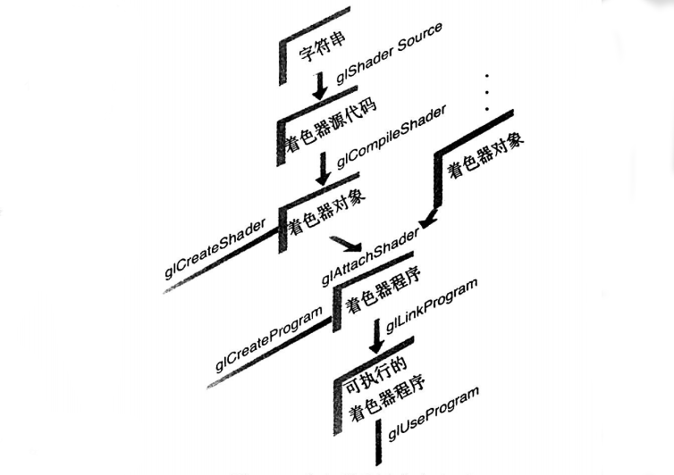

[TOC]


# 数据块接口

​	着色器与应用程序之间，或者着色器各阶段之间共享的变量可以组织为变量块的形式，并且有的时候必须釆用这种形式。uniform变量可以使用uniform块，输入和输岀变量可以使用in和out块，着色器的存储缓存可以使用buffer块。

​	它们的形式都是类似的。首先了解一下uniform块的写法，第一个变量是匿名数据 表，第二个是有名称的数据表。

```
uniform b {    //限定符可以为uniform、in、out或者buffer
	vec4 vl;   //块中的变量列表
	bool v2;   // ...
}；            //访问匿名块成员时使用v1、v2
```

或者  

```
uniform b {     //限定符可以为uniform、in、out或者buffer
	vec4 vl;    //块中的变量列表
	bool v2；   // ...
} name；        //访问有名块成员时使用name.vl name.v2 
```

​	各种类型的块接口的详细介绍如下文所示。综合来说，块（block）开始部分的名称 （上面的代码中为b）对应于外部访问时的接口名称，而结尾部分的名称（上面的代码中为 name）用于在着色器代码中访问具体成员变量。

## uniform 块

​	如果着色器程序变得比较复杂，那么其中用到的uniform变量的数量也会上升。通常会在多个着色器程序中用到同一个uniform变量。由于uniform变量的位置是着色器链接的时候产生的（也就是调用gILinkProgram() 的时候），因此它在应用程序中获得的索引可能会有变化，即使我们给uniform变量设置的值可能是完全相同的。而uniform缓存对象 （uniform buffer object）就是一种优化uniform变量访问，以及在不同的着色器程序之间共 享uniform数据的方法。

​	正如你所知道的，uniform变量是同时存在于用户应用程序和着色器当中的，因此需要同时修改着色器的内容并调用OpenGL函数来设置uniform缓存对象。

## 指定着色器中的uniform块

​	访问一组unifonn变量的方法是使用诸如glMapBuffer() 的OpenGL函数，但是我们需要在着色器中对它们的声明方式略作修改。不再分别声明每个uniform变量，而是直接将它们成组，形成一个类似结构体的形式，也就是uniform块。一个uniform 块需要使用关键字uniform指定。然后将块中所有需要用到的变量包含在一对花括号当中， 如下例2.3所示。

例2.3 声明一个uniform块

```
uniform Matrices {
	mat4 ModelView；
	mat4 Projection;
	mat4 Color;
}；
```

​	注意，着色器中的数据类型有两种：不透明的和透明的；其中不透明类型包括采样器、 图像和原子计数器。一个uniform块中只可以包含透明类型的变量。此外，uniform块必须在全局作用域内声明。

**uniform块的布局控制**

​	在uniform块中可以使用不同的限制符来设置变量的布局方式。这些限制符可以用来设置单个的uniform块，也可以用来设置所有后继uniform块的排列方式（需要使用布局声明）。可用的限制符及其介绍如表2-12所示。

**表2-12 uniform的布局限制符**

| 布局限制符   | 描述                                                         |
| ------------ | ------------------------------------------------------------ |
| binding = N  | 设置缓存的绑定位置，需要用到0penGL APl                       |
| shared       | 设置uniform块是多个程序间共享的（这是默认的布局方式，与shared存储限制符不存在混淆） |
| packed       | 设置uniform块占用最小的内存空间，但是这样会禁止程序间共享这个块 |
| stdl40       | 使用标准布局方式来设置uniform块或者着色器存储的buffer块      |
| std430       | 使用标准布局方式来设置uniform块                              |
| offset = N   | 强制设置成员变量位于缓存的N字节偏移处                        |
| align = N    | 强制设置成员变量的偏移位置是N的倍数                          |
| row_major    | 使用行主序的方式来存储uniform块中的矩阵                      |
| column_major | 使用列主序的方式来存储uniform块中的矩阵（这也是默认的顺序）  |

 	例如，如果需要共享一个uniform块，并且使用行主序的方式来存储数据，那么可以使用下面的代码来声明它：

`layout （shared, row_major） uniform { ... }；`

​	多个限制符可以通过圆括号中的逗号来分隔。如果需要对所有后继的uniform块设置同一种布局，那么可以使用下面的语句：

`layout (packed, column_major) uniform；`

​	这样一来，当前行之后的所有uniform块都会使用这种布局方式，除非再次改变全局的 布局，或者对某个块的声明单独设置专属的布局方式。

​	如果你在着色器和应用程序之间共享了一块缓存，那么这两者都需要确认成员变量所处的内存偏移地址。因此，这里就需要明确布局设置，也就是std140和std430所提供的功能。

​	虽然 std140 和 std430 已经提供了比较合理的显式缓存布局，但是用户可能还是希望更好的缓存布局控制方式。此时可以通过 offset 限制符来控制成员的精确位置，或者用 align 限制符来设置一个模糊的对齐方式。你可以只对某些成员应用这些限制符，从而确保应用程序和着色器之间的布局是同步的。连续的无限制符成员变量会自动进行偏移位置的对齐，这也是 std140 和 std430 的标准。

```
#version 440
layout (std140) uniform b {
	float size;                    //默认从0字节位置开始
	layout(offset=32) vec4 color;  //从32字节开始
	layout(align=1024) vec4 a[12]; //从下一个1024倍数的字节位置开始
	vec4 b[12];                    //从a[12]之后的偏移地址开始
}buf;
```

​	在用户程序设置缓存结构体的时候，可以使用C/C++ struct结构体形式的语言工具， 也可以直接向缓存的偏移地址写入数据。这里唯一的问题就是偏移值和对齐方式的可读性。 成员变量的地址偏移值是逐渐增加的，并且必须按照std140或者std430的规则对齐。总之，对于浮点数和双精度浮点数的结构体来说，对齐过程是自然的，只不过std140需要对类似vec4这样的类型增加一个额外的16字节对齐的限制。

​	注意N的定义：GLSL的布局限制符在任何时候都是layout (ID = N)的形式，这里的N 必须是一个非负整数。对于Version 430或者更早版本来说，它必须是一个字面整数值。不过从#version 440开始，N也可以是一个常整数的表达式了。

**访问uniform块中声明的uniform变量**

​	虽然uniform块已经命名了，但是块中声明的uniform变量并不会受到这个命名的限制。也就是说，uniform块的名称并不能作为uniform变量的父名称，因此在两个不同名的 uniform块中声明同名变量会在编译时造成错误。然而，在访问一个uniform变量的时候, 也不一定非要使用块的名称。

## 从应用程序中访问uniform块

​	uniform变量是着色器与应用程序之间共享数据的桥梁，因此如果着色器中的uniform 变量是定义在命名的uniform块中，那么就有必要找到不同变量的偏移值。如果获取了这些变量的具体位置，那么就可以使用数据对它们进行初始化，这一过程与处理缓存对象(使用 gINamedBufferSubData()等函数)是一致的。

​	首先假设已知应用程序的着色器中uniform块的名字。如果要对uniform块中的 uniform变量进行初始化，那么第一步就是找到块在着色器程序中的索引位置。可以调用glGetUniformBlocklndex()函数返回对应的信息，然后在应用程序的地址空间里完成 uniform变量的映射。

```
GLuint glGetUniformBlocklndex(GLuint program, const char * unifbrmBlockName);

	返回program中名称为uniformBlockName的uniform块的索引值。如果 uniformBlockName 不是一个合法的 uniform 程序块，那么返回 GL_INVALID_INDEX。
```

​	如果要初始化uniform块对应的缓存对象，那么我们需要使用glBindBuffer()将缓存对象绑定到目标GL_UNIFORM_BUFFER之上。

​	当对缓存对象进行初始化之后，我们需要判断命名的uniform块中的变量总共占据了多大的空间。我们可以使用函数glGetActiveUniformBlockiv()并且设置参数为GL_UNIFORM_ BLOCK_DATA_SIZE，这样就可以返回编译器分配的块的大小(根据uniform块的布局设置， 编译器可能会自动排除着色器中没有用到的uniform变量)。glGetActiveUniformBlockiv()函数还可以用来获取一个命名的uniform块的其他一些相关参数。

​	在获取uniform块的索引之后，我们需要将一个缓存对象与这个块相关联。最常见的方法是调用glBindBufferRange()，或者如果uniform块是全部使用缓存来存储的，那么可以使用 glBindBufferBase()。

```
void glBindBufferRange(GLenum target, GLuint index, GLuint buffer, GLintptr offset, GLsizeiptr size); 
void glBindBufferBase(GLenum target, GLuint index, GLuint buffer);

	将缓存对象buffer与索引为index的命名uniform块关联起来。target必须是支持索引的某个缓存绑定目标。index是uniform块的索引。offset和size分别指定了uniform缓存映射的起始索引和大小。
	调用glBindBufferBase()等价于调用gIBindBufferRange()并设置offset为 0，size为缓存对象的大小。
	在下列情况下调用这两个函数可能会产生OpenGL错误GL_INVALID_VALUE:size小于0； offset+size大于缓存大小；offset或size不是4的倍数；index小于0或者大于等于target设置的绑定目标所支持的最大索引数。
```

​	当建立了命名uniform块和缓存对象之间的关联之后，只要使用缓存相关的命令即可对块内的数据进行初始化或者修改。我们也可以直接设置某个命名uniform块和缓存对象之间的绑定关系，也就是说，不使用链接器内部自动绑定块对象并且查询关联结果的方式。如果多个着色器程序需要共享同一个 uniform块，那么你可能需要用到这种方法。这样可以避免对于不同的着色器程序同一个块有不 同的索引号。如果需要显式地控制一个uniform块的绑定方式，可以在调用glLinkProgram() 之前调用 glUniformBlockBinding()函数:.

```
GLint glUniformBlockBinding(GLuint program, GLuint uniformBlocklndex, GLuint unifbrmBlockBinding);

	显式地将块 uniformBlockindex 绑定到 uniformBlockBinding。
```

​	在一个命名的uniform块中，uniform变量的布局是通过各种布局限制符在编译和链接时控制的。如果使用了默认的布局方式，那么需要判断每个变量在uniform块中的偏移量和数据存储大小。为此，需要调用两个命令：gIGetUniformlndices()负责获取指定名称 uniform变量的索引位置，而glGetActiveUniformsiv()可以获得指定索引位置的偏移量和大 小，如例2.4所示:，

```
void glGetUniformlndices(GLuint program, GLsizei uniformCount, const char** unifomNames, GLuint* uniformlndices);

	返回所有uniformCount个uniform变量的索引位置，变量的名称通过字符串数组uniformNames来指定，程序返回值保存在数组uniformlndices当中。在 uniformNames中的每个名称都是以NULL来结尾的，并且uniformNames和 uniformindices的数组元素数都应该是uniformCount个。如果在uniformNames 中给出的某个名称不是当前启用的uniform变量名称，那么uniformindices中对应的位置将会记录为GL_INVALID_INDEX。
```

例2.4 初始化一个命名uniform块中的uniform变量

```
//顶点着色器和片元着色器共享同一个名称为“Uniforms”的uniform块 
const char* vShader = {
	"#version 330 core\n"
	"uniform Uniforms {"
    "	 vec3   translation；"
	"	 float	scale；"
	"	 vec4	rotation；"
	"	 bool	enabled；"
	"};"

	"in vec2 vPos ；" 
	"in vec3 vColor；" 
	"out vec4 fColor；"
	"void main()"
	"{"
	"	vec3 pos = vec3(vPos, 0.0)；"
	"	float angle = radians(rotation[0])；"
	"	vec3 axis = normalize(rotation.yzw)；"
	"	mat3 I = mat3(1.0);"
	"	mat3 S = mat3(	   0, -axis.z, axis.yz,   "
	"	              axis.z,   	0, -axis.x,"
	"	             -axis.y, axis.x,	     0)；"
	"	mat3 uuT = outerProduct(axis, axis)；"
	"	mat3 rot = uuT + cos(angle)*(I - uuT) + sin(angle)*S；"
	"	pos *= scale；" 
	"	pos *= rot；"
	"	pos += translation；"
	"	fColor = vec4(scale, scale, scale, 1)；"
	"	gl_Position = vec4(pos, 1)；"
	"}"
};

const char* fShader = (
	"#version 330 core\n" 
	"uniform Uniforms {"
	"	vec3 translation;"
	"	float scale;"
	"	vec4 rotation;"
	"	bool enabled;"
	"};"
	"in vec4 fColor;"
	"out vec4 color;"
	"void main()"
	"{"
	"	color = fColor;"
	"}"
};

//用于将GLSL类型转换为存储大小的辅助函数 
size_t
TypeSize(GLenum type)
{
	size_t size;
	#define CASE(Enum, Count, Type) \
	case Enum: size = Count * sizeof(Type);break
	switch(type){
		CASE(GL_FLOAT,                1,   GLfloat);
		CASE(GL_FLOAT_VEC2,           2,   GLfloat);
		CASE(GL_FLOAT_VEC3,           3,   GLfloat);
		CASE(GL_FLOAT_VEC4,           4,   GLfloat);
		CASE(GL_INT,                  1,   GLint);
		CASE(GL_INT_VEC2,             2,   GLint);
		CASE(GL_INT_VEC3,             3,   GLint);
		CASE(GL_INT_VEC4,             4,   GLint);
		CASE(GL_UNSIGNED.INT,         1,   GLuint);
		CASE(GLUNSIGNED_INT_VEC2,     2,   GLuint);
		CASE(GLUNSIGNED_INT_VEC3,     3,   GLuint);
		CASE(GLUNSIGNED_INT_VEC4,     4,   GLuint);
		CASE(GL_BOOL,                 1,   GLboolean);
		CASE(GL_BOOL_VEC2,            2,   GLboolean);
		CASE(GL_BOOL_VEC3,            3,   GLboolean);
		CASE(GL_BOOL_VEC4,            4,   GLboolean);
		CASE(GL_FLOAT_MAT2,           4,   GLfloat);
		CASE(GL_FLOAT_MAT2x3,         6,   GLfloat);
		CASE(GL_FLOAT_MAT2x4,         8,   GLfloat);
		CASE(GL_FLOAT_MAT3,           9,   GLfloat);
		CASE(GL_FLOAT_MAT3x2,         6,   GLfloat);
		CASE(GL_FLOAT_MAT3x4,         12,  GLfloat);
		CASE(GL_FLOAT_MAT4,           16,  GLfloat);
		CASE(GL_FLOAT_MAT4x2,          8,  GLfloat);
		CASE(GL_FLOAT_MAT4x3,         12,  GLfloat);
		#undef CASE
		default;
		fprintf(stderr, "Unknown type:  Ox%x\n", type);
		exit(EXIT_FAILURE)； 
		break;
	}
	return size;
}

void
init()
{
	GLuint program;

	glClearColor(1, 0, 0, 1);

	Shaderinfo shaders[] = {
		{ GL_VERTEX_SHADER, vShader },
		{ GL_FRAGMENT_SHADER, fShader },
		{ GL_NONE, NULL }
	};

	program = LoadShaders(shaders);
	glUseProgram(program);

	/*初始化uniform块"Uniforms"中的变量*/
	GLuint uboIndex;
	GLint uboSize;
	GLuint ubo;
	GLvoid *buffer;

	/*查找"Uniforms"的uniform缓存索引，并判断整个块的大小*/ 
	uboIndex = glGetUniformBlocklndex(program, "Uniforms");
	glGetActiveUniformBlockiv(program, uboIndex, GL_UNIFORM_BLOCK_DATA_SIZE, &uboSize);

	buffer = malloc(uboSize);

	if(buffer == NULL) {
		fprintf(stderr, "Unable to allocate buffer\n");
		exit(EXIT_FAILURE);
	}
	else {
		enum { Translation, Scale, Rotation, Enabled, NumUniforms};
		
		/*准备存储在缓存对象中的值*/
		GLfloat scale = 0.5;
		GLfloat translation[] = { 0.1, 0.1, 0.0 };
		GLfloat rotation[] = { 90, 0.0, 0.0, 1.0 };
		GLboolean enabled = GL_TRUE;
		/*我们可以建立一个变量名称数组，对应块中已知的uniform变量*/ 
		const char* names[NumUniforms] = {
			"translation",
			"scale",
			"rotation",
			"enabled"
		}；
		/*查询对应的属性，以判断向数据缓存中写入数值的位置*/
		GLuint indices[NumUniforms]；
		GLint	size[NumUniforms]；
		GLint	offset[NumUniforms]；
		GLint	type[NumUniforms]；
		
		glGetUniformlndices(program, NumUniforms, names, indices);
		glGetActiveUniformsiv(program, NumUniforms, indices, GL_UNIFORM_OFFSET, offset); 
		glGetActiveUniformsiv(program, NumUniforms, indices, GL_UNIFORM_SIZE, size);
		glGetActiveUniformsiv(program, NumUniforms, indices, GL_UNIFORM_TYPE, type);
		
		/*将uniform变量值拷贝到缓存中*/
		memcpy(buffer + offset[Scale], &scale, size[Scale] * TypeSize(type[Scale]));
		memcpy(buffer + offset[Translation], &translation, size[Translation] * TypeSize(type[Translation]));
		memcpy(buffer + offset[Rotation], &rotation, size[Rotation] * TypeSize(type[Rotation]));
		memcpy(buffer + offset[Enabled], &enabled,size[Enabled] * TypeSize(type[Enabled]));
		
		/*建立uniform缓存对象，初始化存储内容，并且与着色器程序建立关联*/
		glGenBuffers(1, &ubo);
		glBindBuffer(GL_UNIFORM_BUFFER, ubo)； 
		glBufferData(GL_UNIFORM_BUFFER, uboSize, buffer, GL_STATIC_RAW);
		glBindBufferBase(GL_UNIFORM_BUFFER, uboIndex, ubo);
	}
	...
}
```

## buffer 块

​	GLSL中的buffer块，或者对于应用程序而言，就是着色器的存储缓存对象(shader storage buffer object)，它的行为类似uniform块。不过两者之间有两个决定性的差别，使得 buffer块的功能更为强大。首先，着色器可以写入buffer块，修改其中的内容并呈现给其他的着色器调用或者应用程序本身。其次，可以在渲染之前再决定它的大小，而不是编译和链接的时候。例如：

```
buffer BufferObject｛	// 创建一个可读写的 buffer 块
	int mode;			// 序言(preamble)成员
	vec4 points[];	    //最后一个成员可以是未定义大小的数组
};
```

​	如果在着色器中没有给出上面的数组的大小，那么可以在应用程序中编译和连接之后， 渲染之前设置它的大小。着色器中可以通过length()方法获取渲染时的数组大小。着色器可以对buffer块中的成员执行读或写操作。写入操作对着色器存储缓存对象的修改对于其他着色器调用都是可见的。这种特性对于计算着色器非常有意义，尤其是对非图像的内存区域进行处理的时候。设置着色器存储缓存对象的方式与设置uniform缓存的方式类似，不过lBindBuffer()、 glBindBufferRange()和 gIBindBufferBase()需要使用 GL_SHADER_STORAGE_BUFFER 作为目标参数。如果你不需要写入缓存中，那么可以直接使用uniform块，并且硬件设备本身可能也没有足够的资源空间来支持buffer块，但是uniform块通常是足够的。此外，记住buffer块只可以使用std430布局，而uniform块可以选择std140或者std430布局。

## in/out块、位置和分量

​	着色器变量从一个阶段输出，然后再输入到下一个阶段中，这一过程可以使用块接口来表示。使用逻辑上成组的方式来进行组织也更有利于判断两个阶段的数据接口是否一致，同样对单独程序的链接也会变得更为简单。

例如，一个顶点着色器的输出可能为：

```
out Lighting {
	vec3 normal;	
	vec2 bumpCoord;
};
```

它必须与片元着色器的输入是匹配的：

```
in Lighting {
	vec3 normal;
	vec2 bumpCoord;
};
```

​	顶点着色器可以输出材质和光照的信息，并且都分成独立的数据块。

​	layout (location = N)被用于每个独立的输入和输出变量，但是从OpenGL 4.4 版本开始，它也可以作用于输入和输出块的成员，显式地设置它们的位置：

```
#version 440
in Lighting {	
	layout(location=l) vec3 normal；
	layout(location=2) vec2 bumpCoord；
};
```

​	无论这些location位置信息是否在块中，都是可以等价于一个vec4的。如果用户希望把多个小的对象设置到同一个位置上，那么也可以使用分量(component)关键字：

```
#version 440
in Lighting {
	layout(location=l, component=0) vec2 offset;
	layout(locationsl, component=2) vec2 bumpCoord;
};
```

​	与其声明一个vec4 combined,然后使用combined.xy和combined.zw来模拟offset和 bumpCoord，这个方法显然要好得多。它在块的外部也是可以使用的。OpenGL着色语言中内置的接口同样也是以块的方式存在的，例如gl_PerVertex，其中包含了内置变量gl_Position等信息。

# 着色器的编译

​	OpenGL着色器程序的编写与C语言等基于编译器的语言非常类似。我们使用编译器来解析程序，检查是否存在错误，然后将它翻译为目标代码。然后，在链接过程中将一系列目标文件合并，并产生最终的可执行程序。在程序中使用GLSL着色器的过程与之类似，只不过编译器和链接器都是OpenGL API的一部分而已。

 


​	上图给出了创建GLSL着色器对象并且通过链接来生成可执行着色器程序的过程。对于每个着色器程序，我们都需要在应用程序中通过下面的步骤进行设置。

对于每个着色器对象：

- 1)创建一个着色器对象。

- 2) 将着色器源代码编译为对象。

- 3) 验证着色器的编译是否成功。

  然后需要将多个着色器对象链接为一个着色器程序，包括：

- 1)创建一个着色器程序。

- 2) 将着色器对象关联到着色器程序。

- 3) 链接着色器程序。

- 4) 判断着色器的链接过程是否成功完成。

- 5) 使用着色器来处理顶点和片元。

  

​	为什么要创建多个着色器对象？这是因为我们有可能在不同的程序中复用同一个函数， 而GLSL程序也是同一个道理。我们创建的通用函数可以在多个着色器中得到复用。因此不需要使用大量的通用代码来编译大量的着色器资源，只需要将合适的着色器对象链接为 一个着色器程序即可。

调用glCreateShader()来创建着色器对象。

```
GLuint glCreateShader(GLerium type);

	分配一个着色器对象。type 必须是 GL_VERTEX_SHADER、GL_FRAGMENT_SHADER、GL_TESS_CONTROL_SHADER、GL_TESS_EVALUATION_SHADER、GL_GEOMETRY_ SHADER或GL_COMPUTE_SHADER中的一个。返回值可能是一个非零的整数值，如果为0则说明发生了错误。
```

​	当我们使用glCreateShader()创建了着色器对象之后，就可以将着色器的源代码关联到这个对象上。这一步需要调用glShaderSource()函数。

```
void glShaderSource(GLuint shader, GLsizei count, const GLchar** string, const GLint* length);

	将着色器源代码关联到一个着色器对象shader上。string是一个由count行GLchar类型的字符串组成的数组，用来表示着色器的源代码数据。string中的字符申可以是NULL结尾的，也可以不是。而length可以是以下三种值的二种。如果length是NULL，那么我们假设string给出的每行字符串都是NULL结尾的。否则，length中必须有count个元素, 它们分别表示string中对应行的长度。如果length数组中的某个值是一个整数，那么它表示对应的字符串中的字符数。如果某个值是负数，那么string中的对应行假设为NULL结尾。
```

​	如果要编译着色器对象的源代码，需要使用glCompileShader()函数。

```
void glCompileShader(GLuint shader);
	
	编译着色器的源代码。结果查询可以调用glGetShaderiv()， 并且参数为GL_COMPILE_STATUS。
```

​	这里与C语言程序的编泽类似，需要自己判断编译过程是否正确地完成。调用 glGetShaderiv()并且参数为GL_COMPILE_STATUS，返回的就是编译过程的状态。如果返回为GL_TRUE，那么编译成功，下一步可以将对象链接到一个着色器程序中。如果编译失败，那么可以通过调取编译日志来判断错误的原因。glGetShaderlnfoLog()函数会返回 一个与具体实现相关的信息，用于描述编译时的错误。这个错误日志的大小可以通过调用 glGetShaderiv()(带参数 GL_INFO_LOG_LENGTH)来查询。

```
void glGetShaderInfoLog(GLuint shader, GLsizei bufSize, GLsizei* length, char* infoLog);

	返回shader的最后编译结果。返回的日志信息是一个以NULL结尾的字符串，它保存在infoLog缓存中，长度为length个字符串。日志可以返回的最大值是通过bufSize来定义的。
	如果length设置为NULL，那么将不会返回infoLog的大小。
```

​	当创建并编译了所有必要的着色器对象之后，下一步就是链接它们以创建一个可执行的着色器程序。这个过程与创建着色器对象的过程类似。首先，我们创建一个着色器程序, 以便将着色器对象关联到其上。这里用到了 glCreateProgram()函数。

```
GLuint glCreateProgram(void);

	创建一个空的着色器程序。返回值是一个非零的整数，如果为0则说明发生了错误。
```

​	当得到着色器程序之后，下一步可以将它关联到必要的着色器对象上，以创建可执行的程序。关联着色器对象的步骤可以通过调用glAttachShader()函数来完成。

```
void glAttachShader(GLuint program, GLuint shader);				

	将着色器对象shader关联到着色器程序program上。着色器对象可以在任何时候关联到着色器程序，但是它的功能只有经过程序的成功链接之后才是可用的。着色器对象 可以同时关联到多个不同的着色器程序上。
```

​	与之对应的是，如果我们需要从程序中移除一个着色器对象，从而改变着色器的操作，那么可以调用glDetachShader()函数，设置对应的着色器对象标识符来解除对象的关联。

```
void glDetachShader(GLuint program, GLuint shader);
	
	移除着色器对象shader与着色器程序program的关联。如果着色器已经被标记为要删除的对象（调用glDeleteShader()），然后又被解除了关联，那么它将会被即时删除。
```

​	当我们将所有必要的着色器对象关联到着色器程序之后，就可以链接对象来生成可执行程序了。这一步需要调用函数glLinkProgram()。

```
void glLinkProgram(GLuint program);

	处理所有与program关联的着色器对象来生成一个完整的着色器程序。链接操作的结果查询可以调用glGetProgramiv()，且参数为GL_LINK_STATUS。如果返回GL_TRUE，那么链接成功；否则，返回GL_FALSE。
```

​	由于着色器对象中可能存在问题，因此链接过程依然可能会失败。我们可以调用 glGetProgramiv() (带参数GL_LINK_STATUS)来查询链接操作的结果。如果返回GL_TRUE，那么链接操作成功，然后我们可以指定着色器程序来处理顶点和片元数据了。如果链接失败，即返回结果为GL_FALSE，那么我们可以通过调用glGetProgramlnfoLog()函数来获取程序链接的日志信息并判断错误原因。

```
void glGetProgramInfoLog(GLuint program, GLsizei bufSize, GLsizei* length, char* infoLog);

	返回最后一次program链接的日志信息。日志返回的字符串以NULL结尾，长度为length个字符，保存在infoLog缓存中。log可返回的最大值通过bufSize指定。如果length为NULL，那么不会再返回infoLog的长度。
```

​	如果我们成功地完成了程序的链接，那么就可以调用函数glUseProgram()来运行着色器代码，并且参数设置为程序对象的句柄来启用顶点或者片元程序。

```
void glUseProgram(GLuint program);
	
	使用链接过的着色器程序program。如果program为零，那么所有当前使用的着色器都会被清除。如果没有绑定任何着色器，那么OpenGL的操作结果是未定义的，但是不会产生错误。
	如果已经启用了一个程序，而它需要关联新的着色器对象，或者解除之前关联的对象，那么我们需要对它进行链接。如果链接过程成功，那么新的程序会直接替代之前启用的程序。如果链接失败，那么当前绑定的着色器程序依然是可用的，不会被替代，直到我们成功地重新链接或者使用glUserProgram()指定了新的程序为止。
```

​	当着色器对象的任务完成之后，我们可以通过glDeleteShader()将它删除，并且不需要关心它是否关联到某个活动程序上。这一点与C语言程序的链接是相同的，当我们得到可执行程序之后，就不再需要对文件了，直到我们再次进行编译为止。

```
void glDeleteShader(GLuint shader);

	删除着色器对象shader。如果shader当前已经链接到一个或者多个激活的着色器程序上，那么它将被标识为“可删除”，当对应的着色器程序不再使用的时候，就会自动删除这个对象。
```

​	与此类似，如果我们不再使用某个着色器程序，也可以直接调用gIDeleteProgram()删除它。

```
void glDeleteProgram(GLuint program);

	立即删除一个当前没有在任何环境中使用的着色器程序program，如果程序正在被某个环境使用，那么等到它空闲时再删除。
```

​	最后，为了确保接口的完整性，还可以调用gllsShader()来判断某个着色器对象是否存在，或者通过gllsProgram()判断着色器程序是否存在。

```
GLboolean gllsShader(GLuint shader);

	如果shader是一个通过glCreateShader()生成的着色器对象的名称，并且没有被删除，那么返回GL_TRUE。如果shader是零或者不是着色器对象名称的非零值，则返回 GL_FALSE。
```


```
GLboolean gllsProgram(GLuint program);
	
	如果program是一个通过glCreateProgram()生成的程序对象名称，并且没有被删除，那么返回GL_TRUE。如果program是0或者不是着色器程序名称的非零值，则返回GL_FALSE。
```


