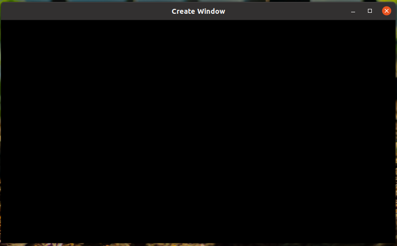
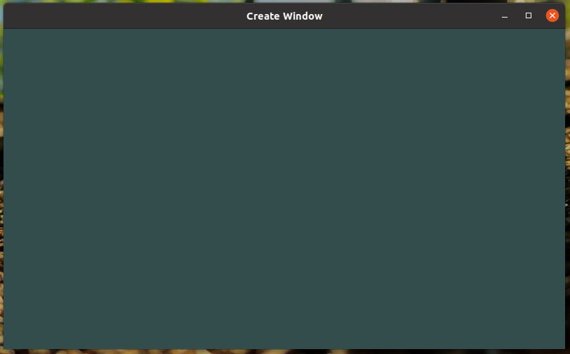

[TOC]

# 转载自

https://learnopengl-cn.github.io/

# OpenGL

早期的OpenGL使用立即渲染模式（Immediate mode，也就是固定渲染管线），这个模式下绘制图形很方便。OpenGL的大多数功能都被库隐藏起来，开发者很少有控制OpenGL如何进行计算的自由。立即渲染模式确实容易使用和理解，但是效率太低。因此从OpenGL3.2开始，规范文档开始废弃立即渲染模式，并鼓励开发者在OpenGL的核心模式(Core-profile)下进行开发，这个分支的规范完全移除了旧的特性。

## 扩展

OpenGL的一大特性就是对扩展(Extension)的支持，当一个显卡公司提出一个新特性或者渲染上的大优化，通常会以扩展的方式在驱动中实现。如果一个程序在支持这个扩展的显卡上运行，开发者可以使用这个扩展提供的一些更先进更有效的图形功能。通过这种方式，开发者不必等待一个新的OpenGL规范面世，就可以使用这些新的渲染特性了，只需要简单地检查一下显卡是否支持此扩展。通常，当一个扩展非常流行或者非常有用的时候，它将最终成为未来的OpenGL规范的一部分。

使用扩展的代码大多看上去如下：

```
if(GL_ARB_extension_name)
{
    // 使用硬件支持的全新的现代特性
}
else
{
    // 不支持此扩展: 用旧的方式去做
}
```

## 状态机

OpenGL自身是一个巨大的状态机(State Machine)：一系列的变量描述OpenGL此刻应当如何运行。OpenGL的状态通常被称为OpenGL上下文(Context)。我们通常使用如下途径去更改OpenGL状态：设置选项，操作缓冲。最后，我们使用当前OpenGL上下文来渲染。

假设当我们想告诉OpenGL去画线段而不是三角形的时候，我们通过改变一些上下文变量来改变OpenGL状态，从而告诉OpenGL如何去绘图。一旦我们改变了OpenGL的状态为绘制线段，下一个绘制命令就会画出线段而不是三角形。

当使用OpenGL的时候，我们会遇到一些状态设置函数(State-changing Function)，这类函数将会改变上下文。以及状态使用函数(State-using Function)，这类函数会根据当前OpenGL的状态执行一些操作。只要你记住OpenGL本质上是个大状态机，就能更容易理解它的大部分特性。

## 对象

OpenGL库是用C语言写的，同时也支持多种语言的派生，但其内核仍是一个C库。由于C的一些语言结构不易被翻译到其它的高级语言，因此OpenGL开发的时候引入了一些抽象层。“对象(Object)”就是其中一个。

在OpenGL中一个对象是指一些选项的集合，它代表OpenGL状态的一个子集。比如，我们可以用一个对象来代表绘图窗口的设置，之后我们就可以设置它的大小、支持的颜色位数等等。可以把对象看做一个C风格的结构体(Struct)：

```
struct object_name {
    float  option1;
    int    option2;
    char[] name;
};
```

> 使用OpenGL的类型的好处是保证了在各平台中每一种类型的大小都是统一的。你也可以使用其它的定宽类型(Fixed-width Type)来实现这一点。

当我们使用一个对象时，通常看起来像如下一样（把OpenGL上下文看作一个大的结构体）：

```
// OpenGL的状态
struct OpenGL_Context {
    ...
    object* object_Window_Target;
    ...     
};
// 创建对象
unsigned int objectId = 0;
glGenObject(1, &objectId);
// 绑定对象至上下文
glBindObject(GL_WINDOW_TARGET, objectId);
// 设置当前绑定到 GL_WINDOW_TARGET 的对象的一些选项
glSetObjectOption(GL_WINDOW_TARGET, GL_OPTION_WINDOW_WIDTH, 800);
glSetObjectOption(GL_WINDOW_TARGET, GL_OPTION_WINDOW_HEIGHT, 600);
// 将上下文对象设回默认
glBindObject(GL_WINDOW_TARGET, 0);
```

这一小段代码展现了你以后使用OpenGL时常见的工作流。我们首先创建一个对象，然后用一个id保存它的引用（实际数据被储存在后台）。然后我们将对象绑定至上下文的目标位置（例子中窗口对象目标的位置被定义成GL_WINDOW_TARGET）。接下来我们设置窗口的选项。最后我们将目标位置的对象id设回0，解绑这个对象。设置的选项将被保存在objectId所引用的对象中，一旦我们重新绑定这个对象到GL_WINDOW_TARGET位置，这些选项就会重新生效。

# 前置说明

首先要做的就是创建一个OpenGL上下文(Context)和一个用于显示的窗口。最流行的几个库有GLUT，SDL，SFML和GLFW

## GLFW

GLFW是一个专门针对OpenGL的C语言库，它提供了一些渲染物体所需的最低限度的接口。它允许用户创建OpenGL上下文，定义窗口参数以及处理用户输入。

## 第一个工程

### Windows上的OpenGL库

如果你是Windows平台，**opengl32.lib**已经包含在Microsoft SDK里了，它在Visual Studio安装的时候就默认安装了。由于这篇教程用的是VS编译器，并且是在Windows操作系统上，我们只需将**opengl32.lib**添加进连接器设置里就行了。

### Linux上的OpenGL库

在Linux下你需要链接**libGL.so**库文件，这需要添加`-lGL`到你的链接器设置中。如果找不到这个库你可能需要安装Mesa，NVidia或AMD的开发包，这部分因平台而异（而且我也不熟悉Linux）就不仔细讲解了。

接下来，如果你已经添加GLFW和OpenGL库到连接器设置中，你可以用如下方式添加GLFW头文件：

```
#include <GLFW\glfw3.h>
```

对于用GCC编译的Linux用户建议使用这个命令行选项`-lGLEW -lglfw3 -lGL -lX11 -lpthread -lXrandr -lXi`。没有正确链接相应的库会产生 *undefined reference* (未定义的引用) 这个错误。

## GLAD

因为OpenGL只是一个标准/规范，具体的实现是由驱动开发商针对特定显卡实现的。由于OpenGL驱动版本众多，它大多数函数的位置都无法在编译时确定下来，需要在运行时查询。所以任务就落在了开发者身上，开发者需要在运行时获取函数地址并将其保存在一个函数指针中供以后使用。取得地址的方法[因平台而异](https://www.khronos.org/opengl/wiki/Load_OpenGL_Functions)，在Windows上会是类似这样：

```
// 定义函数原型
typedef void (*GL_GENBUFFERS) (GLsizei, GLuint*);
// 找到正确的函数并赋值给函数指针
GL_GENBUFFERS glGenBuffers  = (GL_GENBUFFERS)wglGetProcAddress("glGenBuffers");
// 现在函数可以被正常调用了
GLuint buffer;
glGenBuffers(1, &buffer);
```

​	有些库能简化此过程，其中**GLAD**是目前最新，也是最流行的库。

### 配置GLAD

GLAD是一个[开源](https://github.com/Dav1dde/glad)的库，它能解决我们上面提到的那个繁琐的问题。GLAD的配置与大多数的开源库有些许的不同，GLAD使用了一个[在线服务](http://glad.dav1d.de/)。在这里我们能够告诉GLAD需要定义的OpenGL版本，并且根据这个版本加载所有相关的OpenGL函数。

打开GLAD的[在线服务](http://glad.dav1d.de/)，将语言(Language)设置为**C/C++**，在API选项中，选择**3.3**以上的OpenGL(gl)版本（我们的教程中将使用3.3版本，但更新的版本也能正常工作）。之后将模式(Profile)设置为**Core**，并且保证**生成加载器**(Generate a loader)的选项是选中的。现在可以先（暂时）忽略拓展(Extensions)中的内容。都选择完之后，点击**生成**(Generate)按钮来生成库文件。

GLAD现在应该提供给你了一个zip压缩文件，包含两个头文件目录，和一个**glad.c**文件。将两个头文件目录（**glad**和**KHR**）复制到你的**Include**文件夹中（或者增加一个额外的项目指向这些目录），并添加**glad.c**文件到你的工程中。

经过前面的这些步骤之后，你就应该可以将以下的指令加到你的文件顶部了：

```
#include <glad/glad.h> 
```

点击编译按钮应该不会给你提示任何的错误。

## 附加资源

- [GLFW: Window Guide](http://www.glfw.org/docs/latest/window_guide.html)：GLFW官方的配置GLFW窗口的指南。
- [Building applications](http://www.opengl-tutorial.org/miscellaneous/building-your-own-c-application/)：提供了很多编译或链接相关的信息和一大列错误及对应的解决方案。
- [GLFW with Code::Blocks](http://wiki.codeblocks.org/index.php?title=Using_GLFW_with_Code::Blocks)：使用Code::Blocks IDE编译GLFW。
- [Running CMake](http://www.cmake.org/runningcmake/)：简要的介绍如何在Windows和Linux上使用CMake。
- [Writing a build system under Linux](http://learnopengl.com/demo/autotools_tutorial.txt)：Wouter Verholst写的一个autotools的教程，讲的是如何在Linux上编写构建系统，尤其是针对这些教程。
- [Polytonic/Glitter](https://github.com/Polytonic/Glitter)：一个简单的样板项目，它已经提前配置了所有相关的库；如果你想要很方便地搞到一个LearnOpenGL教程的范例工程，这也是很不错的。

# 创建窗口

让我们试试能不能让GLFW正常工作。首先，新建一个`.cpp`文件，然后把下面的代码粘贴到该文件的最前面。

```
#include <glad/glad.h>
#include <GLFW/glfw3.h>
```

请确认是在包含GLFW的头文件之前包含了GLAD的头文件。GLAD的头文件包含了正确的OpenGL头文件（例如`GL/gl.h`），所以需要在其它依赖于OpenGL的头文件之前包含GLAD。

接下来我们创建main函数，在这个函数中我们将会实例化GLFW窗口：

```
int main()
{
    glfwInit();
    glfwWindowHint(GLFW_CONTEXT_VERSION_MAJOR, 3);
    glfwWindowHint(GLFW_CONTEXT_VERSION_MINOR, 3);
    glfwWindowHint(GLFW_OPENGL_PROFILE, GLFW_OPENGL_CORE_PROFILE);
    //glfwWindowHint(GLFW_OPENGL_FORWARD_COMPAT, GL_TRUE);

    return 0;
}
```

首先，我们在main函数中调用glfwInit函数来初始化GLFW，然后我们可以使用glfwWindowHint函数来配置GLFW。glfwWindowHint函数的第一个参数代表选项的名称，我们可以从很多以`GLFW_`开头的枚举值中选择；第二个参数接受一个整型，用来设置这个选项的值。该函数的所有的选项以及对应的值都可以在 [GLFW’s window handling](http://www.glfw.org/docs/latest/window.html#window_hints) 这篇文档中找到。如果你现在编译你的cpp文件会得到大量的 *undefined reference* (未定义的引用)错误，也就是说你并未顺利地链接GLFW库。

我们需要告诉GLFW我们要使用的OpenGL版本是3.3，这样GLFW会在创建OpenGL上下文时做出适当的调整。这也可以确保用户在没有适当的OpenGL版本支持的情况下无法运行。我们将主版本号(Major)和次版本号(Minor)都设为3。我们同样明确告诉GLFW我们使用的是核心模式(Core-profile)。明确告诉GLFW我们需要使用核心模式意味着我们只能使用OpenGL功能的一个子集（没有我们已不再需要的向后兼容特性）。如果使用的是Mac OS X系统，你还需要加下面这行代码到你的初始化代码中这些配置才能起作用（将上面的代码解除注释）：

```
glfwWindowHint(GLFW_OPENGL_FORWARD_COMPAT, GL_TRUE);
```

接下来我们创建一个窗口对象，这个窗口对象存放了所有和窗口相关的数据，而且会被GLFW的其他函数频繁地用到。

```
GLFWwindow* window = glfwCreateWindow(800, 600, "LearnOpenGL", NULL, NULL);
if (window == NULL)
{
    std::cout << "Failed to create GLFW window" << std::endl;
    glfwTerminate();
    return -1;
}
glfwMakeContextCurrent(window);
```

glfwCreateWindow函数需要窗口的宽和高作为它的前两个参数。第三个参数表示这个窗口的名称（标题），这里我们使用`"LearnOpenGL"`，当然你也可以使用你喜欢的名称。最后两个参数我们暂时忽略。这个函数将会返回一个GLFWwindow对象，我们会在其它的GLFW操作中使用到。创建完窗口我们就可以通知GLFW将我们窗口的上下文设置为当前线程的主上下文了。

## GLAD

在之前的教程中已经提到过，GLAD是用来管理OpenGL的函数指针的，所以在调用任何OpenGL的函数之前我们需要初始化GLAD。

```
if (!gladLoadGLLoader((GLADloadproc)glfwGetProcAddress))
{
    std::cout << "Failed to initialize GLAD" << std::endl;
    return -1;
}
```

我们给GLAD传入了用来加载系统相关的OpenGL函数指针地址的函数。GLFW给我们的是`glfwGetProcAddress`，它根据我们编译的系统定义了正确的函数。

## 视口

在我们开始渲染之前还有一件重要的事情要做，我们必须告诉OpenGL渲染窗口的尺寸大小，即视口(Viewport)，这样OpenGL才只能知道怎样根据窗口大小显示数据和坐标。我们可以通过调用glViewport函数来设置窗口的**维度**(Dimension)：

```
glViewport(0, 0, 800, 600);
```

glViewport函数前两个参数控制窗口左下角的位置。第三个和第四个参数控制渲染窗口的宽度和高度（像素）。

我们实际上也可以将视口的维度设置为比GLFW的维度小，这样子之后所有的OpenGL渲染将会在一个更小的窗口中显示，这样子的话我们也可以将一些其它元素显示在OpenGL视口之外。

OpenGL幕后使用glViewport中定义的位置和宽高进行2D坐标的转换，将OpenGL中的位置坐标转换为你的屏幕坐标。例如，OpenGL中的坐标(-0.5, 0.5)有可能（最终）被映射为屏幕中的坐标(200,450)。注意，处理过的OpenGL坐标范围只为-1到1，因此我们事实上将(-1到1)范围内的坐标映射到(0, 800)和(0, 600)。

然而，当用户改变窗口的大小的时候，视口也应该被调整。我们可以对窗口注册一个回调函数(Callback Function)，它会在每次窗口大小被调整的时候被调用。这个回调函数的原型如下：

```
void framebuffer_size_callback(GLFWwindow* window, int width, int height);
```

这个帧缓冲大小函数需要一个GLFWwindow作为它的第一个参数，以及两个整数表示窗口的新维度。每当窗口改变大小，GLFW会调用这个函数并填充相应的参数供你处理。

```
void framebuffer_size_callback(GLFWwindow* window, int width, int height)
{
    glViewport(0, 0, width, height);
}
```

我们还需要注册这个函数，告诉GLFW我们希望每当窗口调整大小的时候调用这个函数：

```
glfwSetFramebufferSizeCallback(window, framebuffer_size_callback);
```

当窗口被第一次显示的时候framebuffer_size_callback也会被调用。对于视网膜(Retina)显示屏，width和height都会明显比原输入值更高一点。

我们还可以将我们的函数注册到其它很多的回调函数中。比如说，我们可以创建一个回调函数来处理手柄输入变化，处理错误消息等。我们会在创建窗口之后，渲染循环初始化之前注册这些回调函数。

# 引擎

我们可不希望只绘制一个图像之后我们的应用程序就立即退出并关闭窗口。我们希望程序在我们主动关闭它之前不断绘制图像并能够接受用户输入。因此，我们需要在程序中添加一个while循环，我们可以把它称之为渲染循环(Render Loop)，它能在我们让GLFW退出前一直保持运行。下面几行的代码就实现了一个简单的渲染循环：

```
while(!glfwWindowShouldClose(window))
{
    glfwSwapBuffers(window);
    glfwPollEvents();    
}
```

- glfwWindowShouldClose函数在我们每次循环的开始前检查一次GLFW是否被要求退出，如果是的话该函数返回`true`然后渲染循环便结束了，之后为我们就可以关闭应用程序了。
- glfwPollEvents函数检查有没有触发什么事件（比如键盘输入、鼠标移动等）、更新窗口状态，并调用对应的回调函数（可以通过回调方法手动设置）。
- glfwSwapBuffers函数会交换颜色缓冲（它是一个储存着GLFW窗口每一个像素颜色值的大缓冲），它在这一迭代中被用来绘制，并且将会作为输出显示在屏幕上。

**双缓冲(Double Buffer)**

应用程序使用单缓冲绘图时可能会存在图像闪烁的问题。 这是因为生成的图像不是一下子被绘制出来的，而是按照从左到右，由上而下逐像素地绘制而成的。最终图像不是在瞬间显示给用户，而是通过一步一步生成的，这会导致渲染的结果很不真实。为了规避这些问题，我们应用双缓冲渲染窗口应用程序。**前**缓冲保存着最终输出的图像，它会在屏幕上显示；而所有的的渲染指令都会在**后**缓冲上绘制。当所有的渲染指令执行完毕后，我们**交换**(Swap)前缓冲和后缓冲，这样图像就立即呈显出来，之前提到的不真实感就消除了。

## 最后一件事

当渲染循环结束后我们需要正确释放/删除之前的分配的所有资源。我们可以在main函数的最后调用glfwTerminate函数来完成。

```
glfwTerminate();
return 0;
```

遇到报错：

```
:-1: error: glad.o: undefined reference to symbol 'dlclose@@GLIBC_2.2.5'
```

```
2021-03-18_16-15在QT.pro里面添加 -dl库
LIBS += -ldl -lGLEW -lglfw -lGL -lX11 -lpthread -lXrandr -lXi
```

这样便能清理所有的资源并正确地退出应用程序。现在你可以尝试编译并运行你的应用程序了，如果没做错的话，你将会看到如下的输出：



## 输入

我们同样也希望能够在GLFW中实现一些输入控制，这可以通过使用GLFW的几个输入函数来完成。我们将会使用GLFW的glfwGetKey函数，它需要一个窗口以及一个按键作为输入。这个函数将会返回这个按键是否正在被按下。我们将创建一个processInput函数来让所有的输入代码保持整洁。

```
void processInput(GLFWwindow *window)
{
    if(glfwGetKey(window, GLFW_KEY_ESCAPE) == GLFW_PRESS)
        glfwSetWindowShouldClose(window, true);
}
```

这里我们检查用户是否按下了返回键(Esc)（如果没有按下，glfwGetKey将会返回GLFW_RELEASE。如果用户的确按下了返回键，我们将通过glfwSetwindowShouldClose使用把`WindowShouldClose`属性设置为 `true`的方法关闭GLFW。下一次while循环的条件检测将会失败，程序将会关闭。

我们接下来在渲染循环的每一个迭代中调用processInput：

```
while (!glfwWindowShouldClose(window))
{
    processInput(window);

    glfwSwapBuffers(window);
    glfwPollEvents();
}
```

这就给我们一个非常简单的方式来检测特定的键是否被按下，并在每一帧做出处理。

## 渲染

我们要把所有的渲染(Rendering)操作放到渲染循环中，因为我们想让这些渲染指令在每次渲染循环迭代的时候都能被执行。代码将会是这样的：

```
// 渲染循环
while(!glfwWindowShouldClose(window))
{
    // 输入
    processInput(window);

    // 渲染指令
    ...

    // 检查并调用事件，交换缓冲
    glfwPollEvents();
    glfwSwapBuffers(window);
}
```

为了测试一切都正常工作，我们使用一个自定义的颜色清空屏幕。在每个新的渲染迭代开始的时候我们总是希望清屏，否则我们仍能看见上一次迭代的渲染结果（这可能是你想要的效果，但通常这不是）。我们可以通过调用glClear函数来清空屏幕的颜色缓冲，它接受一个缓冲位(Buffer Bit)来指定要清空的缓冲，可能的缓冲位有GL_COLOR_BUFFER_BIT，GL_DEPTH_BUFFER_BIT和GL_STENCIL_BUFFER_BIT。由于现在我们只关心颜色值，所以我们只清空颜色缓冲。

```
glClearColor(0.2f, 0.3f, 0.3f, 1.0f);
glClear(GL_COLOR_BUFFER_BIT);
```

注意，除了glClear之外，我们还调用了glClearColor来设置清空屏幕所用的颜色。当调用glClear函数，清除颜色缓冲之后，整个颜色缓冲都会被填充为glClearColor里所设置的颜色。在这里，我们将屏幕设置为了类似黑板的深蓝绿色。

你应该能够回忆起来我们在 *OpenGL* 这节教程的内容，glClearColor函数是一个**状态设置**函数，而glClear函数则是一个**状态使用**的函数，它使用了当前的状态来获取应该清除为的颜色。



## hello_window.cpp

```
#include <glad/glad.h>
#include <GLFW/glfw3.h>

#include <iostream>

void framebuffer_size_callback(GLFWwindow* window, int width, int height);
void processInput(GLFWwindow *window);

// settings
const unsigned int SCR_WIDTH = 800;
const unsigned int SCR_HEIGHT = 600;

int main()
{
    // glfw: initialize and configure
    // ------------------------------
    glfwInit();
    glfwWindowHint(GLFW_CONTEXT_VERSION_MAJOR, 3);
    glfwWindowHint(GLFW_CONTEXT_VERSION_MINOR, 3);
    glfwWindowHint(GLFW_OPENGL_PROFILE, GLFW_OPENGL_CORE_PROFILE);

#ifdef __APPLE__
    glfwWindowHint(GLFW_OPENGL_FORWARD_COMPAT, GL_TRUE);
#endif

    // glfw window creation
    // --------------------
    GLFWwindow* window = glfwCreateWindow(SCR_WIDTH, SCR_HEIGHT, "LearnOpenGL", NULL, NULL);
    if (window == NULL)
    {
        std::cout << "Failed to create GLFW window" << std::endl;
        glfwTerminate();
        return -1;
    }
    glfwMakeContextCurrent(window);
    glfwSetFramebufferSizeCallback(window, framebuffer_size_callback);

    // glad: load all OpenGL function pointers
    // ---------------------------------------
    if (!gladLoadGLLoader((GLADloadproc)glfwGetProcAddress))
    {
        std::cout << "Failed to initialize GLAD" << std::endl;
        return -1;
    }    

    // render loop
    // -----------
    while (!glfwWindowShouldClose(window))
    {
        // input
        // -----
        processInput(window);

        // glfw: swap buffers and poll IO events (keys pressed/released, mouse moved etc.)
        // -------------------------------------------------------------------------------
        glfwSwapBuffers(window);
        glfwPollEvents();
    }

    // glfw: terminate, clearing all previously allocated GLFW resources.
    // ------------------------------------------------------------------
    glfwTerminate();
    return 0;
}

// process all input: query GLFW whether relevant keys are pressed/released this frame and react accordingly
// ---------------------------------------------------------------------------------------------------------
void processInput(GLFWwindow *window)
{
    if(glfwGetKey(window, GLFW_KEY_ESCAPE) == GLFW_PRESS)
        glfwSetWindowShouldClose(window, true);
}

// glfw: whenever the window size changed (by OS or user resize) this callback function executes
// ---------------------------------------------------------------------------------------------
void framebuffer_size_callback(GLFWwindow* window, int width, int height)
{
    // make sure the viewport matches the new window dimensions; note that width and 
    // height will be significantly larger than specified on retina displays.
    glViewport(0, 0, width, height);
}
```

## hello_window_clear.cpp

```
#include <glad/glad.h>
#include <GLFW/glfw3.h>

#include <iostream>

void framebuffer_size_callback(GLFWwindow* window, int width, int height);
void processInput(GLFWwindow *window);

// settings
const unsigned int SCR_WIDTH = 800;
const unsigned int SCR_HEIGHT = 600;

int main()
{
    // glfw: initialize and configure
    // ------------------------------
    glfwInit();
    glfwWindowHint(GLFW_CONTEXT_VERSION_MAJOR, 3);
    glfwWindowHint(GLFW_CONTEXT_VERSION_MINOR, 3);
    glfwWindowHint(GLFW_OPENGL_PROFILE, GLFW_OPENGL_CORE_PROFILE);

#ifdef __APPLE__
    glfwWindowHint(GLFW_OPENGL_FORWARD_COMPAT, GL_TRUE);
#endif

    // glfw window creation
    // --------------------
    GLFWwindow* window = glfwCreateWindow(SCR_WIDTH, SCR_HEIGHT, "LearnOpenGL", NULL, NULL);
    if (window == NULL)
    {
        std::cout << "Failed to create GLFW window" << std::endl;
        glfwTerminate();
        return -1;
    }
    glfwMakeContextCurrent(window);
    glfwSetFramebufferSizeCallback(window, framebuffer_size_callback);

    // glad: load all OpenGL function pointers
    // ---------------------------------------
    if (!gladLoadGLLoader((GLADloadproc)glfwGetProcAddress))
    {
        std::cout << "Failed to initialize GLAD" << std::endl;
        return -1;
    }    

    // render loop
    // -----------
    while (!glfwWindowShouldClose(window))
    {
        // input
        // -----
        processInput(window);

        // render
        // ------
        glClearColor(0.2f, 0.3f, 0.3f, 1.0f);
        glClear(GL_COLOR_BUFFER_BIT);

        // glfw: swap buffers and poll IO events (keys pressed/released, mouse moved etc.)
        // -------------------------------------------------------------------------------
        glfwSwapBuffers(window);
        glfwPollEvents();
    }

    // glfw: terminate, clearing all previously allocated GLFW resources.
    // ------------------------------------------------------------------
    glfwTerminate();
    return 0;
}

// process all input: query GLFW whether relevant keys are pressed/released this frame and react accordingly
// ---------------------------------------------------------------------------------------------------------
void processInput(GLFWwindow *window)
{
    if(glfwGetKey(window, GLFW_KEY_ESCAPE) == GLFW_PRESS)
        glfwSetWindowShouldClose(window, true);
}

// glfw: whenever the window size changed (by OS or user resize) this callback function executes
// ---------------------------------------------------------------------------------------------
void framebuffer_size_callback(GLFWwindow* window, int width, int height)
{
    // make sure the viewport matches the new window dimensions; note that width and 
    // height will be significantly larger than specified on retina displays.
    glViewport(0, 0, width, height);
}
```

