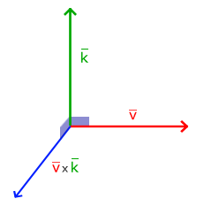
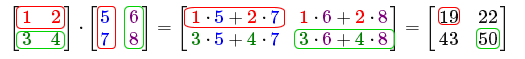
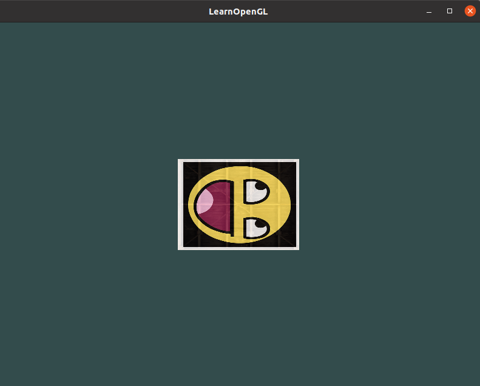

[TOC]

# 转自

https://learnopengl-cn.github.io/

https://learnopengl.com/

使用（多个）矩阵(Matrix)对象可以更好的变换(Transform)一个物体。

# 向量 

向量最基本的定义就是一个方向。或者更正式的说，向量有一个方向(Direction)和大小(Magnitude，也叫做强度或长度)。你可以把向量想像成一个藏宝图上的指示：“向左走10步，向北走3步，然后向右走5步”；“左”就是方向，“10步”就是向量的长度。那么这个藏宝图的指示一共有3个向量。向量可以在任意维度(Dimension)上，但是我们通常只使用2至4维。如果一个向量有2个维度，它表示一个平面的方向(想象一下2D的图像)，当它有3个维度的时候它可以表达一个3D世界的方向。

下面你会看到3个向量，每个向量在2D图像中都用一个箭头(x, y)表示。我们在2D图片中展示这些向量，因为这样子会更直观一点。你可以把这些2D向量当做z坐标为0的3D向量。由于向量表示的是方向，起始于何处并不会改变它的值。下图我们可以看到向量 $\bar{v}$ 和 $\bar{w}$ 是相等的，尽管他们的起始点不同：


数学家喜欢在字母上面加一横表示向量，比如说 $\bar{v}$ 。当用在公式中时它们通常是这样的：
$$
\bar{v} = 
\left( \begin{array}{c} x \\ y \\ z \end{array} \right)
$$
由于向量是一个方向，所以有些时候会很难形象地将它们用位置(Position)表示出来。为了让其更为直观，我们通常设定这个方向的原点为(0, 0, 0)，然后指向一个方向，对应一个点，使其变为位置向量(Position Vector)（你也可以把起点设置为其他的点，然后说：这个向量从这个点起始指向另一个点）。比如说位置向量(3, 5)在图像中的起点会是(0, 0)，并会指向(3, 5)。我们可以使用向量在2D或3D空间中表示方向**与**位置.

## 向量与标量运算

标量(Scalar)只是一个数字（或者说是仅有一个分量的向量）。当把一个向量加/减/乘/除一个标量，我们可以简单的把向量的每个分量分别进行该运算。对于加法来说会像这样:
$$
\left( \begin{array}{c} 
1 \\
2 \\
3
\end{array} \right)
+ x =
\left( \begin{array}{c} 
1 + x \\
2 + x \\
3 + x
\end{array}\right)
$$
其中的+可以是+，-，·或÷，其中·是乘号。注意－和÷运算时不能颠倒（标量-/÷向量），因为颠倒的运算是没有定义的。

> 注意，数学上是没有向量与标量相加这个运算的，但是很多线性代数的库都对它有支持（比如说我们用的GLM）。如果你使用过numpy的话，可以把它理解为[Broadcasting](https://numpy.org/doc/1.18/user/basics.broadcasting.html)。

## 向量取反

对一个向量取反(Negate)会将其方向逆转。一个指向东北的向量取反后就指向西南方向了。我们在一个向量的每个分量前加负号就可以实现取反了（或者说用-1数乘该向量）:
$$
- \bar{v} = - \left( \begin{array}{c} v_x \\ v_y \\ v_z \end{array} \right) =
\left( \begin{array}{c} -v_x \\ -v_y \\ -v_z \end{array} \right)
$$

## 向量加减

向量的加法可以被定义为是分量的(Component-wise)相加，即将一个向量中的每一个分量加上另一个向量的对应分量：
$$
\bar{v} = \left (\begin{array}{c} 1 \\ 2 \\ 3 \end{array} \right),
\bar{k} = \left(\begin{array}{c} 4 \\ 5\\ 6 \end{array} \right) \rightarrow
\bar{v} + \bar{k} = \left(\begin{array}{c} 1 + 4 \\ 2 + 5 \\ 3 + 6  \end{array} \right)
= \left(\begin{array}{c} 5 \\ 7 \\ 9 \end{array} \right)
$$
向量`v = (4, 2)`和`k = (1, 2)`可以直观地表示为：


就像普通数字的加减一样，向量的减法等于加上第二个向量的相反向量：

$$
\bar{v} = \left (\begin{array}{c} 1 \\ 2 \\ 3 \end{array} \right),
\bar{k} = \left(\begin{array}{c} 4 \\ 5\\ 6 \end{array} \right) \rightarrow
\bar{v} + -\bar{k} = \left(\begin{array}{c} 1 + (-4) \\ 2 + (-5) \\ 3 + (-6)  \end{array} \right)= \left(\begin{array}{c} -3 \\ -3 \\ -3 \end{array} \right)				
$$
两个向量的相减会得到这两个向量指向位置的差。这在我们想要获取两点的差会非常有用。


## 长度

我们使用勾股定理(Pythagoras Theorem)来获取向量的长度(Length)/大小(Magnitude)。如果你把向量的x与y分量画出来，该向量会和x与y分量为边形成一个三角形:


因为两条边（x和y）是已知的，如果希望知道斜边 $\bar{v}$ 的长度，我们可以直接通过勾股定理来计算：

$$
\Vert \bar{v} \Vert = \sqrt{x^2 + y^2}
$$
$\Vert \bar{v} \Vert$ 表示向量 $\bar{v}$ 的长度，我们也可以加上 $z^2$ 把这个公式拓展到三维空间。

例子中向量(4, 2)的长度等于：
$$
\| \bar{v} \| = \sqrt{4^2 + 2^2} = \sqrt{16 + 4} = \sqrt{20} = 4.47
$$


结果是4.47。

有一个特殊类型的向量叫做单位向量(Unit Vector)。单位向量有一个特别的性质——它的长度是1。我们可以用任意向量的每个分量除以向量的长度得到它的单位向量 $\widehat{n}$ ：
$$
\widehat{n} = \frac{\bar{v}}{\| \bar{v} \|}
$$


我们把这种方法叫做一个向量的标准化(Normalizing)。单位向量头上有一个 $\widehat{}$ 样子的记号。通常单位向量会变得很有用，特别是在我们只关心方向不关心长度的时候（如果改变向量的长度，它的方向并不会改变）。

## 向量相乘

两个向量相乘是一种很奇怪的情况。普通的乘法在向量上是没有定义的，因为它在视觉上是没有意义的。但是在相乘的时候我们有两种特定情况可以选择：一个是点乘(Dot Product)，记作 $\bar{v} \cdot \bar{k}$，另一个是叉乘(Cross Product)，记作 $\bar{v} \times \bar{k}$。

### 点乘

两个向量的点乘等于它们的数乘结果乘以两个向量之间夹角的余弦值。可能听起来有点费解，我们来看一下公式：
$$
\bar{v} \cdot \bar{k} = \|\bar{v}\| \cdot \| \bar{k} \| \cdot \cos \theta
$$
它们之间的夹角记作 $\theta$。为什么这很有用？想象如果 $\bar{v}$ 和 $\bar{k}$ 都是单位向量，它们的长度会等于1。这样公式会有效简化成：
$$
\bar{v} \cdot \bar{k} = 1 \cdot 1 \cdot \cos \theta = \cos \theta
$$
现在点积只定义了两个向量的夹角。你也许记得90度的余弦值是0，0度的余弦值是1。使用点乘可以很容易测试两个向量是否正交(Orthogonal)或平行（正交意味着两个向量互为直角）。

> 你也可以通过点乘的结果计算两个非单位向量的夹角，点乘的结果除以两个向量的长度之积，得到的结果就是夹角的余弦值，即 $\cos \theta$。
>
> 译注：通过上面点乘定义式可推出：
>
> $\cos \theta = \frac{\bar{v} \cdot \bar{k}}{\|\bar{v}\| \cdot \| \bar{k} \| }$

所以，我们该如何计算点乘呢？点乘是通过将对应分量逐个相乘，然后再把所得积相加来计算的。两个单位向量的（你可以验证它们的长度都为1）点乘会像是这样：
$$
\left( \begin{array}{c} 0.6 \\ -0.8 \\ 0  \end{array}\right) \cdot \left( \begin{array}{c} 0 \\ 1 \\ 0  \end{array}\right) = (0.6*0) + (-0.8*1) + (0*0) = -0.8
$$
要计算两个单位向量间的夹角，我们可以使用反余弦函数 $\cos^{-1}$ ，可得结果是143.1度。现在我们很快就计算出了这两个向量的夹角。点乘会在计算光照的时候非常有用。

### 叉乘

叉乘只在3D空间中有定义，它需要两个不平行向量作为输入，生成一个正交于两个输入向量的第三个向量。如果输入的两个向量也是正交的，那么叉乘之后将会产生3个互相正交的向量。下面的图片展示了3D空间中叉乘的样子：



下面你会看到两个正交向量A和B叉积：

$$
\left( \begin{array}{c} A_x \\ A_y \\ A_z  \end{array}\right) \times \left( \begin{array}{c} B_x \\ B_y \\ B_z  \end{array}\right) = \left( \begin{array}{c} A_y \cdot B_z - A_z \cdot B_y\\ A_z \cdot B_x - A_x \cdot B_z \\ A_x \cdot B_y - A_y \cdot B_x  \end{array}\right)
$$

# 矩阵

现在我们已经讨论了向量的全部内容，是时候看看矩阵了！简单来说矩阵就是一个矩形的数字、符号或表达式数组。矩阵中每一项叫做矩阵的元素(Element)。下面是一个2×3矩阵的例子：
$$
\begin{bmatrix}
1 & 2 & 3 \\ 
4 & 5 & 6
\end{bmatrix}
$$
矩阵可以通过(i, j)进行索引，i是行，j是列，这就是上面的矩阵叫做2×3矩阵的原因（3列2行，也叫做矩阵的维度(Dimension)）。这与你在索引2D图像时的(x, y)相反，获取4的索引是(2, 1)（第二行，第一列）（译注：如果是图像索引应该是(1, 2)，先算列，再算行）。

矩阵有几个运算，分别是：矩阵加法、减法和乘法。

## 矩阵的加减

矩阵与标量之间的加减定义如下：
$$
\begin{bmatrix} 1 & 2 \\ 3 & 4 \end{bmatrix} + 3 = \begin{bmatrix} 1 + 3 & 2 + 3 \\ 3+ 3 & 4+3 \end{bmatrix} = \begin{bmatrix} 4 & 5 \\ 6 & 7 \end{bmatrix}
$$
标量值要加到矩阵的每一个元素上。矩阵与标量的减法也相似：
$$
\begin{bmatrix} 1 & 2 \\ 3 & 4 \end{bmatrix} - 3 = \begin{bmatrix} 1 - 3 & 2 - 3 \\ 3 - 3 & 4 - 3 \end{bmatrix} = \begin{bmatrix} -2 & -1 \\ 0 & 1 \end{bmatrix}
$$

> 译注:注意，数学上是没有矩阵与标量相加减的运算的，但是很多线性代数的库都对它有支持（比如说我们用的GLM）。如果你使用过numpy的话，可以把它理解为[Broadcasting](https://numpy.org/doc/1.18/user/basics.broadcasting.html)。

矩阵与矩阵之间的加减就是两个矩阵对应元素的加减运算，所以总体的规则和与标量运算是差不多的，只不过在相同索引下的元素才能进行运算。这也就是说加法和减法只对同维度的矩阵才是有定义的。一个3×2矩阵和一个2×3矩阵（或一个3×3矩阵与4×4矩阵）是不能进行加减的。我们看看两个2×2矩阵是怎样相加的：

$$
\begin{bmatrix} 1 & 2 \\ 3 & 4 \end{bmatrix} + \begin{bmatrix} 5 & 6 \\ 7 & 8 \end{bmatrix} = \begin{bmatrix} 1+5 & 2+6 \\ 3+7 & 4+8 \end{bmatrix} = \begin{bmatrix} 6 & 8 \\ 10 & 12 \end{bmatrix}
$$
同样的法则也适用于减法：

$$
\begin{bmatrix} 4 & 2 \\ 1 & 6 \end{bmatrix} - \begin{bmatrix} 2 & 4 \\ 0 & 1 \end{bmatrix} = \begin{bmatrix} 4-2 & 2-4 \\ 1-0 & 6-1 \end{bmatrix} = \begin{bmatrix} 2 & -2 \\ 1 & 5 \end{bmatrix}
$$

## 矩阵的数乘

和矩阵与标量的加减一样，矩阵与标量之间的乘法也是矩阵的每一个元素分别乘以该标量。下面的例子展示了乘法的过程：
$$
2 \cdot \begin{bmatrix} 1 & 2 \\ 3 & 4 \end{bmatrix} = \begin{bmatrix} 1 \cdot 2 & 2 \cdot 2 \\ 3 \cdot 2 & 4 \cdot 2 \end{bmatrix} = \begin{bmatrix} 2 & 4 \\ 6 & 8 \end{bmatrix}
$$


现在我们也就能明白为什么这些单独的数字要叫做标量(Scalar)了。简单来说，标量就是用它的值**缩放**(Scale)矩阵的所有元素（译注：注意Scalar是由Scale + -ar演变过来的）。前面那个例子中，所有的元素都被放大了2倍。

## 矩阵相乘

矩阵相乘还有一些限制：

1. 只有当左侧矩阵的列数与右侧矩阵的行数相等，两个矩阵才能相乘。
2. 矩阵相乘不遵守交换律(Commutative)，也就是说 $A \cdot B \neq B \cdot A$。

我们先看一个两个2×2矩阵相乘的例子：
$$
\begin{bmatrix} 1 & 2 \\ 3 & 4 \end{bmatrix} \cdot \begin{bmatrix} 5 & 6 \\ 7 & 8 \end{bmatrix} = \begin{bmatrix} 1 \cdot 5 + 2 \cdot 7 & 1 \cdot 6 + 2 \cdot 8 \\ 3 \cdot 5 + 4 \cdot 7 & 3 \cdot 6 + 4 \cdot 8 \end{bmatrix} = \begin{bmatrix} 19 & 22 \\ 43 & 50 \end{bmatrix}
$$


简单来说就是结果矩阵的元素的行取决于第一个矩阵，列取决于第二个矩阵。结果矩阵的维度是(n, m)，n等于左侧矩阵的行数，m等于右侧矩阵的列数。

# 矩阵与向量相乘

我们用向量来表示位置，表示颜色，甚至是纹理坐标。让我们更深入了解一下向量，它其实就是一个**N×1**矩阵，N表示向量分量的个数（也叫N维(N-dimensional)向量）。如果你仔细思考一下就会明白。向量和矩阵一样都是一个数字序列，但它只有1列。那么，这个新的定义对我们有什么帮助呢？如果我们有一个**M×N**矩阵，我们可以用这个矩阵乘以我们的**N×1**向量，因为这个矩阵的列数等于向量的行数，所以它们就能相乘。

用这个矩阵乘以我们的向量将**变换**(Transform)这个向量。

## 单位矩阵

在OpenGL中，由于某些原因我们通常使用**4×4**的变换矩阵，而其中最重要的原因就是大部分的向量都是4分量的。我们能想到的最简单的变换矩阵就是单位矩阵(Identity Matrix)。单位矩阵是一个除了对角线以外都是0的**N×N**矩阵。在下式中可以看到，这种变换矩阵使一个向量完全不变：
$$
\begin{bmatrix} 1 & 0 & 0 & 0 \\ 0 & 1 &0 & 0 \\ 0 & 0& 1& 0 \\ 0&0&0&1 \end{bmatrix} \cdot \begin{bmatrix} 1 \\ 2 \\3 \\ 4 \end{bmatrix} = \begin{bmatrix} 1 \cdot 1 \\ 1 \cdot 2 \\ 1 \cdot 3 \\ 1 \cdot 4\end{bmatrix} = \begin{bmatrix} 1 \\ 2\\ 3\\ 4 \end{bmatrix}
$$
向量看起来完全没变。从乘法法则来看就很容易理解来：第一个结果元素是矩阵的第一行的每个元素乘以向量的每个对应元素。因为每行的元素除了第一个都是0，可得：$1⋅1+0⋅2+0⋅3+0⋅4=1$，向量的其他3个元素同理。

## 缩放

对一个向量进行缩放(Scaling)就是对向量的长度进行缩放，而保持它的方向不变。由于我们进行的是2维或3维操作，我们可以分别定义一个有2或3个缩放变量的向量，每个变量缩放一个轴(x、y或z)。

我们先来尝试缩放向量 $\bar{v} = (3,2)$ 。我们可以把向量沿着x轴缩放0.5，使它的宽度缩小为原来的二分之一；我们将沿着y轴把向量的高度缩放为原来的两倍。我们看看把向量缩放(0.5, 2)倍所获得的 $\bar{s}$ 是什么样的：


OpenGL通常是在3D空间进行操作的，对于2D的情况我们可以把z轴缩放1倍，这样z轴的值就不变了。我们刚刚的缩放操作是不均匀(Non-uniform)缩放，因为每个轴的缩放因子(Scaling Factor)都不一样。如果每个轴的缩放因子都一样那么就叫均匀缩放(Uniform Scale)。

我们下面会构造一个变换矩阵来为我们提供缩放功能。我们从单位矩阵了解到，每个对角线元素会分别与向量的对应元素相乘。如果我们把1变为3会怎样？这样子的话，我们就把向量的每个元素乘以3了，这事实上就把向量缩放3倍。如果我们把缩放变量表示为 $(S_1,S_2,S_3)$ 我们可以为任意向量 $(x,y,z)$ 定义一个缩放矩阵：

$$
\begin{bmatrix} S_1 & 0 & 0 & 0 \\ 0 & S_2 & 0 & 0 \\ 0 & 0 & S_3 & 0 \\ 0 & 0 & 0 & 1 \end{bmatrix} \cdot \begin{pmatrix} x \\ y \\ z \\ 1 \end{pmatrix} = \begin{pmatrix} S_1 \cdot x \\ S_2 \cdot y \\ S_3 \cdot z \\ 1\end{pmatrix}
$$
注意，第四个缩放向量仍然是1，因为在3D空间中缩放w分量是无意义的。

## 位移

位移(Translation)是在原始向量的基础上加上另一个向量从而获得一个在不同位置的新向量的过程，从而在位移向量基础上移动了原始向量。和缩放矩阵一样，在4×4矩阵上有几个特别的位置用来执行特定的操作，对于位移来说它们是第四列最上面的3个值。如果我们把位移向量表示为$(T_x,T_y,T_z)$，我们就能把位移矩阵定义为：
$$
\begin{bmatrix} 1 & 0 & 0 & T_x \\ 0 & 1 & 0 & T_y \\ 0 & 0 & 1 & T_z \\ 0 & 0 & 0 & 1 \end{bmatrix} \cdot \begin{pmatrix} x \\ y \\ z \\ 1 \end{pmatrix} = \begin{pmatrix} x + T_x \\ y + T_y \\ z + T_z \\ 1\end{pmatrix}
$$
这样是能工作的，因为所有的位移值都要乘以向量的**w**行，所以位移值会加到向量的原始值上（想想矩阵乘法法则）。而如果你用3x3矩阵我们的位移值就没地方放也没地方乘了，所以是不行的。

> **齐次坐标(Homogeneous Coordinates)**
>
> 向量的w分量也叫齐次坐标。想要从齐次向量得到3D向量，我们可以把x、y和z坐标分别除以w坐标。我们通常不会注意这个问题，因为w分量通常是1.0。使用齐次坐标有几点好处：它允许我们在3D向量上进行位移（如果没有w分量我们是不能位移向量的），而且下一章我们会用w值创建3D视觉效果。如果一个向量的齐次坐标是0，这个坐标就是方向向量(Direction Vector)，因为w坐标是0，这个向量就不能位移。这也就是我们说的不能位移一个方向。

有了位移矩阵我们就可以在3个方向(x、y、z)上移动物体，它是我们的变换工具箱中非常有用的一个变换矩阵。

## 旋转

上面几个的变换内容相对容易理解，在2D或3D空间中也容易表示出来，但旋转(Rotation)稍复杂些。

首先我们来定义一个向量的旋转到底是什么。2D或3D空间中的旋转用角(Angle)来表示。角可以是角度制或弧度制的，周角是360角度或2 PI弧度。我个人更喜欢用角度，因为它们看起来更直观。

大多数旋转函数需要用弧度制的角，但幸运的是角度制的角也可以很容易地转化为弧度制的：

- 弧度转角度：`角度 = 弧度 * (180.0f / PI)`
- 角度转弧度：`弧度 = 角度 * (PI / 180.0f)`

`PI`约等于3.14159265359。

转半圈会旋转360/2 = 180度，向右旋转1/5圈表示向右旋转360/5 = 72度。下图中展示的2D向量 $\bar{v}$ 是由 $\bar{k}$ 向右旋转72度所得的：


在3D空间中旋转需要定义一个角和一个旋转轴(Rotation Axis)。物体会沿着给定的旋转轴旋转特定角度。如果你想要更形象化的感受，可以试试向下看着一个特定的旋转轴，同时将你的头部旋转一定角度。当2D向量在3D空间中旋转时，我们把旋转轴设为z轴。使用三角学，给定一个角度，可以把一个向量变换为一个经过旋转的新向量。这通常是使用一系列正弦和余弦函数（一般简称sin和cos）各种巧妙的组合得到的。

旋转矩阵在3D空间中每个单位轴都有不同定义，旋转角度用 $\theta$ 表示：

沿x轴旋转：
$$
\begin{bmatrix} 1 & 0 & 0 & 0 \\ 0 & \cos \theta & - \sin \theta & 0 \\ 0 & \sin \theta & \cos \theta & 0 \\ 0 & 0 & 0 & 1 \end{bmatrix} \cdot \begin{pmatrix} x \\ y \\ z\\ 1 \end{pmatrix} = \begin{pmatrix} x \\ \cos \theta \cdot y -\sin \theta \cdot z \\ \sin 
\theta \cdot y + \cos \theta \cdot z\\ 1 \end{pmatrix}
$$
沿y轴旋转：
$$
\begin{bmatrix} \cos \theta & 0 & \sin \theta & 0 \\ 0 & 1 & 0 & 0 \\ -\sin \theta & 0 & \cos \theta & 0 \\ 0 & 0 & 0 & 1 \end{bmatrix} \cdot \begin{pmatrix} x \\ y \\ z\\ 1 \end{pmatrix} = \begin{pmatrix} \cos \theta \cdot x -\sin \theta \cdot z \\ y \\ -\sin 
\theta \cdot x + \cos \theta \cdot z\\ 1 \end{pmatrix}
$$


沿z轴旋转：

$$
\begin{bmatrix} \cos \theta & -\sin \theta & 0 & 0 \\ \sin \theta & \cos \theta & 0 & 0 \\ 0 & 0 & 1 & 0 \\ 0 & 0 & 0 & 1 \end{bmatrix} \cdot \begin{pmatrix} x \\ y \\ z\\ 1 \end{pmatrix} = \begin{pmatrix} \cos \theta \cdot x -\sin \theta \cdot y \\ \sin 
\theta \cdot x + \cos \theta \cdot y \\ z \\ 1 \end{pmatrix}
$$
利用旋转矩阵我们可以把任意位置向量沿一个单位旋转轴进行旋转。也可以将多个矩阵复合，比如先沿着x轴旋转再沿着y轴旋转。但是这会很快导致一个问题——万向节死锁。在这里我们不会讨论它的细节，但是对于3D空间中的旋转，一个更好的模型是沿着任意的一个轴，比如单位向量$(0.662, 0.2, 0.7222)$旋转，而不是对一系列旋转矩阵进行复合。这样的一个（超级麻烦的）矩阵是存在的，见下面这个公式，其中 $(R_x,R_y,R_z)$ 代表任意旋转轴：
$$
\begin{bmatrix} 
\cos \theta + R_x^2(1 - \cos \theta) & R_xR_y(1 - \cos \theta) - R_z \sin \theta &  R_xR_z(1 - \cos \theta) + R_y \sin \theta & 0 \\
R_yR_x(1 - \cos \theta) + R_z \sin \theta & \cos \theta + R_y^2(1 - \cos \theta) & R_yR_z(1 - \cos \theta) - R_x \sin \theta & 0 \\
R_zR_x(1 - \cos \theta) - R_y \sin \theta & R_zR_y(1 - \cos \theta) + R_x \sin \theta & \cos \theta + R_z^2(1 - \cos \theta) & 0 \\
0 & 0 & 0 & 1
\end{bmatrix}
$$


即使这样一个矩阵也不能完全解决万向节死锁问题（尽管会极大地避免）。避免万向节死锁的真正解决方案是使用四元数(Quaternion)，它不仅更安全，而且计算会更有效率。

> 对四元数的理解会用到非常多的数学知识。如果你想了解四元数与3D旋转之间的关系，可以来阅读我的[教程](https://krasjet.github.io/quaternion/)。如果你对万向节死锁的概念仍不是那么清楚，可以来阅读我教程的[Bonus章节](https://krasjet.github.io/quaternion/bonus_gimbal_lock.pdf)。
>
> 现在3Blue1Brown也已经开始了一个四元数的视频系列，他采用球极平面投影(Stereographic Projection)的方式将四元数投影到3D空间，同样有助于理解四元数的概念（仍在更新中）：https://www.youtube.com/watch?v=d4EgbgTm0Bg

## 矩阵的组合

使用矩阵进行变换的真正力量在于，根据矩阵之间的乘法，我们可以把多个变换组合到一个矩阵中。让我们看看我们是否能生成一个变换矩阵，让它组合多个变换。假设我们有一个顶点(x, y, z)，我们希望将其缩放2倍，然后位移(1, 2, 3)个单位。我们需要一个位移和缩放矩阵来完成这些变换。结果的变换矩阵看起来像这样：
$$
Trans.Scale = \begin{bmatrix} 1 & 0 & 0 & 1 \\ 0 & 1 & 0 & 2 \\ 0 & 0 & 1 & 3 \\ 0 & 0 & 0 & 1\end{bmatrix} \cdot \begin{bmatrix} 2& 0 & 0 & 0 \\ 0 & 2 & 0 & 0 \\ 0 & 0 & 2 & 0 \\ 0 & 0& 0& 1 \end{bmatrix} = \begin{bmatrix} 2 & 0 & 0 & 1 \\ 0 & 2 & 0 & 2 \\ 0 & 0 & 2 & 3 \\ 0 & 0 & 0 & 1 \end{bmatrix}
$$


注意，当矩阵相乘时我们先写位移再写缩放变换的。矩阵乘法是不遵守交换律的，这意味着它们的顺序很重要。当矩阵相乘时，在最右边的矩阵是第一个与向量相乘的，所以你应该从右向左读这个乘法。建议您在组合矩阵时，先进行缩放操作，然后是旋转，最后才是位移，否则它们会（消极地）互相影响。比如，如果你先位移再缩放，位移的向量也会同样被缩放（译注：比如向某方向移动2米，2米也许会被缩放成1米）！用最终的变换矩阵左乘我们的向量会得到以下结果：
$$
\begin{bmatrix} 2 & 0 & 0 & 1 \\ 0 & 2 & 0 & 2 \\ 0 & 0 & 2 & 3 \\ 0 & 0 & 0 & 1 \end{bmatrix} \cdot \begin{bmatrix} x \\ y \\ z \\ 1 \end{bmatrix} = \begin{bmatrix}2x + 1 \\ 2y + 2 \\ 2z + 3 \\  1 \end{bmatrix}
$$


向量先缩放2倍，然后位移了(1, 2, 3)个单位。

## GLM

GLM是Open**GL** **M**athematics的缩写，它是一个**只有头文件的**库，也就是说我们只需包含对应的头文件就行了，不用链接和编译。GLM可以在它们的[网站](https://glm.g-truc.net/0.9.8/index.html)上下载。把头文件的根目录复制到你的**includes**文件夹，然后你就可以使用这个库了。

> GLM库从0.9.9版本起，默认会将矩阵类型初始化为一个零矩阵（所有元素均为0），而不是单位矩阵（对角元素为1，其它元素为0）。如果你使用的是0.9.9或0.9.9以上的版本，你需要将所有的矩阵初始化改为 `glm::mat4 mat = glm::mat4(1.0f)`。

我们需要的GLM的大多数功能都可以从下面这3个头文件中找到：

```
#include <glm/glm.hpp>
#include <glm/gtc/matrix_transform.hpp>
#include <glm/gtc/type_ptr.hpp>
```

我们来看看是否可以利用我们刚学的变换知识把一个向量(1, 0, 0)位移(1, 1, 0)个单位（注意，我们把它定义为一个`glm::vec4`类型的值，齐次坐标设定为1.0）：

```
glm::vec4 vec(1.0f, 0.0f, 0.0f, 1.0f);
// 译注：下面就是矩阵初始化的一个例子，如果使用的是0.9.9及以上版本
// 下面这行代码就需要改为:
// glm::mat4 trans = glm::mat4(1.0f)
// 之后将不再进行提示
glm::mat4 trans;
trans = glm::translate(trans, glm::vec3(1.0f, 1.0f, 0.0f));
vec = trans * vec;
std::cout << vec.x << vec.y << vec.z << std::endl;
```

我们先用GLM内建的向量类定义一个叫做`vec`的向量。接下来定义一个`mat4`类型的`trans`，默认是一个4×4单位矩阵。下一步是创建一个变换矩阵，我们是把单位矩阵和一个位移向量传递给`glm::translate`函数来完成这个工作的（然后用给定的矩阵乘以位移矩阵就能获得最后需要的矩阵）。 之后我们把向量乘以位移矩阵并且输出最后的结果。如果你仍记得位移矩阵是如何工作的话，得到的向量应该是(1 + 1, 0 + 1, 0 + 0)，也就是(2, 1, 0)。这个代码片段将会输出`210`，所以这个位移矩阵是正确的。

我们来做些更有意思的事情，让我们来旋转和缩放之前教程中的那个箱子。首先我们把箱子逆时针旋转90度。然后缩放0.5倍，使它变成原来的一半大。我们先来创建变换矩阵：

```
glm::mat4 trans;
trans = glm::rotate(trans, glm::radians(90.0f), glm::vec3(0.0, 0.0, 1.0));
trans = glm::scale(trans, glm::vec3(0.5, 0.5, 0.5));
```

首先，我们把箱子在每个轴都缩放到0.5倍，然后沿z轴旋转90度。GLM希望它的角度是弧度制的(Radian)，所以我们使用`glm::radians`将角度转化为弧度。注意有纹理的那面矩形是在XY平面上的，所以我们需要把它绕着z轴旋转。因为我们把这个矩阵传递给了GLM的每个函数，GLM会自动将矩阵相乘，返回的结果是一个包括了多个变换的变换矩阵。

下一个大问题是：如何把矩阵传递给着色器？我们在前面简单提到过GLSL里也有一个`mat4`类型。所以我们将修改顶点着色器让其接收一个`mat4`的uniform变量，然后再用矩阵uniform乘以位置向量：

```
#version 330 core
layout (location = 0) in vec3 aPos;
layout (location = 1) in vec2 aTexCoord;

out vec2 TexCoord;

uniform mat4 transform;

void main()
{
    gl_Position = transform * vec4(aPos, 1.0f);
    TexCoord = vec2(aTexCoord.x, 1.0 - aTexCoord.y);
}
```

> GLSL也有`mat2`和`mat3`类型从而允许了像向量一样的混合运算。前面提到的所有数学运算（像是标量-矩阵相乘，矩阵-向量相乘和矩阵-矩阵相乘）在矩阵类型里都可以使用。当出现特殊的矩阵运算的时候我们会特别说明。

在把位置向量传给gl_Position之前，我们先添加一个uniform，并且将其与变换矩阵相乘。我们的箱子现在应该是原来的二分之一大小并（向左）旋转了90度。当然，我们仍需要把变换矩阵传递给着色器：

```
unsigned int transformLoc = glGetUniformLocation(ourShader.ID, "transform");
glUniformMatrix4fv(transformLoc, 1, GL_FALSE, glm::value_ptr(trans));
```

我们首先查询uniform变量的地址，然后用有`Matrix4fv`后缀的glUniform函数把矩阵数据发送给着色器。第一个参数你现在应该很熟悉了，它是uniform的位置值。第二个参数告诉OpenGL我们将要发送多少个矩阵，这里是1。第三个参数询问我们我们是否希望对我们的矩阵进行置换(Transpose)，也就是说交换我们矩阵的行和列。OpenGL开发者通常使用一种内部矩阵布局，叫做列主序(Column-major Ordering)布局。GLM的默认布局就是列主序，所以并不需要置换矩阵，我们填`GL_FALSE`。最后一个参数是真正的矩阵数据，但是GLM并不是把它们的矩阵储存为OpenGL所希望接受的那种，因此我们要先用GLM的自带的函数value_ptr来变换这些数据。

我们创建了一个变换矩阵，在顶点着色器中声明了一个uniform，并把矩阵发送给了着色器，着色器会变换我们的顶点坐标。最后的结果应该看起来像这样：



完美！我们的箱子向左侧旋转，并是原来的一半大小，所以变换成功了。我们现在做些更有意思的，看看我们是否可以让箱子随着时间旋转，我们还会重新把箱子放在窗口的右下角。要让箱子随着时间推移旋转，我们必须在游戏循环中更新变换矩阵，因为它在每一次渲染迭代中都要更新。我们使用GLFW的时间函数来获取不同时间的角度：

```
glm::mat4 trans;
trans = glm::translate(trans, glm::vec3(0.5f, -0.5f, 0.0f));
trans = glm::rotate(trans, (float)glfwGetTime(), glm::vec3(0.0f, 0.0f, 1.0f));
```

要记住的是前面的例子中我们可以在任何地方声明变换矩阵，但是现在我们必须在每一次迭代中创建它，从而保证我们能够不断更新旋转角度。这也就意味着我们不得不在每次游戏循环的迭代中重新创建变换矩阵。通常在渲染场景的时候，我们也会有多个需要在每次渲染迭代中都用新值重新创建的变换矩阵

在这里我们先把箱子围绕原点(0, 0, 0)旋转，之后，我们把旋转过后的箱子位移到屏幕的右下角。记住，实际的变换顺序应该与阅读顺序相反：尽管在代码中我们先位移再旋转，实际的变换却是先应用旋转再是位移的。明白所有这些变换的组合，并且知道它们是如何应用到物体上是一件非常困难的事情。只有不断地尝试和实验这些变换你才能快速地掌握它们。


这就是我们刚刚做到的！一个位移过的箱子，它会一直转，一个变换矩阵就做到了！现在你可以明白为什么矩阵在图形领域是一个如此重要的工具了。我们可以定义无限数量的变换，而把它们组合为仅仅一个矩阵，如果愿意的话我们还可以重复使用它。在着色器中使用矩阵可以省去重新定义顶点数据的功夫，它也能够节省处理时间，因为我们没有一直重新发送我们的数据。

## 练习

- 使用应用在箱子上的最后一个变换，尝试将其改变为先旋转，后位移。看看发生了什么，试着想想为什么会发生这样的事情。
- 尝试再次调用glDrawElements画出第二个箱子，**只**使用变换将其摆放在不同的位置。让这个箱子被摆放在窗口的左上角，并且会不断的缩放（而不是旋转）。（`sin`函数在这里会很有用，不过注意使用`sin`函数时应用负值会导致物体被翻转）。
