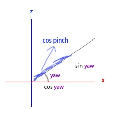

[TOC]

# 转自

https://learnopengl-cn.github.io/

https://learnopengl.com/

OpenGL本身没有**摄像机**(Camera)的概念，但可以通过把场景中的所有物体往相反方向移动的方式来模拟出摄像机，产生一种在移动的感觉，而不是场景在移动。

# 摄像机/观察空间

当讨论摄像机/观察空间(Camera/View Space)的时候，是在讨论以摄像机的视角作为场景原点时场景中所有的顶点坐标：观察矩阵把所有的世界坐标变换为相对于摄像机位置与方向的观察坐标。要定义一个摄像机，需要它在世界空间中的位置、观察的方向、一个指向它右测的向量以及一个指向它上方的向量。实际上创建了一个三个单位轴相互垂直的、以摄像机的位置为原点的坐标系。


## 1. 摄像机位置

摄像机位置简单来说就是世界空间中一个指向摄像机位置的向量。把摄像机位置设置为上一节中的那个相同的位置：

```
glm::vec3 cameraPos = glm::vec3(0.0f, 0.0f, 3.0f);
```

不要忘记正z轴是从屏幕指向你的，如果希望摄像机向后移动，就沿着z轴的正方向移动。

## 2. 摄像机方向

下一个需要的向量是摄像机的方向，这里指的是摄像机指向哪个方向。现在让摄像机指向场景原点：(0, 0, 0)。如果将两个矢量相减，就能得到这两个矢量的差。用场景原点向量减去摄像机位置向量的结果就是摄像机的指向向量。由于知道摄像机指向z轴负方向，但希望方向向量(Direction Vector)指向摄像机的z轴正方向。如果交换相减的顺序，就会获得一个指向摄像机正z轴方向的向量：

```
glm::vec3 cameraTarget = glm::vec3(0.0f, 0.0f, 0.0f);
glm::vec3 cameraDirection = glm::normalize(cameraPos - cameraTarget);
```

**方向**向量(Direction Vector)并不是最好的名字，因为它实际上指向从它到目标向量的相反方向（译注：注意看前面的那个图，蓝色的方向向量大概指向z轴的正方向，与摄像机实际指向的方向是正好相反的）。

## 3. 右轴

需要的另一个向量是一个**右向量**(Right Vector)，它代表摄像机空间的x轴的正方向。为获取右向量需要先使用一个小技巧：先定义一个**上向量**(Up Vector)。接下来把上向量和第二步得到的方向向量进行叉乘。两个向量叉乘的结果会同时垂直于两向量，因此会得到指向x轴正方向的那个向量（如果交换两个向量叉乘的顺序就会得到相反的指向x轴负方向的向量）：

```
glm::vec3 up = glm::vec3(0.0f, 1.0f, 0.0f); 
glm::vec3 cameraRight = glm::normalize(glm::cross(up, cameraDirection));
```

## 4. 上轴

现在已经有了x轴向量和z轴向量，获取一个指向摄像机的正y轴向量就相对简单了：把右向量和方向向量进行叉乘：

```
glm::vec3 cameraUp = glm::cross(cameraDirection, cameraRight);
```

在叉乘和一些小技巧的帮助下，创建了所有构成观察/摄像机空间的向量。在线性代数中这个处理叫做[格拉姆—施密特正交化](http://en.wikipedia.org/wiki/Gram–Schmidt_process)(Gram-Schmidt Process)。使用这些摄像机向量就可以创建一个LookAt矩阵了，它在创建摄像机的时候非常有用。

## Look At

使用矩阵的好处之一是如果使用3个相互垂直（或非线性）的轴定义了一个坐标空间，可以用这3个轴外加一个平移向量来创建一个矩阵，并且可以用这个矩阵乘以任何向量来将其变换到那个坐标空间。这正是**LookAt**矩阵所做的，现在有了3个相互垂直的轴和一个定义摄像机空间的位置坐标，可以创建LookAt矩阵了：
$$
LookAt = \begin{bmatrix}R_x & R_y & R_z & 0 \\ U_x & U_y & U_z & 0 \\ D_x & D_y & D_z & 0 \\ 0 & 0 & 0 & 1 \end{bmatrix} * \begin{bmatrix} 1 & 0 & 0 & -P_x \\ 0 & 1 & 0 & -P_y \\ 0 & 0 & 1 & -P_z \\ 0 & 0 & 0 & 1\end{bmatrix}
$$


其中R是右向量，U是上向量，D是方向向量P是摄像机位置向量。注意，位置向量是相反的，因为最终希望把世界平移到与自身移动的相反方向。把这个LookAt矩阵作为观察矩阵可以很高效地把所有世界坐标变换到刚刚定义的观察空间。LookAt矩阵就像它的名字表达的那样：它会创建一个看着(Look at)给定目标的观察矩阵。

GLM已经提供了这些支持。要做的只是定义一个摄像机位置，一个目标位置和一个表示世界空间中的上向量的向量（计算右向量使用的那个上向量）。接着GLM就会创建一个LookAt矩阵，可以把它当作观察矩阵：

```
glm::mat4 view;
view = glm::lookAt(glm::vec3(0.0f, 0.0f, 3.0f), 
           glm::vec3(0.0f, 0.0f, 0.0f), 
           glm::vec3(0.0f, 1.0f, 0.0f));
```

glm::LookAt函数需要一个位置、目标和上向量。它会创建一个和在上一节使用的一样的观察矩阵。

在讨论用户输入之前，先来做些有意思的事，把摄像机在场景中旋转。将摄像机的注视点保持在(0, 0, 0)。

需要用到一点三角学的知识来在每一帧创建一个x和z坐标，它会代表圆上的一点，使用它作为摄像机的位置。通过重新计算x和y坐标，遍历圆上的所有点，这样摄像机就会绕着场景旋转了。预先定义这个圆的半径radius，在每次渲染迭代中使用GLFW的glfwGetTime函数重新创建观察矩阵，来扩大这个圆。

```
float radius = 10.0f;
float camX = sin(glfwGetTime()) * radius;
float camZ = cos(glfwGetTime()) * radius;
glm::mat4 view;
view = glm::lookAt(glm::vec3(camX, 0.0, camZ), glm::vec3(0.0, 0.0, 0.0), glm::vec3(0.0, 1.0, 0.0)); 
```

如果运行代码，应该会得到下面的结果：


# 自由移动

让摄像机绕着场景转的确很有趣，但是让自己移动摄像机会更有趣！首先必须设置一个摄像机系统，所以在程序前面定义一些摄像机变量很有用：

```
glm::vec3 cameraPos   = glm::vec3(0.0f, 0.0f,  3.0f);
glm::vec3 cameraFront = glm::vec3(0.0f, 0.0f, -1.0f);
glm::vec3 cameraUp    = glm::vec3(0.0f, 1.0f,  0.0f);
```

`LookAt`函数现在成了：

```
view = glm::lookAt(cameraPos, cameraPos + cameraFront, cameraUp);
```

首先将摄像机位置设置为之前定义的cameraPos。方向是当前的位置加上刚刚定义的方向向量。这样能保证无论怎么移动，摄像机都会注视着目标方向。让摆弄一下这些向量，在按下某些按钮时更新cameraPos向量。

已经为GLFW的键盘输入定义过一个processInput函数了，新添加几个需要检查的按键命令：

```
void processInput(GLFWwindow *window)
{
    ...
    float cameraSpeed = 0.05f; // adjust accordingly
    if (glfwGetKey(window, GLFW_KEY_W) == GLFW_PRESS)
        cameraPos += cameraSpeed * cameraFront;
    if (glfwGetKey(window, GLFW_KEY_S) == GLFW_PRESS)
        cameraPos -= cameraSpeed * cameraFront;
    if (glfwGetKey(window, GLFW_KEY_A) == GLFW_PRESS)
        cameraPos -= glm::normalize(glm::cross(cameraFront, cameraUp)) * cameraSpeed;
    if (glfwGetKey(window, GLFW_KEY_D) == GLFW_PRESS)
        cameraPos += glm::normalize(glm::cross(cameraFront, cameraUp)) * cameraSpeed;
}
```

当按下**WASD**键的任意一个，摄像机的位置都会相应更新。如果希望向前或向后移动，就把位置向量加上或减去方向向量。如果希望向左右移动，使用叉乘来创建一个**右向量**(Right Vector)，并沿着它相应移动就可以了。这样就创建了使用摄像机时熟悉的横移(Strafe)效果。

>  注意，对**右向量**进行了标准化。如果没对这个向量进行标准化，最后的叉乘结果会根据cameraFront变量返回大小不同的向量。如果不对向量进行标准化，就得根据摄像机的朝向不同加速或减速移动了，但如果进行了标准化移动就是匀速的。现在应该能够移动摄像机了，虽然移动速度和系统有关，可能会需要调整一下cameraSpeed。

## 移动速度

目前的移动速度是个常量。理论上没什么问题，但是实际情况下根据处理器的能力不同，有些人可能会比其他人每秒绘制更多帧，也就是以更高的频率调用processInput函数。结果就是，根据配置的不同，有些人可能移动很快，而有些人会移动很慢。当发布程序的时候，必须确保它在所有硬件上移动速度都一样。

图形程序和游戏通常会跟踪一个时间差(Deltatime)变量，它储存了渲染上一帧所用的时间。把所有速度都去乘以deltaTime值。结果就是，如果deltaTime很大，就意味着上一帧的渲染花费了更多时间，所以这一帧的速度需要变得更高来平衡渲染所花去的时间。使用这种方法时，无论你的电脑快还是慢，摄像机的速度都会相应平衡，这样每个用户的体验就都一样了。

跟踪两个全局变量来计算出deltaTime值：

```
float deltaTime = 0.0f; // 当前帧与上一帧的时间差
float lastFrame = 0.0f; // 上一帧的时间
```

在每一帧中计算出新的deltaTime以备后用。

```
float currentFrame = glfwGetTime();
deltaTime = currentFrame - lastFrame;
lastFrame = currentFrame;
```

现在有了deltaTime，在计算速度的时候可以将其考虑进去了：

```
void processInput(GLFWwindow *window)
{
  float cameraSpeed = 2.5f * deltaTime;
  ...
}
```

与前面的部分结合在一起，有了一个更流畅点的摄像机系统：


# 视角移动

为了能够改变视角，需要根据鼠标的输入改变cameraFront向量。然而，根据鼠标移动改变方向向量有点复杂，需要一些三角学知识。

## 欧拉角

欧拉角(Euler Angle)是可以表示3D空间中任何旋转的3个值，由莱昂哈德·欧拉(Leonhard Euler)在18世纪提出。一共有3种欧拉角：俯仰角(Pitch)、偏航角(Yaw)和滚转角(Roll)，下面的图片展示了它们的含义：


俯仰角是描述如何往上或往下看的角，可以在第一张图中看到。第二张图展示了偏航角，偏航角表示往左和往右看的程度。滚转角代表如何**翻滚**摄像机，通常在太空飞船的摄像机中使用。每个欧拉角都有一个值来表示，把三个角结合起来就能够计算3D空间中任何的旋转向量了。

对于摄像机系统来说，只关心俯仰角和偏航角。给定一个俯仰角和偏航角，可以把它们转换为一个代表新的方向向量的3D向量。俯仰角和偏航角转换为方向向量的处理需要一些三角学知识，先从最基本的情况开始：


如果把斜边边长定义为1，就能知道邻边的长度是 $\cos {x/h} = \cos {x/1} = \cos {x}$，它的对边是 $\sin {y/h} = \sin {y/1} =\sin {y}$。这样获得了能够得到 $x$ 和 $y$ 方向长度的通用公式，它们取决于所给的角度。使用它来计算方向向量的分量：


这个三角形看起来和前面的三角形很像，所以如果想象自己在 $xz$ 平面上，看向 $y$ 轴，可以基于第一个三角形计算来计算它的长度/y方向的强度(Strength)（往上或往下看多少）。从图中可以看到对于一个给定俯仰角的 $y$ 值等于$\sin⁡ {\theta}$：

```
direction.y = sin(glm::radians(pitch)); // 注意先把角度转为弧度
```

这里只更新了 $y$ 值，仔细观察 $x$ 和 $z$ 分量也被影响了。从三角形中可以看到它们的值等于：

```
direction.x = cos(glm::radians(pitch));
direction.z = cos(glm::radians(pitch));
```

看看是否能够为偏航角找到需要的分量：


就像俯仰角的三角形一样，可以看到x分量取决于`cos(yaw)`的值，z值同样取决于偏航角的正弦值。把这个加到前面的值中，会得到基于俯仰角和偏航角的方向向量：

```
direction.x = cos(glm::radians(pitch)) * cos(glm::radians(yaw)); // 译注：direction代表摄像机的前轴(Front)，这个前轴是和本文第一幅图片的第二个摄像机的方向向量是相反的
direction.y = sin(glm::radians(pitch));
direction.z = cos(glm::radians(pitch)) * sin(glm::radians(yaw));
```

这样就有了一个可以把俯仰角和偏航角转化为用来自由旋转视角的摄像机的3维方向向量了。怎么得到俯仰角和偏航角？

偏航角找到需要的分量少标注了一个已知变量cos pitch



## 鼠标输入

偏航角和俯仰角是通过鼠标（或手柄）移动获得的，水平的移动影响偏航角，竖直的移动影响俯仰角。它的原理就是，储存上一帧鼠标的位置，在当前帧中我们当前计算鼠标位置与上一帧的位置相差多少。如果水平/竖直差别越大那么俯仰角或偏航角就改变越大，也就是摄像机需要移动更多的距离。

首先要告诉GLFW，它应该隐藏光标，并捕捉(Capture)它。捕捉光标表示的是，如果焦点在程序上（译注：即表示正在操作这个程序，Windows中拥有焦点的程序标题栏通常是有颜色的那个，而失去焦点的程序标题栏则是灰色的），光标应该停留在窗口中（除非程序失去焦点或者退出）。可以用一个简单地配置调用来完成：

```
glfwSetInputMode(window, GLFW_CURSOR, GLFW_CURSOR_DISABLED);
```

在调用这个函数之后，无论怎么去移动鼠标，光标都不会显示了，它也不会离开窗口。对于FPS摄像机系统来说非常完美。

为了计算俯仰角和偏航角，需要让GLFW监听鼠标移动事件。（和键盘输入相似）会用一个回调函数来完成，函数的原型如下：

```
void mouse_callback(GLFWwindow* window, double xpos, double ypos);
```

这里的xpos和ypos代表当前鼠标的位置。当用GLFW注册了回调函数之后，鼠标一移动mouse_callback函数就会被调用：

```
glfwSetCursorPosCallback(window, mouse_callback);
```

在处理FPS风格摄像机的鼠标输入的时候，必须在最终获取方向向量之前做下面这几步：

1. 计算鼠标距上一帧的偏移量。
2. 把偏移量添加到摄像机的俯仰角和偏航角中。
3. 对偏航角和俯仰角进行最大和最小值的限制。
4. 计算方向向量。

第一步是计算鼠标自上一帧的偏移量。必须先在程序中储存上一帧的鼠标位置，把它的初始值设置为屏幕的中心（屏幕的尺寸是800x600）：

```
float lastX = 400, lastY = 300;
```

然后在鼠标的回调函数中计算当前帧和上一帧鼠标位置的偏移量：

```
float xoffset = xpos - lastX;
float yoffset = lastY - ypos; // 注意这里是相反的，因为y坐标是从底部往顶部依次增大的
lastX = xpos;
lastY = ypos;

float sensitivity = 0.05f;
xoffset *= sensitivity;
yoffset *= sensitivity;
```

注意把偏移量乘以了sensitivity（灵敏度）值。如果忽略这个值，鼠标移动就会太大了；可以自己实验一下，找到适合自己的灵敏度值。

接下来把偏移量加到全局变量pitch和yaw上：

```
yaw   += xoffset;
pitch += yoffset;
```

第三步，需要给摄像机添加一些限制，这样摄像机就不会发生奇怪的移动了（这样也会避免一些奇怪的问题）。对于俯仰角，要让用户不能看向高于89度的地方（在90度时视角会发生逆转，所以把89度作为极限），同样也不允许小于-89度。这样能够保证用户只能看到天空或脚下，但是不能超越这个限制。可以在值超过限制的时候将其改为极限值来实现：

```
if(pitch > 89.0f)
  pitch =  89.0f;
if(pitch < -89.0f)
  pitch = -89.0f;
```

注意没有给偏航角设置限制，这是因为不希望限制用户的水平旋转。当然，给偏航角设置限制也很容易，可以自己实现。

第四也是最后一步，就是通过俯仰角和偏航角来计算以得到真正的方向向量：

```
glm::vec3 front;
front.x = cos(glm::radians(pitch)) * cos(glm::radians(yaw));
front.y = sin(glm::radians(pitch));
front.z = cos(glm::radians(pitch)) * sin(glm::radians(yaw));
cameraFront = glm::normalize(front);
```

计算出来的方向向量就会包含根据鼠标移动计算出来的所有旋转了。由于cameraFront向量已经包含在GLM的lookAt函数中，这就没什么问题了。

如果现在运行代码，会发现在窗口第一次获取焦点的时候摄像机会突然跳一下。这个问题产生的原因是，在鼠标移动进窗口的那一刻，鼠标回调函数就会被调用，这时候的xpos和ypos会等于鼠标刚刚进入屏幕的那个位置。这通常是一个距离屏幕中心很远的地方，因而产生一个很大的偏移量，所以就会跳了。可以简单的使用一个`bool`变量检验是否是第一次获取鼠标输入，如果是，那么先把鼠标的初始位置更新为xpos和ypos值，这样就能解决这个问题；接下来的鼠标移动就会使用刚进入的鼠标位置坐标来计算偏移量了：

```
if(firstMouse) // 这个bool变量初始时是设定为true的
{
    lastX = xpos;
    lastY = ypos;
    firstMouse = false;
}
```

最后的代码应该是这样的：

```
void mouse_callback(GLFWwindow* window, double xpos, double ypos)
{
    if(firstMouse)
    {
        lastX = xpos;
        lastY = ypos;
        firstMouse = false;
    }

    float xoffset = xpos - lastX;
    float yoffset = lastY - ypos; 
    lastX = xpos;
    lastY = ypos;

    float sensitivity = 0.05;
    xoffset *= sensitivity;
    yoffset *= sensitivity;

    yaw   += xoffset;
    pitch += yoffset;

    if(pitch > 89.0f)
        pitch = 89.0f;
    if(pitch < -89.0f)
        pitch = -89.0f;

    glm::vec3 front;
    front.x = cos(glm::radians(yaw)) * cos(glm::radians(pitch));
    front.y = sin(glm::radians(pitch));
    front.z = sin(glm::radians(yaw)) * cos(glm::radians(pitch));
    cameraFront = glm::normalize(front);
}
```

现在就可以自由地在3D场景中移动了！

## 缩放

作为摄像机系统的一个附加内容，实现一个缩放(Zoom)接口。在之前的教程中说**视野**(Field of View)或**fov**定义了可以看到场景中多大的范围。当视野变小时，场景投影出来的空间就会减小，产生放大(Zoom In)了的感觉。会使用鼠标的滚轮来放大。与鼠标移动、键盘输入一样，需要一个鼠标滚轮的回调函数：

```
void scroll_callback(GLFWwindow* window, double xoffset, double yoffset)
{
  if(fov >= 1.0f && fov <= 45.0f)
    fov -= yoffset;
  if(fov <= 1.0f)
    fov = 1.0f;
  if(fov >= 45.0f)
    fov = 45.0f;
}
```

当滚动鼠标滚轮的时候，yoffset值代表竖直滚动的大小。当scroll_callback函数被调用后，改变全局变量fov变量的内容。因为`45.0f`是默认的视野值，把缩放级别(Zoom Level)限制在`1.0f`到`45.0f`。

现在在每一帧都必须把透视投影矩阵上传到GPU，但现在使用fov变量作为它的视野：

```
projection = glm::perspective(glm::radians(fov), 800.0f / 600.0f, 0.1f, 100.0f);
```

最后不要忘记注册鼠标滚轮的回调函数：

```
glfwSetScrollCallback(window, scroll_callback);
```

现在，就实现了一个简单的摄像机系统了，它能够让我们在3D环境中自由移动。


> 注意，使用欧拉角的摄像机系统并不完美。根据你的视角限制或者是配置，你仍然可能引入[万向节死锁](http://en.wikipedia.org/wiki/Gimbal_lock)问题。最好的摄像机系统是使用四元数(Quaternions)的，但我们将会把这个留到后面讨论。（译注：[这里](https://github.com/cybercser/OpenGL_3_3_Tutorial_Translation/blob/master/Tutorial 17 Rotations.md)可以查看四元数摄像机的实现）

# 摄像机类

接下来的教程中，将会一直使用一个摄像机来浏览场景，从各个角度观察结果。然而，由于一个摄像机会占用每篇教程很大的篇幅，从细节抽象出来，创建自己的摄像机对象，它会完成大多数的工作，而且还会提供一些附加的功能。与着色器教程不同，不会带你一步一步创建摄像机类，只会提供你一份（有完整注释的）代码，如果你想知道它的内部构造的话可以自己去阅读。

和着色器对象一样，把摄像机类写在一个单独的头文件中。

> 介绍的摄像机系统是一个FPS风格的摄像机，它能够满足大多数情况需要，而且与欧拉角兼容，但是在创建不同的摄像机系统，比如飞行模拟摄像机时就要当心。每个摄像机系统都有自己的优点和不足，所以确保对它们进行了详细研究。比如，这个FPS摄像机不允许俯仰角大于90度，而且使用了一个固定的上向量(0, 1, 0)，这在需要考虑滚转角的时候就不能用了。

# 练习

- 看看你是否能够修改摄像机类，使得其能够变成一个**真正的**FPS摄像机（也就是说不能够随意飞行）；你只能够呆在xz平面上。
- 试着创建你自己的LookAt函数，其中你需要手动创建一个我们在一开始讨论的观察矩阵。用你的函数实现来替换GLM的LookAt函数，看看它是否还能一样地工作。


# 词汇表

- **OpenGL**： 一个定义了函数布局和输出的图形API的正式规范。
- **GLAD**： 一个拓展加载库，用来为我们加载并设定所有OpenGL函数指针，从而让我们能够使用所有（现代）OpenGL函数。
- **视口(Viewport)**： 我们需要渲染的窗口。
- **图形管线(Graphics Pipeline)**： 一个顶点在呈现为像素之前经过的全部过程。
- **着色器(Shader)**： 一个运行在显卡上的小型程序。很多阶段的图形管道都可以使用自定义的着色器来代替原有的功能。
- **标准化设备坐标(Normalized Device Coordinates, NDC)**： 顶点在通过在剪裁坐标系中剪裁与透视除法后最终呈现在的坐标系。所有位置在NDC下-1.0到1.0的顶点将不会被丢弃并且可见。
- **顶点缓冲对象(Vertex Buffer Object)**： 一个调用显存并存储所有顶点数据供显卡使用的缓冲对象。
- **顶点数组对象(Vertex Array Object)**： 存储缓冲区和顶点属性状态。
- **索引缓冲对象(Element Buffer Object)**： 一个存储索引供索引化绘制使用的缓冲对象。
- **Uniform**： 一个特殊类型的GLSL变量。它是全局的（在一个着色器程序中每一个着色器都能够访问uniform变量），并且只需要被设定一次。
- **纹理(Texture)**： 一种包裹着物体的特殊类型图像，给物体精细的视觉效果。
- **纹理缠绕(Texture Wrapping)**： 定义了一种当纹理顶点超出范围(0, 1)时指定OpenGL如何采样纹理的模式。
- **纹理过滤(Texture Filtering)**： 定义了一种当有多种纹素选择时指定OpenGL如何采样纹理的模式。这通常在纹理被放大情况下发生。
- **多级渐远纹理(Mipmaps)**： 被存储的材质的一些缩小版本，根据距观察者的距离会使用材质的合适大小。
- **stb_image.h**： 图像加载库。
- **纹理单元(Texture Units)**： 通过绑定纹理到不同纹理单元从而允许多个纹理在同一对象上渲染。
- **向量(Vector)**： 一个定义了在空间中方向和/或位置的数学实体。
- **矩阵(Matrix)**： 一个矩形阵列的数学表达式。
- **GLM**： 一个为OpenGL打造的数学库。
- **局部空间(Local Space)**： 一个物体的初始空间。所有的坐标都是相对于物体的原点的。
- **世界空间(World Space)**： 所有的坐标都相对于全局原点。
- **观察空间(View Space)**： 所有的坐标都是从摄像机的视角观察的。
- **裁剪空间(Clip Space)**： 所有的坐标都是从摄像机视角观察的，但是该空间应用了投影。这个空间应该是一个顶点坐标最终的空间，作为顶点着色器的输出。OpenGL负责处理剩下的事情（裁剪/透视除法）。
- **屏幕空间(Screen Space)**： 所有的坐标都由屏幕视角来观察。坐标的范围是从0到屏幕的宽/高。
- **LookAt矩阵**： 一种特殊类型的观察矩阵，它创建了一个坐标系，其中所有坐标都根据从一个位置正在观察目标的用户旋转或者平移。
- **欧拉角(Euler Angles)**： 被定义为偏航角(Yaw)，俯仰角(Pitch)，和滚转角(Roll)从而允许我们通过这三个值构造任何3D方向。