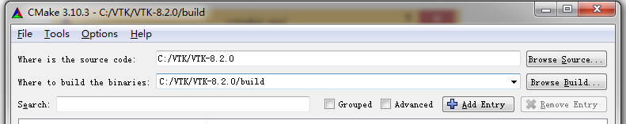
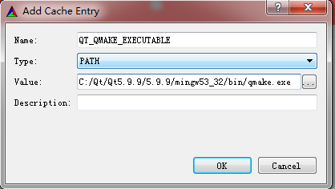
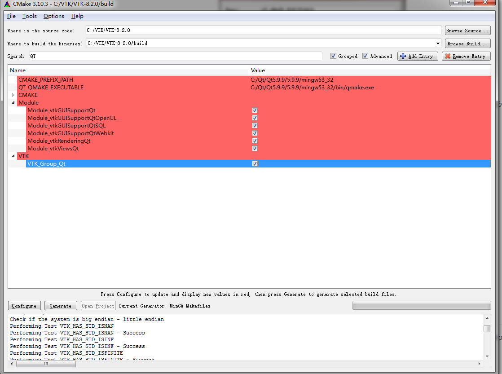

[TOC]

# 1.编译与安装

## Qt5.14（MinGW）使用 CMake 编译与使用 VTK8

### 本文使用的各软件版本

- Qt：5.14.0
- MinGW：5.3.0
- CMake：3.10.3
- VTK：8.2.0

### 各软件下载地址

- Qt with MinGW：http://www.qt.io/download-open-source/
- CMake：http://www.cmake.org/download/
- VTK：http://vtk.org/VTK/resources/software.html

### 编译VTK

安装 Qt （安装过程中注意勾选安装MinGW）与 CMake ，并添加与 Qt 集成安装的 MinGW 可执行程序路径（ Qt***/Tools/mingw***/bin，即 mingw32-make.exe 所在路径（C:\Qt\Qt5.9.9\Tools\mingw530_32\bin;）到系统环境变量 *PATH*。 解压 VTK，建议解压后路径不要包含中文与空格。

启动 CMake，并指定源代码路径和生成路径：



配置生成器为 MinGW：点击 CMake 中的 **Configure** 进行第一次配置，配置完成后，勾选 **Search** 框后的 **Grouped** 与 **Advanced**。


在 *CMAKE* 下设置 *CMAKE_INSTALL_PREFIX* 为编译完成后 VTK 期望的安装路径，如C:/VTK/VTK_INSTALL。

VTK_DATA_STORE设置，避免勾选Test选项以后下载数据 C:/VTK/VTKData-8.2.0/.ExternalData

勾选VTK_USE_LARGE_DATA

在 *Module* 下勾选 *Module_vtkGUISupportQt*、 *Module_vtkGUISupportQtOpenGL*、 *Module_vtkGUISupportQtSQL*、 ~~*Module_vtkGUISupportQtWebkit*~~（vtk8.1以后不支持vtk_module(vtkGUISupportQtWebkit LEGACY 8.1 "The module is no longer supported."）、 *Module_vtkRenderingQt*、 *Module_vtkViewsQt* 、*Module_vtkTestingCore*。

在 *VTK* 下勾选 *VTK_Group_Qt*。

如果需要编译为静态链接库，在 *BUILD* 下取消勾选 *BUILD_SHARED_LIBS*（如编译为静态链接库，使用时可能会遇到 lib 文件循环依赖问题）。

如果需要编译为 Release，在 *CMAKE* 下修改 *CMAKE_BUILD_TYPE* 为 *Release*。

如果需要在 Debug 模式下编译生成的库文件带 *d* 后缀，点击 **Add Entry**，手动添加后缀项， *Name* 为 *CMAKE_DEBUG_POSTFIX*， *Type* 为 *STRING*， *Value* 为 *d*。

点击 **Add Entry**，手动添加 qmake 所在路径， *Name* 为 *QT_QMAKE_EXECUTABLE*， *Type* 为 *PATH*， *Value* 为 *qmake.exe* 所在完整路径：



点击 **Add Entry**，手动添加 Qt 安装目录， *Name* 为 *CMAKE_PREFIX_PATH*， *Type* 为 *PATH*， *Value* 为 Qt 安装目录（应为包含 *qmake.exe* 的 *bin* 的父目录，可对照上下两图）：





再次点击Configure

此时在界面下方的消息输出窗口中，将输出 *Configuring done*，点击 **Generate**。

生成完成后，将输出 *Generating done*。

在最开始在CMake中指定的生成路径中打开命令行窗口，输入 *mingw32-make*，开始编译生成：


遇到报错：

```
C:/Qt/Qt5.9.9/Tools/mingw530_32/bin/../lib/gcc/i686-w64-mingw32/5.3.0/../../../.
./i686-w64-mingw32/bin/as.exe: CMakeFiles\vtkCommonCore.dir\vtkDataArray.cxx.obj
: too many sections (35078)
C:\Users\icuipi\AppData\Local\Temp\ccEAHVA7.s: Assembler messages:
C:\Users\icuipi\AppData\Local\Temp\ccEAHVA7.s: Fatal error: can't write CMakeFil
es\vtkCommonCore.dir\vtkDataArray.cxx.obj: File too big
C:/Qt/Qt5.9.9/Tools/mingw530_32/bin/../lib/gcc/i686-w64-mingw32/5.3.0/../../../.
./i686-w64-mingw32/bin/as.exe: CMakeFiles\vtkCommonCore.dir\vtkDataArray.cxx.obj
: too many sections (35078)
C:\Users\icuipi\AppData\Local\Temp\ccEAHVA7.s: Fatal error: can't close CMakeFil
es\vtkCommonCore.dir\vtkDataArray.cxx.obj: File too big
Common\Core\CMakeFiles\vtkCommonCore.dir\build.make:667: recipe for target 'Comm
on/Core/CMakeFiles/vtkCommonCore.dir/vtkDataArray.cxx.obj' failed
mingw32-make[2]: *** [Common/Core/CMakeFiles/vtkCommonCore.dir/vtkDataArray.cxx.
obj] Error 1
CMakeFiles\Makefile2:298: recipe for target 'Common/Core/CMakeFiles/vtkCommonCor
e.dir/all' failed
mingw32-make[1]: *** [Common/Core/CMakeFiles/vtkCommonCore.dir/all] Error 2
Makefile:128: recipe for target 'all' failed
mingw32-make: *** [all] Error 2
```


参考如下错误解决

**将出错的文件：VTK-8.2.0\Common\Core\vtkDataArray.cxx分为两个文件，将ComputeFiniteScalarRange、ComputeFiniteVectorRange两个函数（及其使用的struct定义复制一遍）移动到vtkDataArray1.cxx文件中，并修改cmakelist，添加了vtkDataArray1.cxx，再进行编译，就解决了此问题。**


编译完成后，执行 *mingw32-make install*，将编译生成文件输出到已配置的 *CMAKE_INSTALL_PREFIX* 目录中，此时该目录中将有 *bin*、 *include*、 *lib*、 *plugins*、 *share* 文件夹。

如果在添加了 *d* 后缀进行编译后执行 *mingw32-make install* 时，提示 *libQVTKWidgetPlugin.dll* 文件复制错误，可手动修改 **生成目录/GUISupport/Qt/PluginInstall.cmake** 文件，将其中的 *libQVTKWidgetPlugin.dll* 修改为 *libQVTKWidgetPlugind.dll*。


## 错误解决

### 错误1

使用qt5.14编译vtk，cmake选择release版本时，编译正常通过。但程序链接时，debug版本无法运行，报错：Must construct a QApplication before a QWidget。所以只能编译debug版的vtk，结果出现File too big/too many sections错误：

出现此错误的原因是obj文件太大了，通过查找资料，发现obj文件过大时，需要配置选项： -Wa,-mbig-obj

但通过命令行直接修改gcc参数的方式进行了实验，无效。发现在链接：

http://mingw.5.n7.nabble.com/File-too-big-too-many-sections-td29467.html

中说到，You've probably hit a hard memory limit such that the object image is

greater than 2GB. There is no work around for a hard limit other than

to reduce the size of the object is some fashion.

所以应该无法通过配置实现debug版本编译了，于是考虑缩小obj文件的大小，打算将一个obj分为两个，分别编译。将出错的文件：VTK-8.2.0\Common\Core\vtkDataArray.cxx分为两个文件，将ComputeFiniteScalarRange、ComputeFiniteVectorRange两个函数（及其使用的struct定义复制一遍）移动到vtkDataArray1.cxx文件中，并修改cmakelist，添加了vtkDataArray1.cxx，再进行编译，就解决了此问题。


### 错误2

出现 如下错误：

CMakeFiles\vtkglew.dir/objects.a(glew.c.obj):glew.c:(.text+0x13601): undefined reference to `memset'

 解决： 进入 build\build_Mingw730_64\ThirdParty\glew\vtkglew\CMakeFiles\vtkglew.dir 目录，编辑 flags.make, 增加红色部分

 C_FLAGS =  -mwin32 -mthreads -w -w -O3 -DNDEBUG <font color="red"> -minline-all-stringops </font>

```
 C_FLAGS =  -mwin32 -mthreads -w -w -O3 -DNDEBUG -minline-all-stringops
```

### MinGW 7.3

只需要设置CMAKE_CXX_FLAGS为-Wa,-mbig-obj，即可解决file too big问题。

因为VTK8.1以后不支持vtkGUISupportQtWebkit，去掉勾选Module_vtkGUISupportQtWebkit；编译不报错。

# 2.第一个QT VTK程序

### ImageViewer 程序

**说明：**本示例程序修改自 **VTK-8.2.0/Examples/GUI/Qt/ImageViewer**。

新建 **Qt Widgets** 程序，将 **.pro** 文件修改为类似如下：

```
QT       += core gui

greaterThan(QT_MAJOR_VERSION, 4): QT += widgets

CONFIG += c++11

# You can make your code fail to compile if it uses deprecated APIs.
# In order to do so, uncomment the following line.
#DEFINES += QT_DISABLE_DEPRECATED_BEFORE=0x060000    # disables all the APIs deprecated before Qt 6.0.0

INCLUDEPATH += C:/vtk/VTK8.2/include/vtk-8.2

LIBS += -LC:/vtk/VTK8.2/lib/ \
        -lvtkGUISupportQt-8.2 \
        -lvtkIOImage-8.2 \
        -lvtkInteractionImage-8.2 \
        -lvtkRenderingCore-8.2 \
        -lvtkRenderingOpenGL2-8.2 \
        -lvtkCommonExecutionModel-8.2 \
        -lvtkCommonCore-8.2  \
        -lvtkInteractionStyle-8.2


SOURCES += \
    main.cpp \

HEADERS += \

FORMS += \

# Default rules for deployment.
qnx: target.path = /tmp/$${TARGET}/bin
else: unix:!android: target.path = /opt/$${TARGET}/bin
!isEmpty(target.path): INSTALLS += target
```

修改main.cpp

```
#include <QApplication>
#include <QSurfaceFormat>

#include <vtkAutoInit.h>
VTK_MODULE_INIT(vtkRenderingOpenGL2)
VTK_MODULE_INIT(vtkInteractionStyle)

#include "vtkGenericOpenGLRenderWindow.h"
#include "vtkImageViewer.h"
#include "vtkRenderWindowInteractor.h"
#include "vtkRenderer.h"
#include "vtkPNGReader.h"
#include "vtkTestUtilities.h"

#include "QVTKOpenGLWidget.h"

int main(int argc, char** argv)
{
  // set surface format before application initialization
  QSurfaceFormat::setDefaultFormat(QVTKOpenGLWidget::defaultFormat());
  QApplication app(argc, argv);
  QVTKOpenGLWidget widget;
  widget.resize(256,256);
  vtkNew<vtkGenericOpenGLRenderWindow> renWin;
  widget.SetRenderWindow(renWin);

  vtkNew<vtkPNGReader> reader;
  char* fname = vtkTestUtilities::ExpandDataFileName(argc, argv, "vtk.png");
  reader->SetFileName(fname);
  delete [] fname;

  vtkNew<vtkImageViewer> image_view;
  // use our render window with image_view
  image_view->SetRenderWindow(renWin);
  image_view->SetInputConnection(reader->GetOutputPort());
  image_view->SetupInteractor(renWin->GetInteractor());
  image_view->SetColorLevel(138.5);
  image_view->SetColorWindow(233);

  widget.show();

  app.exec();
  return 0;
}

```

上述代码中，vtk.png的路径为：../../../../VTKData/vtk.png；这个需要注意，不然会找不到图片在哪。

将其中的 `char filename[] = "D:/vtk.png";` 指定为需要通过使用 VTK 显示的图片的路径（如果不是 *png* 图片，需要修改对应的 *Reader* 对象）。

编译运行后（为能在 QtCreator 中直接启动程序，可能需要将 VTK 编译安装后的 *bin* 路径添加到系统环境变量 *PATH*），程序将在窗口中显示程序中指定文件名对应的图片（如上面代码中的 *D:/test.png*）。或者将vtk安装目录的bin目录下的所有dll文件拷贝到生成的可执行文件目录


## 问题总结

- 1.虚拟机不行，猜测是报错是因为例子用到了gpu，而虚拟机没有gpu驱动的关系
- 2.vtk编译为release版本，所以例子的debug版本不行，但是release版本可以，猜测vtk的debug版本对应例子的debug版本。


# Linux

生成libQVTKWidgetPlugin.so文件，将VTK-build-Qt5/lib目录下的libQVTKWidgetPlugin.so复制放到Qt5.12.0/Tools/QtCreator/lib/Qt/plugins/designer目录下．打开qt,就可以看到QVTKWidget插件已经在QTCreator中了．


# 参考文章

https://csuzhangxc.gitbooks.io/vtk-simple-tutorial/content/getting_started/build.html

https://www.cnblogs.com/yangzifb/p/11486238.html

https://vtk.org/Wiki/VTK/Configure_and_Build

http://vtk.1045678.n5.nabble.com/vtk-users-VTK-6-0-Compile-issue-with-MinGW64-on-Windows-7-x64-td5724152.html#a5726939

