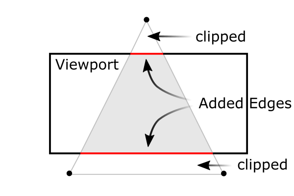
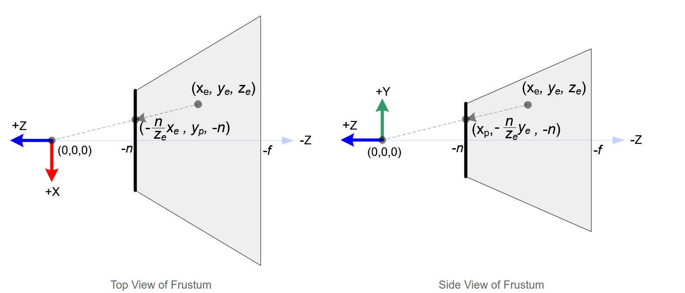
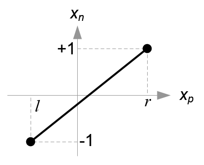
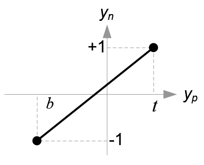
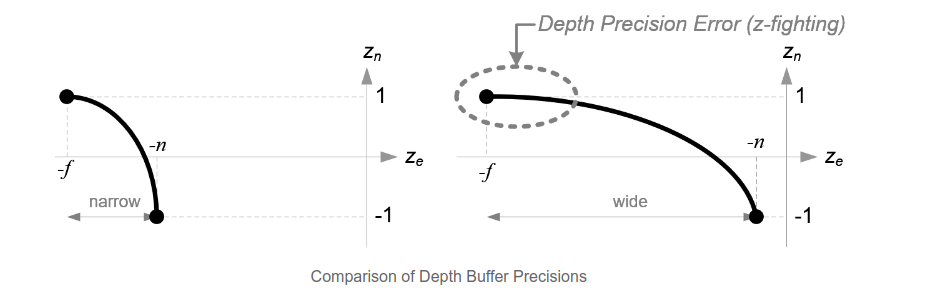
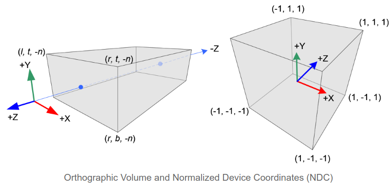
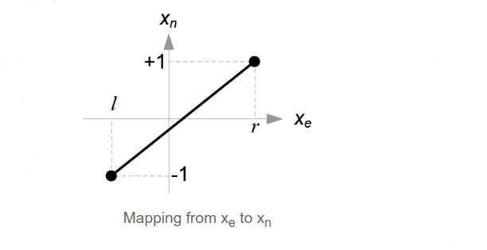
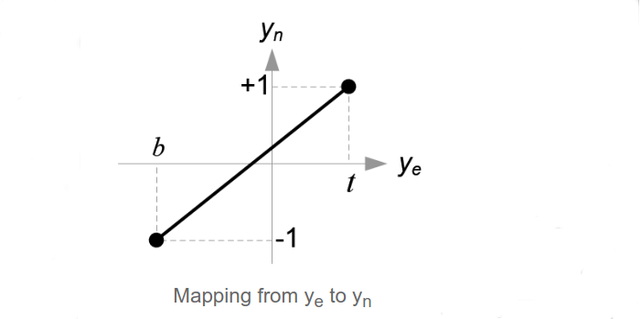
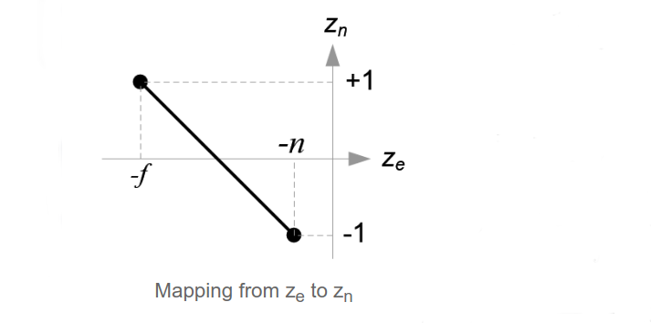

[TOC]

译自：http://www.songho.ca/opengl/gl_projectionmatrix.html

电脑屏幕是二维显示，3D场景必须作为2D图像投影到计算机屏幕上。PROJECTION矩阵用于此投影转换。首先，它将所有顶点数据从观察（View）坐标转换为剪切坐标。 然后，将剪切坐标除以w分量转换为归一化设备坐标（NDC）。

裁剪和NDC转换都已集成到PROJECTION矩阵中。 以下描述了如何从6个参数构建投影矩阵。 左（left），右（right），下（bottom），上（top），近（near）和远（far）边界值。

>  注意：在使用 $w_c$ 进行除法之前，使用平截头体(Frustum)(视锥)进行坐标剪切。通过将坐标$x_c, y_c, z_c$ 和 $w_c$比较进行测试。小于或大于 $w_c$的坐标将会被丢弃。$-w_c < x_c, y_c, z_c < w_c$，然后在发生裁剪的位置重建多边形的边缘。

# Perspective Projection

在透视投影中，将平截头体（像被截断的金字塔）中的3D点（观察坐标）映射到立方体（NDC）；x的坐标范围是从[l，r]到[-1，1]，y坐标的范围是从[b，t]到[-1，1]，z坐标的范围是从[-n，-f]到[-1，1]。

> 注意：观察坐标使用的是右手坐标，NDC使用的是左手坐标系。也就是说，原点的相机在观察空间中沿-Z轴方向观看，但在NDC中则沿+Z轴方向观看。由于vtkCamera 中的 Frustum仅接受近距离和远距离的正值，因此我们在构造PROJECTION矩阵时需要将它们取反。

一般观察空间中的3D点投影到近平面（投影平面）上。 下图显示了观察空间中的点 $(x_e, y_e, z_e)$ 如何投影到近平面上的 $(x_p, y_p, z_p)$ 。

从视锥的顶视图来看，观察空间的 $x$ 坐标 $x_e$ 映射到 $x_p$ ，而 $x_p$ 是通过使用相似三角形的比率来计算的；
$$
\frac{x_p}{x_e} = \frac{-n}{z_e} \\
x_p = \frac{n \cdot x_e}{-z_e}
$$
从视锥的侧面看，$y_p$的计算方法也与此类似。
$$
\frac{y_p}{y_e} = \frac{-n}{z_e} \\
y_p = \frac{n \cdot y_e}{-z_e}
$$
由上可以看出，$x_p, y_p$ 都取决于 $z_e$。并且和 $z_e$ 成反比，这是构造PROJECTION矩阵的第一个线索。观察坐标通过乘以PROJECTION进行变换以后，仍然是一个齐次坐标，通过除以剪切坐标的 $w$ 分量得到最终的归一化设备坐标（NDC）。
$$
\begin{pmatrix}x_{clip} \\ y_{clip} \\ z_{clip} \\ w_{clip} \end{pmatrix} = M_{projection} \cdot \begin{pmatrix} x_{eye} \\ y_{eye} \\ z_{eye} \\ w_{eye}\end{pmatrix}, \quad \begin{pmatrix} x_{ndc} \\ y{ndc} \\ z_{ndc} \end{pmatrix} = \begin{pmatrix} x_{clip} / w_{clip} \\ y_{clip}  / w_{clip} \\ z_{clip}  / w_{clip} \end{pmatrix}
$$
因此，可以将剪切坐标的 $w$ 分量设置为 $-z_e$ 。 并且，PROJECTION矩阵的第4个变为（0，0，-1，0）。
$$
\begin{pmatrix}x_{c} \\ y_{c} \\ z_{c} \\ w_{c} \end{pmatrix} = \begin{pmatrix}. & . & . &. \\ . & . & . &. \\ . & . & . &. \\ 0 & 0 & -1 & 0 \end{pmatrix} \begin{pmatrix}x_{e} \\ y_{e} \\ z_{e} \\ w_{e} \end{pmatrix} ,\quad \therefore w_c = -z_e
$$
接下来，可以将$x_p, y_p$ 以线性关系映射到 NDC的 $x_n, y_n$ ；$[l, r] \Longrightarrow [-1, 1]$ 和 $[b, t] \Longrightarrow [-1, 1]$。

Mapping from x_p to x_n.

$$
x_n = \frac{1 - (-1)}{r - l} \cdot x_p + \beta \\
(substitute (r, 1) for (x_p, x_n)) \Longrightarrow 1 = \frac{2r}{r - l} + \beta \\
\beta  = 1 - \frac{2r}{r - l} = \frac{r - l}{r - l} - \frac{2r}{r - l} \\
=\frac{r -l - 2r}{r - l} = \frac{-r - l}{r - l} = -\frac{r + l}{r - l}\\
\therefore x_n = \frac{2x_p}{r - l} - \frac{r + l}{r - l}
$$

Mapping from y_p to y_n

$$
y_n = \frac{1 - (-1)}{t - b} \cdot y_p + \beta \\
(substitute (t, 1) for (y_p, y_n)) \Longrightarrow 1 = \frac{2t}{t - b} + \beta \\
\beta  = 1 - \frac{2t}{t - b} = \frac{t - b}{t - b} - \frac{2t}{t - b} \\
=\frac{t - b - 2t}{t - b} = \frac{-t - b}{t - b} = -\frac{t + b}{t - b}\\
\therefore y_n = \frac{2y_p}{t - b} - \frac{t + b}{t - b}
$$

然后，将 $x_p$ 和 $y_p$代入上述方程式。
$$
x_n = \frac{2x_p}{r - l} - \frac{r + l}{r - l} \qquad (x_p = \frac{nx_e}{-z_e})  \\
= \frac{2 \cdot \frac{n \cdot x_e}{-z_e}}{r - l} - \frac{r + l}{r - l} \\
= \frac{2n \cdot x_e}{(r - l)(-z_e)} - \frac{r + l}{r - l} \\
= \frac{\frac{2n}{r - l} \cdot x_e}{-z_e} - \frac{r + l}{r - l} \\
= \frac{\frac{2n}{r - l} \cdot x_e}{-z_e} + \frac{\frac{r + l}{r - l} \cdot z_e}{-z_e} \\ 
= (\underbrace{\frac{2n}{r - l} \cdot x_e + \frac{r + l}{r - l} \cdot z_e}_{x_c}) / -z_e
$$

$$
y_n = \frac{2y_p}{t - b} - \frac{t + b}{t - b} \qquad (y_p = \frac{ny_e}{-z_e})   \\
= \frac{2 \cdot \frac{ny_e}{-z_e}}{t - b} - \frac{t + b}{t - b}  \\
= \frac{2n \cdot y_e}{(t - b)(-z_e)} - \frac{t + b}{t - b}  \\
= \frac{\frac{2n}{t - b} \cdot y_e}{-z_e} - \frac{t + b}{t - b} \\
= \frac{\frac{2n}{t - b} \cdot y_e}{-z_e} + \frac{\frac{t + b}{t - b} \cdot z_e}{-z_e} \\
= (\underbrace{\frac{2n}{t - b} \cdot y_e + \frac{t + b}{t - b} \cdot z_e}_{y_c}) / -z_e
$$

> 注意：对比透视除法 $(x_C/w_c, y_c/w_c)$ ，上面每个方程都除以 $-z_e$。并且上面已经将 $w_c$ 设置为 $-z_e$，所以括号内的值变成了剪切坐标里面的 $x_c$ 和 $y_c$ 。

从上面的方程式中，可以得到PROJECTION矩阵的第一行和第二行。

$$
\begin{pmatrix}x_c \\ y_c \\ z_c \\ w_c \end{pmatrix} = \begin{pmatrix}\frac{2n}{r - l} & 0 & \frac{r+l}{r - l} & 0 \\ 0 & \frac{2n}{t -b} & \frac{t+b}{t -b} & 0 \\ . & . & . & . \\ 0 & 0 & -1 & 0\end{pmatrix} \begin{pmatrix}x_e \\ y_e \\ z_e \\ z_e \end{pmatrix}
$$

现在只需要解决PROJECTION的第三行就可以了。可以发现 $z_n$ 与其他变量的不同之处在于 观察空间中$z_e$在近裁剪平面上的投影为 $-n$ 。 但是需要唯一的$z$值进行裁剪和深度测试。另外还需要考虑投影的反射（逆变换）。$z$的值并不依赖于 $x$ 或者 $y$ 的值，因此可以借用 $w_c$ 来找到 $z_n$ 和 $z_e$ 的关系。因此可以如下确定矩阵的第三行。

$$
\begin{pmatrix}x_c \\ y_c \\ z_c \\ w_c \end{pmatrix} = \begin{pmatrix}\frac{2n}{r - l} & 0 & \frac{r+l}{r - l} & 0 \\ 0 & \frac{2n}{t -b} & \frac{t+b}{t -b} & 0 \\ 0 & 0 & A & B \\ 0 & 0 & -1 & 0\end{pmatrix} \begin{pmatrix}x_e \\ y_e \\ z_e \\ z_e \end{pmatrix}, \qquad z_n = z_c/w_c = \frac{Az_e + Bw_e}{-z_e}
$$

在观察空间，$w_e$等于1。所以方程变为：$z_n = \frac{Az_e + B}{-z_e}$

为了得出系数A和B的值，利用 $(z_e, z_n)$ 的关系，$(-n, -1)$ 和 $(-f, 1)$ ，并代入上式中可得：

$$
\left\{\begin{matrix}
\frac{-An + B}{n} = -1 \\ \frac{-Af + B}{f} = 1
\end{matrix}\right. 
\qquad \rightarrow
\left\{\begin{matrix}
-An + B \qquad (1) \\ -Af + B = f \quad (2)
\end{matrix}\right.
$$
解上面的二元一次方程如下：
$$
B = An -n \\
-Af + (An - n) = f \\
-(f - n)A = f + n \\
A = -\frac{f + n}{f - n}  \\
Put \quad A \quad into \quad (1) \quad  to \quad find \quad B; \\
(\frac{f+n}{f-n})n + B = -n \\
B = -n - (\frac{f+n}{f-n})n  = -(1 + \frac{f+n}{f-n})n = -(\frac{f-n+f+n}{f-n})n \\
= -\frac{2fn}{f - n}
$$
A和B的值已经确定了，所以 $z_e$ 和 $z_n$ 的关系如下：
$$
z_n = \frac{-\frac{f+n}{f-n} z_e - \frac{2fn}{f - n}}{-z_e} \qquad (3)
$$
最后得到透视投影矩阵PROJECTION如下：
$$
\begin{pmatrix}\frac{2n}{r - l} & 0 & \frac{r+l}{r - l} & 0 \\ 0 & \frac{2n}{t -b} & \frac{t+b}{t -b} & 0 \\ 0 & 0 & \frac{-(f+n)}{f-n} & \frac{-2fn}{f-n} \\ 0 & 0 & -1 & 0\end{pmatrix}
$$
上述投影矩阵是一般的平截头体，如果观察量是对称的，即 $r = -l, t = -b$，矩阵可以简化如下：
$$
\begin{pmatrix}\frac{n}{r} & 0 & 0 & 0 \\ 0 & \frac{n}{t} & 0 & 0 \\ 0 & 0 & \frac{-(f+n)}{f-n} & \frac{-2fn}{f-n} \\ 0 & 0 & -1 & 0\end{pmatrix}
$$

再来看看 $z_e$ 和 $z_n$ 之间的关系，如等式(3)。可以注意到它是有理函数，并且 $z_e$ 和 $z_n$ 是非线性关系。这意味着在近裁剪平面上有非常高的精度，而在远裁剪平面上只有极少的精度。如果范围 $[-n, -f]$ 变大，将会导致深度精度问题（z冲突）；$z_e$ 在远裁剪平面上微小的变换不会影响 $z_n$ 的值。$n$ 和 $f$ 之间的距离应该尽可能短，以最大程度地减少深度缓冲区的精度问题。

# Orthographic Projection

观察空间的 $x_e, y_e, z_e$ 分量都线性的映射到NDC。只需要将长方体缩放为一个立方体即可，然后移动到原点。使用线性关系来得到PROJECTION矩阵。

$$
x_n = \frac{1 - (-1)}{r - l} \cdot x_e + \beta \\
1 = \frac{2r}{r-l} + \beta \qquad (substitute (r, 1) for (x_e, x_n)) \\
\beta = 1 - \frac{2r}{r - l} = - \frac{r+l}{r-l} \\
\therefore x_n = \frac{2}{r - l} \cdot x_e - \frac{r+l}{r - l}
$$

$$
y_n = \frac{1 - (-1)}{t - b} \cdot y_e + \beta \\
1 = \frac{2t}{t - b} + \beta \qquad (substitute (t, 1) for (y_e, y_n)) \\
\beta = 1 - \frac{2t}{t - b} = -\frac{t + b}{t - b} \\
\therefore y_n = \frac{2}{t - b} \cdot y_e - \frac{t + b}{t - b}
$$

$$
z_n = \frac{1 - (-1)}{-f - (-n)} \cdot z_e + \beta \\
1 = \frac{2f}{f - n} + \beta \qquad (substitute(-f, 1) for (z_e, z_n)) \\
\beta = 1 - \frac{2f}{f - n} = -\frac{f + n}{f - n} \\
\therefore z_n = \frac{-2}{f - n} \cdot z_e - \frac{f+n}{f-n}
$$
由于正交投影不需要w分量，因此PROJECTION矩阵的第4行保持为（0，0，0，1）。 因此，用于正投影的完整PROJECTION矩阵为：
$$
\begin{pmatrix}\frac{2}{r-l} & 0 & 0 & -\frac{r+l}{r - l} \\ 0 & \frac{2}{t-b} & 0 & -\frac{t+b}{t-b} \\ 0 & 0 & \frac{-2}{f-n}  & -\frac{f+n}{f -n} \\ 0 & 0 & 0 & 1\end{pmatrix}
$$

如果观看空间是对称的，即 $r = -l$ 和 $t = -b$ 。

$$
\begin{pmatrix}\frac{1}{r} & 0 & 0 & 0\\ 0 & \frac{1}{t} & 0 & 0 \\ 0 & 0 & \frac{-2}{f-n}  & -\frac{f+n}{f -n} \\ 0 & 0 & 0 & 1\end{pmatrix}
$$

