[TOC]

# 1 可视化流程

(1) vtkCylinderSource

该类派生自 vtkPolyDataAlgorithm。vtkCylinderSource 生成的数据类型是 vtkPolyData，主要功能是生成一个中心在渲染场景原点的柱体，柱体的长轴沿着Y轴，柱体的高度、截面半径等可以任意指定。

(2) vtkPolyDataMapper

该类用于渲染多边形几何数据（vtkPolyData），派生自类 vtkMapper，将输入的数据转换为几何图元（点、线、多边形）进行渲染。vtkPolyDataMapper::SetInputConnection():VTK可视化管线的输入数据接口，对应的可视化管线的输出数据接口为GetOutputPort();

（3）vtkActor

该类派生自vtkProp类，渲染场景中数据的可视化表达通过vtkProp的子类负责。比如要渲染一个柱体，柱体的数据类型是vtkPolyData，数据要在场景中渲染时，不是直接把数据加入渲染场景，而是以vtkProp的形式存在于渲染场景中。三维空间中渲染对象最常用的 vtkProp子类有vtkActor (表达场景中的几何数据)和vtkVolume (表达场景中的体数据)； 二维空间中的数据则是用vtkActor2D表达：vtkProp子类负责确定渲染场景中对象的位置、大 小和方向等信息；Prop依赖于两个对象：一个是Mapper (vtkMapper)对象，负责存放数据和渲染信息；另一个是属性(vtkProperty)对象，负责控制颜色、不透明度等参数。另外， vtkActor中还可以设置纹理(vtkTexture)对象，用于纹理贴图。

VTK定义了大量的Prop类，如vtklmageActor (负责图像显示)和vtkPieChartActor (用于创建数组数据的饼图可视化表达形式)。其中有些Prop内部直接包括了控制显示的参数和待渲染数据的索引，因此并不需要额外的Property和Mapper对象，例如vtkAxisActor0 vtkActor的子类vtkFollower可以自动更新方向信息使其始终面向一个特定的相机，这样无论 怎样旋转该对象都是可见的，例如三维场景中的广告板或者文本。vtkActor的子类 vtkLODActor可以自动改变自身的几何表达形式来实现所需的交互帧率。vtkAssembly建立了 各个Actor的层次结构以便在整个结构平移、旋转或缩放等变换时能够更合理地进行控制。vtkActor::SetMapper():该方法用于设置生成几何图元的Mapper,即连接一个Actor到可视化管线的末端(Mapper是可视化管线的末端)。

（4）vtkRenderWindow

将操作系统与VTK渲染引擎连接到一起。不同平台下的vtkRenderWindow子类负责管理 本地计算机系统中窗口创建和渲染过程。当使用VTK开发应用程序时，只需要使用平台无关 的vtkRendererWindow类，运行时，系统会自动替换为平台相关的vtkRendererWindow子类。 比如，Windows下运行上述的VTK程序，实际创建的是vtkWin320penGLRenderWindow (vtkRenderWindow 的子类)对象。vtkRenderWindow 中包含了 vtkRenderer 集合、渲染参数， 如立体显示(Stereo)、反走样、运动模糊(Motion Blur)和焦点深度(Focal Depth)等。

vtkRenderWindow::AddRenderer():该方法用于加入 vtkRenderer 对象。

vtkRenderWindow::SetSize()：该方法是从 vtkRenderWindow 的父类 vtkWindow 继承过来 的，用于设置窗口的大小，以像素为单位。

（5）vtkRenderer

负责管理场景的渲染过程。组成场景的对象包括Prop,照相机(vtkCamera)和光照 (vtkLight)都被整合到一个vtkRenderer对象中。一个vtkRenderWindow中可以有多个 vtkRenderer对象，而这些vtkRenderer可以渲染在窗口不同的矩形区域中(即视口)或者覆盖 整个窗口区域。

vtkRenderer::AddActor():该方法用于将vtkProp类型的对象添加到渲染场景中。

vtkRenderer::SetBackground():该方法是从 vtkRenderer 的父类 vtkViewport 继承的，用于 设置渲染场景的普景颜色，用R、G、B的格式设置，三个分量的取值为0.0~1.0。(0.0, 0.0, 0.0)为黑色，(1.0, 1.0, 1.0)为白色。除了可以设置单一的背景颜色之外，还可以设置渐变的 背景颜色，vtkViewport::SetBackground2()用于设置渐变的另外一种颜色，但是要使背景颜色 渐变生效或者关闭，必须调用以下的方法。

vtkViewport::SetGradientBackground(bool)：参数为 0 时，关闭，反之，打开。

vtkViewport::GradientBackgroundOn():该方法用于打开背景颜色渐变效果，相当于调用 方法 SetGradientBackground( 1)。

vtkViewport::GradientBackgroundOff():该方法用于关闭背景颜色渐变效果。相当于调用 方法 SetGradientBackground(O) o

（6）vtkRenderWindowInteractor

提供平台独立的响应鼠标、键盘和时钟事件的交互机制，通过VTK的观察者/命令模式将监听到的特定平台的鼠标、键盘和时钟事件交由 vtkInteractorObserver 或其子类，如vtklnteractorStyle 进行处理。vtklnteractorStyle 等监听这些消息并进行处理以完成旋转、拉伸和缩放等运动控制。

vtkRenderWindowInteractor会自动建立一个默认的3D场景交互器样式(Interactor Style)： vtklnteractorStyleSwitch，当然也可以选择其他交互器样式或者创建自己的交互器样式，如vtklnteractorStyleTrackballCamerao

vtkRenderWindowinteractor:: SetRenderWindow():该方法用于设置渲染窗口，消息是通过 渲染窗口捕获到的，所以必须给交互器对象设置渲染窗口。

vtkRenderWindowInteractor::SetInteractorStyle():该方法用于定义交互器样式，默认的交互器样式为 vtklnteractorStyleSwitch。

（7）vtklnteractorStyleTrackballCamera

交互器样式的一种。该样式下，用户通过控制相机对物体作旋转、放大、缩小等操作。 打个比方，在照相时如果要想物体拍起来显得大一些，可以釆取两种做法：第一种做法是相 机不动，让要拍的物体靠近相机；第二种做法是物体不动，让相机靠近物体。第二种做法就 是 vtklnteractorStyleTrackballCamera 的风格。其父类为 vtkInteractorStyle,除了 vtkinteractor StyleTrackballCamera 之外，VTK 还定义了其他多种交互器样式，如 vtklnteractorStylelmage, 主要用于显示二维图像时的交互。

可以将以上示例看作一个舞台剧演出。观看舞台剧时，观众坐在台下，展现在观众面前的是一个舞台，舞台上有各式的灯光和各样的演员。演员出场时肯定是会先化妆，观众有时 还会与台上的演员有一定的互动。

整个剧院就好比VTK程序的渲染窗口(vtkRenderWindow)；舞台就相当于渲染场景 (vtkRenderer)；而那些演员就是程序中的Actor,台上演员与台下观众的互动可以看作与应 用程序的交互(vtkRenderWindowInteractor)；演员与观众的互动方式有很多种，现场的观众 可以直接上台跟演员们握手拥抱，电视机前的可以发短信，计算机前的可以微博关注等，这就好比程序中的交互器样式(vtkInteractorStyle)；对于舞台上的演员，观众都可以一一分辨 岀来，不会弄混，是因为他们穿着打扮、容貌都不一样，这就相当于程序中vtkActor的不同属性(vtkProperty)；台下观众的眼睛可以看作vtkCamera,前排的观众因为离得近，在观看 台上演员时会觉得他们比较高大，而后排的观众因为离得远，所以那些演员看起来就会显得 小些，每位观众看到的东西在他/她的世界里都是唯一的，所以渲染场景Renderer里的 vtkCamera对象也是只有一个；舞台上的灯光可以有多个，所以渲染场景里的vtkLight也存在多个。

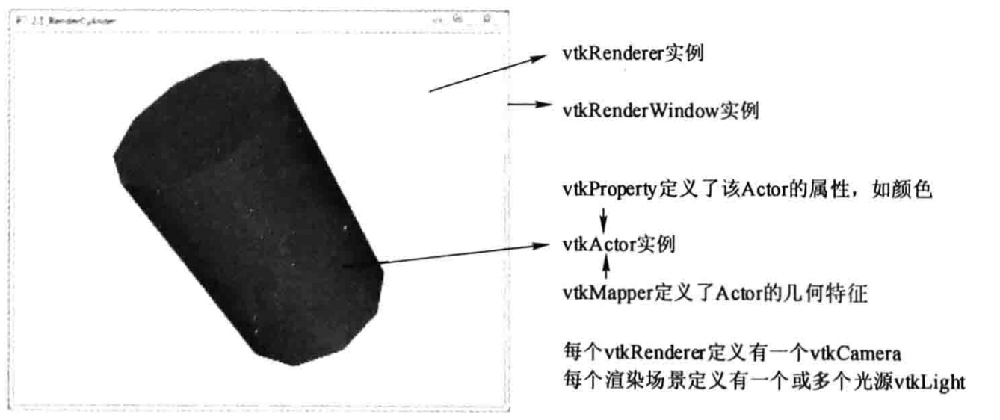

# 2 三维场景的基本要素

## 2.1 灯光 

剧场里有各式各样的灯光，三维渲染场景中也一样，可以有多个灯光存在。灯光和相机是三维渲染场景必备的要素，如果没有指定，vtkRenderer会自动创建默认的灯光和相机。VTK里用类vtkLight来表示渲染场景中的灯光。与现实中的灯光类似，VTK中的vtkLight实例也可以打开、关闭，设置灯光的颜色，照射位置(焦点)，灯光所在的位置、强度等。

vtkLight可以分为位置灯光(Positional Light,也叫聚光灯)和方向灯光(Direction Light)。 位置灯光是光源位置在渲染场景中的某个位置，可以指定灯光的衰减值、锥角等；方向灯光 即光源位置在无穷远，可以认为光线是平行的，比如自然界中的太阳光。光源的位置和焦点的连线定义光线的方向，默认的vtkLight为方向灯光。

vtkLight的常用方法如下。      
SetColor()：设置灯光的颜色，以RGB的形式指定颜色。     
SetPosition()：设灯光照位置。      
SetFocalPoint()：设置灯光焦点。     
Setlntensity()：设置灯光的强度。     
SetSwitch()/SwitchOn()/SwitchOff():打开或关闭对应的灯光。     

vtkLight里的方法 SetSwitch() / GetSwitch() / SwitchOn() / SwitchOff()控制灯光的开或者关。不难发现，在VTK中属性的设置都是采取这一类方法，以vtkLight为例，SwitchOn()与 SetSwitch(l)实现的效果是一样的，而 SwitchOff()则与SetSwitch(0)一样，GetSwitch()则是用于获取vtkLight对象关闭或打开这个属性的值。如果某个类有提供SetXXX()方法，一般会提供相应的GetXXX()方法来获取该属性值。再如，vtkLight还提供SetPositional() / Get Positional() / PositionalOn()/ PositionalOff()这一类方法用来控制位置灯光的开关。

```
  vtkNew<vtkLight> myLight;
  myLight->SetColor(0,1,0);
  myLight->SetPosition(0,0,1);
  myLight->SetFocalPoint(renderer->GetActiveCamera()->GetFocalPoint());
  renderer->AddLight(myLight);
  vtkNew<vtkLight> myLight2;
  myLight2->SetColor(0,0,1);
  myLight2->SetPosition(0,0,-1);
  myLight2->SetFocalPoint( renderer->GetActiveCamera()->GetFocalPoint());
  renderer->AddLight(myLight2);
```
该示例定义了两个vtkLight对象，一个为绿色光，位置在(0,0,1),焦点对着相机的焦点； 另一个为蓝色光，位置在(0,0,-1)，焦点也是对着相机的焦点，最后调用vtkRenderer的方法 AddLight()将两个灯光对象加入到渲染场景中。因为Renderer里可以有多个灯光，所以VTK 提供的接口是AddLight。而不是SetLight()。

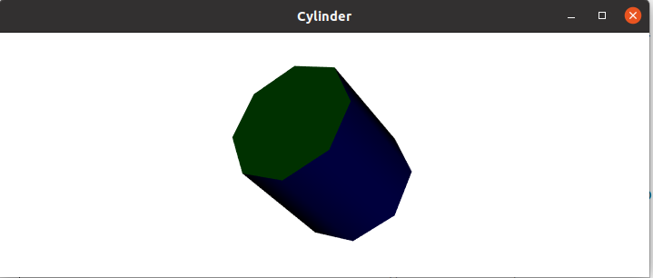


## 2.2 相机

观众的眼睛好比三维渲染场景中的相机，在VTK中用vtkCamera类来表示。vtkCamera 负责把三维场景投影到二维平面，如屏幕。相机投影示意图如图所示。可以看岀与相机投影相关的要素主要有如下几个。

1).相机位置。相机所处的位置，用vtkCamera::SetPosition()方法设置。

2).相机焦点。用vtkCamera::SetFocusPoint()方法设置，默认的焦点位置在世界坐标系的 原点。

3).朝上方向。朝上方向即哪个方向为相机朝上的方向。就好比直立看东西，方向为头朝 上，看到的东西也是直立的，如果倒立看某个东西，这时方向为头朝下，看到的东西就是倒立的。相机位置、相机焦点和朝上方向三个因素确定了相机的实际方向，即确定相机的视图。

4).投影方向。相机位置到相机焦点的向量方向即为投影方向。

5).投影方法。该要素用于确定Actor是如何映射到像平面的。vtkCamera定义了两种投影方法：一种是正交投影(Orthographic Projection),也叫平行投影(Parallel Projection)，即进入相机的光线与投影方向是平行的；另一种是透视投影(PerspectiveProjection),即所有光线相交于一点。该投影方法最符合人类眼睛对于景物所产生的近大远小的视觉习惯。

6).视角。透视投影时需要指定相机的视角(View Angle),默认的视角大小为30° ,可以用 vtkCamera:: SetViewAngle ()方法设置。

7).前后裁剪平面。裁剪平面与投影方向相交，一般与投影方向也是垂直的。裁剪平面主要用于评估Actor与相机距离的远近，只有在前后裁剪平面之间的Actor才是可见的。裁剪平面的位置可以用vtkCamera::SetClippingRange()方法设置。

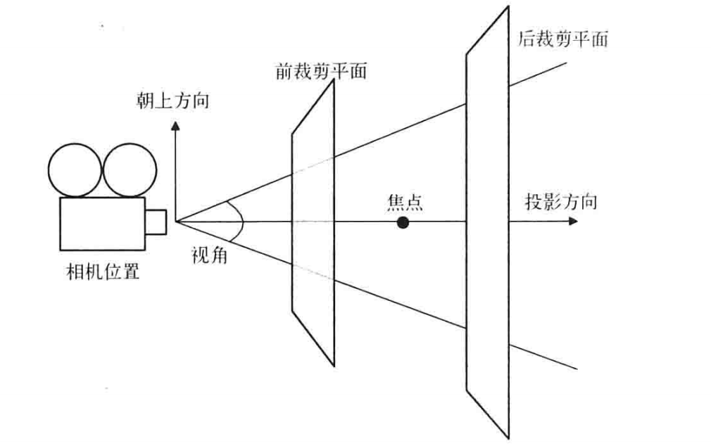SetClippingRange() / SetFocalPoint() / SetPosition()分别用于设置相机的前后裁剪平面、焦点和位置。ComputeViewPlaneNormal()方法是根据设置的相机位置、焦点等信息，重新计算 视平面(View Plane)的法向量。一般该法向量与视平面是垂直的，如果不垂直，Actor等看起来会有一些特殊的效果，如错切。SetViewUp()方法用于设置相机朝上方向。最后用 vtkRenderer:: SetActiveCamera()方法把相机设置到渲染场景中。

vtkCamera除了提供设置与相机投影因素相关的方法之外，还提供了大量的控制相机运动的 方法，如Dolly()、Roll()、Azimuth()、Yaw()、Elevation()、Pitch()和 Zoom()。这些方法具体是怎么运动以及相对哪个位置或者方向运动，请参考下图。

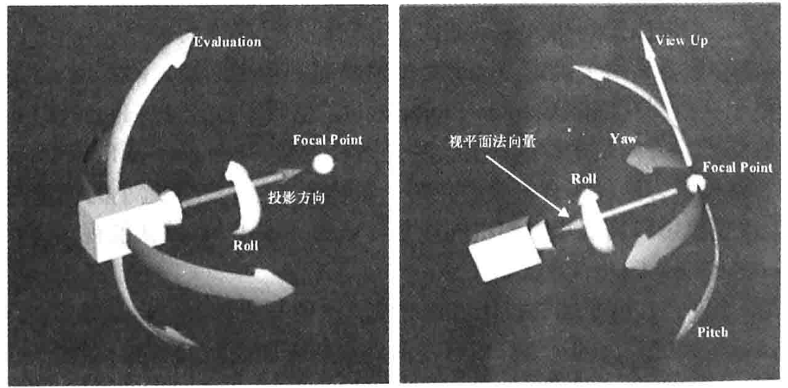

## 2.3 颜色

颜色是Actor重要的属性之一。VTK采用RGB和HSV两种颜色系统来描述颜色。

RGB颜色系统由三个颜色分量：红色（R）、绿色（G）和蓝色（B）的组合表示，在 VTK里，这三个分量的取值范围都是0〜1, （0, 0, 0）表示黑色，（1, 1, 1）表示白色。 vtkProperty::SetColor(r, g, b)釆用的就是RGB颜色系统设置颜色属性值。

HSV颜色系统同样也是由三个分量来决定颜色，它们分别是：色相（Hue）,表示颜色 的基本属性，就是通常所说的颜色名称，如红色、黄色等；饱和度（Saturation）,是指颜色 的纯度，其值越高则越纯；值（Value,也就是强度Intensity或者亮度Bright）,值为0通常 表示的是黑色，值为1表示的是最亮的颜色。这三个分量的取值范围0〜1。类 vtkLookupTable提供了 HSV颜色系统设置的方法。与颜色设置相关的VTK类除了 vtkProperty和vtkLookupTable之外，还有vtkColorTransferFunction, vtkLookupTable和vtkColorTransferFunction 都派生自 vtkScalarsToCoIors。

## 2.4 纹理映射 

纹理映射是创建逼真效果的强大的图形工具，其原理是渲染时把二维的图像“贴”到物 体的表面上，根据二维图像渲染出丰富多彩的效果，所以也叫纹理贴图。纹理映射需要三个 要素：待贴图的表面、纹理映射以及纹理坐标。其中纹理映射在VTK中就是vtklmageData 的数据集，而纹理坐标则用于控制纹理图在表面的位置。

```
  vtkNew<vtkJPEGReader> reader;
  reader->SetFileName("..\\texture.j pg");
  vtkNew<vtkTexture> texture;
  texture->SetInputConnection(reader->GetOutputPort());
  texture->InterpolateOn();
  vtkNew<vtkPlaneSource> plane;
  vtkNew<vtkPolyDataMapper> mapper; 
  mapper->SetInputConnection(plane->GetOutputPort());
  vtkNew<vtkActor> actor;
  actor->SetMapper( mapper);
  actor->SetTexture( texture );
```

这个示例先读入一幅JPEG的二维纹理图；然后定义一个纹理类vtkTexture对象，接着把 读入的JPEG图像输入到vtkTexture里，作为它即将“贴”到平面上的一个纹理图；再定义一 个vtkPlaneSource对象，类vtkPlaneSource可以生成一个平面，也就是纹理图要"贴”图的地 方。简而言之，在做纹理贴图时，先要有东西可以“贴”，也就是要准备一幅二维的纹理图； 然后再确定这幅纹理图要“贴”到哪里。

# 3 坐标系统及空间变换

## 3.1 坐标系统

计算机图形学里常用的坐标系统主要有4种，分别是Model坐标系统、World坐标系统、 View坐标系统和Display坐标系统，此外还有两种表示坐标点的方式：以屏幕像素值为单位和归一 化坐标值（各坐标轴取值范围为［-1,1］）。它们之间的关系如图所示。

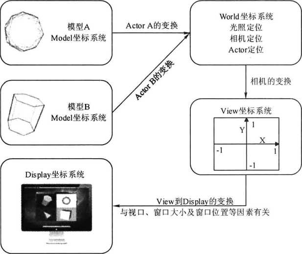

Model坐标系统是定义模型时所釆用的坐标系统，通常是局部的笛卡儿坐标系。

World坐标系统是放置Actor的三维空间坐标系，Actor （vtkActor类）其中的一个功能就 是负责将模型从Model坐标系统变换到World坐标系统。每一个模型可以定义自己的Model 坐标系统，但World坐标系只有一个，每一个Actor必须通过放缩、旋转、平移等操作将Model 坐标系变换到World坐标系。World坐标系同时也是相机和灯光所在的坐标系统。

View坐标系统表示的是相机所看见的坐标系统。X、Y、Z轴取值为［-1, 1］, X、Y值表 示像平面上的位置，Z值表示到相机的距离。相机负责将World坐标系变换到View坐标系。

Display坐标系统与View坐标系统类似，但是各坐标轴的取值不是［-1, 1］，而是使用屏幕像素值。屏幕上显示的不同窗口的大小会影响View坐标系的坐标值［-1, 1］到Display坐标系 的映射。可以把不同的渲染场景放在同一个窗口进行显示，例如，在一个窗口里，分为左右 两个渲染场景，这左右的渲染场景(vtkRenderer)就是不同的视口(Viewport)。Viewport 实现将一个窗口分为4个视口，用vtkRenderer:: SetViewport()来设置视口的范围(取值为［0, 1］)：

```
renderer1->SetViewport(0.0,0.0,0.5,0.5);
renderer2->SetViewport(0.5,0.0,1.0,0.5);
renderer3->SetViewport(0.0,0.5,0.5,1.0);
renderer4->SetViewport(0.5,0.5,1.0,1.0);
```

在VTK里，Model坐标系统用得比较少，其他三种坐标系统经常使用。它们之间的变换则是由类vtkCoordinate进行管理的。根据坐标值的单位、取值范围等不同，可以将坐标系统细分为如下几类。
- DISPLAY—— X、Y轴的坐标取值为渲染窗口的像素值。坐标原点位于渲染窗口的左下角，这个对于VTK里的所有二维坐标系统都是一样的，且VTK里的坐标系统都是釆用右手坐标系。
- NORMALIZED DISPLAY—— X、Y 轴坐标取值范围为［0, 1］,跟 DISPLAY —样，也是定义在渲染窗口里的。
- VIEWPORT —— X、Y的坐标值定义在视口或者渲染器(Renderer)里。
- NORMALIZED VIEWPORT——X、Y坐标值定义在视口或渲染器里，取值范围为［0, 1］。
- VIEW —— X、Y、Z坐标值定义在相机所在的坐标系统里，取值范围为［T, 1］, Z 值表示深度信息。
- WORLD —— X、Y、Z坐标值定义在世界坐标系统，参见图2-8。
- USERDEFINED——用户自定义坐标系统。

vtkCoordinate可以用来表示坐标系统，其内部提供了函数接口来定义坐标系统：

```
SetCoordinateSystemToDisplay()
SetCoordinateSystemToNormalizedDisplay()
SetCoordinateSystemTo Viewport()
SetCoordinateSystemToNormalizedViewport()
SetCoordinateSystemToView()
SetCoordinateSystemTo World()
```

这里先调用了 SetCoordinateSystemToNoimalizedDisplay()设置坐标系统为归一化窗口坐 标，并设置坐标值为(0.5, 0.5, 0),即屏幕的中心；然后通过函数GetComputedDisplayValue() 实现窗口坐标的转换。该类中坐标系统转换函数如下：

```
GetComputedWorldValue()
GetComputedViewportValue()
GetComputedDisplayValue()
GetComputedLocalDisplayValue() 
GetComputedDoubleViewportValue()
GetComputedDoubleDisplayWlue() 
GetComputedUserDefinedValue()
```

## 3.2 空间变换

在三维空间里定义的三维模型，最后显示时都是投影到二维平面，比如在屏幕上显示。 三维到二维的投影包括透视投影(Perspective Projection)和正交投影(Orthogonal Projection)。 正交投影也叫平行投影。

VTK里与空间变换相关的类有 vtkTransform2D, vtkTransform, vtkPerspectiveTransform, vtkGeneralTransform, vtkTransformFilter, vtkMatrix4X4 等。例如下面代码实现了 vtkActor对象的空间变换:

```
vtkNew<vtkTransform> transform;
transform->PostMultiply();
transform->RotateZ(40);
transform->Translate(l 0,0,0); cylinderActor->SetUserTransform(transform);
```

先定义了vtkTransform对象，并设置使用右乘计算变换矩阵。RotateZ()设置绕Z轴旋转 40° , 并使用 Translate。设置平移大小为(10,0,0),最后通过 vtkActor::SetUserTransform() 方法设置用户定义的变换矩阵，实现模型的空间变换。

# 4 VTK管线

## 4.1 VTK渲染引擎

回顾前面的Cylinder示例,在该示例及后续的扩展内容中，可以找到以下的类：

```
vtkProp;
vtkAbstractMapper;
vtkProperty;
vtkCamera;
vtkLight; 
vtkRenderer; 
vtkRenderWindow; 
vtkRenderWindowInteractor; 
vtkTransfbrm;
vtkLookupTable;
```

可以发现这些类都是与数据显示或渲染相关的。用计算机图形学的专业词汇来说，就是 它们构成了 VTK的渲染引擎(Rendering Engine)。渲染引擎主要负责数据的可视化表达，是 VTK里的两个重要概念之一，而另一个重要概念就是可视化管线(Visualization Pipeline)。

可视化管线是指用于获取或创建数据、处理数据以及把数据写入文件或者把数据传递给 渲染引擎进行显示，这样的一种结构在VTK里就称为可视化管线。数据对象(Data Object)、 处理对象(Process Object)和数据流方向(Direction of Data Flow)是可视化管线的三个基本 要素。每个VTK程序都会有可视化管线存在。如图是简单的可视化管线示例。

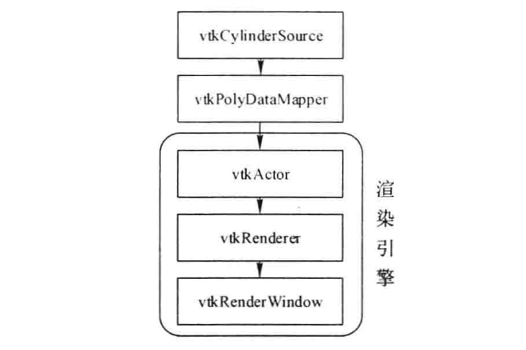


上述示例的可视化管线非常简单，先是创建一个柱体数据，接着经Mapper 后生成的图元直接送入渲染引擎渲染，创建的数据没有经过任何处理。再看一个稍微复杂的可视化管线。在该示例中，先读入一个后缀为vtk的文件(head.vtk), 然后用移动立方体法(vtkMarchingCubes)提取等值面，最后把等值面数据经Mapper送往渲 染引擎进行显示。运行结果如图所示。

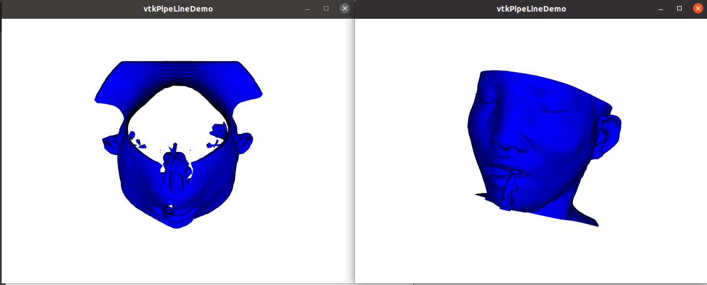

## 4.2 VTK可视化管线

比较2.4.1节中的图和下图的可视化管线结构，可以看出下图多了一个vtkMarchingCubes 用于处理读入的数据。VTK中把与类似vtkMarchingCubes对数据做处理的类称为Filter。

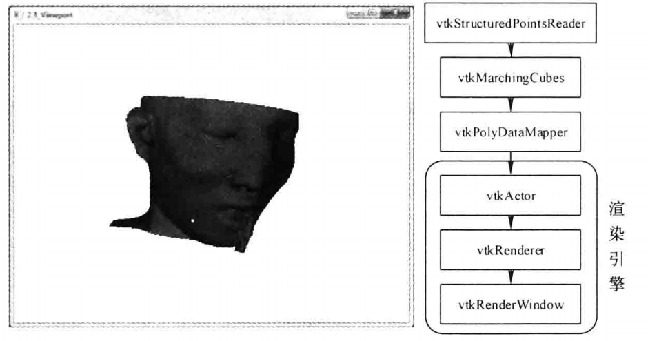

综合两图,可以抽象出更一般的VTK可视化管线结构。

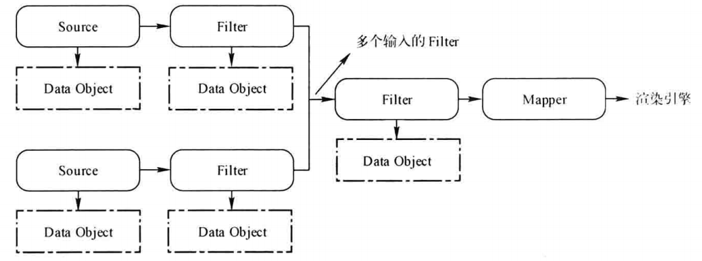

Source是指用于创建数据（如vtkCylinderSource）或者读取数据（如vtkBMPReader、 vtkStructuredPointsReader等）类的统称，即VTK的数据源。Source输出的数据作为Filter的 输入，经Filter处理以后（可以经多个Filter处理），生成新的数据。Filter的输出可以直接写入文件，或者经Mapper变换后传入渲染引擎进行渲染、显示，结束可视化管线。上图所示的箭头方向即为VTK里数据流流动的方向。可视化管线的三要素分别是数据对象、处理对象和数据流方向，Source、Filter和Mapper 一起构成了处理对象，它们的区别是基于数据流的初始化、维持和终止。根据数据的生成方式，Source可以分为程序源对象（Procedural,如 vtkCylinderSource,通过程序代码生成相关的数据）和读取源对象（Reader,如vtkBMPReader, 从外部文件中导入数据）。

关于Source、Filter和Mapper的区别，可以简单地通过下图所示的示意图进行表示。 Source没有输入，但至少有一个输出；Filter可以有一个或多个输入，产生一个或多个输出； Mapper接受一个或多个输入，但没有输出，写文件的Writer （如vtkBMPWriter）可以看作 Mapper,负责把数据写入文件或者流（Stream）中，因此，Mapper是可视化管线的终点，同时也是可视化管线和渲染引擎（有时也称之为图形管线）的桥梁。

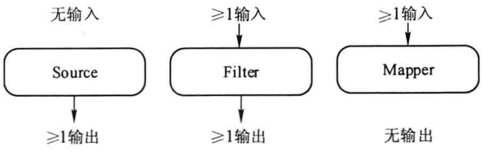

**1.可视化管线的连接**

由示例vtkPipelineDemo可知，可视化管线里各个模块的连接是通过接口 SetlnputConnection()和GetOutputPort()来完成的。

```
marchingCubes->SetInputConnection(reader->GetOutputPort());
```

上行代码将reader的输岀端口与marchingCubes的输入端口建立连接。vtkMarchingCubes 作为Filter只接受一个输入，Filter概括起来有以下三种类型:单个输入，产生单个输出；多个输入，产生单个输出，但输出的数据可有多种用途，比如，读入数据后，可以对其作等值面提取，另外还可以针对读入的数据生成轮廓线(Outline)；单个输入，产生多个输出。

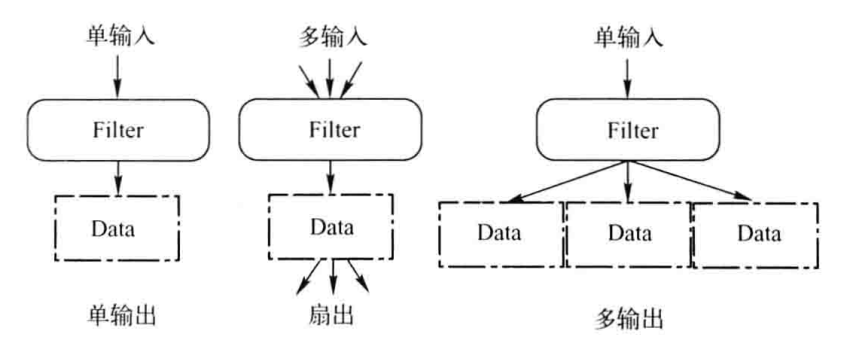

使用SetInputConnection()和GetOutputPort()连接可视化管线时，还要求连接的两部分之间的数据类型必须一致。由于管线是运行时才执行的，如果连接的两部分类型不匹配，程序运行时就会报错。比如，vtkMarchingCubes要求输入的是vtklmageData类型的数据，如果给它输入的是vtkPolyData类型的，程序运行时就会报错。

**2.可视化管线的执行**

可视化管线连接完成后，必须有一种机制来控制管线的执行。有时对某一部分数据做了改变，只希望改变的这部分数据在可视化管线里做更新，而不要影响其他没做改变的数据。 如下图所示，假如Filter D的输入发生了变化，E和F是依赖于D的输入的，所以虚线框内的部分是需要重新执行的管线，而C和G是另外一个分支，D输入的改变不影响C和G, 所以为了节省运行时间，C和G是不需要重新执行的。

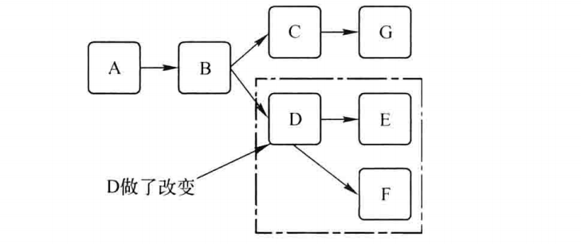

VTK釆用一种叫作“惰性赋值”(Lazy Evaluation)的方案来控制管线的执行，惰性赋值是指根据每个对象的内部修改时间来决定什么时候执行管线，只有当用户或者程序发出“请 求数据”时，管线才会被执行。vtkObject类里有一个重要的成员变量MTime,管线里的每个从vtkObject派生的类的对象都会跟踪自己的内部修改时间，当遇到“请求数据”时，该对象会比较这个修改时间，如果发现修改时间发生了改变，对象就会执行。换言之，VTK是釆用命令驱动(Demand Driven)的方法来控制管线的执行，这种方法的好处是，当对数据对象作了更改时，不必立即做计算，只有当发出请求时才开始处理，这样能最小化计算所需的时间， 以便更流畅地与数据进行交互。

该例先读入一幅BMP图像，然后把reader的输岀值赋给imageData，接着需要获取读入图像的大小，调用vtklmageData::GetWholeExtent()方法后，输出为 “Extent of image: 0-10-10-1”。该结果显然是错误的，所读图像实际大小为300X246像素，这就是因为没有“请求数据”(RequestData())。只有在 reader->GetOutput()之前，调用 reader->Update(),才会迫使管线的执行，即reader从磁盘中读取数据，然后才可获得imageData的正确信息。

通常，程序不用显式地调用Update。函数，因为在渲染引擎的最后，当调用Render()函数时，Actor就会收到渲染请求，接着Actor会请求Mapper给它发送数据，而Mapper又会请求上一层的Filter的数据，Filter最后请求Source给它数据，于是整条管线就被执行。除非读入数据以后，中间需要输出某些信息，在得到这些信息之前，就应该显式地调用Update()函数。管线的执行过程大致如图所示。

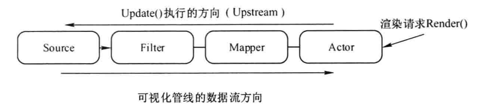


