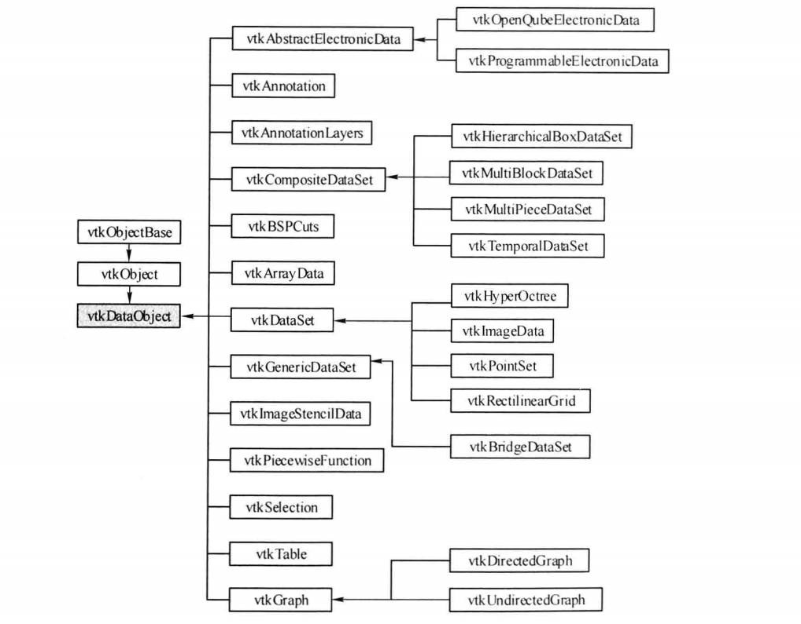
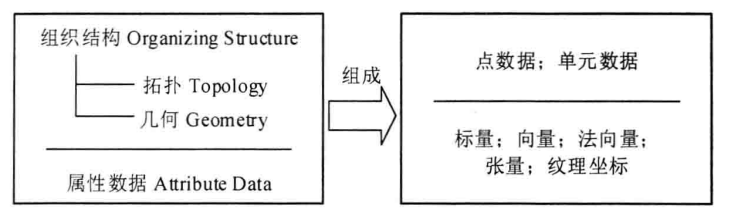
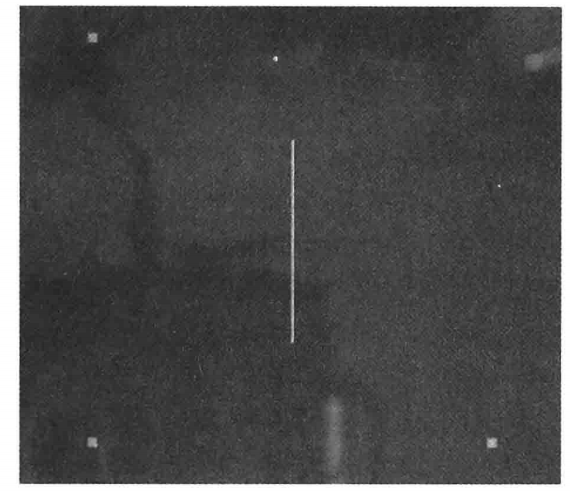
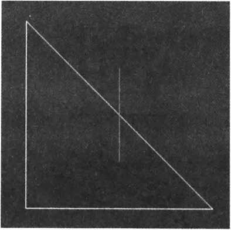

[TOC]

# 1 可视化数据的基本特点

可视化数据具有如下 特点。

(1) 离散性

为了让计算机能够获取、处理和分析数据，必须对无限、连续的空间体进行釆样，生成有限的釆样数据点，这些数据以离散点的形式存储，釆样的过程是一个离散化的过程。由于可视化数据的离散性特点，在某些离散点上有精确的值存在，但点与点之间的值则是不可知的，要得到釆样点之外的其他点的值，只有通过插值(Interpolation)的方法获取。常用的插值方法是线性插值，要得到更精确的数值可以采用非线性插值，如B样条插值方法。

(2) 数据具有规则或不规则的结构(结构化与非结构化)

可视化数据可以分为规则(Regular)和不规则(Irregular)或者说结构化(Structured) 和非结构化(Unstructured)。规则结构数据点之间有固定的关联关系，可以通过这些关联确定每个点的坐标，不规则结构数据之间没有固定的关联关系。对于规则结构的数据，存储时不必存储所有数据点，只需存储起始点、相邻两点之间的 间隔以及点的总数就可以保存完整的数据信息。对于不规则结构的数据，虽然不可以像规则 结构的数据那样存储，但它也有自身的优势，即在数据变化频繁的区域可以密集表示，而数据变化不频繁的区域则稀疏表示。规则结构的数据可以在存储及计算时占优势，不规则结构的数据虽然在存储和计算时不能像规则结构那样高效，但它在数据表达方面相对而言更加自由、细致、灵活。

(3) 数据具有维度

可视化数据的第三个特点是拓扑维度(Topological Dimension)。可视化数据具有零维、 一维、二维、三维等任意维度，例如，零维数据表现为点，一维数据表现为曲线，二维数据 表现为曲面，三维数据表现为体等。数据的维度决定了数据可视化的方法，例如，对于二维 数据，可以将其存储到一个矩阵，然后再釆用针对二维数据的可视化方法进行可视化（如等高图）。

# 2 数据对象和数据集

## 2.1 vtkDataObject

在VTK中，数据一般以数据对象（Data Object,类vtkDataObject）的形式表现，这是 VTK里可视化数据最常用的表达形式。数据对象是数据的集合，数据对象表现的数据是可以 被可视化管线处理的数据，只有当数据对象被组织成一种结构后，才能被VTK提供的可视化算法所处理。下图是vtkDataObject类的继承图，VTK里的所有数据结构形式都是从这个类派生岀来 的，但在实际的VTK应用程序中，没有直接使用vtkDataObject来实例化数据对象，而是根据具体的可视化数据选用其具体的子类实现可视化的。



## 2.2 vtkDataSet

将数据对象组织成一种结构并且赋予相应的属性值，就形成了数据集（Dataset）。VTK 里与数据集对应的类是vtkDataSet,该类从vtkDataObject直接派生。vtkDataSet由两个部 分组成，即组织结构(Organizing Structure)以及与组织结构相关联的属性数据(Attribute Data)，下图描述了 vtkDataSet各结构的详细构成。vtkDataSet是一个抽象基类，结构的 实现及表达由其具体的子类来完成。

vtkDataSet的组织结构由拓扑结构(Topology)和几何结构(Geometry)两部分组成。拓扑结构描述了对象的构成形式，几何结构描述了对象的空间位置关系。换言之，点数据(Point Data)所定义的一系列坐标点构成了 vtkDataSet数据集的几何结构；点数据的连接形成单元 数据(Cell Data),由单元数据形成了数据集的拓扑结构。比如，想要在屏幕上显示一个三角形，首先必须定义三角形三个点的坐标(即Point Data, 记三个点为P1、P2和P3)，然后将这三个点按照一定的顺序连接起来(P1-P2-P3，或者是 P3-P2-P1的顺序)，这三个点定义了数据集的几何结构，它们的连接就构成了数据集的拓扑结构，亦即点数据定义了数据集的几何结构，单元数据定义数据集的拓扑结构，要形成完整的数据集，必须有几何和拓扑两种结构。



拓扑结构具有几何变换不变性。例如，说一个多边形是三角形，即指其拓扑结构，而给定的每个点的坐标，则为其几何结构。几何结构是一种空间描述，与空间变换有紧密联系，常见的变换有旋转、平移和放缩。属性数据是对拓扑结构和几何结构信息的补充，属性数据可以是某个空间点的温度值，也可以是某个单元的质量等。

只有几何结构没有拓扑结构的 vtkDataSet ，如示例012_TrianglePoints

```
#include <vtkNew.h>
#include <vtkPoints.h>
#include <vtkPolyData.h>
#include <vtkPolyDataWriter.h>
#include <vtkAutoInit.h>

VTK_MODULE_INIT(vtkRenderingOpenGL2); // VTK was built with vtkRenderingOpenGL2
VTK_MODULE_INIT(vtkInteractionStyle);

int main(int argc, char *argv[])
{
    vtkNew<vtkPoints> points;
    points->InsertNextPoint(1.0, 0.0, 0.0);
    points->InsertNextPoint(0.0, 0.0, 0.0);
    points->InsertNextPoint(0.0, 1.0, 0.0);

    vtkNew<vtkPolyData> polydata;

    polydata->SetPoints(points);
    vtkNew<vtkPolyDataWriter> writer;
    writer->SetFileName("triangle.vtk");
    writer->SetInputData(polydata);
    writer->Write();
    return EXIT_SUCCESS;
}
```

012_TrianglePoints示例中，先创建了一个点数据（vtkPoints）,里面含有三个点；紧接着创建了一个类型为 vtkPolyData 的数据，vtkPolyData 派生自类 vtkPointSet,而 vtkPointSet 又派 生自vtkDataSet，所以说vtkPolyData是一种具体的数据集；然后将创建的点数据加入数据集, 于是点数据就定义了该数据集的几何结构；最后把vtkPolyData的数据用类vtkPolyDataWriter 写入triangle.vtk文件，保存路径是工程的当前目录。

可以利用ParaView软件（http://www.paraview.org）打开示例中保存的triangle.vtk文件。 使用ParaView软件打开该文件以后，在渲染窗口中看不到任何东西。这是因为在数据集 vtkPolyData的实例里，只定义了数据的几何结构，没有定义拓扑结构。如果想看看生成的 triangle.vtk数据是怎样一种形式，可以调用ParaView的菜单Filters—Common—Glyph （在点数据的空间位置生成符号）。

接下来在示例012_TrianglePoints的基础上给数据集定义拓扑结构，看示例013_TriangleVertices。

```
#include <vtkNew.h>
#include <vtkPoints.h>
#include <vtkPolyData.h>
#include <vtkPolyDataWriter.h>
#include <vtkAutoInit.h>

VTK_MODULE_INIT(vtkRenderingOpenGL2); // VTK was built with vtkRenderingOpenGL2
VTK_MODULE_INIT(vtkInteractionStyle);

int main(int argc, char *argv[])
{
    //创建点的坐标
    double X[3] = {1.0, 0.0, 0.0};
    double Y[3] = {0.0, 0.0, 0.0};
    double Z[3] = {0.0, 0.0, 1.0};

    vtkNew<vtkPoints> points;
    vtkNew<vtkCellArray> vertices;
    for(unsigned int i = 0; i < 3; ++i)
    {
        //定义用于存储点索引的中间变量，vtkIdType相当于int或long型
        vtkIdType pid[1];
        //把每个点坐标加入到vtkPoints中，InsertNextPoint()返回加入的点的索引号
        //下面需要使用这个索引号来创建Vertex类型的Cell
        pid[0] = points->InsertNextPoint(X[i], Y[i], Z[i]);
        //在每个坐标点上分别创建一个Vertex，Vertex是Cell里的一种
        vertices->InsertNextCell(1, pid);
    }
    //创建vtkPolyData对象
    vtkNew<vtkPolyData> polydata;
    //指定数据集的几何（由points指定），以及数据集的拓扑（由vertices指定）
    polydata->SetPoints(points);
    polydata->SetVerts(vertices);
    //将生成的数据集写到TriangleVerts.vtk文件里，保存在工程当前目录下
    vtkNew<vtkPolyDataWriter> writer;
    writer->SetFileName("TriangleVerts.vtk");
    writer->SetInputData(polydata);
    writer->Write();
    return EXIT_SUCCESS;
}
```

013_TriangleVertices示例中实例化了一个vtkCellArray对象，其中点数据定义数据集的几 何结构，单元数据定义数据集的拓扑结构。由此可知，vtkCellArray类型的对象vertices就是 用来指定数据集polydata的拓扑结构，而polydata的几何结构则是由points来定义的。013_TriangleVertices示例中定义的数据集的拓扑结构是零维的点，即单元类型是 "Vertex”。保存的VTK文件TriangleVerts.vtk在ParaView里的显示结果如图所示。



继续在013_TriangleVertices示例的基础上做一些更改，将零维的点拓扑结构改成一维的线拓扑结构，014_TriangleGeometryLines。

```
#include <vtkPoints.h>
#include <vtkLine.h>
#include <vtkCellArray.h>
#include <vtkSmartPointer.h>
#include <vtkPolyDataWriter.h>
#include <vtkPolyData.h>
#include <vtkAutoInit.h>
VTK_MODULE_INIT(vtkRenderingOpenGL2); // VTK was built with vtkRenderingOpenGL2
VTK_MODULE_INIT(vtkInteractionStyle);
int main(int argc, char *argv[])
{
    //创建三个坐标点
    vtkNew<vtkPoints> points;
    points->InsertNextPoint ( 1.0, 0.0, 0.0 ); //返回第一个点的ID：0
    points->InsertNextPoint ( 0.0, 0.0, 1.0 ); //返回第二个点的ID：1
    points->InsertNextPoint ( 0.0, 0.0, 0.0 ); //返回第三个点的ID：2
    //每两个坐标点之间分别创建一条线
    //SetId()的第一个参数是线段的端点ID，第二个参数是连接的点的ID
    vtkNew<vtkLine> line0;
    line0->GetPointIds()->SetId ( 0,0 );
    line0->GetPointIds()->SetId ( 1,1 );
    vtkNew<vtkLine> line1;
    line1->GetPointIds()->SetId ( 0,1 );
    line1->GetPointIds()->SetId ( 1,2 );
    vtkNew<vtkLine> line2;
    line2->GetPointIds()->SetId ( 0,2 );
    line2->GetPointIds()->SetId ( 1,0 );
    //创建Cell数组，用于存储以上创建的线段
    vtkNew<vtkCellArray> lines;
    lines->InsertNextCell (line0);
    lines->InsertNextCell (line1);
    lines->InsertNextCell (line2);
    vtkNew<vtkPolyData> polydata;
    //将点和线加入到数据集中，前者指定数据集的几何，后者指定其拓扑
    polydata->SetPoints ( points );
    polydata->SetLines ( lines );
    vtkNew<vtkPolyDataWriter> writer;
    writer->SetFileName ( "TriangleLines.vtk" );
    writer->SetInputData(polydata);
    writer->Write();
    return EXIT_SUCCESS;
}
```

示例014_TriangleGeometryLines生成的VTK文件在ParaView的显示结果如图所示。 对于VTK的数据集而言，数据集的几何结构和拓扑结构是必不可少的两个部分。 014_TrianglePoints示例只定义了数据集的几何结构，没有定义该数据集的拓扑结构，所以该数据集不能直接显示；013_TriangleVertices和014_TriangleGeometryLines示例除了定义数据集 的几何结构(由points定义)，还定义了相应的拓扑结构。其中示例013_TriangleVertices定义的是零维的点拓扑结构；014_TriangleGeometryLines定义的是一维的线拓扑结构，它们都保存在由类vtkCellArray实例化的对象里。除了零维的点、一维的线等类型的单元以外，VTK还定义了其他类型的单元。




