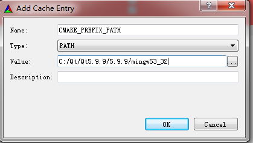
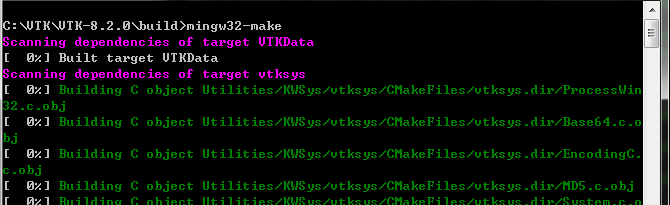

[TOC]

# 1.Introduction to VTK

VTK is an open-source, object-oriented software system for computer graphics, visualization, and image processing. 

The key to learning how to use VTK is to become familiar with its palette of objects and the ways of combining them. 

## 1.1  **Software Organization**

The following sections describe the directory contents, summarize the software functionality in each directory, and locate the documentation and data.

### **Obtaining The Software**

There are two different ways to access the VTK source code

- **1.** from releases available on the VTK Web site http://www.vtk.org; and

- **2.** from direct access to the CVS source code repository (instructions found at www.vtk.org).

For information on new features specific to future releases, see the VTK mailing lists (http://www.vtk.org/VTK/help/mailing.html) or the *Kitware Source* (http://www.kitware.com/products/thesource.html), Kitware’s free, quarterly developer’s newsletter. The Visualization Toolkit is heavily tested using the Kitware Software Process (http://www.kitware.com/solutions/softwareprocess.html). 

### **Directory Structure**

The VTK directory structure is organized as follows.

- InfoVis — classes for information visualization.
- Views — specialized classes for viewing data including: filters, visualization, interaction and selection.
- VTK/CMake — configuration files for cross-platform building.
- VTK/Common — core classes.
- VTK/Examples — well-documented examples, grouped by topic.
- VTK/Filtering — classes related to data processing in the visualization pipeline.
- VTK/GenericFiltering — an adaptor framework to interface VTK to external simulation packages.
- VTK/GeoVis — views, sources, and other objects useful in terrain visualization.
- VTK/Graphics — filters that process 3D data.
- VTK/GUISupport — classes for using VTK with the MFC and Qt user interface packages.
- VTK/Hybrid — complex classes that depend on classes in multiple other directories.
- VTK/Imaging — image processing filters.
- VTK/IO — classes for reading and writing data. 
- VTK/Parallel — parallel processing support such as MPI.
- VTK/Rendering — classes used to render.
- VTK/Utilities — supporting software like expat, png, jpeg, tiff, and zlib. The Doxygen directory contains scripts and configuration programs for generating the Doxygen documentation.
- VTK/VolumeRendering — classes used for volume rendering.
- VTK/Widgets — 3D widget classes.
- VTK/Wrapping — support for Tcl, Python, and Java wrapping.

# 2. Installation

Running CMake requires three basic pieces of information: which compiler to use, where the source code directory (i.e. *source tree)* is, and which directory (i.e., *build tree)* to place the object code, libraries, and binaries that the compilation process produces. CMake will read the top-level

CMakeLists.txt file found in the source tree and produce a cache (CMakeCache.txt) in the build tree. Note that CMake handles complex source code directory structures just fine—there will be one CMakeLists.txt file in each subdirectory of the source code tree.

**Installing CMake.** To compile VTK, you will first need to install CMake. An installer for CMake is available from http://www.cmake.org.

## Win7 QT MinGW

**Installing QT** and make sure to  select MinGW, and add MinGW executable  program path(QT/Tools/mingw/bin,that is, the path where mingw32-make.exe is located, for example, mine is (C:\Qt\Qt5.9.9\Tools\mingw530_32\bin;) ) to the system environment variables *PATH*. 

Then download the source code of VTK, and unzip of it. It is recommended that the path after decompression does not contain spaces.

Start CMake-gui, and specify the source code path and build path

Click on Configure Button to the first configure, and when pop up the follows, select "MinGW Makefiles"

when it has done, Check **Grouped** and **Advanced** behind the **Search** box.

on the CMake option box, Set your own parameters 

**CMAKE_INSTALL_PREFIX** is about the vtk installation path, you can choose your own path.

on the Module option box, you should check the follows parameter

- Module_vtkGUISupportQt 
- Module_vtkGUISupportQtOpenGL
- Module_vtkGUISupportQtSQL
-  ~~Module_vtkGUISupportQtWebkit~~(vtkGUISupportQtWebkit LEGACY 8.1 "The module is no longer supported."）
- Module_vtkRenderingQt
- Module_vtkViewsQt
- Module_vtkTestingCore

And on the VTK option box, you should check **VTK_Group_Qt**

If you need to compile into a static link library, uncheck under BUILD option box **BUILD_SHARED_LIBS**

If you need to compile to Release, modify **CMAKE_BUILD_TYPE** to **Release** under **CMAKE**.

Click **Add Entry** to manually add the path where qmake is located, *Name* is **QT_QMAKE_EXECUTABLE**, *Type* is **PATH**, *Value* is the full path where qmake.exe is located:

Click **Add Entry** to manually add the QT installation directory, Name is **CMAKE_PREFIX_PATH** , type is **PATH**, value is the QT installation directory(should be bin containing qmake.exe the parent directory of, you can compare the two pictures below):

Click **Configure** again

At this time, in the message output window at the bottom of the interface, **Configuring done** will be output, click **Generate**.

After the generation is complete, **Generating done** will be output.

At the beginning, open the command line window in the build path specified in CMake, enter *mingw32-make*, start compiling 

After the compilation is complete, execute **mingw32-make install**, and output the compiled files to the configured **CMAKE_INSTALL_PREFIX** directory. At this time, there will be *bin*, *include*, *lib*, *plugins*, *share* folder.

Some important cache values for VTK are:

- **BUILD_SHARED_LIBS** — If this Boolean value is set to yes, then DLLs or shared libraries will be built. If it is no, then static libraries will be built. The default is static libraries. The static libraries are somewhat easier to work with, since they do not need to be in your path when executables are run. The executables will be self-contained. This is preferred for distribution of VTK based applications.
- **VTK_WRAP_TCL** — This determines if Tcl wrapping will be built.
- **VTK_WRAP_PYTHON** — This determines if Python wrapping will be built.
- **VTK_WRAP_JAVA** — This determines if Java wrapping will be built.

## Unix Systems

