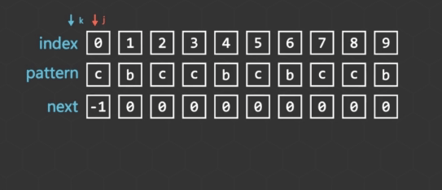
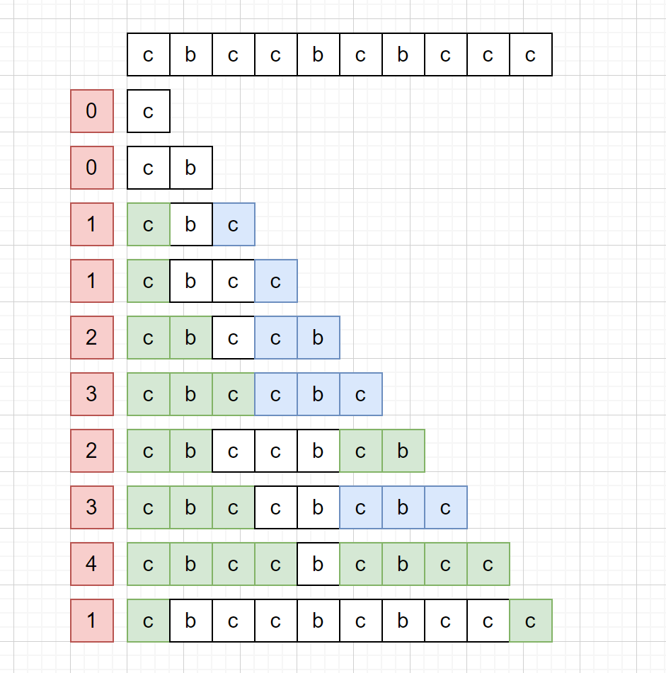
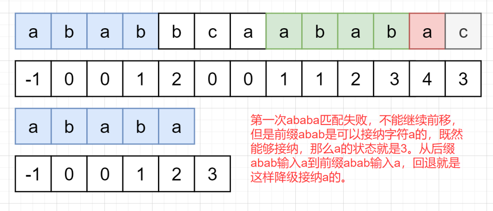
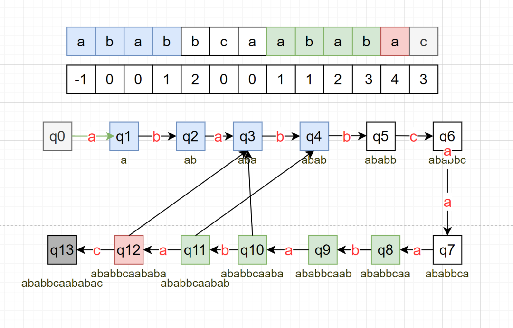

[TOC]



# 源码

```
// 计算kmp前缀表，用于匹配失败后进行回退操作
std::vector<int> compute_prefix_function(std::string& p)
{
    int n = p.length();
    std::vector<int> prefix(n);

    prefix[0] = -1;
    int j = 0;
    int k = -1;

    while (j < n - 1) {
        if (k == -1 || p[k] == p[j]) {
            // 如果相同，则记录当前k的位置
            k++;
            j++;
            prefix[j] = k;
        } else {
            // 不同则回退
            k = prefix[k];
        }
    }

    return prefix;
}

int kmp_matcher(std::string& t, std::string& p)
{
    auto prefix = compute_prefix_function(p);

    int j = 0;
    int k = 0;

    while (j < t.length() && k < p.length()) {
        if (k == -1 || t[j] == p[k]) {
            // 相同则前进
            k++;
            j++;
        } else {
            // 不同则回退尝试
            k = prefix[k];
        }
    }

    if (k == p.length()) {
        return j - p.length();
    }
    return -1;
}
```

# KMP算法的原理

KMP算法是有限自动机（DFA）的改进版本，DFA五要素中转移函数 $\delta$ 用于改变状态，KMP算法通过生成一张前缀表，计算时间复杂度 $O(n)$，简化了DFA的转移函数 $\delta (q, a)$，这里q是状态，a是输入符号。

上面代码中`compute_prefix_function`函数的功能就是计算前缀表，使用动画中的字符串来说明这个是如何运作的。对于字符串cbccbcbccb，要如何求出前缀表（有些文章称之为next表），其实是依次取得字符串前缀字符串，然后看**前缀与后缀**字符相同的个数，如下图所示：



左边红色部分就是前缀表，大脑很容易计算这个问题，但是对于计算机，需要进行规约：如何求取一个字符串的所有前缀$S_i$的最长相同前后缀字符数。朴素解法：对于每一个前缀$S_i$，从1个前缀数开始判断后缀是否与前缀相同，复杂度$O(m * n^2)$。KMP算法的精巧之处就在于在 $O(n)$ 时间复杂度上解决这个问题。

可以将KMP算法看做是一个双指针问题，每次遍历如果p[k]和p[j]相同，就前移2个指针，如果不相同，就回退指针k。数组默认为0，相同的时候增加k的值。回退的时候是k=prefix[k]，这是为什么呢？为什么不是k=0？



总结一下就是，每次遇到不能继续前进的字符a，那么就看当前匹配到哪里了，然后把这个匹配进度回退到开头，其实就是把后缀变成前缀s，试探a能否被s接纳，如果能接纳，那么a的状态值就是s最后一个字母的状态值+1，如果不能接纳，那么继续重复试探。一直失败会回退到-1，那么a的状态值就是默认的0。

# KMP算法与正则表达式

KMP算法是从DFA来的，大学课本里面可能只有编译原理这门课会比较详细的介绍DFA， 同时也会介绍正则表达式和NFA，一般来说正则表达式都是转化为NFA在再转成DFA，但是普通字符串的匹配问题没有复杂的正则符号，所以可以很容易的写一个字符串ababbcaababac的状态转移图：



每一个状态都是字符串p的前缀，q0表示起始状态，是空串，q13是接受状态（也称为结束状态），这里面没有标注分支，只是画了主干，比如状态q4是abab，可以画一条线接受a到q1，这里画了从q11回退到q4，q12回退到q3，其实前缀表中的数值就是回退后的前缀所在的状态值，KMP的前缀表是一个精简的DFA状态转移表。DFA在状态转移过程中会产生多条分支，KMP虽然只记录了一个值，却是嵌套回退的，优先匹配最大值，也因此可能产生多条分支。这就是KMP算法前缀表的DFA理解，状态之间的转换不是遇到不同就回退到初始状态，而是可以进入一个中间状态。


