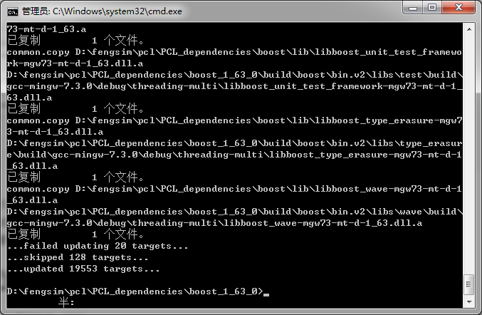
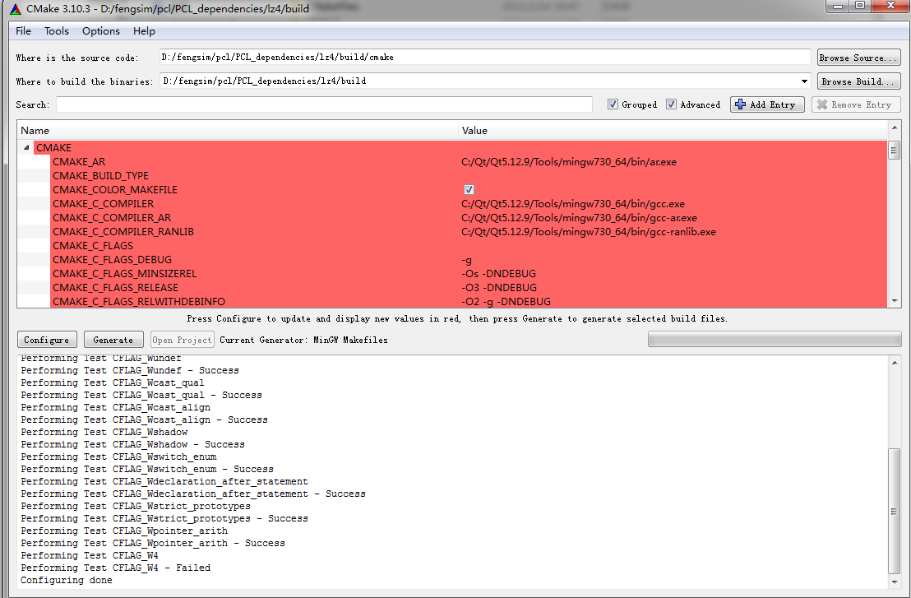

[TOC]

# Customizing the PCL build process

## PCL basic settings

Let’s say PCL is placed under /PATH/TO/PCL, which we will refer to as PCL_ROOT:

```
$ cd $PCL_ROOT
$ mkdir build && cd build
$ cmake ..
```

This will cause cmake to create a file called CMakeCache.txt in the build directory with the default options.

Let’s have a look at what cmake options got enabled:

```
$ ccmake ..
```

You should see something like the following on screen:

```
BUILD_common                     ON
BUILD_features                   ON
BUILD_filters                    ON
BUILD_global_tests               OFF
BUILD_io                         ON
BUILD_kdtree                     ON
BUILD_keypoints                  ON
BUILD_octree                     ON
BUILD_range_image                ON
BUILD_registration               ON
BUILD_sample_consensus           ON
BUILD_segmentation               ON
BUILD_surface                    ON
BUILD_visualization              ON
CMAKE_BUILD_TYPE
CMAKE_INSTALL_PREFIX             /usr/local
PCL_SHARED_LIBS                  ON
PCL_VERSION                      1.0.0
VTK_DIR                          /usr/local/lib/vtk-5.6
```

## The explanation

- BUILD_common: option to enable/disable building of common library
- BUILD_features: option to enable/disable building of features library
- BUILD_filters: option to enable/disable building of filters library
- BUILD_global_tests: option to enable/disable building of global unit tests
- BUILD_io: option to enable/disable building of io library
- BUILD_kdtree: option to enable/disable building of kdtree library
- BUILD_keypoints: option to enable/disable building of keypoints library
- BUILD_octree: option to enable/disable building of octree library
- BUILD_range_image: option to enable/disable building of range_image library
- BUILD_registration: option to enable/disable building of registration library
- BUILD_sample_consensus: option to enable/disable building of sample_consensus library
- BUILD_segmentation: option to enable/disable building of segmentation library
- BUILD_surface: option to enable/disable building of surface library
- BUILD_visualization: option to enable/disable building of visualization library
- CMAKE_BUILD_TYPE: here you specify the build type. In CMake, a CMAKE_BUILD_TYPE corresponds to a set of options and flags passed to the compiler to activate/deactivate a functionality and to constrain the building process.
- CMAKE_INSTALL_PREFIX: where the headers and the built libraries will be installed
- PCL_SHARED_LIBS: option to enable building of shared libraries. Default is yes.
- PCL_VERSION: this is the PCL library version. It affects the built libraries names.
- VTK_DIR: directory of VTK library if found

The above are called cmake cached variables. At this level we only looked at the basic ones.

## Tweaking basic settings

Depending on your project/system, you might want to enable/disable certain options. For example, you can prevent the building of:

- tests: setting BUILD_global_tests to OFF
- a library: setting BUILD_LIBRARY_NAME to OFF

Note that if you disable a XXX library that is required for building YYY then XXX will be built but won’t appear in the cache.

You can also change the build type:

- **Debug**: means that no optimization is done and all the debugging symbols are embedded into the libraries file. This is platform and compiler dependent. On Linux with gcc this is equivalent to running gcc with -O0 -g -ggdb -Wall
- **Release**: the compiled code is optimized and no debug information will be printed out. This will lead to -O3 for gcc and -O5 for clang
- **RelWithDebInfo**: the compiled code is optimized but debugging data is also embedded in the libraries. This is a tradeoff between the two former ones.
- **MinSizeRel**: this, normally, results in the smallest libraries you can build. This is interesting when building for Android or a restricted memory/space system.

A list of available CMAKE_BUILD_TYPEs can be found typing:

```
$ cmake --help-variable CMAKE_BUILD_TYPE
```

## Tweaking advanced settings

### Building unit tests

If you want to contribute to PCL, or are modifying the code, you need to turn on building of unit tests. This is accomplished by setting the BUILD_global_tests option to ON, with a few caveats. If you’re using ccmake and you find that BUILD_global_tests is reverting to OFF when you configure, you can move the cursor up to the BUILD_global_tests line to see the error message.

Two options which will need to be turned ON before BUILD_global_tests are BUILD_outofcore and BUILD_people. Your mileage may vary.

Also required for unit tests is the source code for the Google C++ Testing Framework. That is usually as simple as downloading the source, extracting it, and pointing the GTEST_SRC_DIR and GTEST_INCLUDE_DIR options to the applicable source locations. On Ubuntu, you can simply run apt-get install libgtest-dev.

These steps enable the tests make target, so you can use make tests to run tests.

### General remarks

Under ${PCL_ROOT}/cmake/Modules there is a list of FindXXX.cmake files used to locate dependencies and set their related variables. They have a list of default searchable paths where to look for them. In addition, if pkg-config is available then it is triggered to get hints on their locations. If all of them fail, then we look for a CMake entry or environment variable named **XXX_ROOT** to find headers and libraries. We recommend setting an environment variable since it is independent from CMake and lasts over the changes you can make to your configuration.

The available ROOTs you can set are as follow:

- **BOOST_ROOT**: for boost libraries with value C:/Program Files/boost-1.4.6 for instance
- **CMINPACK_ROOT**: for cminpack with value C:/Program Files/CMINPACK 1.1.13 for instance
- **QHULL_ROOT**: for qhull with value C:/Program Files/qhull 6.2.0.1373 for instance
- **FLANN_ROOT**: for flann with value C:/Program Files/flann 1.6.8 for instance
- **EIGEN_ROOT**: for eigen with value C:/Program Files/Eigen 3.0.0 for instance

To ensure that all the dependencies were correctly found, beside the message you get from CMake, you can check or edit each dependency specific variables and give it the value that best fits your needs.

UNIX users generally don’t have to bother with debug vs release versions they are fully compliant. You would just loose debug symbols if you use release libraries version instead of debug while you will end up with much more verbose output and slower execution. This said, Windows MSVC users and Apple iCode ones can build debug/release from the same project, thus it will be safer and more coherent to fill them accordingly.

## Detailed description

Below, each dependency variable is listed, its meaning is explained then a sample value is given for reference.

- Boost

- Boost

| cache variable                   | meaning                                                    | sample value                             |
| -------------------------------- | ---------------------------------------------------------- | ---------------------------------------- |
| Boost_DATE_TIME_LIBRARY          | full path to boost_date-time.[so,lib,a]                    | /usr/local/lib/libboost_date_time.so     |
| Boost_DATE_TIME_LIBRARY_DEBUG    | full path to boost_date-time.[so,lib,a] (debug version)    | /usr/local/lib/libboost_date_time-gd.so  |
| Boost_DATE_TIME_LIBRARY_RELEASE  | full path to boost_date-time.[so,lib,a] (release version)  | /usr/local/lib/libboost_date_time.so     |
| Boost_FILESYSTEM_LIBRARY         | full path to boost_filesystem.[so,lib,a]                   | /usr/local/lib/libboost_filesystem.so    |
| Boost_FILESYSTEM_LIBRARY_DEBUG   | full path to boost_filesystem.[so,lib,a] (debug version)   | /usr/local/lib/libboost_filesystem-gd.so |
| Boost_FILESYSTEM_LIBRARY_RELEASE | full path to boost_filesystem.[so,lib,a] (release version) | /usr/local/lib/libboost_filesystem.so    |
| Boost_INCLUDE_DIR                | path to boost headers directory                            | /usr/local/include                       |
| Boost_LIBRARY_DIRS               | path to boost libraries directory                          | /usr/local/lib                           |
| Boost_SYSTEM_LIBRARY             | full path to boost_system.[so,lib,a]                       | /usr/local/lib/libboost_system.so        |
| Boost_SYSTEM_LIBRARY_DEBUG       | full path to boost_system.[so,lib,a] (debug version)       | /usr/local/lib/libboost_system-gd.so     |
| Boost_SYSTEM_LIBRARY_RELEASE     | full path to boost_system.[so,lib,a] (release version)     | /usr/local/lib/libboost_system.so        |

- CMinpack

| cache variable         | meaning                                            | sample value                     |
| ---------------------- | -------------------------------------------------- | -------------------------------- |
| CMINPACK_INCLUDE_DIR   | path to cminpack headers directory                 | /usr/local/include/cminpack-1    |
| CMINPACK_LIBRARY       | full path to cminpack.[so,lib,a] (release version) | /usr/local/lib/libcminpack.so    |
| CMINPACK_LIBRARY_DEBUG | full path to cminpack.[so,lib,a] (debug version)   | /usr/local/lib/libcminpack-gd.so |

- FLANN

| cache variable      | meaning                                                | sample value                      |
| ------------------- | ------------------------------------------------------ | --------------------------------- |
| FLANN_INCLUDE_DIR   | path to flann headers directory                        | /usr/local/include                |
| FLANN_LIBRARY       | full path to libflann_cpp.[so,lib,a] (release version) | /usr/local/lib/libflann_cpp.so    |
| FLANN_LIBRARY_DEBUG | full path to libflann_cpp.[so,lib,a] (debug version)   | /usr/local/lib/libflann_cpp-gd.so |

- Eigen

| cache variable    | meaning                         | sample value              |
| ----------------- | ------------------------------- | ------------------------- |
| EIGEN_INCLUDE_DIR | path to eigen headers directory | /usr/local/include/eigen3 |

# Building PCL’s dependencies from source on Windows

## Requirements

In order to compile every component of the PCL library we need to download and compile a series of 3rd party library dependencies:

> - **Boost** version >= 1.46.1 (http://www.boost.org/)
>
> used for shared pointers, and threading. **mandatory**
>
> - **Eigen** version >= 3.0.0 (http://eigen.tuxfamily.org/)
>
> used as the matrix backend for SSE optimized math. **mandatory**
>
> - **FLANN** version >= 1.6.8 (http://www.cs.ubc.ca/research/flann/)
>
> used in kdtree for fast approximate nearest neighbors search. **mandatory**
>
> - **Visualization ToolKit (VTK)** version >= 5.6.1 (http://www.vtk.org/)
>
> used in visualization for 3D point cloud rendering and visualization. **mandatory**
>
> - **googletest** version >= 1.6.0 (http://code.google.com/p/googletest/)
>
> used to build test units. **optional**
>
> - **QHULL** version >= 2011.1 (http://www.qhull.org/)
>
> used for convex/concave hull decompositions in surface. **optional**
>
> - **OpenNI** version >= 1.1.0.25 (http://www.openni.org/)
>
> used to grab point clouds from OpenNI compliant devices. **optional**
>
> - **Qt** version >= 4.6 (http://qt.digia.com/)
>
> used for developing applications with a graphical user interface (GUI) **optional**

Though not a dependency per se, don’t forget that you also need the CMake build system (http://www.cmake.org/), at least version **3.5.0**. A Git client for Windows is also required to download the PCL source code.

## Building dependencies

In this tutorial, we’ll be compiling these libraries versions:

```
Boost : 1.48.0
Flann : 1.7.1
Qhull : 2011.1
Qt    : 4.8.0
VTK   : 5.8.0
GTest : 1.6.0
```

Let’s unpack all our libraries in C:/PCL_dependencies so that it would like like:

```
C:/PCL_dependencies
C:/PCL_dependencies/boost-cmake
C:/PCL_dependencies/eigen
C:/PCL_dependencies/flann-1.7.1-src
C:/PCL_dependencies/gtest-1.6.0
C:/PCL_dependencies/qhull
C:/PCL_dependencies/VTK
```

### Boost

Make directories for building and install

```
mkdir C:\boost-build
mkdir C:\install\boost_1_68_0\build
mkdir C:\boost
```

#### Boost.Build setup

```
cd C:\install\boost_1_68_0\
```
prepare b2
```
bootstrap.bat gcc
```
Build boost.build with b2
```
b2 --prefix="C:\boost-build" install
```
Add C:\boost-build\bin to your session PATH variable
```
set PATH=%PATH%;C:\boost-build\bin
```

#### Building Boost

navigate back up to the boost unzipped root directory
`cd C:\install\boost_1_68_0`
Build boost with b2
`b2 --build-dir="C:\install\boost_1_68_0\build" --build-type=complete --prefix="C:\boost" toolset=gcc install`
This is going to take awhile, so try to run this command right before beginning the director's cut of Lord of the Ring Return of the King.
When this is done you should see the following output



You can now delete "C:\install" and "C:\boost-build"

#### Adding to projects

Everything should now be installed
Include folder:
`C:\boost\include\boost-1_68`
Linker folder:
`C:\boost\lib`
Link required libraries:
e.g. `libboost_atomic-mgw81-mt-d-x64-1_68.a`

### **Eigen** 

> Eigen is a headers only library, so you can use the Eigen installer provided on the downloads page.


### Flann

Let’s move on to FLANN. Then open CMake-gui and fill in the fields:

```
Where is my source code: C:/PCL_dependencies/flann-1.7.1-src
Where to build binaries: C:/PCL_dependencies/flann-1.7.1-src/build
```

Hit the “Configure” button. Proceed and be sure to choose the correct “Generator” on the next window. You can safely ignore any warning message about hdf5.

Now, on my machine I had to manually set the BUILD_PYTHON_BINDINGS and BUILD_MATLAB_BINDINGS to OFF otherwise it would not continue to the next step as it is complaining about unable to find Python and Matlab. Click on “Advanced mode” and find them, or alternatively, add those entries by clicking on the “Add Entry” button in the top right of the CMake-gui window. Add one entry named “BUILD_PYTHON_BINDINGS”, set its type to “Bool” and its value to unchecked. Do the same with the “BUILD_MATLAB_BINDINGS” entry.

Now hit the “Configure” button and it should work. Go for the “Generate” This will generate the required project files/makefiles to build the library. Now you can simply go to C:/PCL_dependencies/flann-1.7.1-src/build and proceed with the compilation using your toolchain. 

While generate is done, juse open a cmd, and cd to the build directory, and type mingw32-make to build it.

While build is ok, type mingw32-make install to install it.

Build the **INSTALL** project in **release** mode.

> If you don’t have a Python interpreter installed CMake would probably not allow you to generate the project files. To solve this problem you can install the Python interpreter (https://www.python.org/download/windows/) or comment the add_subdirectory( test ) line from C:/PCL_dependencies/flann-1.7.1-src/CMakeLists.txt .


when you use mingw to complie of it, you encountered the following problems:

#### not found pkg-config, 

I assume here that MinGW was installed to C:/Qt/Qt5.12.9/Tools/mingw730_64/. There were multiple versions of the packages available, and in each case I just downloaded the latest version. You can follow the steps to solve it 

1.go to http://ftp.gnome.org/pub/gnome/binaries/win32/dependencies/
2.download the file [pkg-config_0.26-1_win32.zip](http://ftp.gnome.org/pub/gnome/binaries/win32/dependencies/pkg-config_0.26-1_win32.zip)
3.extract the file bin/pkg-config.exe to C:/Qt/Qt5.12.9/Tools/mingw730_64/bin
4.download the file [gettext-runtime_0.18.1.1-2_win32.zip](http://ftp.gnome.org/pub/gnome/binaries/win32/dependencies/gettext-runtime_0.18.1.1-2_win32.zip)
5.extract the file bin/intl.dll to C:/Qt/Qt5.12.9/Tools/mingw730_64/bin
6.go to http://ftp.gnome.org/pub/gnome/binaries/win32/glib/2.28
7.download the file [glib_2.28.8-1_win32.zip](http://ftp.acc.umu.se/pub/gnome/binaries/win32/glib/2.28/glib_2.28.8-1_win32.zip)
8.extract the file bin/libglib-2.0-0.dll to C:/Qt/Qt5.12.9/Tools/mingw730_64/bin

#### not found liblz4

you can solve it as follow steps:

1.git clone https://github.com/lz4/lz4.git

2.open the cmake-gui, select the source code directory and build directory



clicked Configure,while Configuring done, then clicked Generate, while Generating done do the next step.

3.open the cmd and cd to the build directory, and use mingw32-make , you should ensure your mingw in your environment path.

4.while build is done, type mingw32-make install to install it into the C:\Program Files (x86)\LZ4, you also can set the install path at cmake-gui, CMAKE_INSTALL_PREFIX.

5.under the install directory, copy the files bin, include,lib,share to the mingw directory, such as me is copy to C:/Qt/Qt5.12.9/Tools/mingw730_64

### QHull :
Setup the CMake fields with the qhull paths:

 ```
 Where is my source code: C:/PCL_dependencies/qhull-2011.1
 Where to build binaries: C:/PCL_dependencies/qhull-2011.1/build
 ```

Before clicking on “Configure”, click on “Add Entry” button in the top right of CMake gui, in the popup window, fill the fields as follows:

 ```
 Name  : CMAKE_DEBUG_POSTFIX
 Type  : STRING
 Value : _d
 ```

Then click “Ok”. This entry will define a postfix to distinguish between debug and release libraries.

Then hit “Configure” twice and “Generate”. Then build the **INSTALL** project, both in **debug** and **release** configuration.

While generate is done, just open a cmd, and cd to the build directory, and type mingw32-make to build it.

While build is ok, type mingw32-make install to install it.

### GTest :

```
git clone https://github.com/google/googletest.git
```

In case you want PCL tests (not recommended for users), you need to compile the googletest library (GTest). Setup the CMake fields as usual:

```
Where is my source code: C:/PCL_dependencies/gtest-1.6.0
Where to build binaries: C:/PCL_dependencies/gtest-1.6.0/bin32
```
Hit “Configure” and set the following options:
```
BUILD_SHARED_LIBS                OFF
gtest_force_shared_crt           ON
```
Generate and build the resulting project.

# Compiling PCL from source on Windows

First you should add the follow environment variable to your computer system.

```
CPLUS_INCLUDE_PATH=C:\Qt\Qt5.12.9\Tools\mingw730_64\include
LIBRARY_PATH=C:\Qt\Qt5.12.9\Tools\mingw730_64\lib
```

Open the cmake-gui and setup the CMake fields as usual:

```
Where is my source code: D:/fengsim/pcl/pcl
Where to build binaries: D:/fengsim/pcl/pcl/build
```

click on “Add Entry” button in the top right of CMake gui, in the popup window, fill the fields as follows:

```
 Name  : BOOST_ROOT
 Type  : PATH
 Value : D:\fengsim\pcl\PCL_dependencies\boost
```

click on “Add Entry” button in the top right of CMake gui, in the popup window, fill the fields as follows:

```
 Name  : QHULL_ROOT
 Type  : PATH
 Value : D:\fengsim\pcl\PCL_dependencies\qhullinstall
```

click on “Add Entry” button in the top right of CMake gui, in the popup window, fill the fields as follows:

```
 Name  : FLANN_ROOT
 Type  : PATH
 Value : D:\fengsim\pcl\PCL_dependencies\flann
```

click on “Add Entry” button in the top right of CMake gui, in the popup window, fill the fields as follows:

```
 Name  : EIGEN_ROOT
 Type  : PATH
 Value : D:\fengsim\pcl\PCL_dependencies\eigen
```

Hit “Configure”，check Grouped and Advanced and under CMAKE set the following options:

```
CMAKE_CXX_FLAGS  -DWITH_FLUID_ONLY=ON
```

Hit "Configure",  while Configuring done, Hit the Generate, while done. Open the cmd and go to the build directory, type mingw32-make to compile of it.

If there is an error as follow:

```
 undefined reference to `LZ4_decompress_fast'
```

Edit the file D:\fengsim\pcl\pcl\build\kdtree\CMakeFiles\pcl_kdtree.dir\link.txt , add -llz4 to it. And type mingw32-make again.

```
C:\CMake\cmakex64\bin\cmake.exe -E remove -f CMakeFiles\pcl_kdtree.dir/objects.a
C:\Qt\Qt5.12.9\Tools\mingw730_64\bin\ar.exe cr CMakeFiles\pcl_kdtree.dir/objects.a @CMakeFiles\pcl_kdtree.dir\objects1.rsp
C:\Qt\Qt5.12.9\Tools\mingw730_64\bin\g++.exe  -DWITH_FLUID_ONLY=ON -O2 -g -DNDEBUG -Wl,--as-needed -Wl,--export-all-symbols -Wl,--enable-auto-import -Wl,--allow-multiple-definition -shared -o ..\bin\libpcl_kdtree.dll -Wl,--out-implib,..\lib\libpcl_kdtree.dll.a -Wl,--major-image-version,1,--minor-image-version,11 -Wl,--whole-archive CMakeFiles\pcl_kdtree.dir/objects.a -Wl,--no-whole-archive @CMakeFiles\pcl_kdtree.dir\linklibs.rsp -llz4
```

If there is a similar error as follow:

```
CMakeFiles\pcl_hdl_grabber.dir/objects.a(hdl_grabber_example.cpp.obj):D:/fengsim/pcl/PCL_dependencies/boost/include/boost-1_63/boost/asio/detail/impl/winsock_init.ipp:56: undefined reference to `__imp_WSACleanup'CMakeFiles\pcl_hdl_grabber.dir/objects.a(hdl_grabber_example.cpp.obj):D:/fengsim/pcl/PCL_dependencies/boost/include/boost-1_63/boost/asio/detail/impl/winsock_init.ipp:39: undefined reference to `__imp_WSAStartup'collect2.exe: error: ld returned 1 exit status
```

Just go to the pcl_hdl_grabber.dir directory under the build, and edit the link.txt , add -lws2_32, then type mingw32-make.

```
C:\CMake\cmakex64\bin\cmake.exe -E remove -f CMakeFiles\pcl_io.dir/objects.a
C:\Qt\Qt5.12.9\Tools\mingw730_64\bin\ar.exe cr CMakeFiles\pcl_io.dir/objects.a @CMakeFiles\pcl_io.dir\objects1.rsp
C:\Qt\Qt5.12.9\Tools\mingw730_64\bin\g++.exe  -DWITH_FLUID_ONLY=ON -O2 -g -DNDEBUG -Wl,--as-needed -Wl,--export-all-symbols -Wl,--enable-auto-import -Wl,--allow-multiple-definition -shared -o ..\bin\libpcl_io.dll -Wl,--out-implib,..\lib\libpcl_io.dll.a -Wl,--major-image-version,1,--minor-image-version,11 -Wl,--whole-archive CMakeFiles\pcl_io.dir/objects.a -Wl,--no-whole-archive @CMakeFiles\pcl_io.dir\linklibs.rsp -lws2_32
```

If there is a similar error as shown above, just goto *.dir, and edit the file of link.txt, add -lws2_32 to it. and go mingw32-make again.

When build success, type mingw32-make install to install the pcl.


