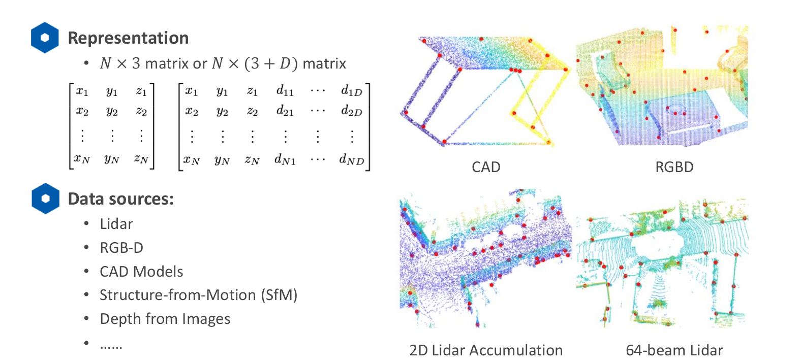
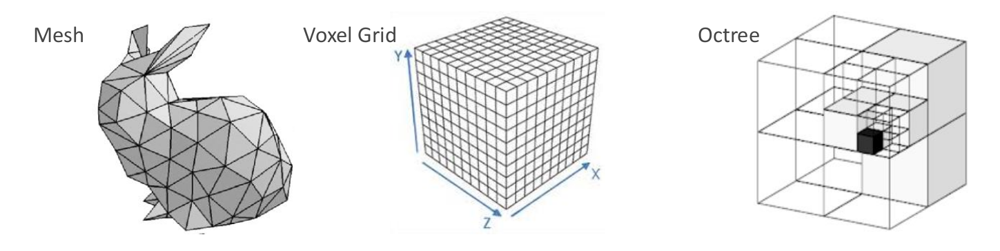
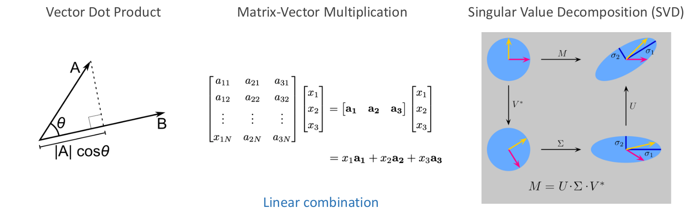
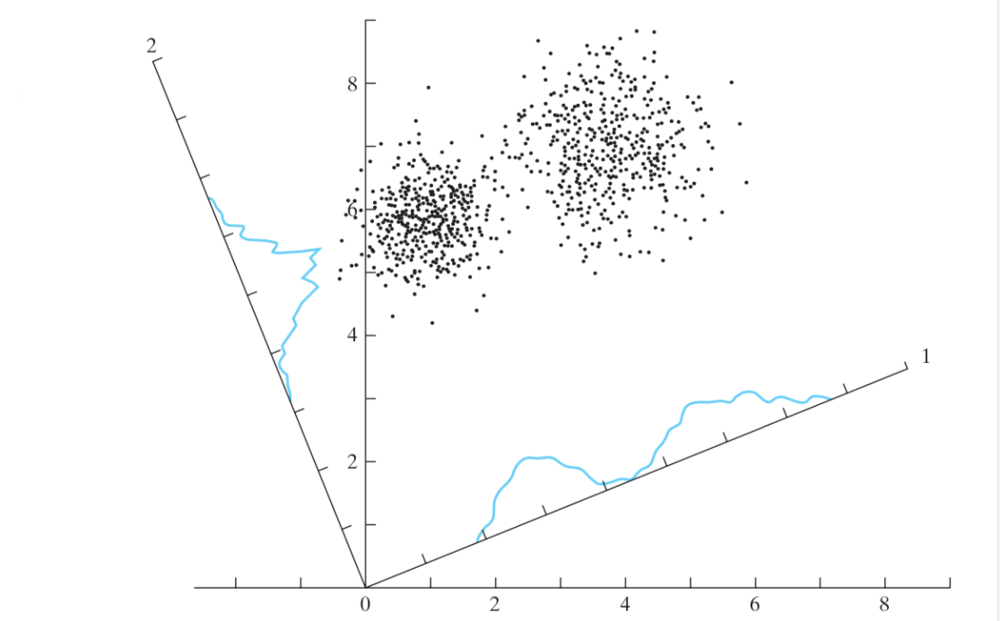
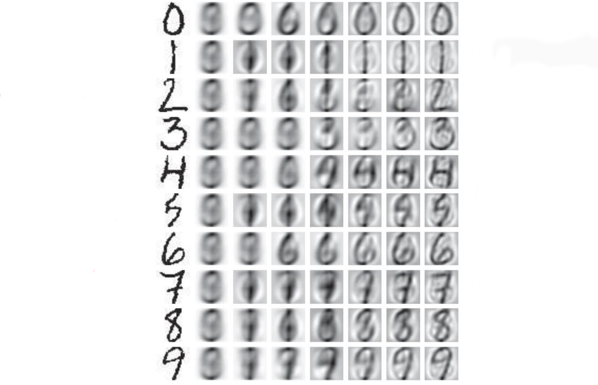
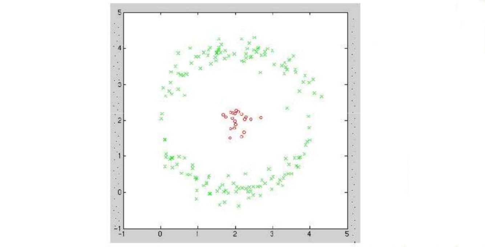
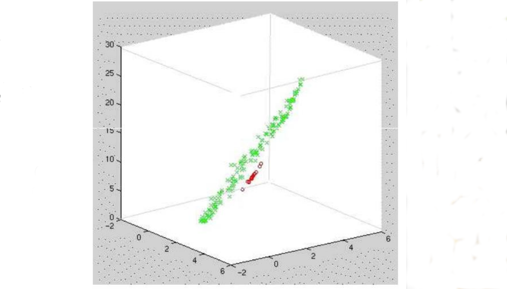
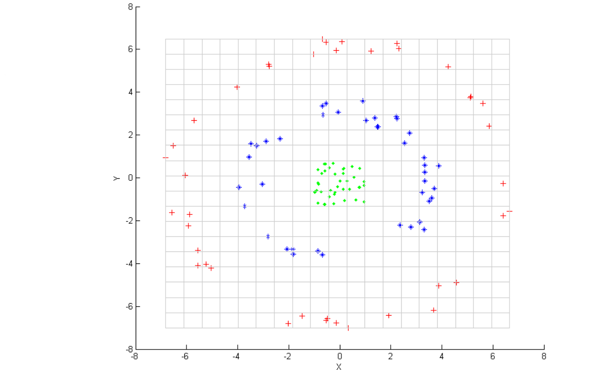
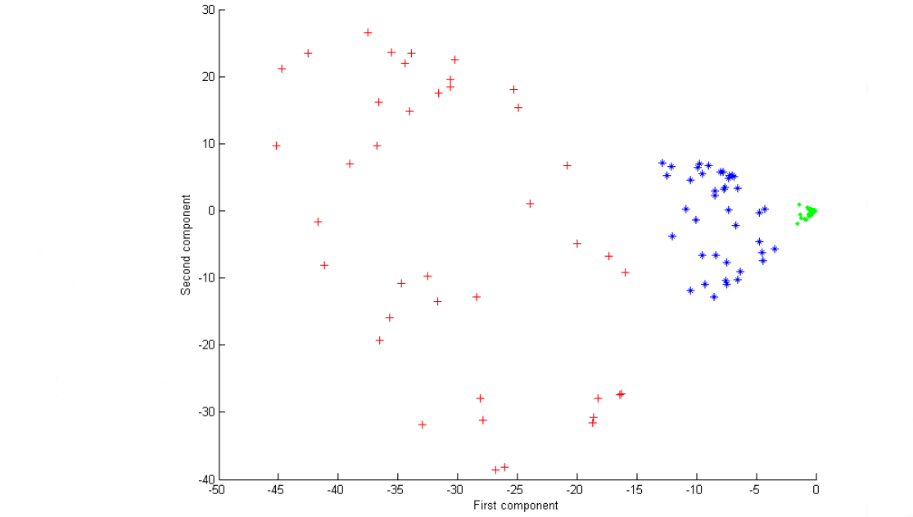
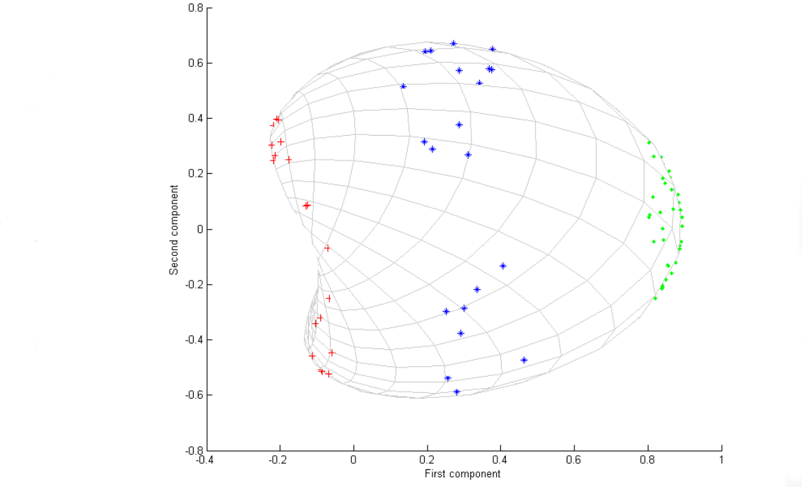

[TOC]

# Introduction

什么是三维点云？

**点云的应用**

- Robotics, Autonomous driving
  - Localization – SLAM, loop closure, registration 本地化 – SLAM、闭环、注册
  - Perception – object detection, classification 感知——物体检测、分类
  - Reconstruction – SfM, registration  重建 - SfM，注册

- Consumer Electronics  消费类电子产品
  - Face detection / reconstruction – FaceID  人脸检测/重建 - FaceID
  - Hand pose – Hololens  手部姿势 - Hololens
  - Human pose – Kinect  人体姿势 - Kinect

**优势**

3D 有哪些选择？

点云的强度

- 3D 信息
- 数学上简单明了

**困难**
点云处理难点

- 稀疏性  Sparsity
- 不规则 - 邻居搜索困难 Irregular – difficulty in neighbor searching
- 缺乏纹理信息 Lack of texture information
- 无序——深度学习的难点 Un-ordered – difficulty in deep learning
- 旋转等方差/不变性 Rotation equivariance / invariance

**Classical Methods**

- Pros 优点
  - Explainable – It follows physics and we know why it works/doesn’t work 可解释——它遵循物理学，我们知道它为什么有效/无效
  - Controllable – We know how to debug 可控——我们知道如何调试
- Cons 缺点
  - Hard to model semantics  难以建模语义
  - User-unfriendly  用户不友好

**Deep Learning Methods**

- Pros
  - Simple!
  - High performance  高性能
  - Data driven 数据驱动
- Cons
  - Un-explainable – No one knows why / how.  无法解释——没有人知道为什么/如何。
  - Un-controllable – Black box  不可控——黑匣子
  - Requires special hardware – GPU / FPGA, etc.  需要特殊的硬件——GPU / FPGA 等。
  - Simple – The barrier is lower and lower means it will be more and more difficult to find a job. 简单——门槛越来越低意味着找工作会越来越难。

**经典方法 VS 深度学习**

- 对象分类
  - 经典方法
    - Keypoint detection 关键点检测 
    - Keypoint description 关键点描述 
    - Support Vector Machine 支持向量机
  - 深度学习
    - Data collection 数据收集
    - Data labeling 数据标记
    - Train a network 训练网络

- 对象配准
  - 经典方法
    - Nearest Neighbor Search 最近邻搜索
    - Iterative Closest Point 迭代最近点
  - 深度学习
    - Data collection 数据收集
    - Data labeling 数据标记
    - Train a network 训练网络

- 对象检测
  - 经典方法
    -  Background removal 背景去除
    -  Clustering 聚类
    - Classification 分类
  - 深度学习
    - Data collection 数据收集
    - Data labeling 数据标记
    - Train a network 训练网络

**Common Tools for Practice**

- C++
  - Point Cloud Library (PCL)
  - Python Binding – pybind11
  - Optimization Solver – g2o, Ceres
  - Eigen
- Python
  - numpy
  - scipy
  - Open3D
  - Pytorch
  - Tensorflow

# PCA

**Principle Component Analysis 主成分分析**

- PCA is to find the dominant directions of thepoint cloud PCA 是寻找点云的主导方向
- Applications:
  - Dimensionality reduction 降维
  - Surface normal estimation 法向量估计
  - Canonical orientation  规范取向
  - Keypoint detection  关键点检测
  - Feature description 功能描述

- 矢量点积 Vector Dot Product
- 矩阵向量乘法 Matrix-Vector Multiplication
- 奇异值分解 (SVD) Singular Value Decomposition (SVD)

**Spectral Theorem 谱定理**

Let $A \in R^{n,n}$ be symmetric, and $\lambda_i \in R, i = 1,2,\cdots,n$ be the eigenvalues of $A$ . There exists a set of orthonormal vectors  $u_i \in R_n, i = 1,2,\cdots,n$,  such that  $Au_i = \lambda_iu_i$,  Equivalently, there exists an orthogonal matrix  $U = [u_1, \cdots, u_n](i.e., UU^T = U^TU = I_n)$,  such that ,

设 $A \in R^{n,n}$是对称的，并且 $\lambda_i \in R, i = 1,2,\cdots,n$ 是 $A$ 的特征值。存在一组正交向量 $u_i \in R_n, i = 1,2,\cdots,n$，使得 $Au_i = \lambda_iu_i$。等价地，存在一个正交矩阵 $U = [u_1, \cdots, u_n](i.e., UU^T = U^TU = I_n)$，使得，
$$
A = U \Lambda U^T = \sum_{i=1}^{n} \lambda_i u_i u_i^T, \Lambda = diag(\lambda_1,\cdots, \lambda_n)
$$

**Rayleigh Quotients 瑞利商**

Physical meaning of SVD! 

奇异值分解(Singular Value Decomposition，以下简称SVD)

给定一个对称矩阵 Given a symmertric matrix $A \in S^n$, 
$$
\lambda_{min}(A) \leq \frac{x^TAx}{x^Tx} \leq \lambda_{max}(A), \forall x \neq 0 \\
\lambda_{max}(A) = \underset{x:\|x\|_2=1}{max} x^TAx\\
\lambda_{min}(A) = \underset{x:\|x\|_2 = 1}{min} x^TAx
$$
The maximum and minimum are attained for $x = u_1$ and for $x = u_n$, respectively,  where $u_1$ and $u_n$ are the largest and smallest eigenvector of $A$, respectively.

分别为 $x = u_1$ 和 $x = u_n$ 获得最大值和最小值，其中 $u_1$ 和 $u_n$ 分别是 $A$ 的最大和最小特征向量。

**瑞利商——证明：**

- Apply the spectral theorem, $U$ is orthogonal, $\Lambda$ is diagonal
- 应用谱定理，$U$是正交的，$\Lambda$ 是对角线

$$
X^TAx = x^T U \Lambda U^T x = \bar{x}^T \Lambda \bar{x} = \sum_{i=1}^{n} \lambda_i \bar{x}^2_i
$$

- Obviously

$$
\lambda_{min} \sum_{i=1}^n \bar{x}_i^2 \leq \sum_{i=1}^2 \lambda_i\bar{x}^2_i \leq \lambda_{max} \sum_{i=1}^n \bar{x}^2_i
$$

- Also, orthogonal matrix $U$ doesn’t change the norm of any vector
- 此外，正交矩阵 $U$ 不会改变任何向量的范数

$$
\sum_{i=1}^n x^2_i = x^Tx = x^TUU^Tx = (U^Tx)^T(U^Tx) = \bar{x}^T\bar{x} = \sum_{i=1}^n \bar{x}^2_i
$$

- Combining the above 3 equations,

$$
\lambda_{min} x^T x \leq x^T A x \leq \lambda_{max}x^Tx
$$

Input: $x_i \in \mathbb{R}^n, i = 1, 2, \cdots, m$

Output: principle vectors 主向量$z_1,z_2,\cdots,z_k \in \mathbb{R}^n, k \leq n$ 

主成分分析

- Q: What is the most significant principle component?
  A: A direction such that the variance of the projected data points on that direction is maximal.

- 问：最重要的主成分是什么？
  答：一个方向，使得该方向上的投影数据点的方差最大。

- Q: How to get the second significant one?
  A: Deflation. Remove the most significant component from the data points, i.e., data point minus the projection. Find the most significant component for the deflated data.
- 问：如何获得第二个重要的？
  答：通货紧缩。 从数据点中删除最重要的组成部分，即数据点减去投影。 为压缩的数据找到最重要的组成部分。

- Q: How to get the $3^{rd}$ one?
  A: Repeat the above steps.
- 问：如何获得第三个？
  答：重复以上步骤。

**Principle Component Analysis - Proof**

- Normalize the data to be zero mean
- 将数据归一化为零均值

$$
\tilde{X} = [\tilde{x}_1, \cdots, \tilde{x}_m], \tilde{x}_i = x_i - \bar{x}, i = 1, \cdots , m \qquad \bar{x} = \frac{1}{m} \sum^{m}_{i=1}x_i
$$

- PCA is to get largest variance when projected to a direction $z \in \mathbb{R}^n,\ \|z\|_2 = 1$
- PCA 是在投影到一个方向时获得最大的方差  $z \in \mathbb{R}^n,\ \|z\|_2 = 1$

$$
\alpha_i = \tilde{x}_i^T z, \ i = 1, \cdots, m
$$

- The mean variance of the projections is
- 投影的平均方差为

$$
\frac{1}{m} \sum_{i=1}^m \alpha_i^2 = \frac{1}{m} \sum_{i=1}^m z^T \tilde{x}_i \tilde{x}_i^T z = \frac{1}{m} z^T \tilde{X} \tilde{X}^Tz
$$

- So, maximize it,
- 所以，最大化它，

$$
\underset{z \in R^n}{max} z^T (\tilde{X}\tilde{X}^T) z, s.t. :\|z\|_2 = 1
$$

- Now, maximize this
- 现在，最大化这个

$$
\underset{z \in R^n}{max}\ z^T (\tilde{X}\tilde{X}^T)z, \ s.t.:\|z\|_2 = 1
$$

- Recall the Rayleigh Quotients
- 回忆瑞利商数

$$
\lambda_{min}(A) \leq \frac{x^TAx}{x^T x} \leq \lambda_{max}(A), \forall x \neq 0
$$

- Recall our Spectral Theorem
- 回想一下我们的谱定理

$$
A = U \Lambda U^T = \sum_{i=1}^n \lambda_i u_i u_i^T, \Lambda = diag(\lambda_1, \cdots , \lambda_n)
$$

- Apply to PCA
- 申请PCA

$$
H = \tilde{X}\tilde{X}^T = U_r \Sigma^2 U_r^T
$$

- First principle vector $𝑧_1 = 𝑢_1$ , $𝑢_1$ is the first column of $𝑈_𝑟$
- 第一原理向量 $𝑧_1 = 𝑢_1$ , $𝑢_1$ 是 $𝑈_𝑟$ 的第一列

- Let's take a look at $H = \tilde{X}\tilde{X}^T = U_r \Sigma^2U_r^T$.
- Perform SVD on $\tilde{X}$:  $\tilde{X} = U_r\Sigma V_r^T = \sum_{i=1}\sigma_iu_iv_i^T$.
- 谱定理和SVD密切相关

- Find $𝑧_2$ by deflation
- 通过收缩找到 $z_2$

$$
\tilde{x}_i^{(1)} = \tilde{x}_i - u_1(u_1^T\tilde{x}_i), i = 1, \cdots, m \\
\tilde{X}^{(1)} = [\tilde{x}_1^{(1)}, \cdots ,\tilde{x}_m^{(1)}] = (I_n - u_1u_1^T)\tilde{X}
$$

- Combine the above equations:

$$
\tilde{X}^{(1)} = \sum_{i=1}^r \sigma_i u_i v_i^T - (u_1u_1^T) \sum_{i=1}^r \sigma_i u_i v_i^T \\
= \sum_{i=1}^r \sigma_i u_i v_i^T  - \sum_{i=1}^r \sigma_i u_1 u_1^T u_i v_i^T \\
= \sum_{i=1}^r \sigma_i u_i v_i^T - \sigma_1 u_1 v_1^T // U \ is \ orthogonal \\
= \sum_{i=2}^r \sigma_i u_i v_i^T
$$

- We have removed the first components, finding $𝑧_2$ is by
- 我们已经移除了第一个部分，发现 $𝑧_2$ 是由

$$
\underset{z \in R^n}{max} \ z^T (\tilde{X}^{(1)} \tilde{X}^{(1)T})z, \ s.t.:\|z\|_2 = 1 \\
 \tilde{X}^{(1)} = \sum_{i=2}^r \sigma_i u_i v_i^T
$$

- The result is simply $𝑧_2 = 𝑢_2$ , $𝑢_2$ is the $2^{nd}$ column of $𝑈_𝑟$
- 结果很简单 $𝑧_2 = 𝑢_2$ , $𝑢_2$ 是 $𝑈_𝑟$ 的 $2^{nd}$ 列
- $𝑧_3, \cdots , 𝑧_𝑚$ can be found by similar deflation.

**PCA - Summary**

Given $x_i \in \mathbb{R}^n, i = 1,2,\cdots m$， perform PCA by:

- Normalized by the center
- 由中心归一化

$$
\tilde{X} =  [\tilde{x}_1, \cdots , \tilde{x}_m], \tilde{x}_i = x_i - \bar{x}, i = 1,\cdots , m \qquad \bar{x} = \frac{1}{m} \sum_{i=1}^m x_i\cdot 
$$

- Compute SVD $H = \tilde{X}\tilde{X}^T = U_r \Sigma^2 U_r^T$

- The principle vectors are the columns of $𝑈_𝑟$
- (Eigenvector of 𝑋 = Eigenvector of 𝐻)
- 主向量是$𝑈_𝑟$的列
- （𝑋 的特征向量 = 𝐻 的特征向量）

**Dimensionality Reduction 降维**

Given $x_i \in \mathbb{R}^n, i = 1,2, \cdots m$，perform PCA to get $l$ principle components $\left \{z_1, z_2, \cdots, z_l \right \}, \ z_j \in \mathbb{R}^n$

给定的 $x_i \in \mathbb{R}^n, i = 1,2, \cdots m$ 执行 PCA 得到 $𝑙$ 主成分 $\left \{z_1, z_2, \cdots, z_l \right \}, \ z_j \in \mathbb{R}^n$

- Compress $𝑥_𝑖$ from 𝑛 dimension to $𝑙$ dimension, with $𝑙 \ll 𝑛$
- 将 $𝑥_𝑖$ 从 𝑛 维度压缩到 $𝑙$ 维度，使用 $𝑙 \ll 𝑛$
- Encoder 编码器

$$
\begin{bmatrix}a_{i1} \\ . \\. \\. \\ a_{il} \end{bmatrix} = \begin{bmatrix} z_1^T \\ . \\. \\. \\  z_l^T \end{bmatrix} x_i
$$

- Reconstruct $𝑥_𝑖$  from the principle components
- 从主成分重构$𝑥_𝑖$

- Decoder 解码器

$$
\hat{x_i} = \sum_{j=1}^l a_j z_j = [z_1, \cdots, z_l] \begin{bmatrix}a_{i1} \\ . \\. \\. \\ a_{il} \end{bmatrix} 
$$

Point cloud is projected into two principle axis {1, 2}

点云投影到两个主轴{1, 2}

- Represent a $H \times W$ binary/gray-scale image by a vector $x_i \in \mathbb{R}^n, n = HW$
- 用向量表示 $H \times W$ 二进制/灰度图像 $x_i \in \mathbb{R}^n, n = HW$
- Get the principle vectors $\left \{z_1, \cdots, z_l \right \}, z_j \in \mathbb{R}^n$
- 得到主向量 $\left \{z_1, \cdots, z_l \right \}, z_j \in \mathbb{R}^n$
- Digit recognition by clustering over the principle components $a_i = [a_1, \cdots a_l]^T \in \mathbb{R}^l$
- 通过在主成分上聚类的数字识别 $a_i = [a_1, \cdots a_l]^T \in \mathbb{R}^l$
- Similarly, face recognition by Eigenfaces
- 同样，Eigenfaces 的人脸识别

# Kernel PCA

- PCA is linear
- How to handle data not linearly separable?
- Lift it to high dimension!
- 将其提升到高维！

- Original data

$$
x_i = [x_{i1}, x_{i2}] \in \mathbb{R}^2
$$

- Lifted data

$$
\phi(x_i) = [x_{i1}, x_{i2}, x_{i1}^2 + x_{i2}^2] \in \mathbb{R}^3
$$

- They are separable now.
  - E.g., some principle component of $\phi(𝑥_𝑖)$ is able to tell the difference between the red and green
  - 例如，$\phi(𝑥_𝑖)$ 的某个主成分能够区分红色和绿色

- Input data $𝑥_𝑖 \in \mathbb{R}^{n_0}$ , non-linear mapping $\phi: \mathbb{R}^{n_0} \rightarrow \mathbb{R}^{n_1}$

- Follow the standard Linear PCA on the lifted space $\mathbb{R}^{n_1}$

- 在提升空间上遵循标准线性 PCA $\mathbb{R}^{n_1}$

  - 1.Assume $\phi(x_i)$is already zero-center

  - $$
    \frac{1}{N} \sum_{i=1}^N \phi(x_i) = 0
    $$

  - 2.Compute correlation matrix 计算相关矩阵

  - $$
    \tilde{H} = \frac{1}{N} \sum_{i=1}^N \phi (x_i) \phi^T(x_i)
    $$

  - 3.Solve the eigenvectors/eigenvalues by  求解特征向量/特征值

  - $$
    \tilde{H} \tilde{z} = \tilde{\lambda} \tilde{z}
    $$

- Problem solved? No fully.

  - How to define $\phi$?
  - Can we avoid working with the high dimension data? 可以避免使用高维数据吗

- Note that eigenvectors can be expressed as linear combination of features

- 请注意，特征向量可以表示为特征的线性组合

- $$
  \tilde{z} = \sum_{j=1}^N \alpha_j \phi(x_j)
  $$

- proof

- $$
  \tilde{H} \tilde{z} = \tilde{\lambda} \tilde{z}   \\
  \frac{1}{N} \sum_{i=1}^N \phi(x_i) \phi^T(x_i) \tilde{z} = \tilde{\lambda} \tilde{z}  \\
  scalar:\phi^T(x_i) \tilde{z}
  $$

- Find the eigenvector $\tilde{𝑧} =$ find the coefficient $\alpha_𝑗$ 

- 求特征向量 $\tilde{𝑧} =$ 求系数 $\alpha_𝑗$

- Put that linear combination into $\tilde{H} \tilde{z} = \tilde{\lambda} \tilde{z}$ 

- $$
  \frac{1}{N} \sum_{i=1}^N \phi(x_i) \phi^T(x_i) (\sum_{j=1}^N \alpha_j \phi(x_j)) = \tilde{\lambda}\sum_{j=1}^N \alpha_j \phi(x_j) \\
  \frac{1}{N} \sum_{i=1}^N \phi(x_i) (\sum_{j=1}^N \alpha_j \phi^T(x_i) \phi(x_j)) = \tilde{\lambda}\sum_{j=1}^N \alpha_j \phi(x_j)
  $$

- Let’s define kernel function $k(x_i, x_j) = \phi^T(x_i) \phi(x_j)$

- $$
  \frac{1}{N} \sum_{i=1}^N \phi(x_i) (\sum_{j=1}^N \alpha_j k(x_i, x_j)) = \tilde{\lambda} \sum_{j=1}^N \alpha_j \phi(x_j)
  $$

- Multiply both sides by 两边乘以 $\phi(x_k), k = 1, \cdots, N$  

- $$
  \sum_{i=1}^N \sum_{j=1}^N \alpha_j k(x_k, x_i) k(x_i, x_j) = N \tilde{\lambda} \sum_{j=1}^N \alpha_j k(x_k, x_j), k = 1, \cdots, N
  $$

- Now define the Gram matrix $K \in \mathbb{R}^{N \times N}, K(i, j) = k(x_i, x_j)$    

  - $𝐾$ is symmetric because $k(x_i, x_j) = k(x_j, x_i)$

- The above equation can be written as

- $$
  K^2 \alpha = N \tilde{\lambda} K \alpha
  $$

- Remove 𝐾 on both sides

- $$
  K \alpha = N \tilde{\lambda} \alpha \\
  K \alpha = \lambda \alpha
  $$

- Again, get the eigenvectors $\alpha_𝑟$ and eigenvalues $\lambda_r, r=1, \cdots, l$

- 增益，得到特征向量 $\alpha_𝑟$ 和特征值 $\lambda_r, r=1, \cdots, l$

- However, we have to ensure that $\tilde{𝑧}$ is unit vector, Note that we are solving the linear PCA in the feature space

- 但是，我们必须确保 $\tilde{𝑧}$ 是单位向量，注意我们是在特征空间中求解线性 PCA

- $$
  \tilde{H} \tilde{z} = \tilde{\lambda} \tilde{z} \qquad \tilde{z} = \sum_{j=1}^N \alpha_j \phi(x_j)
  $$

- The normalization of $\tilde{𝑧}$ leads to

- $$
  1 = \tilde{z}_r^T \tilde{z}_r \\
  1 = \sum_{i=1}^N \sum_{j=1}^N \alpha_{ri} \alpha_{rj} \phi^T(x_i) \phi(x_j) \\
  1 = \alpha_r^T K \alpha_r
  $$

- Note that $K \alpha = \lambda \alpha$,  we have $\alpha_r^T \lambda_r \alpha_r = 1, \forall r$  

- That is, normalize $\alpha_𝑟$ to be norm $1/\lambda_𝑟$ 

- Now, the $𝑟^{𝑡ℎ}$ principle vector in the lifted space is given below, which is unknown

- 现在，提升空间中的$𝑟^{𝑡ℎ}$主向量如下

- $$
  \tilde{z}_r = \sum_{j=1}^N \alpha_{rj} \phi(x_j)
  $$

- Now, the $𝑟^{𝑡ℎ}$ principle vector in the lifted space is given below

- 现在，提升空间中的$𝑟^{𝑡ℎ}$主向量如下

- $$
  \tilde{z}_r = \sum_{j=1}^N \alpha_{rj} \phi(x_j)
  $$

  

- But we know the projection of data point $𝑥$ projected into principle component $z_r$

- 但是我们知道投影到主分量 $z_r$ 的数据点 $𝑥$ 的投影

- $$
  \phi^T(x) \tilde{z}_r = \sum_{j=1}^N \alpha_{rj} \phi^T(x) \phi(x_j) = \sum_{j=1}^N \alpha_{rj} k(x, x_j)
  $$

- One more thing, we assume $\phi(𝑥_𝑖)$ is of zero mean.

- 还有一件事，我们假设  $\phi(𝑥_𝑖)$ 是零均值。

- Normalize $\phi(𝑥_𝑖)$  to be zero mean

- 将 $\phi(𝑥_𝑖)$ 归一化为零均值

- $$
  \tilde{\phi} (x_i) = \phi (x_i) - \frac{1}{N} \sum_{j=1}^N \phi(x_j)
  $$

- The normalized kernel $\tilde{k}(x_i, x_j)$ is given by

- 归一化内核 $\tilde{k}(x_i, x_j)$ 由下式给出

- $$
  \tilde{k}(x_i, x_j) = \tilde{\phi}^T (x_i) \tilde{\phi} (x_j) \\
  = (\phi(x_i) - \frac{1}{N} \sum_{k=1}^N \phi(x_k))^T (\phi(x_j) - \frac{1}{N} \sum_{l=1}^N \phi(x_l)) \\
  = k(x_i, x_j) - \frac{1}{N} \sum_{k=1}^N k(x_i, x_k) - \frac{1}{N} \sum_{k=1}^N k(x_j, x_k) + \frac{1}{N^2} \sum_{k=1}^N \sum_{l=1}^N k(x_k, x_l)
  $$

- In the matrix form 在矩阵形式 $\tilde{K} = K - 2 \mathbb{I}_{\frac{1}{N}} + \mathbb{I}_{\frac{1}{N}} K \mathbb{I}_{\frac{1}{N}}, where \ \mathbb{I}_{\frac{1}{N}}(i, j) = \frac{1}{N}, \forall i,j$

- Kernel choices
  - Linear $k(x_i, x_j) = x_i^T x_j$ 
  - Polynomial $k(x_i, x_j) = (1 + x_i^Tx_j)^p$ 
  - Gaussian $k(x_i, x_j) = e^{- \beta \|x_i - x_j \|_2}$  
  - Laplacian $k(x_i, x_j) = e^{- \beta \|x_i - x_j \|_1}$   
- Usually choose by experiments if there is no explicit knowledge what kernels best separate the data points.
- 如果没有明确的知识，通常通过实验选择什么内核最好地分离数据点。

- Select a kernel $𝑘(𝑥_𝑖, 𝑥_𝑗)$ , compute the Gram matrix $𝐾(𝑖, 𝑗) = 𝑘(𝑥_𝑖, 𝑥_𝑗 )$  

- 选择一个核 $𝑘(𝑥_𝑖, 𝑥_𝑗)$ ，计算 Gram 矩阵 $𝐾(𝑖, 𝑗) = 𝑘(𝑥_𝑖, 𝑥_𝑗 )$   

- Normalize 𝐾

- $$
  \tilde{K} = K - 2 \mathbb{I}_{\frac{1}{N}} K + \mathbb{I}_{\frac{1}{N}} K \mathbb{I}_{\frac{1}{N}}
  $$

- Solve the eigenvector/eigenvalues of $\tilde{K}$ 

- 求解 $\tilde{K}$ 的特征向量/特征值  

- $$
  \tilde{K} \alpha_r = \lambda_r \alpha_r
  $$

- Normalize $\alpha_r$ to be $\alpha_r^T \alpha_r = \frac{1}{\lambda_r}$ 

- For any data point $x \in \mathbb{R}^n$ , compute its projection onto $r^{th}$ principle component $y_r \in \mathbb{R}$  

- 对于任何数据点 $x \in \mathbb{R}^n$ ，计算其投影到 $r^{th}$ 主分量 $y_r \in \mathbb{R}$

- $$
  y_r = \phi^T(x)\tilde{z}_r = \sum_{j=1}^N \alpha_{rj} k(x, x_j)
  $$

  

Input data is not separable by linear PCA

- Projection into $1^{st}$ and $2^{nd}$ principle components
- 投影到 $1^{st}$ 和 $2^{nd}$ 主成分
- k PCA polynomial kernel $k(x_i, x_j) = (1 + x_i^T x_j)^2$
- Points can be separated by the first projection $𝑦_0$
- 点可以通过第一个投影$𝑦_0$分开

- Projection into $1^{st}$ and $2^{nd}$ principle components
- k PCA Gaussian kernel $k(x_i, x_j) = e^{- \beta \|x_i - x_j \|_2}$
- Points can be separated by the first projection $𝑦_0$

