[TOC]

# Surface normal on surface
- The vector perpendicular to the tangent plane of the surface at a point P
- 在点 P 处垂直于表面切平面的向量

- Applications
  - Segmentation / Clustering  分割/聚类
  - Plane detection   平面检测
  - Point cloud feature for applications like Deep Learning   深度学习等应用的点云功能

**How to compute**

- Surface normal on 3D point cloud  3D 点云上的表面法线
  1.Select a point P 选择一个点 P
  2.Find the neighborhood that defines the surface 找到定义曲面的邻域
  3.PCA
  4.Normal -> the least significant vector  最不重要的向量
  5.Curvature -> ratio between eigen values $𝜆_3/(𝜆_1 + 𝜆_2 + 𝜆_3)$ 特征值之间的比率
- Intuitively it is obvious, can we prove it formally? 直观上很明显，我们可以正式证明吗？

**Surface Normal Estimation – Definition 表面法线估计 - 定义**

- Problem Definition

- Denote data points as $x_i \in R^n, i = 1,2,\cdots,m$,   find a (hyper) plane,  that passes through a point c with normal vector n,  s.t. 

- 将数据点表示为 $x_i \in R^n, i = 1,2,\cdots,m$，找到一个（超）平面，该平面通过法向量 n, s.t. 的点 c。

- $$
  \underset{c,n,\|n\|=1}{min} \sum_{i=1}^{m} ((x_i - c)^Tn)^2
  $$

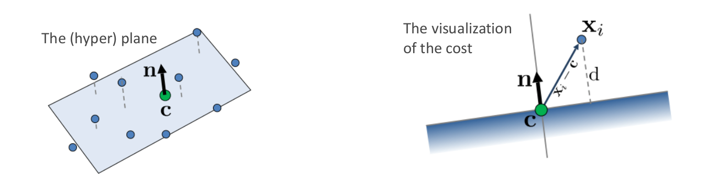

**Surface Normal Estimation – Proof**

- Since c and n are independent variables, let’s look at c first

- $$
  c^* = \underset{c}{arg\ min} \sum_{i=1}^m ((x_i - c)^T n)^2
  $$

- That means c* is the center of the data points

- $$
  \bar{x} = \frac{1}{m} \sum_{i=1}^m x_i \cdot
  $$

  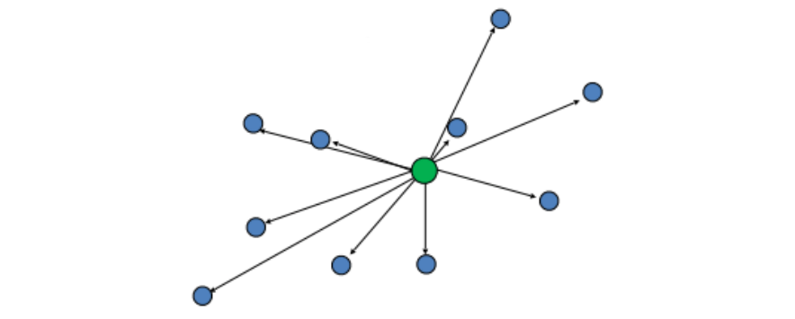

- So we normalize the data points by its center, similar to what we did in PCA proof.

- 所以我们按其中心对数据点进行归一化，类似于我们在 PCA 证明中所做的。

- $$
  \tilde{X} = [\tilde{x}_1, \cdots, \tilde{x}_m], \tilde{x}_i = x_i - \bar{x}, i = 1, \cdots, m
  $$

- Now the problem becomes,

- $$
  \underset{n \in R^n}{min}  \sum_{i=1}^m (\tilde{x}_i^T n)^2, s.t.:\|n\|_2 = 1
  $$

**What shall we do when there are noise?**

- 1.Select neighbors according to problem E.g. Radius based neighbors

  a.Radius larger -> normal estimation is smoother, but affected by irrelevant objects  正常估计更平滑，但受不相关物体影响
  b.Radius smaller -> normal estimation is sharper, but noisy  正常估计更清晰，但有噪音

- 2.Weighted based on other features

  a.Lidar intensity 激光雷达强度
  b.RGB values  RGB 值

- 3.RANSAC
  a.Lecture 4
- 4.Deep Learning!

**Weighted normal estimation**
$$
\underset{n \in R^n}{min} \sum_{i=1}^m w_i (x_i^T n)^2, s.t.:\| n\|_2 = 1  \\
W = \begin{bmatrix} w_1 & 0 & \cdots & 0 \\ 0 & w_2 & \cdots & 0 \\ \vdots & \vdots & \ddots & \vdots \\ 0 & 0 & \cdots & w_m \end{bmatrix}
$$

**Deep Learning about Surface Normal**

- Predicting Depth, Surface Normals and Semantic Labels with a Common Multi-Scale Convolutional Architecture
- 使用通用多尺度卷积架构预测深度、表面法线和语义标签
  - ICCV 2015
  - Joint estimation of depth and surface normal improves the depth result
  - 使用通用多尺度卷积架构预测深度、表面法向量和语义标签

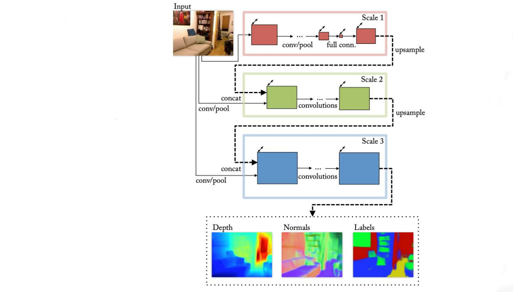

- Nesti-Net: Normal Estimation for Unstructured 3D Point Clouds using Convolutional Neural Networks
- Nesti-Net：使用卷积神经网络对非结构化 3D 点云进行正态估计
  - CVPR 2019

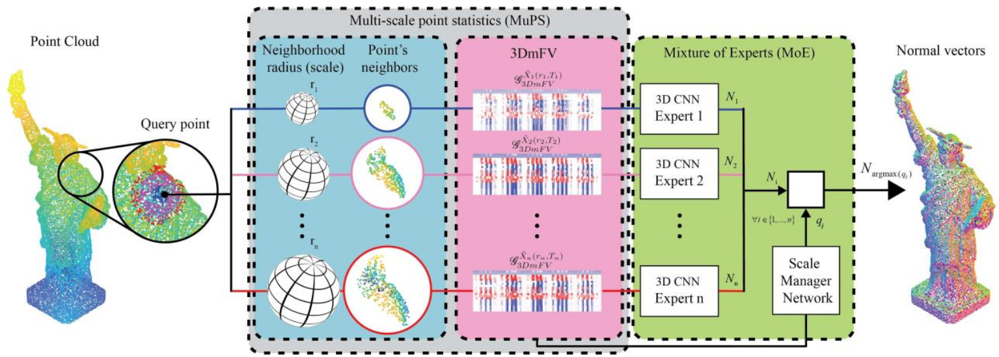

# Filters

- Noise removal  降噪
  - Radius Outlier Removal  半径异常值去除
  - Statistical Outlier Removal   统计异常值去除
- Downsampling  下采样
  - Voxel Grid Downsampling  体素网格下采样
    - Exact / Approximated 精确/近似
    - Centroid / Random Selection 质心/随机选择
  - Farthest Point Sampling 最远点采样
  - Normal Space Sampling  正常空间采样
- Upsampling / Smoothing / Noise Removal  上采样/平滑/降噪
  - Bilateral Filter 双边过滤器

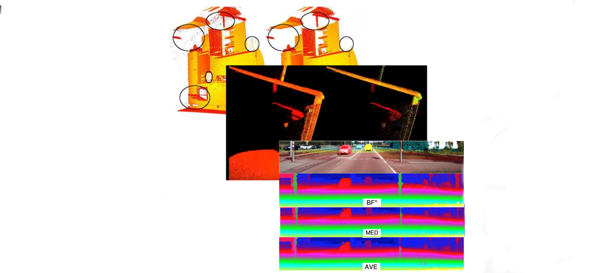

# Noise removal  降噪

## Radius Outlier Removal 半径异常值去除

- 1.For each point, find a radius = r neighborhood 对于每个点，找到一个半径=r的邻域
- 2.If number of neighbor $k < k^*$ , remove the point 如果邻居数 $k < k^*$ ，则删除该点

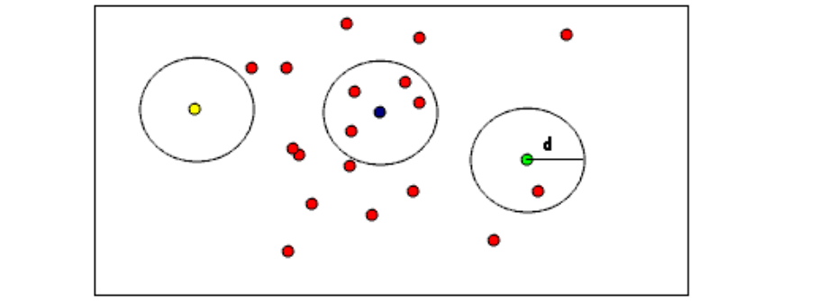

## Statistical Outlier Removal 统计异常值去除

- 1.For each point, find a neighborhood  对于每个点，找到一个邻域

- 2.Compute its distance to its neighbors  $d_{ij}, i = [1,\cdots, m], j = [1,\cdots,k]$  计算它到邻居的距离

- 3.Model the distances by Gaussian distribution $d \sim N(\mu, \sigma)$  通过高斯分布对距离建模 \

- $$
  \mu = \frac{1}{nk} \sum_{i=1}^m \sum_{j=1}^k d_{ij}, \quad \sigma = \sqrt{\frac{1}{nk} \sum_{i=1}^m \sum_{j=1}^k (d_{ij} - \mu)^2}
  $$

- 4.For each point, compute its mean distance to its neighbors 对于每个点，计算它到邻居的平均距离

- 5.Remove the point, if the mean distance is outside some confidence according to the Gaussian distribution 删除点，如果根据高斯分布，平均距离超出一些置信度

  E.g. Remove if

- $$
  \sum_{j=1}^k d_{ij} > \mu + 3\sigma \ or \  \sum_{j=1}^k d_{ij} < \mu - 3\sigma
  $$

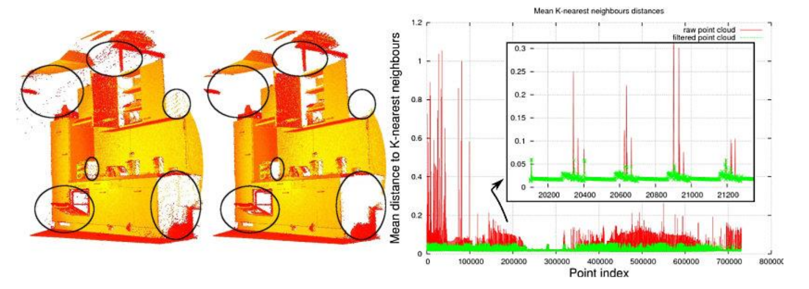

# Downsampling 下采样

## Voxel Grid Downsampling

- 1.Build a voxel grid that contains the point cloud  构建包含点云的体素网格
- 2.Take one point in each cell 在每个单元格取一分

- Q1, how to “take one point”?
- Q2, how to make it efficient?

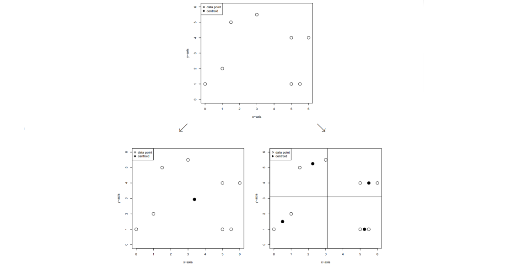

**How to “take one point” from a cell in the grid? 如何从网格中的单元格中“取一分”？**

- 1.Centroid 质心
  - a.For coordinates, compute the average in the cell 对于坐标，计算单元格中的平均值
  - b.For other attributes, voting / average 对于其他属性，投票/平均
  - c.More accurate but slower 更准确但更慢
- 2.Random select 随机选择
  - a.Randomly select a point in the cell  随机选择单元格中的一个点
  - b.Less accurate but faster  不太准确但速度更快

### Exact

- 1.Compute the min or max of the point set ${p_1,p_2, \cdots,p_N}$计算点集的最小值或最大值

- $$
  x_{max} = max(x_1,x_2,\cdots, x_N), \  x_{min} = min(x_1,x_2,\cdots, x_N), y_{max} = \cdots \cdots
  $$

- 2.Determine the voxel grid size $𝑟$ 确定体素网格大小 $𝑟$

- 3.Compute the dimension of the voxel grid 计算体素网格的维度

- $$
  D_x = (x_{max} - x_{min}) / r \\
  D_y = (y_{max} - y_{min}) / r \\
  D_z = (z_{max} - z_{min}) / r
  $$

- 4.Compute voxel index for each point 计算每个点的体素指数

- $$
  h_x = \left \lfloor (x - x_{min}) / r \right \rfloor \\
  h_y = \left \lfloor (y - y_{min} / r  \right \rfloor \\
  h_z = \left \lfloor (z - z_{min} / r \right \rfloor \\
  h = h_x + h_y * D_x + h_z * D_x * D_y
  $$

- 5.Sort the points according to the index in Step 4 根据步骤4中的索引对点进行排序

- 6.Iterate the sorted points, select points according to Centroid / Random method 0, 0, 0, 0, 3, 3, 3, 8, 8, 8, 8, 8, 8, 8, 8, …… 迭代排序后的点，根据质心/随机方法选择点

**Int32 overflow!**

- Example, 3D lidar in autonomous driving. Detection range 200m, voxel grid resolution r=0.05m, assume we crop z to be [-10, 10] 
- 例如，自动驾驶中的 3D 激光雷达。 检测范围200m，体素网格分辨率r=0.05m，假设我们裁剪z为[-10, 10]
- Dimension of the voxel grid: $(20/0.05) * (400/0.05) * (400/0.05)=2.56 \times 10^{10}$
- $2^{32} = 4.3 \times 10^9 < 2.56 \times 10^{10}$

**Strict Weak Ordering!严格弱序** 

- In cpp, the sort function in <algorithm> supports customized comparator
- 在cpp中，<algorithm>中的sort函数支持自定义比较器
- However, the comparator should follow the strict weak ordering:
- 但是，比较器应遵循严格的弱排序：

- In the voxel grid downsampling setting, the sorting comparator should be a.index < b.index, instead of a.index <= b.index
- 在体素网格下采样设置中，排序比较器应该是a.index < b.index，而不是a.index <= b.index
- Otherwise this is undefined behavior that may lead to segmentation fault
- 否则这是可能导致分段错误的未定义行为

### Approximated

- Exact voxel grid downsampling requires sorting O(N*log(N))
- 精确的体素网格下采样需要排序 O(N*log(N))
- However, in most cases, the voxel is SPARSE
- 然而，在大多数情况下，体素是稀疏的
- Image we have N=10000 points, we know after downsamling the number M < 100. (E.g, 95)
- 图像我们有 N=10000 个点，我们知道在对数字 M < 100 进行下采样后。（例如，95）
- Can we have a magic function, that maps the 10000 points into the 100 containers?
- 我们可以有一个魔法函数，将 10000 个点映射到 100 个容器中吗？
- Finally we just extract one point from the 100 containers. Ideally there will be 95 non-empty containers, and 5 empty.
- 最后我们只从 100 个容器中提取一个点。 理想情况下，将有 95 个非空容器和 5 个空容器。

**Hash Table!**

- 1.Compute the min / max of each coordinate
- 2.Determine the voxel grid size r
- 3.Compute the dimension of the voxel grid
- 4.Compute voxel index for each point 计算每个点的体素指数
- 5.Use a hash function to map each point to a container $G_i$ in  $\left \{G_1, G_2 , \cdots , G_M \right \}$ 使用散列函数将每个点映射到$\left \{G_1, G_2 , \cdots , G_M \right \}$中的容器$G_i$
- 6.Iterate   $\left \{G_1, G_2 , \cdots , G_M \right \}$ and get M point!

**That hash function is**
$$
hash(h_x, h_y, h_z) : \mathbb{R}^3 \rightarrow \mathbb{R} \\
E.g., \ hash(h_x, h_y, h_z) = (h_x + h_y * D_x + h_z * D_x * D_y) \ \% \ container\_size
$$

- The hash function is not magic, not perfect!

  - Different voxel will map into the same value 不同的体素将映射到相同的值

  - $$
    hash(h_x, h_y, h_z) = hash(h_x', h_y', h_z'), h_x \neq h_x' \ or \ h_y \neq h_y' \ or \ h_z \neq h_z'
    $$

  - Consequence: The 10000 points should fill in 95 containers, but in fact fill only 80. You are missing 15 points! 

  - 结果：10000点应该填满95个容器，但实际上只填了80个。你少了15个点！

- This is called conflict in hash table

- If you find a conflict, what do you do?
  - a.Select a point from the container
  - b.Empty that container

## Farthest Point Sampling (FPS)

- Randomly choose a point to be the first FPS point 随机选择一个点作为第一个FPS点
- Iterate until we get the desired number of points
  - a.For each point in the original point cloud, compute its distance to the nearest FPS point 
  - 对于原始点云中的每个点，计算它到最近的FPS点的距离
  - b.Choose the point with the largest value, add to FPS set
  - 选择值最大的点，加入FPS集

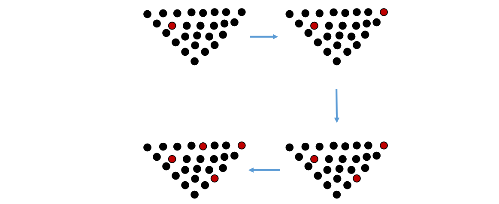

## Normal Space Sampling (NSS)

- Used in Iterative Closest Point
  - 1.Construct a set of buckets in the normal space 在普通空间构造一组桶
  - 2.Put all points into bucket according to the surface normals 根据表面法线将所有点放入桶中
  - 3.Uniformly pick points from all buckets until we have the desired number of points 统一从所有桶中选取点，直到我们得到所需的点数

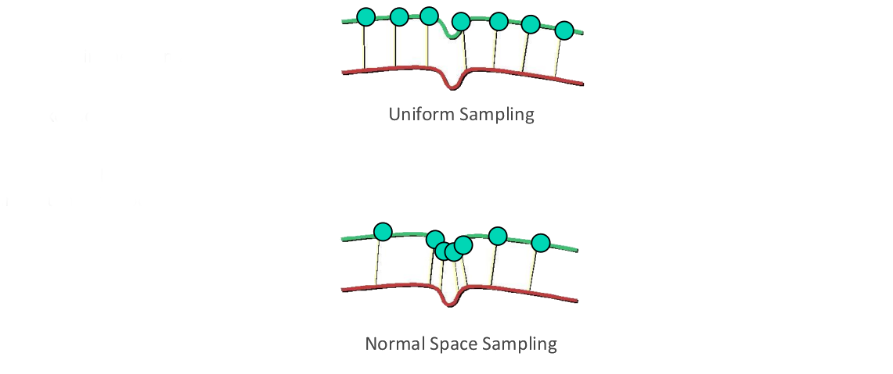

## Learning to Sample

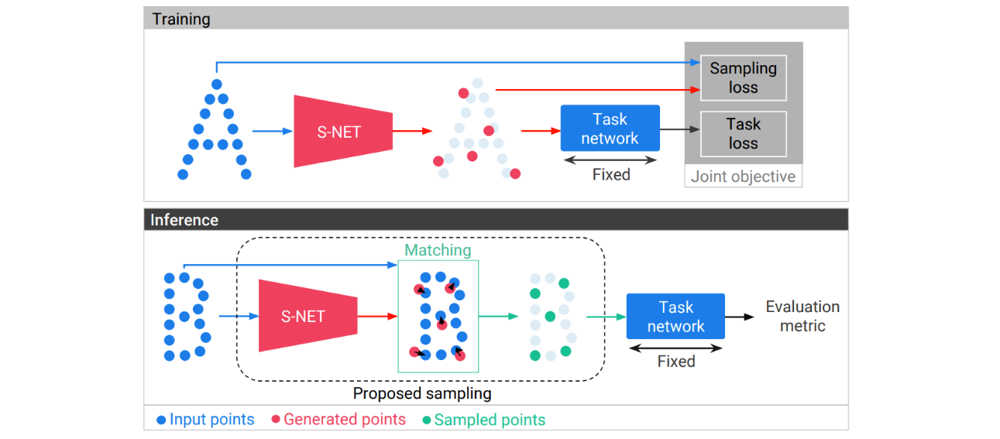

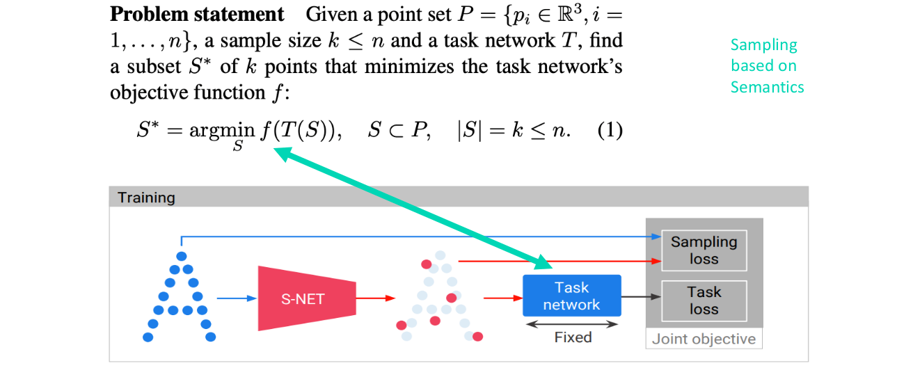

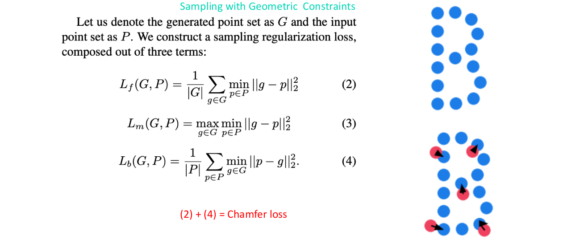

- The Learning to Sample is targeted to some specific task, e.g., Classification
- 采样学习针对某些特定任务，例如分类
- Semantics based downsampling instead of pure geometric based.
- 基于语义的下采样而不是基于纯几何的。

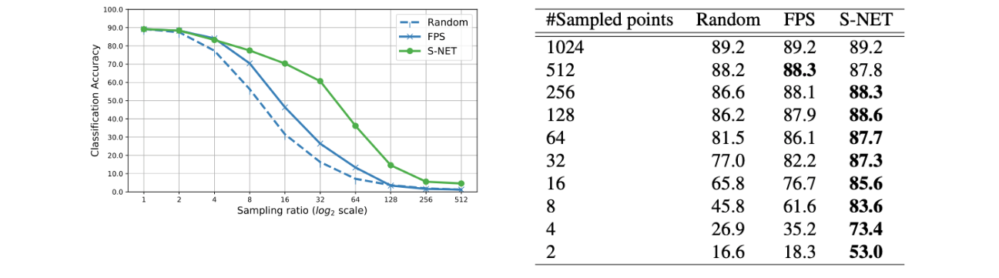

- NRE:
  - Normalized Reconstructed Error 归一化重构错误
- The output of S-Net is visually similar to that of FPS S-Net 的输出在视觉上与 FPS 相似
  - This is expected because of Chamfer loss 这是预期的，因为倒角损失

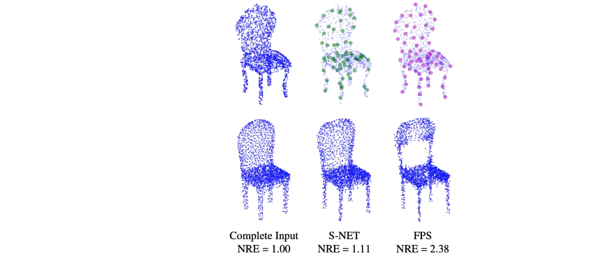

# Upsampling/Smoothing/Noise Removal 上采样/平滑/降噪

**Bilateral Filter – Gaussian Filter**

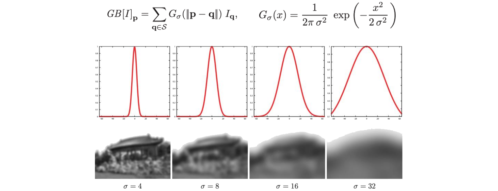

**Edge Preserving Blurring**

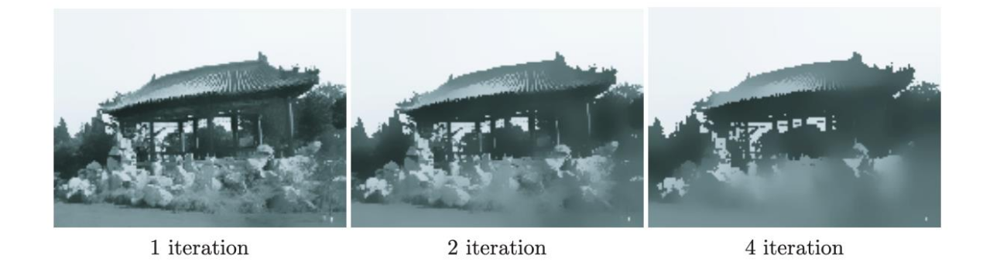

## Bilateral Filter 双边过滤器

- Given image I, for each pixel p, find its neighbor S.

- each pair (p, q)

  - Compute distance weight $𝐺_{\sigma_s}$ intensity weight $𝐺_{\sigma_r}$

  - $$
    𝐺_{\sigma} (x) = \frac{1}{2\pi \sigma^2} exp(- \frac{x^2}{2 \sigma^2})
    $$

  - Apply Bilateral Filter to get intensity of pixel p

  - $$
    BF[I]_p = \frac{1}{W_p} \sum_{q \in S} G_{\sigma_s}(\| p-q \|) G_{\sigma_r}(I_p - I_q)I_q \\
    W_p = \sum_{q \in S} G_{\sigma_s} (\|p - q\|) G_{\sigma_r}(I_p - I_q)
    $$

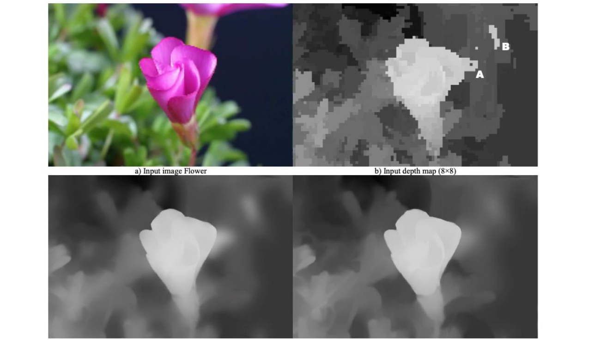

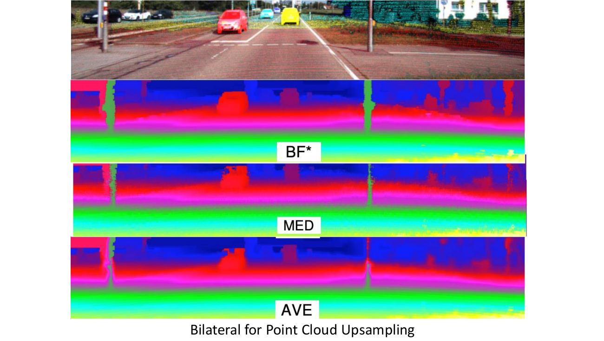

# Compulsory

- 1.Build dataset
  a.Download ModelNet40 dataset
  b.Select one point cloud from each category
- 2.Perform PCA for the 40 objects, visualize it.
- 3.Perform surface normal estimation for each point of each object, visualize it.对每个对象的每个点进行表面法线估计，并将其可视化。
- 4.Downsample each object using voxel grid downsampling (exact, both centroid & random). Visualize the results.
- 5.Write your own code, DO NOT call apis (PCL, open3d, etc.) except for visualization.使用体素网格下采样（精确，质心和随机）对每个对象进行下采样。 可视化结果。

- KITTI depth dataset
  - http://www.cvlibs.net/datasets/kitti/eval_depth_all.php
  - Download and get familiar KITTI dataset
- Perform depth upsampling / completion for the validation dataset 对验证数据集执行深度上采样/完成
  - Use whatever method you want, except Deep Learning method. 使用任何你想要的方法，深度学习方法除外。
- Evaluate the result using the evaluation code provided in the kitti-depth development kit.
- 使用 kitti-depth 开发套件中提供的评估代码评估结果。

