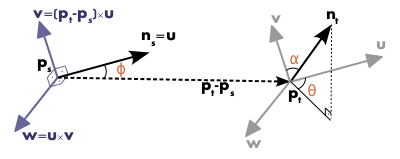

[TOC]

# PFH

As point feature representations go, surface normals and curvature estimates are somewhat basic in their representations of the geometry around a specific point. Though extremely fast and easy to compute, they cannot capture too much detail, as they approximate the geometry of a point’s k-neighborhood with only a few values. As a direct consequence, most scenes will contain many points with the same or very similar feature values, thus reducing their informative characteristics.

随着点特征表示的进行，表面法线和曲率估计在表示特定点周围的几何形状方面有些基础。 尽管计算速度极快且易于计算，但它们无法捕获太多细节，因为它们仅用几个值来近似点的 k 邻域的几何形状。 作为直接结果，大多数场景将包含许多具有相同或非常相似特征值的点，从而降低了它们的信息特征。

PFH (Point Feature Histograms) 

As a prerequisite, please go ahead and read the Estimating Surface Normals in a PointCloud tutorial first, as PFH signatures rely on both xyz 3D data as well as surface normals.

作为先决条件，请继续阅读 PointCloud 教程中的估计表面法线，因为 PFH 签名依赖于 xyz 3D 数据和表面法线。

## Theoretical primer

The goal of the **PFH** formulation is to encode a point’s k-neighborhood geometrical properties by generalizing the mean curvature around the point using a multi-dimensional histogram of values. This highly dimensional hyperspace provides an informative signature for the feature representation, is invariant to the 6D pose of the underlying surface, and copes very well with different sampling densities or noise levels present in the neighborhood.

PFH 公式的目标是通过使用值的多维直方图概括点周围的平均曲率来编码点的 k 邻域几何特性。 这种高维超空间为特征表示提供了信息签名，对底层表面的 6D 位姿不变，并且很好地应对了邻域中存在的不同采样密度或噪声水平。

A Point Feature Histogram representation is based on the relationships between the points in the k-neighborhood and their estimated surface normals. Simply put, it attempts to capture as best as possible the sampled surface variations by taking into account all the interactions between the directions of the estimated normals. **The resultant hyperspace is thus dependent on the quality of the surface normal estimations at each point.**

点特征直方图表示基于 k 邻域中的点与其估计的表面法线之间的关系。 简而言之，它试图通过考虑估计法线方向之间的所有相互作用来尽可能地捕捉采样的表面变化。 因此，生成的超空间取决于每个点的表面法线估计的质量。

The figure below presents an influence region diagram of the **PFH** computation for a query point ( $p_q$ ), marked with red and placed in the middle of a circle (sphere in 3D) with radius **r**, and all its **k** neighbors (points with distances smaller than the radius **r**) are fully interconnected in a mesh. The final **PFH** descriptor is computed as a histogram of relationships between all pairs of points in the neighborhood, and thus has a computational complexity of $O(k^2)$.

下图展示了一个查询点（$p_q$）的**PFH**计算的影响区域图，用红色标记并放置在半径为**r**的圆（3D中的球体）的中间， 并且它的所有 **k** 邻居（距离小于半径 **r** 的点）在网格中完全互连。 最终的 **PFH** 描述符被计算为邻域中所有点对之间关系的直方图，因此计算复杂度为 $O(k^2)$。


To compute the relative difference between two points $p_i$ and $p_j$ and their associated normals $n_i$ and $n_j$, we define a fixed coordinate frame at one of the points (see the figure below).

为了计算两点 $p_i$ 和 $p_j$ 及其相关法线 $n_i$ 和 $n_j$ 之间的相对差异，我们在其中一个点处定义了一个固定坐标系（见下图）。

$$
u = n_s \\
v = u \times \frac{(p_t - p_s)}{\| p_t - p_s\|_2} \\
w = u \times v
$$


Using the above **uvw** frame, the difference between the two normals $n_s$ and $n_t$ can be expressed as a set of angular features as follows:

使用上面的 **uvw** 框架，$n_s$ 和 $n_t$ 两个法线之间的差异可以表示为一组角度特征，如下所示：
$$
\alpha = v \cdot n_t \\
\phi = u \cdot \frac{(p_t - p_s)}{d} \\
\theta = \arctan(w \cdot n_t, u \cdot n_t)
$$
where **d** is the Euclidean distance between the two points $\boldsymbol{p}_s$ and $\boldsymbol{p}_t$, $d={\|\boldsymbol{p}_t-\boldsymbol{p}_s\|}_2$. The quadruplet $\langle\alpha, \phi, \theta, d\rangle$ is computed for each pair of two points in k-neighborhood, therefore reducing the 12 values (xyz and normal information) of the two points and their normals to 4.

其中 **d** 是 $\boldsymbol{p}_s$ 和 $\boldsymbol{p}_t$ 两点之间的欧几里得距离，$d={\|\boldsymbol{p}_t-\boldsymbol{p} _s\|}_2$。 四元组 $\langle\alpha, \phi, \theta, d\rangle$ 是针对 k 邻域中的每对两个点计算的，因此将两个点及其法线的 12 个值（xyz 和法线信息）减少到 4.

To estimate a **PFH** quadruplet for a pair of points, use:

要估计一对点的 **PFH** 四元组，请使用：

```
computePairFeatures (const Eigen::Vector4f &p1, const Eigen::Vector4f &n1,
                     const Eigen::Vector4f &p2, const Eigen::Vector4f &n2,
                     float &f1, float &f2, float &f3, float &f4);
```

To create the final **PFH** representation for the query point, the set of all quadruplets is binned into a histogram. The binning process divides each feature’s value range into **b** subdivisions, and counts the number of occurrences in each subinterval. Since three out of the four features presented above are measures of the angles between normals, their values can easily be normalized to the same interval on the trigonometric circle. A binning example is to divide each feature interval into the same number of equal parts, and therefore create a histogram with $b^4$ bins in a fully correlated space. In this space, a histogram bin increment corresponds to a point having certain values for all its 4 features. The figure below presents examples of Point Feature Histograms representations for different points in a cloud.

为了为查询点创建最终的 **PFH** 表示，所有四元组的集合被分箱成一个直方图。 分箱过程将每个特征的取值范围划分为**b**个细分，并统计每个子区间的出现次数。 由于上述四个特征中的三个是法线之间角度的度量，因此它们的值可以很容易地归一化为三角圆上的相同间隔。 一个 binning 示例是将每个特征区间划分为相同数量的相等部分，因此在完全相关的空间中创建一个包含 $b^4$ 个 bin 的直方图。 在这个空间中，直方图 bin 增量对应于一个点，其所有 4 个特征都具有特定值。 下图显示了云中不同点的点特征直方图表示示例。

In some cases, the fourth feature, **d**, does not present an extreme significance for 2.5D datasets, usually acquired in robotics, as the distance between neighboring points increases from the viewpoint. Therefore, omitting **d** for scans where the local point density influences this feature dimension has proved to be beneficial.

在某些情况下，随着相邻点之间的距离从视点增加，第四个特征**d** 对于通常在机器人技术中获得的 2.5D 数据集并不具有极端意义。 因此，在局部点密度影响该特征维度的扫描中省略 **d** 已被证明是有益的。


> For more information and mathematical derivations, including an analysis of **PFH** signatures for different surface geometries please see [[RusuDissertation\]](https://pcl.readthedocs.io/projects/tutorials/en/master/how_features_work.html#rusudissertation).

## Estimating **PFH** features

Point Feature Histograms are implemented in PCL as part of the [pcl_features](http://docs.pointclouds.org/trunk/a02944.html) library.

The default **PFH** implementation uses 5 binning subdivisions (e.g., each of the four feature values will use this many bins from its value interval), and does not include the distances (as explained above – although the **computePairFeatures** method can be called by the user to obtain the distances too, if desired) which results in a 125-byte array ($5^3$) of float values. These are stored in a **pcl::PFHSignature125** point type.

默认的 **PFH** 实现使用 5 个 binning 细分（例如，四个特征值中的每一个都将使用其值区间中的这么多个 bin），并且不包括距离（如上所述 - 尽管 **computePairFeatures** 如果需要，用户也可以调用方法来获取距离），这会产生一个 125 字节数组 ($5^3$) 的浮点值。 这些存储在 **pcl::PFHSignature125** 点类型中。

The following code snippet will estimate a set of **PFH** features for all the points in the input dataset.

```
#include <pcl/point_types.h>
#include <pcl/features/pfh.h>

{
  pcl::PointCloud<pcl::PointXYZ>::Ptr cloud (new pcl::PointCloud<pcl::PointXYZ>);
  pcl::PointCloud<pcl::Normal>::Ptr normals (new pcl::PointCloud<pcl::Normal> ());

  ... read, pass in or create a point cloud with normals ...
  ... (note: you can create a single PointCloud<PointNormal> if you want) ...

  // Create the PFH estimation class, and pass the input dataset+normals to it
  pcl::PFHEstimation<pcl::PointXYZ, pcl::Normal, pcl::PFHSignature125> pfh;
  pfh.setInputCloud (cloud);
  pfh.setInputNormals (normals);
  // alternatively, if cloud is of tpe PointNormal, do pfh.setInputNormals (cloud);

  // Create an empty kdtree representation, and pass it to the PFH estimation object.
  // Its content will be filled inside the object, based on the given input dataset (as no other search surface is given).
  pcl::search::KdTree<pcl::PointXYZ>::Ptr tree (new pcl::search::KdTree<pcl::PointXYZ> ());
  //pcl::KdTreeFLANN<pcl::PointXYZ>::Ptr tree (new pcl::KdTreeFLANN<pcl::PointXYZ> ()); -- older call for PCL 1.5-
  pfh.setSearchMethod (tree);

  // Output datasets
  pcl::PointCloud<pcl::PFHSignature125>::Ptr pfhs (new pcl::PointCloud<pcl::PFHSignature125> ());

  // Use all neighbors in a sphere of radius 5cm
  // IMPORTANT: the radius used here has to be larger than the radius used to estimate the surface normals!!!
  pfh.setRadiusSearch (0.05);

  // Compute the features
  pfh.compute (*pfhs);

  // pfhs->size () should have the same size as the input cloud->size ()*
}
```

The actual **compute** call from the ***\*PFH\**Estimation** class does nothing internally but:

来自 PFHEstimation 类的实际计算调用在内部什么都不做，但是：

```
for each point p in cloud P

  1. get the nearest neighbors of p

  2. for each pair of neighbors, compute the three angular values

  3. bin all the results in an output histogram
```

To compute a single **PFH** representation from a k-neighborhood, use:

```
computePointPFHSignature (const pcl::PointCloud<PointInT> &cloud,
                          const pcl::PointCloud<PointNT> &normals,
                          const std::vector<int> &indices,
                          int nr_split,
                          Eigen::VectorXf &pfh_histogram);
```

Where *cloud* is the input point cloud that contains the points, *normals* is the input point cloud that contains the normals (could be equal to cloud if *PointInT=PointNT=PointNormal*), *indices* represents the set of k-nearest neighbors from *cloud*, *nr_split* is the number of subdivisions to use for the binning process for each feature interval, and ***pfh**_histogram* is the output resultant histogram as an array of float values.

其中*cloud*是包含点的输入点云，*normals*是包含法线的输入点云（如果*PointInT=PointNT=PointNormal*，则可能等于cloud），*indices*表示k的集合 - 来自 *cloud* 的最近邻，*nr_split* 是用于每个特征间隔的分箱过程的细分数，***pfh**_histogram* 是作为浮点值数组的输出结果直方图。

> For efficiency reasons, the **compute** method in ***\*PFH\**Estimation** does not check if the normals contain NaN or infinite values. Passing such values to **compute()** will result in undefined output. It is advisable to check the normals, at least during the design of the processing chain or when setting the parameters. This can be done by inserting the following code before the call to **compute()**:
>
> 出于效率原因，***\*PFH\**Estimation** 中的 **compute** 方法不检查法线是否包含 NaN 或无穷大值。 将这些值传递给 **compute()** 将导致未定义的输出。 建议至少在处理链设计期间或设置参数时检查法线。 这可以通过在调用 **compute()** 之前插入以下代码来完成：
>
> ```
> for (int i = 0; i < normals->size(); i++)
> {
>   if (!pcl::isFinite<pcl::Normal>((*normals)[i]))
>   {
>     PCL_WARN("normals[%d] is not finite\n", i);
>   }
> }
> ```
>
> In production code, preprocessing steps and parameters should be set so that normals are finite or raise an error.
>
> 在生产代码中，应设置预处理步骤和参数，以使法线是有限的或引发错误。

# FPFH

Fast Point Feature Histograms (**FPFH**) descriptors

The theoretical computational complexity of the Point Feature Histogram for a given point cloud $P$ with $n$ points is $O(nk^2)$, where $k$ is the number of neighbors for each point $p$ in $P$. For real-time or near real-time applications, the computation of Point Feature Histograms in dense point neighborhoods can represent one of the major bottlenecks.

给定点云 $P$ 的点特征直方图的理论计算复杂度为 $O(nk^2)$，其中 $k$ 是 $P$ 中每个点 $p$ 的邻居数。对于实时或近实时应用，密集点邻域中点特征直方图的计算可能是主要瓶颈之一。

## Theoretical primer

To simplify the histogram feature computation, we proceed as follows:

- in a first step, for each query point $p_q$ a set of tuples $\alpha, \phi, \theta$ between itself and its neighbors are computed as described in [Point Feature Histograms (PFH) descriptors](https://pcl.readthedocs.io/projects/tutorials/en/master/pfh_estimation.html#pfh-estimation) - this will be called the Simplified Point Feature Histogram (SPFH);
- 在第一步中，对于每个查询点 $p_q$，按照 点特征直方图 (PFH) 描述符 - 这将被称为简化点特征直方图（SPFH）；
- in a second step, for each point its $k$ neighbors are re-determined, and the neighboring SPFH values are used to weight the final histogram of $p_q$ (called **FPFH**) as follows:
- 在第二步中，对于每个点，它的 $k$ 邻居被重新确定，并且相邻的 SPFH 值用于加权 $p_q$（称为 **FPFH**）的最终直方图，如下所示：

$$
FPFH(p_q) = SPFH(p_q) + \frac{1}{k} \sum_{i=1}^k \frac{1}{\omega_i} \cdot SPFH(p_i)
$$

where the weight $\omega_i$ represents a distance between the query point $p_q$  and a neighbor point $p_i$ in some given metric space, thus scoring the ($p_q, p_i$) pair, but could just as well be selected as a different measure if necessary. To understand the importance of this weighting scheme, the figure below presents the influence region diagram for a k-neighborhood set centered at $p_q$.

其中权重 $\omega_i$ 表示在某个给定度量空间中查询点 $p_q$ 和相邻点 $p_i$ 之间的距离，因此对 ($p_q, p_i$) 对进行评分，但也可以选择为 必要时采取不同的措施。 为了理解这种加权方案的重要性，下图展示了以 $p_q$ 为中心的 k 邻域集的影响区域图。


Thus, for a given query point $p_q$, the algorithm first estimates its SPFH values by creating pairs between itself and its neighbors (illustrated using red lines). This is repeated for all the points in the dataset, followed by a re-weighting of the SPFH values of $p_q$ using the SPFH values of its $k$ neighbors, thus creating the FPFH for $p_q$. The extra FPFH connections, resultant due to the additional weighting scheme, are shown with black lines. As the diagram shows, some of the value pairs will be counted twice (marked with thicker lines in the figure).

因此，对于给定的查询点 $p_q$，该算法首先通过在其自身与其邻居之间创建对来估计其 SPFH 值（用红线说明）。 对数据集中的所有点重复此操作，然后使用其 $k$ 邻居的 SPFH 值重新加权 $p_q$ 的 SPFH 值，从而为 $p_q$ 创建 FPFH。 由于额外的加权方案而产生的额外 FPFH 连接用黑线显示。 如图所示，一些值对将被计算两次（图中用粗线标记）。

## Differences between PFH and FPFH

The main differences between the PFH and FPFH formulations are summarized below:

- 1.the FPFH does not fully interconnect all neighbors of $p_q$ as it can be seen from the figure, and is thus missing some value pairs which might contribute to capture the geometry around the query point;
- 1.从图中可以看出，FPFH 没有完全互连 $p_q$ 的所有邻居，因此缺少一些可能有助于捕获查询点周围几何的值对；
- 2.the PFH models a precisely determined surface around the query point, while the FPFH includes additional point pairs outside the **r** radius sphere (though at most **2r** away);
- 2.PFH在查询点周围建模一个精确确定的表面，而FPFH包括**r**半径球外的附加点对（尽管最多**2r**距离）；
- 3.because of the re-weighting scheme, the FPFH combines SPFH values and recaptures some of the point neighboring value pairs;
- 3.由于重加权方案，FPFH结合SPFH值，重新捕获部分点邻值对；
- 4.the overall complexity of FPFH is greatly reduced, thus making possible to use it in real-time applications;
- 4.FPFH的整体复杂度大大降低，从而可以在实时应用中使用它；
- 5.the resultant histogram is simplified by decorrelating the values, that is simply creating *d* separate feature histograms, one for each feature dimension, and concatenate them together (see figure below).
- 5.通过对值进行去相关来简化生成的直方图，即简单地创建 *d* 单独的特征直方图，每个特征维度一个，并将它们连接在一起（见下图）。


## Estimating FPFH features

Fast Point Feature Histograms are implemented in PCL as part of the [pcl_features](http://docs.pointclouds.org/trunk/a02944.html) library.

The default FPFH implementation uses 11 binning subdivisions (e.g., each of the four feature values will use this many bins from its value interval), and a decorrelated scheme (see above: the feature histograms are computed separately and concantenated) which results in a 33-byte array of float values. These are stored in a **pcl::FPFHSignature33** point type.

默认的 FPFH 实现使用 11 个 binning 细分（例如，四个特征值中的每一个都将使用其值区间中的这么多个 bin）和一个去相关方案（见上文：特征直方图是单独计算并连接的），结果是 33 -byte 浮点值数组。 这些存储在 **pcl::FPFHSignature33** 点类型中。

The following code snippet will estimate a set of FPFH features for all the points in the input dataset.

```C++
#include <pcl/point_types.h>
#include <pcl/features/fpfh.h>

{
  pcl::PointCloud<pcl::PointXYZ>::Ptr cloud (new pcl::PointCloud<pcl::PointXYZ>);
  pcl::PointCloud<pcl::Normal>::Ptr normals (new pcl::PointCloud<pcl::Normal> ());

  ... read, pass in or create a point cloud with normals ...
  ... (note: you can create a single PointCloud<PointNormal> if you want) ...

  // Create the FPFH estimation class, and pass the input dataset+normals to it
  pcl::FPFHEstimation<pcl::PointXYZ, pcl::Normal, pcl::FPFHSignature33> fpfh;
  fpfh.setInputCloud (cloud);
  fpfh.setInputNormals (normals);
  // alternatively, if cloud is of tpe PointNormal, do fpfh.setInputNormals (cloud);

  // Create an empty kdtree representation, and pass it to the FPFH estimation object.
  // Its content will be filled inside the object, based on the given input dataset (as no other search surface is given).
  pcl::search::KdTree<PointXYZ>::Ptr tree (new pcl::search::KdTree<PointXYZ>);

  fpfh.setSearchMethod (tree);

  // Output datasets
  pcl::PointCloud<pcl::FPFHSignature33>::Ptr fpfhs (new pcl::PointCloud<pcl::FPFHSignature33> ());

  // Use all neighbors in a sphere of radius 5cm
  // IMPORTANT: the radius used here has to be larger than the radius used to estimate the surface normals!!!
  fpfh.setRadiusSearch (0.05);

  // Compute the features
  fpfh.compute (*fpfhs);

  // fpfhs->size () should have the same size as the input cloud->size ()*
}
```

The actual **compute** call from the **FPFHEstimation** class does nothing internally but:

来自 FPFHEstimation 类的实际计算调用在内部什么都不做，但是：

```
for each point p in cloud P

  1. pass 1:

     1. get the nearest neighbors of :math:`p`

     2. for each pair of :math:`p, p_i` (where :math:`p_i` is a neighbor of :math:`p`, compute the three angular values

     3. bin all the results in an output SPFH histogram

  2. pass 2:

     1. get the nearest neighbors of :math:`p`

     3. use each SPFH of :math:`p` with a weighting scheme to assemble the FPFH of :math:`p`:
```

> For efficiency reasons, the **compute** method in **FPFHEstimation** does not check if the normals contains NaN or infinite values. Passing such values to **compute()** will result in undefined output. It is advisable to check the normals, at least during the design of the processing chain or when setting the parameters. This can be done by inserting the following code before the call to **compute()**:
>
> 出于效率原因，FPFHEstimation 中的计算方法不检查法线是否包含 NaN 或无穷大值。 将这些值传递给 compute() 将导致未定义的输出。 建议至少在处理链设计期间或设置参数时检查法线。 这可以通过在调用 compute() 之前插入以下代码来完成：
>
> ```
> for (int i = 0; i < normals->size(); i++)
> {
>   if (!pcl::isFinite<pcl::Normal>((*normals)[i]))
>   {
>     PCL_WARN("normals[%d] is not finite\n", i);
>   }
> }
> ```
>
> In production code, preprocessing steps and parameters should be set so that normals are finite or raise an error.
>
> 在生产代码中，应设置预处理步骤和参数，以使法线是有限的或引发错误。

## Speeding FPFH with OpenMP

For the speed-savvy users, PCL provides an additional implementation of FPFH estimation which uses multi-core/multi-threaded paradigms using OpenMP to speed the computation. The name of the class is **pcl::FPFHEstimationOMP**, and its API is 100% compatible to the single-threaded **pcl::FPFHEstimation**, which makes it suitable as a drop-in replacement. On a system with 8 cores, you should get anything between 6-8 times faster computation times.

对于精通速度的用户，PCL 提供了 FPFH 估计的附加实现，它使用多核/多线程范式，使用 OpenMP 来加速计算。 类的名称是 **pcl::FPFHEstimationOMP**，其 API 与单线程 **pcl::FPFHEstimation** 100% 兼容，这使其适合作为替代品。 在具有 8 个内核的系统上，您应该获得快 6-8 倍的计算时间。


