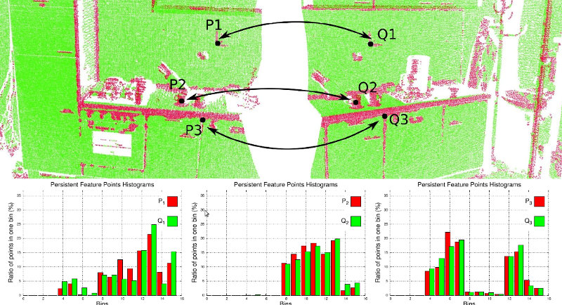
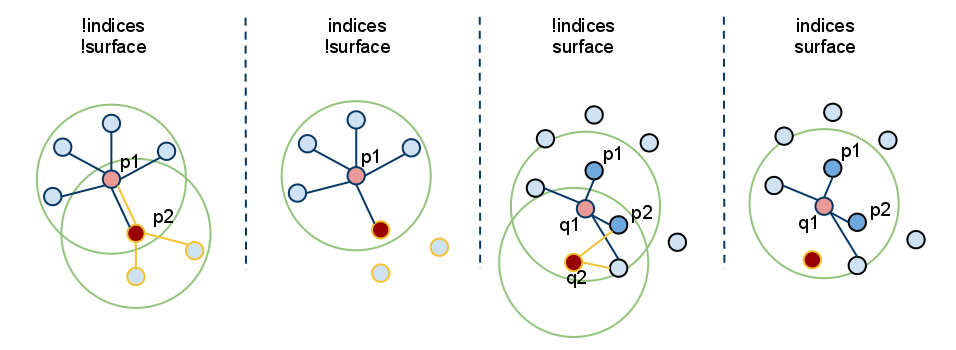

[TOC]

# Theoretical primer

In their native representation, **points** as defined in the concept of 3D mapping systems are simply represented using their Cartesian coordinates x, y, z, with respect to a given origin. Assuming that the origin of the coordinate system does not change over time, there could be two points p1 and p2 , acquired at t1 and t2 , having the same coordinates. Comparing these points however is an ill-posed problem, because even though they are equal with respect to some distance measure (e.g. Euclidean metric), they could be sampled on completely different surfaces, and thus represent totally different information when taken together with the other surrounding points in their vicinity. That is because there are no guarantees that the world has not changed between t1 and t2. Some acquisition devices might provide extra information for a sampled point, such as an intensity or surface remission value, or even a color, however that does not solve the problem completely and the comparison remains ambiguous.

在它们的原生表示中，在 3D 映射系统的概念中定义的**点**简单地使用它们相对于给定原点的笛卡尔坐标 x、y、z 来表示。假设坐标系的原点不随时间改变，则在 t1 和 t2 处获取的两个点 p1 和 p2 可能具有相同的坐标。然而，比较这些点是一个不适定的问题，因为即使它们在某些距离度量（例如欧几里得度量）方面是相等的，它们也可以在完全不同的表面上进行采样，因此当它们与其他点一起使用时代表完全不同的信息他们附近的周围点。那是因为不能保证世界在 t1 和 t2 之间没有变化。一些采集设备可能会为采样点提供额外的信息，例如强度或表面反射率值，甚至颜色，但这并不能完全解决问题，并且比较仍然模棱两可。

Applications which need to compare points for various reasons require better characteristics and metrics to be able to distinguish between geometric surfaces. The concept of a 3D point as a singular entity with Cartesian coordinates therefore disappears, and a new concept, that of **local descriptor** takes its place. The literature is abundant of different naming schemes describing the same conceptualization, such as **shape descriptors** or **geometric features** but for the remaining of this document they will be referred to as **point feature representations.**

由于各种原因需要比较点的应用程序需要更好的特征和度量来区分几何表面。 因此，3D 点作为具有笛卡尔坐标的奇异实体的概念消失了，取而代之的是一个新的概念，即**局部描述符**。 文献中有大量描述相同概念的不同命名方案，例如**形状描述符**或**几何特征**，但对于本文档的其余部分，它们将被称为**点特征表示。**

By including the surrounding neighbors, the underlying sampled surface geometry can be inferred and captured in the feature formulation, which contributes to solving the ambiguity comparison problem. Ideally, the resultant features would be very similar (with respect to some metric) for points residing on the same or similar surfaces, and different for points found on different surfaces, as shown in the figure below. A **good** point feature representation distinguishes itself from a **bad** one, by being able to capture the same local surface characteristics in the presence of:

通过包括周围的邻居，可以在特征公式中推断和捕获底层的采样表面几何形状，这有助于解决模糊比较问题。 理想情况下，对于位于相同或相似表面上的点，结果特征将非常相似（相对于某些度量），而对于不同表面上的点，结果特征将是不同的，如下图所示。 **好的**点特征表示与**差**的特征表示不同，因为它能够在以下情况下捕获相同的局部表面特征：

- **rigid transformations** - that is, 3D rotations and 3D translations in the data should not influence the resultant feature vector F estimation;即数据中的 3D 旋转和 3D 平移不应影响结果特征向量 F 估计；
- **varying sampling density** - in principle, a local surface patch sampled more or less densely should have the same feature vector signature;原则上，或多或少密集采样的局部表面补丁应该具有相同的特征向量签名；
- **noise** - the point feature representation must retain the same or very similar values in its feature vector in the presence of mild noise in the data.在数据中存在轻微噪声的情况下，点特征表示必须在其特征向量中保留相同或非常相似的值。



In general, PCL features use approximate methods to compute the nearest neighbors of a query point, using fast kd-tree queries. There are two types of queries that we’re interested in:

- determine the **k** (user given parameter) neighbors of a query point (also known as *k-search*);
- determine **all the neighbors** of a query point within a sphere of radius **r** (also known as *radius-search*).

# Terminology

For the remainder of this article, we will make certain abbreviations and introduce certain notations, to simplify the in-text explanations. Please see the table below for a reference on each of the terms used.

abbreviations and introduce 缩写和介绍

| term     | explanation     |
| ---- | ---- |
| Foo | a class named Foo |
| FooPtr | a shared pointer to a class Foo,   e.g., shared_ptr<Foo> |
| FooConstPtr | a const shared pointer to a class Foo,   e.g., const shared_ptr<const Foo> |

# How to pass the input

As almost all classes in PCL that inherit from the base pcl::PCLBase class, the pcl::Feature class accepts input data in two different ways:

- 1.an entire point cloud dataset, given via **setInputCloud (PointCloudConstPtr &)** - **mandatory**
  Any feature estimation class will attempt to estimate a feature at **every** point in the given input cloud.

  任何特征估计类都将尝试估计给定输入云中**每个**点的特征。

- 2.a subset of a point cloud dataset, given via **setInputCloud (PointCloudConstPtr &)** and **setIndices (IndicesConstPtr &)** - **optional**
  Any feature estimation class will attempt to estimate a feature at every point in the given input cloud that has an index in the given indices list. By default, if no set of indices is given, all points in the cloud will be considered.k

  任何特征估计类都将尝试估计给定输入云中每个点处的特征，该特征在给定索引列表中具有索引。 默认情况下，如果没有给出一组索引，则将考虑云中的所有点。

In addition, the set of point neighbors to be used, can be specified through an additional call, **setSearchSurface (PointCloudConstPtr &)**. This call is optional, and when the search surface is not given, the input point cloud dataset is used instead by default.

此外，要使用的点邻居集可以通过附加调用 setSearchSurface (PointCloudConstPtr &) 来指定。 该调用是可选的，当没有给出搜索表面时，默认使用输入点云数据集。

Because **setInputCloud()** is always required, there are up to four combinations that we can create using *<setInputCloud(), setIndices(), setSearchSurface()>*. Say we have two point clouds, P={p_1, p_2, …p_n} and Q={q_1, q_2, …, q_n}. The image below presents all four cases:



**setIndices() = false, setSearchSurface() = false** - this is without a doubt the most used case in PCL, where the user is just feeding in a single PointCloud dataset and expects a certain feature estimated at *all the points in the cloud*.

毫无疑问，这是 PCL 中最常用的情况，其中用户只是输入单个 PointCloud 数据集，并期望在*云中的所有点*估计某个特征。

Since we do not expect to maintain different implementation copies based on whether a set of indices and/or the search surface is given, whenever **indices = false**, PCL creates a set of internal indices (as a std::vector<int>) that basically point to the entire dataset (indices=1..N, where N is the number of points in the cloud).

由于我们不希望根据是否给出一组索引和/或搜索表面来维护不同的实现副本，因此每当索引 = false 时，PCL 创建一组内部索引（作为 std::vector<int>） 基本上指向整个数据集（索引=1..N，其中 N 是云中的点数）。

**setIndices() = true, setSearchSurface() = false** - as previously mentioned, the feature estimation method will only compute features for those points which have an index in the given indices vector;如前所述，特征估计方法将只计算那些在给定索引向量中有索引的点的特征；

In the figure above, this corresponds to the second case. Here, we assume that p_2’s index is not part of the indices vector given, so no neighbors or features will be estimated at p2.

**setIndices() = false, setSearchSurface() = true** - as in the first case, features will be estimated for all points given as input, but, the underlying neighboring surface given in **setSearchSurface()** will be used to obtain nearest neighbors for the input points, rather than the input cloud itself;与第一种情况一样，将为作为输入的所有点估计特征，但是，**setSearchSurface()** 中给出的底层相邻表面将用于获取输入点的最近邻居，而不是输入点云本身 ;

In the figure above, this corresponds to the third case. If Q={q_1, q_2} is another cloud given as input, different than P, and P is the search surface for Q, then the neighbors of q_1 and q_2 will be computed from P.在上图中，这对应于第三种情况。 如果 Q={q_1, q_2} 是另一个作为输入的云，不同于 P，并且 P 是 Q 的搜索表面，那么 q_1 和 q_2 的邻居将从 P 计算。

**setIndices() = true, setSearchSurface() = true** - this is probably the rarest case, where both indices and a search surface is given. In this case, features will be estimated for only a subset from the <input, indices> pair, using the search surface information given in **setSearchSurface()**.这可能是最罕见的情况，同时给出了索引和搜索表面。 在这种情况下，将使用 setSearchSurface() 中给出的搜索表面信息，仅对 <input, indices> 对中的一个子集进行特征估计。

Finally, in the figure above, this corresponds to the last (rightmost) case. Here, we assume that q_2’s index is not part of the indices vector given for Q, so no neighbors or features will be estimated at q2.最后，在上图中，这对应于最后（最右边）的情况。 在这里，我们假设 q_2 的索引不是给定 Q 的索引向量的一部分，因此不会在 q2 处估计任何邻居或特征。

The most useful example when **setSearchSurface()** should be used, is when we have a very dense input dataset, but we do not want to estimate features at all the points in it, but rather at some keypoints discovered using the methods in pcl_keypoints, or at a downsampled version of the cloud (e.g., obtained using a pcl::VoxelGrid<T> filter). In this case, we pass the downsampled/keypoints input via **setInputCloud()**, and the original data as **setSearchSurface()**.

应该使用 setSearchSurface() 时最有用的示例是，当我们有一个非常密集的输入数据集，但我们不想估计其中所有点的特征，而是使用 pcl_keypoints 中的方法发现的一些关键点，或者 在云的下采样版本（例如，使用 pcl::VoxelGrid<T> 过滤器获得）。 在这种情况下，我们通过 setInputCloud() 传递下采样/关键点输入，并将原始数据作为 setSearchSurface() 传递。

# An example for normal estimation

Once determined, the neighboring points of a query point can be used to estimate a local feature representation that captures the geometry of the underlying sampled surface around the query point. An important problem in describing the geometry of the surface is to first infer its orientation in a coordinate system, that is, estimate its normal. Surface normals are important properties of a surface and are heavily used in many areas such as computer graphics applications to apply the correct light sources that generate shadings and other visual effects.

一旦确定，查询点的相邻点可用于估计局部特征表示，该表示捕获查询点周围的基础采样表面的几何形状。 描述表面几何的一个重要问题是首先推断它在坐标系中的方向，即估计它的法线。 表面法线是表面的重要属性，在许多领域中被大量使用，例如计算机图形应用程序，以应用正确的光源来生成阴影和其他视觉效果

The following code snippet will estimate a set of surface normals for all the points in the input dataset.

```C++
#include <pcl/point_types.h>
#include <pcl/features/normal_3d.h>

{
  pcl::PointCloud<pcl::PointXYZ>::Ptr cloud (new pcl::PointCloud<pcl::PointXYZ>);

  ... read, pass in or create a point cloud ...

  // Create the normal estimation class, and pass the input dataset to it
  pcl::NormalEstimation<pcl::PointXYZ, pcl::Normal> ne;
  ne.setInputCloud (cloud);

  // Create an empty kdtree representation, and pass it to the normal estimation object.
  // Its content will be filled inside the object, based on the given input dataset (as no other search surface is given).
  pcl::search::KdTree<pcl::PointXYZ>::Ptr tree (new pcl::search::KdTree<pcl::PointXYZ> ());
  ne.setSearchMethod (tree);

  // Output datasets
  pcl::PointCloud<pcl::Normal>::Ptr cloud_normals (new pcl::PointCloud<pcl::Normal>);

  // Use all neighbors in a sphere of radius 3cm
  ne.setRadiusSearch (0.03);

  // Compute the features
  ne.compute (*cloud_normals);

  // cloud_normals->size () should have the same size as the input cloud->size ()
}
```

The following code snippet will estimate a set of surface normals for a subset of the points in the input dataset.以下代码片段将为输入数据集中的点子集估计一组表面法线。

```C++
#include <pcl/point_types.h>
#include <pcl/features/normal_3d.h>

{
  pcl::PointCloud<pcl::PointXYZ>::Ptr cloud (new pcl::PointCloud<pcl::PointXYZ>);

  ... read, pass in or create a point cloud ...

  // Create a set of indices to be used. For simplicity, we're going to be using the first 10% of the points in cloud
  std::vector<int> indices (std::floor (cloud->size () / 10));
  for (std::size_t i = 0; i < indices.size (); ++i) indices[i] = i;

  // Create the normal estimation class, and pass the input dataset to it
  pcl::NormalEstimation<pcl::PointXYZ, pcl::Normal> ne;
  ne.setInputCloud (cloud);

  // Pass the indices
  pcl::shared_ptr<std::vector<int> > indicesptr (new std::vector<int> (indices));
  ne.setIndices (indicesptr);

  // Create an empty kdtree representation, and pass it to the normal estimation object.
  // Its content will be filled inside the object, based on the given input dataset (as no other search surface is given).
  pcl::search::KdTree<pcl::PointXYZ>::Ptr tree (new pcl::search::KdTree<pcl::PointXYZ> ());
  ne.setSearchMethod (tree);

  // Output datasets
  pcl::PointCloud<pcl::Normal>::Ptr cloud_normals (new pcl::PointCloud<pcl::Normal>);

  // Use all neighbors in a sphere of radius 3cm
  ne.setRadiusSearch (0.03);

  // Compute the features
  ne.compute (*cloud_normals);

  // cloud_normals->size () should have the same size as the input indicesptr->size ()
}
```

Finally, the following code snippet will estimate a set of surface normals for all the points in the input dataset, but will estimate their nearest neighbors using another dataset. As previously mentioned, a good usecase for this is when the input is a downsampled version of the surface.

最后，以下代码片段将为输入数据集中的所有点估计一组表面法线，但将使用另一个数据集估计它们的最近邻居。 如前所述，一个很好的用例是输入是表面的下采样版本。

```C++
#include <pcl/point_types.h>
#include <pcl/features/normal_3d.h>

{
  pcl::PointCloud<pcl::PointXYZ>::Ptr cloud (new pcl::PointCloud<pcl::PointXYZ>);
  pcl::PointCloud<pcl::PointXYZ>::Ptr cloud_downsampled (new pcl::PointCloud<pcl::PointXYZ>);

  ... read, pass in or create a point cloud ...

  ... create a downsampled version of it ...

  // Create the normal estimation class, and pass the input dataset to it
  pcl::NormalEstimation<pcl::PointXYZ, pcl::Normal> ne;
  ne.setInputCloud (cloud_downsampled);

  // Pass the original data (before downsampling) as the search surface
  ne.setSearchSurface (cloud);

  // Create an empty kdtree representation, and pass it to the normal estimation object.
  // Its content will be filled inside the object, based on the given surface dataset.
  pcl::search::KdTree<pcl::PointXYZ>::Ptr tree (new pcl::search::KdTree<pcl::PointXYZ> ());
  ne.setSearchMethod (tree);

  // Output datasets
  pcl::PointCloud<pcl::Normal>::Ptr cloud_normals (new pcl::PointCloud<pcl::Normal>);

  // Use all neighbors in a sphere of radius 3cm
  ne.setRadiusSearch (0.03);

  // Compute the features
  ne.compute (*cloud_normals);

  // cloud_normals->size () should have the same size as the input cloud_downsampled->size ()
}
```


