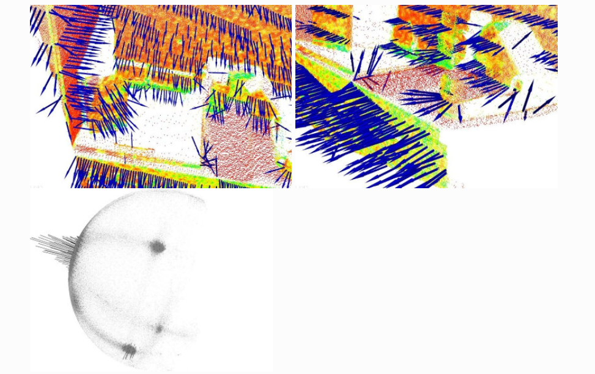
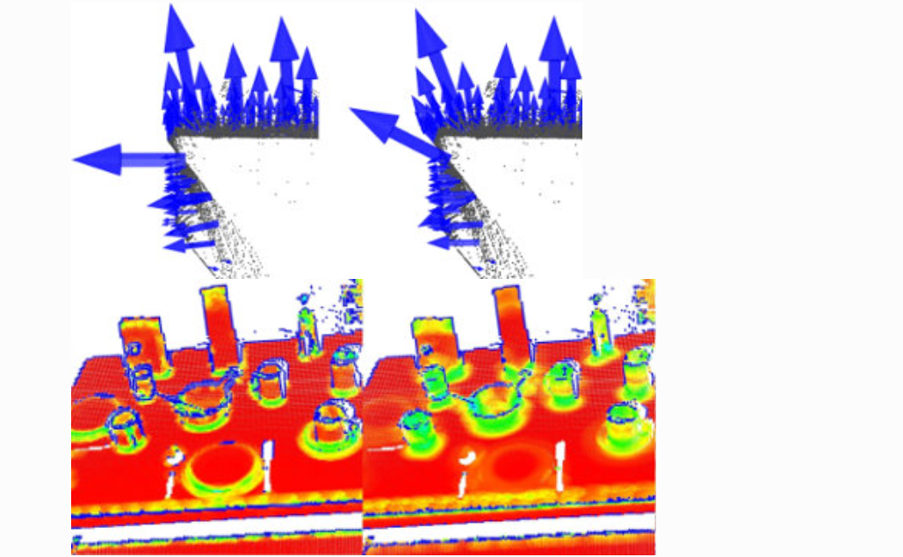

[TOC]

Given a geometric surface, it’s usually trivial to infer the direction of the normal at a certain point on the surface as the vector perpendicular to the surface at that point. However, since the point cloud datasets that we acquire represent a set of point samples on the real surface, there are two possibilities:

给定一个几何曲面，通常很容易将曲面上某个点的法线方向推断为垂直于该点曲面的向量。 但是，由于我们获取的点云数据集代表了真实表面上的一组点样本，因此有两种可能性：

- obtain the underlying surface from the acquired point cloud dataset, using surface meshing techniques, and then compute the surface normals from the mesh;使用表面网格划分技术从获取的点云数据集中获取下伏表面，然后从网格中计算表面法线；
- use approximations to infer the surface normals from the point cloud dataset directly.使用近似值直接从点云数据集中推断表面法线。

# Theoretical primer

Though many different normal estimation methods exist, the one that we will concentrate on this tutorial is one of the simplest, and is formulated as follows. The problem of determining the normal to a point on the surface is approximated by the problem of estimating the normal of a plane tangent to the surface, which in turn becomes a least-square plane fitting estimation problem.

尽管存在许多不同的正态估计方法，但我们将在本教程中重点介绍的方法是最简单的一种，其公式如下。 确定表面上一点的法线的问题近似为估计与表面相切的平面的法线的问题，这反过来又变成了最小二乘平面拟合估计问题。

tangent 切线

The solution for estimating the surface normal is therefore reduced to an analysis of the eigenvectors and eigenvalues (or PCA – Principal Component Analysis) of a covariance matrix created from the nearest neighbors of the query point. More specifically, for each point $\boldsymbol{p}_i$, we assemble the covariance matrix $\mathcal{C}$ as follows:

因此，估计表面法线的解决方案被简化为对从查询点的最近邻居创建的协方差矩阵的特征向量和特征值（或 PCA - 主成分分析）进行分析。 更具体地说，对于每个点 $\boldsymbol{p}_i$，我们将协方差矩阵 $\mathcal{C}$ 组装如下：

covariance  协方差
$$
\mathcal{C} = \frac{1}{k} \sum_{i=1}^k \cdot (p_i - \bar{p}) \cdot (p_i - \bar{p})^T, \  \mathcal{C} \cdot \vec{v_j} = \lambda_j \cdot \vec{v_j}, \ j \in \{0, 1, 2\}
$$

Where $k$ is the number of point neighbors considered in the neighborhood of  $\boldsymbol{p}_i$,  $\overline{\boldsymbol{p}}$ represents the 3D centroid of the nearest neighbors,  $\lambda_j$ is the $j$-th eigenvalue of the covariance matrix, and $\vec{{\mathsf v}_j}$ the $j$-th eigenvector.

其中 $k$ 是在$\boldsymbol{p}_i$ 的邻域中考虑的点邻居的数量，$\overline{\boldsymbol{p}}$ 表示最近邻居的 3D 质心，$\lambda_j$ 是协方差矩阵的第 j 个特征值，$\vec{{\mathsf v}_j}$ 是第 j 个特征向量。

To estimate a covariance matrix from a set of points in PCL, you can use:

```C++
// Placeholder for the 3x3 covariance matrix at each surface patch
Eigen::Matrix3f covariance_matrix;
// 16-bytes aligned placeholder for the XYZ centroid of a surface patch
Eigen::Vector4f xyz_centroid;
 
// Estimate the XYZ centroid
compute3DCentroid (cloud, xyz_centroid);
 
// Compute the 3x3 covariance matrix
computeCovarianceMatrix (cloud, xyz_centroid, covariance_matrix);
```

In general, because there is no mathematical way to solve for the sign of the normal, its orientation computed via Principal Component Analysis (PCA) as shown above is ambiguous, and not consistently oriented over an entire point cloud dataset. The figure below presents these effects on two sections of a larger dataset representing a part of a kitchen environment. The right part of the figure presents the Extended Gaussian Image (EGI), also known as the normal sphere, which describes the orientation of all normals from the point cloud. Since the datasets are 2.5D and have thus been acquired from a single viewpoint, normals should be present only on half of the sphere in the EGI. However, due to the orientation inconsistency, they are spread across the entire sphere.

一般来说，由于没有数学方法来求解法线的符号，因此通过主成分分析 (PCA) 计算的法线方向是不明确的，并且在整个点云数据集上的方向不一致。 下图展示了对代表厨房环境一部分的较大数据集的两个部分的这些影响。 图的右侧部分展示了扩展高斯图像（EGI），也称为法线球，它描述了点云中所有法线的方向。 由于数据集是 2.5D，因此是从单个视点获取的，因此法线应该只出现在 EGI 中球体的一半上。 但是，由于方向不一致，它们分布在整个球体上。



To re-orient a given point normal manually in PCL, you can use:

```C++
flipNormalTowardsViewpoint (const PointT &point, float vp_x, float vp_y, float vp_z, Eigen::Vector4f &normal);
```

> If the dataset has multiple acquisition viewpoints, then the above normal re-orientation method does not hold, and more complex algorithms need to be implemented. 

# Selecting the right scale

As previously explained, a surface normal at a point needs to be estimated from the surrounding point neighborhood support of the point (also called **k-neighborhood**).

如前所述，一个点的表面法线需要从该点的周围点邻域支持（也称为k-neighborhood）来估计。

The specifics of the nearest-neighbor estimation problem raise the question of the *right scale factor*: given a sampled point cloud dataset, what are the correct **k** (given via **pcl::Feature::setKSearch**) or **r** (given via **pcl::Feature::setRadiusSearch**) values that should be used in determining the set of nearest neighbors of a point?

最近邻估计问题的细节提出了正确比例因子的问题：给定一个采样点云数据集，正确的 k（通过 pcl::Feature::setKSearch 给出）或 r（通过 pcl::Feature ::setRadiusSearch) 值应该用于确定一个点的最近邻集？

This issue is of extreme importance and constitutes a limiting factor in the automatic estimation (i.e., without user given thresholds) of a point feature representation. To better illustrate this issue, the figure below presents the effects of selecting a smaller scale (i.e., small **r** or **k**) versus a larger scale (i.e., large **r** or **k**). The left part of the figures depicts a reasonable well-chosen scale factor, with estimated surface normals approximately perpendicular for the two planar surfaces and small edges visible all across the table. If the scale factor however is too big (right part), and thus the set of neighbors is larger covering points from adjacent surfaces, the estimated point feature representations get distorted, with rotated surface normals at the edges of the two planar surfaces, and smeared edges and suppressed fine details.

这个问题非常重要，并且构成了点特征表示的自动估计（即，没有用户给定阈值）的限制因素。为了更好地说明这个问题，下图展示了选择较小尺度（即小 r 或 k）与选择较大尺度（即大 r 或 k）的效果。图的左边部分描绘了一个合理选择的比例因子，估计的表面法线对于两个平面表面大致垂直，并且整个桌子上的小边缘都可见。然而，如果比例因子太大（右侧部分），因此邻居集是来自相邻表面的较大覆盖点，则估计的点特征表示会失真，在两个平面的边缘处具有旋转的表面法线，并且被涂抹边缘和抑制精细细节。



Without going into too many details, it suffices to assume that for now, the scale for the determination of a point’s neighborhood has to be selected based on the level of detail required by the application. Simply put, if the curvature at the edge between the handle of a mug and the cylindrical part is important, the scale factor needs to be small enough to capture those details, and large otherwise.

在不涉及太多细节的情况下，假设目前，必须根据应用程序所需的详细程度来选择确定点邻域的尺度。 简而言之，如果杯子把手和圆柱形部分之间边缘的曲率很重要，则比例因子需要足够小才能捕捉到这些细节，否则就需要大。

# Estimating the normals

Though an example of normal estimation has already been given in Features, we will revise one of them here for the purpose of better explaining what goes on behind the scenes.

The following code snippet will estimate a set of surface normals for all the points in the input dataset.

```C++
#include <pcl/point_types.h>
#include <pcl/features/normal_3d.h>

{
  pcl::PointCloud<pcl::PointXYZ>::Ptr cloud (new pcl::PointCloud<pcl::PointXYZ>);

  ... read, pass in or create a point cloud ...

  // Create the normal estimation class, and pass the input dataset to it
  pcl::NormalEstimation<pcl::PointXYZ, pcl::Normal> ne;
  ne.setInputCloud (cloud);

  // Create an empty kdtree representation, and pass it to the normal estimation object.
  // Its content will be filled inside the object, based on the given input dataset (as no other search surface is given).
  pcl::search::KdTree<pcl::PointXYZ>::Ptr tree (new pcl::search::KdTree<pcl::PointXYZ> ());
  ne.setSearchMethod (tree);

  // Output datasets
  pcl::PointCloud<pcl::Normal>::Ptr cloud_normals (new pcl::PointCloud<pcl::Normal>);

  // Use all neighbors in a sphere of radius 3cm
  ne.setRadiusSearch (0.03);

  // Compute the features
  ne.compute (*cloud_normals);

  // cloud_normals->size () should have the same size as the input cloud->size ()*
}
```

The actual **compute** call from the **NormalEstimation** class does nothing internally but:

```
for each point p in cloud P

  1. get the nearest neighbors of p

  2. compute the surface normal n of p

  3. check if n is consistently oriented towards the viewpoint and flip otherwise
```

The viewpoint is by default (0,0,0) and can be changed with:

```
setViewPoint (float vpx, float vpy, float vpz);
```

To compute a single point normal, use:

```
computePointNormal (const pcl::PointCloud<PointInT> &cloud, const std::vector<int> &indices, Eigen::Vector4f &plane_parameters, float &curvature);
```

Where *cloud* is the input point cloud that contains the points, *indices* represents the set of k-nearest neighbors from *cloud*, and plane_parameters and curvature represent the output of the normal estimation, with *plane_parameters* holding the normal (nx, ny, nz) on the first 3 coordinates, and the fourth coordinate is D = nc . p_plane (centroid here) + p. The output surface curvature is estimated as a relationship between the eigenvalues of the covariance matrix (as presented above), as:

其中 cloud 是包含点的输入点云，indices 表示来自 cloud 的 k-最近邻的集合，plane_parameters 和曲率表示法线估计的输出，plane_parameters 保持法线 (nx, ny, nz) 在 前 3 个坐标，第四个坐标是 D = nc 。 p_plane（此处为质心）+ p。 输出表面曲率被估计为协方差矩阵的特征值之间的关系（如上所示），如：

$$
\sigma = \frac{\lambda_0}{\lambda_0 + \lambda_1 + \lambda_2}
$$


