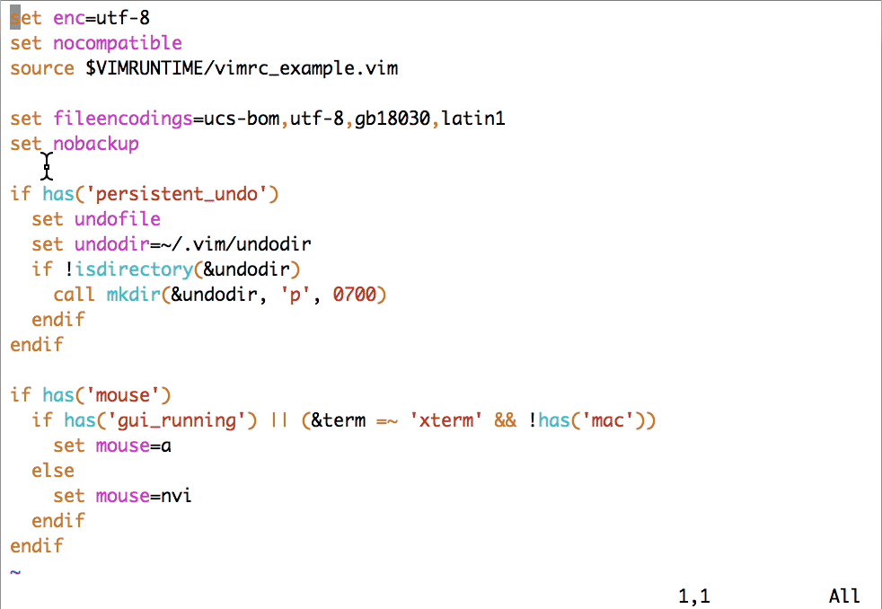

[TOC]

查看下面的键盘图。简单说明一下，这张图上展示了一个键盘。图中的“•”表示，单个字母不是完整的命令，必须再有进一步的输入。比如，单个“g”没有意义，而“gg”表示跳转到文件开头。（对于命令后面明确跟一个动作的，如“c”，我们不使用“•”。）一个键最多有三排内容：最底下是直接按键的结果，中间是按下 Shift 的结果（变大写），上面偏右的小字是按下 Ctrl 的结果。还用了一些特殊符号来表示操作的位置。


- “:q!”：退出 Vim
- “:wq”：存盘退出
- “:s”：执行替换
- “:!”：执行外部命令
- “:edit”（一般缩写为 “:e”）：编辑文件
- “:w”：写文件
- “:r”：读文件
- “:help”：查看帮助
- 使用键 Ctrl-D 和 Tab 来进行命令行补全

# Vim 的模式

Vim 有以下四种主要模式:

- 正常（normal）模式（也称为普通模式），缺省的编辑模式；如果不加特殊说明，一般提到的命令都直接在正常模式下输入；在任何其他模式中，都可以通过键盘上的 Esc 键回到正常模式。
- 插入（insert）模式，输入文本时使用；比如在正常模式下键入 i（insert）或 a（append）即可进入插入模式。
- 可视（visual）模式，用于选定文本块；教程中已经提到可以用键 v（小写）来按字符选定，Vim 里也提供其他不同的选定方法，包括按行和按列块。
- 命令行（command-line）模式，用于执行较长、较复杂的命令；在正常模式下键入冒号（:）即可进入该模式；使用斜杠（/）和问号（?）开始搜索也算作命令行模式。命令行模式下的命令要输入回车键（Enter）才算完成。

# Vim 的键描述体例

- <Esc\> 表示 Esc 键；显示为“⎋”
- <CR\> 表示回车键；显示为“↩”
- <Space\> 表示空格键；显示为“␣”
- <Tab\> 表示 Tab 键；显示为“⇥”
- <BS\> 表示退格键；显示为“⌫”
- <Del\> 表示删除键；显示为“⌦”
- <lt\> 表示 < 键；显示为“<”
- <Up\> 表示光标上移键；显示为“⇡”
- <Down\> 表示光标下移键；显示为“⇣”
- <Left\> 表示光标左移键；显示为“⇠”
- <Right\> 表示光标右移键；显示为“⇢”
- <PageUp\> 表示 Page Up 键；显示为“⇞”
- <PageDown\> 表示 Page Down 键；显示为“⇟”
- <Home\> 表示 Home 键；显示为“↖”
- <End\> 表示 End 键；显示为“↘”
- <F1\> - <F12\> 表示功能键 1 到 12；显示为“F1”到“F12”
- <S-…\> Shift 组合键；显示为“⇧”（较少使用，因为我们需要写 ! 而不是 
- <S-1\>；和特殊键组合时仍然有用）
- <C-…\> Control 组合键；显示为“⌃”
- <M-…\> Alt 组合键；显示为“⌥”（对于大部分用户，它的原始键名 Meta 应该只具有历史意义）
- <D-…\> Command 组合键；显示为“⌘”（Mac 键盘）

Esc、Enter、v、V 和 Ctrl-V，按现在的描述惯例，以后就会写成 <Esc\>、<CR\>、v、V 和 <C-V\>。

这里要强调一下，对“<”的特殊解释仅在描述输入时生效。在描述命令行和代码时，我们写“<CR\>”仍表示四个字符，而非回车键。特别是，如果我们描述的命令行首是“:”，表示这是一个输入 : 开始的 Vim 命令行模式命令（以回车键结束）；如果行首是“/”或“?”，表示这是一个输入 / 或 ? 开始的搜索命令（以回车键结束）；如果行首是“\$”，表示这是一个在 shell 命令行上输入的命令（以回车键结束），“\$”（和后面的空格）不是命令的一部分，通常后续行也不是命令的一部分，除非行尾有“\”或“^”字符，或行首有“\$”字符。也就是说，下面的命令是在 Vim 里输入“:set ft?<CR\>”（用来显示当前编辑文件的文件类型）：

```
:set ft?
```


下面的命令则是在 shell 里输入“which vim<CR\>”（用来检查 vim 命令的位置）：

```
$ which vim
/usr/bin/vim
```


此外，用[“:help”](https://yianwillis.github.io/vimcdoc/doc/help.html)描述帮助命令时，不仅可以在 Vim 里输入这个命令来得到帮助，也可以点击这个帮助的链接，直接在线查看相应的中文帮助页面。

# Vim 的选项和配置

根据 Unix 下的惯例，Vim 的配置文件放在用户的主目录下，文件名通常是 .vimrc；而它在 Windows 下名字是 _vimrc。前面给出最基本的配置文件是这个样子的：

```
set enc=utf-8
set nocompatible
source $VIMRUNTIME/vimrc_example.vim
```

如果你熟悉 shell 语法，你肯定能看到不少熟悉的影子在里面。这三行完成了下列功能：

- 设置编辑文件的内码是 UTF-8（非所有平台缺省，但为编辑多语言文件所必需）
- 设置 Vim 不需要和 vi 兼容（仅为万一起见，目前大部分情况下这是缺省情况）
- 导入 Vim 的示例配置（这会打开一些有用的选项，如语法加亮、搜索加亮、命令历史、记住上次的文件位置，等等）

对于现代 Unix 系统上的 Vim 8，实际上只需要最后一句就足够了。对于现代 Windows 系统上的 Vim 8，中间的这句 set nocompatible 也可以删除。如果你在较老的 Vim 版本上进行配置，那么把这三行全放进去会比较安全。

## 备份和撤销文件

上面的基本设置会产生一个有人喜欢、但也有很多人感到困惑的结果：你修改文件时会出现结尾为“~”的文件，有文件名后面直接加“~”的，还有前面加“.”后面加“.un~”的。这是因为在示例配置里，Vim 自动设置了下面两个选项：

```
set backup
set undofile
```

前一个选项使得我们每次编辑会保留上一次的备份文件，后一个选项使得 Vim 在重新打开一个文件时，仍然能够撤销之前的编辑（undo），这就会产生一个保留编辑历史的“撤销文件”（undofile）了。


通常做法是，不产生备份文件，但保留跨会话撤销编辑的能力；因为有了撤销文件，备份其实也就没有必要了。同时，把撤销文件放在用户个人的特定目录下，既保证了安全，又免去了其他目录下出现不必要文件的麻烦。要达到这个目的，在 Linux/macOS 下会这么写：

```
set nobackup
set undodir=~/.vim/undodir
```
在 Windows 下这么写：
```
set nobackup
set undodir=~\vimfiles\undodir
```
无论哪种环境，都需要创建这个目录。可以用下面的命令来让 Vim 在启动时自动创建这个目录：

```
if !isdirectory(&undodir)  
	call mkdir(&undodir, 'p', 0700)
endif
```
&undodir 代表 undodir 这个选项的值

## 鼠标支持

在 Vim 的终端使用场景下，鼠标的选择有一定的歧义：是使用 Vim 的可视模式选择内容，并且只能在 Vim 里使用，还是产生 Vim 外的操作系统的文本选择，用于跟其他应用程序的交互，如果使用 xterm 兼容终端的话，通常的建议是：

- 在不按下修饰键时，鼠标选择产生 Vim 内部的可视选择。
- 在按下 Shift 时，鼠标选择产生操作系统的文本选择。

对于不兼容 xterm、不支持对 Shift 键做这样特殊处理的终端，一般会采用一种“绕过”方式，让 Vim 在某种情况下暂时不接管鼠标事件。通常的选择是在命令行模式下不使用鼠标。下面就分这两种情况来配置。

虽然最新的 Vim 缺省配置文件（示例配置文件会包含缺省配置），在大部分情况下已经可以自动设置合适的鼠标选项了，不过为照顾三种不同平台，还是手工设置一下：

```
if has('mouse')
  if has('gui_running') || (&term =~ 'xterm' && !has('mac'))
    set mouse=a
  else
    set mouse=nvi
  endif
endif
```

上面代码说的是，如果 Vim 有鼠标支持的话，那在以下任一条件满足时：

- 图形界面正在运行
- 终端是 xterm 兼容，并且不是 Mac（Mac 上的终端声称自己是 xterm，但行为并不完全相同）

将启用完全的鼠标支持（mouse=a）。特别是，此时鼠标拖拽就会在 Vim 里使用可视模式选择内容（只能在 Vim 里使用）。而当用户按下 Shift 键时，窗口系统接管鼠标事件，用户可以使用鼠标复制 Vim 窗口里的内容供其他应用程序使用。

否则（非图形界面的的终端，且终端类型不是 xterm），就只在正常模式（n）、可视模式（v）、插入模式（i）中使用鼠标。这意味着，当用户按下 : 键进入命令行模式时，Vim 将不对鼠标进行响应，这时用户就可以使用鼠标复制 Vim 窗口里的内容到其他应用程序里去了。



非 xterm 的鼠标支持在 macOS 和 Windows 下都有效。但在 Windows 下需要注意的一点是，如果使用非图形界面的 Vim 的话，应当在命令提示符（Command Prompt）的属性里关闭“快速编辑模式”（QuickEdit Mode），否则 Vim 在运行时将无法对鼠标事件进行响应。

## 中文支持

- 整个世界基本上在向 UTF-8 编码靠拢。

- 微软由于历史原因，内部使用 UTF-16；UTF-16 可以跟 UTF-8 无损转换。

- GB2312、GBK、GB18030 是一系列向后兼容的中文标准编码方式，GB2312 编码的文件是合法的 GBK 文件，GBK 编码的文件是合法的 GB18030 文件。但除了 GB18030，都不能做到跟 UTF-8 无损转换；目前非 UTF-8 的简体中文文本基本上都用 GBK/GB18030 编码（繁体中文文本则以 Big5 居多）。鉴于 GB18030 是国家标准，其他两种编码也和 GB18030 兼容。

举一个具体的例子，“你好😄”这个字符串，在 UTF-8 编码下是下面 10 个字节（按字符进行了分组）：

```
e4bda0 e5a5bd f09f9884
```

如果使用 GB18030 编码（GB2312/GBK 不能支持表情字符）的话，会编码成 8 个字节：

```
c4e3 bac3 9439fd30
```

这么看起来，GB18030 处理中文在存储效率上是优势的。但它也有缺点：

- GBK 外的 Unicode 字符一般需要四字节编码（非中文情况会劣化）
- GBK 外的 Unicode 字符跟 Unicode 码点需要查表才能转换（UTF-8 则可以用非常简单的条件判断、移位、与、或操作来转换）
- 一旦出现文件中有单字节发生损毁，后续的所有中文字符都可能发生紊乱（而 UTF-8 可以在一个字符之后恢复）

因此，GB18030 在国际化的软件中不会作为内码来使用，只会是读取 / 写入文件时使用的转换编码。要让 Vim 支持 GB18030 也同样是如此。由于 UTF-8 编码是有明显规律的，并非任意文件都能成功地当成 UTF-8 来解码，一般使用的解码顺序是：

- 首先，检查文件是不是有 Unicode 的 BOM（字节顺序标记）字符，有的话按照 BOM 字符来转换文件内容。
- 其次，检查文件能不能当作 UTF-8 来解码；如果可以，就当作 UTF-8 来解释。
- 否则，尝试用 GB18030 来解码；如果能成功，就当作 GB18030 来转换文件内容。
- 最后，如果上面的解码都不成功，就按 Latin1 字符集来解码；由于这是单字节的编码，转换必定成功。

事实上，Vim 缺省差不多就是按这样的顺序，但第三步使用何种编码跟系统配置有关。如果你明确需要处理中文，那在配置文件里最好明确写下下面的选项设定：

```
set fileencodings=ucs-bom,utf-8,gb18030,latin1
```

## 图形界面的字体配置

Vim 在 Windows 下缺省使用的不是 TrueType 字体，不进行配置的话，字体会小得没法看。在 Windows 的缺省字体里，一般而言，Consolas 和 Courier New 比较合适。以 Courier New 为例，在 \_vimrc 里可以这样配置（Windows 上的基本写法是字体名称加冒号、“h”加字号；用“_”取代空格，否则空格需要用“\”转义）：

```
if has('gui_running')
  set guifont=Courier_New:h10
endif
```

字体名称如何写是件平台相关的事（可参见帮助文档 [“:help gui-font”](https://yianwillis.github.io/vimcdoc/doc/gui.html#gui-font)。如果你不确定怎么写出你需要的字体配置，或者你怎么写都写不对的话，可以先使用图形界面的菜单来选择（通常是“编辑 > 选择字体”；在 MacVim 里是“Edit > Font > Show Fonts”），然后使用命令“:set guifont?”来查看。

> 注意，Vim 在设置选项时，空格需要用“\”进行转义。比如，如果我们要在 Ubuntu 下把字体设成 10 磅的 DejaVu Sans Mono，就需要写：

```
" Linux 和 Windows 不同，不能用 '_' 取代空格
set guifont=DejaVu\ Sans\ Mono\ 10
```

此外，宽字符字体（就是中文字体了）是可以单独配置的。如果操作系统语言设定里，中文不是第一选择的话，就有可能在显示中文时出现操作系统误用日文字体的情况。这时要手工选择一个中文字体，比如在 Ubuntu 下，可以用：

```
set guifontwide=Noto\ Sans\ Mono\ CJK\ SC\ 11
```

注意，在不同的中英文字体搭配时，并不需要字号相同。事实上，在 Windows 和 Linux 上通常都是使用不同字号的中英文字体的。


在上面的动图中，可以观察到设了中文字体之后，不仅中文字变大，更美观了，“将”、“适”、“关”、“复”、“启”等字的字形也同时发生了变化。

https://github.com/adah1972/geek_time_vim

关于这个配置文件，这里做个备注说明：主（master）分支可以用在类 Unix 平台上，windows 分支则用在 Windows 上。适用于这节内容标签是 l2-unix 和 l2-windows：可以用 git checkout l2-unix 或 git checkout l2-windows 来得到相应平台对应本讲的配置文件。
