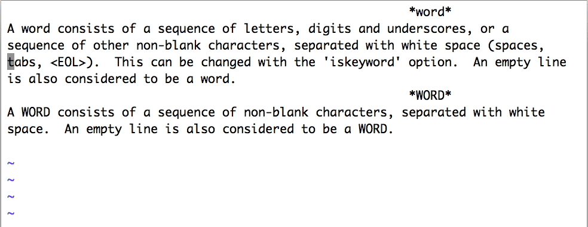
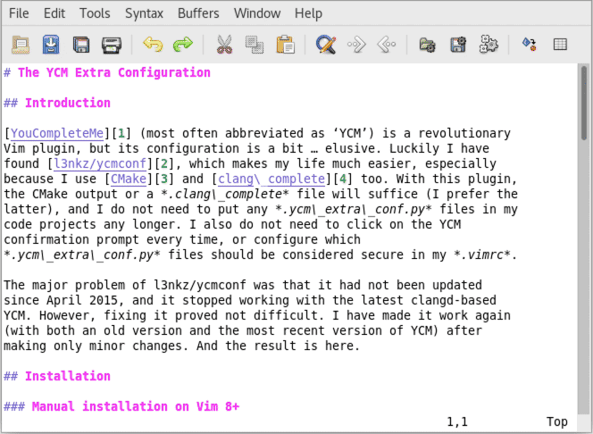
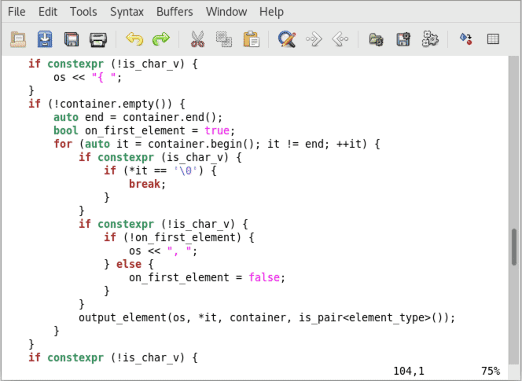
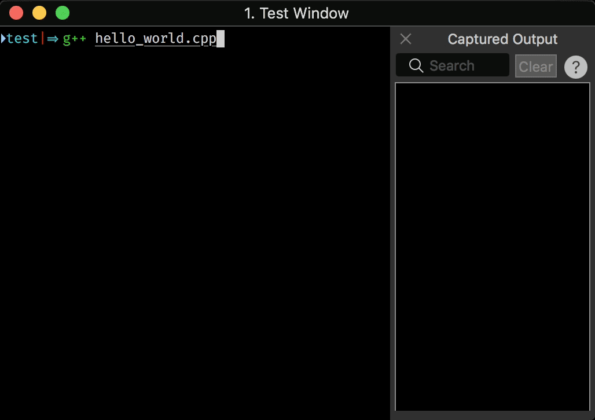
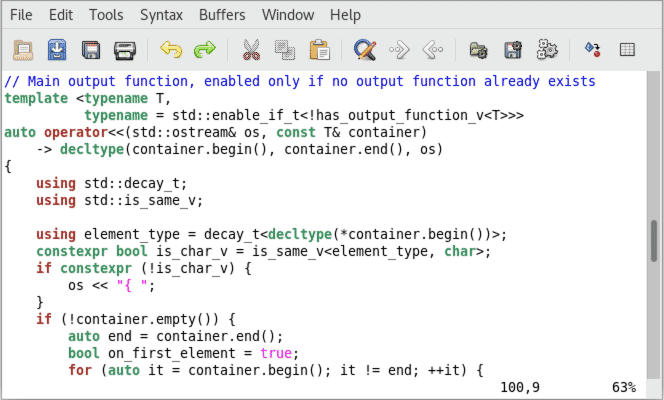

[TOC]

# 光标移动

Vim 里的基本光标移动是通过 h、j、k、l 四个键实现的。之所以使用这四个键，是有历史原因的。看一下 Bill Joy 开发 vi 时使用的键盘就明白了：这个键盘上没有独立的光标键，而四个光标符号直接标注在 H、J、K、L 四个字母按键上。


Vim 跳转到行首的命令是 0，跳转到行尾的命令是 $，这两个命令似乎没什么特别的原因，一般用 <Home\>和 <End\>也没什么不方便的，虽然技术上它们有一点点小区别。如果感兴趣、想进一步了解的话，可以参考帮助[:help] (https://yianwillis.github.io/vimcdoc/doc/motion.html#%3CHome%3E) 。此外有 ^，用来跳转到行首的第一个非空白字符。

对于一次移动超过一个字符的情况，Vim 支持使用 b/w 和 B/W，来进行以单词为单位的跳转。它们的意思分别是 words Backward 和 Words forward，用来向后或向前跳转一个单词。小写和大写命令的区别在于，小写的跟编程语言里的标识符的规则相似，认为一个单词是由字母、数字、下划线组成的（不严格的说法），而大写的命令则认为非空格字符都是单词。



根据单个字符来进行选择也很常见。比如，现在光标在 if (frame->fr_child != NULL) 第五个字符上，如果我们想要修改括号里的所有内容，需要仔细考虑 w 的选词规则，然后输入 c5w 吗？这样显然不够方便。

这种情况下，就需要使用 f（find）和 t（till）了。它们的作用都是找到下一个（如果在输入它们之前先输入数字 n 的话，那就是下面第 n 个）紧接着输入的字符。两者的区别是，f 会包含这个字符，而 t 不会包含这个字符。在上面的情况下，我们用 t 就可以了：ct) 就可以达到目的。如果需要反方向搜索的话，使用大写的 F 和 T 就可以。

对于写文字的情况，比如给开源项目写英文的 README，下面的光标移动键也会比较有用：

- ( 和 ) 移到上一句和下一句
- { 和 } 移到上一段和下一段



在很多环境（特别是图形界面）里，Vim 支持使用 <C-Home\> 和 <C-End\> 跳转到文件的开头和结尾。如果遇到困难，则可以使用 vi 兼容的 gg 和 G 跳转到开头和结尾行（小区别：G 是跳转到最后一行的第一个字符，而不是最后一个字符）。

# 文本修改

c 和 d 配合方向键，可以对文本进行更改。本质上，可以认为 c（修改）的功能就是执行 d（删除）然后 i（插入）。在 Vim 里，一般的原则就是，常用的功能，按键应尽可能少。因此很多相近的功能在 Vim 里会有不同的按键。不仅如此，大写键也一般会重载一个相近但稍稍不同的含义：

- d 加动作来进行删除（dd 删除整行）；D 则相当于 d\$，删除到行尾。
- c 加动作来进行修改（cc 修改整行）；C 则相当于 c$，删除到行尾然后进入插入模式。
- s 相当于 cl，删除一个字符然后进入插入模式；S 相当于 cc，替换整行的内容。
- i 在当前字符前面进入插入模式；I 则相当于 ^i，把光标移到行首非空白字符上然后进入插入模式。
- a 在当前字符后面进入插入模式；A 相当于 $a，把光标移到行尾然后进入插入模式。
- o 在当前行下方插入一个新行，然后在这行进入插入模式；O 在当前行上方插入一个新行，然后在这行进入插入模式。
- r 替换光标下的字符；R 则进入替换模式，每次按键（直到 <Esc\>）替换一个字符。
- u 撤销最近的一个修改动作；U 撤销当前行上的所有修改。

# 文本对象选择

可以使用 c、d 加动作键对这个动作选定的文本块进行操作，也可以使用 v 加动作键来选定文本块（以便后续进行操作）。不过还有几个动作只能在 c、d、v、y 这样命令之后用。

这些选择动作的基本附加键是 a 和 i。其中a 可以简单理解为英文单词 a，表示选定后续动作要求的完整内容，而 i 可理解为英文单词 inner，代表后续动作要求的内容的“内部”。来看一下具体的例子。假设有下面的文本内容：

```
if (message == "sesame open")
```

进一步假设光标停在“sesame”的“a”上，那么（和一般的行文惯例不同，下面在命令外面也加上了引号，避免可能的歧义）：

- 'dw'（理解为 delete word）会删除“ame␣”，结果是“if (message == "sesopen")”
- ‘diw’（理解为 delete inside word）会删除“sesame”，结果是“if (message == " open")”
- ‘daw’（理解为 delete a word）会删除“sesame␣”，结果是“if (message == "open")”
- ‘diW’会删除""sesame"，结果是“if (message == open")”
- ‘daW’会删除“"sesame␣”，结果是“if (message == open")”
- ‘di'会删除“sesame open”，结果是“if (message == "")”
- ‘da"’会删除“"sesame open"”，结果是“if (message ==)”
- ‘di(’或‘di)’会删除“message == "sesame open"”，结果是“if ()”
- ‘da(’或‘da)’会删除“(message == "sesame open")”，结果是“if␣”

上面演示了 a、i 和 w、双引号、圆括号搭配使用，这些对于任何语言的代码编辑都是非常有用的。实际上，可以搭配的还有更多：


- 搭配 s（sentence）对句子进行操作——适合西文文本编辑
- 搭配 p（paragraph) 对段落进行操作——适合西文文本编辑，及带空行的代码编辑
- 搭配 t（tag）对 HTML/XML 标签进行操作——适合 HTML、XML 等语言的代码编辑
- 搭配 \` 和 ' 对这两种引号里的内容进行操作——适合使用这些引号的代码，如 shell 和 Python
- 搭配方括号（“[”和“]”）对方括号里的内容进行操作——适合各种语言（大部分都会用到方括号吧）
- 搭配花括号（“{”和“}”）对花括号里的内容进行操作——适合类 C 的语言
- 搭配角括号（“<”和“>”）对角括号里的内容进行操作——适合 C++ 的模板代码

再进一步，在 a 和 i 前可以加上数字，对多个（层）文本对象进行操作。下面图中是一个示例：




# 更快地移动

可以使用 <PageUp\> 和 <PageDown\> 来翻页，但 Vim 更传统的用法是 <C-B\> 和 <C-F\>，分别代表 Backward 和 Forward。

除了翻页，Vim 里还能翻半页，有时也许这种方式更方便，需要的键是 <C-U\> 和 <C-D\>，Up 和 Down。如果知道出错位置的行号，那你可以用数字加 G 来跳转到指定行。类似地，可以用数字加 | 来跳转到指定列。这在调试代码的时候非常有用，尤其适合进行自动化。

下图中展示了 iTerm2 中[捕获输出](https://www.iterm2.com/documentation-captured-output.html) 并执行 Vim 命令的过程（用 vim -c 'normal 5G36|' 来执行跳转到出错位置第 5 行第 36 列）：



（如果用 iTerm2 并对这个功能感兴趣，设置的正则表达式是 ^([_a-zA-Z0-9+/.-]+):([0-9]+):([0-9]+): (?:fatal error|error|warning|note):，捕获输出后执行的命令是 echo "vim -c 'normal \2G\3|' \1"。）

只关心当前屏幕的话，可以快速移动光标到屏幕的顶部、中间和底部：用 H（High）、M（Middle）和 L（Low）就可以做到。

vimrc_example 有一个设定：它会设 set scrolloff=5，导致只要屏幕能滚动，光标就移不到最上面的 4 行和最下面的 4 行里，因为一移进去屏幕就会自动滚动。这同样也会导致 H 和 L 的功能发生变化：本来是移动光标到屏幕的最上面和最下面，现在则变成了移动到上数第 6 行和下数第 6 行，和没有这个设定时的 6H 与 6L 一样了。所以一般会在 Vim 配置文件里设置 set scrolloff=1（你也可以考虑设成 0），减少这个设置的干扰。

只要光标还在屏幕上，可以滚动屏幕而不移动光标（不像某些其他编辑器，Vim 不允许光标在当前屏幕以外）。需要的按键是 <C-E\> 和 <C-Y\>。另外一种可能更实用的滚动屏幕方式是，把当前行“滚动”到屏幕的顶部、中部或底部。Vim 里的对应按键是 zt、zz 和 zb。和上面的几个滚动相关的按键一样，它们同样受选项 scrolloff 的影响。



# 重复，重复，再重复

如何更高效地解决重复的操作。在 Vim 里有非常多的命令，而且很多命令都需要敲好几个键。如果要重复这样的命令，每次都要再手敲一遍，这显然是件很费力的事。作为追求高效率的编辑器，这当然是不可接受的。除了以后要学到的命令录制、键映射、自定义脚本等复杂操作外，Vim 对很多简单操作已经定义了重复键：

- ; 重复最近的字符查找（f、t 等）操作
- , 重复最近的字符查找操作，反方向
- n 重复最近的字符串查找操作（/ 和 ?）
- N 重复最近的字符串查找操作（/ 和 ?），反方向
- . 重复执行最近的修改操作

 GitHub 上看配置文件。配置文件有一处改动。类似地，适用于本讲的内容标签是 l3-unix 和 l3-windows。
