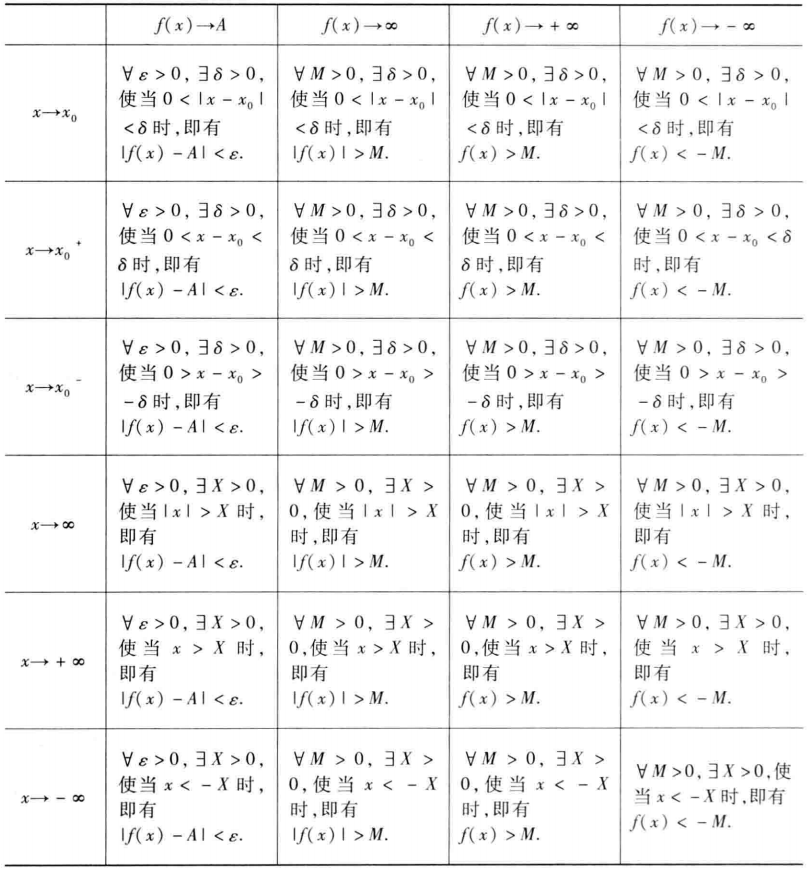

[TOC]

# 一 函数与极限

## 1.1 映射与函数

- 映射（又称为算子）泛函 变换 函数
- 像    
- 原像 
- 满射 
- 单射 
- 一一映射（或双射） 
- 逆映射
- 复合映射

**1.函数的概念**

设数集$D\subset R$，则称映射 $f:D \rightarrow R$ 为定义在D上的函数，通常简记为
$$
y = f(x), x \in D
$$
其中$x$称为自变量，$y$ 称为因变量， $D$ 称为定义域， 记作$D_f$， 即 $D_f = D$。

- 定义域
- 值域
- 函数关系

表示函数的主要方法有三种：表格法、图形法、解析法（公式法）

- 绝对值函数

- 阶梯函数

- 取整函数

- 分段函数

**2.函数的几种特性**

- （1）函数的有界性
- （2）函数的单调性
- （3）函数的奇偶性
- （4）函数的周期性
  - 狄利克雷（Dirichlet）函数

**3.反函数与复合函数**

**4.函数的运算**

设函数 $f(x), g(x)$ 的定义域依次为$D_f,D_g,D=D_f \bigcap D_g \neq \varnothing$，则我们可以定义这两个函数的下列运算：

和（差）$f\pm g$ ：$(f\pm g)(x) = f(x) \pm g(x), x \in D$；

积 $f \cdot g$：$(f \cdot g)(x) = f(x) \cdot g(x), x\in D$；

商 $\frac{f}{g}$：$(\frac{f}{g})(x) = \frac{f(x)}{g(x)}, x\in D \setminus \{x | g(x) = 0, x \in D\}$；

**5.初等函数**

基本初等函数

- 幂函数：$y = x^{\mu}$ （$\mu \in R$是常数）
- 指数函数：$y = a^x$（$a > 0$ 且 $a \neq 1$）
- 对数函数：$y = \log_{a}{x}$ （$a > 0$ 且 $a \neq 1$，特别当$a = e$时，记为$y = \ln{x}$）
- 三角函数：如 $y = \sin x, y = \cos x, y = \tan x$ 等
- 反三角函数：如 $y = \arcsin x, y = \arccos x, y = \arctan x$ 等

由常数和基本初等函数经过有限次的四则运算和有限次的函数复合步骤所构成并可用一个式子表示的函数称为初等函数。

双曲函数

- 双曲正弦 $\sinh x= \frac{e^x - e^{-x}}{2}$
- 双曲余弦 $\cosh x = \frac{e^x + e^{-x}}{2}$
- 双曲正切 $\tanh x = \frac{\sinh x}{\cosh x} = \frac{e^x - e^{-x}}{e^x + e^{-x}}$

$$
\sinh(x+y) = \sinh x\cosh y + \cosh x \sinh y  \\
\sinh(x-y) = \sinh x\cosh y - \cosh x \sinh y  \\
\cosh(x+y) = \cosh x\cosh y + \sinh x \sinh y  \\
\cosh(x-y) = \cosh x\cosh y - \sinh x \sinh y  \\
$$

反双曲函数

- 反双曲正弦 $y = \sinh^{-1} x$
- 反双曲余弦 $y = \cosh^{-1} x$
- 反双曲正切 $y = \tanh^{-1} x$

## 1.2 数列的极限

- 数列
- 割圆术
- 极限
- 一般项（通项）

数列极限定义：

定义 设 $\{x_n\}$ 为一数列，如果存在常数 $a$，对于任意给定的正数 $\varepsilon $（不论它多么小），总存在正整数$N$，使得当 $n>N$时，不等式
$$
|x_n- a| < \varepsilon
$$
都成立，那么就称常数$a$是数列$\{x_n\}$的极限，或者称数列$\{x_n\}$收敛于 $a$，记为
$$
\lim_{x \rightarrow \infty} x_n = a, \quad or \quad x_n \rightarrow a(n \rightarrow \infty)
$$

收敛数列的性质：

- 定理1（极限的唯一性）如果数列$\{x_n\}$ 收敛，那么它的极限唯一。
- 定理2（收敛数列的有界性）如果数列$\{x_n\}$ 收敛，那么数列$\{x_n\}$ 一定有界。
- 定理3（收敛数列的保号性）如果 $\underset{x \rightarrow \infty}\lim x_n = a$ ，且$a>0$（或$a<0$），那么存在正整数$N$，当$n > N$时，都有$x_n>0$（或$x_n<0$）。
  - 推论 如果数列 $\{x_n\}$ 从某项起有 $x_n \geqslant 0$（或$x_n \leqslant 0$） ，且$\underset{x \rightarrow \infty}\lim x_n = a$ ，那么 $a \geqslant 0$（或$a \leqslant 0$）。
- 定理4 （收敛数列与其子数列间的关系）如果数列$\{x_n\}$收敛于$a$，那么它的任一子数列也收敛，且极限也是 $a$。

## 1.3 函数的极限

### 函数的极限的定义

**1.自变量趋于有限值时函数的极限**

**定义1 设函数$f(x)$ 在点 $x_0$ 的某一去心邻域内有定义。如果存在常数$A$ ，对于任意给定的正数 $\epsilon$（不论它多么小），总存在正数 $\delta$，使得当 $x$ 满足不等式$0 <|x - x_0| < \delta$时，对应的函数值 $f(x)$都满足不等式**
$$
|f(x) - A| < \epsilon,
$$
**那么常数 $A$ 就叫做函数$f(x)$ 当$x \rightarrow x_0$时的极限，记作**
$$
\underset{x \rightarrow x_0}{lim} f(x) = A \quad or \quad f(x) \rightarrow A \ (while \ x \rightarrow x_0) 
$$

- 左极限
- 右极限

**2.自变量趋于无穷大时函数的极限**

**定义2  设函数 $f(x)$ 当 $|x|$ 大于某一正数时，有定义。如果存在常数 $A$ ，对于任意给定的正数 $\epsilon$（不论它多么小），总存在着正数 $X$，使得当$x$满足不等式 $|x| > X$时，对应的函数值 $f(x)$都满足不等式** 
$$
|f(x) - A| < \epsilon
$$
**那么常数 $A$ 就叫做函数 $f(x)$ 当 $x \rightarrow \infty$ 时的极限，记作** 
$$
\underset{x \rightarrow \infty}{lim} f(x) = A \quad or \quad f(x) \rightarrow A \quad (while \ x \rightarrow \infty)
$$

### 函数极限的性质

**定理1 （函数极限的唯一性）如果 $\underset{x \rightarrow x_0}{lim} f(x)$存在，那么这极限唯一**

**定理2 （函数极限的局部有界性）如果 $\underset{x \rightarrow x_0}{lim} f(x) = A$ ，那么存在常数 $M > 0$ 和 $\delta > 0$，使得当 $0 < | x - x_0| < \delta$时，有$|f(x)| \leq M$**

证明：
$$
Because \ \underset{x \rightarrow x_0}{lim} f(x) = A, therefore \ set \ \epsilon = 1, then \ \exist \epsilon > 0, while \ 0 < |x - x_0| < \delta,\  have \\
 |f(x) - A| < 1 \Rightarrow |f(x)| \leqslant |f(x) - A| + |A| < |A| + 1, \\
 set \ M = |A| + 1, \ then \  theorem \  2 \ will \  be \ proved
$$
**定理3 （函数极限的局部保号性）如果 $\underset{x \rightarrow x_0}{lim} f(x) = A$， 且 $A > 0 (or \ A < 0)$，那么存在常数 $\delta > 0$，使得当 $0<|x-x_0|<\delta$时，有 $f(x) > 0 (or \ f(x) < 0)$**

证明：
$$
Proof\ of\ the\ situation\ A > 0 \\
Because \ \underset{x \rightarrow x_0}{lim} f(x) = A > 0, \ therefore, \ set\  \delta = \frac{A}{2} > 0, then\ \exist \delta > 0,\ while \ 0<|x - x_0|<\delta, have \\
|f(x) - A| < \frac{A}{2} \Rightarrow f(x) > A - \frac{A}{2} = \frac{A}{2} > 0 \\
A\ similar\ provable\ situation\ A < 0
$$

**定理 3' 如果 $\underset{x \rightarrow x_0}{lim} f(x) = A \ (A \neq 0)$，那么就存在着 $x_0$ 的某一去心邻域 $\overset{\circ}{U}(x_0)$，当 $x in \overset{\circ}{U}(x_0)$ 时，就有 $|f(x)| > \frac{|A|}{2}$**

**推论   如果在 $x_0$ 的某去心邻域内 $f(x) \geqslant 0 \ (or \ f(x) \leqslant 0)$，而且 $\underset{x \rightarrow x_0}{lim} f(x) = A$，那么$A \geqslant 0 \ (or \ A \leqslant 0)$**

**定理4（函数极限与数列极限的关系）如果极限 $\underset{x \rightarrow x_0}{lim} f(x)$存在，$\{ x_n \}$ 为函数 $f(x)$ 的定义域内任一收敛于 $x_0$的数列，且满足：$x_n \neq x_0 \ (n \in N_+)$，那么相应的函数值数列 $\{f(x_n)\}$ 必收敛，且$\underset{n \rightarrow \infty}{lim} f(x_n) = \underset{x \rightarrow x_0}{lim} f(x)$**

证明：
$$
\begin{align}
& Assume \ \underset{x \rightarrow x_0}{lim} f(x) = A,\ then \ \forall \ \epsilon > 0, \ \exist \ \delta > 0, \ while \ 0 < |x - x_0| < \delta, \ have \ |f(x) - A| < \epsilon. \\
& also \ because \ \underset{n \rightarrow \infty}{lim}x_n = x_0, \ therefore \ for \ \delta > 0,\ \exist N, \ while \ n>N, \ have\ |x_n - x_0| < \delta \\
& by\ hypothesis,\ x_n \neq x_0 \ (n \in N_+),  \ therefore\ while\ n > N, \ 0 < |x_n - x_0| < \delta, \  thereby \ |f(x_n) - A| < \epsilon. \ which\ is \underset{n \rightarrow \infty}{lim}f(x_n) = A.
\end{align}
$$

## 1.4 无穷大与无穷小

**一、无穷小**

**定义1 如果函数 $f(x)$ 当 $x \rightarrow x_0$ （或 $x \rightarrow \infty$）时的极限为零，那么称函数 $f(x)$ 为当 $x \rightarrow x_0$（或 $x \rightarrow \infty$）时的无穷小 ** 

**定理1   在自变量的同一变化过程 $x \rightarrow x_0$ （或 $x \rightarrow \infty$ ）中，函数 $f(x)$ 具有极限 A 的充分必要条件是 $f(x) = A + \alpha$，其中 $\alpha$ 是无穷小 **

证明： 先证明必要性。设 $\underset{x \rightarrow x_0}{lim}f(x) = A$， 则 $\forall \epsilon > 0, \exist \delta > 0$，使当 $0 < |x - x_0| < \delta$时，有
$$
|f(x) - A| < \epsilon
$$
令 $\alpha = f(x) - A$， 则 $\alpha$ 是当 $x \rightarrow x_0$ 时的无穷小，且
$$
f(x) = A + \alpha
$$
这就证明了 $f(x)$ 等于它的极限 A 与一个无穷小之和。

再证充分性。设 $f(x) = A + \alpha$， 其中A是常数， $\alpha$是当 $x \rightarrow x_0$ 时的无穷小，于是
$$
|f(x) - A| = |\alpha|
$$
因 $\alpha$ 是当 $x \rightarrow x_0$时的无穷小，所以 $\forall \epsilon > 0, \exist \delta > 0$，使当 $0 < |x - x_0| < \delta$ 时，有
$$
|\alpha| < \epsilon
$$
即
$$
|f(x) - A| < \epsilon
$$
这就证明了 A 是 $f(x)$ 当 $x \rightarrow x_0$ 时的极限。

**二、无穷大**

**定义2 设函数 $f(x)$ 在 $x_0$ 的某一去心邻域内有定义（或 $|x|$ 大于某一正数时有定义）。如果对于任意给定的正数 M（不论它多么大），总存在正数 $\delta$ （或正数 X），只要 $x$ 适合不等式 $0 < |x - x_0| < \delta$ （或 $|x| > X$），对应的函数值 $f(x)$ 总满足不等式   **
$$
|f(x)| > M,
$$
**那么称函数 $f(x)$ 是当 $x \rightarrow x_0$  （或 $x \rightarrow \infty$）时的无穷大。**

**定理2 在自变量的同一变化过程中，如果 $f(x)$ 为无穷大，那么 $\frac{1}{f(x)}$ 为无穷小；反之，如果 $f(x)$ 为无穷小，且 $f(x) \neq 0$ ，那么 $\frac{1}{f(x)}$ 为无穷大。**

证明： 设 $\underset{x \rightarrow x_0}{lim} f(x) = \infty$.

$\forall \epsilon > 0.$ 根据无穷大的定义，对于 $M = \frac{1}{\varepsilon}, \exist \delta > 0$，当$0< |x - x_0| < \delta$ 时，有
$$
|f(x)| > M = \frac{1}{\varepsilon}
$$
即
$$
|\frac{1}{f(x)}| < \varepsilon
$$
所以 $\frac{1}{f(x)}$ 为当 $x \rightarrow x_0$时的无穷小。

反之，设 $\underset{x \rightarrow x_0}{lim} f(x) = 0$，且 $f(x) \neq 0$。

$\forall M > 0$。根据无穷小的定义，对于 $\varepsilon = \frac{1}{M}, \exist \delta > 0$，当$0 < |x - x_0| < \delta$时，有
$$
|f(x)| < \varepsilon = \frac{1}{M},
$$
由于当 $0 < |x - x_0| < \delta$ 时 $f(x) \neq 0$ ，从而
$$
|\frac{1}{f(x)}| > M
$$
所以 $\frac{1}{f(x)}$ 为当 $x \rightarrow x_0$ 时的无穷大。

**证明：函数$ y = \frac{1}{x} \sin \frac{1}{x}$ 在区间 (0, 1] 内无界，但这函数不是 $x \rightarrow 0^+$ 时的无穷大。 **

证： 先证函数$ y = \frac{1}{x} \sin \frac{1}{x}$ 在区间 (0, 1] 内无界。

因为 $\forall M > 0$，在 (0, 1] 中总可找到点 $x_0$ ，使 $f(x_0) > M$。例如，可取 $x_0 = \frac{1}{2 k \pi + \frac{\pi}{2}} (k \in N)$，则 $f(x_0) = 2k\pi + \frac{\pi}{2}$，当 $k$ 充分大时，可使 $f(x_0) > M$ 。所以 $y = \frac{1}{x} \sin \frac{1}{x}$ 在 (0, 1] 内无界。

再证函数 $y = f(x) = \frac{1}{x}\sin \frac{1}{x}$ 不是 $x \rightarrow 0^+$ 时的无穷大。

因为 $\forall M > 0, \delta > 0$，总可找到点 $x_0$，使 $0 < x_0 < \delta$，但 $f(x_0) < M$。例如，可取 $x_0 = \frac{1}{2k\pi} (k\in N_+)$，当 $k$ 充分大时，$0 < x_0 < \delta$， 但 $f(x_0) = 2k\pi \sin 2k \pi=0 < M$。所以  $y = \frac{1}{x}\sin \frac{1}{x}$ 不是 $x \rightarrow 0^+$ 时的无穷大。

